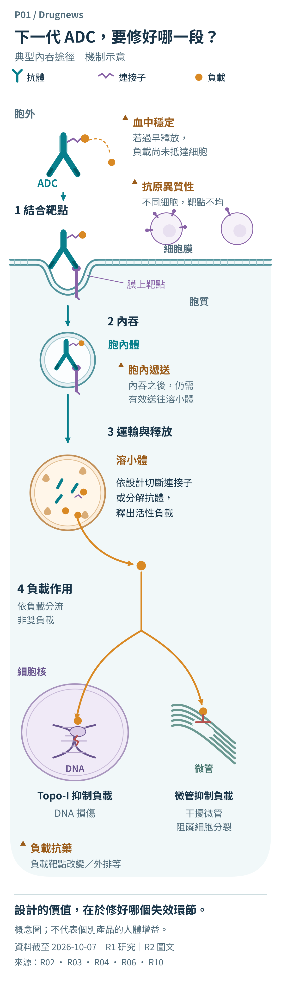
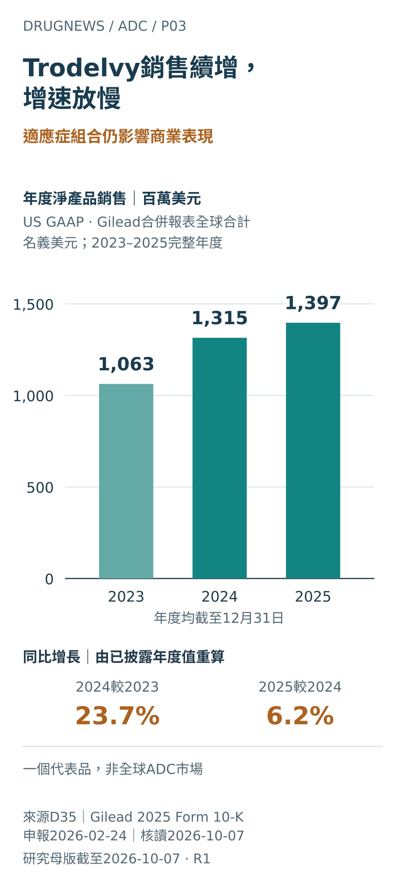
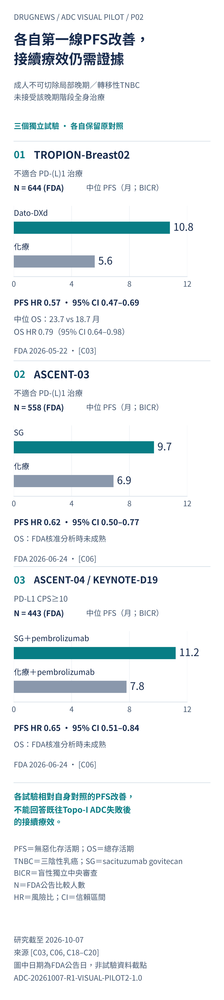

# ADC 走向第一線之後：哪些差異真正值得藥廠買單？

先看一支 ADC 如何工作，再問科學差異如何成為可用的治療、可交付的產品與值得合作的資產。

**ADC-20261007-R1 → ADC-20261007-R1-LAYERED-HTML-R2-EVIDENCE-1.0**

資料截至2026-10-07（Asia/Taipei）。編輯組織／作者歸屬：Drugnews 藥時事。完整繁中稿；未發布。

ADC（antibody–drug conjugate，抗體藥物複合體）把三個部分接成一支藥：抗體辨識細胞表面靶點；連接子把抗體與負載接在一起，影響穩定與釋放；細胞毒性負載在到達作用位置後干擾癌細胞存活。這種設計讓「送到哪裡」與「如何殺傷」可以分別改進，也讓任何一段失效都可能限制整支藥。[R02](#R02)[R06](#R06)

產業的重要變化，是部分 ADC 已從較後線走進第一線與早期癌症，代表品也已有可觀察的年度產品銷售。下一個產品將面對改變中的標準治療、既往用藥與供應需求。本報告要回答的是：**哪一種設計改善了具體失效環節，什麼證據足以支持使用，企業又必須交付什麼，這項差異才值得支付對價？**[C01](#C01)[C02](#C02)[C03](#C03)[C06](#C06)[D35](#D35)

## 閱讀目錄

- [01　ADC 如何工作：每個環節都是設計問題](#mechanism)
- [02　銷售已形成，前線治療正在改變產品位置](#position)
- [03　企業如何把平台接成可交付的產品](#competition)
- [04　把工程名詞翻成可驗證的改善](#technology)
- [05　「新一代」之外，證據走到哪裡？](#maturity)
- [06　最有價值的缺口：ADC 之後怎麼治？](#sequence)
- [07　第一線 TNBC：先分患者，再談競爭](#tnbc)
- [08　更好的治療窗，要看完整給藥過程](#window)
- [09　平台成熟之後，監管仍逐項檢驗](#regulatory)
- [10　製造競爭：合格批次之外，還有承諾彈性](#manufacturing)
- [11　最高總額，沒有告訴你的買單內容](#transactions)
- [12　台灣創新：不同技術位置，需要不同證據](#taiwan-innovation)
- [13　台灣交付：可用能力如何接成供應](#taiwan-delivery)
- [14　未來十二個月，什麼事件會改變判斷？](#events)
- [15　把差異的價值，落在下一個決策](#decision)
- [附錄 A　全球公司與合作地圖](#global-map)
- [附錄 B　台灣能力與證據地圖](#taiwan-map)
- [附錄 C　公式、來源範圍與更新方法](#methods)

## 01　ADC 如何工作：每個環節都是設計問題

ADC的抗體辨識細胞表面靶點，連接子把抗體與細胞毒性負載接在一起。圖中的典型內吞路徑依序是：結合膜上靶點、內吞進入胞內體、運輸至溶小體，再依設計切斷連接子或分解抗體，釋出活性負載。[R02](#R02)[R06](#R06)

### P01｜下一代ADC，要修好哪一段？

**ADC如何把負載送到作用位置？下一代設計要改善哪個失效環節？**

下一代設計的價值，在於改善特定失效環節。

沿典型內吞路徑對照四個可檢驗環節：血中穩定、抗原異質性、胞內遞送與負載抗藥。兩條負載作用分支代表替代類別。

研究截至2026-10-07；R10發表2019-04-01，新增核讀2026-10-07。概念圖；無量化單位或幣種。 [R02](#R02)[R03](#R03)[R04](#R04)[R06](#R06)[R10](#R10)

[SVG](figures/P01_ZH.svg) · [PNG](figures/P01_ZH.png) · [P01_mechanism.json](data/P01_mechanism.json) · [Figure source index](figure_sources.json)

負載的作用位置取決於作用類別：Topo-I抑制負載作用於細胞核內的DNA處理機制；微管抑制負載作用於胞質微管。兩條分支是替代機制，這張概念圖不代表雙負載產品或特定候選藥已有人體增益。[R03](#R03)[R06](#R06)

因此，下一項設計要先回答四個問題：辨識是否足夠、負載是否提早釋放、內吞後是否送達，以及負載到了之後是否仍有效。這把技術名詞變成可以設計實驗、再用人體資料檢驗的假說。[R02](#R02)[R03](#R03)[R06](#R06)

## 02　銷售已形成，前線治療正在改變產品位置

ADC的商業化，已能在代表品的年度銷售中直接觀察。Gilead的2025年Form 10-K列出，Trodelvy（sacituzumab govitecan，簡稱SG）年度淨產品銷售從2023年的1,063百萬美元，增加至2024年的1,315百萬美元、2025年的1,397百萬美元。依這三個已披露值重算，同比增長分別為23.7%與6.2%。這是Gilead合併報表跨美國、歐洲及其他地區的單一產品合計，以名義美元呈現；未加計合作金、權利金，也不代表全球ADC市場。[D35](#D35)

### P03｜Trodelvy銷售續增，增速放慢

**已上市ADC的實際銷售是否持續增長，速度如何變化？**

一個產品的銷售仍增加，但增長速度與適應症組合需要一起讀。

三個年度均取自Gilead 2025年Form 10-K同一張表的Trodelvy Total欄；原值、單位與同比計算保留在相鄰正文及數據檔。柱高從零起算，百分比另列。

完整曆年／財年均截至12月31日。Gilead合併、全地域產品合計、US GAAP淨銷售、名義美元；申報2026-02-24，核讀2026-10-07。 [D35](#D35)

[SVG](figures/P03_ZH.svg) · [PNG](figures/P03_ZH.png) · [P03_sales.csv](data/P03_sales.csv) · [P03_sales.json](data/P03_sales.json) · [Figure source index](figure_sources.json)

Gilead將2025年的增長主要歸因於乳癌治療需求，並指出膀胱癌適應症撤回抵銷了部分增長；這是公司的因素歸因，財報沒有拆出各因素的金額。對開發者與買方而言，值得評估的是差異化能否守住或擴大具證據支持的治療位置，以及失去某個適應症時，同一產品的其他適應症能否承接需求。[D35](#D35)

因此，臨床差異與商業交付應連著讀：更早線的隨機試驗可改變產品面向的患者群，但已認列銷售還取決於產品實際交付與淨價。這張圖截至2025完整年度；本報後文2026年的第一線核准不能倒過來解釋2025銷售。若新設計能在明確人群中形成可持續使用的優勢，並支撐可靠供應與臨床採用，它才有機會轉成產品收入。

### 治療前移，改變下一支藥面對的患者

一項 ADC 在重度治療患者中出現活性，與它成為第一線或早期癌症的選項，帶來的產業問題不同。前者先回答這個分子能不能治療疾病；後者會改變後續試驗遇到的患者。當用過 ADC 的人增加，過去在未接觸這類藥物族群中建立的療效，就需要重新檢驗。

### 比較表 F01｜治療位置正在前移；接續問題隨之改變

**核准擴張改變的是患者先前接觸過的治療，也改變下一項試驗應回答的問題。**

| 美國核准時間／位置 | 具體變化 | 對後續研發的含義 |
| --- | --- | --- |
| 2025-12-15 HER2+ 轉移性乳癌第一線 | T-DXd（trastuzumab deruxtecan，Enhertu）＋pertuzumab；DB09 支持。[C01](#C01) | 若第一線已用 DXd，後線研究需說明既往 ADC 暴露。 |
| 2026-05-15 HER2+ 早期乳癌 | 第II／III期術前T-DXd→THP；另核准符合條件的術後殘餘侵襲性病灶治療。[C02](#C02) | 兩項核准不等於已驗證術前、術後連用 T-DXd。 |
| 2026-05-22／06-24 特定第一線 TNBC | Dato-DXd（datopotamab deruxtecan，Datroway）；SG 單藥或與 pembrolizumab 併用。[C03](#C03)[C06](#C06) | 免疫治療適用性、PD-L1 條件與前治療須先分層。 |
| 2026-07-10 適合膀胱切除且可用cisplatin的MIBC | EV（enfortumab vedotin，Padcev）＋pembrolizumab 擴至此族群的圍手術期療程。[C08](#C08) | 必須評估整個手術前後策略、復發及存活。 |

術後T-DXd適用於trastuzumab（可合併pertuzumab）與taxane術前治療後仍有殘餘侵襲性病灶者。THP＝taxane＋trastuzumab＋pertuzumab；TNBC＝三陰性乳癌；MIBC＝肌肉侵犯性膀胱癌。美國核准不代表台灣同日核准或給付。
[C01](#C01) [C02](#C02) [C03](#C03) [C06](#C06) [C08](#C08) · 截至2026-10-07；個別事件日期見表

### 前移有三種不同意義

第一線晚期治療重視疾病控制與存活；術前治療還要問能否讓更多患者在手術時達到病理反應；術後輔助治療則要問是否減少復發。三者的終點、療程與可接受風險不同。DB11 的病理完全反應率（pCR）與 DB05 的侵襲性無病存活（iDFS），應各自回答自己的問題。[C02](#C02)

以 DB09 為例，T-DXd（Enhertu）＋pertuzumab 的中位無惡化存活期（PFS）為40.7個月，對照 THP 為26.9個月，風險比（HR）0.56，95%信賴區間（CI）0.44–0.71。這支持該第一線組合；核准分析的總存活期（OS）仍未成熟。試驗第三臂在已發表分析中仍維持盲態，因此不能由這兩組資料拆出pertuzumab對T-DXd的額外貢獻。[C01](#C01)[C15](#C15)

前線治療改變後，下一輪產品定位需要先寫清楚「患者先前用過什麼」。這會同時改變可研究人群、對照標準及再治療問題；技術差異的價值，也必須在這個新起點上重新舉證。

## 03　企業如何把平台接成可交付的產品

ADC的產業分工，直接決定一項科學差異能否走到患者面前。第一三共以不同DXd候選藥連結不同夥伴：Enhertu（T-DXd）與Datroway（Dato-DXd）的全球合作分別始於2019年3月與2020年7月；另於2023年10月19日，與Merck宣布HER3-DXd、I-DXd及R-DXd三項ADC的合作。所列合作的共同開發與商業化範圍為日本以外；第一三共保有日本獨家權利，並由第一三共負責製造供應。這種配置把資產開發、地域權利與供應責任拆開安排；買方要評估的，是候選藥的臨床問題能否配上可持續執行的分工。[R07](#R07)[D01](#D01)

### P04｜合作、供應與組織持有，是不同承諾

**同樣布局ADC，企業究竟取得什麼、又由誰負責把候選藥往前推？**

同一DXd平台可連結不同全球夥伴；看清資產、地域權利與製造責任，才能看懂合作的價值。

選列R1已有的合作配置：第一三共以不同DXd資產連結AstraZeneca與Merck，並承擔所列合作資產的製造供應；Gilead收購Tubulis，取得資產、平台與團隊。連線只表示已披露的特定關係，不代表所有公司互有合約。合作原始日期見圖；來源回讀2026-10-07。[D01](#D01)[R07](#R07)[D16](#D16)

研究截至／來源重讀2026-10-07。聯盟始於2019-03、2020-07、2023-10-19；收購完成2026-05-21。箭頭表關係，無金額比例或單位。 [R07](#R07)[D01](#D01)[D16](#D16)

[SVG](figures/P04_ZH.svg) · [PNG](figures/P04_ZH.png) · [P04_roles.json](data/P04_roles.json) · [P04_edges.csv](data/P04_edges.csv) · [Figure source index](figure_sources.json)

擴充ADC能力也可以走到組織持有。Gilead於2026年5月21日完成Tubulis收購，將TUB-040、TUB-030及其平台與團隊納入；團隊留在慕尼黑，成立ADC創新中心。相較於針對指定資產分配權利，取得團隊與平台有機會支持後續候選藥的持續產出，也把整合與開發責任帶入集團。收購的商業判斷，因而需要同時檢視領先資產能走多遠、以及平台能否再交付下一個可開發候選藥；公告中的平台優勢仍要由產品證據承接。[D16](#D16)

### 比較表 F09｜全球合作的四個接口

**藥廠可以同時競爭單藥、合作組合，並透過不同交易補足開發與供應能力。**

| 合作接口 | 已發生的配置 | 我們判斷的價值來源 |
| --- | --- | --- |
| 平台／候選藥 ↔ 全球開發 | 第一三共與 AZ、Merck；Duality 與 BioNTech。[D01](#D01)[D12](#D12)[D13](#D13)[R07](#R07) | 把研發資產接到後段試驗、商業網絡與資金；權利伴隨成本分攤。 |
| 已有藥物 ↔ 新組合 | AZ／第一三共與 Summit 擬評估 Dato＋ivonescimab。[R07](#R07) | 若互補成立，有機會形成新的完整療程；仍需比較試驗。 |
| 合作關係 → 組織持有 | Gilead先與Tubulis合作，2026年完成收購。[D14](#D14)[D15](#D15)[D16](#D16) | 累積了解後擴大承諾，同時取得資產與研發組織。 |
| 偶聯技術 ↔ 製程與供應 | Lonza整合Synaffix；WuXi XDC擴充新加坡服務。[D22](#D22)[D23](#D23) | 可接手的技術與跨環節執行，縮短候選藥到可交付批次的距離。 |

箭頭表示產業接口或關係變化，並非所有公司之間均有直接合約。最後一欄為作者推論。
[D01](#D01) [D12](#D12) [D13](#D13) [D14](#D14) [D15](#D15) [D16](#D16) [D22](#D22) [D23](#D23) [R07](#R07) · 公開關係查核2026-10-07

### 2026年10月的組合合作，把競爭單位推向完整療程

2026年10月2日，AZ與第一三共宣布與Summit合作，擬從第一線TNBC開始評估Dato-DXd與PD-1／VEGF雙特異抗體ivonescimab的組合。各方提供各自藥物、分擔試驗成本，並保留原藥物的開發與商業權利。這是已公告的合作計畫，尚不是組合療效證據；擬啟動三期也不能寫成已完成啟動。[R07](#R07)

我們判斷，這類合作讓買方的考量多了一層：分子能否與既有或新免疫療法組成可使用的療程。需要回答的將包括患者選擇、重疊毒性、各組分貢獻，以及相對當時標準治療的效益。10月5日完成的20億美元股權投資應另行記錄，避免把持股對價當作ADC授權費。[R08](#R08)

Duality在2026年5月行使DB-1311美國成本與盈虧共同承擔選項，也提醒市場：保留更多後段價值，同時意味投入更多資金與執行責任。產業地圖若只畫授權箭頭，會漏掉合作中最會改變長期利益的分攤條件。[D13](#D13)

## 04　把工程名詞翻成可驗證的改善

一支 ADC 的表現，是抗體、連接子、負載、偶聯分布與給藥方案共同作用。提高某一項指標，可能同時改變其他條件。因此評估新平台時，應先指定它想修復的限制，再決定該量測什麼；不同路線可以互補，也可能把瓶頸移到下一個環節。[R02](#R02)

### 比較表 F03｜技術路線應對準哪個失效環節？

**有研究用途的比較，是把設計改動連到可量測的問題，而非把技術名稱排成世代。**

| 設計選擇 | 主要想改善的問題 | 值得追問的量測 |
| --- | --- | --- |
| 靶點／雙特異抗體 | 抗原分布不均、結合或內吞不足 | 實際入組者的靶點表達、內吞與反應關係；相對對照的增益。 |
| 胞內遞送設計 | 內吞後未有效抵達溶小體 | 抗體–抗原解離、胞內分布與溶小體累積；2019年anti-HER2 ADC臨床前例。[R10](#R10) |
| 偶聯設計與 DAR | 產物是否均一、穩定，暴露是否足夠？ | DAR 分布、游離負載、穩定性及人體暴露。 |
| 可切連接子／通透負載 | 腫瘤內釋放與鄰近低表達細胞覆蓋 | 腫瘤模型的旁觀者作用；同時看血中釋放及組織毒性。 |
| 更換負載作用類別 | 既有負載的靶內抗藥或外排等問題 | 交叉抗藥模型、既往治療分層與新的限制毒性。 |
| 雙負載／組合療法 | 不同細胞特性或疾病路徑的互補 | 配比、各組分貢獻、可持續劑量與累積毒性。 |

表中問題與量測為作者整理的分析框架；實證成熟度另見 F04。DAR＝每個抗體平均接上的負載數，平均值之外仍有分布。
[R02](#R02) [R04](#R04) [R06](#R06) [C10](#C10) [C11](#C11) [C12](#C12) [R10](#R10) · 文獻2016–2026；查核2026-10-07

內吞後能否有效送到溶小體，也可以直接量測。2019年的anti-HER2 ADC臨床前研究降低抗體在酸性內體中的抗原親和力，以促進抗原解離；研究觀察到細胞中較高的溶小體ADC累積。這是抗體結合與胞內遞送的設計例，不是酸敏連接子。[R10](#R10)

旁觀者效應是很好的例子。具細胞膜通透性的負載，可以在混合 HER2 表達的細胞與小鼠模型中影響鄰近細胞，因而有機會改善腫瘤異質性造成的漏網細胞。這提供機制依據，同時也要求研發者釐清負載在哪裡釋放、正常組織承受多少暴露。[R04](#R04)

高 DAR 的問題同樣如此。判斷重點應落在整個分子的物理化學性質與體內行為；需要比較 DAR 分布、游離負載、儲存穩定性與人體暴露，不能只比平均 DAR。

患者篩選本身也能形成差異。評估這種差異，應把靶點檢測時間、重新檢測要求與試驗入組條件一起看。

## 05　「新一代」之外，證據走到哪裡？

把所有雙特異 ADC 都當成概念階段，已不符合公開資料；把雙特異性直接等同於已證明優於單靶 ADC，也超出了現有比較。證據成熟度要附在產品、族群與對照上，才能成為研究資產。

### 比較表 F04｜新設計的證據成熟度，並不整齊

**雙特異 ADC 已有三期；新負載與雙負載仍須依各產品的人體進度判讀。**

| 案例／設計 | 已取得什麼 | 下一個關鍵缺口 |
| --- | --- | --- |
| Iza-bren EGFR×HER3／Topo-I | 中國 NPC 原始三期論文；TNBC／ESCC 三期公司結果。[C10](#C10)[C11](#C11) | 化療對照未隔離雙靶的額外貢獻；TNBC 排除既往 TOPI ADC。[C17](#C17) |
| HDP-101 BCMA／amanitin | 一期53人已給藥；研究海報列 RP2D 175 µg/kg，二期a擴增已開始。[C12](#C12) | 多發性骨髓瘤早期資料；需擴大驗證劑量、療效與可管理性。 |
| MMAE＋MMAF 雙負載 | 原始研究在乳癌異質性／抗藥小鼠模型觀察互補。[R06](#R06) | 仍屬微管抑制劑；動物結果尚非人體增益。 |
| DUPAC 新機制負載 | Genentech／Duality 已公告臨床前合作與後續開發交接。[D18](#D18) | 克服既有負載抗藥是設計主張，待人體驗證。 |
| pH依賴抗原解離／胞內遞送 | 2019年anti-HER2 ADC原始研究涵蓋細胞與小鼠模型；改造抗體增加細胞中的溶小體ADC累積。[R10](#R10) | 仍是該研究的臨床前結果；不能外推為DCB平台或人體增益。 |

成熟度依具體產品與取得來源判定；不以同平台其他藥物的核准替代。RP2D＝建議二期劑量。
[C10](#C10) [C11](#C11) [C12](#C12) [C17](#C17) [R06](#R06) [D18](#D18) [R10](#R10) · 截至2026-10-07；個別事件日期見表

Iza-bren在中國復發／轉移鼻咽癌三期中，納入曾用含鉑化療與PD-(L)1治療者，ORR（客觀反應率）為54.6%對27.0%；≥3級治療相關不良事件為80%對62%。2026年公司另公告，中國PANKU-Breast02在已用1–2線晚期全身治療的TNBC患者中，OS為15.9對12.5個月、HR 0.60（95% CI 0.42–0.85）。兩者均以化療為對照；TNBC試驗排除曾用TOPI ADC者。[C10](#C10)[C11](#C11)[C17](#C17)

HDP-101採用抑制RNA polymerase II的合成amanitin，與Topo-I或微管負載作用類別不同。[R09](#R09) 早期人體資料使新機制的開發問題變得具體：如何選劑量、管理血小板與肝指數變化，並驗證持續療效。這項多發性骨髓瘤研究，尚未回答實體腫瘤在Topo-I ADC之後的療效。[C12](#C12)

我們判斷，早期平台最有說服力的材料，是清楚的假說與能推翻它的試驗。交易可以證明買方願意分擔開發風險；只有後續資料，才能把這項意願轉成臨床差異。

## 06　最有價值的缺口：ADC 之後怎麼治？

第一型拓撲異構酶（TOP1）是多種 ADC 負載的作用標的，常以 Topo-I 類別稱之。若腫瘤對這一作用機制產生抗藥，換一個表面抗原未必足夠；若失效發生在抗原、內吞或負載輸送，新的抗體與偶聯設計又可能有幫助。需要區分的是失效發生在哪裡。[R02](#R02)[R03](#R03)

### 比較表 F02｜接續治療的三個缺口

**先核對誰被納入試驗，才能知道陽性結果能否回答「ADC 之後」。**

| 問題 | 已核到的證據邊界 | 需要新增的證據 |
| --- | --- | --- |
| 同類負載能否接棒？ | TROPION-Breast02、ASCENT-03／04 排除既往 Topo-I 治療／相關 ADC。[C18](#C18)[C19](#C19)[C20](#C20) | 分開納入前線 ADC 失敗者，記錄負載、間隔與進展原因。 |
| 新雙靶 ADC 能否突破失效？ | Iza-bren 的 PANKU-Breast02 排除 prior TOPI ADC。[C17](#C17) | 在既往 ADC 暴露族群檢驗，並選有意義的對照。 |
| 術前、術後能否連續用？ | DB05 排除既往 T-DXd、T-DM1 或其他 HER2 ADC。[C21](#C21) | 明確設計術前用過 T-DXd 的術後比較，追蹤復發與毒性。 |

登錄更新：PANKU-Breast02為2026-07-23；TROPION-Breast02為2026-05-15；ASCENT-03為2026-04-06；ASCENT-04為2025-09-18；DB05為2026-05-15。
[C17](#C17) [C18](#C18) [C19](#C19) [C20](#C20) [C21](#C21) · 截至2026-10-07；個別事件日期見表

早期乳癌也需要同樣的精確度。DB11的pCR為67.3%對56.3%，DB05的三年iDFS為92.4%對83.7%；前者比較術前序列，後者直接比較術後T-DXd與T-DM1。這兩項結果各自有價值，但DB05的納排條件限制了兩者可以被接成什麼結論。[C02](#C02)[C21](#C21)

### TOP1 突變提供一條線索，仍待前瞻性驗證

Abelman 等人在經選擇、具 ADC 治療後血漿基因檢測的31位轉移性乳癌患者中，檢出4位 TOP1 突變；另一個未用 ADC 的420人隊列為3位。兩組分別為12.9%與0.7%，來源與選取方式不同。功能實驗支持部分突變可能對 SN38 與 DXd 負載形成交叉抗藥。[R03](#R03)

這項研究讓「換靶點仍可能遇到相同負載障礙」有了可檢驗的生物學假說。它尚不足以把 TOP1 變異做成已驗證的臨床排除規則。對開發者，更實用的下一步是預先收集治療前後樣本，並把既往藥物、失效時間及負載類別列入分析。

接續市場也不是單一族群。因毒性停藥、因快速進展失敗，以及長期控制後才惡化，可能對下一項 ADC 有不同需求。若試驗只以「曾用過 ADC」一欄合併，仍可能掩蓋真正有價值的差異。

## 07　第一線 TNBC：先分患者，再談競爭

TNBC（三陰性乳癌）提供一個清楚的競爭切面：是否適合 PD-1／PD-L1 治療，以及 PD-L1 是否達到指定門檻，會改變可比較的治療選項。先把患者條件分清，才能理解每項隨機試驗帶來哪一種使用理由。[C03](#C03)[C06](#C06)

### P02｜三個同試驗對照，各自回答第一線問題

**在各自的患者條件下，ADC相對該試驗對照帶來什麼效果？**

三項試驗支持各自人群中的第一線效果；沒有因此回答ADC失敗後接續治療。

三個獨立panel只在同一試驗內比較中位PFS，單位為月；HR及95% CI另列。N、患者條件、對照及FDA公告日期均沿用原資料。FDA公告日不是trial data cutoff。

研究截至2026-10-07；FDA公告2026-05-22／2026-06-24。三項試驗資料截點未知；HR無單位，PFS／OS為月，N為人；無幣種。 [C03](#C03)[C06](#C06)[C18](#C18)[C19](#C19)[C20](#C20)

[SVG](figures/P02_ZH.svg) · [PNG](figures/P02_ZH.png) · [P02_clinical.csv](data/P02_clinical.csv) · [P02_clinical.json](data/P02_clinical.json) · [Figure source index](figure_sources.json)

### 先讀懂四個統計標籤

PFS（無惡化存活期）衡量疾病惡化或死亡前的時間；中位數以「月」表示。HR（風險比）比較追蹤中的相對事件速率，沒有月數單位；95% CI 是 HR 估計的信賴區間。N 是所列分析／試驗人數，必須與人群和來源一起讀。圖中每個 panel 的長條只畫中位 PFS；HR／CI 另列，不作長條誤差線。[C03](#C03)[C06](#C06)

### TROPION-Breast02｜不適合 PD-(L)1 治療

FDA 公告所列 N＝644；R1另存分組人數為Dato-DXd 323人、化療321人。試驗比較 Dato-DXd 與醫師選擇化療，對象為成人不可切除局部晚期或轉移性 TNBC，未接受該晚期階段的全身治療，且不適合 PD-1／PD-L1 治療。[C03](#C03)[C18](#C18)

BICR（盲性獨立中央審查）評估的中位 PFS 為 **10.8個月對5.6個月**；HR **0.57（95% CI 0.47–0.69）**。中位 OS（總存活期）為 **23.7個月對18.7個月**；OS HR **0.79（95% CI 0.64–0.98）**。FDA 公告日期是 **2026-05-22**，不是試驗資料截點。[C03](#C03)

### ASCENT-03｜不適合 PD-(L)1 治療

FDA 公告所列 N＝558；族群同為未接受晚期階段全身治療、且不適合 PD-1／PD-L1 治療的成人不可切除局部晚期或轉移性 TNBC。SG 與 nab-paclitaxel、paclitaxel 或 gemcitabine＋carboplatin 比較。[C06](#C06)[C19](#C19)

BICR 中位 PFS 為 **9.7個月對6.9個月**；HR **0.62（95% CI 0.50–0.77）**。FDA 核准分析時 OS 尚未成熟；公告日期是 **2026-06-24**。登錄另記623人（ACTUAL enrollment）；本報尚未取得可核說明，解釋FDA的558與登錄623之間的關係，兩者不互換。[C06](#C06)[C19](#C19)

### ASCENT-04／KEYNOTE-D19｜PD-L1 CPS ≥10

FDA 公告所列 N＝443；對象為 PD-L1 CPS ≥10、未接受晚期階段全身治療的成人不可切除局部晚期或轉移性 TNBC。比較 SG＋pembrolizumab 與化療＋pembrolizumab；兩組都包含免疫治療。[C06](#C06)[C20](#C20)

BICR 中位 PFS 為 **11.2個月對7.8個月**；HR **0.65（95% CI 0.51–0.84）**。FDA 核准分析時 OS 尚未成熟；公告日期是 **2026-06-24**。[C06](#C06)

三個 panel 各自支持所列人群中相對該試驗對照的第一線效果；它們不能回答既往 ADC 失敗後的接續療效。本報尚未核得三項試驗各自的資料截點，因此維持未知；FDA 公告日期與登錄更新日期另列，不能代替資料截點。完整25筆原值維持原檔，FDA558／登記623的關係仍未知。[C18](#C18)[C19](#C19)[C20](#C20)

### 比較表 F05｜第一線 TNBC：保留各自對照，才看得懂差異

**這三項試驗支持不同治療情境，沒有直接比較 Dato-DXd 與 SG。**

| 試驗／族群 | 比較與人數 | 同試驗 PFS | OS 狀態 |
| --- | --- | --- | --- |
| TROPION-Breast02 不適合PD-(L)1治療 | Dato-DXd vs 化療 N＝644 | 10.8 vs 5.6 月 HR 0.57 95% CI 0.47–0.69 | 23.7 vs 18.7 月 HR 0.79 95% CI 0.64–0.98 |
| ASCENT-03 不適合PD-(L)1治療 | SG vs 化療 N＝558 | 9.7 vs 6.9 月 HR 0.62 95% CI 0.50–0.77 | FDA 核准分析 仍未成熟 |
| ASCENT-04 PD-L1 CPS≥10 | SG＋pembrolizumab vs 化療＋pembrolizumab N＝443 | 11.2 vs 7.8 月 HR 0.65 95% CI 0.51–0.84 | FDA 核准分析 仍未成熟 |

成人不可切除局部晚期／轉移TNBC，未接受該晚期階段全身治療的試驗族群；各試驗免疫治療條件與化療選項不同。FDA公告為2026-05-22、06-24。數值為實驗組vs對照組；N＝隨機分派人數；PFS＝無惡化存活期；OS＝總存活期；CPS＝合併陽性分數。
[C03](#C03) [C06](#C06) [C18](#C18) [C19](#C19) [C20](#C20) · 各 FDA 核准分析；查核2026-10-07

### 對企業而言，臨床差異需要轉成可落地的使用理由

Dato-DXd的核准分析同時呈現PFS與OS優勢；ASCENT-03／04在核准時的OS尚未成熟。這使證據組成不同，卻不等於已證明某產品比另一產品更好。評估兩藥相對效益，最有力的證據仍是頭對頭隨機試驗；跨試驗患者層級分析可以補充間接證據，但須保留人群差異與殘餘混雜的限制。

另一個競爭面是日常照護。Dato-DXd 的眼部反應、口腔黏膜炎及 ILD 管理，與 SG 的嗜中性白血球低下、腹瀉等需求不同。醫院是否能持續執行支持照護，會影響實際使用；公開試驗資料則不足以替不同醫療體系算出相同的照護成本。[C03](#C03)[C06](#C06)

## 08　更好的治療窗，要看完整給藥過程

「毒性低」需要先指定看的是哪一種毒性、什麼追蹤期間，以及患者實際接受多少治療。ADC 的抗體、仍接著負載的部分與已釋放負載，可呈現不同的藥動學。FDA 的臨床藥理指引因此建議分開評估相關組分，並用暴露反應與給藥方案支持劑量選擇。[R02](#R02)

### 比較表 F06｜把「治療窗較好」拆成四份證據

**能按計畫持續給藥，才有機會把分子設計轉成患者與醫院可使用的效益。**

| 要看的證據 | 為什麼改變判斷 | 本報告案例 |
| --- | --- | --- |
| 暴露與劑量選擇 | ADC、總抗體與游離負載的暴露可朝不同方向變化。 | FDA 建議分開分析相關組分與暴露反應。[R02](#R02) |
| 特定器官與嚴重毒性 | 總體≥3級比例接近，仍可能有不同的致命或難管理風險。 | DB09 的整體≥3級 AE 相近，ILD 分布不同。[C15](#C15) |
| 實際給藥與支持照護 | 減量、延遲、停藥及預防給藥會改變可持續暴露。 | HDP-101 以首劑分次及預防措施管理早期毒性。[C12](#C12) |
| 疾病終點與患者負擔 | 縮瘤、延緩惡化、存活和門診照護負擔，回答不同問題。 | TNBC 試驗應連同 OS 成熟度與已知管理需求解讀。[C03](#C03)[C06](#C06) |

此表是證據閱讀框架，不是跨試驗安全性排名。AE＝不良事件；ILD＝間質性肺病／肺炎。
[R02](#R02) [C15](#C15) [C12](#C12) [C03](#C03) [C06](#C06) · FDA指引2024-03；臨床資料2025–2026版本以來源索引為準

DB09 的≥3級不良事件比例為63.5%對62.3%，看起來相近；但經裁定的藥物相關 ILD／肺炎為12.1%對1.0%，T-DXd＋pertuzumab 組含兩例第5級事件。單一總體比例會把不同類型的風險藏起來。[C15](#C15)

HDP-101 則提示另一件事：給藥方式本身就是產品開發的一部分。首劑分次與預防措施，是為了管理早期血小板及肝指數變化。若這些調整能讓患者維持有意義的暴露，才有機會擴大可使用性；一期資料仍需要後續擴增確認。[C12](#C12)

對企業讀者，下一個可操作的研究問題，是將「預期療程」與「實際療程」接起來：有多少人減量、延遲或停止？停止前累積暴露多少？有效患者是否承受相同照護負擔？這些資料可檢驗平台的實際產品價值，也能指出給藥與支持照護仍需改善之處。

## 09　平台成熟之後，監管仍逐項檢驗

### I-DXd 撤件：早期活性無法保證加速核准

2026年9月25日，第一三共與 Merck 公告，自願撤回 ifinatamab deruxtecan（I-DXd）用於特定經治療廣泛期小細胞肺癌的美國生物製品許可申請。公司表示，與 FDA 討論後，包含 IDeate-Lung01 的資料未能滿足該加速核准途徑的要求；後續三期開發持續進行。[C13](#C13)

這件事能支持的判斷，是「具活性訊號」與「足以支持特定監管途徑」之間仍有距離。公開撤件說明沒有提供足以將原因歸於 ILD 的細節，也沒有說產品開發終止。若直接把撤件解釋為某一毒性造成，會把待查問題寫成既定結論。

### HER3-DXd：同一產品，曾遇到不同層次的障礙

Patritumab deruxtecan（HER3-DXd）在2024年6月收到完整回覆函（CRL）時，公司公告原因為第三方製造廠的檢查發現，並表示該封信未指出送件療效或安全性問題。本報告取得的是公司對 CRL 的公開說明，沒有取得 FDA 未公開的函件全文。[D04](#D04)

到2025年5月，BLA 又在 HERTHENA-Lung02 的 OS 未達統計顯著及與 FDA 討論後撤回。兩個時間點需要分開：修好製造問題，不會自動補足後來出現的臨床證據要求；後來的撤件，也不能倒推2024年的查廠說明是錯的。[D05](#D05)

### 兩個案例如何改變合作判斷？

大型藥廠買進成熟平台時，確實可以取得累積的工程、臨床操作與製造知識。但平台帶來的經驗，不能替新靶點、新族群或新治療線別保證結果。我們判斷，盡職調查應把三個問題逐一攤開：產品是否有可持續效益；現有試驗能否回答監管所需問題；商業化製程能否可靠地交付同一產品。

對賣方而言，透明呈現尚未完成的比較、資料成熟度與製造依賴，能讓合作條件更具體。若買方必須自行重建試驗、重新找出適合劑量或重做製程轉移，這些都會影響後段資源、時間與付款安排。把風險分開，才能討論哪一方更適合承擔。

## 10　製造競爭：合格批次之外，還有承諾彈性

CMC（化學、製造與管制）決定候選藥能否被重現、放大及持續供應。ADC 跨越蛋白質與高活性化學製程，買方需要理解每一次交接會改變什麼品質屬性，以及變更後如何證明仍是可用的產品。[R02](#R02)

### 比較表 F07｜ADC 製造的價值，在四個交接點

**買方需要的是可重現的合格產品與轉移證據；槽體大小只描述其中一項設備條件。**

| 交接點 | 需交付的可驗證內容 | 容易漏算的風險 |
| --- | --- | --- |
| 抗體 → 偶聯 | 抗體品質、靶點結合、可用偶聯位點與原料一致性 | 原料改變可能一路影響後段反應與成品。 |
| 負載／連接子 → 反應 | 純度、雜質、穩定性與高活性物質處理能力 | 小分子製程與蛋白製程的條件未必相容。 |
| 偶聯 → 純化放行 | DAR 分布、聚集、游離負載、效價及批次可比性 | 高收率若伴隨不可接受雜質，無法變成可售批次。 |
| 原液 → 製劑／跨廠 | 儲存、運輸、充填穩定性與分析／製程轉移 | 擴廠、換廠或改配方可能需要新的可比性工作。 |

依 FDA 指引與公開服務內容整理的買方檢核框架；具體藥品規格與法規要求依產品而異，未取得或使用內部客戶手冊。
[R02](#R02) [D21](#D21) [D22](#D22) [T09](#T09) [T10](#T10) [T11](#T11) · 公開資料查核2026-10-07

### 第一三共的教訓，是供應計畫也要隨證據更新

第一三共2026年5月8日公告，早期曾按未經風險調整的最大需求保留產能，包括最低採購義務與專用產線；後因試驗結果、患者範圍與上市時程修訂，轉向風險調整的供應計畫。公司列出757億日圓 CMO 補償準備，以及193億日圓小田原設備減損及預估解約補償。[D06](#D06)

這些是不同性質的會計認列，不能都寫成已付現金，也不足以說明技術量產失敗。公司另表示，中長期採購義務與新計畫的差距因不確定性高，當時尚未提列。這使供應議題從「有多少產能」，延伸到「何時承諾、承諾多少、需求變更由誰承擔」。[D06](#D06)

我們判斷，可分階段增加、可轉移且有清楚品質責任的產能安排，有機會成為合作優勢。Lonza的2028擴產預期與AZ新加坡廠2029目標屬未來供應；WuXi XDC的2026年GMP release則為公司公布的營運節點。三者所代表的可用時間與證據層級不同。[D21](#D21)[D23](#D23)[D24](#D24)

## 11　最高總額，沒有告訴你的買單內容

ADC 交易同時包含研究選擇權、資產授權、共同開發、收購與股權投資。相同的新聞金額，可能代表不同資產數、地區、成功條件與後續支出。先把交易類型拆開，才有辦法判斷買方承擔了多少風險。

### 比較表 F08｜五種交易，五種不同的承諾

**先辨識付款性質與權利範圍，最高額才不會掩蓋真正的風險分配。**

| 交易／原始日期 | 金額與付款狀態（百萬美元） | 取得的權利／承擔 |
| --- | --- | --- |
| Merck／第一三共 2023-10-19 | 原約4,000簽約＋1,500延續＋最高16,500銷售里程碑；最高22,000。SEC 已披露毛付款5,500。[D01](#D01)[D02](#D02) | 三項 DXd ADC；日本以外共同開發／商業化；第一三共負責製造。 |
| Gilead／Tubulis 選擇權 2024-12-03 | 20簽約＋30行權＋最高415里程碑；固定及條件款合計最高465，銷售權利金另計。未核實後續行權付款。[D14](#D14) | 單一未公開靶點的研究 ADC；先合作，再決定是否接手。 |
| Gilead 收購 Tubulis 2026-05-21完成 | 約定交割3,150＋最高1,850里程碑。SEC 記扣取得現金後約3,200，為不同口徑。[D15](#D15)[D16](#D16)[D17](#D17) | 全公司與管線；SEC 指 TUB-040 占取得資產公允價值絕大部分。 |
| Genentech／Duality 2026-08-28 | 45簽約＋超過1,000條件里程碑；無精確最高額。未核實實收。[D18](#D18) | DUPAC ADC；Duality 做到一期 a，之後由 Genentech 接手。 |
| AZ／Summit 股權 2026-10-05完成 | 2,000股權投資；與10-02臨床合作分開記錄。[R07](#R07)[R08](#R08) | 持股及另約組合試驗合作；各方保留原藥物權利。 |

全部金額為百萬美元。原約、會計淨額、毛付款及股權金額不相加成產業交易總額。Merck簽約款含1,000部分可退款；5,500不含研發分攤及可能退款。
[D01](#D01) [D02](#D02) [D14](#D14) [D15](#D15) [D16](#D16) [D17](#D17) [D18](#D18) [R07](#R07) [R08](#R08) · 交易日見列；付款更新至2026年第二季SEC及2026-10-05公告

Merck／第一三共最能說明為何必須做差異更新。2023年原約最高220億美元；截至所讀2026年SEC文件，已披露毛付款合計55億美元，構成為40億美元簽約金及兩筆各7.5億美元延續款，尚有研發費分攤與可能退款等條件。文件另揭露2026年7月部分臨床費用分攤的修約。若持續只轉述最高總額，就看不到已承擔的資金與執行責任如何改變。[D01](#D01)[D02](#D02)

Genentech／Duality則把交接點設在一期a後。對買方，有意義的問題是新機制負載在人用候選藥中能否形成可持續的暴露與活性；對賣方，早期交付品質與可接手的資料包會影響後續開發。公告的「超過10億美元」里程碑沒有精確上限，不能反算一個精確頭期占比。[D18](#D18)

## 12　台灣創新：不同技術位置，需要不同證據

台灣的相關公司不宜按「有沒有 ADC」一欄歸類。R1 依公開管線、試驗登錄、技轉、授權與服務能力，選出有具名資產或具體交付節點的主體；以下沿用這份選擇性地圖，按每個角色實際需要的證據判讀。上市身分、代號及對應來源另列於附錄B；證券身分與技術能力分別判讀。

### 浩鼎與醣聯：都談「醣」，改動的位置不同

浩鼎GlycOBI利用抗體醣位點進行偶聯，主要回答負載接在哪裡、產物是否一致。OBI-902是採此路線的TROP2 ADC，登錄顯示進行人體研究；OBI-992則屬另一偶聯設計，兩者不能混成同一產品。若人體PK、可持續劑量與活性延續工程上的設計目的，才有機會把一致性轉成產品差異。[T01](#T01)[T02](#T02)[T03](#T03)

浩鼎先前公告的TegMine授權，呈現一種可行合作接口：由夥伴提供抗醣抗體，接上浩鼎的偶聯與連接子技術。可核對的公司公開完整發稿日期為2026年1月12日；詳細財務條款未披露，發稿亦未確認實收現金，不宜據此推算已實現訂單金額。[T04](#T04)

醣聯GNX1021則辨識腫瘤的bLeB/Y醣抗原，回答的是辨識什麼。公司於2026年8月3日公告在日本完成一期首位給藥，這是從模型走向人體的重要節點。其後應追蹤安全性、劑量與活性；其他分子的臨床資料不能替代GNX1021本身的ADC人體證據。[T05](#T05)

### DCB：保留待核的技術線索

R1 曾收錄生技中心 DCB 的 LYSward 技轉頁。[T14](#T14) 本輪承接的獨立 QA 讀回該頁時收到 HTTP 403，未能核實其中的 pH 設計、胞內去向與平台成熟度；因此這些主張在 R2 保留為待核線索，不用來支持機轉圖或證據成熟度結論。前述 2019 年 anti-HER2 ADC 研究支持的是另一項可核的臨床前設計例，不能替 DCB 平台作證。[R10](#R10)

### 台新藥／台康：相似性是另一種產品價值

TSY-110（EG12043）參照T-DM1／Kadcyla，由台新藥與台康共同開發。台新藥2026年8月28日公告遞交歐洲臨床試驗申請；這一狀態尚不等於核准或給藥。其核心工作是分析相似性、PK、安全性與免疫原性；另一路EGFR×ROR1的TSY-310於2026年5月公告呈現臨床前資料，應獨立評估。[T06](#T06)[T07](#T07)

DB05已直接比較T-DXd與T-DM1，因此相似藥的商業研究也需要更新參照品的未來位置。若治療選擇轉移，不能把今天的原廠市場直接當成未來相似藥可取得的市場。可近性有機會形成價值，但價格、給付、剩餘適應症與實際採用仍須逐地區驗證。[C02](#C02)

## 13　台灣交付：可用能力如何接成供應

台灣具體可見的接口包括抗體與分析、高活性小分子、連接子、偶聯、純化及製劑。對國際客戶而言，價值不只在某項技術存在，還在於資料與責任能否跨公司、跨廠及跨開發階段順利交接。[T09](#T09)[T10](#T10)[T12](#T12)[T13](#T13)

### 比較表 F10｜台灣製造能力，應如何讓買方核驗？

**把服務清單轉成可交付證據，才有機會形成持續合作。**

| 公開能力／主體 | 已核到的層級 | 下一份最有說服力的證據 |
| --- | --- | --- |
| 台康 × 台耀 | 公開整合抗體、分析、高活性化學與偶聯服務。[T09](#T09)[T10](#T10) | 具名或可核驗的跨環節轉移、批次放行與監管供應紀錄。 |
| 台耀設施 | 公司列30–200 L偶聯反應器、TFF與層析等配置。[T11](#T11) | 特定產品的批次產率、合格率、週期與需求對應，才能推估可交付量。 |
| 永昕／合作網絡 | VLK CDMO使用授權；公司列GMP 50 L偶聯能力。[T12](#T12)[T13](#T13) | ADC本身的分析與放行、技轉及臨床供應證據；與裸抗體案例分開。 |
| 共同商業條件 | 跨企業接力涉及原料、方法、品質責任與排程。 | 分階段預留、需求變更與技轉責任；此為作者建議的合作判斷。 |

公司披露的設施／服務能力；產品別的批次與商業化證據需另核。
[T09](#T09) [T10](#T10) [T11](#T11) [T12](#T12) [T13](#T13) [D06](#D06) [R02](#R02) · 公開服務頁查核2026-10-07；VLK授權2025-10-31

台康與台耀的公開資料呈現抗體端與化學／偶聯端的整合；永昕則透過VLK使用授權與合作網絡延伸服務。公司公布的服務與設備資料，可以界定其對外提出的能力範圍；長期供應特定藥物的能力，仍須由對應的批次與品質資料支持。[T09](#T09)[T10](#T10)[T11](#T11)[T12](#T12)[T13](#T13)

設備容積與生產尺度尤其容易被過度解讀。蛋白濃度、反應條件、純化回收率及放行標準，都會影響合格產出。本報告分別保留台耀30–200 L反應器容積，以及永昕服務頁所列50 L GMP偶聯尺度，不由這些數字推算合格成品量、年銷量或營收。[T11](#T11)[T13](#T13)

我們判斷，台灣企業若要提高合作能見度，最值得準備的是可公開核驗的交付案例：完成哪一段技轉、分析方法如何延續、哪個階段獲得臨床供應或放行經驗，以及下一次擴大合作需要補什麼。這些內容能讓買方辨識企業在整條鏈上的責任，也讓研究者持續追蹤能力是否真正升級。

## 14　未來十二個月，什麼事件會改變判斷？

未來事件的數量不代表研究密度。本報告把事件分成公司指引、試驗登錄估計與條件監看：前兩者有可追溯的時間依據，第三類只有需等待的證據。每次更新都先問，新資料究竟改變了哪一個患者、產品或交付判斷。

### 比較表 F11｜未來十二個月：哪些事件值得改判？

**事件的價值在於改變哪個判斷；登錄完成日與公司預告，都不是保證發表日。**

| 時間／性質 | 事件 | 可能改變的問題 |
| --- | --- | --- |
| 2026下半年 公司指引 | AVANZAR；TROPION-Lung15。最近已查得指引為2026-07-27。[C16](#C16) | Dato在肺癌組合、前治療與生物標記條件下能否建立效益。 |
| 2026-11-11 登錄估計 | DB09主要完成日；最後更新2026-07-30。[C22](#C22) | 若有第三臂或更成熟追蹤，能否釐清組合的貢獻。 |
| 2026第四季 公司、事件驅動預估 | BNT323的DYNASTY-Breast02主要分析。[D26](#D26) | 後段比較資料能否支持開發與申請路徑。 |
| 2027上半年 公司指引 | TROPION-Lung07／08；最近已查得指引為2026-07-27。[C16](#C16) | 第一線肺癌的特定組合及患者選擇是否成立。 |
| 2027下半年 部分超出本窗口 | TROPION-Breast03；登錄估2027-09-20主要完成。[C16](#C16)[C24](#C24) | 術前治療後有殘餘病灶的TNBC，後續策略能否降低事件。 |
| 全年條件監看 無確定公告日 | OBI-902／992資料、GNX1021、TSY-110監管與試驗進展。[T02](#T02)[T03](#T03)[T05](#T05)[T06](#T06) | 台灣案例能否向人體可持續劑量、相似性或可交付證據前進。 |

觀察窗口為2026-10-08至2027-10-07。最近指引不代表已確認結果尚未公布；每次更新須重新核對公告。I-DXd已撤BLA，舊2026-10-10 PDUFA移出事件表。
[C16](#C16) [C22](#C22) [C24](#C24) [D26](#D26) [T02](#T02) [T03](#T03) [T05](#T05) [T06](#T06) · 指引與登錄日期見列；查核2026-10-07

時程變動本身也有研究價值。最近已查得的AZ指引把Lung07／08列在2027上半年。I-DXd在9月撤回申請後，原10月10日PDUFA已不再是有效的待發生審查節點；Lung02最新登錄主要完成日估2028年1月，也不應塞進本次十二個月表。[C16](#C16)[C13](#C13)[C23](#C23)

對每項讀出，應事先寫下改判條件。若陽性結果仍排除曾用同類ADC的患者，前線競爭判斷可能改變，接續治療的缺口卻仍存在；若主要進展是開始給藥，則更新開發成熟度，保留療效未知。這樣的月刊才能回答「本月改變了什麼」，而不只是重排新聞。

## 15　把差異的價值，落在下一個決策

一項差異值得多少投入，取決於它能替哪一群患者補缺口，以及需要多少後續工作才能交付。公開資料尚不足以為所有路線給出通用成功率或價格；本報告提供的是可以隨證據調整的決策次序。

### 比較表 F12｜三種情境，如何改變研發與合作優先序？

**情境工具應暴露需要的證據，不用看似精確的分數掩蓋未知。**

| 情境假設 | 優先追問的證據 | 可能的合作調整 |
| --- | --- | --- |
| A　前線Topo-I ADC使用增加，接續資料仍不足 | 明確既往暴露隊列；作用機制與失效時間；有意義對照 | 提高接續試驗與新機制方案的優先度；條件付款綁定可驗證里程碑。 |
| B　相近療效下，給藥與照護更可持續 | 比較性停藥、減量、患者報告結果及醫院照護負擔 | 若證據一致，可把定位延伸到可使用性；需另驗證各市場給付與成本。 |
| C　適應症或上市時程下修 | 最新可治療人群、試驗與監管時程、既有產能義務 | 調整需求情境與分階段產能承諾，重新界定技轉與供應責任。 |

本表為作者情境推演，未賦予機率，亦非市場規模或估值預測。Topo-I為第一型拓撲異構酶負載類別。
[R02](#R02) [R03](#R03) [D06](#D06) [C17](#C17) [C18](#C18) [C19](#C19) [C20](#C20) · 情境基線2026-10-07

對創新資產，先確認目標患者、現有失效機制與比較終點，再檢查實際暴露和毒性；對相似藥，先界定相似性開發路徑與參照品未來位置；對服務能力，先確認品質交接與可交付範圍。若這三項入口混在一起，容易用錯證據，也容易用錯交易對標。

### 延伸閱讀與企業研究

這份免費報告提供完整論點、公司地圖與可重算資料。會員研究的增量，應放在持續更新、公司追蹤與情境工具：哪些假設被新資料支持、哪些需要撤回、接下來該追哪一份證據。可由[藥時事深度分析入口](https://drugnews.com.tw/subscribe.html)了解既有訂閱內容與後續研究。[T21](#T21)

企業年約的增量，則是把同一套研究延伸為客製題目、競爭定位與全年執行；例如建立本公司的證據缺口、里程碑敘事與更新節奏。可由[藥時事企業合作入口](https://drugnews.com.tw/services.html)討論適合的範圍。合作條件與實際服務內容依既有流程確認。[T22](#T22)

## 附錄 A　全球公司與合作地圖

### 比較表 F13｜全球公司地圖：依競爭角色選列

**看清組織擁有的角色，才能理解它需要購買、合作或自行建立什麼。**

| 主體 | 實質ADC位置／關係 | 追蹤重點 |
| --- | --- | --- |
| 第一三共／AZ | DXd候選藥、已上市產品與共同開發；AZ另推製造投資。[D01](#D01)[D24](#D24)[R07](#R07) | 前線與組合資料；供應承諾。 |
| Merck | I-DXd、HER3-DXd、R-DXd共同開發；付款與修約可追溯。[D01](#D01)[D02](#D02)[D05](#D05) | 監管所需比較證據。 |
| Pfizer／Seagen | Pfizer於2023-12完成取得Seagen全部普通股。[D07](#D07) | 既有組合向前線延伸。 |
| Astellas／Pfizer | EV圍手術期MIBC：美國已擴大核准；歐洲取得CHMP正面意見。[D27](#D27)[C08](#C08) | 整體圍手術期治療策略。 |
| AbbVie／ImmunoGen | 2024-02完成收購；ELAHERE與ADC管線納入集團。[D10](#D10) | 已上市入口與後續管線。 |
| Gilead／Tubulis | SG商業組合；2026-05收購Tubulis與TUB-040等資產。[C06](#C06)[D16](#D16)[D17](#D17) | 新資產人體資料及整合。 |
| BioNTech／Duality | BNT323、BNT324共同開發；美國盈虧分攤選項已行使。[D12](#D12)[D13](#D13)[D26](#D26) | 後段資料與實際資金承擔。 |
| Roche／Genentech | Genentech簽DUPAC新機制負載合作。[D18](#D18) | 一期a交接前的去風險資料。 |
| BMS／SystImmune | Iza-bren 在中國以外共同開發；中國 PANKU-Breast02／PANKU-Esophagus01 由 Biokin 主辦。[C11](#C11) | 患者與對照的適用範圍。 |
| Lonza／Synaffix | 偶聯平台、原型、分析與製造整合。[D21](#D21)[D22](#D22) | 擴產投用與可接手製程。 |
| WuXi XDC | 新加坡基地公司公告GMP release與後續擴充。[D23](#D23) | 供應能力及產品別驗證。 |
| Summit | Ivonescimab組合合作；另獲AZ股權投資。[R07](#R07)[R08](#R08) | 組合試驗啟動與設計。 |

主體為選定集團或合作關係，不以列數代表獨立公司數、全市場名次或所有權利範圍。全球證券識別留存主資料表；本圖聚焦角色。
[D01](#D01) [D02](#D02) [D05](#D05) [D07](#D07) [D10](#D10) [D12](#D12) [D13](#D13) [D16](#D16) [D17](#D17) [D18](#D18) [D21](#D21) [D22](#D22) [D23](#D23) [D24](#D24) [D26](#D26) [D27](#D27) [C06](#C06) [C08](#C08) [C11](#C11) [R07](#R07) [R08](#R08) · 公開關係及組織狀態查核2026-10-07

納入原則：與本報告前線／接續臨床、負載與偶聯、代表交易或製造交付問題有直接關聯。主資料另保留原始交易類型與證券識別；已被收購的公司不再當成獨立上市標的。未逐一列出所有靶點、早期新創或區域授權。

## 附錄 B　台灣能力與證據地圖

### 比較表 F14｜台灣能力地圖：七個主體，三種需求

**按角色讀六個企業主體；DCB另保留為來源待核線索。**

| 主體／當時證券身分 | 實質關聯與公開成熟度 | 應補上的證據 |
| --- | --- | --- |
| 浩鼎 TPEx上櫃4174 [T18](#T18) | GlycOBI醣位點偶聯；OBI-902人體試驗，TegMine授權已公告。[T01](#T01)[T03](#T03)[T04](#T04) | 人體PK、持續劑量與具意義活性；授權金額未公開。 |
| 醣聯 TPEx上櫃4168 [T19](#T19) | GNX1021靶向bLeB/Y醣抗原；公司2026-08-03公告首位給藥。[T05](#T05) | 人體安全性、劑量與初步療效；需為GNX1021本身的ADC數據。 |
| 台新藥 TWSE上市6838 [T17](#T17) | TSY-110／EG12043為參照T-DM1的生物相似藥候選，歐洲CTA已遞交；TSY-310於2026年5月公告臨床前資料。[T06](#T06)[T07](#T07) | CTA後進展與相似性；雙特異資產另待人體證據。 |
| 台康 TWSE上市6589 [T16](#T16) | 抗體、分析與製造；共同開發TSY-110，串接台耀服務。[T06](#T06)[T09](#T09) | 產品相似性與跨環節可交付紀錄。 |
| 台耀 TWSE上市4746 [T15](#T15) | 高活性化學、偶聯、純化與製劑；列30–200 L反應器。[T10](#T10)[T11](#T11) | 產品別批次產率、放行與技轉；容積不是年產量。 |
| 永昕 TPEx上櫃4726 [T20](#T20) | VLK連接子CDMO使用權；公司列GMP 50 L偶聯。[T12](#T12)[T13](#T13) | ADC臨床供應／批次證據；與裸抗體案例分開。 |
| 生技中心 DCB 研究法人，無股票代號 | R1曾收錄LYSward技轉頁；本輪外部QA讀回HTTP403，技術主張與平台成熟度待核。[T14](#T14) | 先恢復可正常公開核對的直接來源，再判斷技術與候選藥；R10不替DCB作證。 |

上市櫃來源與能力來源分列。台康於2025-07-21轉上市。本次可核的TWSE個股PDF產製日為2026-10-07；未標更新日的公司頁僅記本次存取日，不把它當作能力或產能的更新日。
[T01](#T01) [T03](#T03) [T04](#T04) [T05](#T05) [T06](#T06) [T07](#T07) [T09](#T09) [T10](#T10) [T11](#T11) [T12](#T12) [T13](#T13) [T14](#T14) [T15](#T15) [T16](#T16) [T17](#T17) [T18](#T18) [T19](#T19) [T20](#T20) · 查核2026-10-07；個別臨床／設施資料日期見來源

這張圖應隨證據更新。新納入一家公司的門檻，是出現可核對的具名ADC、試驗、交易、技術授權或交付能力。對已納入公司，先更新狀態與來源，再判斷是否改變角色；一則合作新聞不會自動把服務公司變成已具臨床優勢的創新藥公司。

## 附錄 C　公式、來源範圍與更新方法

同比增長公式為（本年銷售÷前一年銷售−1）×100%。Trodelvy 的原值為1,063、1,315及1,397百萬美元；2024、2025年結果為23.7%與6.2%。這是依整數百萬美元重算並四捨五入至一位小數；2023年沒有在本增量中取得前一年值，未補0或推估。[D35](#D35)

### 比較表 F15｜可重算數據：公式與單位一起保留

**同一試驗內的數值差可重算；它仍不等於個人獲益或跨試驗優劣。**

| 計算 | 原始輸入與公式 | 結果／解讀 |
| --- | --- | --- |
| DB11 pCR差 | 67.3% − 56.3% [C02](#C02) | 11.0百分點；病理反應差，不能當治癒率。 |
| DB05 三年iDFS差 | 92.4% − 83.7% [C02](#C02) | 8.7百分點；特定時間點的估計差。 |
| DB09 中位PFS差 | 40.7月 − 26.9月 [C01](#C01) | 13.8月；兩組中位數之差。 |
| TOP1 檢出比例 | 4÷31；另3÷420 [R03](#R03) | 12.9%；0.7%。不同選取隊列，不能算成因果風險倍數。 |
| Merck／DS已披露毛付款 | 4,000＋750＋750 [D02](#D02) | 5,500百萬美元；不含研發分攤及可能退款。 |
| 2024 Tubulis選擇權名義最高 | 20＋30＋415 [D14](#D14) | 465百萬美元；含條件款、銷售權利金另計，未當實收。 |
| Trodelvy年度同比 | (1,315 ÷ 1,063 − 1) × 100%；(1,397 ÷ 1,315 − 1) × 100% [D35](#D35) | 2024年23.7%；2025年6.2%。原值單位均為百萬美元；按已披露整數重算。 |

R1 Excel原件保留。R2隨稿CSV／JSON保留全部原值與新增計算；百分點、月數、比例與金額分開；比例result以0–1小數儲存。未知金額留空，所有金額保留原幣。
[C01](#C01) [C02](#C02) [R03](#R03) [D02](#D02) [D14](#D14) [D35](#D35) · 數據版本依各來源；重算2026-10-07

### 證據怎麼讀，哪些內容沒有取得？

本報使用合法公開的監管公告、試驗登錄、原始研究、公司發稿與正式財務文件。來源索引逐筆列出發布日期、資料日期及實際取得範圍；原文摘錄、支持位置與尚缺證據見[來源證據索引](source_evidence.json)及[完整缺口清單](coverage.md)。

Stifel公開入口只讀到IRIS罕病報告的介紹、作者資訊與下載表單，未取得報告全文，也未提交表單。本稿以自建的問題、角色與證據地圖呈現研究，未翻譯或重製其報告，也不以該頁支持ADC事實。[R01](#R01)

### 同一份主資料，支援日更與月刊

更新沿用同一份主資料，每筆保留ID、單位、族群、對照、資料日期、證據層級與來源。有新依據才更新對應欄位；月刊回答「原判斷→新證據→哪個結論改變」，不另寫一份相同報告。

常用縮寫：T-DXd＝trastuzumab deruxtecan（Enhertu）；Dato-DXd＝datopotamab deruxtecan（Datroway）；SG＝sacituzumab govitecan（Trodelvy）；EV＝enfortumab vedotin（Padcev）。HR為風險比，反映追蹤期間的相對事件發生速率；95% CI為95%信賴區間。HR不能直接當成某一時點的絕對風險差。[C01](#C01)[C03](#C03)[C06](#C06)[C08](#C08)

研究母版：ADC-20261007-R1；本次來源補件版本：ADC-20261007-R1-LAYERED-HTML-R2-EVIDENCE-1.0。研究資料截至2026-10-07（Asia/Taipei）。更正保留原位置、中英前後句及對應來源，見[更正與版本紀錄](changes.md)。

## 來源索引

發布日期、資料日期與存取日期分列；日期未明示者不以存取日替代。每筆來源保留實際取得層級、支持位置及具體未知，並連到可取得的原文證據。 [來源證據](source_evidence.json) · [缺口清單](coverage.md)

### R01｜[Stifel IRIS — Mapping Rare Disease in 2026 公開介紹頁](https://preferences.stifel.com/stifel-iris-rare-disease)

發布／資料／存取: 2026-01-29 / 2026-01-29 / 2026-10-07

公開介紹與取得範圍；未取得全文，不作ADC事實來源。

讀到介紹、作者資訊及下載表單；未取得白皮書全文，未提交表單。

沿用R1取得範圍；本輪未重查

### R02｜[FDA — Clinical Pharmacology Considerations for Antibody-Drug Conjugates Guidance for Industry](https://www.fda.gov/media/155997/download)

發布／資料／存取: 2024-03 / 2024-03 / 2026-10-07

ADC與負載暴露、劑量探索及製程變更的可比性。

13頁公開指引全文；另核對FDA現行指引入口。

沿用R1取得範圍；本輪未重查

### R03｜[Abelman et al. — TOP1 Mutations and Cross-Resistance to Antibody–Drug Conjugates in Patients with Metastatic Breast Cancer](https://pmc.ncbi.nlm.nih.gov/articles/PMC12079096/)

發布／資料／存取: 2025-01-02 / 2020-09至2024-01檢測資料；卷期2025-05-15 / 2026-10-07

保留既有摘要已支持的4/31、3/420及交叉抗藥機制範圍；未核得的單一baseline個案細節已移除。

本次只補Table 1／病例段的baseline細節，原頁回傳reCAPTCHA後停止；未取得該段。其餘既有摘要支持範圍未重查。 定位：既有摘要範圍沿用；Table 1／病例段本次未取得。

本次證據僅涵蓋所列主張及取得層級；逐項見來源證據索引。 [證據記錄](source_evidence.json) · [R03_access_result.json](evidence/R03_access_result.json)

### R04｜[Ogitani et al. — Bystander killing effect of DS-8201a in tumors with HER2 heterogeneity](https://onlinelibrary.wiley.com/doi/full/10.1111/cas.12966)

發布／資料／存取: 2016-05-11 / 2016年細胞／小鼠實驗 / 2026-10-07

膜通透負載的鄰近細胞作用；不能外推正常組織安全。

公開研究頁摘要與方法／結果內容。

沿用R1取得範圍；本輪未重查

### R05｜[Lyon et al. — Reducing hydrophobicity of homogeneous antibody-drug conjugates improves pharmacokinetics and therapeutic index](https://pubmed.ncbi.nlm.nih.gov/26076429/)

發布／資料／存取: 2015-06-15 / 2015年臨床前研究 / 2026-10-07

Lyon 具名研究實例及引用已移出正文有效依據；此來源保留待核，原始研究紀錄不刪改。

本輪原 URL 讀取失敗，舊 ref 僅回 HHS 空殼；未取得原始摘要，也未使用替代途徑。 定位：無可核原文定位；本輪錯誤紀錄見 R05.txt。

本次證據僅涵蓋所列主張及取得層級；逐項見來源證據索引。 [證據記錄](source_evidence.json) · [R05.txt](evidence/R05.txt)

### R06｜[Yamazaki et al. — Antibody-drug conjugates with dual payloads for combating breast tumor heterogeneity and drug resistance](https://www.nature.com/articles/s41467-021-23793-7)

發布／資料／存取: 2021-06-10 / 2021年臨床前研究 / 2026-10-07

雙負載仍可屬同一作用類別；相關抗藥研究屬臨床前。

Nature/PMC公開索引之摘要、設計與結果段落；未重製原圖。

沿用R1取得範圍；本輪未重查

### R07｜[AstraZeneca／Daiichi Sankyo 與 Summit 合作評估 Datroway 加 ivonescimab](https://www.astrazeneca.com/media-centre/press-releases/2026/az-ds-collaboration-with-summit-for-datroway.html)

發布／資料／存取: 2026-10-02 / 2026-10-02 / 2026-10-07

三方供藥、成本分攤及保留權利；三期尚屬啟動計畫。 R2另核原文「Daiichi Sankyo collaboration」段：Enhertu／Datroway合作始於2019-03／2020-07；日本以外共同開發與商業化、第一三共保有日本獨家權利並負責製造供應。

公開全文

R2企業關係原文重讀

### R08｜[AstraZeneca 完成對 Summit Therapeutics 的 20 億美元股權投資](https://www.astrazeneca.com/media-centre/press-releases/2026/astrazeneca-completes-equity-investment-in-summit-therapeutics.html)

發布／資料／存取: 2026-10-05 / 2026-10-05 / 2026-10-07

支持 AstraZeneca 於 2026 年 10 月 5 日宣布完成對 Summit 的 20 億美元股權投資，並將其與臨床合作及另一份 Datroway 協議分開。

讀取股權完成公告的相關段落；股權投資不是 ADC 授權金，也不構成療效證據。 定位：日期及交易第 182–188 行；股權完成第 184 行；分開的合作與協議第 185–186 行。

本次證據僅涵蓋所列主張及取得層級；逐項見來源證據索引。 [證據記錄](source_evidence.json) · [R08.txt](evidence/R08.txt)

### R09｜[Kaufman et al. — HDP-101: The Anti-BCMA Antibody-Drug Conjugate HDP-101 with a Novel Amanitin Payload Shows Promising Initial First in Human Results in Relapsed Multiple Myeloma (AACR 2024, CT067)](https://heidelberg-pharma.com/images/managed/HDP-101-01_AACR2024_final.pdf)

發布／資料／存取: 2024 / 2024年AACR海報；本稿僅引用機制段落 / 2026-10-07

只支持 HDP-101 合成 amanitin 抑制 RNA polymerase II 的負載機制；不以 2024 海報的舊臨床結果代表 2026 狀態。

本輪讀原 URL 單頁海報的 PDF 文字，僅引用 Introduction／Background 必要機制段。 定位：第1頁 Introduction L24–27、Background L30–35；年份／CT067 L44–46。

本次證據僅涵蓋所列主張及取得層級；逐項見來源證據索引。 [證據記錄](source_evidence.json) · [R09.txt](evidence/R09.txt)

### R10｜[Kang et al. — Engineering a HER2-specific antibody-drug conjugate to increase lysosomal delivery and therapeutic efficacy](https://pmc.ncbi.nlm.nih.gov/articles/PMC6668989/)

發布／資料／存取: 2019-04-01 / 未明示 / 2026-10-07

抗體的pH依賴抗原解離，以及所研究anti-HER2 ADC的溶小體累積，是可直接研究的胞內遞送設計差異。

正常讀取PMC公開作者原稿的摘要、相關正文與圖說；引用範圍為抗原解離設計與細胞中的溶小體ADC累積。屬2019年臨床前研究。

R2新增原始來源核讀

### C01｜[FDA: T-DXd + pertuzumab 第一線 HER2+ 轉移性乳癌核准](https://www.fda.gov/drugs/drug-approvals-and-databases/fda-approves-fam-trastuzumab-deruxtecan-nxki-pertuzumab-unresectable-or-metastatic-her2-positive)

發布／資料／存取: 2025-12-15 / 2025-12-15 / 2026-10-07

Breast09核准及PFS差異；核准分析時OS未成熟。

已讀FDA公開核准公告全文；不外推其他市場核准或給付。

沿用R1取得範圍；本輪未重查

### C02｜[FDA: T-DXd 新輔助及輔助 HER2+ 早期乳癌兩項核准](https://www.fda.gov/drugs/resources-information-approved-drugs/fda-approves-two-separate-indications-fam-trastuzumab-deruxtecan-nxki-her2-positive-early-stage)

發布／資料／存取: 2026-05-15 / 2026-05-15 / 2026-10-07

Breast11病理反應及Breast05三年iDFS直接比較。

已讀FDA公開核准公告全文；不外推其他市場核准或給付。

沿用R1取得範圍；本輪未重查

### C03｜[FDA: Datroway 第一線非PD-(L)1治療候選TNBC核准](https://www.fda.gov/drugs/resources-information-approved-drugs/fda-approves-datopotamab-deruxtecan-dlnk-unresectable-or-metastatic-triple-negative-breast-cancer)

發布／資料／存取: 2026-05-22 / 2026-05-22 / 2026-10-07

非免疫治療候選TNBC之PFS、OS及適應症範圍。

已讀FDA公開核准公告全文；不外推其他市場核准或給付。

沿用R1取得範圍；本輪未重查

### C04｜[FDA: Datroway HR+/HER2−乳癌核准](https://www.fda.gov/drugs/resources-information-approved-drugs/fda-approves-datopotamab-deruxtecan-dlnk-unresectable-or-metastatic-hr-positive-her2-negative-breast)

發布／資料／存取: 2025-01-17 / 2025-01-17 / 2026-10-07

Breast01之PFS獲益；不能改寫成OS陽性。

已讀FDA公開核准公告全文；不外推其他市場核准或給付。

沿用R1取得範圍；本輪未重查

### C05｜[FDA: Datroway EGFR突變NSCLC加速核准](https://www.fda.gov/drugs/resources-information-approved-drugs/fda-grants-accelerated-approval-datopotamab-deruxtecan-dlnk-egfr-mutated-non-small-cell-lung-cancer)

發布／資料／存取: 2025-06-23 / 2025-06-23 / 2026-10-07

治療後EGFR肺癌合併亞群ORR，未證明OS優越。

已讀FDA公開核准公告全文；不外推其他市場核准或給付。

沿用R1取得範圍；本輪未重查

### C06｜[FDA: Trodelvy 第一線TNBC單藥及pembrolizumab併用核准](https://www.fda.gov/drugs/resources-information-approved-drugs/fda-approves-sacituzumab-govitecan-hziy-monotherapy-and-combination-pembrolizumab-first-line)

發布／資料／存取: 2026-06-24 / 2026-06-24 / 2026-10-07

ASCENT03／04之PFS與人群；OS仍未成熟。

已讀FDA公開核准公告全文；不外推其他市場核准或給付。

沿用R1取得範圍；本輪未重查

### C07｜[FDA: EV+pembrolizumab 晚期尿路上皮癌傳統核准](https://www.fda.gov/drugs/resources-information-approved-drugs/fda-approves-enfortumab-vedotin-ejfv-pembrolizumab-locally-advanced-or-metastatic-urothelial-cancer)

發布／資料／存取: 2023-12-15 / 2023-12-15 / 2026-10-07

EV302核准時OS、PFS；不是二○二六年追蹤值。

已讀FDA公開核准公告全文；不外推其他市場核准或給付。

沿用R1取得範圍；本輪未重查

### C08｜[FDA: EV+pembrolizumab 圍手術期MIBC核准擴至cisplatin適用者](https://www.fda.gov/drugs/resources-information-approved-drugs/fda-approves-pembrolizumab-or-pembrolizumab-and-berahyaluronidase-alfa-pmph-each-enfortumab-vedotin)

發布／資料／存取: 2026-07-10 / 2026-07-10 / 2026-10-07

EV304對含鉑新輔助策略之EFS、OS及核准人群。

已讀FDA公開核准公告全文；不外推其他市場核准或給付。

沿用R1取得範圍；本輪未重查

### C09｜[Shitara et al. Trastuzumab Deruxtecan or Ramucirumab plus Paclitaxel in Gastric Cancer](https://pubmed.ncbi.nlm.nih.gov/40454632/)

發布／資料／存取: 2025-05-31 / 未明示 / 2026-10-07

原 Gastric04 數值及再活檢實例已移出正文；此來源保留為待核歷史線索，不作本版有效證據。

本輪原 PubMed URL 回 429，未取得摘要或全文；未改走替代途徑。 定位：無可核原文定位；本輪錯誤紀錄見 C09.txt。

本次證據僅涵蓋所列主張及取得層級；逐項見來源證據索引。 [證據記錄](source_evidence.json) · [C09.txt](evidence/C09.txt)

### C10｜[Yang et al. Izalontamab brengitecan versus chemotherapy in recurrent/metastatic NPC](https://pubmed.ncbi.nlm.nih.gov/41125110/)

發布／資料／存取: 2025-10-19 / 未明示 / 2026-10-07

支持中國復發／轉移鼻咽癌三期的人群、化療對照、ORR 及 ≥3 級治療相關不良事件；不支持同段 TNBC 數據。

本輪取得 PubMed 公開摘要及書目，未讀期刊全文；摘要未明列確切資料截點。 定位：PMID 41125110，Abstract 的 Methods、Findings；本輪文字 L296–300。

本次證據僅涵蓋所列主張及取得層級；逐項見來源證據索引。 [證據記錄](source_evidence.json) · [C10.txt](evidence/C10.txt)

### C11｜[BMS/SystImmune: iza-bren TNBC與ESCC三期期中OS/PFS結果](https://news.bms.com/news/details/2026/Izalontamab-Brengitecan-Iza-Bren-Demonstrates-Statistically-Significant-and-Clinically-Meaningful-Improvements-in-Overall-Survival-and-Progression-Free-Survival-in-Patients-with-Triple-Negative-Breast-Cancer-and-Esophageal-Squamous-Cell-Carcinoma/default.aspx)

發布／資料／存取: 2026-06-02 / 未明示 / 2026-10-07

支持中國 PANKU-Breast02 期中 OS 原值及人群，以及 TNBC／ESCC 三期公司結果的證據層級；BMS／SystImmune 共同開發範圍限定中國以外。

本輪讀公司公告的相關試驗、機制及合作段落；不是期刊全文或獨立療效確認。 定位：PANKU-Breast02 段 L25–33；中國／中國以外分工 L44；About iza-bren L46–48。

本次證據僅涵蓋所列主張及取得層級；逐項見來源證據索引。 [證據記錄](source_evidence.json) · [C11.txt](evidence/C11.txt)

### C12｜[Raab et al. HDP-101 IMS 2026 poster PA-216](https://heidelberg-pharma.com/images/managed/HDP-101-01_IMS_poster.pdf)

發布／資料／存取: 2026-09-24 / 2026-09-03 / 2026-10-07

支持 HDP-101 一期 53 人已給藥、RP2D 175 µg/kg、二期a擴增開始，以及首劑分次與預先給藥的管理措施。

本輪由原已用 ref 讀回同一原 URL 的單頁海報 PDF 文字，只核必要段落，未重新核海報圖像。 定位：第1頁 Study Progress L43–53、Results L57–62、PK/PD L83–86；資料截點 L128。

本次證據僅涵蓋所列主張及取得層級；逐項見來源證據索引。 [證據記錄](source_evidence.json) · [C12.txt](evidence/C12.txt)

### C13｜[Daiichi Sankyo/MSD: Ifinatamab deruxtecan BLA voluntarily withdrawn](https://www.daiichisankyo.com/files/news/pressrelease/pdf/202609/20260925_E.pdf)

發布／資料／存取: 2026-09-25 / 2026-09-25 / 2026-10-07

撤件及三期持續；原PDUFA失效，未公開細部因果。

已讀公司公開監管狀態公告全文；未取得FDA內部審查意見。

沿用R1取得範圍；本輪未重查

### C14｜[Daiichi Sankyo: IDeate-Lung01 primary results at WCLC2025](https://daiichisankyo.us/press-releases/-/article/ifinatamab-deruxtecan-demonstrated-clinically-meaningful-response-rates-in-patients-with-extensive-stage-small-cell-lung-cancer-in-ideate-lung01-phase-2-trial)

發布／資料／存取: 2025-09-07 / 2025-03-03 / 2026-10-07

一百三十七人劑量群ORR、DOR及ILD，無標準治療對照。

已讀公司原始試驗公告全文；JCO論文此輪未成功取得，不冒稱已讀論文全文。

沿用R1取得範圍；本輪未重查

### C15｜[Tolaney et al. Trastuzumab Deruxtecan plus Pertuzumab for HER2-Positive Metastatic Breast Cancer](https://pubmed.ncbi.nlm.nih.gov/41160818/)

發布／資料／存取: 2025-10-29 / 2025-02-26 / 2026-10-07

兩組PFS、安全性及第三臂仍盲；OS尚未成熟。

已讀原始論文公開摘要；未取得期刊付費全文。

沿用R1取得範圍；本輪未重查

### C16｜[AstraZeneca H1 and Q2 2026 Clinical Trials Appendix](https://www.astrazeneca.com/content/dam/az/PDF/2026/h1q2/H1-and-Q2-2026-results-clinical-trials-appendix.pdf)

發布／資料／存取: 2026-07-27 / 2026-07-27 / 2026-10-07

支持 2026-07-27 版所列 AVANZAR／Lung15 為 H2 2026、Lung07／08 為 H1 2027、Breast03 為 H2 2027 的公司指引。本版不能證明 Lung07 舊 H2 2026 預期或改期歷史。

154頁公開 PDF 僅核必要 ADC 試驗列的文字與日期，未分析全文。 定位：印刷第15頁 Breast03；第16頁 AVANZAR、Lung07、Lung08、Lung15 的 Status 欄。

本次證據僅涵蓋所列主張及取得層級；逐項見來源證據索引。 [證據記錄](source_evidence.json) · [C16.txt](evidence/C16.txt)

### C17｜[ClinicalTrials.gov: A Study Comparing BL-B01D1 With Chemotherapy of Physician's Choice in Patients With Unresectable Locally Advanced or Metastatic Triple-Negative Breast Cancer(PANKU-Breast02)](https://clinicaltrials.gov/study/NCT06382142)

發布／資料／存取: 2024-04-24 / 2026-07-23 / 2026-10-07

支持 PANKU-Breast02 排除既往使用 TOPI 抑制負載 ADC 的納排條件；不作臨床結果的來源。

本輪讀已存官方 API 字段選錄，未重新連線刷新登錄；完整原始 HTTP JSON 未保存。 定位：NCT06382142；已存 eligibility 排除條件第1項、更新日期字段。

本次證據僅涵蓋所列主張及取得層級；逐項見來源證據索引。 [證據記錄](source_evidence.json) · [C17.txt](evidence/C17.txt)

### C18｜[ClinicalTrials.gov: A Study of Dato-DXd Versus Investigator's Choice Chemotherapy in Patients With Locally Recurrent Inoperable or Metastatic Triple-negative Breast Cancer, Who Are Not Candidates for PD-1/PD-L1 Inhibitor Therapy (TROPION-Breast02)](https://clinicaltrials.gov/study/NCT05374512)

發布／資料／存取: 2022-05-16 / 2026-05-15 / 2026-10-07

第一線Dato人群及既往TOP1治療排除條件。

已直接讀取ClinicalTrials.gov官方公開API之登錄；不是結果論文。

沿用R1取得範圍；本輪未重查

### C19｜[ClinicalTrials.gov: Study of Sacituzumab Govitecan-hziy Versus Treatment of Physician's Choice in Patients With Previously Untreated Locally Advanced Inoperable or Metastatic Triple-Negative Breast Cancer](https://clinicaltrials.gov/study/NCT05382299)

發布／資料／存取: 2022-05-19 / 2026-04-06 / 2026-10-07

第一線SG人群及既往TOP1治療排除條件。

已直接讀取ClinicalTrials.gov官方公開API之登錄；不是結果論文。

沿用R1取得範圍；本輪未重查

### C20｜[ClinicalTrials.gov: Study of Sacituzumab Govitecan-hziy and Pembrolizumab Versus Treatment of Physician's Choice and Pembrolizumab in Patients With Previously Untreated, Locally Advanced Inoperable or Metastatic Triple-Negative Breast Cancer](https://clinicaltrials.gov/study/NCT05382286)

發布／資料／存取: 2022-05-19 / 2025-09-18 / 2026-10-07

SG合併免疫治療人群及既往TOP1治療排除條件。

已直接讀取ClinicalTrials.gov官方公開API之登錄；不是結果論文。

沿用R1取得範圍；本輪未重查

### C21｜[ClinicalTrials.gov: A Study of Trastuzumab Deruxtecan (T-DXd) Versus Trastuzumab Emtansine (T-DM1) in High-risk HER2-positive Participants With Residual Invasive Breast Cancer Following Neoadjuvant Therapy (DESTINY-Breast05)](https://clinicaltrials.gov/study/NCT04622319)

發布／資料／存取: 2020-11-09 / 2026-05-15 / 2026-10-07

支持 DB05 排除既往 T-DXd、T-DM1 或其他 HER2 ADC，以及術後比較設計；同段 DB11／DB05 結果百分比另由 C02 支持。

本輪讀已存官方 API 字段選錄，未重新連線刷新登錄；不是結果論文。 定位：NCT04622319；已存 prior_adc_or_specific_exclusions[1]、試驗正式題名與主要終點字段。

本次證據僅涵蓋所列主張及取得層級；逐項見來源證據索引。 [證據記錄](source_evidence.json) · [C21.txt](evidence/C21.txt)

### C22｜[ClinicalTrials.gov: Trastuzumab Deruxtecan (T-DXd) With or Without Pertuzumab Versus Taxane, Trastuzumab and Pertuzumab in HER2-positive Metastatic Breast Cancer (DESTINY-Breast09)](https://clinicaltrials.gov/study/NCT04784715)

發布／資料／存取: 2021-03-05 / 2026-07-30 / 2026-10-07

支持 DB09 主要完成日 2026-11-11 為登錄估計、2026-07-30 更新日及三臂設計；這不是預定發表日。

本輪讀已存官方 API 日期／設計字段，未重新連線刷新登錄。 定位：NCT04784715；status.primaryCompletionDateStruct、lastUpdatePostDateStruct 及三臂設計字段。

本次證據僅涵蓋所列主張及取得層級；逐項見來源證據索引。 [證據記錄](source_evidence.json) · [C22.txt](evidence/C22.txt)

### C23｜[ClinicalTrials.gov: A Study of Ifinatamab Deruxtecan Versus Treatment of Physician's Choice in Subjects With Relapsed Small Cell Lung Cancer](https://clinicaltrials.gov/study/NCT06203210)

發布／資料／存取: 2024-01-12 / 2026-08-06 / 2026-10-07

支持 IDeate-Lung02 主要完成日估 2028-01-30，位於本報十二個月窗口以外；撤件及 PDUFA 由 C13 負責。

本輪讀已存官方 API 日期字段，未重新連線刷新登錄。 定位：NCT06203210；status.primaryCompletionDateStruct 與 lastUpdatePostDateStruct。

本次證據僅涵蓋所列主張及取得層級；逐項見來源證據索引。 [證據記錄](source_evidence.json) · [C23.txt](evidence/C23.txt)

### C24｜[ClinicalTrials.gov: A Study of Dato-DXd With or Without Durvalumab Versus Investigator's Choice of Therapy in Patients With Stage I-III Triple-negative Breast Cancer Without Pathological Complete Response Following Neoadjuvant Therapy (TROPION-Breast03)](https://clinicaltrials.gov/study/NCT05629585)

發布／資料／存取: 2022-11-29 / 2026-06-15 / 2026-10-07

支持 Breast03 主要完成日估 2027-09-20，及新輔助治療後 TNBC 殘餘病灶／iDFS 設計；公司 H2 2027 指引另見 C16。

本輪讀已存官方 API 日期及研究設計字段，未重新連線刷新登錄。 定位：NCT05629585；status.primaryCompletionDateStruct、official_title 及 primary_outcomes[0]。

本次證據僅涵蓋所列主張及取得層級；逐項見來源證據索引。 [證據記錄](source_evidence.json) · [C24.txt](evidence/C24.txt)

### D01｜[Daiichi Sankyo and Merck Announce Global Development and Commercialization Collaboration for Three Daiichi Sankyo DXd ADCs](https://www.merck.com/news/daiichi-sankyo-and-merck-announce-global-development-and-commercialization-collaboration-for-three-daiichi-sankyo-dxd-adcs/)

發布／資料／存取: 2023-10-19 / 2023-10-19 / 2026-10-07

四十億簽約金及條件續約與里程碑；製造由第一三共負責。

已讀公司公開公告全文；公司披露與作者推論分開。

R2企業關係原文重讀

### D02｜[Merck Q2 2026 Form 10-Q, collaboration footnote](https://www.sec.gov/Archives/edgar/data/310158/000031015826000212/R10.htm)

發布／資料／存取: 2026-08-07 / 2026-06-30 / 2026-10-07

核實四十億及兩筆七點五億已付，另列後續費用分攤修約。

已讀公開SEC申報文件中採用的交易或合作附註；不冒稱逐頁分析整份財報。

沿用R1取得範圍；本輪未重查

### D03｜[Ifinatamab Deruxtecan BLA Voluntarily Withdrawn](https://www.merck.com/news/ifinatamab-deruxtecan-biologics-license-application-for-certain-patients-with-previously-treated-extensive-stage-small-cell-lung-cancer-voluntarily-withdrawn/)

發布／資料／存取: 2026-09-25 / 2026-09-25 / 2026-10-07

加速核准路徑撤回及三期持續；不能寫成開發終止。

已讀公司公開公告全文；公司披露與作者推論分開。

沿用R1取得範圍；本輪未重查

### D04｜[Patritumab Deruxtecan BLA Receives Complete Response Letter Due to Third-Party Manufacturer Inspection](https://www.merck.com/news/patritumab-deruxtecan-bla-submission-receives-complete-response-letter-from-fda-due-to-inspection-findings-at-third-party-manufacturer/)

發布／資料／存取: 2024-06-26 / 2024-06-26 / 2026-10-07

支持公司對 2024 年 patritumab deruxtecan CRL 的說明：涉及第三方製造商查廠，公告稱未指出療效或安全資料問題。

讀取公司公告開頭的相關段落；未取得 FDA 的 CRL 原函。 定位：公告開頭，第 94–110 行，重點為第 104–105 行。

本次證據僅涵蓋所列主張及取得層級；逐項見來源證據索引。 [證據記錄](source_evidence.json) · [D04.txt](evidence/D04.txt)

### D05｜[Patritumab Deruxtecan BLA Voluntarily Withdrawn](https://www.merck.com/news/patritumab-deruxtecan-biologics-license-application-for-patients-with-previously-treated-locally-advanced-or-metastatic-egfr-mutated-non-small-cell-lung-cancer-voluntarily-withdrawn/)

發布／資料／存取: 2025-05-29 / 2025-05-29 / 2026-10-07

支持 2025 年自願撤回 BLA，以及公告所述確認試驗 OS 未達統計顯著的原因；公告明確區別於 2024 年製造查廠事件。

讀取撤件原因與共同開發段落；此公告不驗證原合作的付款或修約條件。 定位：公告開頭，第 94–105 行，重點為第 96–98 行。

本次證據僅涵蓋所列主張及取得層級；逐項見來源證據索引。 [證據記錄](source_evidence.json) · [D05.txt](evidence/D05.txt)

### D06｜[Daiichi Sankyo Announces Losses Related to Review of Product Supply Plans and Revision of FY2025 Forecast](https://www.daiichisankyo.com/files/news/pressrelease/pdf/202605/20260508_E.pdf)

發布／資料／存取: 2026-05-08 / 2026-03-31 / 2026-10-07

需求下修、最低採購義務及兩筆不同費用；非現金已付。

已讀公司公開公告全文；公司披露與作者推論分開。

沿用R1取得範圍；本輪未重查

### D07｜[Pfizer Completes Acquisition of Seagen](https://www.pfizer.com/news/press-release/press-release-detail/pfizer-completes-acquisition-seagen)

發布／資料／存取: 2023-12-14 / 2023-12-14 / 2026-10-07

支持 Pfizer 於 2023 年 12 月完成取得 Seagen 全部普通股，以及納入其 ADC 與其他腫瘤資產。

讀取公司完成收購公告；沒有另外核對交易所的下市文件。 定位：完成收購段落，第 101–112 行，全部普通股文字在第 107 行。

本次證據僅涵蓋所列主張及取得層級；逐項見來源證據索引。 [證據記錄](source_evidence.json) · [D07.txt](evidence/D07.txt)

### D08｜[Pfizer Q2 2024 acquisition note, Seagen purchase accounting](https://www.sec.gov/Archives/edgar/data/78003/000007800324000166/R10.htm)

發布／資料／存取: 未明示 / 2024-06-30 / 2026-10-07

轉移對價及扣現金金額，與公告企業價值口徑不同。

已讀公開SEC申報文件中採用的交易或合作附註；不冒稱逐頁分析整份財報。

沿用R1取得範圍；本輪未重查

### D09｜[AbbVie to Acquire ImmunoGen, including ELAHERE](https://investors.abbvie.com/news-releases/news-release-details/abbvie-acquire-immunogen-including-its-flagship-cancer-therapy)

發布／資料／存取: 2023-11-30 / 2023-11-30 / 2026-10-07

公告股權價值及每股現金對價；不等同最終會計金額。

已讀公司公開公告全文；公司披露與作者推論分開。

沿用R1取得範圍；本輪未重查

### D10｜[AbbVie Completes Acquisition of ImmunoGen](https://news.abbvie.com/2024-02-12-AbbVie-Completes-Acquisition-of-ImmunoGen)

發布／資料／存取: 2024-02-12 / 2024-02-12 / 2026-10-07

支持 AbbVie 於 2024 年 2 月完成收購 ImmunoGen，並取得 ELAHERE 與其 ADC 研發組合。

讀取公告標題、日期及收購與產品組合段落；未以當時產品描述更新後續監管狀態。 定位：日期第 9 行；產品組合與完成收購第 15–27 行，重點為第 15–16、20、25 行。

本次證據僅涵蓋所列主張及取得層級；逐項見來源證據索引。 [證據記錄](source_evidence.json) · [D10.txt](evidence/D10.txt)

### D11｜[AbbVie 2024 Form 10-K acquisition footnote, finalized ImmunoGen valuation](https://www.sec.gov/Archives/edgar/data/1551152/000155115225000020/R14.htm)

發布／資料／存取: 未明示 / 2024-12-31 / 2026-10-07

最終股東對價及扣現金金額；員工獎勵費用另外列示。

已讀公開SEC申報文件中採用的交易或合作附註；不冒稱逐頁分析整份財報。

沿用R1取得範圍；本輪未重查

### D12｜[BioNTech and DualityBio Form Global Strategic Partnership](https://www.biontech.com/int/en/home/mediaroom/news/press-releases/2023/04/biontech-and-dualitybio-form-global-strategic-partnership.html)

發布／資料／存取: 2023-04-03 / 2023-04-03 / 2026-10-07

支持 2023 年 BioNTech–DualityBio 兩項 ADC 合作的地域權利與分工，以及 DB-1311 美國成本／損益分攤選擇權的設置。

讀取原始合作公告條款；此 2023 年公告不證明 2026 年已行使選擇權，後者由 D13 支持。 定位：合作及權利第 36–51 行，重點為第 39–40、49–51 行。

本次證據僅涵蓋所列主張及取得層級；逐項見來源證據索引。 [證據記錄](source_evidence.json) · [D12.txt](evidence/D12.txt)

### D13｜[DualityBio Announces 2026 Interim Results and Corporate Updates](https://en.dualitybiologics.com/news/615.html)

發布／資料／存取: 2026-08-28 / 2026-06-30 / 2026-10-07

支持公司所述 2026 年 5 月已通知行使 DB-1311/BNT324/elfe-D 美國成本與損益分攤選擇權，並支持相關產品別名。

讀取 2026 年中期公告的合作及相關財務段落；這是公司披露，不能據此證明平台臨床優越性。 定位：日期與期間第 30、43 行；產品別名第 36–43 行；行權第 148–155 行，重點第 154 行。

本次證據僅涵蓋所列主張及取得層級；逐項見來源證據索引。 [證據記錄](source_evidence.json) · [D13.txt](evidence/D13.txt)

### D14｜[Gilead and Tubulis Enter Exclusive Option and License Agreement](https://investors.gilead.com/news/news-details/2024/Gilead-and-Tubulis-Enter-Into-Exclusive-Option-and-License-Agreement-to-Develop-ADC-Candidate-for-Select-Solid-Tumor-Target/default.aspx)

發布／資料／存取: 2024-12-03 / 2024-12-03 / 2026-10-07

支持 Gilead–Tubulis 單一資產選擇權合作：20 百萬美元首付款、30 百萬美元條件行權款及最高 415 百萬美元里程碑，合計最高 465 百萬美元，銷售權利金另計。

讀取原始選擇權及授權條款；465 百萬美元是所列款項的加總，並非實收，也未由此驗證後續行權。 定位：單一資產及分工第 31–40 行；金額與權利金第 39 行。

本次證據僅涵蓋所列主張及取得層級；逐項見來源證據索引。 [證據記錄](source_evidence.json) · [D14.txt](evidence/D14.txt)

### D15｜[Gilead to Acquire Tubulis](https://www.gilead.com/news/news-details/2026/gilead-to-acquire-tubulis-adding-potentially-best-in-class-antibody-drug-conjugate-and-next-generation-platform-to-further-strengthen-oncology-pipeline)

發布／資料／存取: 2026-04-07 / 2026-04-07 / 2026-10-07

支持 Gilead 收購 Tubulis 的協議條件：交割時支付 31.5 億美元首付款（依公告基準及調整），另有最高 18.5 億美元里程碑。

讀取協議、預計整合及條件段落；附件發布日 2026-04-07 沿用，未另讀回日期標頭，亦不挪用 D16 的完成收購或 D17 的會計範圍。 定位：協議第 304 行；整合第 311 行；條件第 314 行；電話會議日期文字第 319 行。

本次證據僅涵蓋所列主張及取得層級；逐項見來源證據索引。 [證據記錄](source_evidence.json) · [D15.txt](evidence/D15.txt)

### D16｜[Gilead Sciences Completes Acquisition of Tubulis](https://investors.gilead.com/news/news-details/2026/Gilead-Sciences-Completes-Acquisition-of-Tubulis-Further-Strengthening-Oncology-Portfolio/default.aspx)

發布／資料／存取: 2026-05-21 / 2026-05-21 / 2026-10-07

交割、組織納入及候選藥標的；平台優勢仍需臨床驗證。

已讀公司公開公告全文；公司披露與作者推論分開。

R2企業關係原文重讀

### D17｜[Gilead Q2 2026 Form 10-Q, Tubulis acquisition](https://www.sec.gov/Archives/edgar/data/882095/000088209526000031/gild-20260630.htm)

發布／資料／存取: 2026-08-06 / 2026-06-30 / 2026-10-07

扣現金對價約三十二億及資產收購判斷，非全為平台價格。

已讀公開SEC申報文件中採用的交易或合作附註；不冒稱逐頁分析整份財報。

沿用R1取得範圍；本輪未重查

### D18｜[DualityBio Enters Global Collaboration and License with Genentech for DUPAC](https://en.dualitybiologics.com/news/614.html)

發布／資料／存取: 2026-08-28 / 2026-08-28 / 2026-10-07

支持 DualityBio–Genentech 的 DUPAC 合作及第 1a 期後的開發分工，並支持 4,500 萬美元首付款、超過 10 億美元條件里程碑與另計權利金。

讀取合作條款及 DUPAC 介紹；公告的前臨床設計主張不代表人體增益，亦未核實收款。 定位：合作與金額第 28–38 行；分工第 36 行；平台介紹第 46–48 行。

本次證據僅涵蓋所列主張及取得層級；逐項見來源證據索引。 [證據記錄](source_evidence.json) · [D18.txt](evidence/D18.txt)

### D19｜[Tubulis Strategic License Agreement with Bristol Myers Squibb](https://tubulis.com/news/tubulis-announces-strategic-license-agreement-with-bristol-myers-squibb-to-develop-next-generation-adcs-for-the-treatment-of-cancer-patients-2/)

發布／資料／存取: 2023-04-20 / 2023-04-20 / 2026-10-07

抗體與負載分工及簽約條件；未披露精確里程碑上限。

已讀公司公開公告全文；公司披露與作者推論分開。

沿用R1取得範圍；本輪未重查

### D20｜[GSK and Hengrui agreements to develop up to 12 innovative medicines](https://www.gsk.com/en-gb/media/press-releases/gsk-and-hengrui-pharma-enter-agreements/)

發布／資料／存取: 2025-07-28 / 2025-07-28 / 2026-10-07

跨領域選擇權包；沒有ADC專屬金額，排除加總。

已讀公司公開公告全文；公司披露與作者推論分開。

沿用R1取得範圍；本輪未重查

### D21｜[Lonza Expands HPAPI Capacity in Visp, Supporting Payload-Linker Manufacturing](https://www.lonza.com/news/2026-06-30-07-00)

發布／資料／存取: 2026-06-30 / 2026-06-30 / 2026-10-07

支持 Lonza 在 Visp 增加高效價原料藥及負載－連接子能力的建置計畫，預計 2028 年營運。

讀取建置範圍及時程段落；這是公司未來產能計畫，並非已投產或已接訂單的證據。 定位：擴產公告第 16–26 行；設施與整合能力第 24–25 行，預定營運第 26 行。

本次證據僅涵蓋所列主張及取得層級；逐項見來源證據索引。 [證據記錄](source_evidence.json) · [D21.txt](evidence/D21.txt)

### D22｜[Lonza Strengthens Advanced Synthesis Capabilities](https://www.lonza.com/media-advisories/2026-02-19-09-00)

發布／資料／存取: 2026-02-19 / 2026-02-19 / 2026-10-07

支持 Lonza 整合 Synaffix 平台與 Oss 原型、毒理材料及製程／分析開發能力的分工。

讀取 Advanced Synthesis 能力及 Oss 分工段落；能力說明不等於每項候選藥的人體優勢或商業訂單。 定位：能力公告第 16–27 行；平台第 19、22–24 行；Oss 分工第 27 行。

本次證據僅涵蓋所列主張及取得層級；逐項見來源證據索引。 [證據記錄](source_evidence.json) · [D22.txt](evidence/D22.txt)

### D23｜[WuXi XDC Celebrates GMP Release of Singapore Site](https://wuxixdc.com/wuxi-xdc-celebrates-gmp-release-of-singapore-site-ushering-in-a-new-era-of-global-expansion/)

發布／資料／存取: 2026-09-22 / 2026-09-21 / 2026-10-07

支持 WuXi XDC 新加坡 BCM3 與 DP4 於 2026 年 8 月完成 GMP 放行，以及 BCM4 預計 2026 年底的時程。

讀取公司設施公告；9 月 22 日為頁面發布日、9 月 21 日為典禮日期，GMP 放行不等同個別產品核准或客戶訂單。 定位：日期與事件第 111–117 行；設施放行及 BCM4 時程第 161–164 行。

本次證據僅涵蓋所列主張及取得層級；逐項見來源證據索引。 [證據記錄](source_evidence.json) · [D23.txt](evidence/D23.txt)

### D24｜[AstraZeneca breaks ground on Singapore ADC facility](https://www.astrazeneca.com/country-sites/singapore/press-releases/astrazeneca-to-hire-over-800-employees-to-produce-cancer-medicines-at-adc-manufacturing-facility-in-singapore.html)

發布／資料／存取: 2024-11-07 / 2024-11-07 / 2026-10-07

支持 AstraZeneca 新加坡 15 億美元 ADC 廠的全流程設計與預計 2029 年營運時程。

讀取 2024 年動工公告的投資與流程段落；這是未來建置計畫，未以舊頁面股票代號更新上市身分。 定位：日期第 182 行；金額與時程第 195 行；抗體、藥物／連接子、偶聯及充填第 200 行。

本次證據僅涵蓋所列主張及取得層級；逐項見來源證據索引。 [證據記錄](source_evidence.json) · [D24.txt](evidence/D24.txt)

### D25｜[Johnson & Johnson Completes Acquisition of Ambrx](https://www.investor.jnj.com/investor-news/news-details/2024/Johnson--Johnson-Completes-Acquisition-of-Ambrx/default.aspx)

發布／資料／存取: 2024-03-07 / 2024-03-07 / 2026-10-07

交割、ADC工程及ARX517；不列Ambrx獨立代號。

已讀公司公開公告全文；公司披露與作者推論分開。

沿用R1取得範圍；本輪未重查

### D26｜[BioNTech Q2 2026 financial results, SEC exhibit](https://www.sec.gov/Archives/edgar/data/1776985/000177698526000054/a991bntx_q22026pressreleas.htm)

發布／資料／存取: 2026-08-04 / 2026-06-30 / 2026-10-07

支持 BioNTech 的 BNT323/DB-1303 與 BNT324/DB-1311 別名，以及依事件累積推估 DYNASTY-Breast02 主要分析於 2026 年第 4 季的預期。

讀取 SEC 存檔財報公告中的 ADC 管線段落；預期讀出並非已公布結果，此段也不驗證美國損益分攤行權。 定位：發布日及期間第 24 行；ADC 段第 264–279 行，別名第 265、278 行，預期分析第 276 行。

本次證據僅涵蓋所列主張及取得層級；逐項見來源證據索引。 [證據記錄](source_evidence.json) · [D26.txt](evidence/D26.txt)

### D27｜[Astellas: PADCEV plus Keytruda CHMP positive opinion for resectable MIBC](https://newsroom.astellas.com/2026-09-18-padcev-in-combination-with-keytruda-receives-positive-chmp-opinion-for-the-treatment-of-adults-with-resectable-mibc)

發布／資料／存取: 2026-09-18 / 2026-09-18 / 2026-10-07

支持 2026 年 9 月 CHMP 對 PADCEV＋KEYTRUDA 用於可切除 MIBC 的正面意見，並區別順鉑適用人群與既有歐盟適應症。

讀取 Astellas 公告的監管、人群及合作段落；CHMP 意見不等同歐盟執委會最終核准，未以此取代原 FDA 來源。 定位：日期及監管第 265–276 行；人群第 267、275 行；合作關係第 291–292 行。

本次證據僅涵蓋所列主張及取得層級；逐項見來源證據索引。 [證據記錄](source_evidence.json) · [D27.txt](evidence/D27.txt)

### D28｜[AstraZeneca investor FAQs: current stock exchanges](https://www.astrazeneca.com/investor-relations/faqs.html)

發布／資料／存取: 未明示 / 未明示 / 2026-10-07

核實AZ在倫敦、斯德哥爾摩與紐約上市；美股不是Nasdaq。

已讀公司公開投資人頁，用於現行交易所與代號核對。

沿用R1取得範圍；本輪未重查

### D29｜[Roche conversion of Genussscheine ROG to participation certificates ROP](https://www.roche.com/investors/updates/inv-update-2026-03-16)

發布／資料／存取: 2026-03-16 / 2026-03-17 / 2026-10-07

ROG轉為ROP之生效日；RO為另種證券，不可混用。

已讀公司公開公告全文；公司披露與作者推論分開。

沿用R1取得範圍；本輪未重查

### D30｜[Lonza current investor relations](https://www.lonza.com/investor-relations)

發布／資料／存取: 未明示 / 未明示 / 2026-10-07

核實Lonza的SIX及LONN代號，不支持單一產品療效。

已讀公司公開投資人頁，用於現行交易所與代號核對。

沿用R1取得範圍；本輪未重查

### D31｜[Pfizer September 2026 investor call announcement (listing verification)](https://www.pfizer.com/news/press-release/press-release-detail/pfizer-invites-public-view-and-listen-webcast-november-3)

發布／資料／存取: 2026-09-22 / 2026-09-22 / 2026-10-07

核實Pfizer現行NYSE及PFE代號，僅作公司識別來源。

已讀公司公開公告全文；公司披露與作者推論分開。

沿用R1取得範圍；本輪未重查

### D32｜[AbbVie September 2026 conference announcement (listing verification)](https://investors.abbvie.com/news-releases/news-release-details/abbvie-present-morgan-stanley-24th-annual-global-healthcare)

發布／資料／存取: 2026-09-03 / 2026-09-03 / 2026-10-07

核實AbbVie現行NYSE及ABBV代號，僅作公司識別來源。

已讀公司公開公告全文；公司披露與作者推論分開。

沿用R1取得範圍；本輪未重查

### D33｜[Bristol Myers Squibb Q3 2026 reporting notice (listing verification)](https://news.bms.com/news/details/2026/Bristol-Myers-Squibb-to-Report-Results-for-Third-Quarter-2026-on-October-29-2026/default.aspx)

發布／資料／存取: 2026-09-18 / 2026-09-18 / 2026-10-07

核實BMS現行NYSE及BMY代號，僅作公司識別來源。

已讀公司公開公告全文；公司披露與作者推論分開。

沿用R1取得範圍；本輪未重查

### D34｜[Johnson & Johnson reports Q2 2026 results (listing verification)](https://www.jnj.com/media-center/press-releases/johnson-johnson-reports-q2-2026-results-raises-2026-outlook)

發布／資料／存取: 2026-07-15 / 2026-07-15 / 2026-10-07

核實嬌生現行NYSE及JNJ代號，僅作公司識別來源。

已讀公司公開公告全文；公司披露與作者推論分開。

沿用R1取得範圍；本輪未重查

### D35｜[Gilead Sciences, Inc. 2025 Form 10-K — Trodelvy product sales and revenue recognition](https://www.sec.gov/Archives/edgar/data/882095/000088209526000006/gild-20251231.htm)

發布／資料／存取: 2026-02-24 / 2025-12-31 / 2026-10-07

P03代表品年度淨產品銷售增長圖及相鄰商業判斷；單一產品、Gilead合併報表口徑，不作全球ADC市場分母。

本輪正常公開讀取SEC HTML之Note 2 p65、Note 1 p59/p64、MD&A p40；申報index核2026-02-24。未取私人合約或會員資料。

R2新增原始來源核讀

### T01｜[OBI Pharma — Pipeline](https://www.obipharma.com/what-we-do/pipeline-overview/)

發布／資料／存取: 未明示 / 未明示 / 2026-10-07

公司管線頁區分OBI-902的TROP2／GlycOBI醣位點偶聯與OBI-992的半胱胺酸偶聯，並描述各自的人體研究。

已讀公開管線的必要段落；頁面未標更新日期，工程特性與人體比較效益分開解讀。 定位：OBI-992與OBI-902段；本輪擷取文字第133、137、163–168行。

本次證據僅涵蓋所列主張及取得層級；逐項見來源證據索引。 [證據記錄](source_evidence.json) · [T01.txt](evidence/T01.txt)

### T02｜[ClinicalTrials.gov — NCT06480240 / OBI-992](https://clinicaltrials.gov/study/NCT06480240)

發布／資料／存取: 2024-06-28 / 2025-08-08 / 2026-10-07

OBI-992官方登錄列一期／二期、進行中不再收案及估計收案117人；沒有已張貼的結果。

本輪直接讀取並保存官方公開API原始JSON；完成日期為估計，不是確定讀出日。 定位：API的protocolSection.statusModule、protocolSection.designModule及hasResults欄位。

本次證據僅涵蓋所列主張及取得層級；逐項見來源證據索引。 [證據記錄](source_evidence.json) · [T02.txt](evidence/T02.txt) · [T02.api.json](evidence/T02.api.json)

### T03｜[ClinicalTrials.gov — NCT07124117 / OBI-902](https://clinicaltrials.gov/study/NCT07124117)

發布／資料／存取: 2025-08-15 / 2026-01-05 / 2026-10-07

OBI-902官方登錄支持已進入人體研究且收案中，列一期／二期及估計收案147人。

本輪直接讀取並保存官方公開API原始JSON；登錄未張貼結果，不單獨支持工程優勢。 定位：API的protocolSection.statusModule、protocolSection.designModule及hasResults欄位。

本次證據僅涵蓋所列主張及取得層級；逐項見來源證據索引。 [證據記錄](source_evidence.json) · [T03.txt](evidence/T03.txt) · [T03.api.json](evidence/T03.api.json)

### T04｜[OBI Pharma and TegMine Therapeutics Sign Exclusive Global License Agreement for Glycan-Targeting ADC](https://www.accessnewswire.com/newsroom/en/healthcare-and-pharmaceutical/obi-pharma-and-tegmine-therapeutics-sign-exclusive-global-license-agr-1126261)

發布／資料／存取: 2026-01-12 / 2026-01-12 / 2026-10-07

公司2026-01-12公開發稿支持TegMine提供抗醣抗體、浩鼎提供偶聯／連接子技術與全球授權；詳細財務條款未披露。

已讀公司經ACCESS公開的必要發稿段落；未讀受保護舊公告，這份稿未交代2025年12月公告對應，也未確認實收現金。 定位：發稿日期及授權條款；本輪擷取文字第12、19–24、56行。

本次證據僅涵蓋所列主張及取得層級；逐項見來源證據索引。 [證據記錄](source_evidence.json) · [T04.txt](evidence/T04.txt)

### T05｜[GlycoNex Doses First Patient in Phase 1 Trial of GNX1021](https://glyconex.com.tw/news/2026/2026-08-03-gnx1021-first-patient-dosed)

發布／資料／存取: 2026-08-03 / 2026-08-03 / 2026-10-07

公司公告GNX1021靶向bLeB/Y醣抗原，並於2026-08-03宣布一期研究首位病人在日本給藥。

已讀公開公告必要段落；未另核試驗登錄，該稿也沒有交代GNX102或其裸抗體身分。 定位：日期、首位給藥、標的及研究設計；本輪擷取文字第14–23行。

本次證據僅涵蓋所列主張及取得層級；逐項見來源證據索引。 [證據記錄](source_evidence.json) · [T05.txt](evidence/T05.txt)

### T06｜[Formosa Pharmaceuticals Files Clinical Trial Application for TSY-110, an Antibody-Drug Conjugate Biosimilar Targeting HER2-Positive Breast Cancers](https://www.formosapharma.com/formosa-pharmaceuticals-files-clinical-trial-application-for-tsy-110-an-antibody-drug-conjugate-biosimilar-targeting-her2-positive-breast-cancers/)

發布／資料／存取: 2026-08-28 / 2026-08-28 / 2026-10-07

2026-08-28公告TSY-110／EG12043歐洲CTA已遞交，由台新藥與台康共同開發並參照Kadcyla；試驗擬評估PK、安全性與免疫原性。

已讀公司公開公告必要段落；CTA遞交與公司臨床前相似性敘述，不等於核准、給藥或已核准生物相似藥。 定位：CTA正文與About TSY-110；本輪擷取文字第90–96行。

本次證據僅涵蓋所列主張及取得層級；逐項見來源證據索引。 [證據記錄](source_evidence.json) · [T06.txt](evidence/T06.txt)

### T07｜[Formosa Pharmaceuticals Announces Presentation of TSY-310 at the 2026 ASCO Annual Meeting](https://www.formosapharma.com/formosa-pharmaceuticals-announces-presentation-of-tsy-310-at-the-2026-asco-annual-meeting/)

發布／資料／存取: 2026-05-22 / 2026-05-22 / 2026-10-07

2026-05-22公告呈現TSY-310的EGFR×ROR1雙特異設計與臨床前資料。

已讀公司公告的設計及ASCO發表資訊；支持當次資料層級，未另證截至10月7日仍未入人體。 定位：公告首段及Details／Highlights；本輪擷取文字第88、94–105行。

本次證據僅涵蓋所列主張及取得層級；逐項見來源證據索引。 [證據記錄](source_evidence.json) · [T07.txt](evidence/T07.txt)

### T08｜[Almac Discovery — Pipeline](https://www.almacgroup.com/discovery/pipeline)

發布／資料／存取: 未明示 / 未明示 / 2026-10-07

核實TSY-310原ALM-401、全球授權及臨床前階段。

已讀Almac公開管線頁及2025-05-06授權公告全文；管線頁未標更新日期。

沿用R1取得範圍；本輪未重查

### T09｜[EirGenix — ADC & Bioconjugates](https://www.eirgenix.com/antibody-drug-conjugate)

發布／資料／存取: 未明示 / 未明示 / 2026-10-07

台康列台耀為策略夥伴，描述抗體、分析、GMP製造與偶聯相關整合服務。

已讀公開服務頁必要段落；未標更新日，支持對外能力範圍而非特定產品的商業訂單或放行。 定位：ADC & Bioconjugates、Monoclonal Antibody Development and Production；本輪擷取文字第87–95、109–125行。

本次證據僅涵蓋所列主張及取得層級；逐項見來源證據索引。 [證據記錄](source_evidence.json) · [T09.txt](evidence/T09.txt)

### T10｜[台耀化學 — 抗體藥物複合體](https://www.formosalab.com/tw/bioconjugation-adc)

發布／資料／存取: 未明示 / 未明示 / 2026-10-07

台耀公開服務含高效價化學、偶聯、TFF／管柱純化、劑型及液體充填／凍乾；臨床供藥經驗為公司說法。

已讀公開服務頁必要段落；頁面未標資料日，未以專案數或產能願景推算當期訂單。 定位：一站式方案及經驗和專業；本輪擷取文字第296–305、320行。

本次證據僅涵蓋所列主張及取得層級；逐項見來源證據索引。 [證據記錄](source_evidence.json) · [T10.txt](evidence/T10.txt)

### T11｜[台耀化學 — 抗體藥物複合體廠房](https://www.formosalab.com/tw/adc)

發布／資料／存取: 未明示 / 未明示 / 2026-10-07

台耀公司設施頁列30–200 L偶聯反應器、ÄKTA、TFF及層析配置。

已讀公開設施規格；未標更新日，反應器容積不代表合格產品年產量或商業銷售。 定位：ADC生產製造設備清單；本輪擷取文字第312–319行。

本次證據僅涵蓋所列主張及取得層級；逐項見來源證據索引。 [證據記錄](source_evidence.json) · [T11.txt](evidence/T11.txt)

### T12｜[Mycenax and RIN Sign License Agreement to Advance ADC Development Using RIN’s Proprietary Linker Technology](https://www.mycenax.com/news-detail.php?id=122&lang=en)

發布／資料／存取: 2025-10-31 / 2025-10-31 / 2026-10-07

2025-10-31公告永昕獲全球CDMO服務使用RIN VLK連接子技術的權利，並描述KriSan／Spera合作。

已讀公開授權及合作段落；未擴張成所有用途專屬權利，抗體一期案例也未當作ADC一期。 定位：日期與授權正文、About RIN／Mycenax；本輪擷取文字第118、124、128、141、149行。

本次證據僅涵蓋所列主張及取得層級；逐項見來源證據索引。 [證據記錄](source_evidence.json) · [T12.txt](evidence/T12.txt)

### T13｜[Mycenax — Antibody-Drug Conjugate](https://www.mycenax.com/cdmo.php?id=56)

發布／資料／存取: 未明示 / 未明示 / 2026-10-07

永昕公司服務頁列GMP級50 L尺度，並分開描述anti-TMEM180抗體一期供藥與後續anti-IF ADC製備。

已讀ConjuMX、VLK及合作段落；頁面未標資料日，50 L為公司能力口徑，不是產品別商業放行或訂單。 定位：ConjuMX、VLK Linker及Strategic ADC Partners；本輪擷取文字第134–149、158–164行。

本次證據僅涵蓋所列主張及取得層級；逐項見來源證據索引。 [證據記錄](source_evidence.json) · [T13.txt](evidence/T13.txt)

### T14｜[生物技術開發中心 — LYSward: pH調控抗原結合能力之ADC技術平台](https://www.dcb.org.tw/technologies/67)

發布／資料／存取: 未明示 / 2026-04-09 / 2026-10-07

R1歷史線索；R2不作P01、胞內回收分支或平台成熟度的有效支持。

本輪承接的獨立QA原文讀回HTTP403，未驗。未繞403、登入或私有端點。原來源與R1記錄保留。

外部QA回報403，待核

### T15｜[臺灣證券交易所 — 台耀化學股份有限公司個股資訊（4746）](https://www.twse.com.tw/pdf/ch/4746_ch.pdf)

發布／資料／存取: 未明示 / 2026-10-06 / 2026-10-07

本輪證交所PDF支持台耀化學為TWSE上市公司、股票代號4746。

原2026-10-06 PDF未保存；本輪同URL文件產製日為2026-10-07，與保留的原資料日期分列。 定位：PDF第1頁公司名稱、上市日期、股票代號及產製日期；擷取文字第35、42–48行。

本次證據僅涵蓋所列主張及取得層級；逐項見來源證據索引。 [證據記錄](source_evidence.json) · [T15.txt](evidence/T15.txt)

### T16｜[臺灣證券交易所 — 台康生技股份有限公司個股資訊（6589）](https://www.twse.com.tw/pdf/ch/6589_ch.pdf)

發布／資料／存取: 未明示 / 2026-10-07 / 2026-10-07

證交所PDF支持台康生技為TWSE上市公司、股票代號6589，上市日期2025-07-21。

已讀本輪產製於2026-10-07的PDF第1頁文字；日期與原資料日相同，不宣稱原文件位元組一致。 定位：PDF第1頁公司名稱、上市日期、股票代號及產製日期；擷取文字第35、40–46行。

本次證據僅涵蓋所列主張及取得層級；逐項見來源證據索引。 [證據記錄](source_evidence.json) · [T16.txt](evidence/T16.txt)

### T17｜[臺灣證券交易所 — 台新藥股份有限公司個股資訊（6838）](https://www.twse.com.tw/pdf/ch/6838_ch.pdf)

發布／資料／存取: 未明示 / 2026-10-07 / 2026-10-07

證交所PDF支持台新藥為TWSE上市公司、股票代號6838，上市日期2024-08-13。

已讀本輪產製於2026-10-07的PDF第1頁文字；日期與原資料日相同，不宣稱原文件位元組一致。 定位：PDF第1頁公司名稱、上市日期、股票代號及產製日期；擷取文字第35、40–46行。

本次證據僅涵蓋所列主張及取得層級；逐項見來源證據索引。 [證據記錄](source_evidence.json) · [T17.txt](evidence/T17.txt)

### T18｜[OBI Pharma — Corporate Overview](https://www.obipharma.com/investor-overview/corporate-overview/)

發布／資料／存取: 未明示 / 未明示 / 2026-10-07

浩鼎官方資訊表列4174.TWO與Taipei Exchange，支持其上櫃身分及4174代號。

已讀公開公司資訊表；頁面未標更新日，僅用於上市櫃身分。 定位：Corporate Overview公司資訊表；本輪擷取文字第126–132行。

本次證據僅涵蓋所列主張及取得層級；逐項見來源證據索引。 [證據記錄](source_evidence.json) · [T18.txt](evidence/T18.txt)

### T19｜[台灣醣聯 — 投資人專區](https://glyconex.com.tw/investors/)

發布／資料／存取: 未明示 / 未明示 / 2026-10-07

醣聯官方投資人頁明列TPEx 4168及證券櫃檯買賣中心上櫃身分。

已讀公開身分及交易市場欄位；頁面未標更新日，未採其其他財務數字。 定位：投資人專區公司介紹與股票代號／交易市場；本輪擷取文字第16–24行。

本次證據僅涵蓋所列主張及取得層級；逐項見來源證據索引。 [證據記錄](source_evidence.json) · [T19.txt](evidence/T19.txt)

### T20｜[永昕生物醫藥 — 有價證券資訊](https://www.mycenax.com/shareholders-meeting.php?id=5&lang=tw)

發布／資料／存取: 未明示 / 未明示 / 2026-10-07

永昕官方有價證券頁明列普通股上櫃及股票代號4726。

已讀公開有價證券資訊；頁面未標更新日，僅用於上市櫃身分。 定位：有價證券資訊；本輪擷取文字第125–127行。

本次證據僅涵蓋所列主張及取得層級；逐項見來源證據索引。 [證據記錄](source_evidence.json) · [T20.txt](evidence/T20.txt)

### T21｜[Drugnews｜方格子深度分析](https://drugnews.com.tw/subscribe.html)

發布／資料／存取: 未明示 / 未明示 / 2026-10-07

既有持續研究入口；不引述價格、促銷或工具上架承諾。

已讀官方公開頁面；能力依來源範圍標示，未取得內部或會員資料。

沿用R1取得範圍；本輪未重查

### T22｜[Drugnews｜公司合作與生醫內容顧問服務](https://drugnews.com.tw/services.html)

發布／資料／存取: 未明示 / 未明示 / 2026-10-07

企業研究及顧問合作入口；不承諾價格、曝光或成果。

已讀官方公開頁面；能力依來源範圍標示，未取得內部或會員資料。

沿用R1取得範圍；本輪未重查

---

[更正與版本紀錄](changes.md) · [逐圖來源](figure_sources.json) · [全部來源CSV](sources.csv) · [主資料CSV](data/master_records.csv)
