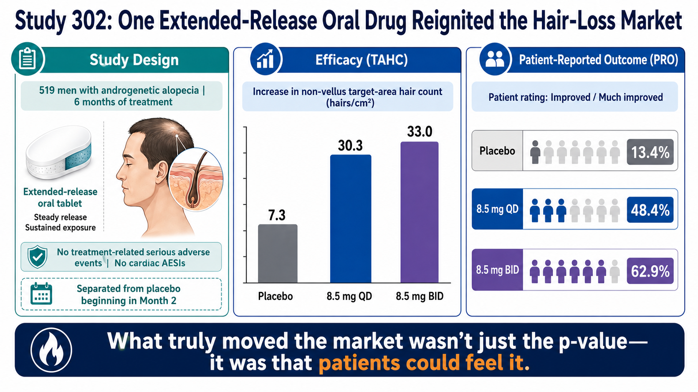
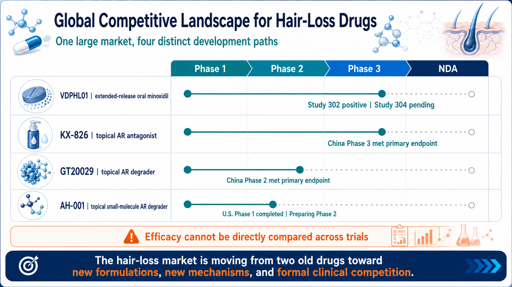
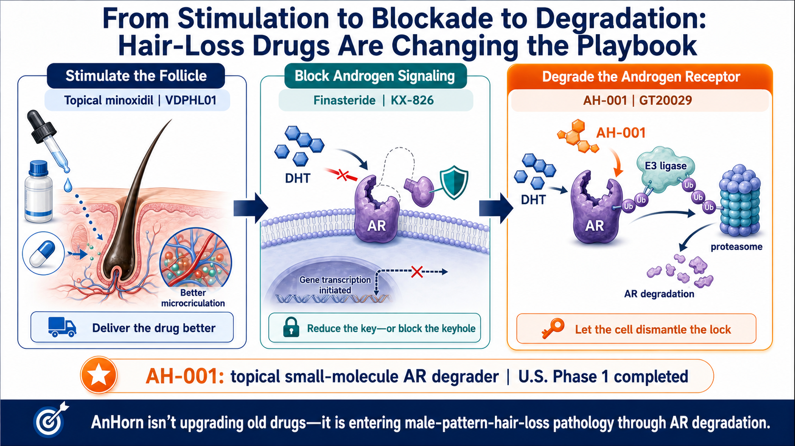
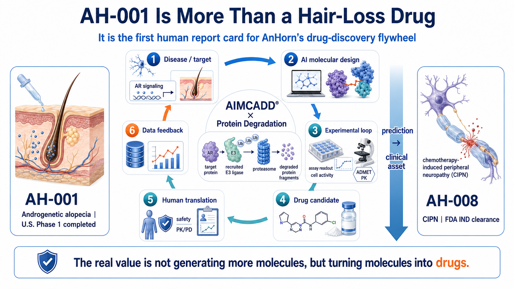

# Investors, Take Note: Hair Loss Could Be Biotech's Next Weight-Loss-Drug-Sized Blockbuster

> Lilly has placed a $40 million bet on hair-loss innovation. With roughly 80 million patients in the United States and only two legacy therapies, could AnHorn's AH-001 place topical AR degradation at the center of the next global revaluation of hair-loss drug assets?

The next biotech market capable of being propelled at the same time by global pharmaceutical companies, Wall Street, and consumers may not be in oncology or rare disease. It may be hiding in something people see in the mirror every day: their hair.

In 2026, a series of signals began to emerge around next-generation hair-loss drugs, and the industry had never seen all of them at the same time. Phase 2/3 data for Veradermics' extended-release oral minoxidil pushed the company's market capitalization close to $5 billion. Lilly first expressed an interest in purchasing shares in the Veradermics IPO, then invested $40 million directly in Absci to secure a position around ABS-201, an AI-designed antibody for hair loss. Global pharmaceutical companies are no longer viewing hair loss only as a market for shampoos, transplants, or aesthetic services. They are beginning to treat it as a chronic prescription-drug market capable of producing blockbuster products.

What makes this market remarkable is not only the roughly 80 million patients in the United States, but also the fact that most of the demand has never been unlocked. The mainstay drugs have been on the market for decades, yet patients still have to choose among concerns about sexual function and hormones, cardiovascular risk, scalp irritation, daily application, and limited efficacy. When a new drug can improve efficacy, safety, and convenience at the same time, the upside is not limited to taking share from older therapies. It can bring people who never started treatment back into the market.

Taiwan-based AnHorn Medicines and its AH-001 program are already at the most important table to watch. AH-001 is not another minoxidil, nor is it a conventional androgen blocker. It is a topical small-molecule AR protein degrader (PROTAC) designed to directly remove the androgen receptor in hair follicles. The program has already cleared the U.S. Phase 1 human safety threshold. The next Phase 2 readout will determine whether it can become a transaction-ready asset at the center of the global revaluation of hair-loss drugs.

> **CORE INVESTMENT THESIS**
>
> The upside in next-generation hair-loss drugs will not come only from switching patients off legacy therapies. It will come from bringing back the much larger population that never started treatment, discontinued it, or avoided it altogether. If a product can improve efficacy, safety, and convenience at the same time, low penetration could expand into a $10 billion-scale prescription market.

## 01 | Why Hair-Loss Drugs Have the Same Commercial Setup That Fueled the Weight-Loss Boom

Hair-loss drugs already have a commercial structure that closely resembles the weight-loss drug market just before its breakout: a very large patient population, a condition that requires long-term management, results that can be seen directly, patients who actively seek treatment, and a treatment penetration rate that has been held down for years by side effects and inconvenience.

In its U.S. securities filings, Veradermics estimated that approximately 80 million Americans have pattern hair loss and that roughly 74 million fall within a commercially addressable population. Yet only about 15 million are currently treated on an ongoing basis. Another 59 million are untreated, have discontinued therapy, or remain caught between shampoos, supplements, aesthetic procedures, and intermittent prescription use. The company estimated that the currently treated population alone represents an annual commercial opportunity of about $9 billion.[1]

The more important point is that demand is not absent; it is being held back by the limitations of the available products. Veradermics' patient research found that only about 20% of patients actively pursue treatment, and among those who are treated, only about 9% are satisfied with the results. In other words, the largest source of growth is not simply switching a finasteride user to another drug. It is unlocking the large population that remains untreated, has stopped treatment, or is unwilling to use the available options.[1]
| Key Metric | Market Estimate | Investment Relevance |
| --- | --- | --- |
| U.S. patient population | Approximately 80 million | A patient base large enough to support a major chronic prescription market |
| Commercially addressable population | Approximately 74 million | The opportunity extends far beyond a small group of severe patients |
| Currently treated | Approximately 15 million | Existing annual commercial opportunity estimated at roughly $9 billion |
| Untreated / lapsed / other | Approximately 59 million | The largest upside comes from reactivating suppressed demand |
| Treatment satisfaction | Approximately 9% | A materially better product profile could re-rate the entire category |

Table 1 | The hair-loss market is not short of demand. Treatment penetration and satisfaction have remained low for years. Source: Veradermics S-1.

## 02 | What the Market Underestimates Is Not the Patient Count, but the Demand That Has Never Been Unlocked

The two legacy mainstays are not entirely ineffective, but nearly every treatment path requires patients to compromise. Topical minoxidil must be applied every day, and its stickiness, scalp irritation, drying time, and interference with hairstyling can erode adherence. Oral finasteride works by lowering DHT, but long-standing concerns about sexual function, mood, and use in women of childbearing potential continue to affect prescribing and patient willingness. Low-dose oral minoxidil is widely used off-label in dermatology, but it is still fundamentally a cardiovascular drug, requiring physicians and patients to manage edema, palpitations, blood pressure, and other systemic risks.

These limitations create an unusual market dynamic: patients are willing to spend, but many are unwilling to remain on the products currently available. In the United States, patients may spend anywhere from several hundred dollars to more than $10,000 a year across supplements, lasers, platelet-rich plasma, hair transplantation, and prescription drugs. Yet the market still lacks a standard product that combines visible efficacy, long-term safety, convenience, and sustainable use.[1]

Under a conservative scenario, if a new drug brought back only 5% of the 59 million potential users, the market would gain nearly 3 million new patients. At an annual drug cost of $1,200 to $1,800 per patient, that would create approximately $3.5 billion to $5.3 billion in additional annual U.S. market opportunity. This illustrates why, once side-effect and adherence barriers are reduced, the ceiling for the hair-loss market is not today's prescription volume. It is the population that has not yet been activated.

Women represent another underestimated source of growth. Roughly 30 million women in the United States have female pattern hair loss, but hormonal risks, pregnancy concerns, and the limited number of available prescription therapies have left the market chronically underdeveloped. Any new product that can demonstrate low systemic exposure, a nonhormonal profile, or a more practical path to long-term use could raise the market ceiling again.

Taken together, these conditions closely resemble the weight-loss drug market before it took off. The same pre-breakout setup may be taking shape again.

## 03 | Wall Street Has Already Voted: One Hair-Loss Drug Supported a Valuation Near $5 Billion

In 2026, Veradermics gave capital markets a direct answer to a simple question: should next-generation hair-loss drugs be treated as a major biotech category?

The company went public in February at $17 per share, with an IPO valuation of roughly $600 million. After it reported positive results from VDPHL01 Study 302 on April 27, the stock gained about 48% in a single session, and the company's market value later approached $5 billion.[2][3]

Study 302 enrolled 519 men with mild-to-moderate androgenetic alopecia. After six months, target-area non-vellus hair count increased by 30.3 hairs/cm2 in the once-daily group and 33.0 hairs/cm2 in the twice-daily group, compared with 7.3 hairs/cm2 for placebo. Using the stricter patient assessment of "improved" or "much improved," response rates were 48.4% and 62.9% in the two active arms, versus 13.4% for placebo.[2]

VDPHL01 did not create new biology. It simply reformulated minoxidil as an extended-release oral drug, changing peak blood concentration, exposure time, and dosing convenience. Yet capital markets were willing to assign it a multibillion-dollar valuation because it demonstrated one point: when the product profile is strong enough, a hair-loss drug can move beyond the consumer and aesthetic categories and become a major prescription-drug asset.

Figure 1 | Study 302 showed separation in both objective hair counts and patient-reported outcomes. Results from different clinical trials should not be compared directly. Source: Veradermics.

## 04 | Lilly Has Entered the Market: From Olumiant and Veradermics to ABS-201

The more important signal for investors is that Eli Lilly, the leader in weight-loss drugs, has entered the hair-loss market directly.

Few global pharmaceutical companies understand better than Lilly how to turn chronic-disease and consumer-health demand into a large market. Lilly is now building multiple layers of exposure to hair loss. The first is Olumiant (baricitinib), which is FDA-approved for adults with severe alopecia areata. That means Lilly is not entering hair loss for the first time; it already has clinical, regulatory, and commercialization experience in an immune-mediated hair-loss indication.[4] The second appeared in Veradermics' 2026 IPO filing, where Lilly publicly indicated an interest in purchasing up to approximately 4.9% of the post-offering shares. The indication was non-binding, but it still reflected Big Pharma's interest in a late-stage oral asset for pattern hair loss.[5]

The third layer was the most concrete. In June 2026, Absci completed a $100 million equity offering, with 5,398,111 shares, or approximately $40 million, specifically allocated to Lilly. The proceeds are intended to support ABS-201, a long-acting, AI-designed antibody targeting the prolactin receptor (PRLR) for indications that include androgenetic alopecia and endometriosis.[6]

ABS-201 has entered the Phase 1/2a HEADLINE study, with initial human proof-of-concept data expected in the second half of 2026.[7] The investment is not a license and it is not an acquisition, but it effectively gives Lilly a seat close to the data and the team. When the company that reshaped the obesity and metabolic-disease markets with Zepbound and Mounjaro begins monitoring both an oral hair-loss drug and a novel biologic, the market should no longer view hair loss as a niche aesthetic category. It should view it as a pool of potential blockbuster assets that major pharmaceutical companies may pursue.
| Asset / Timing | Lilly Action | Strategic Meaning |
| --- | --- | --- |
| Olumiant / alopecia areata | FDA-approved for adults with severe alopecia areata | Existing clinical, regulatory, and commercial experience in hair loss |
| Veradermics IPO | Indicated non-binding interest in up to approximately 4.9% of post-offering shares | Monitoring a late-stage oral asset for pattern hair loss |
| Absci / ABS-201 | $40 million of shares specifically allocated to Lilly | A strategic equity position around a novel PRLR antibody mechanism |

Table 2 | Lilly's hair-loss strategy now spans a commercialized product, a late-stage oral asset, and an early-stage biologic with a new mechanism.

## 05 | The Next Wave Could Be Triggered by Three New Treatment Classes at Once

Hair-loss drug development is moving beyond two legacy drugs and into three paths that could establish new standards of care. The first is new engineering applied to an old drug: VDPHL01 uses extended-release oral minoxidil to improve efficacy and the risk-benefit profile. The second is new biology: ABS-201 uses a long-acting PRLR antibody in an effort to change the hair-follicle cycle. The third is the localized, precise control of androgen signaling through topical AR antagonists and AR degraders.

Figure 2 | Global Competitive Landscape for Hair-Loss Drugs. Source: publicly available information and company websites.

The key catalysts over the next 12 to 24 months are clear. Veradermics' 52-week Study 304 must show that efficacy can be reproduced and maintained, while Study 306 in women will help determine the commercial ceiling. Human proof-of-concept data for ABS-201 will show whether a long-acting injectable biologic can truly promote hair growth. KX-826, GT20029, and other topical antiandrogen programs will continue to educate regulators and physicians that localized control of androgen signaling in the hair follicle is a clinically developable path.[11][12]

Success in any one of these approaches would expand the entire category, not just benefit one company. The weight-loss drug market did not break open because the first product monopolized every patient. Semaglutide, tirzepatide, and later oral, long-acting, and combination products collectively expanded patient education, reimbursement, and treatment capacity. Next-generation hair-loss drugs are moving toward a similar multi-product expansion phase.

## 06 | AH-001's Distinctive Position: At the Intersection of a New Mechanism, Topical Delivery, and Scalability

In this new competitive landscape, AnHorn's AH-001 is a potential blockbuster competitor worth watching. It sits at a rare product intersection: topical delivery, a small-molecule format, and direct degradation of the androgen receptor. It has also completed a U.S. Phase 1 study with favorable company-reported safety and tolerability results. This early profile supports further study of whether topical delivery can limit systemic exposure, but it does not yet establish freedom from the adverse effects associated with oral therapies.

AH-001 does not lower DHT upstream, as finasteride does, and it does not simply compete for the receptor site like a conventional antagonist. It uses the ubiquitin-proteasome system to tag the androgen receptor (AR) for clearance and send it to the proteasome for degradation. Conventional inhibitors must continue occupying the receptor. Protein degraders are designed to work through an event-driven process: after effective recruitment, they directly reduce the amount of AR protein inside the cell.

Its product logic also differs from Lilly-backed ABS-201. ABS-201 is a long-acting injectable antibody that may trade less frequent dosing for sustained activity. AH-001 is a patient-applied topical small molecule that could offer advantages in manufacturing cost, distribution, home use, and localized exposure. If it can achieve low irritation, rapid absorption, and less frequent dosing, it would more closely resemble an everyday dermatology product that can be scaled broadly.

Figure 3 | Hair-loss treatment is moving from follicle stimulation and androgen blockade toward localized degradation of the androgen receptor.

ClinicalTrials.gov shows that the U.S. Phase 1 study of AH-001 enrolled 64 participants and evaluated single and multiple doses at 0.2%, 0.5%, 1%, and 2%. AnHorn reported favorable safety and tolerability across all dose levels, with no drug-related adverse events observed.[8][9] This does not mean that hair growth has been proven, but it moves AH-001 from a concept molecule into the small global group of topical AR-degradation assets with U.S. human data.

## 07 | Why AH-001 Could Create Major Value: The Key Is the Product Profile, Not AI

For large pharmaceutical companies, the most valuable candidate is often not the one with the most sophisticated mechanism. It is the one that strikes the best balance among clinical benefit, long-term safety, convenience, and commercial cost. AH-001's potential advantage is that it has room to differentiate across all four dimensions.

First, if localized AR degradation can produce deeper or more durable signaling suppression than receptor blockade alone, AH-001 could establish a new efficacy category. Second, if systemic exposure remains very low, it could appeal to younger men and some women who are reluctant to use oral hormonal drugs. Third, a topical small-molecule formulation is generally easier than an injectable antibody to bring into a large self-pay market. Fourth, follicle stimulation and AR reduction act at different points in the pathway, leaving open the possibility of combining AH-001 with minoxidil to broaden patient coverage.

Phase 2 must now establish three connected layers of evidence: that AR is actually reduced in the scalp or hair follicle; that target-area hair count, standardized photography, and patient-reported outcomes improve; and that these effects occur while maintaining low systemic exposure, good local tolerability, and a profile suitable for long-term use. If all three layers are established, AH-001 could move from a technology demonstration to a blockbuster transaction asset in the eyes of Big Pharma.

## 08 | AnHorn's Second Opportunity: One Hair-Loss Drug Could Validate the Entire Drug-Development Platform

AH-001 is more than a potential blockbuster for pattern hair loss. It is also the first full human test of AnHorn's AIMCADD® x Targeted Protein Degradation platform. From disease and target selection, AI molecular design, wet-lab screening, formulation and toxicology, through the U.S. IND and Phase 1, AnHorn has moved multiple candidates into human development. If AH-001 begins to show signs of success, the value of the company's other assets could rise with it.

In June 2026, AnHorn's second asset, AH-008, received FDA IND clearance and Taiwan CDE Index Case designation.[10] AH-008 is being developed to prevent chemotherapy-induced neuropathy, an addressable market with more than $10 billion in potential because its scope could extend across chemotherapy regimens worldwide. It may also expand into other neuropathic pain indications; even an early sign of success could position it as a potential megablockbuster.

AH-008 and AH-001 address different diseases through different mechanisms, so progress in one cannot be treated as proof that the other will succeed. But the arrival of a second clinical asset gives the market a way to judge whether AnHorn is a company built around a single hair-loss program or an AI drug-development platform capable of repeatedly generating clinical assets.

That distinction matters to investors because it sets AnHorn apart from a conventional single-asset biotech. One early-stage asset may support one licensing transaction. A platform that can repeatedly generate clinically testable assets can support regional licenses, co-development agreements, pipeline options, and even multi-asset partnerships centered on a specific E3 ligase or disease area. This year has already produced several transactions with potential values above $10 billion, including Innovent-Takeda at $11.2 billion, CSPC-AstraZeneca at $18.5 billion, and Hengrui-Bristol Myers Squibb at $15.2 billion. If AH-001 succeeds in Phase 2, AnHorn would gain more than the value of one hair-loss drug. It would gain a credibility premium for the entire platform.

Figure 4 | AH-001's second layer of value is the human validation it could provide for AnHorn's AIMCADD® x protein-degradation drug-development flywheel.

## 09 | What Should Investors Watch? Three Milestones Will Determine the Next Revaluation

The first milestone is the Phase 2 design. Can the selected doses produce a clear response? Does the study collect target-area hair count, standardized imaging, patient-reported outcomes, and target-engagement data at the same time? A trial designed only to achieve a statistically significant result may fail to show why the product is differentiated, leaving licensing value constrained.

The second milestone is productization. Odor, drying time, residue, redness, itching, and dosing frequency will all be magnified in real-world use. Hair loss is a chronic market that may require years of treatment. No matter how strong the mechanism, a poor user experience will make it difficult to reproduce the high persistence and brand loyalty seen with GLP-1 drugs.

The third milestone is the partnership model. Lilly's $40 million position in ABS-201 and Veradermics' near-$5 billion market value show that capital is creating new valuation reference points for hair-loss drugs that are both effective and scalable. Once AH-001 produces human efficacy and mechanism data, the key question will be whether AnHorn can convert that data package into a global license, a co-development agreement, or a strategic investment.

The risks are equally clear. AH-001 has not yet demonstrated hair regrowth in humans. Full Phase 1 results have not been published in a peer-reviewed journal. Competitors with related mechanisms are further ahead in development, and a female indication would require separate reproductive-toxicology work and clinical validation. Investors should follow the data rather than assume that any novel mechanism is destined to succeed.
| Value Milestone | Evidence the Market Needs | Potential Revaluation |
| --- | --- | --- |
| Phase 1 complete | Safety, tolerability, PK, and low systemic exposure | From a concept molecule to a clinically developable option |
| Positive Phase 2 | TAHC, imaging, patient-reported outcomes | Asset-level proof of concept and entry into global licensing or strategic-investment discussions |
| Partnership / Phase 3 | Reproducible efficacy, long-term tolerability, and a commercial formulation | Expansion from single-asset value toward platform and global commercial value |

Table 3 | AH-001 will not be revalued in a single step. Value will build sequentially through safety, proof of concept, and commercial partnering.

## CONCLUSION | Lilly Has Bought Its Ticket. AnHorn Is Waiting for the Readout That Could Ignite the Market

Next-generation hair-loss drugs could become the next market on the scale of weight-loss drugs, not because hair loss and obesity have the same medical severity, but because they share the same market multipliers: a very large patient base, chronic long-term treatment, highly visible results, patients willing to pay out of pocket, and low market penetration that has been suppressed for years by the side effects and inconvenience of legacy products.

Veradermics has already shown that Wall Street is willing to value a hair-loss asset in the billions of dollars. Lilly's progression from Olumiant, to its indicated interest in Veradermics, to a $40 million investment in Absci shows that Big Pharma is building strategic options across the category. Lilly's entry also raises expectations for what a global pharmaceutical company can do: build a true megablockbuster, just as the weight-loss drug market was pushed to its current peak.

The opportunity for AH-001 in the next stage is to prove that topical small-molecule AR degradation can deliver hair growth that patients can see, safety that physicians can trust, and a product profile that a global pharmaceutical company can scale. If it can do that, AH-001 could become one of the few Taiwan-origin clinical assets with a credible position in a global clinical opportunity at the $10 billion scale. AnHorn would also demonstrate the strength of a platform capable of repeatedly creating blockbuster drugs, and Taiwan's capital market could be looking at a genuine AI-drug-discovery breakout company.

## REFERENCES

This article is based on public company disclosures, regulatory filings, clinical-trial registrations, and market materials. Company statements and market estimates are presented using the original publishers' definitions and assumptions.

1. [Veradermics | S-1: U.S. pattern hair-loss population, treatment penetration, satisfaction, and market estimates](https://www.sec.gov/Archives/edgar/data/1827635/000162828026001651/veradermicsincs-1.htm)
2. [Veradermics | Positive topline results from VDPHL01 Study 302 (April 27, 2026)](https://www.sec.gov/Archives/edgar/data/1827635/000162828026027354/exhibit991-8xk.htm)
3. [Investor's Business Daily | One-day market reaction following Study 302](https://www.investors.com/news/technology/veradermics-ipo-stock-oral-rogaine/)
4. [Eli Lilly | Olumiant (baricitinib) for severe alopecia areata](https://olumiant.lilly.com/alopecia-areata)
5. [Veradermics | IPO prospectus: Lilly indication of interest (non-binding)](https://www.sec.gov/Archives/edgar/data/1827635/000162828026005505/veradermicsinc424b4.htm)
6. [Absci | Prospectus supplement: $40 million share allocation to Eli Lilly](https://investors.absci.com/static-files/5d70b681-4b5b-4830-9578-3a0e8473b3f4)
7. [Absci | ABS-201 for androgenetic alopecia / HEADLINE Phase 1/2a](https://www.absci.com/abs-201-case-study/)
8. [ClinicalTrials.gov | AH-001 Phase 1, NCT06927960](https://clinicaltrials.gov/study/NCT06927960)
9. [AnHorn Medicines | AH-001 completes U.S. Phase 1 (October 30, 2025)](https://www.anhornmed.com/zh-hant/news/ai-design-ah001-protein-degrader-phase1-complete/)
10. [AnHorn Medicines | AH-008 receives FDA IND clearance and CDE Index Case designation](https://www.anhornmed.com/news/ah008-ind-cipn/)
11. [Kintor Pharmaceutical | KX-826 Phase 3 met the primary endpoint](https://en.kintor.com.cn/news_details/22.html)
12. [Kintor Pharmaceutical | GT20029 China Phase 2 met the primary endpoint](https://en.kintor.com.cn/news_details/1803365125008502784.html)

### IMPORTANT DISCLOSURE

This article is provided solely for industry research and market observation. It does not constitute investment, trading, medical, fundraising, or securities advice. All drug candidates discussed remain subject to clinical, regulatory, partnering, commercialization, and competitive risks. Market scenarios are illustrative and do not represent sales forecasts.
