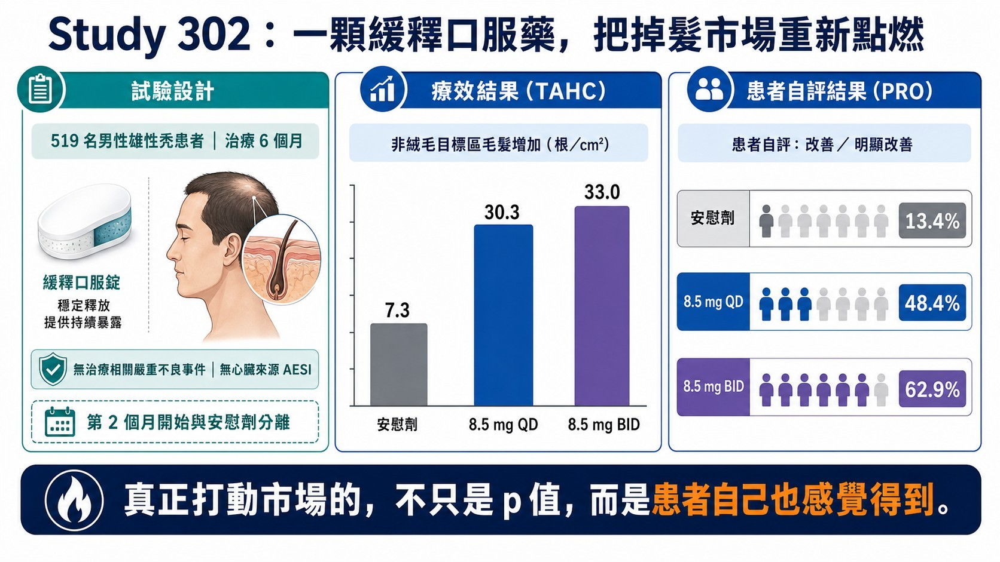
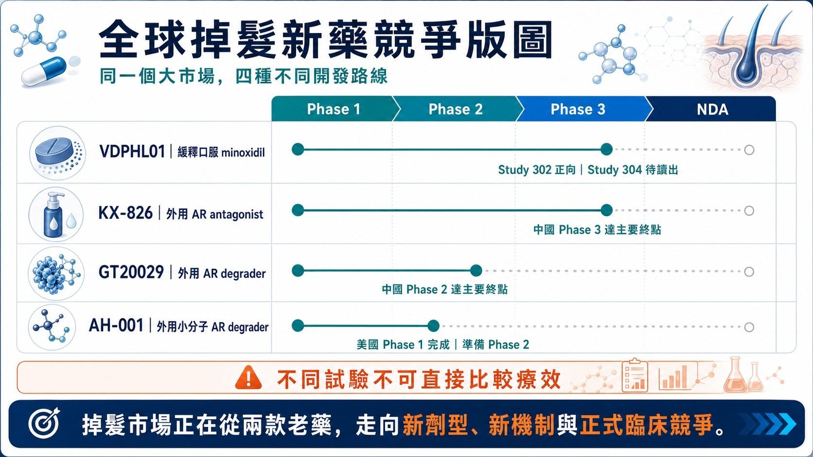
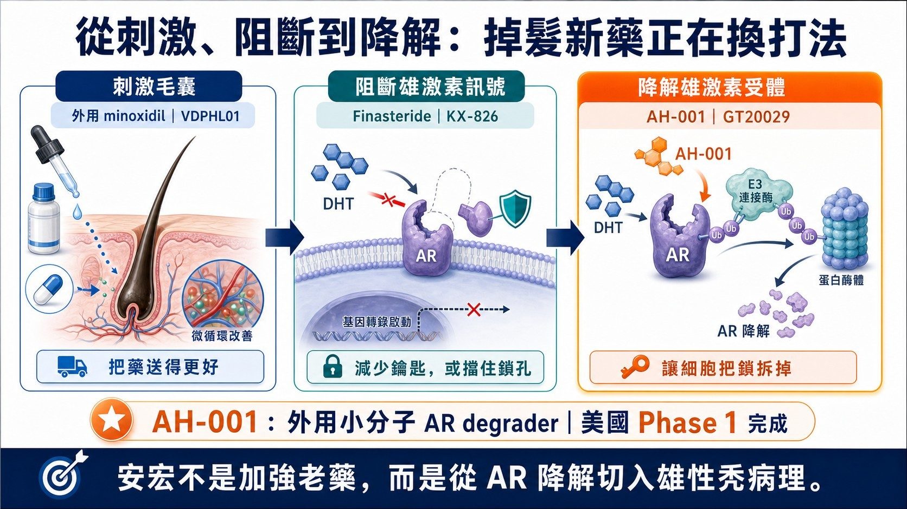
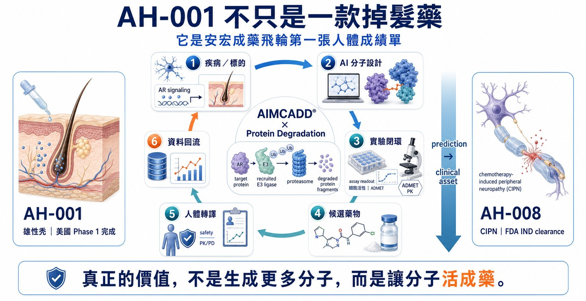

# 投資人請注意，下一個減肥藥級別賽道來了！

> 禮來用 4,000 萬美元卡位：當 8,000 萬名美國患者只有兩款老藥，安宏 AH-001 為什麼可能站在掉髮新藥重估中心？

如果要找下一個可能被全球藥廠、華爾街與消費者同時推動的生醫賽道，答案未必還在癌症或罕病，也可能藏在每個人每天照鏡子都看得見的地方：頭髮。

2026 年，掉髮新藥開始出現一連串過去從未同時發生的訊號。Veradermics 的一顆緩釋口服 minoxidil，靠 Phase 2/3 數據把公司市值推向近 50 億美元；禮來先在 Veradermics IPO 文件中表達認購意向，接著又以 4,000 萬美元實際買進 Absci 股份，卡位 AI 設計的掉髮抗體 ABS-201。全球大藥廠已不再只把掉髮當成洗髮精、植髮或醫美服務，而是開始把它當成一個可以誕生 blockbuster 的慢性處方藥市場。

這個市場真正驚人的地方，不只是美國有約 8,000 萬名患者，而是大多數需求根本還沒有被釋放。現有藥物上市數十年，患者仍必須在性功能與荷爾蒙疑慮、心血管風險、頭皮刺激、每日塗抹與效果有限之間做選擇。當一款新藥能把療效、安全性與便利性同時往前推，增量不只是搶走舊藥市占，而是讓原本不治療的人重新走進市場。

而台灣的安宏生醫 AH-001 已經在最值得關注的牌桌上。它不是另一款 minoxidil，也不是傳統的雄激素阻斷劑，而是一款外用小分子 AR protein degrader（PROTAC），試圖直接把毛囊中的雄激素受體「拆掉」。一期已經跨過美國人體安全門檻；下一張二期臨床的成績單，將決定它究竟能否站上全球掉髮新藥重估中心的交易資產。

> **核心投資邏輯**
>
> 掉髮新藥的增量，不只來自舊藥換藥，而是把未治療、停藥與不敢用藥的人重新帶回市場。只要產品同時改善療效、安全與便利性，低滲透率就可能轉化為百億美元級處方市場。

## 01｜為什麼說掉髮新藥有「減肥藥級別」的商業爆發結構？

掉髮藥其實早已具備一套接近減肥藥爆發前夜的商業結構——患者人數極大、疾病需要長期管理、療效可以直接被肉眼看見、患者願意主動尋找治療，而且現有藥物的副作用與使用不便，長期壓抑了真正的治療滲透率。

Veradermics 在美國證券文件中估算，美國約有 8,000 萬名 pattern hair loss（型態性落髮）患者，其中約 7,400 萬人屬於可觸及的商業人群；但目前真正持續治療者約 1,500 萬人，仍有約 5,900 萬人沒有治療、已經停藥，或只停留在洗髮精、保健品與醫美程序之間。公司估算，僅現有治療人群就形成約 90 億美元的年度商業機會。[1]

更關鍵的是，這不是一個需求不存在的市場，而是一個需求被產品限制壓住的市場。Veradermics 的患者研究顯示，整體只有約兩成患者積極接受治療，而接受治療者中只有約 9% 對結果滿意。換句話說，掉髮市場最大的增量，不只是把使用 finasteride 的患者換到另一顆藥，而是把龐大的未治療、停藥與不敢用藥人口重新釋放出來。[1]
| 關鍵指標 | 市場數字 | 投資意義 |
| --- | --- | --- |
| 美國患者 | 約 8,000 萬 | 患者基數足以支撐大型慢性處方市場 |
| 可觸及人群 | 約 7,400 萬 | 不是只服務少數重度患者 |
| 目前治療者 | 約 1,500 萬 | 現有年度商業機會估計約 90 億美元 |
| 未治療／其他 | 約 5,900 萬 | 新藥最大增量來自重新啟動需求 |
| 治療滿意度 | 約 9% | 產品輪廓改善可帶來類別重估 |

表 1｜掉髮新藥市場不是需求不足，而是治療滲透率與滿意度長期偏低。資料來源：Veradermics S-1。

## 02｜真正被低估的，不是患者數，而是「沒有被釋放的需求」

現有兩款主流老藥並非完全無效，但幾乎每一條路都要求患者妥協。外用 minoxidil 需要每天塗抹，黏膩、頭皮刺激、乾燥時間與造型衝突會侵蝕依從性；口服 finasteride 透過降低 DHT 發揮作用，卻長期伴隨性功能、情緒與育齡女性使用限制等疑慮；低劑量口服 minoxidil 在皮膚科被大量 off-label 使用，但它本質上仍是心血管藥物，醫師與患者必須管理水腫、心悸與血壓等風險。

這些限制形成一個很特殊的市場現象：患者願意花錢，卻不願意長期使用現有產品。美國患者目前可能在保健品、雷射、PRP、植髮與處方藥之間支出每年數百到上萬美元，但仍缺少一個同時兼顧明顯療效、長期安全、使用便利與可持續性的標準產品。[1]

若用保守情境試算：只要約 5% 的 5,900 萬名潛在人群被新藥喚回，便是接近 300 萬名新增使用者；若每人每年藥費為 1,200 至 1,800 美元，就可能新增約 35 億至 53 億美元的美國年度市場。這說明當副作用與依從性障礙被改善，掉髮市場的天花板並不在今天的處方量，而在尚未被啟動的人口。

女性更是下一個被低估的增量。美國約有 3,000 萬名女性型態性落髮患者，但荷爾蒙風險、妊娠顧慮與可用處方藥不足，使女性市場長期沒有被完整開發。任何能證明低系統暴露、非荷爾蒙或更友善長期使用的新產品，都有機會把市場再往上推一層。

這些種種都與當年的減肥藥市場有異曲同工之妙，減肥藥的爆發前夜似曾相似場景似乎又要來臨。

## 03｜華爾街已經先投票：一顆掉髮藥，撐起近 50 億美元估值

2026 年的 Veradermics，讓資本市場第一次用非常直接的方式回答：掉髮新藥值不值得被當成大型生技賽道？

公司在 2 月以每股 17 美元上市，IPO 定價時估值約 6 億美元；4 月 27 日公布 VDPHL01 Study 302 正向數據後，股價單日再上漲約 48%，其後市值一度接近 50 億美元。[2][3]

Study 302 納入 519 名輕至中度男性患者。治療六個月後，VDPHL01 每日一次與每日兩次組的目標區非絨毛毛髮計數，分別較基線增加 30.3 與 33.0 根/cm²，安慰劑組為 7.3 根/cm²；採較嚴格的患者自評「改善或明顯改善」，兩個治療組為 48.4% 與 62.9%，安慰劑僅 13.4%。[2]

VDPHL01 並沒有創造全新的生物學，它只是把 minoxidil 做成緩釋口服製劑，重新配置血中峰值、暴露時間與用藥便利性。可是資本市場願意給出數十億美元估值，因為它證明一件事：只要產品輪廓足夠好，掉髮藥可以從消費品與醫美題材，升級為大型處方藥資產。

圖 1｜Study 302 同時在客觀毛髮計數與患者自評建立差異；不同試驗不可直接跨試驗比較。資料來源：Veradermics。

## 04｜禮來已經下場：從 Olumiant、Veradermics 到 ABS-201

更值得投資人注意的訊號，減肥藥巨頭 禮來 已經親自下場卡位掉髮新藥市場！

全球最懂得慢性疾病與消費醫療需求做成大市場的禮來，已經開始在掉髮領域建立多層次卡位。

第一層，禮來的 Olumiant（baricitinib）已獲 FDA 核准治療成人嚴重圓禿，代表禮來不是第一次進入掉髮市場，而是已經具備免疫性掉髮的臨床、監管與商業化經驗。[4] 第二層，在 Veradermics 2026 年 IPO 文件中，禮來曾公開表示有意認購上市後最高約 4.9% 的股份；這項意向並非具約束力，但已反映大藥廠對晚期型態性落髮資產的關注。[5]

第三層，也是最具體的一步：2026 年 6 月，Absci 完成 1 億美元增資，其中 5,398,111 股、合計 4,000 萬美元明確配置給禮來。資金將推進 ABS-201，一款由 AI 設計、鎖定 prolactin receptor（PRLR）的長效抗體，適應症包括雄性素性脫髮與子宮內膜異位症。[6]

ABS-201 已進入 Phase 1/2a HEADLINE 試驗，預計在 2026 年下半年取得初步人體概念驗證資料。[7] 這筆投資不是授權，也不是收購，但它等於讓禮來先買到一張靠近資料與團隊的入場券。當一家靠 Zepbound 與Mounjaro 重塑減重與代謝慢性病市場的公司，開始同時觀察口服掉髮藥與新機制生物製劑，市場就不應再把掉髮視為小眾醫美題材，而應該把它視為可能巨頭獵取重磅新藥資產池。
| 時間／資產 | 禮來動作 | 戰略含義 |
| --- | --- | --- |
| Olumiant／圓禿 | 已取得成人嚴重圓禿適應症 | 已具備掉髮領域的臨床、監管與商業化經驗 |
| Veradermics IPO | 曾表示有意認購上市後最高約 4.9% 股份（非具約束力） | 觀察晚期口服型態性落髮資產 |
| Absci／ABS-201 | 4,000 萬美元股份明確配置給禮來 | 以策略股權取得新機制 PRLR 抗體的場內座位 |

表 2｜禮來的掉髮布局已從商業化產品，延伸至晚期口服資產與早期新機制生物製劑。

## 05｜下一輪引爆點，會從三種「新治療類別」同時出現

掉髮新藥正在從兩款老藥，分裂成三條可能建立新標準的路線。第一條是老藥新工程：VDPHL01 用緩釋口服 minoxidil 改善療效與風險收益比；第二條是新生物學：ABS-201 嘗試用長效 PRLR 抗體改變毛囊週期；第三條則是局部精準處理雄激素訊號，包括外用 AR antagonist 與 AR degrader。

圖 2｜全球掉髮新藥競爭地圖。資料來源：公開資訊與公司官網。

未來 12 至 24 個月的引爆點非常清楚。Veradermics 的 52 週 Study 304 要驗證療效能否複製並維持，女性 Study 306 則決定商業天花板；ABS-201 的人體概念驗證，將回答長效注射生物製劑能否真正促進毛髮生長；KX-826、GT20029 與其他外用抗雄激素產品，則持續教育監管與醫師：毛囊局部處理雄激素訊號，是一條可以正式開發的臨床路徑。[11][12]

任何一條路成功，都會擴大整個賽道，而不只是單一公司受益。減肥藥市場真正爆發，也不是因為第一款產品壟斷所有患者，而是 semaglutide、tirzepatide 與後續口服、長效與複方產品共同把患者教育、支付與醫療供給做大。掉髮新藥正在走向相似的多產品擴張階段。

## 06｜安宏 AH-001 的特殊地位：站在「新機制、局部用藥、可規模化」交叉點

在這張新競爭版圖中，安宏生醫的 AH-001 是值得關注的潛在重磅競爭者。他站在一個少見的產品交叉點：外用、小分子、直接降解雄激素受體，而且在已完成美國人體一期與展現高度安全成果。

AH-001 不像 finasteride 在上游降低 DHT，也不像傳統 antagonist 只在受體位置競爭。它利用 ubiquitin-proteasome system，讓細胞把 androgen receptor（AR）貼上清除標記並送入蛋白酶體分解。傳統抑制劑需要持續占住受體；蛋白降解劑追求的是事件驅動——完成一次有效招募後，直接降低細胞內 AR 蛋白量。

它與禮來支持的 ABS-201 也有不同產品邏輯。ABS-201 是長效注射抗體，可能以較低頻率給藥換取持久效果；AH-001 則是患者可自行使用的外用小分子，理論上具有製造成本、分銷、居家使用與局部暴露上的優勢。若能做到低刺激、快速吸收與較低給藥頻率，它更接近皮膚科能大規模推廣的日常產品。

ClinicalTrials.gov 顯示，AH-001 美國 Phase I 實際納入 64 人，以 0.2%、0.5%、1% 與 2% 進行單次與多次給藥；安宏公告各劑量安全性與耐受性良好，未觀察到藥物相關不良事件，大幅避免原本口服藥物常見的副作用。[8][9] 這並不等於已證明生髮，但它使 AH-001 從概念分子，進入全球少數已有美國人體資料的局部 AR 降解資產行列。

圖 3｜掉髮治療由刺激毛囊、阻斷雄激素訊號，進一步走向局部降解雄激素受體。

## 07｜為什麼 AH-001 有機會取得巨大價值？關鍵不是「AI」，而是產品輪廓

對大型藥廠而言，最有價值的候選藥物往往不是機制最花俏，而是能在臨床效益、長期安全、便利性與商業成本之間形成最佳平衡。AH-001 的潛在優勢，正是在這四個維度同時存在想像空間。

第一，若局部 AR 降解能比單純阻斷帶來更深或更持久的訊號抑制，AH-001 可能在療效上建立新類別；第二，若血中暴露維持極低，便可能吸引不願使用口服荷爾蒙藥物的年輕男性與部分女性人群；第三，小分子外用製劑通常比抗體注射更容易進入大規模自費市場；第四，刺激毛囊與降低 AR 位於不同節點，未來仍存在與 minoxidil 組合使用、擴大患者覆蓋的可能。

接下來是 Phase II 能否建立三層連續證據：頭皮或毛囊中的 AR 確實被降低；TAHC、標準化攝影與患者自評確實改善；同時維持低系統暴露、良好局部耐受與可長期使用。三層證據若同時成立，AH-001 將從技術展示升級為大藥廠眼中的重磅交易資產。

## 08｜安宏的第二層機會：一款掉髮藥，可能驗證整個成藥平台

AH-001 不僅僅是型態性落髮的潛在重磅炸彈。它也是安宏 AIMCADD® × Targeted Protein Degradation 平台第一張完整的人體成績單：從疾病與靶點選擇、AI 分子設計、濕實驗篩選、製劑與毒理，到美國 IND 與 Phase I，安宏已經把多個候選物真正推進人體，而一旦AH-001成功跡象逐步顯現，其他的資產價值也將水漲船高。

2026 年 6 月，安宏第二項資產 AH-008 取得美國 FDA IND clearance，並獲台灣 CDE Index Case designation。[10] AH-008申請的適應症為預防化療引起的周邊神經性病變，更是一個注定為百億美元級別以上的市場，全球的化療藥物都將進入其市場範圍空間想像力巨大，此外他亦有極高的可能性再次擴展到其他神經痛領域，一但有成功苗頭出現必將成爲超重磅新藥。

當然AH-008 與 AH-001 的疾病和機制不同，不能直接視為複製成功；但第二個臨床資產出現，使市場開始有機會判斷：安宏是一家只有單一掉髮題材的公司，還是一個可以持續產生臨床資產的 AI製藥技術平台。

在投資人心中，這會讓安宏與一般傳統生技公司有所差異。過往單一早期資產只能談一筆授權；然而能持續產生可驗證臨床資產的平台，則可以談區域授權、共同開發、管線選擇權，甚至針對特定 E3 ligase 或疾病領域建立多資產合作（今年多起百億美元級別交易案，如信達x武田112億美元, 石藥x阿斯特捷利康185億美元, 恆瑞x 必治妥施貴寶 152億美元）。AH-001 若在 Phase II 成功，安宏得到的不只是一款掉髮藥的價值，而是整個平台的可信度溢價。

圖 4｜AH-001 的第二層價值，是讓 AIMCADD® × Protein Degradation 成藥飛輪取得人體驗證。

## 09｜投資人應該看什麼？三個節點決定下一次價值重估

第一個節點是 Phase II 設計。劑量是否能形成清楚反應？是否同時收集 TAHC、標準化影像、患者自評與 target engagement？試驗若只追求一個統計顯著數字，無法回答產品差異，授權價值仍會受限。

第二個節點是產品化能力。外用藥的氣味、乾燥速度、殘留、紅癢與給藥頻率，都會在真實世界放大。掉髮是需要多年使用的慢性市場，再強的機制，若輸在使用體驗，也無法複製 GLP-1 的高續用與品牌黏著。

第三個節點是合作模式。禮來用 4,000 萬美元卡位 ABS-201、Veradermics 市值一度接近 50 億美元，說明資本正在為「有效且可規模化的掉髮新藥」建立新估值座標。AH-001 一旦取得人體療效與機制證據，能否把資料包轉成全球授權、共同開發或策略投資，將成為下一步重估的關鍵。

當然，風險同樣明確：AH-001 仍未證明人體生髮效果；一期完整結果尚未以同儕審查形式公開；同機制附近已有競爭者領先；女性適應症仍需獨立生殖毒理與臨床驗證。投資人應該追蹤數據，而不是把任何新機制直接當成成功。
| 價值節點 | 市場要看的證據 | 可能帶來的重估 |
| --- | --- | --- |
| Phase I 完成 | 安全性、耐受性、PK／低系統暴露 | 從概念分子變成可進一步開發的臨床選擇權 |
| Phase II 正向 | TAHC、影像、PRO | 資產 proof-of-concept，進入全球授權與策略投資討論 |
| 合作／Phase III | 可複製療效、長期耐受、商業製劑 | 從單一資產估值走向平台與全球商業價值 |

表 3｜AH-001 的價值重估不會一次完成，而是由安全性、概念驗證與商業合作逐層推進。

## 結語｜禮來已經買票，安宏等待下一張真正能引爆市場的成績單

掉髮新藥有機會成為下一個「減肥藥級別」賽道，不是因為掉髮與肥胖具有相同醫療嚴重度，而是兩者共享同一套市場放大器：龐大患者基數、慢性長期用藥、結果高度可視化、患者願意主動支付，以及一個被舊產品副作用與不便壓抑多年的低滲透市場。

Veradermics 已經證明，掉髮資產可以被華爾街定價到數十億美元；禮來從 Olumiant、Veradermics 認購意向到 4,000 萬美元投資 Absci，則證明大藥廠正在建立自己的賽道選擇權。裡來的入局，我們更能夠期待的是大藥廠打造超級爆款的能力！就像當初的減肥藥一路被推向如今的巔峰狀態！

安宏 AH-001 的機會是在下一階段證明：外用小分子 AR 降解，能否同時做到患者看得見的生髮、醫師信得過的安全性，以及大藥廠可以全球放大的產品輪廓，AH-001將成為台灣少數真正站上全球百億美元級臨床資產，而安宏將證明其持續打造重磅新藥的技術平台實力，台灣資本市場將迎來一家真正的的AI製藥超新星。

## 參考資料

本文依公開公司公告、監管文件、臨床試驗登錄與市場資料整理；公司自述與市場估算均以原發布者口徑呈現。

1. [Veradermics｜S-1：美國型態性落髮患者、治療滲透率、滿意度與市場估算](https://www.sec.gov/Archives/edgar/data/1827635/000162828026001651/veradermicsincs-1.htm)
2. [Veradermics｜Study 302 Phase 2/3 正向頂線資料（2026-04-27）](https://www.sec.gov/Archives/edgar/data/1827635/000162828026027354/exhibit991-8xk.htm)
3. [Investor's Business Daily｜Study 302 公布後股價單日反應](https://www.investors.com/news/technology/veradermics-ipo-stock-oral-rogaine/)
4. [Eli Lilly｜Olumiant（baricitinib）嚴重圓禿適應症](https://olumiant.lilly.com/alopecia-areata)
5. [Veradermics｜IPO Prospectus：禮來認購意向（非具約束力）](https://www.sec.gov/Archives/edgar/data/1827635/000162828026005505/veradermicsinc424b4.htm)
6. [Absci｜Prospectus Supplement：4,000 萬美元股份配置給 Eli Lilly](https://investors.absci.com/static-files/5d70b681-4b5b-4830-9578-3a0e8473b3f4)
7. [Absci｜ABS-201 for Androgenetic Alopecia／HEADLINE Phase 1/2a](https://www.absci.com/abs-201-case-study/)
8. [ClinicalTrials.gov｜AH-001 Phase I，NCT06927960](https://clinicaltrials.gov/study/NCT06927960)
9. [AnHorn Medicines｜AH-001 完成美國 Phase I（2025-10-30）](https://www.anhornmed.com/zh-hant/news/ai-design-ah001-protein-degrader-phase1-complete/)
10. [AnHorn Medicines｜AH-008 取得 FDA IND clearance 與 CDE Index Case designation](https://www.anhornmed.com/news/ah008-ind-cipn/)
11. [Kintor Pharmaceutical｜KX-826 Phase III 達主要終點](https://en.kintor.com.cn/news_details/22.html)
12. [Kintor Pharmaceutical｜GT20029 中國 Phase II 達主要終點](https://en.kintor.com.cn/news_details/1803365125008502784.html)

### 重要聲明

本文僅供產業研究與市場觀察，不構成投資、買賣、醫療、募資或個股建議。文中候選藥物仍涉及臨床、法規、授權、商業化與競爭風險；所有市場情境試算均非銷售預測。
