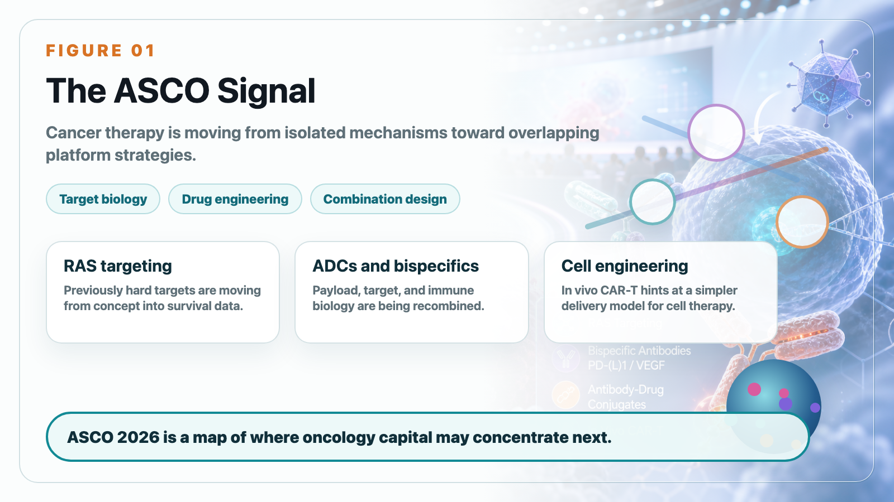
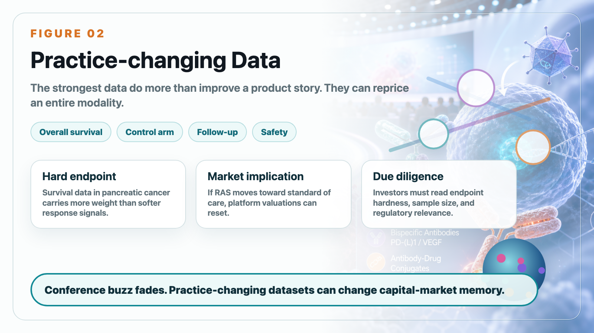
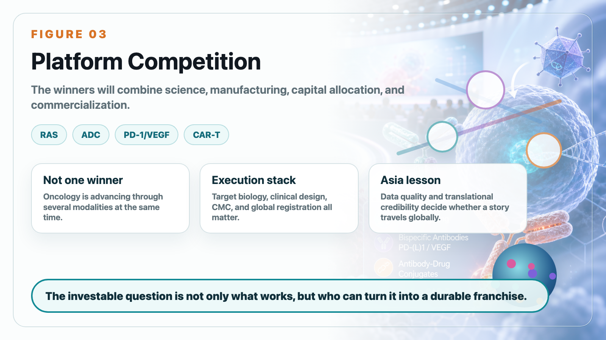

# ASCO 2026: RAS, ADCs, Bispecifics, and In Vivo CAR-T Point to a New Oncology Cycle

The most important winner at ASCO 2026 was not a single drugmaker. It was the idea that several impossible-looking oncology problems are becoming clinically testable.

The meeting showed a broader shift in cancer therapy. Oncology is no longer advancing through one mechanism at a time. RAS inhibitors, antibody-drug conjugates, PD-1/VEGF bispecific antibodies, in vivo cell engineering, and new combination strategies are all moving at once. For investors, that means the competitive map is becoming more complex and more platform-driven.

The most striking data came from Revolution Medicines. Daraxonrasib, an oral RAS(ON) multi-selective inhibitor, produced median overall survival of 13.2 months versus 6.7 months for chemotherapy in previously treated metastatic pancreatic ductal adenocarcinoma. Pancreatic cancer has long been one of oncology's hardest diseases. A survival result of this scale does not just improve a product story. It can reprice an entire modality.

This matters because RAS has historically been viewed as a difficult or even undruggable target. If daraxonrasib can move from proof-of-concept into a new standard of care, the market will stop valuing RAS companies as speculative target stories and start valuing them as late-stage oncology franchises.

Merck's position was also important. Keytruda remains one of the most powerful oncology platforms in the world, but Merck cannot depend on Keytruda alone forever. The company is building around ADCs, next-generation combinations, and assets such as sacituzumab tirumotecan. The post-Keytruda era will not be solved by one replacement drug. It will likely be solved by layers of immunotherapy, ADCs, bispecifics, and disease-specific combinations.

PD-1/VEGF bispecifics were another major theme. Ivonescimab's HARMONi-6 data strengthened the idea that dual blockade of immune checkpoint and angiogenesis biology can translate into clinically meaningful benefit. But the next question is global reproducibility. Strong China data are not enough by themselves. The market will ask whether efficacy, safety, and regulatory confidence can be reproduced across broader populations.

In vivo CAR-T created the most futuristic signal. Kelonia's KLN-1010 suggested that CAR-T engineering may eventually move inside the patient rather than requiring ex vivo cell collection, manufacturing, expansion, and reinfusion. It is early, but the implication is enormous: if cell therapy can become easier to manufacture and deliver, the business model of CAR-T could change.

For Taiwan and Asia biotech readers, the key lesson is not simply "ASCO is important." The lesson is that data quality matters. A conference presentation is not enough. The market cares about endpoint hardness, control arm, sample size, follow-up duration, safety, global regulatory relevance, and whether the data can change clinical practice.

The 2026 oncology cycle is not about one technology winning. It is about companies that can combine target biology, drug engineering, clinical design, manufacturing, capital allocation, and commercialization. Those are the companies that can turn scientific possibility into durable business value.

This article is intended for industry research and knowledge sharing only. It does not constitute investment, medical, fundraising, or individual stock advice.
