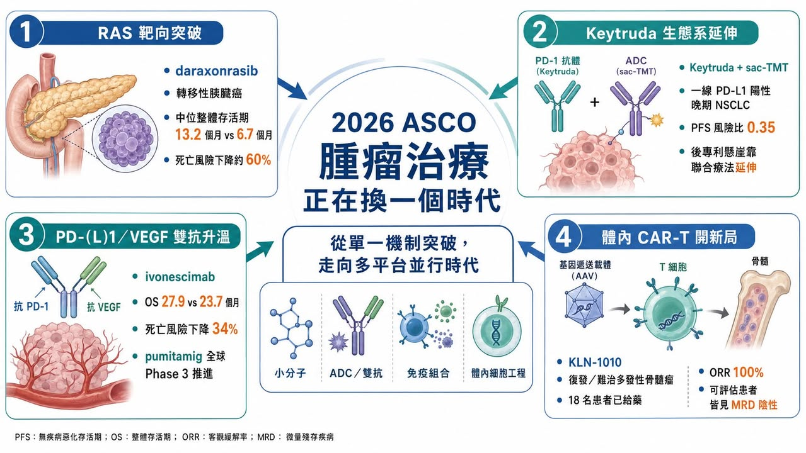
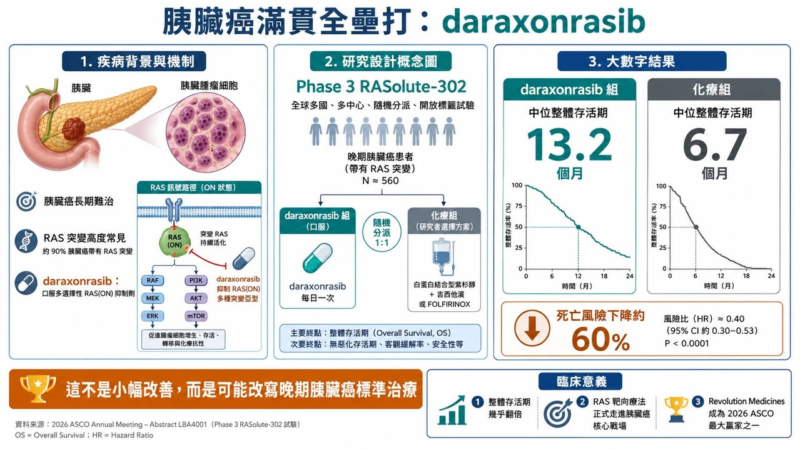
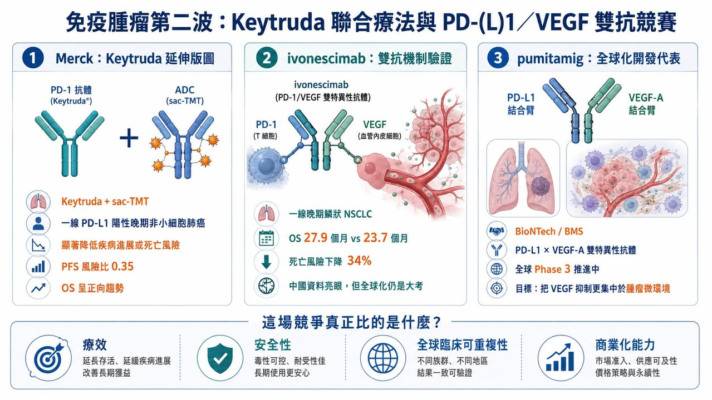
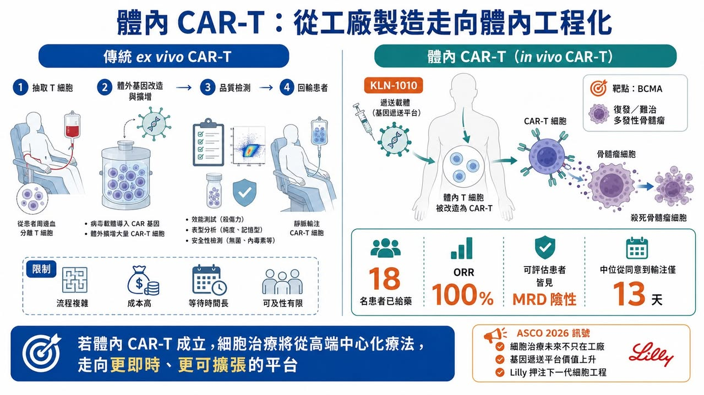

# 2026 ASCO：生存期翻倍、體內 CAR-T 破局，腫瘤治療正在換一個時代

2026 年美國臨床腫瘤學會年會，也就是 ASCO，最該被記住的贏家，並不是任何一家藥廠，而是癌症患者。

這句話聽起來很大，但今年的資料確實配得上。

在胰臟癌這個長期被視為「最難治」的癌種裡，兩組資料讓會場氣氛完全不同。尤其是 Revolution Medicines 的 daraxonrasib，在轉移性胰臟癌中讓整體存活期幾乎翻倍，讓「改變臨床實務」這句話不再只是藥廠新聞稿的修辭，而是開始接近真實。Revolution 公布的 Phase 3 RASolute-302 試驗顯示，daraxonrasib 組中位整體存活期達 13.2 個月，化療組為 6.7 個月，死亡風險下降約 60%。

今年 ASCO 的主軸，其實很清楚：腫瘤治療正在從「單一機制突破」，走向「多技術平台同時開火」。

RAS 抑制劑讓胰臟癌看見新標準治療的可能。Keytruda 的王權仍在，但 Merck 也開始用抗體藥物複合體與聯合療法補強後專利懸崖。PD-1／VEGF 或 PD-L1／VEGF 雙特異性抗體，正成為下一代免疫腫瘤最擁擠也最有想像力的戰場。體內 CAR-T 則讓細胞治療第一次看見「不用抽細胞回工廠」的未來。

ADC、雙抗、小分子、體內基因遞送與 RAS 靶向療法，在今年 ASCO 上彼此交錯，讓腫瘤產業的下一輪格局逐漸成形。

這已經不是單純誰的數據比較漂亮，而是誰能代表下一代腫瘤治療平台。

## 01｜Revolution Medicines：胰臟癌裡的一記滿貫全壘打

如果只選一家公司代表 2026 ASCO，Revolution Medicines 幾乎沒有懸念。

胰臟癌一直是腫瘤治療裡最難啃的硬骨頭之一。它診斷晚、進展快、對化療反應有限，五年存活率長期偏低。尤其是轉移性胰臟導管腺癌，過去數十年真正能大幅改變生存期的療法非常少。Daraxonrasib 的資料之所以震撼，是因為它不是在邊角族群裡做出一點點改善，而是在先前治療過的轉移性胰臟癌患者中，把整體存活期從 6.7 個月拉到 13.2 個月。對這個癌種而言，這不是微小進步，而是足以重新定義治療路徑的資料。

Daraxonrasib 的核心，是針對 RAS 訊號。

RAS 曾經長期被視為「不可成藥」靶點。原因不只是 RAS 蛋白結構難以設計藥物結合，更因為 RAS 突變廣泛存在於多種惡性腫瘤中，尤其在胰臟癌裡比例極高。過去製藥產業多次嘗試，卻長期無法把這個關鍵癌症驅動因子變成真正有效的藥。

Daraxonrasib 讓情況開始改變。

它是一款口服多選擇性 RAS(ON) 抑制劑，簡單說，就是試圖抑制處於活化狀態的 RAS 訊號。這和過去只針對單一 KRAS 突變位點的藥物不同，daraxonrasib 的潛在覆蓋範圍更大，也更適合胰臟癌這種 RAS 突變高度常見的疾病。

今年 ASCO 上，這組資料被稱為「grand slam」，也就是滿貫全壘打，並不誇張。它真正打穿的是一個長期困住胰臟癌治療的天花板：晚期胰臟癌能不能靠小分子靶向藥顯著延長生命？目前答案開始轉向肯定。

商業上，daraxonrasib 也讓 Revolution Medicines 從「很有故事的 RAS 公司」，變成「可能重新定義胰臟癌標準治療的公司」。如果後續順利獲批，它很可能快速成為重磅炸彈級產品，也會讓整個 RAS 賽道被重新定價。

這不是一條管線的勝利，這是整個 RAS 靶向療法多年積累後的一次集中兌現。

## 02｜Merck：Keytruda 王權仍在，但後專利懸崖已經不能只靠 Keytruda

今年 ASCO 也讓市場重新確認一件事：Keytruda（pembrolizumab） 的王權還沒有結束。過去十年，Keytruda 幾乎是腫瘤免疫治療的中心。它把 PD-1 抑制劑從黑色素瘤帶到肺癌、頭頸癌、膀胱癌、腎癌、胃癌、子宮內膜癌等多個癌種，成為全球最重要的癌症藥物之一。

但問題也很清楚：Keytruda 終究會面對專利懸崖。

Merck 不能只靠一個 PD-1 藥物支撐下一個十年。

今年 ASCO 上，Merck 的防守與進攻同時浮現。一方面，Keytruda 作為免疫治療骨架仍然非常強；另一方面，Merck 透過合作資產，把 Keytruda 的價值往 ADC 聯合療法延伸。其中最受關注的是 sacituzumab tirumotecan（sac-TMT）。這是由 Kelun-Biotech（科倫博泰） 開發、Merck 深度合作的 TROP2 抗體藥物複合體。TROP2 是多種上皮腫瘤表面高表達的靶點，而 ADC 的設計，是用抗體把細胞毒性藥物精準送到腫瘤細胞附近。

Kelun-Biotech 公布的 OptiTROP-Lung05 研究顯示，sac-TMT 聯合 Keytruda 用於一線 PD-L1 陽性晚期非小細胞肺癌，相較 Keytruda 單藥，顯著降低疾病進展或死亡風險，風險比為 0.35，整體存活期也出現正向趨勢。

這對 Merck 很重要。

因為 Keytruda 的下一階段，不會只是「單藥繼續擴適應症」，而是把 Keytruda 當作基礎底盤，疊加 ADC、雙抗、抗血管生成、放射配體、癌症疫苗等新技術。Keytruda 的後專利懸崖策略，不是只靠延長專利，而是靠整個腫瘤免疫組合療法生態。這也是為什麼 Merck 即使面臨 PD-1／VEGF 雙抗競爭，仍然不是被動挨打。它手裡有最成熟的 PD-1 商業化底盤，也有足夠資金與合作網絡，持續把下一代腫瘤資產接上 Keytruda。

## 03｜PD-(L)1／VEGF 雙抗：中國資料很漂亮，但全球化才是真正大考

如果說今年 ASCO 哪個藥物類別最熱，PD-1／VEGF 或 PD-L1／VEGF 雙特異性抗體一定在名單上。

這類藥物的邏輯很直覺：一邊解除腫瘤對免疫系統的抑制，一邊抑制腫瘤血管生成。前者類似 PD-1／PD-L1 免疫檢查點抑制，後者則對應 VEGF 抗血管生成。過去免疫療法加抗血管生成療法已在多個癌種中證明有價值，而雙抗的想法，是把兩種作用整合進同一個分子。

今年 ASCO 上，ivonescimab 的 HARMONi-6 資料非常亮眼。

在一線晚期鱗狀非小細胞肺癌中，ivonescimab 加化療相較 tislelizumab 加化療，顯著改善整體存活期。中位整體存活期為 27.9 個月，對照組為 23.7 個月，死亡風險下降 34%。

它說明 PD-1／VEGF 雙抗不是只有概念，而是可以在正面對照中做出整體存活期優勢。但市場也沒有完全無腦追捧，原因在於全球化臨床仍是最大關卡。中國人群中的優異資料，能不能在美國、歐洲、日本等不同人群與不同臨床背景中重複？標準治療選擇不同、醫師使用習慣不同、患者特徵不同、監管機構對外推資料的要求不同，這些都會影響最終商業化，這也是中國創新藥出海的核心命題。

機制驗證只是第一關。

全球信任才是第二關。

同一條賽道上，BioNTech 與 Bristol Myers Squibb 合作的 pumitamig 也在快速推進。Pumitamig 是 PD-L1／VEGF-A 雙特異性抗體，BioNTech 公告指出，這項資產正在多項腫瘤研究中推進，並試圖透過 PD-L1 結合把 VEGF 抑制更集中於腫瘤微環境。

這意味著 PD-(L)1／VEGF 賽道還沒有定局。

Ivonescimab 已經用資料證明機制可以成立。

Pumitamig 則帶著全球化開發與 BMS 的商業資源往前衝。

下一步真正要看的，不是誰新聞稿更漂亮，而是誰能在全球 Phase 3 中證明療效、安全性與商業化可複製。

## 04｜Lilly／Kelonia：體內 CAR-T 讓細胞治療看見另一種未來

今年 ASCO 上最具未來感的資料，來自 Kelonia Therapeutics 的 KLN-1010。

這是一款 體內 CAR-T 療法，用於復發或難治性多發性骨髓瘤，靶點是 BCMA。

傳統 CAR-T 的流程非常複雜。先從患者身上抽出 T 細胞，在體外做基因改造，讓它們具備辨識癌細胞的能力，再擴增、檢測、回輸到患者體內。這種療法效果強，但成本高、等待時間長、製造失敗風險存在，也需要複雜醫療體系支撐。

體內 CAR-T 的野心則完全不同：不把細胞拿出來，而是在患者體內直接把 T 細胞改造成 CAR-T。

如果這條路能走通，細胞治療的生產模式、可及性與商業模式都會被重寫。

Kelonia 在 Phase 1 inMMyCAR 試驗中公布的資料相當驚人。18 名復發或難治性多發性骨髓瘤患者接受 KLN-1010 治療後，觀察到 100% 整體反應率，以及骨髓微小殘留病陰性結果；安全性方面，多數細胞激素釋放症候群為 1 到 2 級，僅出現 1 例 3 級免疫效應細胞相關神經毒性症候群，未觀察到遲發性神經毒性。

這組資料還很早期，樣本數也小，不能直接等同於產品成功。

但它打開了一個巨大想像：如果 CAR-T 可以在體內完成工程化，那麼細胞治療可能從高端中心化療法，走向更廣泛、更即時、更可擴張的腫瘤治療平台。Lilly 願意重金收購 Kelonia，背後看的不是一條 BCMA 管線而已，而是整個體內基因遞送與體內細胞工程的未來。這是腫瘤治療下一代平台之爭。

## 05｜Pfizer：看似低調，其實正在重新堆疊 ADC 版圖
Pfizer 今年 ASCO 的存在感不像 Revolution 或 Kelonia 那樣耀眼，但它的棋局值得看。

Pfizer 近年最重要的腫瘤交易，是 430 億美元收購 Seagen。這讓 Pfizer 一口氣取得 Padcev（enfortumab vedotin）、Adcetris（brentuximab vedotin）、Tivdak（tisotumab vedotin） 等 ADC 資產與技術能力。但 Seagen 不會是終點。

今年 ASCO 前後，Pfizer 又和 Innovent Biologics（信達藥業） 達成最高 105 億美元的全球策略合作，涵蓋多款早期腫瘤資產，包括抗體藥物複合體與多特異性抗體。這筆交易包括 6.5 億美元 upfront，其餘為研發、監管與商業里程碑，合作涉及 12 個早期癌症項目。

這個動作代表 Pfizer 的腫瘤策略正在從「買 Seagen」走向「用 Seagen 能力消化更多全球 ADC 資產」。

這也是 Big Pharma 現在常見打法：先透過大型併購買平台，再透過全球 BD 補足管線。

ADC 的競爭不會只看單一產品，它會看靶點、連接子、毒素、製程、聯合療法、適應症選擇與商業化通路。Pfizer 正在把 Seagen 變成自己的 ADC 發動機，再透過 Innovent 這類合作補充早期彈藥。短期內，它可能不是 ASCO 最亮的那一家公司。但中長期看，這是 Pfizer 重建腫瘤管線厚度的重要動作。

## 06｜Immuneering：資料不差，但市場情緒被 Revolution 抬高了標準
今年 ASCO 還有一個很有意思的案例：Immuneering。

它的 atebimetinib（IMM-1-104） 是一款 MEK 抑制劑，主打深度循環抑制，試圖在 MAPK 路徑驅動腫瘤中兼顧療效與耐受性。在胰臟癌領域，Immuneering 公布 atebimetinib 聯合改良型 gemcitabine／nab-paclitaxel 的資料，一線患者中位整體存活期達 17.3 個月。

這在胰臟癌裡並不是差資料，但市場反應卻很冷，甚至出現股價大跌。

原因很現實：今年胰臟癌的標準被 Revolution Medicines 拉得太高了。當 daraxonrasib 做出 Phase 3 整體存活期翻倍資料後，市場對其他胰臟癌新藥的容忍度和期待值都變了。過去可能被視為非常有希望的資料，現在會被拿來和 daraxonrasib 比。

這就是競爭格局重估的殘酷之處。

藥物資料不是絕對好壞，而是要放在同一時間、同一疾病、同一投資情緒下比較。

Immuneering 的故事提醒我們：生技股市場不是只看資料本身，也看資料出現的時機。在一個領域突然出現 practice-changing 資料後，其他管線即使不差，也可能被市場重新折價。

## 07｜2026 ASCO 的真正訊號：腫瘤治療正在進入多平台並行時代
把今年 ASCO 幾個核心事件放在一起看，訊號非常清楚。

第一，難治癌種開始出現真正突破。胰臟癌不再只是化療微調，而是 RAS 靶向藥開始做出整體存活期大幅改善。

第二，免疫治療進入下一代組合。PD-1 單藥時代沒有結束，但 PD-(L)1／VEGF 雙抗、ADC 聯合免疫、雙抗與新型免疫調節劑正在重新定義前線治療。

第三，細胞治療正在從體外走向體內。體內 CAR-T 如果能成立，將挑戰目前自體 CAR-T 高成本、長週期與低可及性的結構性限制。

第四，ADC 仍是 Big Pharma 最重要的補強方向之一。Pfizer 收購 Seagen 後繼續和 Innovent 合作，說明 ADC 不是一波熱潮，而是大藥廠腫瘤版圖裡不可缺少的技術平台。

第五，中國創新藥的全球化信任正在接受考驗。Ivonescimab、sac-TMT、Innovent 與 Pfizer 合作，都說明中國資產已經能走上全球牌桌。但能不能在全球臨床與國際監管中站穩，仍是下一階段真正關卡。

今年 ASCO 不是一個單點爆發的會議，它更像是腫瘤產業進入下一個十年的預告片。

## 08｜台灣 ASCO 後如何看待？看資料品質與平台能力
今年 ASCO 對台灣有相當啟示

第一，腫瘤小分子不能只講機制，要能找出真正未滿足需求。

生華科的 silmitasertib（CX-4945） 是台灣較具代表性的腫瘤小分子案例之一。它不是 RAS 藥物，但同樣面對一個問題：如何用更清楚的病人分層、適應症選擇和轉譯資料，讓國際市場理解其臨床價值。生華科已公告 Silmitasertib 用於復發或難治型兒童及青少年實體腫瘤的美國臨床試驗收治首位患者，這類罕見兒癌或難治實體瘤資料，未來真正要看的不是題材，而是能否形成可被 Big Pharma 評估的資料包。

第二，ADC 不能只說自己有抗體或毒素，而要有完整產品工程。

浩鼎等台灣抗體或腫瘤靶向公司若要切入國際視野，必須回答靶點、連接子、毒素、旁觀者效應、安全性、製造與臨床定位。ADC 已經高度競爭，只有「有 ADC」不再足夠。

第三，細胞治療要從服務型業務走向產品化。

長聖等細胞治療公司若要被放進全球 CAR-T 或細胞治療趨勢裡看，關鍵不是只講細胞治療概念，而是要證明產品能標準化、可放大、可監管、可授權。體內 CAR-T 的出現，也提醒傳統 ex vivo 細胞治療公司，未來競爭可能不只來自同類公司，也可能來自完全不同的基因遞送平台。

第四，台灣投資人看 oncology 題材，不能只看會議名字。

ASCO 資料真正的價值，在於臨床終點、對照組、族群、樣本數、持續時間與安全性。

看到「ASCO 發表」不代表成功。

看到「反應率提高」也不代表能上市。

真正要看的是：這個資料是否能改變標準治療？是否有整體存活期或無惡化存活期支持？是否能被全球監管接受？是否有商業化對象願意買單？

## 結語｜2026 ASCO 不是誰贏了，而是腫瘤治療的戰場變大了
2026 ASCO 最值得記住的是腫瘤治療的戰場變大了。

胰臟癌看見 RAS 靶向藥的真正突破。

Keytruda 仍是免疫治療王者，但 Merck 已經在用 ADC 與聯合療法延長版圖。

PD-(L)1／VEGF 雙抗證明機制有機會，但全球化資料才是最終考試。

體內 CAR-T 讓細胞治療看見跳過工廠製造的未來。

ADC 仍是大藥廠最積極佈局的平台。

胰臟癌、肺癌、多發性骨髓瘤、ADC、雙抗、細胞治療，每一條線都在改變，真正的共同點，是腫瘤治療不再依賴單一技術。未來的贏家，會是能把靶點、生物學、藥物工程、臨床設計、製造能力、全球商業化與資本配置全部串起來的公司。

今年 ASCO 告訴市場一件事：癌症治療仍然很難。

但有些過去被認為不可能的事，已經開始變成臨床資料，而一旦資料足夠扎實，所謂「不可能」，就會很快變成下一個標準治療。

參考資料：

[0]:各公司官網＆公開資料

[1]: https://www.reuters.com/....../revolution-medicines....../

[2]: https://www.reuters.com/....../kelun-mercks-lung....../

[3]: https://www.asco.org/abstracts-presentations/267303

[4]: https://www.biontech.com/....../Global-Data-for......

[5]: https://keloniatx.com/kelonia-therapeutics-presents....../

---

本文僅供產業研究與知識分享，不構成投資、醫療、募資或個股建議。
