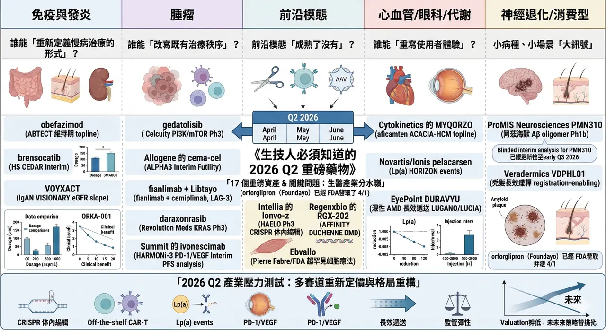
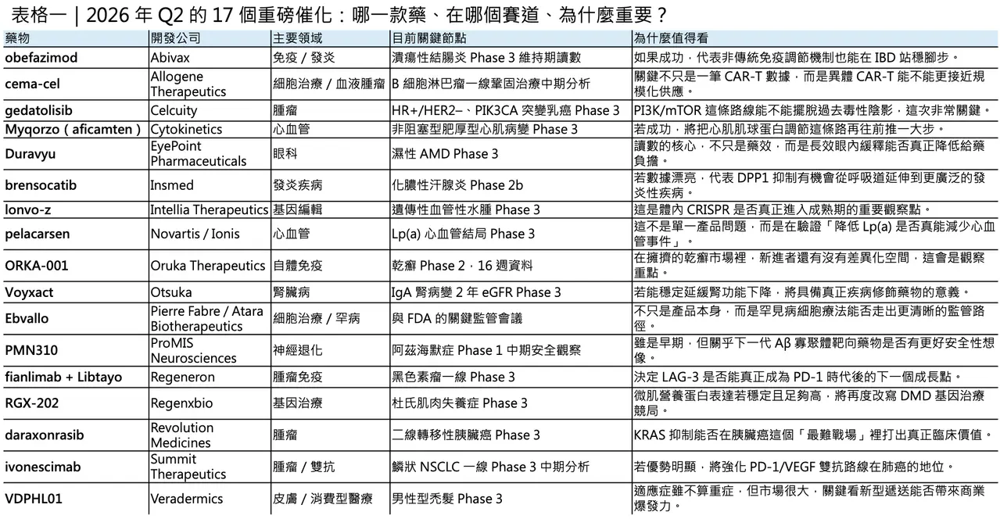
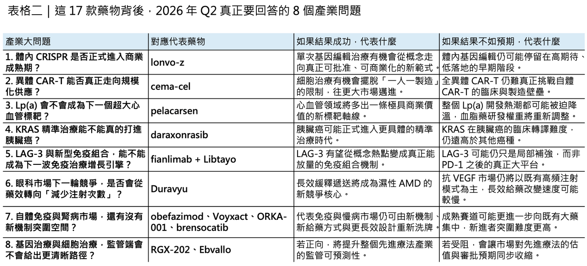

# 生技人必須知道的 2026 Q2 重磅藥物

## 17 個重磅藥物，正在把 2026 年 Q2 變成生醫產業的分水嶺
2026 年第二季，全球生技醫藥產業正走進一個少見的高密度催化期。若把臨床讀數、監管決策與關鍵會議節點一起看，從 4 月到 6 月前後，至少有 17 個值得緊盯的重磅資產將陸續揭曉方向；更早一步，Eli Lilly 的口服減重藥 orforglipron（Foundayo） 已在 4 月 1 日獲 FDA 核准，也等於替整個季度先開了一槍。這一波催化之所以重要，不只是因為數量多，而是因為其中多數資產都已走到晚期臨床、關鍵監管或平台定錨階段，結果將直接改寫未來幾年的賽道排序。

✦更精確地說，這不是一個單純「消息很多」的季度，而是一個會同時回答多個產業級問題的季度：

🔹 CRISPR 體內編輯到底成熟到哪裡了？

🔹 allogeneic CAR-T 能不能真的走出個體化製造限制？

🔹 Lp(a) 降低到底會不會轉成心血管事件下降？

🔹 晚期腫瘤裡的 KRAS、LAG-3 與 PD-1/VEGF 雙抗組合是否真的能撬動標準治療？

🔹 眼科長效遞送、口服免疫調節與神經退化新抗體，又能不能把給藥模式與疾病機制一起往前推。

嚴格來說，並非所有事件都會在同一個季度內完整揭露，例如 PMN310 的 blinded interim analysis 已由公司更新為早期 Q3；但市場關注的高峰，毫無疑問就是這個 Q2。

✦【先看免疫與發炎：真正的焦點不是再打一個老靶點，而是誰能重新定義慢病治療的形式】

在免疫與發炎領域，最值得追的幾個名字很鮮明。Abivax 的 obefazimod 將在潰瘍性結腸炎 ABTECT 維持期給出 topline 結果；公司已在 2026 年初與 3 月安全性審查後重申，維持期讀數預計落在 late Q2 2026。Insmed 的 brensocatib 則會在化膿性汗腺炎 CEDAR Phase 2b 研究中交出 topline data；Otsuka 的 VOYXACT（sibeprenlimab-szsi） 雖已率先在 IgA 腎病變取得「降低蛋白尿」的 FDA 核准，但真正決定它長期疾病修飾價值的，還是 VISIONARY 這個以兩年 eGFR slope 為核心的後續結果；至於 Oruka 的 ORKA-001，公司在 2026 年 1 月已把 EVERLAST-A 的 16 週資料更新為 2Q 2026 可讀。這四個節點放在一起看，等於是在回答同一個大問題：未來的免疫慢病藥物，究竟是要靠新機制、新劑型，還是更極致的長效設計來搶位。

這組資產之所以有意思，還因為它們代表的是四種完全不同的競爭哲學。obefazimod 不是走傳統強力免疫抑制，而是試圖用更偏調節型的方式重塑發炎訊號；brensocatib 想證明 DPP1 抑制能否從呼吸道疾病跨到其他嗜中性球驅動病種；VOYXACT 則把 IgA 腎病變從「只能先看蛋白尿」推向更硬的腎功能終點；而 ORKA-001 所屬的長效抗體邏輯，則是在高度擁擠的乾癬市場中，用更長半衰期去換更低給藥頻率與更高便利性。這幾個案例共同說明：現在免疫市場的升級，不再只是找新標靶，而是誰能把療效、便利性與長期依從性一起重寫。

✦【腫瘤這邊更殘酷：不是有數據就夠，而是你能不能改寫既有治療秩序】

腫瘤領域這一季的關鍵讀數，幾乎每一個都直接連著商業定位。Celcuity 的 gedatolisib 將在 VIKTORIA-1 的 PIK3CA-mutant 隊列交出 Phase 3 topline；Allogene 的 cema-cel（cemacabtagene ansegedleucel） 會在 ALPHA3 做 1H 2026 的 interim futility analysis，且公司文件已明確寫到 4 月的 MRD clearance 比較；Regeneron 的 fianlimab + Libtayo（cemiplimab） 將在一線黑色素瘤的 Phase 3 讀出 topline，管理層在 2026 年 3 月也明講資料將在 first half 結束前到來；Revolution Medicines 的 daraxonrasib 將於 RASolute 302 在二線轉移性胰臟癌做 pivotal readout；Summit 的 ivonescimab 也會在 HARMONi-3 的鱗狀 NSCLC 隊列做 Q2 2026 interim PFS analysis。這五個節點，幾乎把 2026 年腫瘤藥最關鍵的幾條主線全包進來了。

真正值得注意的是，這些產品各自對應的都不是單一藥效問題，而是更高一層的產業判斷。gedatolisib 若成功，會重新打開曾因毒性與定位問題而變得尷尬的 PI3K/mTOR 路線；cema-cel 若能在一線鞏固場景證明 off-the-shelf allogeneic CAR-T 的可行性，意義將遠大於單一產品，因為它碰的是細胞治療規模化供應的根本問題；fianlimab + cemiplimab 則是在測試 LAG-3 究竟能否成為 PD-1 之後真正站穩的下一個大 checkpoint；daraxonrasib 將直面胰臟癌這個最難攻破的 precision oncology 場景；而 ivonescimab 若在一線肺癌持續站得住，則會進一步強化 PD-1/VEGF 雙特異抗體在全球商業上的可信度。這不是「哪顆藥比較好」而已，而是哪一條技術路線能在未來五年搶到更高話語權。

✦【基因編輯、細胞治療與基因療法：Q2 真正要回答的是「前沿模態成熟了沒有」】

如果說傳統小分子與抗體是在搶市場，那麼這一季對前沿模態而言，更像是在搶「成熟權」。Intellia 的 lonvo-z（lonvoguran ziclumeran） 已完成全球 HAELO Phase 3 收案，公司指引是 mid-2026 出數據，並在正向情況下於 2026 年下半年遞件；Regenxbio 的 RGX-202 則持續用 AFFINITY DUCHENNE 的資料去證明其 microdystrophin 表達與功能改善潛力；而 Ebvallo（tabelecleucel） 的關鍵不是單次讀數，而是 Pierre Fabre 與 FDA 在 Type A meeting 後，能否把超罕見適應症細胞療法的審查路徑講清楚。這三個事件其實共同指向一件事：前沿療法現在最缺的，已經不是概念，而是能否被監管、臨床與支付端一起接受的穩定性。

在這裡，lonvo-z 尤其關鍵。它是全球最受矚目的體內 CRISPR 計畫之一，而且還不是停留在早期 proof-of-concept，而是已走到真正的 Phase 3。若 HAELO 成功，市場看到的不只是遺傳性血管性水腫的新療法，而是「單次體內編輯」這件事，已經從科學故事走向商業與法規故事。相較之下，RGX-202 代表的是另一種成熟度測試：AAV 基因治療在 DMD 這種高需求、高競爭、對表達量與功能關聯極度敏感的領域，到底能不能穩定複製成績。而 Ebvallo 這條線則提醒市場，細胞治療的真正挑戰有時不是藥理，而是製造一致性、試驗設計與極小病人族群下的證據門檻。

✦【心血管、代謝與眼科：成熟市場的競爭，正在從「有沒有藥」變成「誰能重寫使用者體驗」】

如果把腫瘤與基因療法之外的市場放在一起看，Q2 還有三顆藥特別值得追：Cytokinetics 的 MYQORZO（aficamten）、Novartis／Ionis 的 pelacarsen，以及 EyePoint 的 DURAVYU。Cytokinetics 已在 2026 年 2 月與後續簡報中明確表示，ACACIA-HCM 的 topline 結果會在 Q2 2026 揭曉；pelacarsen 的 Lp(a) HORIZON 則仍是 2026 年上半年最受關注的心血管事件驅動試驗之一；而 EyePoint 也持續指引 DURAVYU 在濕性 AMD 的 LUGANO／LUCIA 資料將從 mid-2026 開始讀出。這三個節點放在一起看，非常像成熟市場的新一輪規則戰：一個在測心肌肌球蛋白調節能否擴張至 non-obstructive HCM，一個在測 Lp(a) 這個新標靶到底能不能真的改變心血管結局，一個則在測「長效遞送」會不會徹底改寫抗 VEGF 的給藥頻率與病人負擔。

這些資產的共同點，是它們都不只是改善一個數值，而是在挑戰現有照護模式。aficamten 若在 non-obstructive HCM 成功，將讓心肌肌球蛋白抑制這條路線從較窄的結構性心肌病場景進一步擴張；pelacarsen 若能把 Lp(a) 降低真正轉成事件下降，將不只是再多一顆降脂藥，而是建立一個全新心血管大標靶；至於 DURAVYU，若真能在濕性 AMD 用 6 個月重打一次的節奏維持視力效果，它打的就不是單一藥效，而是整個抗 VEGF 市場最痛的「注射頻率」問題。這類產品之所以重要，正是因為它們一旦成功，改變的往往不只是處方，而是整個市場結構。

✦【神經退化與消費型市場：小病種、小場景，不代表不是大訊號】

這一季還有兩個看似沒那麼「大藥廠核心」的名字，其實也值得看。PMN310 是 ProMIS Neurosciences 在阿茲海默症上的 Phase 1b 資產，公司最新說法是：病人 6 個月評估會在 Q2 完成，但 blinded interim analysis 已往 early Q3 2026 移；而 Veradermics 的 VDPHL01 則在男性型禿髮的首個註冊導向試驗上，官方仍指引 H1 2026 有 topline。前者是阿茲海默症抗體策略是否能從廣泛清除 plaque，轉向更精準鎖定 toxic oligomer 的早期檢查點；後者則在測試一件很現實的事：在龐大的消費型醫療市場裡，遞送方式與耐受性，能不能創造出足夠大的商業差異。

這兩個案子雖然不像 pelacarsen 或 lonvo-z 那樣帶有全賽道級的宏大敘事，但它們對產業同樣有價值。PMN310 若在安全性與 ARIA 風險上展現優勢，將替下一代 Aβ 藥物路線開出新的可能；VDPHL01 若能證明長效緩釋 minoxidil 的臨床可行性，也意味著男性禿髮這個看似「輕症」的領域，仍可能長出高黏著、高支付意願的新型產品。對資本市場來說，這類資產有時不是因為市場規模小就不重要，而是因為它們常常最早反映出「技術平台能否跨出第一個商業化場景」。

✦【別只盯臨床，監管日曆同樣會重畫估值地圖】

除了上述 17 個臨床與準監管催化，Q2 的 FDA 時程表本身也很有戲。除了已經在 4 月 1 日搶先獲批的 Foundayo（orforglipron），

🔹 Replimune 的溶瘤病毒 RP1（vusolimogene oderparepvec） 目標 action date 是 4 月 10 日；

🔹 Travere 的 FILSPARI（sparsentan） 在 FSGS 的補件 action date 是 4 月 13 日；

🔹 Axsome 的 AXS-05 用於阿茲海默症激動症的 PDUFA 日期是 4 月 30 日；

🔹 Eisai／Biogen 的皮下 LEQEMBI IQLIK（lecanemab-irmb） action date 是 5 月 24 日；

🔹 Pfizer／Arvinas 的 vepdegestrant 則是 6 月 5 日。

這些節點的重要性在於，它們不只會影響單一公司股價，也會同步校正市場對溶瘤病毒、腎病適應症擴張、阿茲海默症行為症狀藥物、皮下給藥轉型，以及口服 SERD 商業化空間的預期。

✦【結語：這不是一個「很多讀數」的季度，而是一個「很多賽道一起被重新定價」的季度】

把這些事件串起來看，2026 年第二季真正要回答的，其實不是「哪一款藥會漲、哪一家公司會跌」這麼簡單。它更像是一場大規模的產業壓力測試：

🔹 體內 CRISPR 能否正式跨過概念驗證期

🔹 allogeneic CAR-T 能否走向規模化

🔹 Lp(a) 是否會成為下一個大型心血管標靶

🔹 LAG-3 與 PD-1/VEGF 雙抗能否在實戰中站穩

🔹 長效遞送 是否足以在眼科與皮膚科改變照護流程

🔹 在監管端，FDA 對新模態與新劑型的容忍度究竟擴張到哪裡

這些問題的答案，會在未來幾個月陸續浮現。

也因此，Q2 2026 真正值得記住的，不是單一催化本身，而是這些催化共同指向的一個事實：

全球生醫產業已經進入一個「舊賽道還沒結束，新範式已經開始搶位」的重疊期。

先進療法、成熟標靶、給藥創新與監管路徑，正在同一個季度裡彼此碰撞。對投資人而言，這是估值重新排序的時間；對藥企而言，這是決定未來三到五年戰略重心的時間；對整個產業而言，這很可能會是下一輪格局重構真正開始發生的季度。
--------------
參考資料：

[0]: 各公司官網＆公開資料

[1]:

"Biopharma catalysts in Q2 2026 signal high-profile approval decisions and rising competition, reveals GlobalData - International Biopharmaceutical Industry"

[2]:

[3]:

[4]:

[5]:

[6]:

FDA Approves First New Molecular Entity Under National Priority Voucher Program | FDA

The U.S. Food and Drug Administration today approved Foundayo (orforglipron) marking the fifth approval under the Commissioner's National Priority Voucher (CNPV) pilot program.

www.fda.gov

---

本文僅供產業研究與知識分享，不構成投資、醫療、募資或個股建議。
