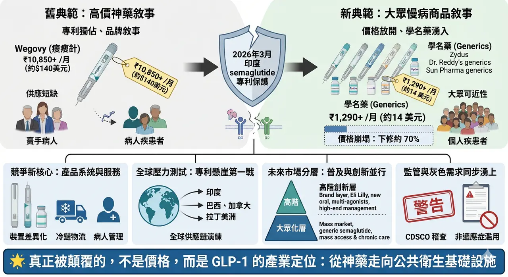
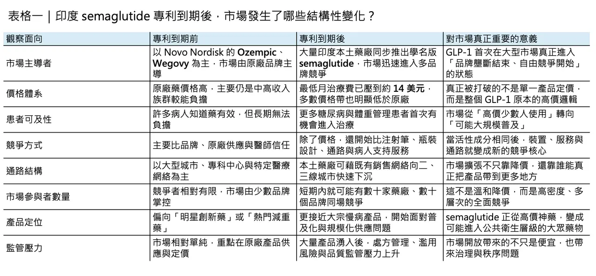
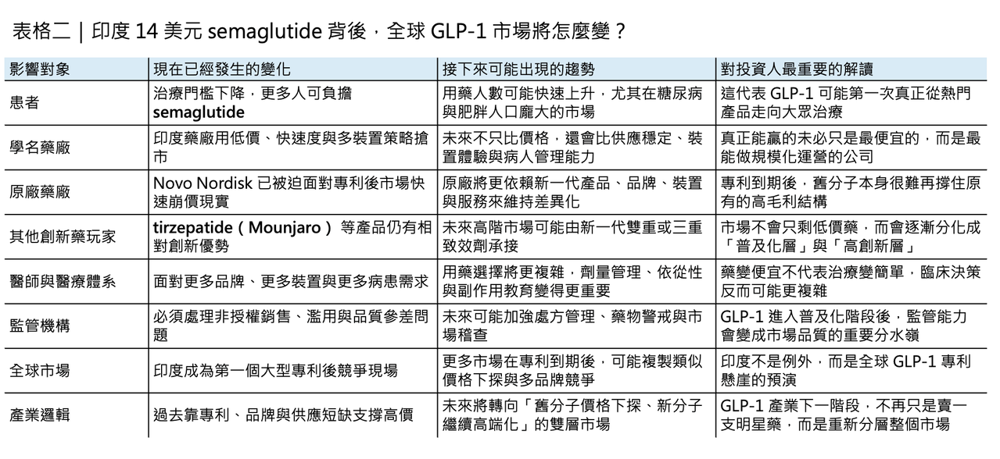

# 骨折價 瘦瘦針來了，每月420塊台幣

## 當 semaglutide （瘦瘦針）在印度跌到每月 14 美元，真正被顛覆的不是減重藥價格，而是整個 GLP-1 市場的商業邏輯
2026 年 3 月，semaglutide （瘦瘦針）在印度迎來一個足以寫進產業教科書的時刻。隨著 Novo Nordisk 在印度的核心專利到期，這個過去幾年幾乎重新定義全球減重與代謝治療想像的分子，第一次在一個具備龐大人口基數、成熟學名藥工業與高度自費特性的超大型市場，正式進入白熱化的專利後競爭。
這不是單純多了幾個便宜版 Ozempic 或 Wegovy，而是整個 GLP-1 產業第一次被迫面對一個真正尖銳的問題：當明星分子失去專利保護後，它究竟會繼續維持「高價神藥」地位，還是迅速被打回大宗慢病產品的本質？
## 價格崩塌，不只是便宜，而是價格體系被整個改寫

印度給出的答案，比市場原本預期得更激烈。就在專利到期後幾天內，多家印度藥廠同步推出學名版 semaglutide，首波產品已把治療成本壓低約 70%；不同品牌、不同劑量與不同裝置形式的月治療費，大致落在 ₹750 到 ₹4,200 之間。
更具象徵意義的是，市場最低入門版本甚至已經壓到每月 ₹1,290，約 14 美元。和 Novo Nordisk 在 2025 年 11 月主動下修後、仍落在每月 ₹10,850 至 ₹16,400（約140美元） 的 Wegovy 價格相比，這已經不是折扣，而是價格體系本身被直接改寫。
這個斷裂之所以重要，不只是因為數字很好看，而是因為它第一次讓大家看見：GLP-1 藥物過去幾年被包裹在專利、品牌、供應短缺與需求爆發之中的高價敘事，其實在特定市場條件下，可以比想像中更快鬆動。
印度並不是一個普通的單點市場，而是一個自費比重高、醫療價格極度敏感、且本土藥廠能夠在專利到期後迅速放量的市場。超過 40 家印度藥廠將在短期內推出超過 50 個 semaglutide 品牌，這代表競爭從一開始就不是「有沒有替代品」，而是直接進入「誰能最快搶到最大規模」的紅海。
對所有還把 GLP-1 想成少數富裕族群專屬療法的人來說，印度等於當場示範了一次完全不同的市場劇本。
## 真正的戰爭，不只是價格，而是整套產品系統

但如果把這件事只理解成價格戰，其實還是太淺了。印度這一波真正值得細看的，是競爭結構的層次比外界想得複雜得多。
🔹 Sun Pharma、Dr. Reddy’s、Zydus、Torrent、Glenmark 等公司推出的，並不是完全同質的商品。
🔹 有些用可重複使用的筆型注射器，有些用拋棄式筆，有些採小瓶裝，有些甚至同時押注口服與注射版本。

當活性成分一樣時，差異化就從分子本身，轉移到裝置、冷鏈、使用體驗、醫師信任與通路覆蓋。也因此，市場最後未必會由最低價產品通吃，而更可能是由那些能把「藥、裝置、供應與服務」一起打包的公司勝出。Zydus 與 Lupin 在專利到期前就先簽下共同推廣與供貨協議，正是這種體系化競爭開始成形的訊號。
這也說明了，為什麼每月 14 美元雖然是最吸睛的標題，卻不會是這場戰爭真正的終點。
Semaglutide 用在第二型糖尿病與體重管理時，本來就不是一次性消費，而是高度依賴長期依從性、劑量漸進調整與副作用管理的慢性治療。決定市場勝負的關鍵不只在價格，而在醫師對品牌的信任，以及產品是否能穩定提供裝置品質與冷鏈條件。
更進一步看，部分印度藥廠已經不是只想賣學名藥，而是想把 semaglutide 做成「藥物加服務」的長期經營生態。換句話說，印度市場真正被打開的，不只是價格天花板，也是病人管理商業模式的想像空間。
## 價格放開之後，灰色需求與監管壓力也一起湧上來
當然，這種爆量開放也立刻帶來另一面。專利一到期，價格迅速下探，需求被大量釋放，最先浮上檯面的不只會是新病人，還會是灰色購買、非適應症濫用與美容化使用。
這並不是抽象風險。3 月 24 日，印度主管機關 CDSCO 已針對未經授權的減重藥銷售與宣傳加強稽查，並對 49 家批發商、零售商與瘦身診所等實體展開檢查，同時發出違規通知。主管機關也明確點出，這類藥物若在缺乏醫療監督下使用，可能導致嚴重不良反應與健康風險。
這意味著，GLP-1 進入專利後時代後，市場要面對的第一場新戰役，已經不再只是專利攻防，而是醫療治理與處方秩序能不能跟上價格崩跌之後的需求洪流。
## 印度不是局部事件，而是全球 GLP-1 專利懸崖的第一場壓力測試
從國際角度看，印度這一幕之所以關鍵，正在於它不是局部事件，而更像是全球 GLP-1 專利懸崖的第一個大型壓力測試。
印度藥廠不只盯著本土市場，也已把加拿大、巴西、拉丁美洲、土耳其等海外市場列入後續布局。這代表印度現在發生的，並不只是本地學名藥廠分食 Novo Nordisk，而是整個全球供應鏈開始演練一個新時代：
當 semaglutide 在更多市場逐步失去專利保護之後，競爭重心會從「誰有分子」轉向：
✨ 誰有產能
✨ 誰有裝置
✨ 誰有通路
✨ 誰有品牌信任
✨ 誰有病人支持能力
對創新藥廠而言，這也是非常殘酷的提醒——專利到期之後，想守住市占，靠的將不再是舊分子本身，而是下一代產品、品牌護城河與整體服務系統。
## Novo 與 Lilly 早就聞到風向，但專利到期的洪流很難真正擋下
Novo Nordisk 其實早就嗅到這個風向。早在 2025 年 11 月，公司就已在印度把 Wegovy 價格下調最高達 37%，顯然是在為專利到期前的防守預做準備；另一邊，Eli Lilly 的 Mounjaro（tirzepatide） 也早已搶先在印度打出存在感，甚至曾在當地成為銷售額最高的藥品。這說明創新藥廠並不是不知道專利懸崖要來，而是即使提早降價、擴通路，也很難在一個能夠一次湧入數十家本土競爭者的市場裡，長期維持原有的定價秩序。
對 Novo 與 Lilly 而言，印度現在已經不是單純的成長市場，而是未來全球 GLP-1 市場分層化競爭的預演現場。
## 真正被顛覆的，不是價格，而是 GLP-1 的產業定位
所以，這場看似由 14 美元引爆的新聞，真正改寫的其實不是某個月費價格，而是整個產業對 GLP-1 的想像方式。
未來幾年，GLP-1 市場很可能會逐漸分裂成兩層：
🌿 一層是以 semaglutide 為代表、價格快速下移、以慢病普及與大規模可近性為目標的「大眾化層」。
🌿 另一層則是由創新藥廠主導、圍繞新劑型、新裝置、口服版本、雙重或三重致效劑，以及更完整病人管理服務的「高階創新層」。
印度現在發生的，不是 GLP-1 神話的結束，而是它從高價神藥走向公共衛生基礎設施的起點。
真正值得記住的，從來都不只是 semaglutide 在印度跌到每月 14 美元，而是這個價格第一次讓全世界看見：
當專利失守，GLP-1 可以從少數人的熱門產品，瞬間變成多數人的慢病商品。
-------
參考資料：
0.各公司官網＆公開資料
1.Salve,P.et al.India is launching cheap,weight-loss drugs and Novo Nordisk is betting on its brands to stay on top.CNBC.23.03.2026.
2.Sanjay,S.Ozempic Copies at$14 in India as Novo Patent Expires.Bloomberg.20.03.2026.
3.Generic Ozempic to cost Rs 1,290 in India:A game changer in the fight against obesity?Firstpost.20.03.2026.
4.Novo Nordisk patent expiry opens door to cheaper weight-loss drugs in India.CNBC.19.03.2026.
5.Dunleavy,K.With Novo's semaglutide going off patent,Indian drugmakers set to launch their cheaper generics.FiercePharma.20.03.2026.
6.Novo to track generic surge as semaglutide goes off patent.India Times.21.03.2026.

---

本文僅供產業研究與知識分享，不構成投資、醫療、募資或個股建議。
