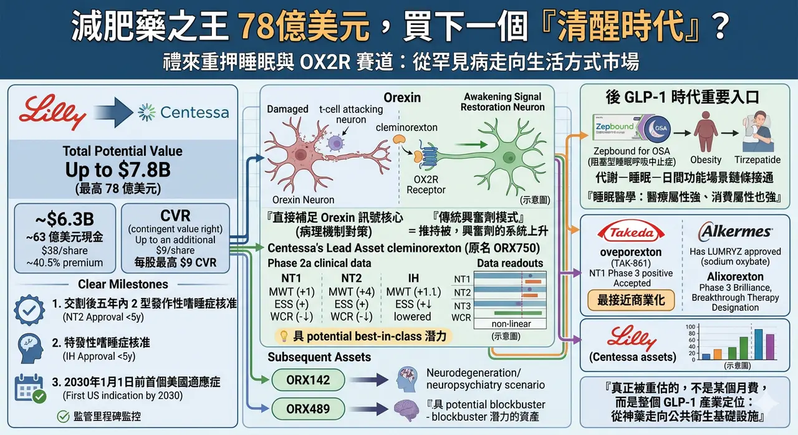
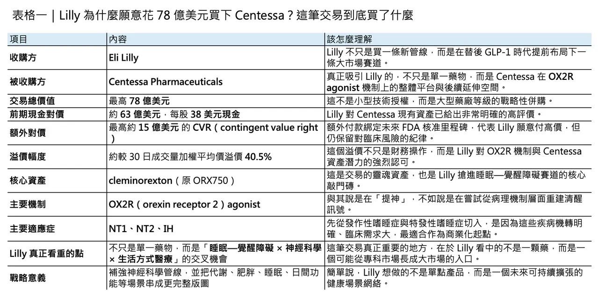
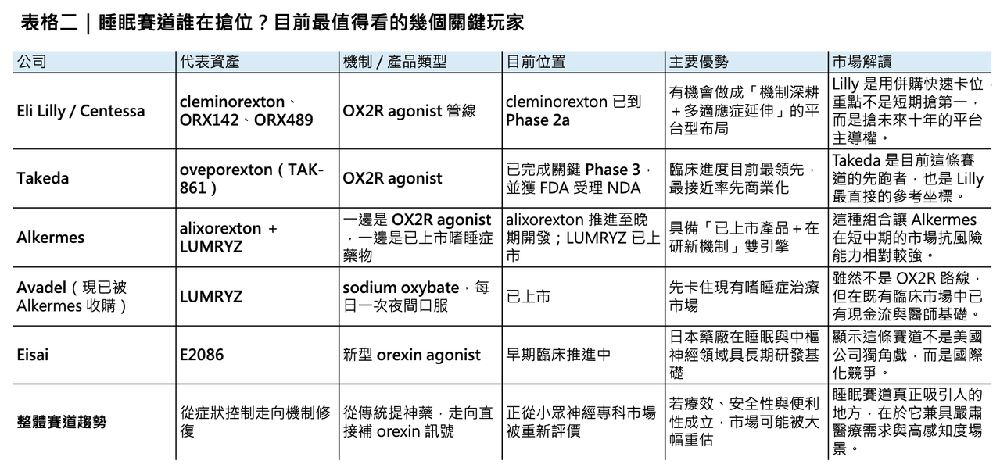

# 減肥藥之王 78億美元，買下一個「清醒時代」？

## 禮來重押睡眠與 OX2R 賽道
當 Eli Lilly（禮來） 以最高 78 億美元 收購 Centessa Pharmaceuticals，這筆交易表面上看，是大藥廠再一次用高溢價把一條中期臨床資產收入囊中；但若把時間線再拉長一點，它其實更像是一場很有方向感的提前卡位。因為 Lilly 買下的不只是 cleminorexton 這一顆藥，而是整個 orexin receptor 2（OX2R） 機制在睡眠—覺醒障礙、神經退化疾病，甚至更廣泛中樞神經系統場景中的長期選擇權。

這也是為什麼，若只把這筆交易理解為「Lilly 想補一條神經科學管線」，其實還不夠。更準確的說法是：在 tirzepatide 已經把代謝與體重管理從嚴肅醫療推向更大消費場景之後，Lilly 正在尋找下一個既有明確醫學需求、又有可能外溢到更大生活方式市場的機制。睡眠與清醒，剛好符合這個條件。Lilly 自己也早已把睡眠議題從代謝場景往前推進，因為 Zepbound（tirzepatide） 已在 2024 年底取得 FDA 核准，用於治療合併肥胖的中重度阻塞型睡眠呼吸中止症（OSA）。這意味著，Lilly 並不是突然看見睡眠，而是早就開始把睡眠視為下一個值得做大的臨床與商業介面。
## 一場不是單純追價的併購

根據 Lilly 與 Centessa 公布的交易條款，Lilly 將以 每股 38 美元現金收購 Centessa 全部已發行股份，前期現金對價約 63 億美元；此外，Centessa 股東還會拿到一張不可轉讓的 CVR（contingent value right），未來若 cleminorexton 或 ORX142 在特定期限內拿下 FDA 核准，還可額外取得合計 每股最高 9 美元 的對價，讓整筆交易的總潛在價值來到 78 億美元。官方資料也明確指出，這個 38 美元現金價格，相較於 Centessa 截至 2026 年 3 月 30 日的 30 日成交量加權平均價格，溢價約 40.5%，而交易預計在 2026 年第三季完成。

更值得注意的是，這不是那種「先把錢全付了再說」的豪賭型交易。CVR 的三個里程碑綁得很清楚：

🔹 其一，是 cleminorexton 或 ORX142 在交割後五年內取得 2 型發作性嗜睡症核准。

🔹 其二，是同樣期限內拿到 特發性嗜睡症核准。

🔹 其三，則是其中任一分子在 2030 年 1 月 1 日前先拿下一個美國適應症。

這種「高首付＋明確監管里程碑」的架構，反映的不是 Lilly 被市場熱度推著走，而是它願意為這個機制的潛力先付出大部分溢價，但又把最終價值的兌現，綁在最關鍵的監管節點上。這其實是一種相當典型、也相當成熟的大藥廠併購邏輯：對機制高度認可，對臨床風險仍保留紀律。

從產業角度看，這筆交易的重要性還在於規模本身。這是 Lilly 自 2019 年以約 80 億美元收購 Loxo Oncology 以來，規模最大的一筆併購。當一家已經在 GLP-1 時代掌握巨大市值與現金流的公司，仍然願意用這種等級的資本去買一條睡眠—覺醒資產，市場自然會把它解讀成一個明確訊號：睡眠醫學，正從一個相對小眾的神經專科領域，逐步被重估為下一個可能長出大型產品的平台市場。
## 為什麼 Centessa 值得這個價？

答案其實不只是一個詞：cleminorexton。

但如果要把事情講完整，Lilly 真正買的不是單一分子，而是 Centessa 在 OX2R agonist 上已經建立起來的一整套深度。Lilly 在官方新聞稿中明確指出，Centessa 不只有一個領頭分子，而是已經組出一個以 OX2R 為核心、可往睡眠—覺醒障礙以及更廣泛神經、神經退化、神經精神領域延伸的產品組合。除了主力資產 cleminorexton（原名 ORX750），還包括臨床中的 ORX142 以及更早期的 ORX489。這種「一個核心分子＋後續延伸資產」的組合，對大型藥廠的吸引力遠高於單點資產，因為它意味著收購之後不只是接一顆藥，而是直接接手一個可能持續長出新適應症與新產品的機制平台。

其中最核心的當然還是 cleminorexton。截至 Lilly 宣布收購時，這顆口服 OX2R agonist 已在 1 型發作性嗜睡症（NT1）、2 型發作性嗜睡症（NT2） 與 特發性嗜睡症（IH） 的 Phase 2a 研究中，展現出 Lilly 所謂的「potential best-in-class profile」。Centessa 在 2025 年 11 月公布的臨床更新更進一步提供了市場之所以願意買單的原因：在 NT1、NT2 與 IH 三個隊列中，ORX750／cleminorexton 都在關鍵指標上顯示出具有統計顯著與臨床意義的改善，包括 Maintenance of Wakefulness Test（MWT） 與 Epworth Sleepiness Scale（ESS）；而在 NT1 中，連 weekly cataplexy rate（WCR） 也出現顯著下降。公司同時表示，整體安全性與耐受性輪廓大致可控，未見臨床上有意義的心臟、視覺、肝臟或腎功能問題。

這組數據之所以重要，不只是因為「看起來有效」，而是因為它打中了當前睡眠—覺醒障礙治療最核心的痛點：現有藥物雖然能幫助部分患者維持白天清醒，卻往往仍停留在症狀控制，而非對機制本身下手。對 NT1 而言，病理根源是大腦中產生 orexin 的神經元流失，導致清醒訊號不足；OX2R agonist 的價值，就在於它不是像傳統興奮劑那樣「把系統整體往上拉」，而是試圖重建這條最核心的覺醒訊號。

這也解釋了為什麼 orexin biology 會被越來越多人視為睡眠醫學中最值得押注的新機制。Lilly 神經科學事業負責人 Carole Ho 在交易公告中直接把它稱為神經科學中最具吸引力的機制機會之一，因為它相當於直接介入睡眠—覺醒週期的「主開關」。這句話其實點得很準：如果一個機制能夠直接碰到中樞神經系統中維持清醒的核心迴路，那麼它的應用想像空間，就不會只停留在一兩個罕見適應症。

## 為什麼 OX2R 這麼吸引人？
很多人把嗜睡症理解成「很想睡」，但實際上，narcolepsy 並不是單純疲倦。特別是 NT1，其核心是 orexin deficiency，患者除了白天過度嗜睡，還可能出現猝倒、夜間睡眠破碎、REM 睡眠異常侵入清醒期等問題。這些症狀不只是讓人愛睏，而是會直接干擾工作、學習、駕駛與日常生活功能。

傳統治療的限制也很明顯。像 modafinil 這類藥物，對改善白天過度嗜睡有效，但系統性回顧顯示，它對 cataplexy 並沒有顯著幫助；而 LUMRYZ（sodium oxybate） 雖然是目前睡眠醫學中相當重要的已上市產品，且具有「once-nightly」的便利優勢，但本質上仍屬於另一條路線，不是直接補足 orexin 訊號本身。換句話說，既有藥物大多仍是在管理症狀，而不是直接碰觸病理核心。這也是為什麼 OX2R agonists 會被視為可能改寫治療範式的新一代分子。

更關鍵的是，orexin 這個系統的價值，不只停留在嗜睡症。Centessa 與 Lilly 都在官方敘述裡把 impaired attention、cognitive deficits、fatigue 等更廣泛的中樞神經症狀納入了 OX2R 資產的發展想像，而 ORX142、ORX489 本身也就是往神經退化與神經精神領域去鋪。這表示 Lilly 看中的，不是一個只服務於稀有病的單點市場，而是一條未來可能往更多高需求 CNS 場景擴張的中樞機制平台。
## 這其實也是一筆很典型的 Lilly 式交易
如果只從分子研發角度看，這筆交易是買進睡眠—覺醒賽道；但如果把 Lilly 近年的路線連起來看，它其實還有另一層邏輯：把醫學剛需與高支付意願的生活場景慢慢串起來。

在 tirzepatide 成功之後，Lilly 已經不是單純在賣一顆降糖藥或減重藥，而是在經營一個更大的代謝健康敘事。當 Zepbound 拿下 OSA 適應症，Lilly 其實已經用事實證明，代謝疾病與睡眠問題並不是兩條完全分開的線：肥胖會提高 OSA 風險，睡眠中斷又會進一步惡化代謝，兩者彼此放大。從這個角度看，今天 Lilly 再往 wakefulness 與 orexin 賽道延伸，並不只是補神經科學管線，更像是在把「代謝—睡眠—日間功能」這條使用者體感極強的場景鏈條接得更完整。這不等於明天就會出現 tirzepatide + OX2R agonist 的標準配方，但至少在戰略層面，Lilly 已經把這兩塊拼圖擺到同一張桌子上。

這也是我認為這筆交易最精妙的地方。表面上，Lilly 買的是一個罕見睡眠障礙管線；但更深一層，它其實是在搶占一個可能從專科用藥逐步往更大睡眠健康市場滲透的入口。因為睡眠不是一個單純「可有可無」的健康議題，它介於嚴肅醫療與高頻感知需求之間：病人症狀真實、臨床需求迫切、使用者對療效感知直接，而且一旦藥物真的能把白天清醒度、夜間節律、認知與疲勞表現拉出明顯差距，支付意願自然不會低。這就是為什麼睡眠雖然不像腫瘤那樣總是被放在產業新聞頭條，卻很可能是下一個「醫療屬性強、消費屬性也強」的重磅場景。這是市場對這筆交易高度興奮的真正原因之一。
## 但這不是沒有對手的藍海
若說 Lilly 這筆交易代表的是「搶位」，那麼這個位子其實早就有人在搶。

目前最領先的仍是 Takeda（武田）。它的 oveporexton（TAK-861） 在 2025 年 7 月已公布兩項 Phase 3 研究達成所有主要與次要終點，並在 2026 年 2 月獲 FDA 受理 NDA，且拿到 Priority Review。也就是說，在 NT1 這個最具代表性的 orexin 缺失疾病中，Takeda 很可能已經站在最接近商業化的位置。如果 Lilly 收購 Centessa 是為了快速切入，那麼它要追趕的第一個標竿，很明顯就是 Takeda。

另一個不能忽略的對手，是 Alkermes。它在 2026 年 2 月完成對 Avadel 的收購，把已上市的 LUMRYZ 納入商業組合，同時又在 2026 年 4 月正式啟動 alixorexton 的 Phase 3 Brilliance 計畫。更重要的是，alixorexton 還在 2026 年初拿到 FDA 的 Breakthrough Therapy Designation，顯示監管端對其在 NT1 的數據品質已有相當程度的正面評價。這種「已上市產品＋晚期研發資產」的雙輪驅動模式，意味著 Alkermes 在短中期其實具備相當強的市場韌性：它不必像純研發公司一樣全靠單一試驗讀出吃飯，而是已經先在睡眠醫學市場站住腳。

從更廣的國際視角看，這條賽道也不再只是美國公司的遊戲。日本的 Takeda 已經把 oveporexton 推到 NDA，Eisai 也在 2025 年公布其新型 orexin agonist E2086 的臨床更新，顯示日本在睡眠藥理與 orexin 軸上的布局仍然非常深。換句話說，Lilly 這次不是在一片無人之地插旗，而是在一場已經明顯升溫的國際競賽中，用併購把自己快速拉進第一集團。
## 所以，Lilly 到底買到了什麼？
若只從財務角度看，Lilly 當然是買進了一個具 blockbuster 潛力的資產。市場報導引述分析師觀點時，也已把 cleminorexton 視為可能具備 best-in-class 輪廓的分子，並給出未來數十億美元級別的銷售想像。可是若只用 peak sales 去理解，反而會低估這筆交易。

我更傾向把它看成：Lilly 用 78 億美元，買下一個「後 GLP-1 時代」的重要入口。這個入口有三個特質。

🔹 第一，它仍然有非常硬的醫學需求，不是單純保健品敘事。

🔹 第二，它的療效一旦成立，病人感受會非常直接，這使它天然具備大市場放大的可能。

🔹 第三，它與代謝、肥胖、疲勞、認知、情緒等一整串未來可能彼此連動的場景，都有潛在連結。

這正是大型藥廠最想要的資產樣貌：先從嚴肅疾病切入，再沿著機制與場景往外擴。

Lilly 當然不是現在就贏了。cleminorexton 還需要更完整的註冊性臨床資料，Takeda 仍然跑在前面，Alkermes 也已把商業與晚期開發綁在一起；而且睡眠醫學真正要走向大市場，還得經過療效、耐受性、支付與診斷滲透率等多重考驗。

可這筆交易至少已經清楚告訴市場一件事：下一輪大藥廠尋找新成長曲線，未必只會在腫瘤、免疫或 GLP-1 延伸裡打轉。睡眠—覺醒障礙，正在從神經科學的邊線，走向未來十年更值得下注的核心場景之一。

而 Lilly 這次的 78 億美元，買的也不只是「清醒」這件事本身。它買的是一個判斷：在下一個時代，真正值錢的藥，不只是延命，也要能讓人活得更清楚、更有功能、更像自己。

這，可能才是睡眠賽道最值得被重估的地方。
-------------
參考資料：

[0]: 各公司官網＆公開資料

[1]:

Lilly to acquire Centessa Pharmaceuticals to advance treatments for sleep-wake disorders

/PRNewswire/ -- Eli Lilly and Company (NYSE: LLY) and Centessa Pharmaceuticals plc (Nasdaq: CNTA), a clinical-stage company developing a new class of medicines...

www.prnewswire.com

"Lilly to acquire Centessa Pharmaceuticals to advance treatments for sleep-wake disorders"

[2]:

FDA Approves First Medication for Obstructive Sleep Apnea | FDA

Today, the FDA approved the first medication for the treatment of moderate to severe obstructive sleep apnea in adults with obesity, to be used in combination with a reduced-calorie diet and increased physical activity.

www.fda.gov

[3]:

reuters.com

https://www.reuters.com/legal/transactional/eli-lilly-buy-centessa-pharma-63-billion-deal-2026-03-31/

www.reuters.com

[4]:

Centessa Pharmaceuticals Reports Financial Results for the Third Quarter of 2025 and Provides Update on Potential Best-in-Class Orexin Receptor 2 (OX2R) Agonist Program - BioSpace

https://www.biospace.com/press-releases/centessa-pharmaceuticals-reports-financial-results-for-the-third-quarter-of-2025-and-provides-update-on-potential-best-in-class-orexin-receptor-2-ox2r-agonist-program

www.biospace.com

"Centessa Pharmaceuticals Reports Financial Results for the Third Quarter of 2025 and Provides Update on Potential Best-in-Class Orexin Receptor 2 (OX2R) Agonist Program - BioSpace"

[5]:

YouTube

The FDA has accepted Takeda’s NDA and granted Priority Review for Oveporexton (TAK‑861), a potential first‑in‑class treatment for Narcolepsy Type 1.

www.takeda.com

---

本文僅供產業研究與知識分享，不構成投資、醫療、募資或個股建議。
