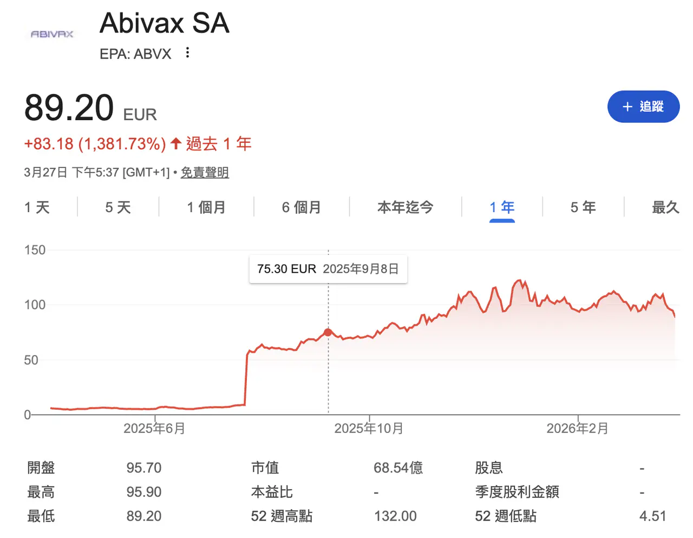
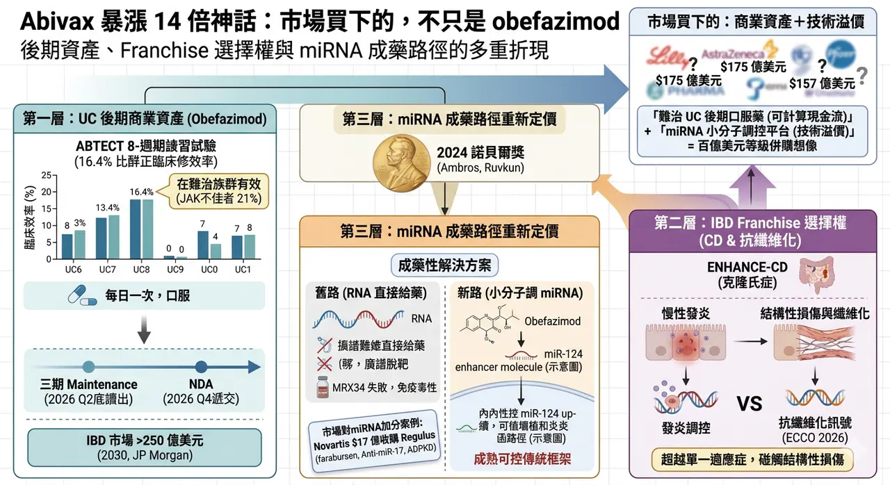
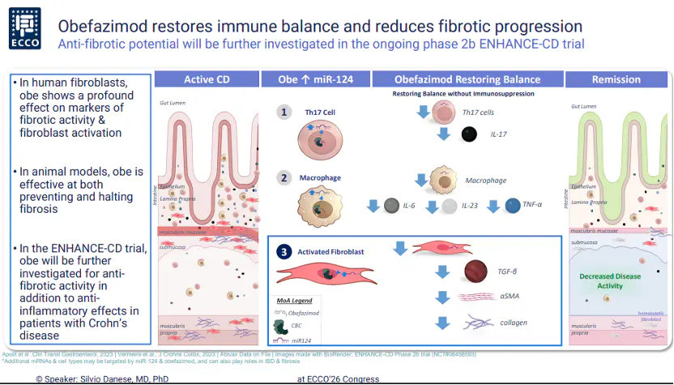
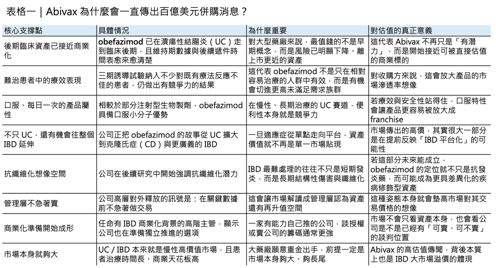
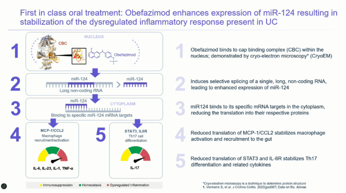
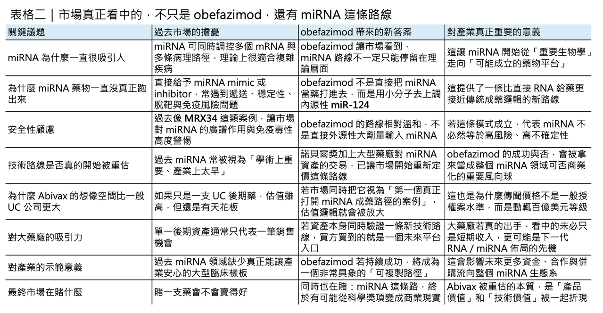

# 歐洲生技公司Abivax 一年暴漲14倍的神話

## 150 億美元併購緋聞背後，市場真正想買下的，不只是 obefazimod
Abivax 近幾個月的股價與話題熱度，幾乎都圍繞著同一件事打轉：它到底會不會成為下一個大型藥廠出手收購的標的。
1 月，市場一度傳出 Eli Lilly（禮來）有意以約 150 億歐元、折合約 175 億美元的價格收購 Abivax，之後遭法國官方與公司管理層否認；3 月，又有法媒稱 AstraZeneca（阿斯利康）可能出價約 157 億美元，Abivax 隨後同樣公開駁斥，稱相關說法只是「毫無根據的傳聞」。
但值得玩味的是，這些傳聞雖然一再被否認，卻沒有因此消失，反而愈傳愈密。
這其實透露出一個更重要的現象：市場正在重新評估 Abivax 的價值，而它被重估的理由，既不是單純的題材炒作，也不只是潰瘍性結腸炎（ulcerative colitis, UC）的一支後期資產，而是 obefazimod 與其背後 miRNA 成藥路徑可能同時進入兌現期。
## 第一層價值：市場真正先看見的，還是 obefazimod

真正撐起 Abivax 估值的第一根樑柱，當然還是 obefazimod 本身。
這是一個口服、每日一次的小分子藥物，Abivax 將其定義為 first-in-class 的 miR-124 enhancer。它目前最核心的適應症是中重度活動性 UC，而這個市場本來就是全球慢性發炎疾病裡最有價值、也最競爭的戰場之一。
今天 UC 的治療選項其實已經不少，從 Takeda（武田）的 vedolizumab、AbbVie（艾伯維）的 upadacitinib，到 Eli Lilly（禮來）的 mirikizumab，都在不同機制上切入發炎反應；但臨床現實仍是，許多患者會在既有 biologics（生物製劑）或小分子藥物治療後出現反應不足、失去反應，或被安全性與長期監測問題限制。
也因此，任何能夠在難治族群中做出更穩定療效、同時又保有口服便利性的資產，都很容易被大型藥廠放進高度關注清單。
路透也引述分析師觀點指出，J.P. Morgan 預估美國發炎性腸道疾病（IBD）市場到 2030 年規模可望超過 250 億美元，這種市場天花板，正是併購傳聞會一再出現的根本背景。

## 真正讓市場願意重新定價的，是它已經拿出的後期數據

而 obefazimod 之所以能被推到這樣的估值帶，靠的不是抽象故事，而是它已經拿出來的後期臨床數據。
2025 年 7 月，Abivax 公布兩項三期 ABTECT 8 週誘導試驗結果：在 50 mg 每日一次劑量下，obefazimod 在合併分析中達到 16.4% 的安慰劑校正臨床緩解率，並且在 ABTECT-1 與 ABTECT-2 兩項試驗中都達成 FDA 主要終點。
更關鍵的是，這批受試者並不算「好打」：約 47.3% 曾對先前 advanced therapy（進階治療）反應不足，其中約 21% 曾對 JAK inhibitor（JAK 抑制劑）反應不佳。
換句話說，這不是在一個相對乾淨、容易出效果的病人群體中拿到的漂亮數字，而是在相對棘手的後線或難治患者中，把藥效證明出來。
對併購方來說，這種數據的價值，遠高於早期概念驗證，因為它已經開始接近「可商業化風險明顯下降」的階段。
## 現在最敏感的，不只是數據，而是時間點

真正讓市場情緒持續升溫的，則是時間點。
根據 Abivax 2025 年全年業績更新，三期 ABTECT maintenance 試驗目前仍按計畫推進，3 月 18 日的 DSMB 會議也未發現新的安全訊號，公司預計在 2026 年第二季稍晚公布維持期 topline 結果；若數據正向，NDA 有望在 2026 年第四季遞交。
這讓 Abivax 進入一個非常敏感的窗口期：再過幾個月，它就會從「已有三期誘導數據的後期生技公司」，進一步變成「接近遞件的潰瘍性結腸炎商業資產」。
從併購邏輯來看，這正是估值彈性最大的時候。太早買，風險太高；太晚買，價格可能更高。這也是為什麼 Abivax 執行長 Marc de Garidel 近來選擇一再淡化市場雜音，表示公司不急著在關鍵數據前做交易，因為一旦 maintenance 結果也順利過關，整個談判天平很可能會向賣方傾斜。

## 第二層價值：市場買的，也不只是一個 UC 藥

如果說 UC 三期數據是第一個估值支點，那麼第二個支點，就是 obefazimod 並不一定只是一支 UC 藥。
Abivax 在 2026 年 ECCO 年會上首次公開其在 IBD 前臨床模型中的抗纖維化訊號，並明確表示將在 ENHANCE-CD 試驗中進一步評估其在 Crohn’s disease（克隆氏症）的潛力。
這一點之所以重要，是因為 IBD 領域最難處理的問題之一，從來不只是當下的發炎，而是慢性發炎往後拖帶出的結構性損傷與纖維化。
一旦 obefazimod 的故事從「一支 UC 口服新藥」延伸成「可能同時碰到發炎調控與抗纖維化的 IBD 平台資產」，它的估值模型就不再只是單一適應症貼現，而會開始帶上整個 IBD franchise 的選擇權溢價。
這也是為什麼市場願意反覆用十幾甚至接近二十億美元的價格去傳它——因為大家真正買的不是一個短期銷售峰值，而是它未來能不能成為整個 IBD 產品線的核心。
## 第三層價值：真正讓市場興奮的，是 miRNA 這條路也可能開始成熟
但若只把 Abivax 當成一支 UC 後期資產，又還是低估了它。
因為市場更深層的興奮，來自 miRNA 這條技術路線本身可能開始被重新定價。
2024 年，諾貝爾生理學或醫學獎頒給 Victor Ambros 與 Gary Ruvkun，表彰他們對 microRNA 的發現與其在轉錄後基因調控中的角色。
對科學界來說，這是對一條已經研究超過 30 年的基礎生物學路徑正式加冕；對產業界來說，則像是一個訊號：這條路徑終於有機會從「機制很重要」走到「藥物也能成立」。
問題在於，miRNA 領域過去一直不是沒有理論，而是太缺成功樣板。
## miRNA 過去最痛的地方，就是成藥性
這條路線過去最大的痛點，正是成藥性。
直接給予 miRNA mimic（模擬物）或 inhibitor（抑制劑），常常要面對遞送困難、體內穩定性不足、化學修飾複雜、廣譜脫靶與免疫副作用等多重挑戰。
最著名也最具警示性的例子，就是 MRX34。這個 liposomal miR-34a mimic（脂質體 miR-34a 模擬物）曾是第一個走進人體臨床的 miRNA 藥物之一，但最終在一期試驗中因出現 5 例嚴重免疫相關不良事件而被終止。
這件事對整個產業的打擊很大，因為它提醒所有人：miRNA 的廣譜調控能力雖然理論上迷人，臨床上卻也可能正因為太「廣譜」，而帶來無法預期的毒性。
也正因如此，miRNA 領域很長一段時間都處在「學界很興奮，產業很謹慎」的狀態。
## Abivax 的特殊之處：它不是直接做 RNA 藥，而是用小分子去調 miRNA
Abivax 的特殊性，就在於它繞開了這條路上最危險的那一段。
Obefazimod 不是一個直接給予 miRNA mimic 的 RNA 藥，也不是典型 antisense oligonucleotide（反義寡核苷酸），而是一個小分子，透過上調內源性 miR-124 來調節發炎反應。這聽起來只是機制細節，但對資本市場來說意義很大：它等於提供了一種更接近傳統小分子藥物開發框架、卻又能分享 miRNA 生物學紅利的成藥模式。
換句話說，Abivax 的價值不只在於這顆藥會不會賣，而在於它可能證明一件事——miRNA 不一定只能透過高風險的直接 RNA 給藥方式去做，也可以透過更成熟、更可控的小分子調節路徑，走出一條比較可商業化的道路。
這也是它為什麼會讓併購傳聞的定價不只是產品估值，而更像技術平台估值。
## 市場會重新替 miRNA 故事加分，也不是只有 Abivax 一家公司在受惠
而市場現在願意重新給 miRNA 故事更高分，也不是只有 Abivax 一家公司在受惠。
2025 年 4 月，Novartis（諾華）宣布收購 Regulus Therapeutics，前金 8 億美元，若加上與監管核准掛鉤的 CVR，總交易價值最高可達約 17 億美元；交易核心資產 farabursen，是一個靶向 miR-17 的寡核苷酸，用於治療 autosomal dominant polycystic kidney disease（常染色體顯性多囊腎病）。
這筆交易非常關鍵，因為它意味著大型藥廠不是在口頭上說「miRNA 很重要」，而是真金白銀開始為這條路線付費。
當 Novartis 願意為一個以 miRNA 為核心的臨床期資產付出這樣的價格時，市場自然也會開始問：那麼手上握有後期資產、且更接近商業化的 Abivax，究竟應該值多少？
## 所以，市場真正想買下的，不只是 obefazimod
所以，回到最初那個問題：為什麼 Abivax 明明一再否認傳聞，市場卻還是不斷把它推向十幾甚至接近二十億美元的併購想像？
答案其實很簡單。
因為現在市場看到的，已經不是一家法國生技公司手上有一支 UC 候選藥物，而是一個更大的組合：
✨ 一支已經走到臨床後期、在難治患者中證明自己、維持期數據即將讀出、潛在可延伸至整個 IBD 領域的商業資產；
✨ 再加上一條剛被諾貝爾獎與大型藥廠交易重新點亮的 miRNA 技術路線。
前者提供了可計算的現金流想像，後者則提供了可被放大的技術溢價。百億美元等級的收購緋聞，說穿了，就是這兩層價值被同時折現後的結果。
至於 Abivax 最終會不會真的賣，反而未必是此刻最重要的問題。更重要的是，當 maintenance 數據在 2026 年第二季晚些時候揭曉時，市場就會第一次真正知道：它現在被傳的，不只是價格，還是下一個 miRNA 成藥時代的門票。
---------------
參考資料：
[0]: 各公司官網＆公開資料
[1]:
reuters.com
https://www.reuters.com/business/healthcare-pharmaceuticals/abivax-ceo-dismisses-noise-around-rumored-eli-lilly-bid-2026-01-20/
www.reuters.com
"Abivax CEO dismisses 'noise' around rumored Eli Lilly bid | Reuters"
[2]:
"Abivax Announces Positive Phase 3 Results from Both ABTECT 8-Week Induction Trials Investigating Obefazimod, its First-in-Class Oral miR-124 Enhancer, in Moderate to Severely Active Ulcerative Colitis | Abivax"
[3]:
"Abivax Announces Full Year 2025 Financial Results and Provides Business Updates | Abivax"
[4]:
www.biospace.com
https://www.biospace.com/press-releases/abivax-presents-first-evidence-of-anti-fibrotic-activity-for-obefazimod-alongside-new-clinical-efficacy-and-safety-analyses-in-inflammatory-bowel-disease-at-ecco-2026
www.biospace.com
"Abivax Presents First Evidence of Anti-Fibrotic Activity for Obefazimod Alongside New Clinical Efficacy and Safety Analyses in Inflammatory Bowel Disease at ECCO 2026 - BioSpace"

---

本文僅供產業研究與知識分享，不構成投資、醫療、募資或個股建議。
