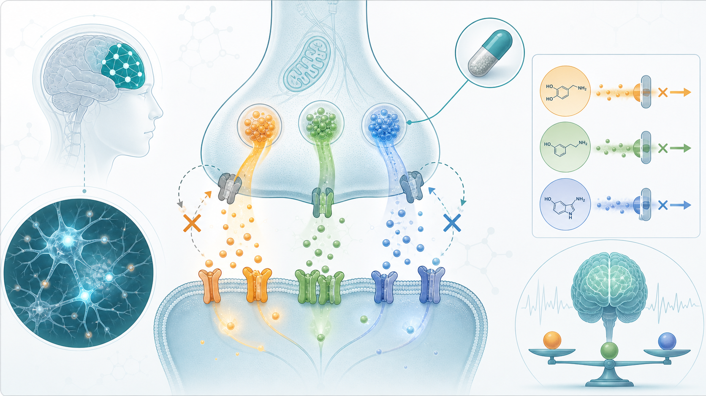

# Centanafadine’s Phase 3b Win: Why ADHD Treatment Is Moving Beyond Discipline and Toward Neurobiology

Attention-deficit/hyperactivity disorder, or ADHD, has just produced an important late-stage clinical update.

The public conversation around discipline, school behavior, and “tough education” often creates a tempting but dangerous illusion: if a child is disruptive, inattentive, impulsive, or unable to sit still, the answer must be stricter control.

That logic may feel emotionally satisfying in drama. In real life, it can easily turn into harm.

Many children who are labeled disobedient, rebellious, lazy, or intentionally difficult are not morally defective. They may be struggling with a neurodevelopmental condition.

That condition is ADHD.

ADHD is not laziness. It is not simply poor parenting. It is not a behavioral defect that can be corrected by scolding or punishment. It involves the prefrontal cortex, attention control, impulse inhibition, working memory, emotional regulation, and reward circuitry. When neurotransmission is unstable, patients may present with distractibility, restlessness, impulsivity, procrastination, emotional outbursts, and difficulty completing tasks.

The problem is that society often sees the behavior before it sees the biology.

As a result, some children are blamed as “problem students,” pushed into high-pressure disciplinary environments, or forced to absorb a burden that should never have been placed on them. What should be broken is not the child. It is the ignorance and stigma surrounding ADHD.

That is the broader context in which a new ADHD drug-development update matters.

Otsuka has reported positive Phase 3b results for centanafadine in adults with ADHD and comorbid anxiety. If approved by the FDA, centanafadine would become the first approved norepinephrine, dopamine, and serotonin reuptake inhibitor for ADHD. In other words, it is designed to inhibit the reuptake of three monoamine neurotransmitters at the same time: norepinephrine, dopamine, and serotonin.

The FDA has accepted centanafadine’s new drug application and granted priority review. The target review date is July 24, 2026.

## 01 | ADHD Is Not Just Hyperactivity. Anxiety and Emotional Burden Often Amplify the Disease

Many people still imagine ADHD as a young boy who cannot sit still, talks during class, or interrupts impulsively.

Real-world ADHD is far more complex.

Some patients are not visibly hyperactive. Instead, they struggle with distractibility, time management, severe procrastination, forgetfulness, low work efficiency, and chronic disorganization. Some adults do not recognize the pattern until they enter the workplace and realize they have lived for years inside a cycle of chaos, anxiety, and self-blame.

A further challenge is that ADHD is often comorbid with anxiety.

When attention is unstable, tasks remain unfinished. When failure experiences accumulate, anxiety can become another layer of burden. Anxiety makes it harder to focus; ADHD makes it harder to resolve anxiety. The two can reinforce each other and create a vicious cycle.

That is why centanafadine’s Phase 3b data are worth watching.

The study did not select only the simplest ADHD population. It enrolled 315 adults with ADHD and either generalized anxiety disorder or social anxiety disorder. This is a clinically meaningful population because patients with ADHD and anxiety can be harder to treat. Some ADHD medications may worsen anxiety, and physicians often need to be more cautious when selecting therapy.

According to Otsuka, the randomized, double-blind, placebo-controlled Phase 3b trial used change from baseline to week 8 in the Adult ADHD Investigator Symptom Rating Scale, or AISRS, as the primary endpoint. A key secondary endpoint was change from baseline to week 8 in the Hamilton Anxiety Rating Scale, or HAM-A.

The result:

The centanafadine arm showed an 18.5-point reduction in AISRS total score from baseline.

The placebo arm showed a 12.6-point reduction.

The between-group difference was roughly 5.87 points and reached statistical significance.

On anxiety:

The centanafadine arm showed a 12.5-point reduction in HAM-A.

The placebo arm showed a 10.6-point reduction.

That difference also reached statistical significance.

One detail matters: separation from placebo was observed as early as week 1 and was maintained through the 8-week study period.

For ADHD treatment, early onset matters. Patients and families often fear the uncertainty of “not knowing whether the medication is working.” If no change is seen, adherence can weaken quickly. A week-1 signal suggests that, if approved, centanafadine could have practical value in real-world treatment persistence.

## 02 | Centanafadine’s Key Feature Is Not Just Efficacy. It Is the Simultaneous Regulation of Three Neurotransmitter Pathways

Centanafadine’s mechanism is the core of the story.

Existing ADHD drugs can be broadly divided into two major categories.

The first category is central nervous system stimulants, such as methylphenidate. Representative products include Ritalin and Concerta. These drugs can be effective and fast-acting, and they remain important options in treatment guidelines. But they may also involve appetite loss, insomnia, palpitations, and controlled-substance management concerns.

The second category is non-stimulants, such as atomoxetine, represented by Strattera, and viloxazine extended-release, marketed as Qelbree. These options avoid the abuse concerns associated with traditional stimulants, but onset speed, efficacy strength, and patient fit vary.

Centanafadine is trying to create a third path.

It acts on three neurotransmitter systems:

Norepinephrine is linked to alertness, attention, and working memory.

Dopamine is linked to motivation, reward, impulse control, and executive function.

Serotonin is linked to emotional regulation, anxiety, impulse control, and stability.

Neurons communicate by releasing signaling molecules into the synaptic space. If those neurotransmitters are not taken up by the next neuron, they can be recycled by the previous neuron through transporter systems. Centanafadine’s role is to slow the reuptake of norepinephrine, dopamine, and serotonin, allowing those signals to remain in the synaptic space longer and providing more stable stimulation to the prefrontal cortex and related neural circuits.

The significance of this triple mechanism is that it does not only target attention and hyperactivity. It may also address emotional dysregulation and anxiety comorbidity, both of which are common in ADHD.

Of course, this does not mean centanafadine will replace all ADHD medications.

ADHD is a highly heterogeneous condition. Some patients respond very well to methylphenidate. Others may be better suited to atomoxetine. Some need behavioral therapy, parent training, school support, and medication in combination.

Centanafadine’s value is that it adds a new mechanistic option. For patients with comorbid anxiety, poor stimulant tolerability, or a need for broader symptom control, it may create a new clinical possibility.

## 03 | Extended Release Matters: ADHD Does Not Exist Only During Class or Office Hours

ADHD symptoms do not appear only during school or work.

Morning delays, chaotic routines, daytime distractibility, afternoon fatigue, evening emotional outbursts, and difficulty winding down before sleep are all part of the daily reality for many patients and families.

That means an ADHD drug should not be judged only by whether it works. It also matters whether its effect can cover the day in a stable way.

Traditional immediate-release formulations can produce peaks and troughs in blood concentration. Peaks can concentrate side effects; troughs can allow symptom rebound. Some long-acting formulations improve this problem, but if concentrations fall too quickly in the evening, patients may still experience late-day mood swings, irritability, fatigue, and sleep difficulties.

Otsuka is developing centanafadine as a once-daily extended-release capsule. The goal is a smoother concentration curve.

That matters in chronic ADHD treatment because the goal is not merely to help a patient concentrate for a few hours. The goal is to help the patient complete tasks more consistently, control impulses, reduce conflict, and weaken the cycle of anxiety and frustration across daily life.

In the Phase 3b trial, commonly reported adverse events included nausea, decreased appetite, diarrhea, insomnia, dry mouth, and vomiting. Overall, the safety profile was consistent with centanafadine’s known profile and with expectations in an ADHD population with comorbid anxiety. No new safety signal was identified.

## 04 | ADHD Treatment Is Not About Making Children “Behave.” It Is About Giving the Brain a Chance to Function

ADHD medication is easily misunderstood.

Some people worry that medication will make children dull.

Some believe ADHD is overdiagnosed.

Some think discipline alone is enough.

But real ADHD treatment is not about turning children into obedient machines. It is about helping patients recover brain functions that are being drowned out by noise.

Medication is only one part of care. A more complete treatment approach should include diagnostic assessment, parent education, behavioral therapy, school support, sleep and lifestyle management, and, when needed, treatment of anxiety, depression, learning disorders, or autism-spectrum comorbidities.

Centanafadine’s meaning lies in adding a new pharmacologic tool.

If approved, it will not make ADHD treatment suddenly simple. But it could give physicians more room to individualize therapy.

Adult ADHD patients with comorbid anxiety have often lived in a treatment gap. Stimulants may work, but some patients worry that anxiety could worsen. Non-stimulants may be gentler, but onset and efficacy may not always be enough. If centanafadine can improve both core ADHD symptoms and anxiety scores, it may help fill that gap.

## 05 | Taiwan’s ADHD Medication Access: What to Watch

This story also offers a useful lens for looking at ADHD medication access in Taiwan.

Lotus Pharmaceutical, ticker 1795.

In 2025, Lotus reached an agreement with Supernus to obtain exclusive rights to Qelbree, or viloxazine extended-release, in Taiwan, South Korea, Hong Kong, and several Southeast Asian markets. Qelbree is a non-stimulant ADHD medication already approved in the United States for patients aged 6 and above. For patients who need non-stimulant options, it may help address a treatment gap.

This logic is similar to centanafadine’s broader significance: ADHD treatment is moving from a stimulant-dominated model toward more mechanisms and more patient stratification.

Center Laboratories, ticker 6677.

Center Laboratories represents another route in the ADHD field. The company has worked with Taiwan Walker to transfer ownership and sales rights for an already marketed psychiatric ADHD medication, with production expected to be handled by its subsidiary OEP Pharma. The company has also stated that the product is the only domestic generic with the same ingredient and dosage form as the original patented drug.

The more practical issue is supply stability. Taiwan has previously faced unstable supply of Ritalin, or methylphenidate. Taiwan’s Food and Drug Administration approved Center Laboratories to manufacture methylphenidate tablets under a shortage-response project, with expected supply to domestic medical institutions and pharmacies.

ADHD treatment demand is being seen again. The market needs more diverse, more stable, and more accessible medication options.

## Conclusion | What Should Be Abandoned Is Not the Child, but the Old Assumption That ADHD Is a Character Problem

If centanafadine is approved by the FDA in July 2026, it will mark an important moment in ADHD treatment.

It is not only a new drug. It represents a shift in ADHD drug development from a single-pathway approach toward more refined neurotransmitter modulation. It also reflects a more serious medical effort to address the complex relationship among ADHD, anxiety, emotional regulation, and adult functional impairment.

But the concept matters even more than the drug.

ADHD patients do not need humiliation. They do not need punishment. They do not need empty advice to “try harder.” They do not need to be pushed into high-pressure, closed disciplinary environments.

They need accurate diagnosis, professional treatment, parental understanding, school support, and a society willing to recognize a basic truth:

Some behavioral problems are signs that the brain is asking for help.

In 1792, French physician Philippe Pinel removed chains from psychiatric patients and helped move those once treated as mad back into the realm of medical care. More than two centuries later, we should also help children with ADHD break a different kind of chain.

That chain is stigma.

Centanafadine’s value is not only that it may become another prescription option. It reminds us that when science moves forward, education and society cannot remain stuck in punishment.

## References

[Otsuka Announces FDA Acceptance and Priority Review of New Drug Application for Centanafadine for the Treatment of ADHD in Children, Adolescents, and Adults](https://www.otsuka-us.com/)

[Otsuka Announces Positive Phase 3b Results for Centanafadine in Adults with ADHD and Comorbid Anxiety](https://www.otsuka-us.com/)

[Centanafadine Demonstrates Statistically Significant, Clinically Relevant Improvements in ADHD Symptoms](https://www.pharmacytimes.com/)
