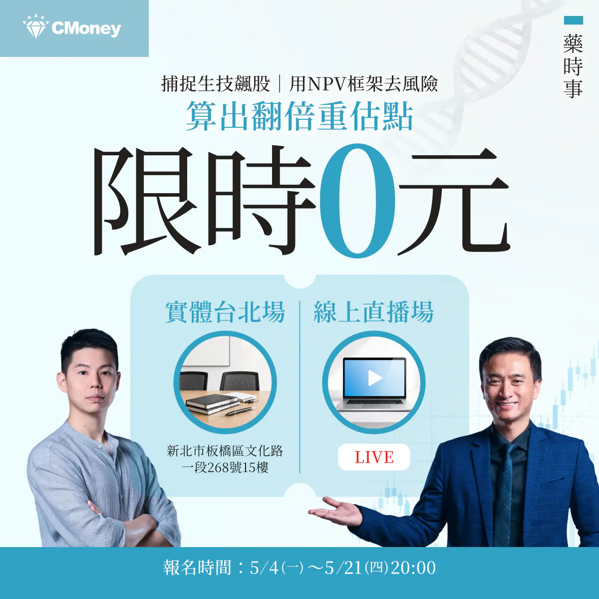
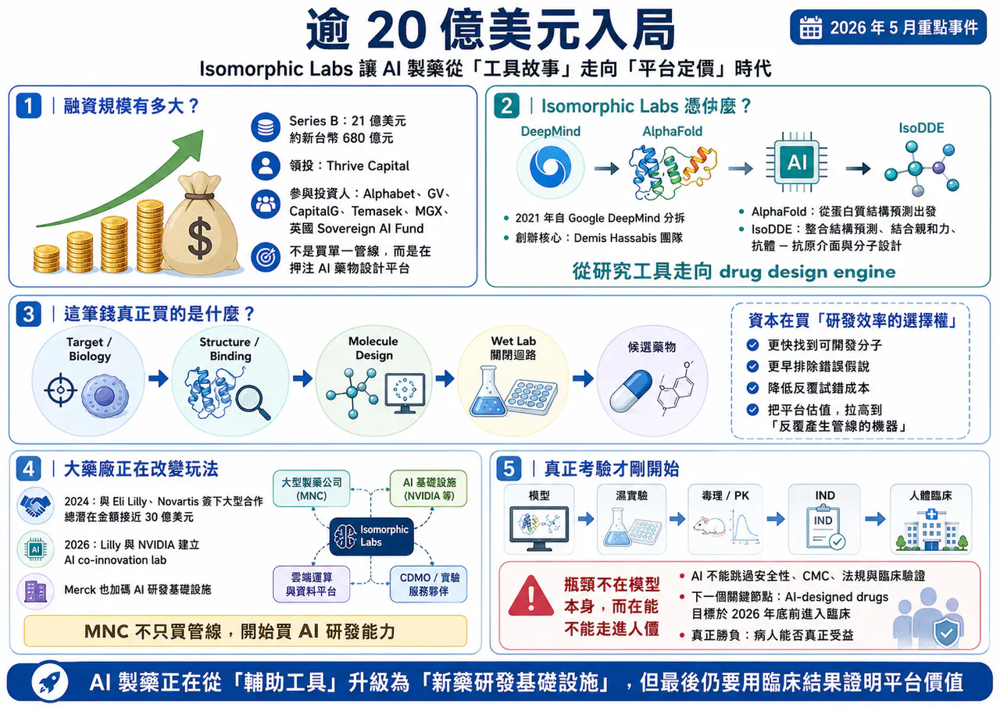
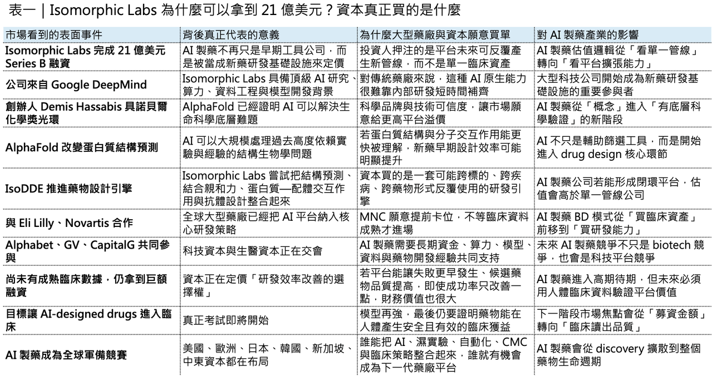
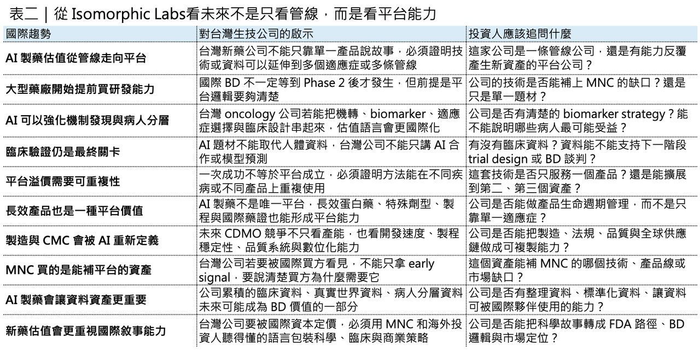

# 破紀錄 AI 製藥融資來了！Google 系公司一次募 21 億美元

---

## 倒數 1 天！

【限時免費－台北場】藥時事｜捕捉生技飆股：用NPV框架算出翻倍重估點

課程裡我們會講解生技醫藥股的估值邏輯，以及投資人如何抓住被低估的生技股票！

我們更是會以台灣生技之光 藥華藥（6446）作為我們的案例拆解他的估值與目標價

以下為報名連結歡迎大家踴躍報名：

【限時免費-線上直播】藥時事｜捕捉生技飆股：用NPV框架算出翻倍重估點｜CMoney 理財寶

藥時事 X CMoney 攜手打造，推出由藥時事主講的《【限時免費-線上直播】藥時事｜捕捉生技飆股：用NPV框架算出翻倍重估點》課程，藉由藥時事的投資經驗分享，幫每一個人做好人生投資。2026年05月21日(四) 20:30-21:30開課，現在報名只要0元 (原價6666元)！限時限額開放，立即報名！

www.cmoney.tw

## 逾 20 億美元入局：Isomorphic Labs 讓 AI 製藥從「工具故事」走向「平台定價」時代

🧬 全球 AI 製藥產業，又出現一筆足以改寫市場想像的超大型融資。

2026 年 5 月 12 日，由 Google DeepMind 分拆而出的 AI 製藥公司 Isomorphic Labs 宣布完成 21 億美元 Series B 融資。這輪資金由 Thrive Capital 領投，Alphabet、GV、CapitalG、Temasek、MGX，以及英國 Sovereign AI Fund 等投資人共同參與。這不只是 AI 製藥領域少見的十億美元級融資，也代表資本市場正在用完全不同於傳統 biotech 的方式，重新定價 AI drug design platform。

這筆錢有多大？

21 億美元，約新台幣 680 億元左右。放在傳統 biotech 世界裡，這幾乎是許多中大型藥廠併購一條臨床中後期管線的規模。但 Isomorphic Labs 目前最特別的地方在於：它還不是一家已有核准藥品、也不是一家已經用臨床數據證明平台成功率的公司。

它到目前為止，真正被資本市場買單的，不是某一個已經上市的新藥，而是一套可能重構新藥研發流程的 AI 藥物設計引擎。如果只把 Isomorphic Labs 看成一家「AI 製藥新創」，會低估這件事。更精準的說法是：這是一場由 Alphabet、DeepMind、全球主權基金、頂級創投與大型藥廠共同參與的新藥研發基礎設施戰爭。過去製藥業投資最核心的問題是：「這家公司有什麼管線？」

🧬 但 Isomorphic Labs 讓市場開始問另一個問題：

如果一家公司掌握了能反覆產生候選藥物、預測分子交互作用、縮短設計迭代週期的底層 AI 平台，它的價值應該用單一管線來估，還是用下一代藥廠作業系統來估？

這就是 AI 製藥進入新階段的真正訊號。

## 01｜Isomorphic Labs 憑什麼拿到 21 億美元？

🔬 Isomorphic Labs 的起點，從一開始就不是普通 biotech。

它在 2021 年從 Google DeepMind 分拆出來，創辦人 Demis Hassabis 同時也是 Google DeepMind 執行長。2024 年，Demis Hassabis 與 John Jumper 因 AlphaFold 對蛋白質結構預測的突破性貢獻，共同獲得諾貝爾化學獎。AlphaFold 不是一般 AI 應用，而是過去十多年生命科學裡最重要的底層工具突破之一。

這也是 Isomorphic Labs 和許多 AI 製藥公司的第一個差異。

它不是從「我用 AI 幫你篩分子」開始，而是從蛋白質結構預測這個生命科學最底層的問題切入。

傳統藥物開發裡，最痛苦的地方之一，是人類對生物系統理解永遠不完整。標的是否正確？蛋白質構型如何變化？ligand 是否真的能結合？抗體是否能打到想要的 epitope？分子是否有足夠的選擇性？這些問題過去大量依賴實驗、經驗與反覆試錯。AlphaFold 的意義，是讓蛋白質結構預測從高度困難的科學問題，變成可以大規模計算、查詢與應用的工具。

🧬 但 AlphaFold 還不是新藥。

從蛋白質結構，到真正設計出安全有效、能進人體、能通過臨床試驗、能被 FDA 或 EMA 核准的藥物，中間還隔著非常長的距離。Isomorphic Labs 現在要做的，就是把 AlphaFold 代表的結構生物學能力，往 drug design engine 推進。這也是為什麼 2026 年初推出的 IsoDDE（Isomorphic Labs Drug Design Engine） 非常關鍵。按照 Isomorphic Labs 官方說法，IsoDDE 不是單一模型，而是一套結合結構預測、結合親和力預測、蛋白質—配體交互作用、抗體—抗原介面建模與分子設計的整合式 AI 藥物設計系統。在部分測試場景中，IsoDDE 的小分子 binding-affinity 預測表現優於 AlphaFold 3，也在抗體—抗原介面預測上展現更高精度。

這裡的重點不是「又一個模型更準」。

重點是 Isomorphic Labs 正在把 AI 從生物研究工具，推向新藥研發的操作系統。過去 AI 在藥物研發裡常常扮演工具角色：幫忙找 target、做 virtual screening、做 docking、預測 ADMET，或協助臨床試驗設計。但 Isomorphic Labs 想要做的事情更大：它希望建立一套跨疾病、跨標的、跨 modality 的通用型 drug design engine。

這就是資本願意給它高溢價的原因。不是因為它現在已經證明能量產成功藥物，而是因為如果它真的做成，這個平台就不是一條管線，而是一台反覆產生管線的機器。

## 02｜這筆錢買的不是臨床數據，而是「研發效率的選擇權」

傳統 biotech 的估值，多半圍繞幾個問題展開。

💰 產品進到第幾期臨床？💰 臨床數據是否達標？💰 適應症市場有多大？💰 競品格局如何？💰 上市機率多少？💰 專利還剩多久？

這套邏輯本身沒有錯，因為藥物開發最終還是要回到人體資料。沒有臨床數據，再漂亮的機制都只是科學假說。但 Isomorphic Labs 的融資，顯示資本市場正在額外定價另一種東西：研發效率的選擇權。所謂選擇權，是指它不一定保證成功，但一旦成功，可能改變整個產業成本結構。傳統新藥研發常被形容為「十年、十億美元、九成失敗」。這句話雖然有點簡化，但基本上反映了製藥產業最殘酷的現實：從 target validation 到 hit finding、lead optimization、IND-enabling studies、Phase 1、Phase 2、Phase 3，再到上市申請，每一步都可能失敗。

而且很多失敗，不是發生在一開始。

最可怕的是，藥廠花了幾年、幾億美元，進到中後期臨床才發現標的錯了、病人分層錯了、biomarker 不夠、療效不夠、毒性不可接受，或試驗設計無法證明真正臨床獲益。AI 製藥真正想解決的，不是讓所有新藥都成功，那是不可能的。

真正有價值的是：能不能在更早期排除錯誤假說？能不能更快找到可開發的分子？能不能降低濕實驗反覆試錯成本？能不能用更好的模型理解蛋白質、ligand、抗體、細胞路徑與疾病網路之間的關係？

如果 AI 能讓前期研發時間縮短、讓候選藥物品質提高、讓失敗更早發生，那就算臨床成功率只提升一點，對大型藥廠的財務意義也非常可觀。這也是為什麼 Isomorphic Labs 即使還沒有成熟臨床數據，仍能吸引這種規模的資金。資本買的不是一個即將上市的藥。資本買的是：如果 AI 真的能讓藥物研發效率出現結構性改善，誰會成為這個新秩序裡的基礎設施公司？

## 03｜大型藥廠已經不只是買管線，而是在買 AI 研發能力

🤝 Isomorphic Labs 並不是孤立事件。

更大的背景是：全球大型藥廠正在把 AI 從「創新部門的試點專案」，拉升到「公司級研發基礎建設」。

2024 年，Isomorphic Labs 與 Eli Lilly、Novartis 簽下大型研發合作，總潛在交易金額接近 30 億美元，合作範圍涵蓋 AI 驅動的新藥設計與多個治療領域。這代表大型藥廠不是只把 Isomorphic Labs 當外包服務商，而是把它視為能進入核心研發流程的平台夥伴。2026 年 1 月，Eli Lilly 又和 NVIDIA 宣布建立 AI co-innovation lab，預計在五年內投入 10 億美元，用 NVIDIA BioNeMo、Vera Rubin 架構與 robotics / physical AI 來推動藥物發現與製造流程。這很重要，因為它說明 AI 製藥不只是在電腦裡跑模型，而是要和實驗室自動化、資料生成、製程與臨床前開發整合。同一時間，Eli Lilly 也與 Chai Discovery 合作，導入其 biologics design 平台，並建立針對 Lilly 內部資料與研發流程客製化的 AI 模型。這代表大型藥廠要的不是「買一套通用軟體」，而是把 AI 模型訓練到自己的資料、自己的標的策略、自己的研發流程裡。Merck 也在 2026 年 4 月與 Google Cloud 達成最高 10 億美元的多年期合作，目標是把 agentic AI 部署到 R&D、製造、商業化與企業營運流程中。這已經不是單純藥物發現，而是大型藥廠把 AI 當成全公司作業系統來重建。

這些案例合起來看，趨勢已經很清楚，大型藥廠正在從「買藥」走向「買能力」。

過去 MNC 最常見的 BD 模式，是等 biotech 把管線推到 Phase 1、Phase 2，看到初步人體訊號後再授權或併購。但現在，MNC 開始提前進場，買演算法、買算力、買資料管線、買 AI 模型、買濕實驗自動化能力，甚至買一整套 drug discovery operating system。這是一個很大的轉變，因為當 AI 成為研發基礎設施，藥廠競爭的核心就不只是誰買到好管線，而是誰能更快產生、篩選、優化與驗證下一批管線。

換句話說，AI 製藥正在把競爭前移。

以前大家比的是 Phase 2 數據，未來可能更早就開始比：誰有更好的資料、模型、計算能力、濕實驗閉環，以及把 AI output 轉成 IND candidate 的能力。

## 04｜AI 製藥真正的瓶頸，不在模型，而在「能不能走進人體」

⚠️ 不過，這裡也必須講清楚一件事。

AI 製藥現在很熱，但它還沒有完全證明自己能系統性提高新藥成功率。AI 可以幫忙設計分子，可以提高部分預測準確度，可以加快早期迭代，也可以降低某些前期實驗成本。但藥物最終不是在電腦裡成功，而是在人體裡成功。一個 AI-designed molecule 要成為藥物，仍然要經過藥效、毒理、PK/PD、CMC、劑型、給藥途徑、臨床試驗設計、病人分層、統計顯著性、風險效益比、法規審查與商業化驗證。這些問題，AI 不能全部跳過。所以 Isomorphic Labs 這輪 21 億美元融資，既是市場對 AI 製藥的高度期待，也是一場非常昂貴的驗證實驗。

Reuters 報導指出，Isomorphic Labs 目前目標是讓第一批 AI-designed drugs 在 2026 年底前進入臨床試驗。這會是下一個真正關鍵節點。因為只有進入人體試驗，市場才能開始判斷：這套 AI drug design engine 到底只是更漂亮的 preclinical engine，還是真的能產生具備臨床競爭力的候選藥物。

這也是投資 AI 製藥時最容易被忽略的地方，AI 模型很強，不等於藥一定會成功。預測結構很準，不等於臨床療效一定明確。binding affinity 很好，不等於安全性、選擇性、組織分布與長期毒性都會過關。因此，AI 製藥真正的勝負，不是誰發表最強模型，而是誰能把模型、資料、實驗、自動化、臨床策略與法規路徑整合成可重複的開發流程。

⚠️ 模型是入口。

⚠️ 濕實驗閉環是核心。

⚠️ 臨床驗證才是終局。

## 05｜台灣生技股的AI轉型？

🔎 對台灣投資人來說，未來國際資本市場看新藥公司，不會只看「你有沒有管線」，也會看「你有沒有平台能力」。

台灣過去很多新藥公司，估值故事比較偏單一產品、單一適應症、單一臨床事件。這種模式不是不能成功，但它的天花板會比較明確。因為一條管線如果臨床失敗，公司估值就會受到很大衝擊；如果適應症太小，BD 談判空間也有限。

AI 製藥時代真正值得台灣公司學習的，不是每家公司都要說自己是 AI 公司。

而是要思考：能不能把一個產品，變成一套可延伸的研發平台？能不能把單一機轉，變成多適應症策略？能不能把臨床資料、biomarker、病人分層與外部合作串成一個更完整的國際 BD 故事？

🔎 以生華科的 CX-4945（silmitasertib）為例，本身不是 AI 製藥公司，但它的價值敘事可以和 AI-driven mechanism discovery、biomarker stratification、適應症擴張與美國資本市場語言連結起來。尤其如果 CX-4945 能透過外部 AI bio 合作，把 casein kinase 2 inhibition 與免疫可見度、抗原呈現、DNA damage response、tumor microenvironment 等機制串得更清楚，它就不只是「一個老藥重新找適應症」，而是有機會成爲一個可被國際投資人理解的 mechanism-driven oncology platform。

這和 Isomorphic Labs 的邏輯不同，但方向相通。

國際市場要看的，不只是「有沒有題材」。而是你能不能把科學假說轉成可驗證的資料包，再把資料包轉成可授權、可投資、可進入美國市場的產品策略。

## 結語｜AI 製藥狂飆，但真正的考試才剛開始

Isomorphic Labs 完成 21 億美元融資，代表 AI 製藥已經進入一個新階段。

✨過去，AI 製藥像是一個令人期待的工具。

✨現在，它開始被資本與大型藥廠視為下一代新藥研發基礎設施。

這筆融資的意義，不只是金額大，而是它把一個問題推到整個產業面前：未來的藥廠，究竟是擁有最多管線的公司，還是擁有最強藥物設計引擎的公司？

答案很可能不是二選一。

真正勝出的公司，必須同時擁有兩者，AI 可以提高研發效率，但不能取代臨床驗證。模型可以加速分子設計，但不能保證病人獲益。算力可以縮短試錯時間，但不能跳過法規、CMC、安全性與商業化。

所以 Isomorphic Labs 這輪融資，是 AI 製藥的里程碑，也是一場壓力測試。接下來市場真正要看的，不是它還能募多少錢，而是它能不能把 AlphaFold、IsoDDE、Google 算力、MNC 合作與自有管線，轉化成真正進入人體、產生臨床價值的新藥。

✨如果做得到，AI 製藥的估值邏輯會被徹底改寫。

✨如果做不到，市場終究會回到 biotech 最殘酷、也最公平的那句話：模型再漂亮，最後還是要看病人有沒有真正受益。

這就是 AI 製藥狂飆背後，最值得冷靜看待的地方。

---

參考資料：

[0]:各公司官網＆公開資料

[1]:

Isomorphic Labs announces Series B investment round  - Isomorphic Labs

https://www.isomorphiclabs.com/articles/isomorphic-labs-announces-series-b-investment-round

www.isomorphiclabs.com

[2]:

AI-developed drug will be in trials by year-end, says Google’s Hassabis

Founder of Isomorphic Labs aims to develop a drug in oncology, cardiovascular or neurodegeneration areas

www.ft.com

[3]:

The Isomorphic Labs Drug Design Engine unlocks a new frontier beyond AlphaFold - Isomorphic Labs

Today, we are excited to share an update on our progress towards a new frontier of drug design. We have unlocked a new paradigm of predictive accuracy in understanding our biomolecular world, allowing us to rationally design new medicines on a computer wi

www.isomorphiclabs.com

[4]:

Isomorphic Labs kicks off 2024 with two pharmaceutical collaborations - Isomorphic Labs

Isomorphic Labs announces strategic collaborations with two of the world’s leading pharmaceutical companies, Eli Lilly and Company and Novartis. These partnerships have the potential to be worth nearly $3 billion to Isomorphic Labs, excluding any royaltie

www.isomorphiclabs.com

[5]:

本文僅供產業研究與知識分享，不構成投資、醫療、募資或個股建議。
