# 破紀錄 AI 製藥融資來了！Google 系公司一次募 21 億美元

AI 製藥的大型融資不是只代表市場追逐 AI，而是在測試平台公司能否把演算法轉化成真正可授權、可上市的藥物資產。

## 21 億美元融資，市場買的是平台還是管線？

AI 製藥公司能募到大型資金，代表資本市場仍願意押注研發效率的結構性改變。但真正的關鍵不是模型多漂亮，而是平台最後能否產生臨床上站得住腳的候選藥。

在生技產業裡，資料、模型與自動化只是起點。能不能跨過毒理、CMC、臨床設計與授權談判，才決定 AI 製藥公司是不是能從科技故事變成藥品公司。

- 大型融資提高了平台公司的驗證壓力。
- 市場會從 AI 故事，逐步轉向臨床與授權成果。
- 真正有價值的是可重複產生候選藥的能力。

## AI 製藥的商業化要看兩條路

第一條路是自己推進管線，取得更高價值，但也承擔更高臨床風險。第二條路是與大藥廠合作或授權，讓平台能力轉化成現金流與外部驗證。

投資人要特別看合作方是否願意支付前金、里程碑與研發分工，因為這些條款比單純宣布合作更能反映平台在產業裡的議價能力。

- 自研管線看臨床成功率。
- 平台授權看前金、里程碑與合作深度。
- 資料壁壘與實驗閉環，決定平台能否長期複利。

## Drugnews 的判斷

AI 製藥的下一階段，不會再只是誰的模型最大，而是誰能把模型變成臨床候選藥、把候選藥變成合作條款、把合作條款變成可驗證的商業價值。大型融資是入場券，不是終局答案。

- AI 是工具，藥物資產才是價值落點。
- 平台公司必須拿出比傳統研發更高的資本效率。

## 小結

這篇文章的重點不是把單一新聞看成短線題材，而是回到 Drugnews 一直強調的分析方法：從臨床證據、商業定位、競爭格局與監管風險四個面向，判斷一個生技醫藥事件是否真的會改變公司價值。

本文僅供產業研究與知識分享，不構成投資、醫療、募資或個股建議。
