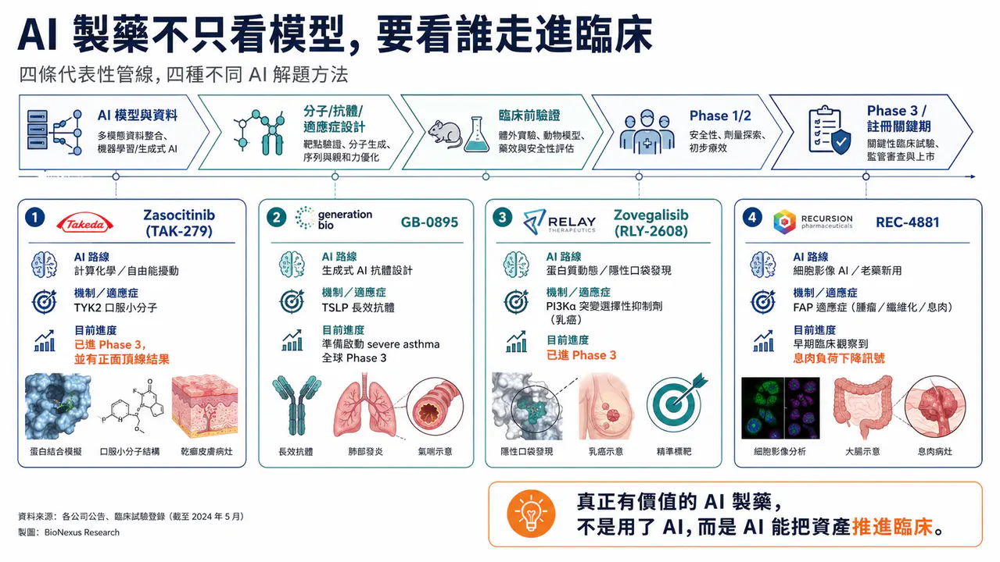

# Where Does AI Drug Discovery Stand Now? A Pipeline-Based Reality Check

## Reading AI Drug Discovery Through Pipelines: Models Are Hot, But the Real Question Is Who Enters the Clinic

AI drug discovery has been one of the hottest themes in biotech over the past few years.

Large models, generative protein design, multibillion-dollar collaborations, Big Pharma deals, platform financings: every few months, another AI drug discovery story seems to take over the industry conversation. But for investors and industry observers, the most important question is not whether AI drug discovery sounds impressive. The real questions are:

Can AI-discovered targets, AI-designed molecules, or AI-repositioned drugs actually enter the clinic?

Can they pass Phase 2?

Can they reach Phase 3?

Can Big Pharma pay real money for them?

Can they ultimately become medicines?

These questions cannot be answered by concept narratives or financing amounts. They have to be answered by pipelines.

AI drug discovery is no longer only a philosophical debate about whether the technology will work. It has entered a more practical stage: whose AI capability can truly become clinical assets, and whose data can be trusted by physicians, pharma companies, regulators, and capital markets. From that angle, several representative pipelines deserve a closer look. Their underlying AI approaches are very different: physics-driven small-molecule design, generative AI antibody design, protein dynamics and hidden-pocket discovery, and high-throughput cellular imaging for drug repurposing.

Together, these cases help clarify one important point: AI drug discovery is not one technology. It is a set of different problem-solving methods. What determines value is not the fact that AI was used, but which traditional R&D bottleneck the AI actually solved.

## 01 | Zasocitinib: Using Computational Chemistry to Bring TYK2 Into Phase 3

The first case that is closest to the market is Zasocitinib, also known as TAK-279.

This is an oral TYK2 inhibitor that Takeda acquired from Nimbus Therapeutics. Takeda paid $4 billion upfront for the asset, making the deal one of the more striking single-asset early-stage Big Pharma business development transactions in recent years.

Zasocitinib targets TYK2, which belongs to the JAK family. The JAK family includes TYK2, JAK1, JAK2, and JAK3. The challenge is that the catalytic regions of these kinases are structurally very similar, making it difficult to design a highly selective JAK-family inhibitor.

Insufficient selectivity can quickly become a safety issue. Excessive inhibition of JAK1, JAK2, or JAK3 can be associated with infection risk, blood-cell changes, lipid changes, thrombosis, and other systemic immune-related adverse effects. The core value of a TYK2 inhibitor is therefore not simply whether it can inhibit TYK2, but whether it can avoid the other JAKs.

The key focus of the Nimbus and Schrödinger collaboration was molecular design powered by large-scale free energy perturbation calculations. Free energy perturbation can be understood as a highly refined physics-based simulation method that predicts which molecular structures bind more stably, bind more strongly, and are less likely to create off-target effects when interacting with proteins.

Traditional medicinal chemistry often works by making a batch of molecules, testing a batch of data, and then adjusting the next batch based on experience. In the development of Zasocitinib, the team used computational models to evaluate candidate molecules at scale. The models predicted activity against TYK2, estimated off-target risks against related proteins such as JAK2 and JAK3, and incorporated drug-like properties such as solubility early in the design process.

This is one of the more pragmatic forms of AI drug discovery.

It does not claim that AI invented a new target out of thin air. Instead, it compresses the most time-consuming parts of traditional medicinal chemistry: design, prediction, and screening. Zasocitinib ultimately entered pivotal Phase 3 studies in moderate-to-severe plaque psoriasis and reported positive topline results. Takeda has announced that two pivotal Phase 3 trials met their primary endpoints and multiple secondary endpoints. That is where AI drug discovery becomes most persuasive: not because it uses sophisticated terminology, but because it helped push a highly selective oral small molecule into the registration-stage clinic. The meaning of Zasocitinib is that AI and physics-based simulation are not limited to early screening. They can participate in drug development that Big Pharma is willing to buy, clinically advance, and potentially take toward approval.

## 02 | GB-0895: Generative AI Antibodies Begin to Challenge Long-Acting Biologics

The second representative case is GB-0895 from Generate:Biomedicines.

GB-0895 is a long-acting antibody targeting TSLP for severe asthma.

TSLP is an important inflammatory signal released by epithelial cells and sits upstream in the asthma inflammatory cascade. Blocking TSLP may reduce downstream immune responses across different asthma inflammatory phenotypes.

There is already a successful TSLP antibody on the market: Tezspire, or tezepelumab, from AstraZeneca and Amgen. GB-0895 is therefore not taking a blind risk on an unknown target. It is attempting to use generative AI to produce better antibody properties against a clinically validated target.

Generate:Biomedicines' platform logic differs from traditional antibody development. Conventional antibody discovery often relies on animal immunization, phage display, and antibody library screening to find usable antibodies from large pools of candidate sequences. Generate's approach is closer to reverse design. It begins by defining the clinical problem, then uses generative models to design protein sequences, and moves into a build-measure-learn loop.

In practice, this means:

Generate candidate sequences.

Synthesize and express proteins.

Measure affinity, stability, specificity, and function.

Feed the experimental results back into the model.

The design objective for GB-0895 is clear: high affinity, long half-life, high specificity, and a dosing interval that could potentially be once every six months.

That has significant commercial meaning in severe asthma. Many current biologics still require dosing every two, four, or eight weeks. If GB-0895 can ultimately support twice-yearly dosing, it could improve patient adherence, simplify care workflows, and create meaningful market differentiation.

This case illustrates the most realistic value of generative AI in biologics development. It is not necessarily about discovering a completely new target. It is about designing an antibody that better matches clinical needs.

An antibody must bind the target, but it also must be manufacturable. It needs sufficient half-life while lowering immunogenicity risk. It must maintain effective concentrations in the human body. These are all protein engineering problems. If AI can incorporate these factors during antibody sequence design, the efficiency of biologics development could be redefined. GB-0895 is preparing to enter global Phase 3 development in severe asthma. That means generative AI-designed antibodies are no longer just an early concept; they are moving toward late-stage clinical validation.

## 03 | Zovegalisib: AI Can Find Molecules, But It Can Also See Hidden Pockets in Protein Dynamics

The third case is Zovegalisib, also known as RLY-2608, from Relay Therapeutics.

Zovegalisib is a PI3Kα mutant-selective inhibitor for diseases such as PI3Kα-mutant-driven breast cancer. PI3Kα is a very important oncology target. But traditional PI3K inhibitors have faced a long-standing problem: while inhibiting mutant PI3Kα, they can also inhibit normal wild-type PI3Kα, leading to adverse effects such as hyperglycemia, rash, and diarrhea. This has limited the dose and clinical utility of earlier PI3K drugs.

Relay's philosophy is different.

It views proteins not as static sculptures, but as machines in constant motion. Traditional crystal structures or cryo-EM structures capture a shape at a particular moment in time. But once a drug enters the human body, the protein is moving continuously. Certain binding pockets may appear only briefly during protein motion.

That is the design foundation of Zovegalisib.

Relay uses cryo-electron microscopy, molecular dynamics simulations, and computational models to study the dynamic differences between wild-type and mutant PI3Kα proteins, and to identify allosteric pockets that are more specific to the mutant protein. An allosteric pocket can be understood as a site outside the traditional ATP-binding pocket that can still regulate protein function. If a drug binds the ATP pocket, it can easily affect normal proteins because many kinases have similar ATP pockets. But if a drug binds an allosteric pocket that is exposed during the movement of the mutant protein, it may improve mutant selectivity.

That is where Zovegalisib's value lies.

Instead of competing with other PI3K inhibitors at the ATP site, it attempts to precisely target mutant PI3Kα while reducing effects on normal PI3Kα. Zovegalisib has entered the Phase 3 ReDiscover-2 trial, evaluating the drug in combination with fulvestrant versus capivasertib plus fulvestrant in patients with PI3Kα-mutant, HR-positive/HER2-negative advanced breast cancer.

This case represents a more advanced form of AI drug discovery: not merely calculating whether a molecule can bind, but incorporating protein dynamics into drug design. If this approach succeeds, many targets previously considered difficult to inhibit selectively may be reopened.

## 04 | REC-4881: AI Does Not Always Need to Invent a New Drug; It Can Also Find a New Use for an Old One

The fourth case is REC-4881 from Recursion.

REC-4881 is an allosteric MEK1/2 inhibitor being developed for familial adenomatous polyposis, or FAP. FAP is an inherited disease in which APC gene mutations cause patients to develop large numbers of intestinal polyps and carry a high risk of future colorectal cancer. Traditional management often includes close endoscopic surveillance, surgery, and related supportive care.

Recursion's AI platform logic is again different from the companies discussed above.

Its core is not simply generating molecules, nor is it only physics-based simulation. It is the construction of a large-scale cellular morphology map. In simple terms, Recursion uses high-throughput microscopy to observe large numbers of cells and extracts thousands of morphological features from each image, including nuclear size, cell shape, organelle distribution, and mitochondrial status. It then builds imaging fingerprints for diseased and normal cells. If a drug can shift the imaging features of diseased cells back toward a more normal state, it may indicate that the drug is affecting disease-relevant biology. In FAP, Recursion built APC-loss-related models and used its platform to identify the potential biological impact of MEK inhibition in this disease.

The key point is that the innovation of REC-4881 does not lie in the molecule itself being newly invented. It lies in AI identifying a new use for the molecule in FAP. That is the value of drug repurposing and disease matching.

Phase 1b/2 data disclosed by Recursion showed that REC-4881 was associated with reductions in polyp burden in some FAP patients, with some durability even after treatment stopped. These data are still early and based on a small sample, so they require validation in larger clinical studies. But they are already enough to show that AI platforms do not need to focus only on novel molecules. They can also improve the efficiency of indication discovery. Many known molecules may have been abandoned in the past because of poor indication selection, suboptimal clinical design, or unclear commercial paths. If AI can help these molecules find more suitable disease contexts, it may create new value at lower development risk.

REC-4881 represents another AI drug discovery route: not inventing from zero, but matching drugs and diseases more intelligently.

## 05 | What These Pipelines Show: AI Drug Discovery Is Not One Model, But Four Different Capabilities

Looking at Zasocitinib, GB-0895, Zovegalisib, and REC-4881 together, it becomes clear that AI drug discovery is not a single concept. It includes at least four distinct capabilities.

First: computational chemistry and molecular optimization.

Zasocitinib is the representative case. It addresses the balance among potency, selectivity, solubility, and drug-like properties in small-molecule design.

Second: generative protein design.

GB-0895 is the representative case. It addresses antibody sequence design, epitope selection, half-life, and functional engineering.

Third: protein dynamics and hidden-pocket discovery.

Zovegalisib is the representative case. It addresses mutant selectivity problems that traditional structural biology may not see.

Fourth: cellular imaging, disease models, and drug repurposing.

REC-4881 is the representative case. It addresses the matching between disease phenotypes and drug effects.

These four capabilities are completely different. That is why, when evaluating an AI drug discovery company, the right question is not simply, "Does it use AI?"

The better questions are: Where exactly is AI being used? Is it discovering targets? Designing molecules? Optimizing antibodies? Finding indications? Improving the probability of clinical success? Or is it mainly making the presentation look more advanced?

Valuable AI drug discovery must convert model output into experimental data, and then move that data into the clinic. Without clinical progress, AI remains a tool. With clinical progress, AI begins to become an industrial capability.

## 06 | The Real Question for AI Drug Discovery: Not Whether a Model Can Generate Molecules, But Whether Those Molecules Can Survive the Human Test

AI can generate candidate molecules faster. It can screen targets faster. It can design antibodies faster. It can also identify hidden pockets faster.

But drug development ultimately returns to the human body. That is the hardest reality of AI drug discovery.

Zasocitinib is convincing not because it used free energy perturbation calculations, but because it entered Phase 3 and met key endpoints. GB-0895 is worth watching not because it used generative AI to design an antibody, but because it is preparing for global Phase 3 development. Zovegalisib's value does not come from finding an allosteric pocket alone; it has entered Phase 3 breast cancer development and received breakthrough therapy designation. REC-4881's highlight is not that cellular imaging maps are impressive, but that polyp burden reductions were observed in FAP patients. Therefore, the evaluation criteria for AI drug discovery are actually simple:

Can the model generate molecules that can be synthesized, tested, and scaled?

Can those molecules preserve their expected effects in animals and humans?

Can clinical data support efficacy and safety?

This path is not fundamentally different from traditional pharma. The difference is that AI may make the front end faster, smarter, and more likely to succeed. But the final exam is still clinical data.

## 07 | Why Big Pharma Is Willing to Pay: AI May Improve R&D Capital Efficiency

Big Pharma is not investing in AI drug discovery because it has been hypnotized by technology stories.

What large pharmaceutical companies really want is R&D efficiency. Global pharma companies are facing several pressures: patent cliffs, declining internal R&D productivity, high costs of clinical failure, intense competition for early-stage pipelines, and increasingly expensive business development assets. If AI can eliminate wrong paths earlier, push better molecules forward faster, and improve preclinical decision-making, that is highly valuable to Big Pharma.

When Takeda acquired Zasocitinib, it did not buy an "AI label." It bought a TYK2 asset with clear drug properties and clinical potential. If Generate's GB-0895 can deliver twice-yearly dosing, that would create clear differentiation in the asthma biologics market. If Relay's Zovegalisib can validate mutant-selective PI3Kα inhibition, it could reshape the development logic for this target class. If Recursion's REC-4881 succeeds in FAP, it would show that an AI platform can rediscover the clinical value of older molecules.

That is why Big Pharma evaluates AI drug discovery not by asking who has the largest model, but by asking who can turn AI into assets that are tradable, clinically viable, and ultimately marketable.

## Conclusion | AI Drug Discovery Is No Longer Just a Trend; It Is Entering the Exam Period

AI drug discovery has moved past the stage of vision-only storytelling. It is now time to submit results.

Zasocitinib has entered Phase 3 and reported positive results.

GB-0895 is moving toward global Phase 3 development in severe asthma.

Zovegalisib has entered Phase 3 in breast cancer.

REC-4881 has shown early clinical signals of reduced polyp burden in FAP.

AI can change the speed and path of new drug development, but it cannot cancel the final exam of the pharmaceutical industry. The real answer will always be written in clinical data.

--------

References:

[0]: Company websites and public disclosures

[1]:

YouTube

Takeda today announced positive topline results for the two pivotal Phase 3 randomized, multicenter, double-blind, placebo- and active comparator-controlled studies of zasocitinib (TAK-279), a next-generation, highly selective oral tyrosine kinase 2 (TYK2

www.takeda.com

---

This article is intended for industry research and knowledge sharing only. It does not constitute investment, medical, fundraising, or individual stock advice.
