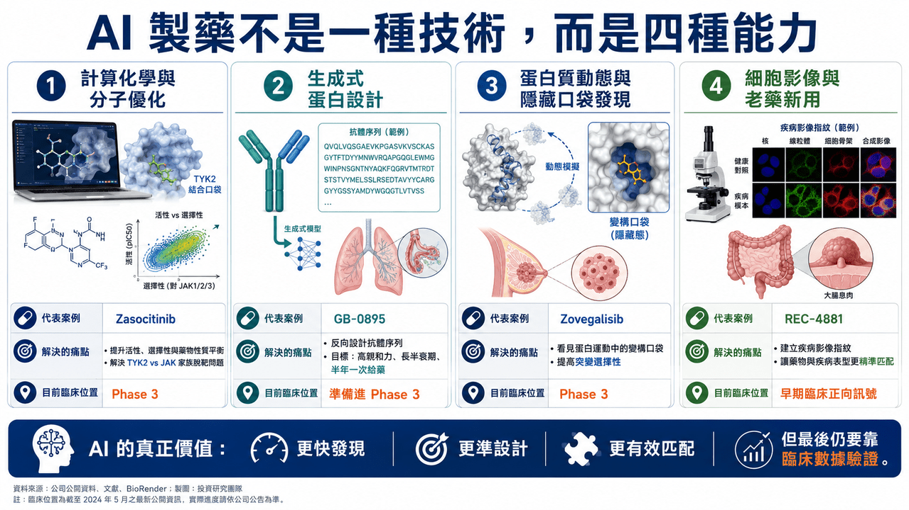
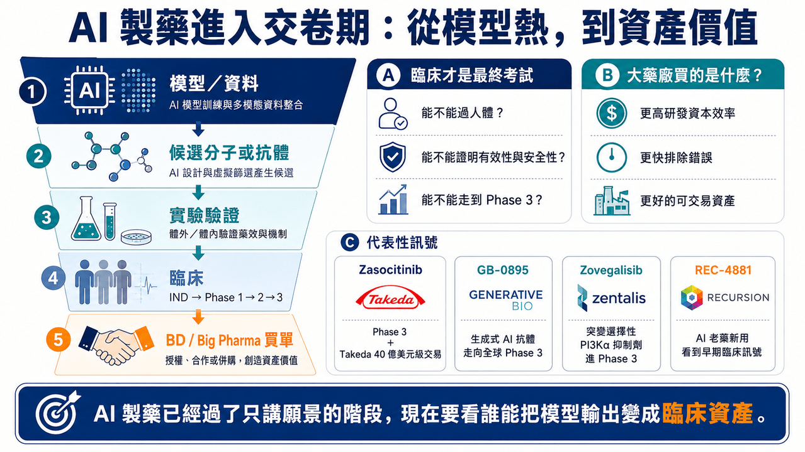

# 盤點整理，AI藥物開發走得如何了？

## 見微知著 AI 製藥管線：模型很熱，但真正要看的是誰走進臨床
AI 製藥這幾年太熱了。

大模型、生成式蛋白設計、數十億美元合作、Big Pharma 交易、平台融資，幾乎每隔一段時間就會刷屏一次。但對投資人和產業界來說，真正重要的問題不是「AI 製藥聽起來厲不厲害」。而是：

📌 AI 找到的靶點、設計的分子、重新定位的藥物，到底能不能走進臨床？

📌 能不能通過 Phase 2？

📌 能不能進 Phase 3？

📌 能不能被 Big Pharma 用真金白銀買走？

📌 能不能最後變成藥？

這些問題不能靠概念回答，也不能靠融資金額回答。要看管線。

今天 AI 製藥已經不再只是「會不會成」的哲學辯論，而是進入更務實的階段：誰的 AI 能力真的轉化成臨床資產，誰的資料能被醫師、藥廠、監管與資本市場相信。從這個角度看，幾條代表性管線非常值得拆解。它們背後的 AI 路線完全不同：有的是物理模擬驅動的小分子設計，有的是生成式 AI 抗體設計，有的是蛋白動態與隱性口袋發現，有的是高通量細胞影像與老藥新用。

這些案例可以幫我們看清楚一件事：AI 製藥不是一種技術，而是一組不同解題方法。真正決定價值的，不是用了 AI，而是 AI 解決了哪個傳統研發痛點。
## 01｜Zasocitinib：用計算化學，把 TYK2 做到 Phase 3

📌 第一個最接近上市門口的案例，是 Zasocitinib（TAK-279）。

這是 Takeda 從 Nimbus Therapeutics 收購而來的口服 TYK2 抑制劑。當年 Takeda 以 40 億美元 upfront 取得這項資產，這筆交易在近年 Big Pharma 的單一早期資產 BD 裡非常醒目。

Zasocitinib 的靶點是 TYK2。TYK2 屬於 JAK 家族。JAK 家族包括 TYK2、JAK1、JAK2、JAK3。問題在於，這幾個激酶的催化區域結構高度相似，因此要做出高度選擇性的 JAK 家族抑制劑非常困難。

選擇性不夠，就容易碰到安全性問題。JAK1、JAK2、JAK3 若被過度抑制，可能牽涉感染風險、血球變化、血脂、血栓與其他全身性免疫副作用。因此 TYK2 抑制劑的價值，核心不只是「能不能抑制 TYK2」，而是能不能避開其他 JAK。

Nimbus 和 Schrödinger 的合作重點，就是用大規模自由能擾動計算，來做分子設計。自由能擾動可以簡單理解成一種高度精細的物理模擬方法，用來預測不同分子結構和蛋白質結合時，哪個更穩、哪個更強、哪個更容易脫靶。

傳統藥物化學常常是做一批分子、測一批數據、再根據經驗調整下一批分子。而在 Zasocitinib 的開發中，團隊先用計算模型大規模評估候選分子，預測它們對 TYK2 的活性，也預測對 JAK2、JAK3 等相關蛋白的脫靶風險，同時在早期就把溶解度等藥物性質納入設計。

這是 AI 製藥中比較務實的一類。

它不是說 AI 憑空想出一個新靶點，而是把傳統藥物化學裡最耗時間的設計、預測、篩選過程大幅壓縮。最後，Zasocitinib 進入中重度斑塊乾癬的關鍵 Phase 3 研究，並公布正面頂線結果。Takeda 已宣布兩項 pivotal Phase 3 試驗達到主要終點與多項次要終點，這就是 AI 製藥最有說服力的地方。不是因為它講了很多技術名詞，而是它真的把一個高選擇性口服小分子，推到了註冊臨床階段。Zasocitinib 的意義在於，它證明 AI 與物理模擬不是只能做早期篩選，也可以參與真正能被大藥廠買走、進入後期臨床的藥物開發。
## 02｜GB-0895：生成式 AI 抗體，開始挑戰長效化生物製劑

📌 第二個代表案例，是 Generate:Biomedicines 的 GB-0895。

這是一款靶向 TSLP 的長效抗體，用於 severe asthma，也就是重度氣喘。

TSLP 是上皮細胞釋放的重要發炎訊號，位於氣喘發炎反應的上游。阻斷 TSLP，就有機會在不同發炎表型的氣喘患者中降低下游免疫反應。

目前市場上已經有 TSLP 抗體成功案例，例如 AstraZeneca 與 Amgen 的 Tezspire（tezepelumab）。所以 GB-0895 不是在一個完全未知靶點上冒險，而是在一個已被驗證的靶點上，試圖用生成式 AI 做出更好的抗體屬性。

Generate:Biomedicines 的平台邏輯，和傳統抗體開發不同。傳統抗體開發常靠免疫動物、噬菌體展示、抗體庫篩選，從大量候選序列裡找到可用抗體。Generate 的思路則更像是「反向設計」。先定義臨床問題，再利用生成式模型設計蛋白序列，接著進入構建、測量、學習的閉環。

也就是：

📌 生成候選序列。

📌 合成與表達蛋白。

📌 測量親和力、穩定性、特異性與功能。

📌 再把實驗結果回饋給模型。

GB-0895 的設計目標很清楚：高親和力、長半衰期、高特異性，並希望做到每六個月一次給藥。

這對重度氣喘非常有商業意義。因為現在許多生物製劑仍需要每 2 週、4 週或 8 週給藥。若 GB-0895 最後能做到半年一次，對患者依從性、醫療流程與市場差異化都有幫助。

這個案例說明生成式 AI 在生物製劑開發中最現實的價值，不一定是找一個全新靶點，而是設計出更符合臨床需求的抗體。

抗體要能打到靶點，也要能穩定生產；要有足夠半衰期，也要降低免疫原性風險；要能在人體中維持有效濃度。這些都是蛋白工程問題。AI 如果能在抗體序列設計階段就把這些因素納入，生物藥開發效率就可能被重新定義。GB-0895 已準備啟動 severe asthma 的全球 Phase 3。這代表生成式 AI 設計抗體，不再只是早期概念，而是正在走向後期臨床驗證。
## 03｜Zovegalisib：AI 不只找分子，也能看見蛋白質動態裡的隱藏口袋
📌 第三個案例，是 Relay Therapeutics 的 Zovegalisib（RLY-2608）。

這是一款 PI3Kα 突變選擇性抑制劑，用於 PI3Kα 突變驅動的乳癌等疾病。PI3Kα 是非常重要的腫瘤靶點。但傳統 PI3K 抑制劑有一個長期難題：抑制突變型 PI3Kα 的同時，也容易抑制正常野生型 PI3Kα，進而導致高血糖、皮疹、腹瀉等副作用。這限制了過去 PI3K 藥物的劑量與臨床使用。

Relay 的哲學不太一樣。

它認為蛋白質不是靜態雕像，而是不斷運動的機器。傳統結晶結構或冷凍電鏡看到的是某個時間點的形狀，但藥物真正進入人體後，蛋白質其實一直在動。某些藥物結合口袋，可能只在蛋白質運動過程中短暫出現。

📌 這就是 Zovegalisib 的設計基礎。

Relay 利用冷凍電子顯微鏡、分子動態模擬與計算模型，研究 PI3Kα 野生型與突變型蛋白的動態差異，並找出突變蛋白較特有的變構口袋。所謂變構口袋，可以理解成不是傳統 ATP 結合位點，而是蛋白質另一個可以調控功能的位置。如果藥物打的是 ATP 口袋，很容易影響正常蛋白，因為很多激酶都有類似 ATP 口袋。但如果藥物打的是突變蛋白運動中才暴露的變構口袋，就有機會提高突變選擇性。

Zovegalisib 的價值就在這裡。

它不是和所有 PI3K 抑制劑一樣去搶 ATP 位點，而是試圖精準打擊突變 PI3Kα，降低對正常 PI3Kα 的影響。目前 Zovegalisib 已進入 Phase 3 ReDiscover-2 試驗，評估其與 fulvestrant 聯用，對比 capivasertib 加 fulvestrant，用於 PI3Kα 突變、HR+/HER2- 晚期乳癌患者。

這個案例代表 AI 製藥的一種高階形態：不是只算分子能不能結合，而是把蛋白質動態納入藥物設計。如果這條路成功，未來很多過去被認為「難以選擇性抑制」的靶點，可能會被重新打開。
## 04｜REC-4881：AI 不一定要發明新藥，也可以幫老藥找到新用途
📌 第四個案例，是 Recursion 的 REC-4881。

REC-4881 是 MEK1/2 變構抑制劑，用於 familial adenomatous polyposis（家族性腺瘤性息肉病，FAP）。FAP 是一種遺傳性疾病，患者因 APC 基因突變，腸道容易長出大量息肉，未來發展成大腸癌的風險很高。傳統管理方式往往包括密切內視鏡追蹤、手術與相關支持治療。

📌 Recursion 的 AI 平台邏輯和前面幾家公司又不一樣。

它的核心不是單純生成分子，也不是只做物理模擬，而是建立大規模細胞形態圖譜。簡單說，Recursion 用高通量顯微影像觀察大量細胞，從每個細胞影像中提取成千上萬種形態特徵，例如細胞核大小、細胞形狀、胞器分布、粒線體狀態等，建立疾病細胞與正常細胞的影像指紋。如果某個藥物能讓疾病細胞的影像特徵往正常方向回復，就可能代表它改變了疾病相關生物路徑。在 FAP 裡，Recursion 建立 APC 缺失相關模型，並利用平台找出 MEK 抑制對這種疾病生物學的潛在影響。

重要的是，REC-4881 的創新不在於分子本身是全新發明，而是 AI 找到了它在 FAP 這個適應症中的新用途，這就是老藥新用與疾病匹配的價值。

Recursion 公布的 Phase 1b/2 資料顯示，REC-4881 在部分 FAP 患者中觀察到息肉負荷下降，且治療停止後仍有一定持續效果。這些資料仍屬早期、小樣本，需要更大臨床研究驗證，但已經足以說明 AI 平台不一定只能做全新分子，也可以提高「適應症發現」效率。大量已知分子過去可能因適應症選錯、臨床設計不理想或商業路徑不清楚而被放棄。AI 如果能幫這些分子找到更合適的疾病場景，就可能用較低風險創造新價值。

REC-4881 代表的是另一種 AI 製藥路線：不追求從零發明，而是更聰明地匹配疾病與藥物。
## 05｜這幾條管線共同說明：AI 製藥不是一種模式，而是四種不同能力
把 Zasocitinib、GB-0895、Zovegalisib、REC-4881 放在一起看，可以發現 AI 製藥其實不是一個單一概念。它至少有四種不同能力。

📌 第一，是計算化學與分子優化。

代表是 Zasocitinib。它解決的是小分子設計中效力、選擇性、溶解度與藥物性質的平衡。

📌 第二，是生成式蛋白設計。

代表是 GB-0895。它解決的是抗體序列、表位選擇、半衰期與功能工程問題。

📌 第三，是蛋白質動態與隱藏口袋發現。

代表是 Zovegalisib。它解決的是傳統結構生物學看不到的突變選擇性問題。

📌 第四，是細胞影像、疾病模型與老藥新用。

代表是 REC-4881。它解決的是疾病表型與藥物作用之間的匹配問題。

這四種能力完全不同，所以判斷 AI 製藥公司時，不能只問「有沒有 AI」。

應該問：AI 到底用在哪裡？是找靶點？是設計分子？是優化抗體？是發現適應症？是提高臨床成功率？還是只是讓簡報看起來更先進？

真正有價值的 AI 製藥，必須能把模型輸出變成實驗資料，再把實驗資料推進到臨床，沒有臨床，AI 只是工具，有臨床，AI 才開始變成產業能力。
## 06｜AI 製藥的真正問題：不是模型能不能產生分子，而是分子能不能過人體
AI 可以更快產生候選分子，可以更快篩靶點，可以更快設計抗體，也可以更快找到隱藏口袋。

但藥物開發最後一定要回到人體。這是 AI 製藥最硬的現實。

Zasocitinib 之所以有說服力，不是因為用了自由能擾動計算，而是它進入 Phase 3 並達到關鍵終點。GB-0895 之所以值得看，不是因為用生成式 AI 設計抗體，而是它準備啟動全球 Phase 3。Zovegalisib 的價值，不是因為它找到變構口袋，而是它已經進入 Phase 3 乳癌試驗，且取得突破性治療認定。REC-4881 的亮點，不是細胞影像圖譜很酷，而是它在 FAP 患者中觀察到息肉負荷下降。所以，AI 製藥的評價標準其實很簡單：

📌 模型能不能產生可合成、可測試、可放大的分子？

📌 分子能不能在動物與人體中保有預期作用？

📌 臨床資料能不能支持有效性與安全性？

這條路和傳統製藥沒有本質不同，差別只是 AI 有可能讓前半段更快、更聰明、更高成功率，但最後的考試，仍然是臨床。
## 07｜Big Pharma 為什麼願意買單？因為 AI 有機會提高研發資本效率
大藥廠投資 AI 製藥，不是因為它們被科技故事洗腦。

它們真正想要的是研發效率，全球大型藥廠面對幾個壓力：專利懸崖、內部研發效率下降、臨床失敗成本高、早期管線競爭激烈、BD 資產越來越貴。如果 AI 能把錯誤更早排除，把更好的分子更快推進，把臨床前決策做得更準，那對大藥廠就是巨大價值。

Takeda 買 Zasocitinib，買的不是「AI 標籤」，而是買一個已經具備清楚藥物屬性與臨床潛力的 TYK2 資產。Generate 的 GB-0895 若能做到半年一次給藥，對氣喘生物製劑市場就是很明確的差異化。Relay 的 Zovegalisib 若能證明突變選擇性 PI3Kα 抑制成立，可能重塑這類靶點的開發邏輯。Recursion 的 REC-4881 若能在 FAP 成立，則證明 AI 平台可以重新找到老分子的臨床價值。

所以 Big Pharma 看 AI 製藥，不是看誰模型最大，而是看誰能把 AI 變成可交易、可臨床、可上市的資產。
## 結語｜AI 製藥不是風口，而是開始進入交卷期
AI 製藥已經過了只講願景的階段，現在要看交卷。

📌 Zasocitinib 已經進入 Phase 3 並拿到正面結果。

📌 GB-0895 正在往 severe asthma 全球 Phase 3 前進。

📌 Zovegalisib 已進入乳癌 Phase 3。

📌 REC-4881 在 FAP 早期臨床中看到息肉負荷下降訊號。

AI 可以改變新藥研發的速度與路徑，但它不能取消製藥業最終的考試，真正的答案，永遠寫在臨床數據裡。
--------
參考資料：

[0]: 各公司官網＆公開資料

[1]:

YouTube

Takeda today announced positive topline results for the two pivotal Phase 3 randomized, multicenter, double-blind, placebo- and active comparator-controlled studies of zasocitinib (TAK-279), a next-generation, highly selective oral tyrosine kinase 2 (TYK2

www.takeda.com

---

本文僅供產業研究與知識分享，不構成投資、醫療、募資或個股建議。
