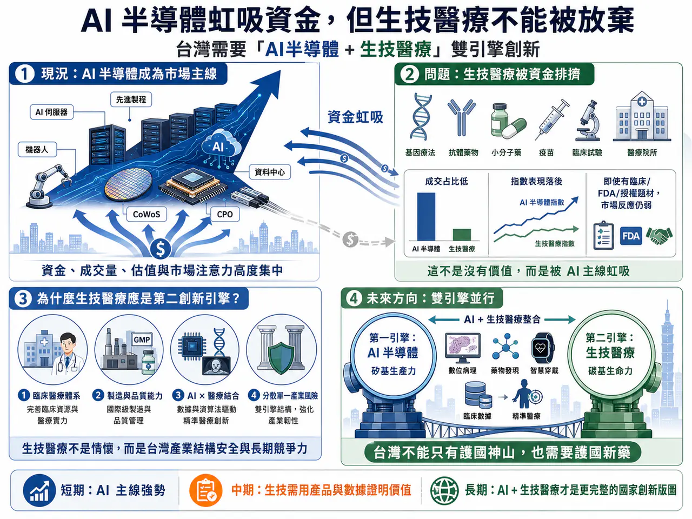
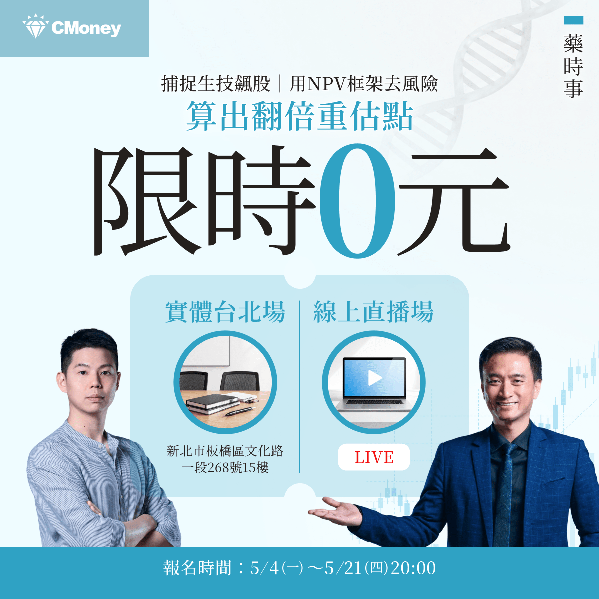

# AI半導體掩蓋生技光芒

【🏔️ 台灣資金被 AI 半導體虹吸，但生技醫療不能被放棄】

台灣資本市場最近出現一個非 常清楚的現象：AI 半導體正在虹吸一切。

台股的主旋律幾乎完全被 AI 伺服器、先進製程、CoWoS、CPO、散熱、PCB、電源、矽光子、機器人與資料中心吃掉。只要公司能被放進 NVIDIA、AWS、Google、Microsoft、Meta 的 AI capital expenditure 敘事裡，市場就願意給更高估值、更高成交量、更長的想像空間。相反地，生技醫療股明明有臨床進展、有 FDA 路徑、有國際授權、有商業化產品，卻經常被資金邊緣化。

台灣生技產業似乎突然失去投資價值，這是台灣股市正在經歷一場非常典型的 AI 半導體資金虹吸效應。

【就在今天！】

【限時免費－台北場】藥時事｜捕捉生技飆股：用NPV框架算出翻倍重估點

課程裡我們會講解生技醫藥股的估值邏輯，以及投資人如何抓住被低估的生技股票！

我們更是會以台灣生技之光 藥華藥（6446）作為我們的案例拆解他的估值與目標價

以下為報名連結歡迎大家踴躍報名：

【限時免費-線上直播】藥時事｜捕捉生技飆股：用NPV框架算出翻倍重估點｜CMoney 理財寶

藥時事 X CMoney 攜手打造，推出由藥時事主講的《【限時免費-線上直播】藥時事｜捕捉生技飆股：用NPV框架算出翻倍重估點》課程，藉由藥時事的投資經驗分享，幫每一個人做好人生投資。2026年05月21日(四) 20:30-21:30開課，現在報名只要0元 (原價6666元)！限時限額開放，立即報名！

www.cmoney.tw

## 01｜台灣不是沒有生技，只是資金現在只看 AI

台灣現在的經濟與股市，幾乎被 AI 半導體重新定義。

這當然有其合理性。台灣在全球 AI 供應鏈裡的位置太重要了。從 台積電 的先進製程，到 AI 伺服器、散熱、電源、PCB、連接器、組裝、測試與供應鏈管理，台灣幾乎是全球 AI 基礎建設最關鍵的硬體中樞之一。

國際市場也正在用這個角度定價台灣。Reuters 報導指出，台灣 2026 年經濟成長預測被大幅上修，主要就是受到全球 AI 需求與半導體、ICT 出口帶動。政府政策也同樣往 AI 傾斜。台灣已提出「十大 AI 基礎建設」方向，目標是把半導體、矽光子、量子科技、AI 機器人、主權 AI 與算力基礎設施整合成下一階段國家產業戰略，這些都是台灣的優勢。

問題是：台灣不能只有 AI 半導體一個創新引擎。

一個國家如果只靠單一產業主線支撐資本市場長期會有風險。半導體當然重要，但半導體不是醫療需求的替代品。AI 可以改變生產力，但 AI 不會讓人類不再罹癌、不再老化、不再有慢性病、不再需要新藥。台灣需要 AI 半導體作為第一引擎，也需要生技醫療作為第二創新引擎，這不僅僅是人類生命的共同情懷，更是產業結構安全。

## 02｜台灣生技醫療類股，正在被資金排擠

如果只看指數表現，台灣生技醫療確實非常委屈。

臺灣指數公司的「臺灣上市上櫃生技醫療指數」，本來就是用來反映台灣上市、上櫃生技醫療產業股票的投資表現，成分股來自臺灣全市場指數中屬於生技醫療業、且具市值代表性的股票，以自由流通市值加權。

也就是說，這個指數不是小眾題材，而是台灣生技醫療產業在資本市場上的代表性溫度計，但近期資金流向非常明顯地偏向 AI。

根據鉅亨網 2026 年 5 月 13 日盤中資料，當天生技醫療類股雖然一度上漲 2.08%，但總成交額只有 5.49 億元，占大盤比重僅 0.66%。同時，生技醫療類股近一個月下跌 1.23%，但集中市場加權指數上漲 18.3%；近三個月生技醫療類股下跌 15.69%，而加權指數上漲 24.68%；近六個月生技醫療類股下跌 6.53%，加權指數則大漲 49.92%。

這組數字非常刺眼，它說明台灣不是沒有資金，台灣股市其實有大量資金，但資金集中在 AI 半導體主線，沒有流向生技醫療。

這就是虹吸。

不是生技醫療沒有價值，而是 AI 半導體把市場的注意力、成交量、估值彈性與風險偏好全部吸走，當一個市場的主線太強，其他產業就會被迫折價。

📉 即使生技公司有臨床進度，市場也不一定反應。

📉 即使有國際授權想像，股價也可能沒有耐心。

📉 即使公司逐漸商業化，資金仍可能覺得「不如買 AI」。

這就是台灣生技目前最大的困境。

## 03｜台灣生技為什麼應該成為第二創新引擎？

台灣如果只靠半導體，會很強，但也會很集中。

半導體是台灣的護國神山，這不需要否認。但一個成熟經濟體不能只有一座山。真正健康的產業結構，應該有多個創新引擎，生技醫療正是台灣最有條件發展的第二引擎。

🚀 第一，台灣有臨床醫療體系。台灣醫院密度高，醫師專業能力強，健保資料完整，臨床試驗執行能力有基礎。這些都是發展精準醫療、真實世界證據、醫療 AI、臨床試驗與新藥開發的重要底層資產。

🚀 第二，台灣有製造與品質管理能力。生技醫療不是只有研發，也需要 GMP、CMC、品質系統、製程放大、供應鏈與國際法規。這些能力其實和台灣既有製造文化有高度相容性。

🚀 第三，台灣有半導體與 ICT 優勢，可以和醫療結合。AI 醫療、數位病理、醫療影像、智慧醫材、穿戴裝置、遠距監測、手術機器人、個人化醫療，都需要硬體、感測器、晶片、資料處理與雲端平台。這正是台灣可以把第一引擎延伸到第二引擎的地方。

🚀 第四，台灣需要避開單一產業集中風險。AI 半導體很強，但也會有景氣循環、資本支出波動、地緣政治壓力、庫存調整與估值修正。生技醫療雖然慢，但它的需求長期存在，和半導體景氣循環不同，可以成為台灣資本市場更平衡的長線配置。

所以，發展生技醫療不是和半導體競爭資源，而是讓台灣的創新經濟從單核心，走向雙核心。

## 04｜台灣生技不能只喊政策支持，必須自己證明「產品兌現」

當然，台灣生技也不能只把股價低迷歸咎於 AI 虹吸。

市場冷落生技，有一部分也是生技公司自己要負責，過去台灣生技股太常依賴題材。

🔎 臨床設計講得不夠清楚。

🔎 國際 BD 路徑講得不夠完整。

🔎 產品商業化能力不足。

🔎 財務規劃不夠紮實。

🔎 投資人聽到「FDA」、「授權」、「國際市場」、「創新藥」就被教育過很多次，所以現在變得更謹慎。

這是合理的，如果台灣生技要重新獲得市場重估，不能只要求投資人「相信未來」。必須交出更具體的東西：

🔎 有沒有真正的臨床數據？

🔎 有沒有明確的病人分層？

🔎 有沒有 FDA 或 EMA 可接受的終點？

🔎 有沒有商業化產品？

🔎 有沒有海外收入？

🔎 有沒有國際授權？

🔎 有沒有製造與 CMC 能力？

🔎 有沒有用一個產品養出下一個產品的能力？

台灣生技產業要成為第二創新引擎，不是靠口號，而是靠產品、數據、藥證、收入與國際合作。

## 05｜🏥 台灣已經有一些公司開始具備國際化雛形

台灣生技不是完全沒有代表性公司。

🏥 藥華藥就是最清楚的案例。

BESREMi（ropeginterferon alfa-2b-njft）已經不只是研發故事，而是具備美國、歐洲與台灣商業化經驗的長期慢性病產品。藥華藥已經開始能透過 PV、ET、pen device、真實世界資料、國際市場滲透率與生命週期管理，把自己從新藥公司推進成國際 specialty pharma。

這些公司路徑不同，但共同提醒我們：台灣生技不是沒有機會，只是市場現在還沒有把這些機會當成主線。

隨著藥華藥不斷地兌現承諾，我們也相信母雞帶動小雞的力量將逐步體現，我們將看到一批台灣優秀的生技公司不段走向全球！

## 06｜AI 和生技不是對立，而是台灣最應該結合的兩條線

現在市場把 AI 和生技分成兩邊，好像買 AI 就不能買生技，重視半導體就等於放棄醫療，這個想法太狹窄，真正有戰略價值的方向，是 AI + 生技醫療。

🤖 AI 可以用在 drug discovery。

🤖 AI 可以用在 protein design。

🤖 AI 可以用在病理影像。

🤖 AI 可以用在臨床試驗收案。

🤖 AI 可以用在真實世界資料分析。

🤖 AI 可以用在醫療影像判讀。

🤖 AI 可以用在個人化治療建議。

🤖 AI 可以用在 CMC、品質控制、製程優化與法規文件。

也就是說，AI 不應該只是虹吸生技資金的對手，AI 應該變成台灣生技升級的工具。台灣最有機會的，不一定是複製美國大型 AI 製藥公司，也不一定是從零建立 DeepMind 等級的 foundation model。台灣更務實的路徑，是把 AI 半導體硬體優勢、醫院臨床資料、健保資料、醫材製造、新藥開發、CDMO 與智慧醫療整合起來，做出具有台灣特色的 AI-enabled healthcare ecosystem。

這才是台灣真正值得想像的第二創新引擎。

不是半導體歸半導體，生技歸生技，而是用半導體與 AI 的力量，推動生技醫療升級。

【結語｜🌱 台灣不能只有護國神山，也需要護國新藥】

今天的台股，AI 半導體當然是最強主線。

這沒有問題。

台灣因為半導體而在全球 AI 時代取得戰略位置，這是非常珍貴的國家優勢。但我們也必須承認，AI 半導體正在對台灣生技醫療造成明顯的資金虹吸。生技醫療類股成交占比低、指數表現落後，反映的不是單一公司問題，而是整個市場風險偏好被 AI 主線吸走。可是，台灣不能只靠一個創新引擎。半導體可以讓台灣站上全球科技供應鏈的核心。生技醫療則有機會讓台灣站上全球健康產業、精準醫療、慢性病治療、再生醫療、AI 醫療與高齡化解方的核心。

📌 一個是矽基生產力。

📌 一個是碳基生命力。

兩者不是對立，而是台灣未來最應該並行的雙引擎。短期資金會追逐最強敘事，但長期價值，仍然會回到誰能解決真正的問題。

📌 AI 解決算力與效率問題。

📌 生技醫療解決疾病與生命問題。

台灣已經有世界級半導體產業，下一個階段，我們也應該期待台灣出現更強的生技醫療產業。

一個創新國家，不能只有護國神山，也需要護國新藥。

-------------------------------------------------------

【藥時事 × 全曜財經｜生技類股理財課程上線】

【限時免費－台北場】藥時事｜捕捉生技飆股：用NPV框架算出翻倍重估點

課程裡我們會講解生技醫藥股的估值邏輯，以及投資人如何抓住被低估的生技股票！

我們更是會以台灣生技之光 藥華藥（6446）作為我們的案例拆解他的估值與目標價

以下為報名連結歡迎大家踴躍報名：

【限時免費-線上直播】藥時事｜捕捉生技飆股：用NPV框架算出翻倍重估點｜CMoney 理財寶

藥時事 X CMoney 攜手打造，推出由藥時事主講的《【限時免費-線上直播】藥時事｜捕捉生技飆股：用NPV框架算出翻倍重估點》課程，藉由藥時事的投資經驗分享，幫每一個人做好人生投資。2026年05月21日(四) 20:30-21:30開課，現在報名只要0元 (原價6666元)！限時限額開放，立即報名！

www.cmoney.tw

-----------

參考資料：

[0]: 各公司官網＆公開資料

[1]:

reuters.com

https://www.reuters.com/world/asia-pacific/taiwan-revises-2026-economic-growth-forecast-higher-2026-02-13/

www.reuters.com

[2]:

reuters.com

https://www.reuters.com/world/asia-pacific/taiwan-plans-ai-projects-boost-economy-by-510-billion-2025-07-23/

www.reuters.com

[3]:

TIP 臺灣指數公司

https://taiwanindex.com.tw/indexes/IX0103

taiwanindex.com.tw

[4]:

盤中速報 - 生技醫療類股表現強勁，漲幅2.08%，總成交額5.49億 | 鉅亨網 - 台股盤中

台股盤中生技醫療業類股表現強勁，漲跌幅、成交額、大盤佔比、領漲跌個股、指數績效、即時新聞資訊。

news.cnyes.com

本文僅供產業研究與知識分享，不構成投資、醫療、募資或個股建議。
