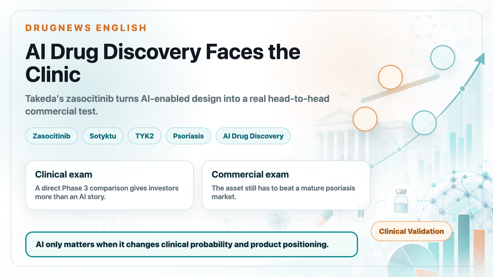
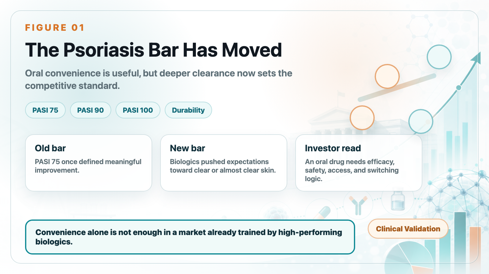
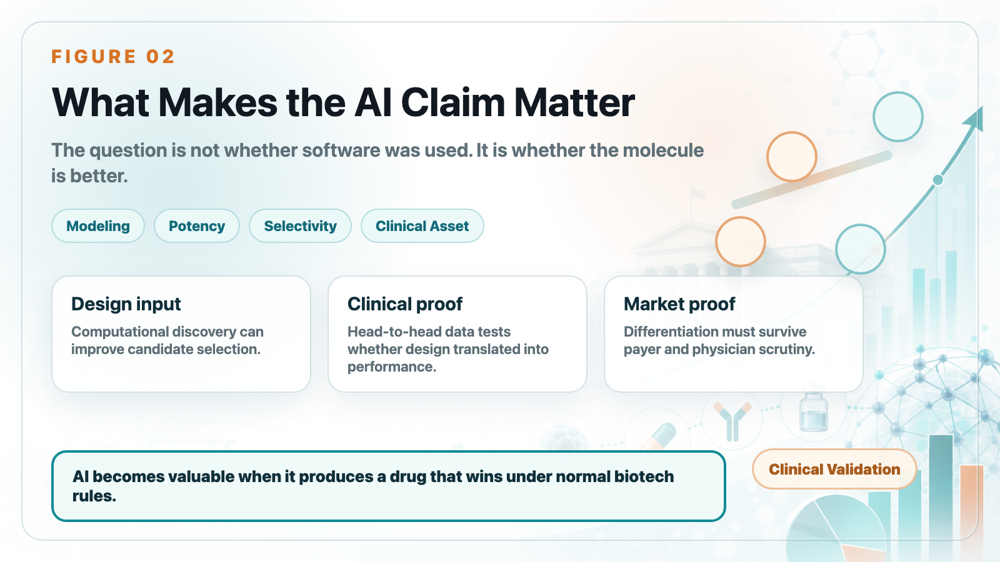
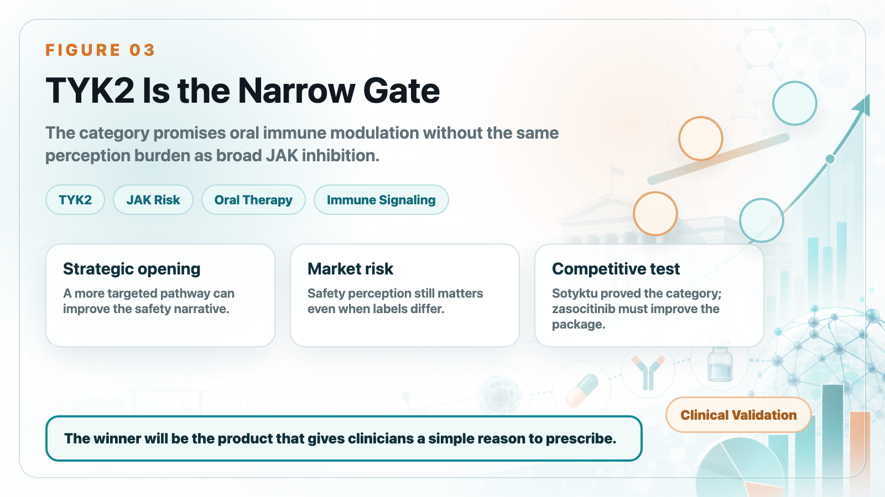
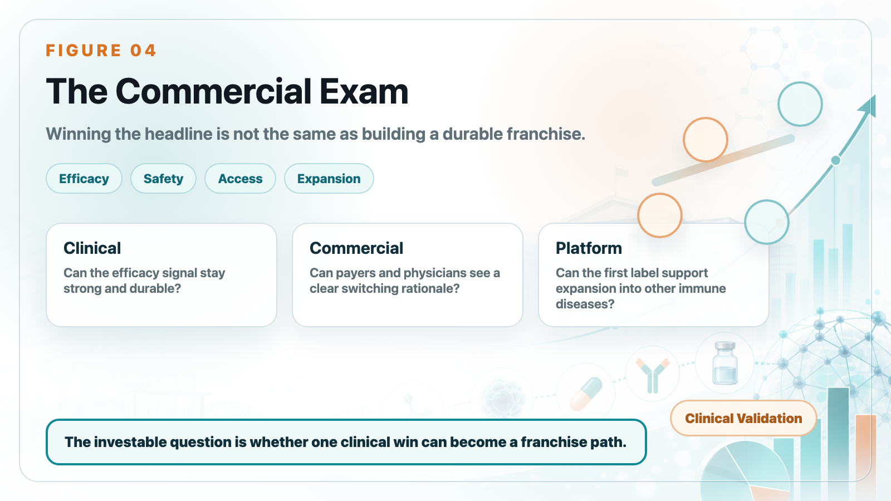

# Is the First AI-Designed Drug Finally Arriving? Takeda's Zasocitinib Beats Sotyktu Head-to-Head

For years, AI drug discovery has produced beautiful slides and ambitious claims. The market has been waiting for something more concrete: a molecule that survives real clinical competition.

Takeda's zasocitinib is now entering that exam. In a Phase 3 psoriasis study, the oral TYK2 inhibitor showed superiority over Sotyktu in a head-to-head comparison. That does not automatically make it a blockbuster, but it does make the asset one of the clearest tests of whether AI-assisted design can translate into clinical and commercial value.

## 1. In psoriasis, the bar has moved higher

The old benchmark in psoriasis was PASI 75. That meant a 75% improvement in disease severity. Today, leading biologics have pushed expectations toward PASI 90 and PASI 100.

For patients, "almost clear" and "clear" are very different experiences. For physicians and payers, deeper and durable clearance changes how a product is positioned. That is why oral convenience alone is no longer enough.

## 2. Why zasocitinib matters for AI drug discovery

Zasocitinib is tied to Schrödinger's computational drug-discovery platform. The important point is not that software was used. Modern drug development uses computation everywhere. The important point is whether the design process produced a molecule with differentiated potency, selectivity, and clinical performance.

If an AI-enabled asset can beat an established oral competitor in a direct trial, investors will have a stronger reason to treat AI drug discovery as a productivity tool rather than a marketing slogan.

## 3. TYK2 is the narrow gate after JAK risk

The TYK2 story is attractive because it promises more targeted immune modulation than broad JAK inhibition. In plain language, the market wants oral drugs that can reduce inflammatory signaling without carrying the same level of safety concern that hurt parts of the JAK category.

That is the strategic opening for Sotyktu, zasocitinib, and other next-generation oral immune assets.

## 4. Sotyktu teaches an important commercial lesson

Sotyktu proved that oral TYK2 inhibition could become a real psoriasis product. But it also showed that oral convenience does not automatically defeat biologics.

If an oral drug wants to take meaningful share, it needs a complete package: strong efficacy, clean safety perception, easy access, durable response, and a credible reason for physicians to switch or start patients earlier.

## 5. Biologics remain a high wall

Products such as Skyrizi, Tremfya, Cosentyx, and other biologics have changed the standard of care. Their efficacy is strong, physician familiarity is high, and payers understand the category.

That means zasocitinib is not competing against an empty market. It is competing against a mature biologic ecosystem.

## 6. The oral psoriasis race is becoming more serious

Zasocitinib is not alone. The next competitive phase may include multiple oral immune assets, each trying to balance efficacy, safety, convenience, and pricing.

The commercial winner will not be the product with the most exciting headline. It will be the product that gives physicians a simple clinical reason to prescribe and gives payers a clear economic reason to reimburse.

## 7. The market could extend beyond psoriasis

If the mechanism proves durable and safe, TYK2 assets may move into other immune-inflammatory indications. That is where platform value can appear. A single successful psoriasis trial can become the first proof point for a broader inflammatory-disease strategy.

This is why investors should track both the first label and the expansion path.

## 8. Taiwan angle

For Taiwan biotech investors, the lesson is not simply "AI is useful." The lesson is that AI only matters when it changes a product's clinical and commercial probability.

Companies claiming AI-enabled discovery still need to answer traditional biotech questions: What is the mechanism? What is the endpoint? What is the competitor? What is the payer logic? What is the expansion path?

## Bottom line

Zasocitinib is important because it brings AI drug discovery into a more serious arena: head-to-head clinical competition. The first win is meaningful. The larger question is whether Takeda can turn that clinical signal into a durable commercial franchise.

## References

1. Takeda. Phase 3 data release for zasocitinib in psoriasis.
2. Schrödinger. Zasocitinib / TAK-279 case materials.
3. Bristol Myers Squibb. Sotyktu prescribing information.
4. Reuters. Coverage of oral psoriasis drugs and the TYK2 competitive landscape.
5. Takeda. Pipeline and inflammatory disease strategy materials.

This article is intended for industry research and knowledge sharing only. It does not constitute investment, medical, fundraising, or individual stock advice.
