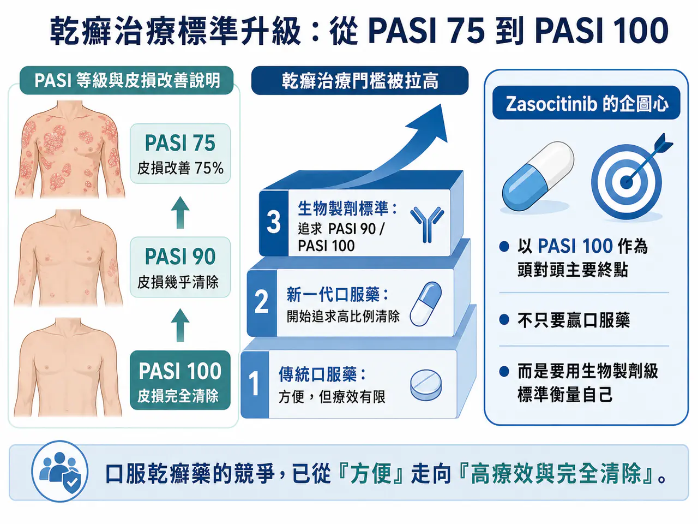
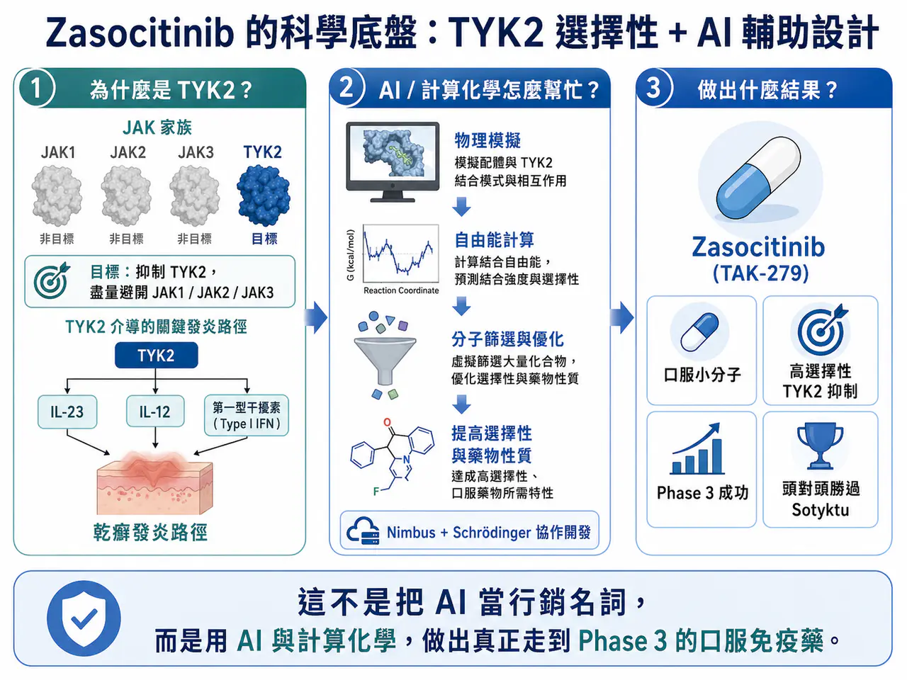
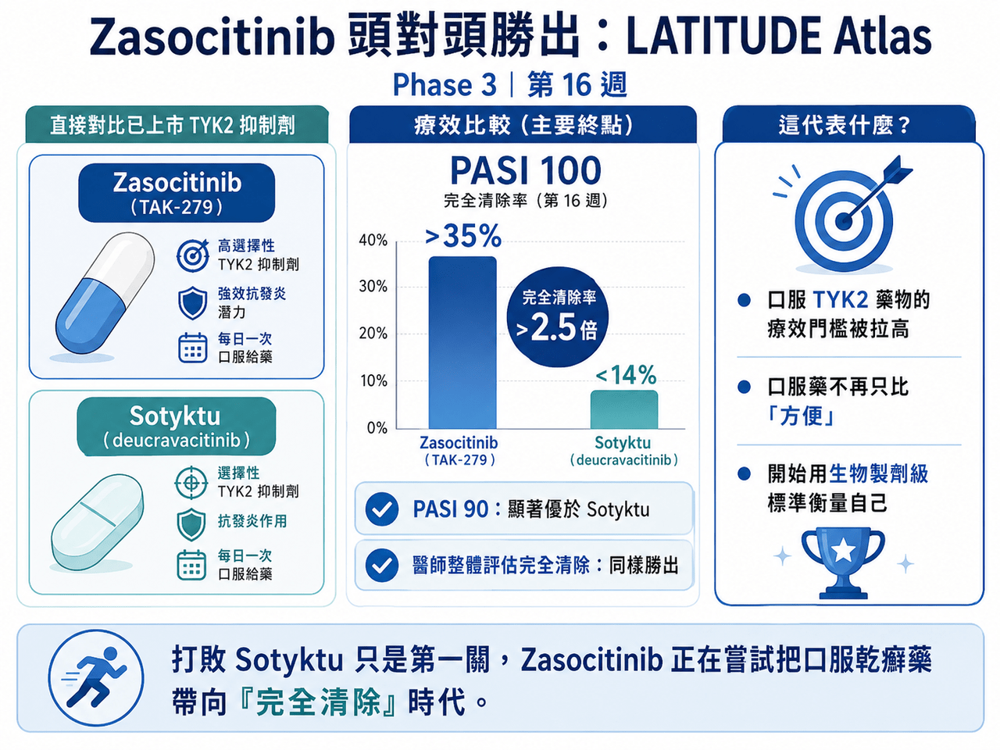
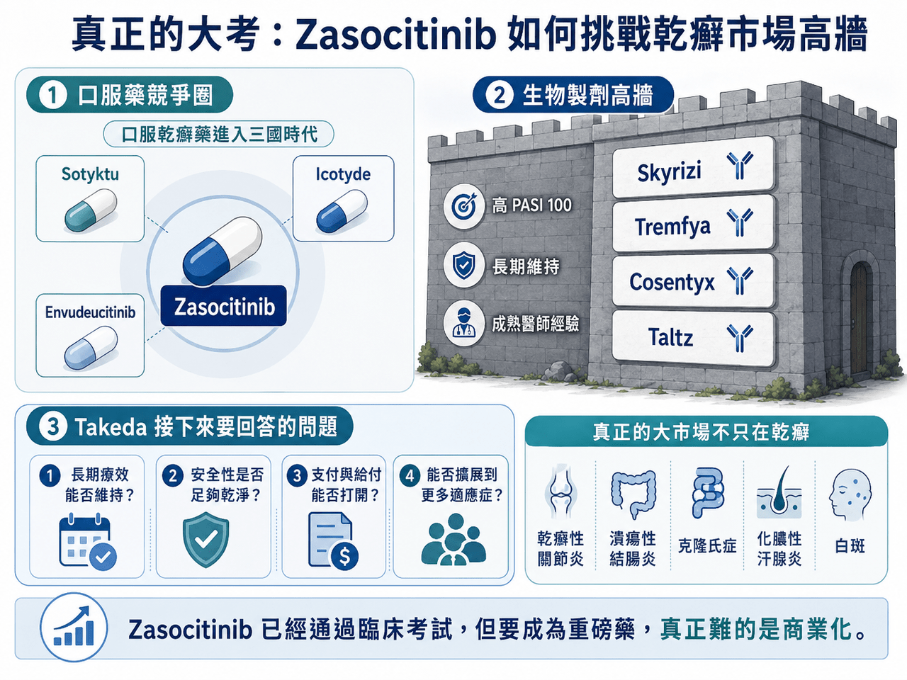

# AI製藥，第一藥終於要來了嗎？武田 Zasocitinib 頭對頭打敗 Sotyktu

## 武田製藥闖入一場大考：Zasocitinib 頭對頭打敗 Sotyktu
乾癬治療的門檻，正在被快速拉高。

過去，口服藥在中重度乾癬市場裡，常常扮演的是「方便但療效有限」的角色。真正能把皮膚清得很乾淨的，仍然是 Skyrizi（risankizumab，瑞莎奇珠單抗）、Tremfya（guselkumab，古塞奇尤單抗）、Cosentyx（secukinumab，司庫奇尤單抗）、Taltz（ixekizumab，依奇珠單抗）這些生物製劑。

但這個格局正在鬆動。

先是 Johnson & Johnson 的 Icotyde（icotrokinra，口服 IL-23 受體拮抗劑）在 2026 年 3 月獲 FDA 核准，成為第一款口服 IL-23 受體拮抗劑，用於中重度斑塊型乾癬。這款藥的意義不是只有「又多一個口服選項」，而是直接把口服乾癬藥物的療效標準推向更高層級。FDA 核准 Icotyde 用於成人與 12 歲以上、體重至少 40 公斤的中重度斑塊型乾癬患者，也讓市場重新思考：如果口服藥能接近生物製劑，患者會不會重新選擇？

緊接著，Takeda 的 Zasocitinib（TAK-279，口服 TYK2 抑制劑）又把火燒得更旺。6 月，Takeda 公布 Zasocitinib 在 LATITUDE Atlas 頭對頭 Phase 3 試驗中的結果。這是一項直接對比 BMS 已上市 TYK2 抑制劑 Sotyktu（deucravacitinib，氘可來昔替尼）的研究。結果顯示，第 16 週時，Zasocitinib 在 PASI 100，也就是皮損完全清除這個主要終點上，顯著優於 Sotyktu。超過 35% 的患者達到完全清除，比例是 Sotyktu 的 2.5 倍以上。Takeda 也表示，Zasocitinib 在 PASI 90 與醫師整體評估完全清除等關鍵次要終點上，同樣達到統計學優越性。

這不是一場普通的口服藥比較。

因為當一款口服乾癬藥，把 PASI 100 設為頭對頭研究主要目標時，代表它不再滿足於「比傳統口服藥好一點」。它要用生物製劑的標尺來衡量自己。這也是 Takeda 現在真正面對的大考：🔍 Zasocitinib 已經證明臨床資料可以很強，但它能不能在 Skyrizi、Tremfya、Cosentyx、Taltz 這些王牌生物製劑長期把持的市場裡，真的撕開一道口子？
## 01｜乾癬治療的標準，已經從 PASI 75 卷到 PASI 100

要理解這場競爭，先要理解 PASI。

PASI 是乾癬面積與嚴重程度指數，用來衡量皮膚病灶改善程度。

🔍 PASI 75，代表皮損改善 75%。

🔍 PASI 90，代表皮損幾乎清除。

🔍 PASI 100，代表皮損完全清除。

很多年前，PASI 75 就已經是令人滿意的治療目標，因為當時傳統治療選擇有限，能讓皮膚改善 75%，已經很不錯。但 IL-17、IL-23 生物製劑上市後，市場標準被大幅拉高，患者不只想「好一點」。而是希望皮膚乾淨、不要脫屑、不要紅斑、不要被別人看見病灶，也不要在夏天穿短袖時感到尷尬。

乾癬不是只有皮膚問題，它會影響睡眠、情緒、社交、自信與工作。對很多患者來說，「完全清除」不是數字遊戲，而是回到正常生活，所以，PASI 100 的意義很大。Takeda 選擇用 PASI 100 作為 LATITUDE Atlas 的主要終點，其實是在宣告：📌 Zasocitinib 不只是要打敗另一款口服藥，而是要證明口服藥也能追求生物製劑級別的清除效果。

這個定位非常激進，也非常必要。

因為如果 Zasocitinib 只比 Sotyktu 好一點，商業化不一定能成功，但如果它能讓口服藥真正觸碰到「完全清除」這個患者最在意的目標，故事就完全不同。
## 02｜Zasocitinib 的價值：AI 分子設計，不只是行銷名詞

Zasocitinib 之所以受到關注，還有一個原因：它是 AI 輔助設計小分子中，臨床進度最靠前、也是最有商業化機會的案例之一。

Zasocitinib 最早由 Nimbus Therapeutics 與 Schrödinger 合作開發。

Schrödinger 的平台以物理模擬、自由能計算與機器學習方法協助小分子設計。這類技術不是讓 AI 憑空「發明藥物」，而是在藥物化學設計中，提高對親和力、選擇性、溶解度與藥物性質的預測能力，讓團隊更快篩選出值得合成的分子。Schrödinger 的案例資料也明確將 TAK-279，也就是 Zasocitinib，描述為高度選擇性的口服 TYK2 抑制劑。2022 年底，Takeda 以 40 億美元首付款，加上最高 20 億美元銷售里程碑，總額最高 60 億美元，收購 Nimbus 的 TYK2 專案。

當時市場對這個價格有疑問，畢竟，這還是一個當時尚未進入三期成功兌現的口服自免管線。現在回頭看，Takeda 至少在臨床層面已經拿到第一張漂亮成績單。Zasocitinib 先是在 Phase 3 中打敗安慰劑與 Otezla（apremilast，阿普米司特）。第 16 週 PASI 90 達到 61.3% 與 51.9%，遠高於安慰劑與 Otezla；靜態醫師整體評估清除或近乎清除的比例也明顯領先。現在又在頭對頭研究裡打敗 Sotyktu。這讓 Zasocitinib 的故事不再只是「AI 設計藥物很有未來」。

而是：

✅ AI 輔助設計的小分子，真的可以走到 Phase 3。

✅ 真的可以在頭對頭研究中擊敗已上市同類藥。

這對 AI 製藥來說，是很重要的實證，但對 Takeda 來說，這還不是勝利，因為臨床勝利只是前半場，真正難的是市場。
## 03｜TYK2 為什麼重要？它是 JAK 風險之後的「窄門」

TYK2 屬於 JAK 家族，JAK 家族包含 JAK1、JAK2、JAK3 與 TYK2。

這些激酶參與免疫與發炎訊號傳遞。傳統 JAK 抑制劑在類風濕性關節炎、異位性皮膚炎、發炎性腸道疾病等領域證明過療效，但也因為廣泛影響免疫、造血與代謝訊號，長期受到感染、血栓、心血管事件、惡性腫瘤風險等安全性疑慮影響。TYK2 的吸引力在於，它更集中地介入 IL-23、IL-12 與第一型干擾素相關訊號，這些路徑和乾癬等免疫疾病高度相關。如果能選擇性抑制 TYK2，同時避開 JAK1、JAK2、JAK3，就可能取得口服小分子的便利性，又減少傳統泛 JAK 抑制劑的安全性陰影。

這就是 Sotyktu 當年被看好的原因，Sotyktu 是全球第一款獲批的口服 TYK2 變構抑制劑。它不是去打高度保守的 ATP 結合口袋，而是結合 TYK2 的調節區域，藉此提高選擇性，避開傳統 JAK 抑制劑的黑框警告問題。但 Sotyktu 的商業化表現並不如當初預期。2025 年，Sotyktu 銷售額約 2.91 億美元，遠低於外界早期對 40 億美元峰值銷售額的想像。問題不在於 Sotyktu 沒有效，它確實比 Otezla 強，也提供了一個方便的口服選擇。問題是，它不夠強到讓醫師大量從生物製劑轉回口服藥。在一個 Skyrizi、Tremfya、Cosentyx、Taltz 已經把療效門檻推得很高的市場裡，方便不是唯一答案。

醫師和患者最終還是會問：

📌 皮膚能清到什麼程度？

📌 療效能維持多久？

📌 安全性是否乾淨？

📌 保險能不能給付？

如果這些問題沒有足夠強的答案，口服便利性就很難單獨撬動市場。
## 04｜Sotyktu 的教訓：口服方便，不等於商業成功

Sotyktu 給 Zasocitinib 上了重要一課，在乾癬市場裡，口服藥的確有需求。許多患者不喜歡打針，不想長期接受注射治療。Johnson & Johnson 針對乾癬患者偏好的 ENCOMPASS 研究也指出，正在接受注射治療的患者中，大多數表示如果有療效相當、安全性良好的新型口服療法，願意改用口服。Icotyde 的核准新聞也強調，口服療法有機會成為一線全身性治療的新選項。但問題在於，「願意改用」有前提。

Sotyktu 卡住的地方，就是療效與市場進入。從療效看，Sotyktu 在 POETYK PSO-1、PSO-2 中，第 16 週 PASI 100 大約 10% 到 14%，PASI 90 在 24 週約 32% 到 42%。這些數字比 Otezla 好，但和 Skyrizi 這類 IL-23 生物製劑相比，仍然有明顯差距。從市場進入看，乾癬市場已經有非常成熟的生物製劑競爭。保險公司、藥品福利管理機構、醫師處方習慣都已被長期建立。新口服藥要進入這個體系，必須付出高昂折扣與市場教育成本。這就是 Zasocitinib 面臨的真正戰場。

✅ 打敗 Sotyktu 是必要條件，但不是充分條件。

它還要說服市場：自己不只是最好的 TYK2 口服藥，而是有資格和部分生物製劑比較的口服選項。
## 05｜生物製劑仍然是高牆：Skyrizi 的存在感太強
要理解 Zasocitinib 的挑戰，必須把 Skyrizi 放進來看。

Skyrizi 是 IL-23p19 抗體，已經成為乾癬市場最強大的生物製劑之一。AbbVie 公布的早期核心三期研究資料顯示，Skyrizi 在 UltIMMa-1 與 UltIMMa-2 中，第 16 週 PASI 100 分別達到約 36% 與 51%，第 52 週 PASI 100 更達 56% 與 60%。

這些數字很硬。

Zasocitinib 在頭對頭研究中，第 16 週超過 35% 患者達到 PASI 100，已經碰到 Skyrizi 在其中一項試驗的低端區間。以一款口服藥而言，這非常了不起。但 Skyrizi 的優勢不只是 16 週 PASI 100。✅它還有長期療效維持 ✅較低給藥頻率 ✅成熟醫師使用經驗 ✅多適應症擴展 ✅AbbVie 強大的免疫學商業化能力。

所以 Zasocitinib 想突圍，不能只拿一個 16 週 PASI 100 數字說故事。

它還需要證明：

📌 52 週、甚至更長時間，PASI 90 與 PASI 100 是否能維持？

📌 停藥後復發情況如何？

📌 長期安全性是否足以支持慢性用藥？

📌 能不能在乾癬性關節炎、發炎性腸道疾病、化膿性汗腺炎、白斑等適應症中複製療效？

📌 支付方是否願意給它一個比生物製劑更友善的位置？

這些，才是 Zasocitinib 能不能從「臨床好藥」變成「商業重磅藥」的關鍵。
## 06｜Icotyde、Zasocitinib、Envudeucitinib：口服乾癬藥開始進入三國時代
Zasocitinib 不是孤軍作戰。

現在口服乾癬藥物正在同時出現幾股力量。

✅ 第一，是 BMS 的 Sotyktu（deucravacitinib，氘可來昔替尼）。它是第一款上市 TYK2 抑制劑，先行者優勢明確，但療效與商業放量不如預期。

✅ 第二，是 Johnson & Johnson／Protagonist 的 Icotyde（icotrokinra，口服 IL-23 受體拮抗劑）。這是口服 IL-23 受體拮抗劑。它的機制和 TYK2 不同，是更直接地阻斷 IL-23 受體訊號。

FDA 已核准 Icotyde 用於中重度斑塊型乾癬，分析師甚至認為其峰值銷售有機會超過 80 億美元。

✅ 第三，是 Takeda 的 Zasocitinib。它以更高 TYK2 選擇性、更強療效與頭對頭勝利，試圖重新定義口服 TYK2 藥物。

✅ 第四，是 Alumis 的 Envudeucitinib（ESK-001）。Envudeucitinib 也是下一代 TYK2 抑制劑。

其 ONWARD Phase 3 研究資料顯示，第 16 週 PASI 90 超過 50%，第 24 週 PASI 100 接近 40%。

這代表口服乾癬市場正在快速擁擠。

未來不會只是 Zasocitinib 對 Sotyktu。而是 Icotyde、Zasocitinib、Envudeucitinib、Sotyktu、Otezla，再加上所有生物製劑一起競爭。
## 07｜Zasocitinib 的真正大市場，不只在乾癬
Takeda 當初花 40 億美元 upfront 買下 Zasocitinib，不可能只看乾癬一個適應症。

乾癬是第一站。

真正想像空間，在更廣泛的免疫發炎疾病。Zasocitinib 已經或正在探索乾癬性關節炎、克隆氏症、潰瘍性結腸炎、化膿性汗腺炎、白斑等疾病。Takeda 也曾指出，Zasocitinib 若獲准，峰值年銷售有機會達到 30 億到 60 億美元區間。

這裡最值得看的是發炎性腸道疾病。

腸道免疫疾病比皮膚疾病更複雜，對藥物組織分布、靶點持續抑制、安全性與長期用藥要求更高。如果 Zasocitinib 能在潰瘍性結腸炎或克隆氏症中做出漂亮資料，商業天花板會大幅提高。

化膿性汗腺炎和白斑也有吸引力。這些疾病都有高度未滿足需求，且患者生活品質受影響很大。尤其白斑治療近年因 JAK 路徑成功而重獲關注，TYK2 是否能在其中找到位置，值得觀察。

所以 Zasocitinib 的估值不能只看乾癬。它真正像一個免疫小分子平台。

但前提是：⚠️ 它必須在乾癬先打出足夠強的商業開局，否則，後面適應症再多，市場也會保持懷疑。
## 08｜台灣可以怎麼看？
醣聯（4168）。

醣聯過去常被市場放在 ADC 或醣生物技術脈絡裡，但 2026 年公司宣布啟動第二個生物相似藥開發計畫，目標鎖定治療乾癬等免疫相關疾病的新型生物製劑。對許多乾癬患者來說，療效已經不是唯一問題，可近性、價格與健保負擔同樣重要。當全球乾癬療法越來越強，台灣若能在生物相似藥與高品質可負擔療法中找到位置，也是一條務實路線。

第二個可以簡短看藥華藥（6446）。

藥華藥過去曾公告 Tirbanibulin（KX01）外用軟膏用於斑塊型乾癬的台灣第一期臨床試驗結果。

這條線後續是否仍為公司核心，不宜過度放大。
## 結語｜武田已經通過臨床考試，但真正的大考才開始
Zasocitinib 的 Phase 3 頭對頭勝利，意義很大。

它證明下一代口服 TYK2 抑制劑，療效可以顯著超越 Sotyktu。它也證明 AI 輔助分子設計不是只有概念，而可以走到臨床後期，甚至在頭對頭試驗裡贏下已上市同類藥，但從產業角度看，Takeda 還沒有真正通過考試。它只是通過第一關，後面的商業化也將會是困難

這些答案，才會決定 Zasocitinib 是一款好藥，還是一款真正能成為重磅產品的藥。

乾癬口服藥時代確實正在加速到來。

但在 Skyrizi、Tremfya、Cosentyx、Taltz 這些生物製劑高牆面前，口服藥想要翻盤，不只要方便，還要足夠強、足夠安全、足夠持久，也要足夠容易被支付體系接受。武田已經拿到很漂亮的臨床成績，但這場考試，真正難的部分，才剛開始。
------------
參考資料：

[0]: 各公司官網＆公開資料

[1]:

reuters.com

https://www.reuters.com/business/healthcare-pharmaceuticals/us-fda-approves-jjs-oral-psoriasis-pill-2026-03-18/

www.reuters.com

[2]:

YouTube

In a head-to-head Phase 3 study, zasocitinib showed statistical superiority over deucravacitinib across key endpoints in plaque psoriasis.

www.takeda.com

[3]:

Design of a highly selective, allosteric, picomolar TYK2 inhibitor using novel FEP+ strategies - Schrödinger

https://www.schrodinger.com/design-of-a-highly-selective-allosteric-picomolar-tyk2-inhibitor-using-novel-fep-strategies/

www.schrodinger.com

[4]:

reuters.com

https://www.reuters.com/business/healthcare-pharmaceuticals/takedas-ai-crafted-psoriasis-pill-succeeds-late-stage-studies-2025-12-18/

www.reuters.com

[5]:

YouTube

Takeda’s Phase 3 studies in plaque psoriasis demonstrate that convenient once-daily oral zasocitinib demonstrated rapid and durable skin clearance with a safety profile consistent with Phase 2b studies.

www.takeda.com

---

本文僅供產業研究與知識分享，不構成投資、醫療、募資或個股建議。
