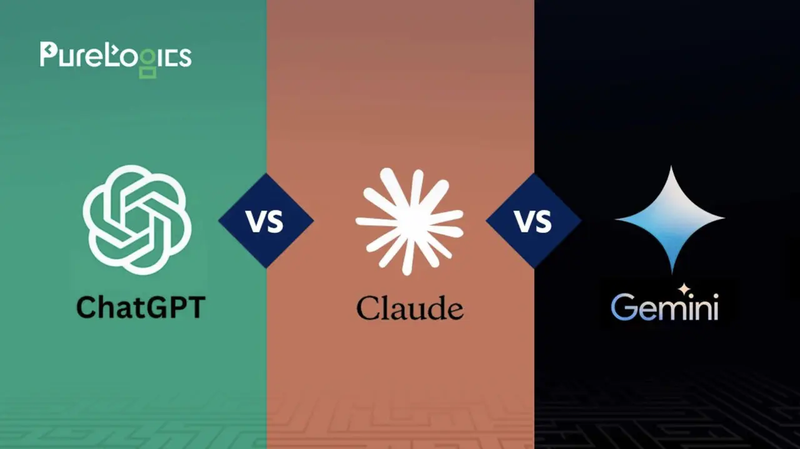
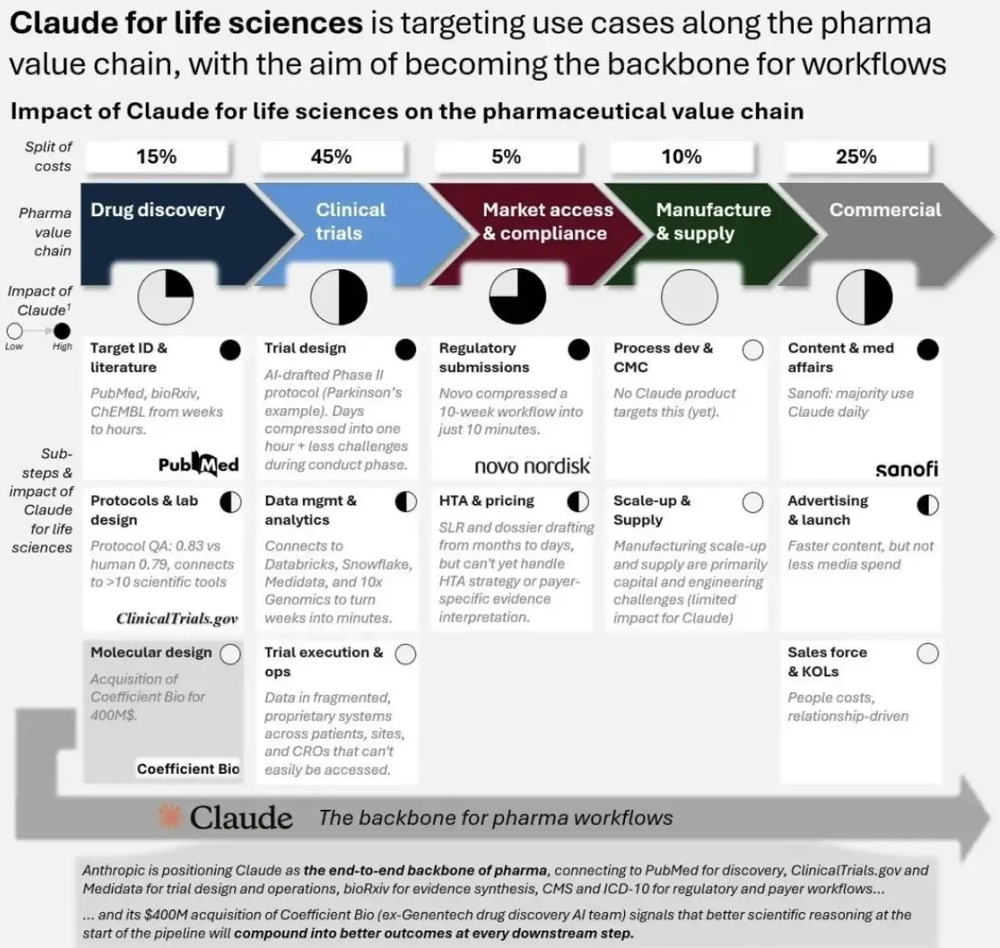
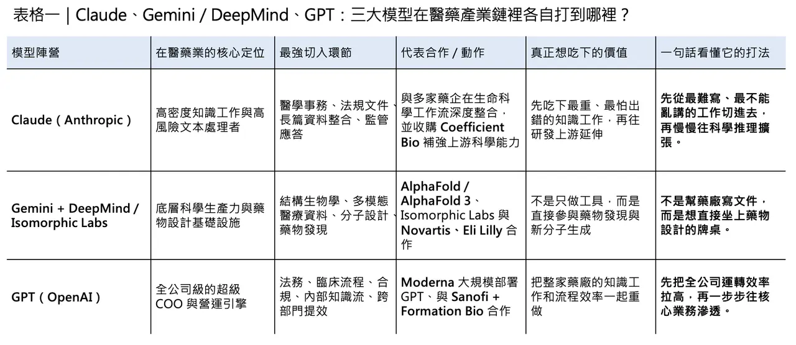
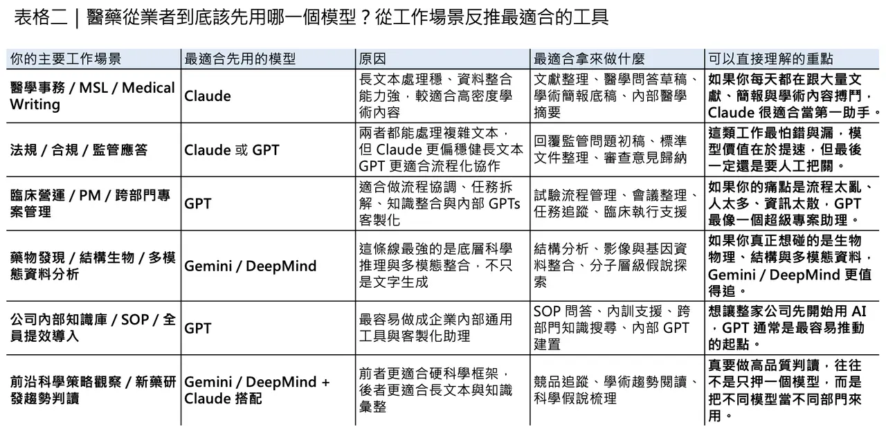
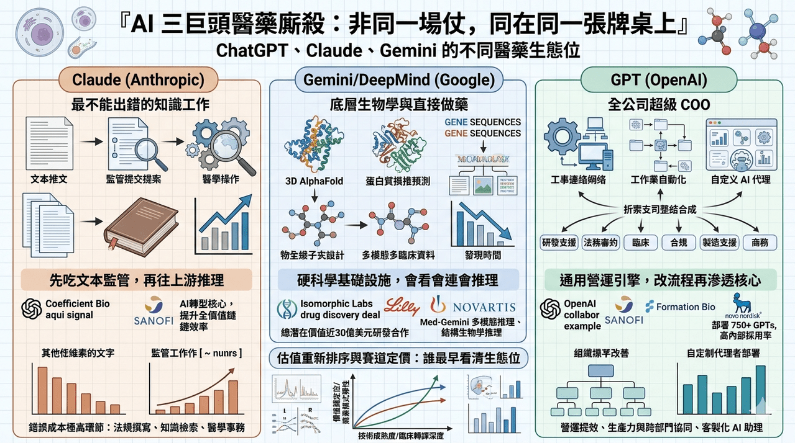

# AI三巨頭在醫藥裡廝殺

ChatGPT、Claude、Gemini 這三大通用大模型，現在打的已經不只是消費端流量，也不是一般企業辦公市場，而是開始往生醫製藥產業鏈的深水區插旗。真正值得注意的，不是哪一家又多發了一個模型版本，而是它們切入醫藥行業的方式其實完全不同：有的先吃下長文本與監管文書，有的直接往底層生物學與藥物設計滲透，還有的則試圖把整家藥廠變成一個由 AI 驅動的營運系統。這不是同一場仗，只是都發生在同一張牌桌上。
✦【先看 Claude：先吃下最重、最密、最不能出錯的知識工作】
如果說製藥是一條由標靶發現、臨床開發、CMC、法規申報、醫學事務與商業化串起來的長鏈條，那麼 Claude 目前最強的切入點，不在最前端的分子生成，而在那些文本極重、知識密度極高、錯誤成本極高的環節。Anthropic 在 2025 年推出 Claude for Life Sciences，2026 年又進一步發布 Claude for Healthcare 與生命科學擴展工具，等於正式把這條路線產品化。更重要的是，Sanofi 已公開表示，Claude 已成為其 AI 轉型的重要核心，多數員工每天都在使用，並已在整條價值鏈上帶來效率提升。這說明 Claude 在製藥領域當前最強的定位，不是「幫你發明新藥」，而是先把知識工作最重、最煩、最不能出錯的那一層吃下來。
Claude 更值得注意的，是它並不滿足於只做文件型工具。
根據 The Information、TechCrunch 與 Fierce Biotech 等報導，Anthropic 最近以約 4 億美元收購了原本處於隱身狀態的 Coefficient Bio。這筆交易即使目前不是以高調官方稿形式公布，它釋放的訊號仍然非常清楚：Anthropic 已意識到，若只停留在醫學事務、法規撰寫與知識檢索，它在製藥價值鏈裡的位置仍偏中後段；要真的切進新藥研發深水區，它就必須補上更強的科學推理與生物學能力。換句話說，Claude 這條線目前的陽謀其實很明白：先靠長文本與高風險文書工作打進藥廠，然後再往上游滲透。
✦【再看 Gemini 和 DeepMind：不是只做工具，而是想直接參與做藥】
Google 這一路和另外兩家最不一樣的地方，在於它從來不只想做企業軟體供應商。從 AlphaFold 到 AlphaFold 3，再到 Isomorphic Labs，Google／DeepMind 真正在做的，是把自己放在「硬科學基礎設施」的位置上。Isomorphic Labs 在 2024 年與 Eli Lilly、Novartis 簽下合作，官方說法是兩筆合作總潛在價值接近 30 億美元，而且是帶有 upfront、里程碑與未來權利金結構的研發合作。這種交易不是典型 SaaS 收費，而比較像一家新型 AI Biotech 直接走上藥物研發談判桌。也就是說，Google 不是在賣一套辦公工具，而是在嘗試用 AI 直接參與藥物設計本身。
同時，Google 在醫療 AI 上真正強的，還有它對多模態資料的執著。
Med-Gemini 與 Google Research 的公開資料顯示，這條路線的重點不是只讀文字，而是把文字、影像、長上下文與醫療任務放在一起處理。這點對醫藥產業特別重要，因為真實世界的醫療資產本來就不是乾巴巴的文書，而是病理切片、影像、EHR、基因組資料與各種長序列訊號的混合體。從這個角度看，Gemini／DeepMind 的醫藥定位更像是：在底層生物物理與多模態臨床資料上建立優勢，讓 AI 不只會寫，而是會看、會連、會推理。

✦【最後看 GPT：最像整家藥廠的超級 COO】
如果說 Google 想做底層科學能力，Claude 正在攻高風險文本工作流，那麼 GPT 在製藥業最像的角色，就是全公司的超級 COO。它最強的，不是某個單點學科，而是把法務、臨床、合規、商務、研發支援與內部知識流一起變快。Moderna 就是目前最完整的樣板。OpenAI 官方案例與 Moderna 新聞稿都寫得很清楚：在導入 ChatGPT Enterprise 後，Moderna 在幾個月內就部署了 750 個以上 GPTs，用在法務審約、劑量選擇分析、研究與製造支援等場景，且公司內部採用率很高。這件事的本質不是「員工會用聊天機器人」，而是 OpenAI 已經證明，GPT 可以先成為一家藥廠的橫向基礎工作層。
OpenAI 也沒有停在一般辦公協作。
2024 年，Sanofi、Formation Bio 與 OpenAI 宣布合作，三方要一起打造覆蓋藥物開發全生命週期的 AI 軟體與專用模型。這筆合作的意義很大，因為它把 GPT 從「提升個人效率」往「重建臨床開發與藥物研發流程」推進。到了 2026 年，Novo Nordisk 又宣布與 OpenAI 建立戰略合作，要把 AI 延伸到藥物發現、製造與商業化等多個部門。這意味著 GPT 在製藥業的角色，正在從工具升級為營運平台：不是只幫某一個部門快一點，而是試圖讓整家公司的決策、文件、生產力與跨部門協同都加速。
✦【不是誰比較強，而是誰先卡住哪一段價值鏈】
把這三家放在一起看，醫藥行業裡真正的「三國殺」其實不是誰比較聰明，而是誰先拿下哪一段價值鏈。
🔹 Claude 先拿高密度知識工作與法規文書，再伺機往上游科學推理擴張。
🔹 Gemini／DeepMind 從一開始就瞄準底層生物學、多模態醫療資料與直接做藥的能力。
🔹 GPT 則最像一個能被快速部署到整家藥廠裡的通用營運引擎，先改流程，再慢慢往核心業務滲透。

三家都在醫藥，卻不是在搶同一塊蛋糕。
所以，真正重要的問題不是「哪個模型最強」，而是你在製藥產業鏈的哪個位置，需要哪一種能力。
如果你做的是醫學事務、法規、臨床文件、長篇知識整合與高風險文本工作，Claude 目前的適配度很高；如果你關心的是結構生物學、多模態醫療資料、分子層級推理與更前端的藥物發現，Gemini／DeepMind 更值得盯；如果你想先從整體工作流、跨部門生產力、客製化 AI 助理與營運提效切入，GPT 現在跑得最快。
這場仗暫時不會有唯一贏家，因為製藥業本來就不是單點市場。真正會勝出的，通常不是選了最潮模型的人，而是最早看清每家模型真實生態位的人。
----------
參考資料：
[0]: 各公司官網＆公開資料
[1]:
Advancing Claude in healthcare and the life sciences \ Anthropic

Introducing Claude for Healthcare with HIPAA-ready infrastructure, plus expanded Life Sciences tools for clinical trials and regulatory submissions. New connectors to CMS, Medidata, and ClinicalTrials.gov.
www.anthropic.com
[2]:
Claude for Life Sciences \ Anthropic
Discover how Claude accelerates life sciences research with new scientific connectors, skills, and improved performance for drug discovery and clinical work.
www.anthropic.com
[3]:
Anthropic acquires stealth startup Coefficient Bio in $400M deal
AI powerhouse Anthropic is acquiring of previously stealth AI startup Coefficient Bio in a $400 million stock deal.

www.fiercebiotech.com
[4]:
Isomorphic Labs kicks off 2024 with two pharmaceutical collaborations - Isomorphic Labs
Isomorphic Labs announces strategic collaborations with two of the world’s leading pharmaceutical companies, Eli Lilly and Company and Novartis. These partnerships have the potential to be worth nearly $3 billion to Isomorphic Labs, excluding any royaltie
www.isomorphiclabs.com
[5]:
Advancing medical AI with Med-Gemini
https://research.google/blog/advancing-medical-ai-with-med-gemini/
research.google
[6]:
Moderna
Accelerating the development of life-saving treatments.
openai.com
[7]:
Sanofi
Sanofi, Formation Bio and OpenAI announce first-in-class AI collaboration Paris, New York, N.Y., and San Francisco, CA, May 21, 2024. Sanofi, Formation Bio and OpenAI are collaborating to build...
www.sanofi.com

---

本文僅供產業研究與知識分享，不構成投資、醫療、募資或個股建議。
