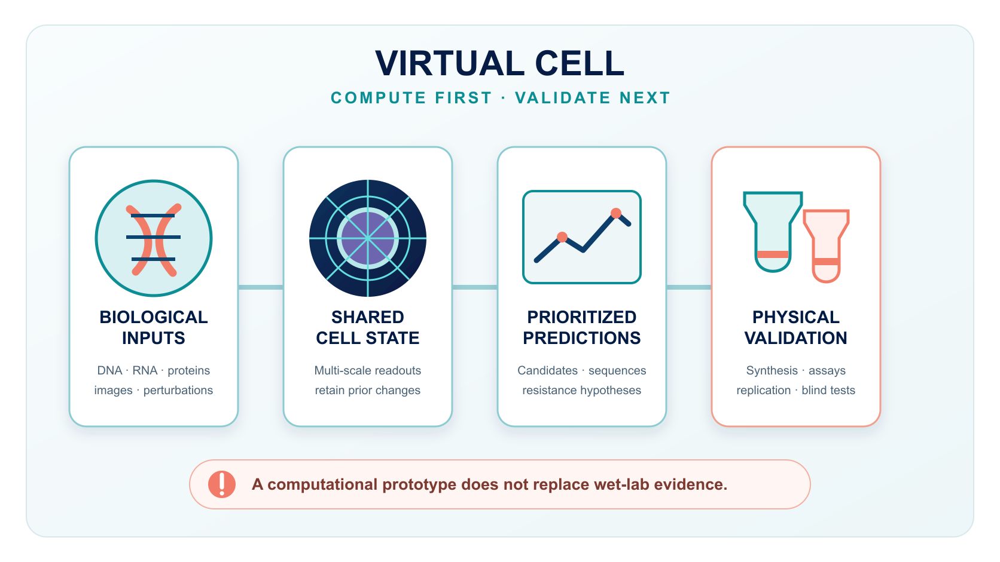
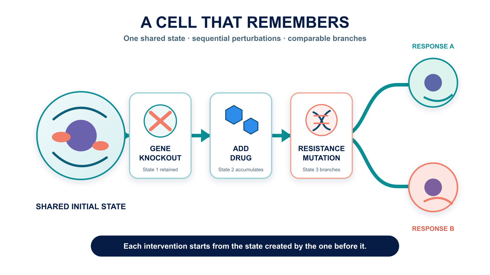
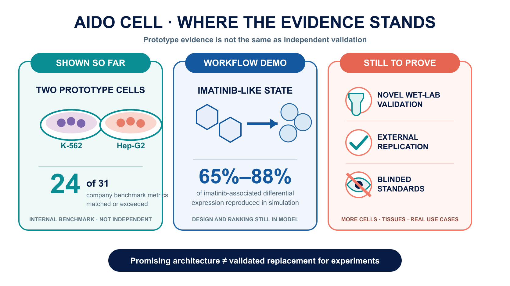
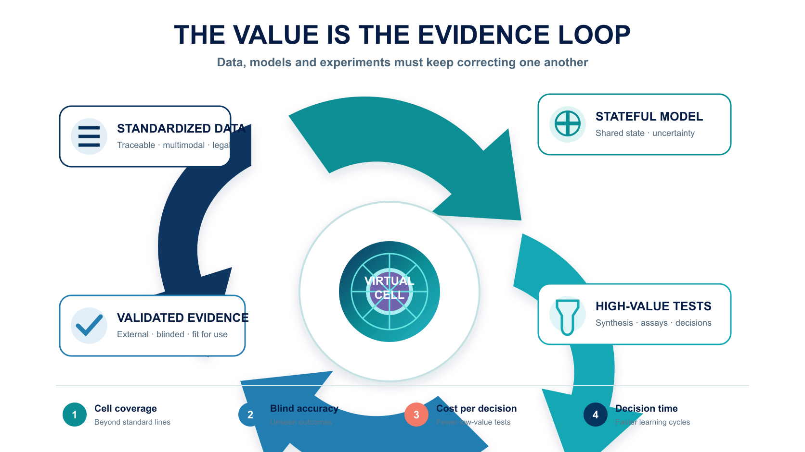

# Can New Drugs Be Tested in a Computer First? The Virtual Cell Is Here

What if a candidate drug could be “fed” to a cell inside a computer before it ever reached a person? Could drug developers avoid more dead ends?

In a 31-metric benchmark built by GenBio AI, the company says its AIDO Cell matched or outperformed the specialist models used for comparison on 24 metrics. Yet the current preview focuses on just two cancer cell lines, K-562 and Hep-G2. This is a noteworthy engineering prototype, not a substitute for cell experiments. New predictions still require physical experiments, external replication and blinded testing.

## 01 | Earlier Models Could Answer Questions. A Virtual Cell Tries to Accumulate Experience

Over the past several years, artificial intelligence has become useful across many biological tasks.

Give a model an amino-acid sequence and it may predict how the protein folds. Feed it single-cell data and it may identify cell types. Tell it that a gene has been switched off and it may predict part of the resulting change in gene expression.

These tools are valuable, but most resemble specialists from different departments. One understands protein structure, another gene expression and another cellular images. Researchers pass the output of one model to the next and assemble the answers into a workflow. The problem is that a real cell is not a stack of independent reports.

Turning off one gene can change RNA transcription and splicing. Protein abundance, location and interactions may shift. Signaling pathways respond. The cell's appearance, growth rate and drug response may then change as well. Every layer feeds back into the others.

AIDO Cell's ambition is to make these layers readable from one shared “cell state.” A researcher could first knock out a gene, then add a drug and then simulate a resistance mutation. At the second step, the model would not reset to an untouched cell; it would continue from the state produced by the first intervention.

That is what a stateful model is meant to do.

Put more simply, an ordinary prediction tool is like taking a photograph. AIDO Cell is trying to make a film whose script can be revised while it is playing. Earlier interventions are not erased; later changes accumulate on top of them.

Real experiments are sequential. Researchers rarely ask only whether a drug works. They ask what happens when one treatment is followed by another, whether a cell recovers after resistance emerges and treatment is changed, or how two experimental paths diverge from the same starting point.

If a model can preserve a coherent cell state across those steps, the computer becomes more than a place to retrieve answers. It begins to resemble a digital laboratory in which experiments can be repeated and branched.

## 02 | What Has AIDO Cell Actually Achieved So Far?

The easiest claim to overstate should be addressed first: AIDO Cell is not yet a complete human cell, and it has not been shown to replace physical experiments.

The publicly described 1.0 preview focuses on two cancer cell lines that have been studied for decades: K-562, derived from leukemia, and Hep-G2, derived from liver cancer. Both have extensive literature and multi-omics data, which makes them practical test beds. They are still standardized laboratory cell lines, far removed from primary patient cells, immune microenvironments and organ-level interactions inside a person.

According to GenBio, the team created an internal benchmark comprising five task categories and 31 metrics. It covers small-molecule perturbation, gene knockout, protein structure, RNA splicing and genome regulation. The company reports that AIDO Cell matched or exceeded the specialist models used for comparison on 24 of the 31 metrics.

That is an interesting engineering signal. It is not the same as proof that the model “understands the cell.” The benchmark was developed by the company building the product, and the complete technical report currently has to be requested from GenBio. The field still needs more public evidence, external reproduction and blinded evaluation.

The most valuable test is not the score on a familiar exam. It is whether the system can make a useful prediction about a genuinely unseen problem and whether a laboratory can then confirm it.

AIDO Cell has not yet cleared that decisive threshold.

GenBio's own explanation acknowledges the limitation. Current examples are mainly checked against established biological knowledge, while new predictions still require experimental validation. Multi-scale cell simulation also lacks a field-wide blinded standard comparable to CASP, the long-running benchmark for protein-structure prediction.

The most precise description today is therefore not “the cell has been solved.” Researchers have been shown a prototype architecture that can place several biological scales in a shared state and support sequential interventions.

It demonstrates that such an architecture can be built. It does not demonstrate that the architecture can replace a real cell.

## 03 | The Imatinib Example Is Not a “Miracle Prediction”

Early coverage can make the imatinib example sound as if the model independently rediscovered a known mechanism. That interpretation is misleading.

Imatinib is an important targeted therapy for chronic myeloid leukemia. It inhibits the abnormal ABL1 kinase. In its K-562 virtual-cell example, GenBio first used the simulated state produced by imatinib as a reference target. The system then generated structurally different candidate molecules and simulated their binding to ABL1, their gene-expression effects and indicators that might reflect cellular stress.

The company reports that some candidates reproduced 65% to 88% of the imatinib-associated differentially expressed genes in simulation while retaining distinct chemical structures.

The case illustrates an appealing workflow. Instead of asking only whether a molecule binds to a target, researchers specify the cellular state they want to reach and work backward to design molecules that might push the cell toward that state.

But the design and ranking still take place inside the model.

Whether those molecules can be synthesized, reproduce the predicted response in cell assays or create unexpected toxicity must be answered by chemistry and physical experiments. GenBio has also stated that new predictions are undergoing validation.

The sensible interpretation of the imatinib example is therefore “workflow demonstration.” It is not evidence that a new medicine has been discovered, and it is certainly not evidence that a virtual cell has passed a clinical test.

## 04 | Why Would Drug Companies Still Want It?

Because the most expensive part of drug development is often not generating ideas. It is eliminating the wrong ones.

A team can design thousands of molecules at once, but it cannot synthesize every molecule, expose every relevant cell to each one and measure every resulting change in genes and proteins. Laboratory capacity is finite. The recurring questions are which ten candidates deserve to be made first, which signal might be a data artifact, and which combination appears promising but may hide toxicity.

If virtual cells become useful, their first job will not be to make pipettes disappear. It will be to identify the experiments for which the pipettes are most worth picking up.

In early discovery, a virtual cell could help narrow the candidate set. In combination therapy, it could simulate different treatment sequences. In resistance research, it could branch into alternative mutation paths. In a rare disease with very few physical samples, patterns learned from other cells might help researchers form a better starting hypothesis.

There is also a paradox. The more completely a model tries to simulate a cell, the more it depends on high-quality, multimodal and traceable experimental data. AI will not remove the laboratory from drug development. It may instead increase demand for standardized perturbation datasets, single-cell analysis, cellular imaging, protein quantification and automated experimentation.

A credible virtual world has to return repeatedly to the physical world for calibration.

## 05 | This Is Not a One-Company Race

GenBio is not the only company pursuing a virtual cell.

In March 2026, Xaira Therapeutics introduced X-Cell, a model focused on predicting how cells respond to genetic or drug perturbations. Its technical report describes a model scaled to 4.9 billion parameters, trained and evaluated with more than 20 million cells and a large collection of perturbation combinations.

The two companies emphasize different approaches. X-Cell's public work concentrates more heavily on large perturbation datasets and prediction across cellular contexts. AIDO Cell emphasizes a shared state, multi-scale readouts and sequential operation. Company announcements do not yet establish which approach is ahead, and parameter count is not a direct measure of biological understanding.

Any fair comparison should ask at least four questions:

1. Can the model predict outcomes in cells and perturbations it has not seen?
2. Can independent laboratories reproduce the results?
3. Can the model tell researchers where its predictions are unreliable?
4. Does using it improve experimental success rates, time or cost in practice?

The winner will not be the company that says “world model” most convincingly. It will be the one that can turn an answer inside a computer into a stable result in the laboratory.

## 06 | The FDA's Direction Is Encouraging, but It Is Not a Free Pass

The regulatory environment is changing.

The U.S. Food and Drug Administration includes computer simulation, organ-on-chip systems and organoids in its discussion of New Approach Methodologies, or NAMs. A draft released in March 2026 says that use of a NAM should address its context of use, human biological relevance, technical characterization and fitness for purpose. Final frequently asked questions for cell and gene therapy products published in August also state that the agency may consider scientifically justified in vitro or computational approaches capable of producing valid data in appropriate circumstances.

That is a meaningful change in direction. It should not be reported as “the FDA has endorsed virtual cells.”

The current documents do not endorse AIDO Cell, nor do they say that one virtual-cell system can directly replace necessary animal, cell or human studies. Regulators accept validated methods for defined uses; they do not approve a product simply because its name sounds advanced.

For virtual-cell companies, one of the most important commercial assets may eventually be not the model alone but an evidence package that establishes the settings in which its output can be trusted.

## 07 | Taiwan's Opportunity Is Broader Than Building a Chinese-Language Model

Should Taiwan pursue virtual-cell technology? Yes, but the opportunity should not be reduced to training a larger model or creating a Chinese-language interface.

The required value chain is long: high-quality clinical samples, multi-omics measurements, single-cell sequencing, pathology and cell imaging, high-throughput perturbation experiments, data standards, computing infrastructure and drug-development teams able to send predictions back to the laboratory for validation.

Taiwan's healthcare system, hospital biobanks, semiconductor and server capabilities, and the experimental and manufacturing experience of parts of its biotech sector create plausible entry points. But “could benefit” and “has won orders” are different claims.

For the industry and investors, the important questions are not whether a company has written AI on its pitch deck. Does it have data that can be used legally and updated continuously? Can it standardize data from different hospitals? How many novel model predictions have been confirmed experimentally? Are customers willing to pay to place the system inside a real research workflow?

Those figures reveal more about a commercial moat than the number of billions of parameters.

## 08 | When the Next Breakthrough Is Announced, Check These Four Validation Points

Virtual cells can produce dazzling demonstrations. Click a gene and a pathway changes color. Add a drug and the cell's appearance shifts. Ask the model to generate a new set of molecules. The more complete the screen looks, the easier it is to forget that the display may still represent one model remaining internally consistent with its own assumptions.

The next time a company announces a breakthrough in whole-cell simulation, look for four answers.

1. **Was there a genuinely blinded test whose answer remained hidden until the end?** If the model has already seen closely related data, a strong score may reflect familiarity with the question type.
2. **Has the system moved beyond data-rich standard cell lines such as K-562 and Hep-G2?** Performance in primary cells, patient-derived cells or complex co-culture systems would be a more demanding test. Answering questions about textbook cell lines does not guarantee performance in the clinical world's disorder.
3. **Who validated the new prediction?** Experiments performed by the developer are an important start. Reproduction by an independent team using different equipment and batches would raise confidence further.
4. **What changed for the customer?** How many experiments were avoided, how much time was saved, and how much did the success rate improve? If those numbers remain absent, the virtual cell may be a strong research instrument without yet being a product that customers will buy at scale.

These questions are simple, but they separate “the model looks impressive” from “the model changes drug development.” That distinction matters to scientists and investors alike.

## Conclusion | Biology Is Becoming Computable, but It Has Not Been Computed Away

AlphaFold showed that computers can provide answers to an exceptionally difficult biological problem in a form that changes research workflows. Virtual cells want to go a step further. Instead of looking only at the shape of one protein, they aim to model how many molecules pull on one another inside a cell and how successive interventions accumulate into a new state.

If that vision succeeds, drug development could shift from less directed searching toward more deliberate design.

But AIDO Cell remains a preview. It has two prototype cell lines. Its public examples largely revisit known biology. New predictions still await physical experimental validation, and the field lacks a shared blinded benchmark.

The right response is neither to announce the end of wet-lab research nor to dismiss the system because it is incomplete.

The important transition is that researchers now have a digital-cell architecture that can be questioned sequentially. The next task is to expose every compelling simulation to the unforgiving test of the physical world.

Only after passing that test can biology move from something that can be described toward something that can reliably be computed.

## Primary Sources

1. [GenBio AI | AIDO Cell technical overview](https://genbio.ai/aido-cell-simulator/)
2. [GenBio AI | Company team](https://genbio.ai/our-team/)
3. [Xaira Therapeutics | X-Cell announcement](https://www.xaira.com/news/xaira-therapeutics-launches-x-cell-its-first-virtual-cell-model-trained-on-the-largest-ever-genome-wide-perturbation-dataset-x-atlas-pisces)
4. [U.S. FDA | General Considerations for the Use of New Approach Methodologies in Drug Development](https://www.fda.gov/regulatory-information/search-fda-guidance-documents/general-considerations-use-new-approach-methodologies-drug-development)
5. [U.S. FDA | Frequently Asked Questions: Developing Potential Cellular and Gene Therapy Products](https://www.fda.gov/regulatory-information/search-fda-guidance-documents/frequently-asked-questions-developing-potential-cellular-and-gene-therapy-products)
6. [Nobel Prize | David Baker — Facts](https://www.nobelprize.org/prizes/chemistry/2024/baker/facts/)

Fact-check cutoff: September 1, 2026.

> Disclaimer: This article is intended for industry and scientific education. It does not constitute medical or investment advice. AIDO Cell is currently a preview; performance figures attributed to the company have not yet received broad independent validation.
