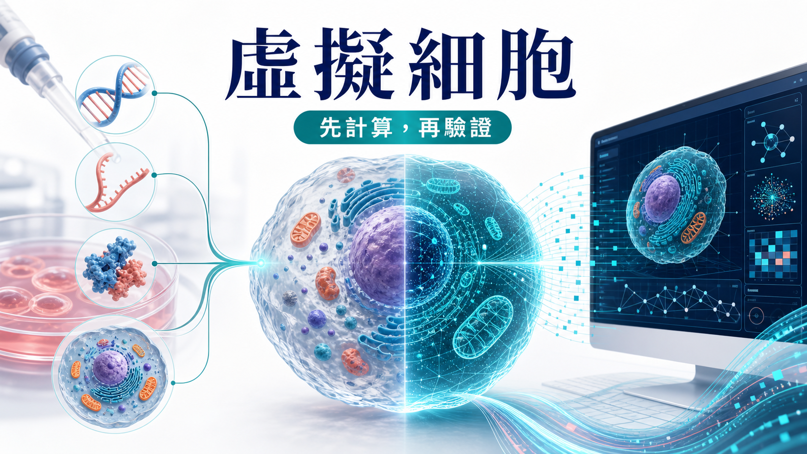
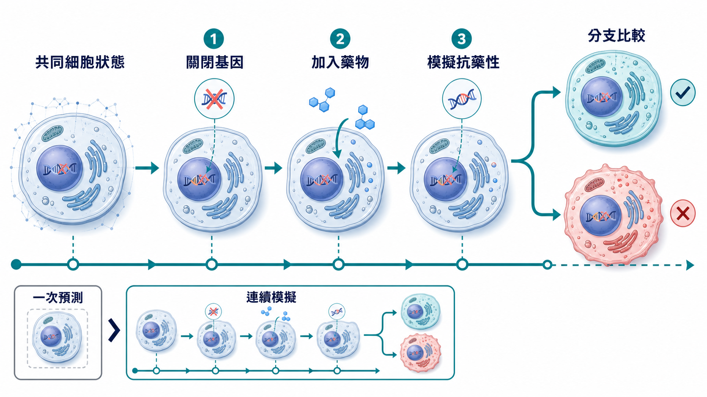
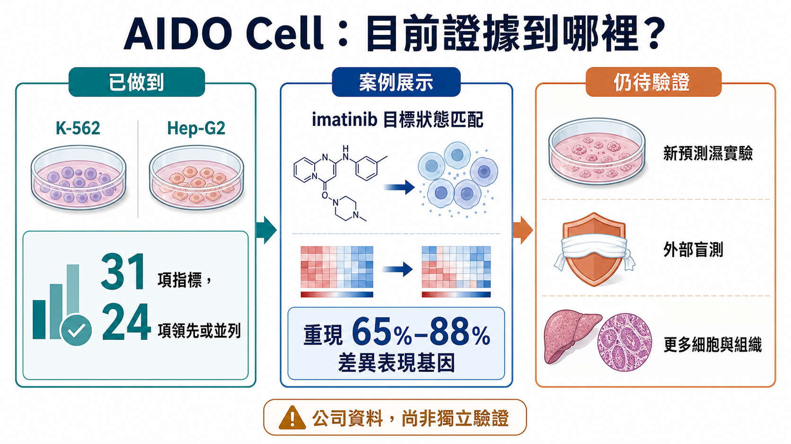
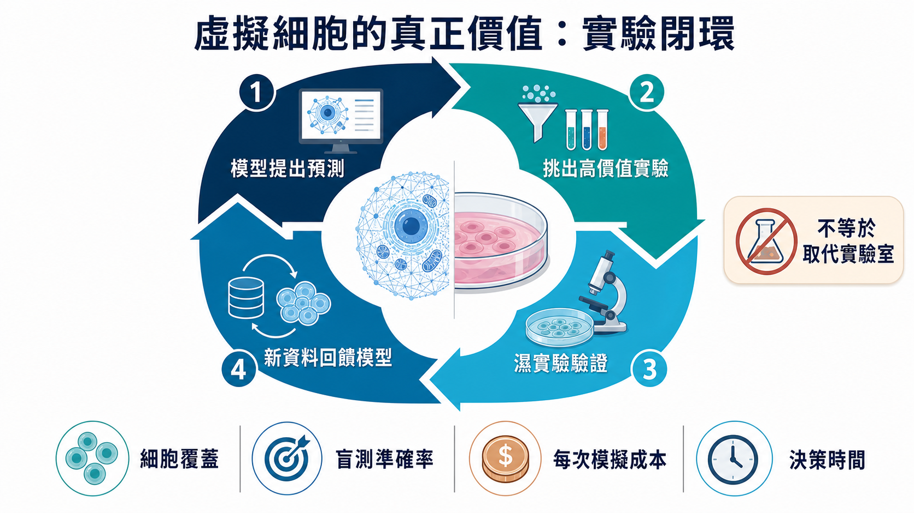

# 新藥能先在電腦裡試？「虛擬細胞」來了！

如果新藥進入人體前，能先在電腦裡「餵」給細胞，研發是否能少走冤枉路？GenBio AI 的 AIDO Cell 在公司自建 31 項指標中，有 24 項追平或超越專用模型；但目前只聚焦 K-562 與 Hep-G2 兩種癌細胞株。這是值得注意的工程原型，不是細胞實驗的替代品；新預測仍需實體實驗、外部重現與盲測。

## 01｜以前的模型會回答，虛擬細胞想學會「經歷」

過去幾年，人工智慧已經能處理不少生物學問題。

給它一段胺基酸序列，它可以預測蛋白質可能折成什麼形狀；輸入一批單細胞資料，它可以辨認細胞類型；告訴它某個基因被關閉，它也可能預測部分基因表現會怎麼改變。

這些工具很有用，卻多半像不同科別的專家：有人懂蛋白質，有人懂基因表現，有人懂細胞影像。研究者把上一個模型的答案交給下一個模型，最後拼成一條工作流程。問題是，真實細胞並不是幾張彼此獨立的報表。

一個基因被關閉，可能改變 RNA 的轉錄與剪接；蛋白質數量、位置和交互作用跟著變；訊號路徑受到牽動；最後細胞的外觀、生長速度與藥物反應也可能改寫。每一層都在互相回饋。

AIDO Cell 的野心，就是讓這些層級從同一個「細胞狀態」讀出。研究者可以先關閉一個基因，再加入一種藥，接著模擬抗藥性突變；第二步不是重新面對一顆乾乾淨淨的細胞，而是接在第一步造成的狀態上。

這就是所謂「有狀態」的模型。

更直白地說，普通預測工具像拍一張照片；AIDO Cell 想拍的是一部可以中途改劇本的電影。你做過的事不會被歸零，後面的變化會累積在前面的變化之上。

真實實驗本來就是連續的。研究者很少只問「這個藥有沒有作用」，更常問的是：先用藥、再加藥會怎樣？產生抗藥性之後換另一種治療，細胞會不會恢復？同一個起點分成兩條實驗路徑，結果差在哪裡？

如果模型真的能保留前後一致的細胞狀態，電腦就不只是查答案的地方，而開始像一間可以反覆操作的數位實驗室。

## 02｜它現在到底做到了什麼？

先把最容易被誇大的地方說清楚：AIDO Cell 還不是一顆完整的人類細胞，更沒有證明能取代實體實驗。

目前公開的 1.0 預覽版，聚焦兩種被研究數十年的癌細胞株：白血病來源的 K-562，以及肝癌來源的 Hep-G2。這兩種細胞累積了大量文獻與多體學資料，適合拿來測試模型；但它們仍是實驗室裡的標準細胞株，和患者體內的原發細胞、免疫微環境、器官互動，相隔很遠。

依 GenBio 官方資料，團隊建立了一套包含五類任務、31 項指標的內部基準，涵蓋小分子擾動、基因剔除、蛋白質結構、RNA 剪接與基因體調控。公司宣稱 AIDO Cell 在 31 項指標中，有 24 項達到或超越所比較的專用模型。

這是一個值得注意的工程訊號，卻不能直接等同於「模型已經理解細胞」。原因很簡單：這套基準由開發公司建立，完整技術報告目前需向公司申請，產業界仍需要更多公開資料、外部重現與盲測。

真正令人期待的，不是它在熟悉考題上拿了幾分，而是它能不能對一個沒看過的新問題做出預測，然後被實驗室證實。

這個最關鍵的門檻，目前還沒有跨過。

GenBio 自己也在官方說明中承認：現有案例主要對照既有生物學知識，新的預測仍要接受實體實驗驗證；多尺度細胞模擬也還缺少一套像蛋白質結構預測競賽 CASP 那樣，由整個領域共同認可的盲測標準。

所以，今天較精確的說法不是「細胞已被算透」，而是：研究者第一次看到一套能把多種生物層級放進共享狀態、又能連續操作的原型系統。

它證明了一種架構可以被做出來，還沒有證明這套架構足以替代真實細胞。

## 03｜伊馬替尼案例，不是「神預測」

原始消息常把伊馬替尼案例寫成「模型成功重現已知藥物機制」。這句話容易讓人誤會。

伊馬替尼是慢性骨髓性白血病的重要標靶藥物，會抑制異常的 ABL1 激酶。GenBio 在 K-562 虛擬細胞裡，先把伊馬替尼造成的模擬狀態設為參考目標，再生成結構不同的新候選分子，模擬它們與 ABL1 的結合、基因表現變化，以及可能反映細胞壓力的指標。

公司報告稱，部分候選分子在模擬中可重現伊馬替尼 65% 至 88% 的差異表現基因，同時呈現不同的化學結構。

這個案例展示的是一條很有吸引力的工作流程：不只問「某個分子能不能黏住靶點」，而是先指定希望細胞抵達的狀態，再反向設計可能把細胞推向那個狀態的分子。

可是，它仍然是模型裡的設計與排序。

這些候選分子是否真的能合成、是否在細胞實驗中產生相同反應、是否有意料之外的毒性，還要交給化學合成與實體實驗回答。官方也明確表示，新的預測正在驗證中。

因此，伊馬替尼案例最合理的意義是「工作流程展示」，不是一款新藥已被發現，更不是虛擬細胞已經通過臨床考驗。

## 04｜為什麼藥廠仍會想要它？

因為新藥開發最昂貴的，往往不是產生點子，而是排除錯誤。

一個團隊可以一次設計成千上萬個分子，卻不可能把每個分子都做出來、餵給所有細胞、測完每一種基因與蛋白質變化。實驗資源有限，真正的問題始終是：哪十個最值得先做？哪一個訊號可能只是資料偏差？什麼組合最有機會，也最可能藏著毒性？

虛擬細胞如果有用，第一份工作不會是讓移液槍消失，而是決定哪幾次最值得拿起移液槍。

在早期藥物發現，它可以協助縮小候選範圍；在合併療法，它可以先模擬給藥順序；在抗藥性研究，它可以分岔出不同突變路徑；在罕見疾病，如果真實樣本非常少，它或許能從其他細胞學到的規律，幫研究者建立更好的起始假說。

但這裡也藏著一個悖論：模型越想模擬完整細胞，就越需要高品質、多模態、可追溯的實驗資料。人工智慧不會讓實驗室退場，反而可能提高市場對標準化擾動資料、單細胞分析、細胞影像、蛋白質定量與自動化實驗的需求。

虛擬世界要可信，必須不斷回到真實世界校正。

## 05｜這不是一家公司獨跑的比賽

GenBio 並不是唯一追逐虛擬細胞的公司。

2026 年 3 月，Xaira Therapeutics 發表 X-Cell，聚焦預測細胞受到基因或藥物擾動後的反應。其技術報告把模型擴大到 49 億參數，訓練與評估使用超過 2,000 萬個細胞與大量擾動組合。

兩家公司切入角度不同。X-Cell 的公開成果較集中在大規模擾動資料與跨細胞情境預測；AIDO Cell 則強調共享狀態、多尺度讀出與連續操作。現在還不能憑公司新聞稿判定誰領先，更不能把參數多寡直接當成生物學理解力。

**真正公平的比較，至少要問四件事：**

① 第一，模型是否能在沒看過的細胞與擾動上預測？

② 第二，結果能否被獨立實驗室重現？

③ 第三，模型能否告訴研究者自己在哪些情境不可靠？

④ 第四，使用模型後，實驗成功率、時間與成本是否真的改善？

這場競賽最後比的不是誰最會說「世界模型」，而是誰能把電腦裡的答案，穩定變成實驗室裡的結果。

## 06｜FDA 的風向是利多，卻不是通行證

監管環境確實正在改變。

美國食品藥物管理局（FDA）把電腦模擬、器官晶片、類器官等工具納入「新方法學」（New Approach Methodologies，NAMs）的討論。2026 年 3 月發布的草案，提出使用新方法學時應說明使用情境、人體生物相關性、技術特性與是否符合目的；8 月公布的細胞與基因治療常見問題最終版，也表示在適當情境下，願意考慮有科學依據且能產生有效資料的體外或電腦模擬方法。

這是風向轉變，但不能寫成「FDA 已認可虛擬細胞」。

現行文件沒有替 AIDO Cell 背書，也沒有說一套虛擬細胞可以直接取代必要的動物、細胞或人體研究。監管接受的是經過驗證、符合特定用途的方法；不是一個聽起來很先進的產品名稱。

對虛擬細胞公司來說，未來最大的商業資產之一，可能不是模型本身，而是「這個模型在什麼情境下值得相信」的證據包。

## 07｜台灣真正能切入的，不只是做一個中文版模型

台灣要不要追虛擬細胞？答案當然是要，但不必把競爭想成再訓練一個更大的模型。

虛擬細胞需要的產業鏈很長：高品質臨床樣本、多體學量測、單細胞定序、病理與細胞影像、高通量擾動實驗、資料標準、運算資源，以及能把預測送回實驗驗證的藥物開發團隊。

台灣的醫療體系、醫院生物資料庫、半導體與伺服器能力，以及部分生技公司的實驗與製造經驗，確實提供了切入點。但「理論上能受益」和「已經拿到訂單」是兩回事。

對產業與投資人而言，真正該追的不是哪家公司在簡報上寫了 AI，而是它有沒有取得可合法使用、可持續更新的資料；是否能把不同醫院的資料整理成相容格式；模型提出的新預測，有多少被實驗證實；客戶是否願意付費，把它放進真實研發流程。

這些數字，比「模型有幾十億參數」更接近商業護城河。

## 08｜下一則新聞出現時，先看這四個驗證點

虛擬細胞很容易製造令人目眩的展示：點一下基因，螢幕上的路徑變色；加入藥物，細胞外形跟著改變；再讓模型生成一批新分子。畫面愈完整，讀者愈容易忘記，那仍可能只是同一套模型對自己的推論保持一致。

**因此，下一次看到「全細胞模擬再突破」，不妨先找四個答案。**

① 第一，有沒有真正保留到最後才揭曉答案的盲測？如果模型早已看過相近資料，漂亮成績可能只是熟悉題型。

② 第二，有沒有跨出 K-562、Hep-G2 這類資料豐富的標準細胞株，進到原發細胞、病人來源細胞或更複雜的共培養系統？能在教科書細胞上作答，不代表能處理臨床世界的混亂。

③ 第三，新預測由誰驗證？開發公司自己的實驗是重要起點，若能由獨立團隊、不同設備與不同批次重現，可信度才會再上一階。

④ 第四，客戶用了模型之後，究竟少做多少實驗、少花多少時間，又提高多少成功率？這些數字若長期缺席，虛擬細胞就可能是一項很好的研究工具，卻還不是能被大規模採購的產品。

四個問題都很樸素，卻能把「模型看起來很厲害」與「模型真的改變研發」分開。對科學界如此，對投資人更是如此。

## 結語｜生物學開始可計算，但還沒有被算完

AlphaFold 讓世界看到，電腦可以在一個極難的生物問題上，給出足以改變研究流程的答案。虛擬細胞想再往前一步：不只看一顆蛋白質的形狀，而是看許多分子在細胞裡如何互相拉扯，並在一次又一次干預後，累積成新的狀態。

這個願景一旦實現，藥物研發可能從漫無目的的搜尋，走向更有方向的設計。

可是 AIDO Cell 今天仍是預覽版：只有兩種原型細胞，公開案例以已知生物學為主，新的預測尚待實體實驗驗證，整個領域也缺乏共同的盲測標準。

所以，最好的態度不是急著宣布「濕實驗將被淘汰」，也不是因為模型還不完美就忽視它。

應該記住的是這個轉折：我們開始擁有一套可以被連續追問的數位細胞；接下來，科學界要做的是讓每一個漂亮的模擬，都接受真實世界毫不留情的檢驗。

如果那一關跨得過去，生物學才會真正從「可以被描述」，走向「可以被計算」。

## 主要資料來源

- [GenBio AI｜AIDO Cell 官方技術說明](https://genbio.ai/aido-cell-simulator/)
- [GenBio AI｜官方團隊頁](https://genbio.ai/our-team/)
- [Xaira Therapeutics｜X-Cell 官方發布](https://www.xaira.com/news/xaira-therapeutics-launches-x-cell-its-first-virtual-cell-model-trained-on-the-largest-ever-genome-wide-perturbation-dataset-x-atlas-pisces)
- [FDA｜新方法學草案](https://www.fda.gov/regulatory-information/search-fda-guidance-documents/general-considerations-use-new-approach-methodologies-drug-development)
- [FDA｜細胞與基因治療常見問題最終指引](https://www.fda.gov/regulatory-information/search-fda-guidance-documents/frequently-asked-questions-developing-potential-cellular-and-gene-therapy-products)
- [Nobel Prize｜David Baker](https://www.nobelprize.org/prizes/chemistry/2024/baker/facts/)

本文為產業與科學資訊整理，不構成醫療建議或投資建議。AIDO Cell 目前為預覽版，文中公司性能數據屬開發方公布，仍待更多獨立驗證。
