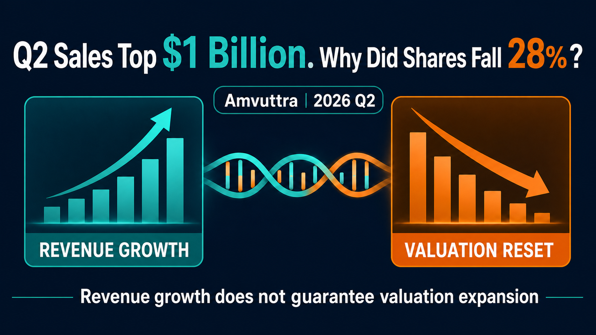
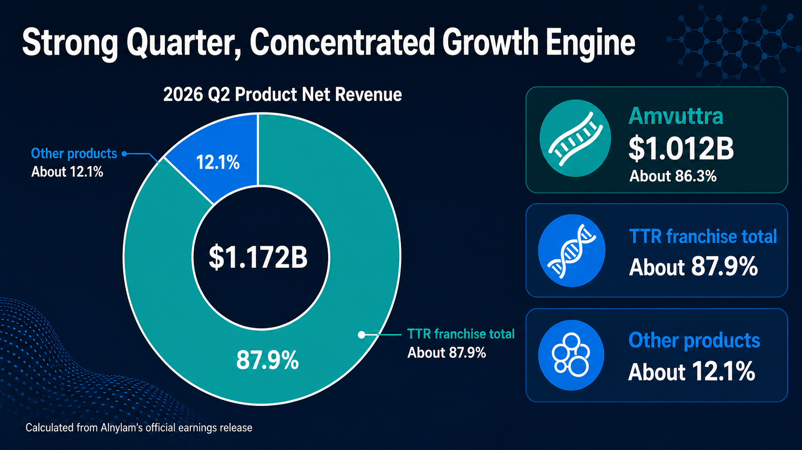
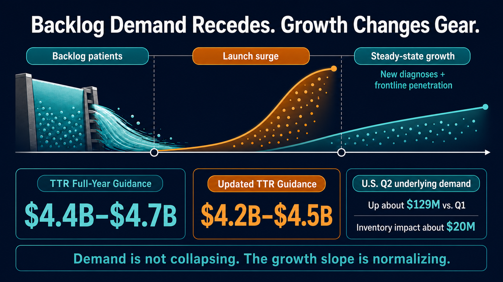
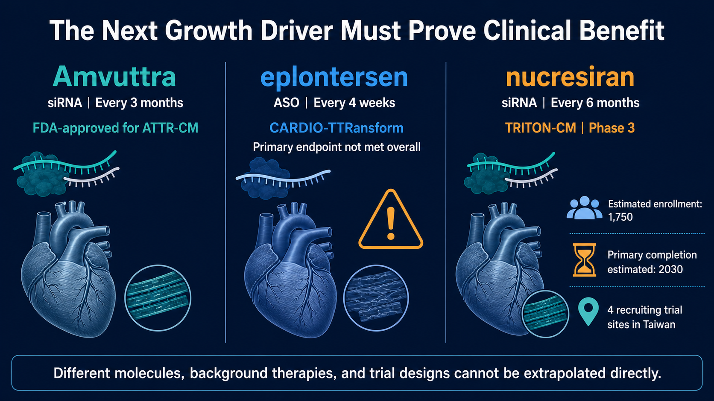

# More Than $1 Billion in One Quarter: Why Did Alnylam Plunge 28%?

*Figure 1. Alnylam and Amvuttra: TTR growth shifts gears.*

---

If a drug generates more than $1 billion in quarterly sales and grows 106% year over year, while its maker delivers $231 million in GAAP operating income in the same quarter, what could the market possibly be seeing when the stock still falls 28.5% in a single day?

On July 30, RNA interference leader Alnylam reported its financial results for the second quarter of 2026. Product net revenues reached $1.172 billion, up 74% year over year. Amvuttra alone generated $1.012 billion for the quarter, while total TTR product revenues came to $1.030 billion. This was not a case of earnings falling apart.

Yet on the same day, the company lowered its 2026 guidance for TTR product revenues from $4.4 billion-$4.7 billion to $4.2 billion-$4.5 billion. At the midpoint, the market lost $200 million from its expected revenue base, an amount equal to less than one-fifth of Amvuttra's revenue in a single quarter. Even so, Nasdaq data show that ALNY closed at $204.84, down from $286.62 the previous day, a one-day decline of approximately 28.5%.

That disconnect is the heart of the story.

The market was not rejecting RNAi technology. It was correcting an assumption: that the release of pent-up demand at the beginning of Amvuttra's launch could be extrapolated indefinitely as a linear growth trajectory. With the next commercial pillar capable of reducing Alnylam's dependence on TTR still not in place, a $200 million guidance reduction was enough to force a recalculation of the entire company's valuation model.

In other words, Alnylam did not suddenly lose its ability to sell. It simply moved from a story in which every quarter was expected to beat expectations into a stage where it must prove the quality and durability of its growth.

*Figure 2. Revenue concentration: Amvuttra accounted for approximately 86.3% of Alnylam's product net revenues in the second quarter of 2026.*

## 01 | Strong Results, but the Bad News Was in the Outlook

Start by breaking down the numbers.

In the second quarter of 2026, Amvuttra generated $1.012 billion in net product revenues for Alnylam, an increase of 106% from the same period a year earlier. Onpattro, another TTR product, contributed $18.46 million. Total TTR product revenues reached $1.030 billion, up 89% year over year. Givlaari and Oxlumo together generated $142 million, bringing company-wide product net revenues to $1.172 billion.

Total revenue for the quarter was $1.291 billion. Alnylam reported GAAP operating income of $231 million and GAAP net income of $164 million; both measures had still been losses in the prior-year period.

What unsettled the market on July 30, therefore, was not the quarter Alnylam had just completed. It was what the company said about the next stretch of the road.

Alnylam acknowledged in its announcement that growth in U.S. demand for Amvuttra among second-line patients had slowed in early 2026 to what the company considered a "normalized" level. The reason was specific. When Amvuttra first launched for cardiomyopathy, there was a group of patients who were already taking TTR stabilizers, whose disease was continuing to progress, and who were waiting for a new treatment. Once the product was approved, those patients moved into treatment in a concentrated wave, releasing a backlog of pent-up demand.

That demand was real, but an equivalent pool of waiting patients does not reappear every year.

At launch, a new drug's revenue curve often benefits from two patient populations at once. The first is the accumulated "stock" of patients who have been waiting for a new therapy over an extended period. The second is the ongoing "flow" of patients who are newly diagnosed each year or who gradually enter treatment. The first group can make the initial launch curve exceptionally steep. The second determines how quickly the product can grow once it reaches a more normal operating state.

Amvuttra is now moving from the first phase to the second.

*Figure 3. Demand shifts from the release of pent-up second-line demand to a normalized flow of newly diagnosed and progressively treated patients.*

This does not mean demand has collapsed. Alnylam disclosed that actual demand for its U.S. TTR business increased by approximately $129 million in the second quarter compared with the first, more than twice the demand increase recorded in the previous quarter. The growth visible in reported revenue was partly offset, however, by approximately $20 million of inventory movement and a modest decline in net price. Even after the guidance reduction, the midpoint of the revised TTR range still represented growth of approximately 75% over 2025.

The problem is that capital markets do not pay only for a company that is "still growing." They pay for whether that growth can repeatedly exceed expectations that are already very high.

When a launch curve has once been steep enough to look like a straight line, a return to normal speed can look like a stall.

## 02 | $200 Million Is Not Much; 86% Concentration Is

Why did a guidance reduction of only $200 million trigger such a severe share-price reaction?

Because Amvuttra has become large enough to stand in for Alnylam as a whole.

Based on the company's second-quarter figures, Amvuttra accounted for approximately 86.3% of total product net revenues, while TTR products together represented approximately 87.9%. Givlaari and Oxlumo are both commercial products, and Alnylam also receives collaboration and royalty revenue from products including Leqvio and Qfitlia. It would be unfair to describe the company as having "only one drug."

But if the question is where the next dollar of growth is primarily coming from, the answer remains heavily concentrated in Amvuttra.

That concentration magnifies several variables tied to a single product into risks at the level of the entire company: the pace of new diagnoses, first-line adoption, reimbursement conditions, inventory, pricing, and competition. In its latest Form 10-Q, Alnylam also identified the concentration of revenue in Amvuttra as a material risk. If the company cannot maintain or expand sales, the effect on its operations could be significant.

It is important to distinguish between "platform value" and "portfolio diversification." They are not the same thing.

Alnylam has already proved that RNAi can travel from a scientific paper to global commercialization. Amvuttra is administered by subcutaneous injection once every three months. Under its FDA label, it can be used in adults with hereditary transthyretin-mediated amyloidosis with polyneuropathy, as well as wild-type or hereditary transthyretin-mediated amyloidosis with cardiomyopathy. This is not a proof-of-concept drug. It has crossed the barriers of approval, reimbursement, physician adoption, and manufacturing at scale.

But owning a mature platform does not mean a company's revenue is automatically diversified.

The scientific risk surrounding RNAi is declining, while Alnylam's portfolio risk remains high. The market's repricing on July 30 was asking a direct question: beyond Amvuttra, when will the next product arrive that can affect the income statement in billions of dollars?

## 03 | Wainua's Phase 3 Miss Should Not Be Rewritten as an RNAi Failure

The part of the original market narrative most vulnerable to overstatement concerns the Phase 3 CARDIO-TTRansform results for eplontersen, marketed as Wainua, from Ionis and AstraZeneca.

The bottom line should be stated first. The study did not meet its primary endpoint, and that does require the market to re-examine how TTR silencers and stabilizers should be used together. But it does not directly support the conclusion that "all TTR silencers are ineffective," much less that Amvuttra itself has failed.

TTR stabilizers and TTR silencers intervene at different points in the disease process.

Stabilizers such as tafamidis and acoramidis, marketed as Attruby, are designed to stabilize the TTR tetramer and reduce its dissociation and subsequent formation of amyloid fibrils. Eplontersen and vutrisiran instead reduce the liver's production of TTR at the RNA level. Eplontersen is an antisense oligonucleotide, while vutrisiran, the active ingredient in Amvuttra, is a GalNAc-conjugated double-stranded small interfering RNA. Both lower TTR, but they differ in molecule, therapeutic platform, dosing, and clinical-study design.

CARDIO-TTRansform enrolled patients with ATTR cardiomyopathy. Its primary endpoint was a composite of cardiovascular death and recurrent cardiovascular events. According to Ionis, 57% of participants were already receiving a stabilizer when the study began, and another 24% started one during the trial. The overall study did not achieve statistical significance.

In the prespecified monotherapy population that was not receiving a stabilizer, the company's announcement reported a nominal hazard ratio of 0.71. By contrast, no effect was observed among patients already taking a stabilizer at baseline. Because the complete data were expected to be presented at the European Society of Cardiology meeting in August 2026, it was too early, based on a topline announcement alone, to treat every subgroup finding as settled.

The real question raised by the result is this: as more patients receive effective standard therapy, a new drug no longer has to prove only that it can lower TTR. It must show that, on top of modern background treatment, it can further reduce death, hospitalization, or functional decline.

Hitting a molecular target, lowering a biomarker, and delivering clinical benefit are still separated by the test of a Phase 3 trial.

This also explains why the market incorporated a competitor's setback into Alnylam's valuation model. It was not because Wainua's result had already invalidated Amvuttra. It was because the future TTR market is becoming more crowded, and every new product must clearly define its place in monotherapy, combination treatment, or sequential therapy.

## 04 | Nucresiran Is Next, but the Market Must Wait for Clinical Evidence, Not a Slogan

The key asset on which Alnylam is betting for the next phase of TTR treatment is nucresiran.

It is also an RNAi therapy, but the company aims to extend dosing to once every six months. The ongoing Phase 3 TRITON-CM trial is a randomized, quadruple-blind, placebo-controlled study. Following a July 23, 2026 update on ClinicalTrials.gov, estimated enrollment stood at 1,750 participants, and the primary endpoint was a composite of all-cause mortality and recurrent cardiovascular events.

This study is not being conducted in a vacuum. Registry information shows that patients may participate while receiving approved stabilizers such as tafamidis or acoramidis, as well as standard heart-failure therapy. Those who have previously used or are currently using another TTR-lowering therapy are excluded. The estimated primary completion date was May 2030.

In other words, if nucresiran is to become the next-generation product, it must prove more than the convenience of one injection every six months. It must deliver hard clinical outcomes on top of contemporary standard treatment.

*Figure 4. The next leg of growth: nucresiran must demonstrate incremental clinical benefit on top of modern background therapy.*

This is the timing gap Alnylam now faces.

The company did have several data catalysts scheduled for the second half of 2026. ALN-HTT02 was expected to report preliminary Phase 1 results in Huntington's disease. ALN-6400 was expected to produce data from a Phase 1 study in healthy volunteers and a Phase 2 study in hereditary hemorrhagic telangiectasia. ALN-2232, an obesity candidate targeting ACVR1C, was also expected to report Phase 1 data. Mivelsiran had entered Phase 2 development in Down syndrome-associated Alzheimer's disease, and the regulatory application for cemdisiran had been accepted for review.

These are important tests of whether the platform can expand. Most, however, remain early clinical, regulatory, or partnership milestones. In the near term, they cannot be treated as equivalent to another Amvuttra generating $1 billion in a single quarter.

Alnylam's expanded collaboration with Inceptive on AI-enabled RNA drug design, and its deeper work with Komodo Health on real-world data analytics, may also improve the efficiency of drug discovery and commercial decision-making. But AI can shorten design and analysis cycles; it cannot replace human clinical trials, nor can it directly eliminate revenue concentration.

The hardest question for Alnylam today is not whether RNAi still has a future. It is whether the next commercial pillar can arrive in time as Amvuttra's growth normalizes.

## 05 | Taiwan Has a Clinical Foothold, but No Evidence of a Direct Beneficiary Stock

This topic should not be forced into a list of "Alnylam concept stocks" merely to tag Taiwanese oligonucleotide, contract development and manufacturing, or diagnostics companies on CMoney.

As of July 31, 2026, publicly available primary sources did not show that any publicly traded Taiwanese company was a raw-material supplier, manufacturer, licensing partner, or commercialization partner for Amvuttra, nucresiran, or Alnylam's TTR products. The scope of the BeOne collaboration disclosed in Alnylam's announcement covered mainland China and Macau. It cannot be rewritten as "Greater China" in order to include Taiwan.

Taiwan's more concrete links are instead found in clinical development and among companies with capabilities adjacent to RNAi.

ClinicalTrials.gov listed TRITON-CM study locations in New Taipei, Taichung, and Taipei. This means Taiwan's medical system is participating directly in a global Phase 3 trial of next-generation TTR RNAi. The work can build experience in patient identification, genetic and imaging diagnosis, heart-failure care, and clinical-trial execution. That is a genuine medical and research role, but it is not an order that can be directly assigned to a Taiwanese stock.

To map the real RNAi positions of Taiwanese public-market companies, it is useful to separate product development, delivery technology, and manufacturing services.

Oneness Biotech (4743) and Microbio (4128) are co-developing the siRNA candidates SNS812 and SNS851 and are participating in a collaboration involving glycan-targeted delivery technology. These are named product, clinical, and delivery roles. But the two companies are working on the same set of jointly developed assets; they should not be counted twice as two separate pipelines. Nor is there any disclosed relationship between those assets and Alnylam or Amvuttra.

IntelliGene (7832; Emerging Stock Board) sits more directly on the RNAi product and delivery side. Information from the Taipei Exchange and the company shows that it is developing the siRNA candidates IG-001 and IG-002, while also investing in lipid nanoparticle and exosome delivery systems. These programs remain in the research and development stage, with indications focused on coronavirus infections and influenza. No public information shows a collaboration or supply relationship with Alnylam or Amvuttra. Including IntelliGene in a map of Taiwan's RNAi landscape is reasonable; describing it as an Amvuttra beneficiary is not.

Genomics (4195) occupies the services side. Its annual report disclosed capabilities in the synthesis and analysis of short-chain nucleic acids and siRNA active pharmaceutical ingredients, as well as contract research, development, and manufacturing organization services. It also participates in an LNP integration collaboration with a Japanese partner. This reflects Taiwan's development of upstream tools and manufacturing capacity for therapeutic nucleic acids. But the company has not disclosed Alnylam as a customer, and it does not separately report revenue from therapeutic siRNA. It therefore cannot be presented as part of Amvuttra's supply chain.

If stocks are tagged for this article, the U.S. names can be identified precisely as Alnylam (NASDAQ: ALNY), Ionis (NASDAQ: IONS), AstraZeneca (NASDAQ: AZN), and BridgeBio (NASDAQ: BBIO). Taiwanese names can include Oneness Biotech (4743), Microbio (4128), IntelliGene (7832, Emerging Stock Board), and Genomics (4195), but both the article and the platform tags must state the same boundary: these companies have capabilities adjacent to RNAi or oligonucleotides and are not disclosed direct beneficiaries of Alnylam. If a platform does not support an Emerging Stock Board ticker, IntelliGene's actual role should remain in the body of the article rather than being replaced with an unrelated stock tag.

For Taiwan's industry, three questions are genuinely worth tracking. Which companies have verifiable oligonucleotide manufacturing and quality systems? Which have entered the supply chains of international pharmaceutical companies? And which can turn ATTR diagnostic and clinical-trial capabilities into durable medical services? Stock tagging should come only after those roles are publicly established.

## 06 | What to Watch Next: Do Not Focus Only on Next Quarter's Revenue

Alnylam's next phase can be tracked through six questions.

First, will "actual demand" in the U.S. TTR business continue to increase, or will reported revenue be driven mainly by inventory and pricing fluctuations?

Second, after the initial backlog of second-line patients dissipates, can newly diagnosed patients and those treated earlier in the disease course take over as the next source of growth?

Third, can the revised $4.2 billion-$4.5 billion guidance be maintained, or will it be adjusted again?

Fourth, will the complete CARDIO-TTRansform data clarify the differences between monotherapy and treatment on a stabilizer background, instead of leaving the market with only the label "Phase 3 failure"?

Fifth, can TRITON-CM prove nucresiran's incremental clinical benefit on top of modern background therapy?

Sixth, can readouts from the early-stage pipeline gradually convert platform value into a second and third genuinely commercializable product?

The first three questions will determine the near-term slope of Alnylam's financial performance. The last three will determine whether Alnylam is ultimately a company with one mega-blockbuster drug or an RNAi platform capable of repeatedly producing new products.

## Conclusion | The Technology Did Not Break; the Valuation Shifted Gears First

The most important point in Alnylam's second-quarter results was neither how frightening a 28% decline looked nor how impressive 106% growth appeared. It was that both figures could be true at the same time.

Amvuttra has proved that RNAi can become a commercial product generating several billion dollars a year. But its share of product net revenues, at more than 86%, also shows that Alnylam's platform value has not yet been fully converted into a diversified product portfolio.

The surge created by patients accumulated before launch was always going to normalize. That is not drug failure. It is a shift in the growth profile that every blockbuster new therapy eventually faces. The real test is whether new diagnoses, first-line adoption, and the next generation of pipeline assets can support the curve as it flattens.

On July 30, the market did not declare RNAi a failure.

It simply reminded Alnylam, with little courtesy, that the science of the platform has passed its test, while the economics of the platform still has another one to take.

---

## References

1. [Alnylam, 2026 Q2 financial results and full-year guidance update](https://investors.alnylam.com/press-release?id=29986)
2. [Alnylam, 2026 Q2 Form 10-Q](https://alnylampharmaceuticalsinc.gcs-web.com/static-files/df2ac46c-f252-4864-97e7-02db276e70db)
3. [U.S. Food and Drug Administration, Amvuttra (vutrisiran) prescribing information](https://www.accessdata.fda.gov/drugsatfda_docs/label/2025/215515s006lbl.pdf)
4. [Ionis, CARDIO-TTRansform topline results](https://ir.ionis.com/node/34896)
5. [U.S. Food and Drug Administration, Attruby approval announcement](https://www.fda.gov/drugs/news-events-human-drugs/fda-approves-drug-heart-disorder-caused-transthyretin-mediated-amyloidosis)
6. [ClinicalTrials.gov, TRITON-CM (NCT07052903)](https://clinicaltrials.gov/study/NCT07052903)
7. [Nasdaq, ALNY historical trading data](https://www.nasdaq.com/market-activity/stocks/alny/historical)
8. [Oneness Biotech, SNS851 Phase 1 and co-development announcement](https://onenessbio.com/en/a-phase-1-clinical-trial-of-sns851-has-been-approved-by-australia-hrec-and-acknowledged-by-australia-tga/)
9. [Microbio, SNS851 co-development announcement](https://www.twmicrobio.com/tw/%E9%87%8D%E5%A4%A7%E8%A8%8A%E6%81%AF-17/)
10. [Genomics, short-chain nucleic acid and siRNA API capabilities (2024 annual report)](https://www.genomics.com.tw/upload/2025_09_11/2_202509111525141hcglwe9Y0.pdf)
11. [Taipei Exchange, IntelliGene (7832) company overview and RNAi/delivery research and development](https://www.tpex.org.tw/storage/emerging_register/2025/04/1745477059_14400_CH_7832.pdf)
12. [IntelliGene, core technologies and IG-001/IG-002](https://www.intelli-gene.com/tech)

Information verified through July 31, 2026 (UTC+8).

## Disclaimer

This article is an overview of biopharmaceutical and industry trends and does not constitute medical diagnosis, treatment, or investment advice. Data from different clinical trials should not be compared directly. Treatment decisions should be made by qualified healthcare professionals based on approved labeling, each patient's individual condition, and the latest clinical evidence.
