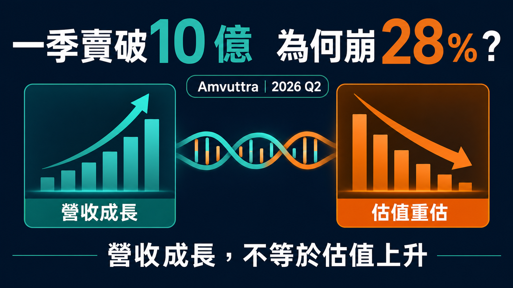
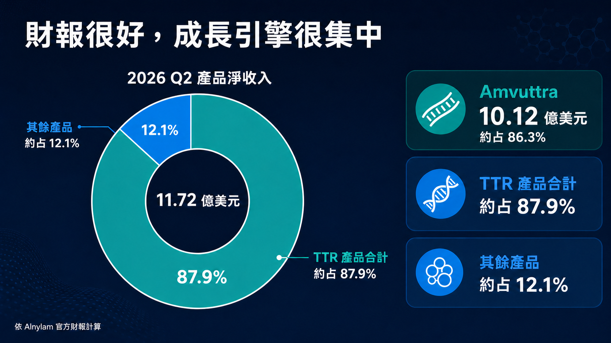
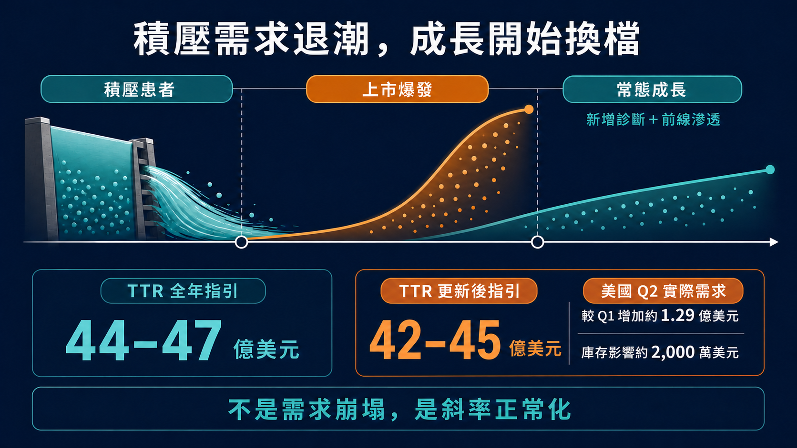
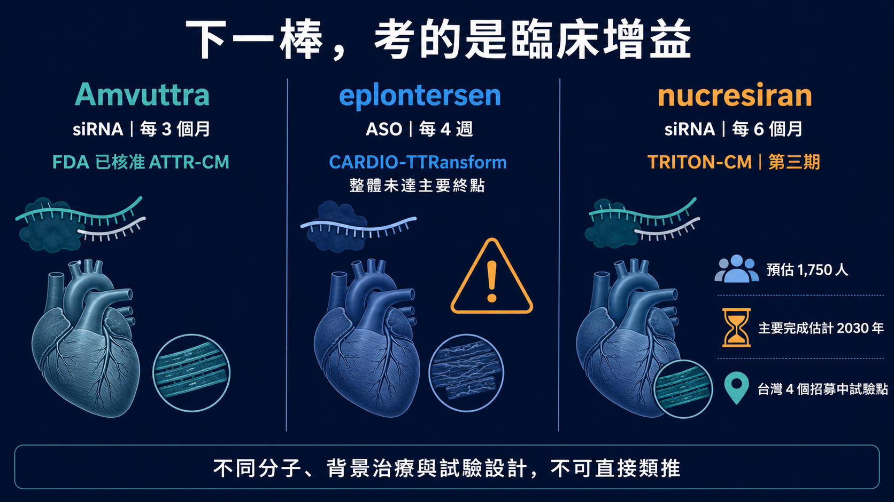

# 一季賣破 10 億，Alnylam 為何崩 28%？

如果一款藥單季賣破 10 億美元、年增 106%，公司同季也交出 2.31 億美元 GAAP 營業利益，股價卻在一天內跌掉 28.5%，市場究竟看見了什麼？

7 月 30 日，RNAi 龍頭 Alnylam 公布 2026 年第二季財報。產品淨收入 11.72 億美元、年增 74%；其中 Amvuttra 單季 10.12 億美元，TTR 產品合計 10.30 億美元。這不是一份「業績暴雷」的成績單。

但同一天，公司把 2026 年 TTR 產品收入指引從 44 億至 47 億美元，下修到 42 億至 45 億美元。以區間中位數計算，市場少掉的是 2 億美元，不到 Amvuttra 一季收入的五分之一；Nasdaq 資料卻顯示，ALNY 收盤從前一日 286.62 美元跌到 204.84 美元，單日下跌約 28.5%。

這個反差才是整件事的核心。

市場砍的不是 RNAi 技術，而是把 Amvuttra 上市初期的積壓需求，錯當成可以永久線性外推的成長斜率。當下一個能分攤 TTR 依賴的商業支柱還沒接上，2 億美元的指引下修，就足以讓整家公司的估值模型重新計算。

換句話說，Alnylam 沒有突然賣不動；它只是從「每一季都要超預期」的故事，進入必須證明成長品質的階段。

*圖 1｜Amvuttra 單季銷售突破 10 億美元，但收入增長並不必然帶來估值擴張。*

## 01｜財報很好，壞消息藏在未來式

先把數字拆開。

2026 年第二季，Alnylam 的 Amvuttra 淨產品收入為 10.12 億美元，比去年同期增加 106%；同屬 TTR 產品的 Onpattro 為 1,846 萬美元，TTR 合計 10.30 億美元、年增 89%。Givlaari 與 Oxlumo 合計 1.42 億美元，讓全公司產品淨收入來到 11.72 億美元。

公司同季總營收為 12.91 億美元，GAAP 營業利益 2.31 億美元、GAAP 淨利 1.64 億美元；去年同期兩項都還是虧損。

所以 7 月 30 日真正讓市場不安的，不是這一季，而是公司對下一段路的說法。

Alnylam 在公告裡坦白指出，美國 Amvuttra 二線患者的需求成長，已在 2026 年初放緩到公司認定的「正常化」水準。原因也很具體：Amvuttra 的心肌病變適應症上市初期，有一批已使用 TTR 穩定劑、疾病仍持續惡化，而且正等待新療法的患者。產品一核准，這群人集中轉入，形成一波積壓需求釋放。

這種需求是真的，卻不會每年重新長出同樣一批。

新藥剛上市時，營收常同時吃到兩種患者：一種是長期累積、等待新療法的「存量」；另一種是之後每年新診斷、或逐步進入治療的「流量」。前者可以把上市曲線拉得很陡，後者才決定產品進入常態後能跑多快。

Amvuttra 現在正從前者切到後者。

這不等於需求崩塌。Alnylam 揭露，美國 TTR 業務第二季相較第一季，實際需求增加約 1.29 億美元，是前一季需求增量的兩倍以上；只是報表上的成長被約 2,000 萬美元庫存變動，以及小幅淨價下降抵銷了一部分。公司下修後的 TTR 指引中位數，仍相當於比 2025 年成長約 75%。

問題是，資本市場買的從來不只「還在成長」，而是成長能不能一再超過已經很高的預期。

當一條上市曲線曾經陡到像直線，後來只是回到正常速度，看起來也會像失速。

*圖 2｜Amvuttra 約占 Alnylam 2026 年第二季產品淨收入 86.3%，TTR 產品合計約占 87.9%。*

## 02｜2 億美元不大，86% 的集中度很大

為什麼指引只少 2 億美元，股價反應會這麼激烈？

因為 Amvuttra 已經大到足以代表 Alnylam。

按公司第二季數字計算，Amvuttra 約占全公司產品淨收入 86.3%，TTR 產品合計占約 87.9%。Givlaari 與 Oxlumo 都是已上市產品，Alnylam 也有 Leqvio、Qfitlia 等合作與權利金收入；把它說成「只有一款藥」並不公平。

但若問下一美元成長主要從哪裡來，答案仍高度集中在 Amvuttra。

這讓一項產品的幾個變數——新診斷速度、一線採用、支付條件、庫存、價格與競品——都會被放大成整家公司層級的風險。公司在最新 10-Q 也把 Amvuttra 的收入集中列為重要風險：若無法維持或擴大銷售，可能對營運造成重大影響。

這裡要分清楚「平台價值」與「產品組合」是兩件事。

Alnylam 已經證明 RNAi 可以從科學論文走到全球商業化；Amvuttra 每三個月皮下注射一次，依 FDA 標籤已可用於成人遺傳型 ATTR 多發性神經病變，以及野生型或遺傳型 ATTR 心肌病變。它不是概念藥，而是已經跨過核准、給付、醫師採用與規模化製造的產品。

但一家公司擁有成熟平台，不代表它的收入已經自然分散。

RNAi 的科學風險正在下降，Alnylam 的組合風險卻仍然很高。7 月 30 日的市場定價，正是在追問：除了 Amvuttra，下一個能用「十億美元」為單位影響財報的產品，何時才會出現？

*圖 3｜積壓患者釋放推高上市初期曲線，後續增長更仰賴新增診斷與前線滲透。*

## 03｜Wainua 三期失利，不能被寫成 RNAi 失效

原始市場敘事裡，最容易被寫過頭的，是 Ionis 與 AstraZeneca 的 eplontersen（Wainua）三期 CARDIO-TTRansform 結果。

先講結論：這項研究沒有達到主要終點，確實會讓市場重新檢查 TTR 沉默劑與穩定劑之間的搭配邏輯；但它不能直接推論為「所有 TTR silencer 都沒用」，更不能直接推論 Amvuttra 失效。

TTR 穩定劑與 TTR 沉默劑處理的是不同環節。

Tafamidis、acoramidis（Attruby）等穩定劑，目標是穩住 TTR 四聚體，減少它解離後形成澱粉樣纖維；eplontersen 與 vutrisiran 則從 RNA 層級降低肝臟製造 TTR。Eplontersen 是反義寡核苷酸；Amvuttra 的成分 vutrisiran 則是 GalNAc 偶聯的雙股 siRNA。兩者都會降低 TTR，分子、作用平台、劑量與臨床設計卻不同。

CARDIO-TTRansform 納入 ATTR 心肌病變患者，主要終點是心血管死亡與反覆心血管事件的複合結果。Ionis 公告顯示，57% 受試者在研究開始時已使用穩定劑，另有 24% 在試驗期間開始使用；整體研究未達統計顯著。

預先設定、未使用穩定劑的單藥族群，公告則報告名目風險比 0.71；相反地，基線已使用穩定劑者沒有觀察到效果。由於完整資料預計在 2026 年 8 月歐洲心臟學會公布，現在還不能只憑一份 topline 公告把所有次族群寫成定論。

這項結果真正提出的問題是：當愈來愈多患者已在使用有效的標準治療，新藥要證明的已不是「能不能降低 TTR」，而是「在現代背景治療上，還能不能把死亡、住院或功能惡化再往下推」。

命中標的、生物標誌下降與臨床獲益，中間仍隔著一張三期考卷。

這也解釋了市場為什麼會把競品的失利，納入 Alnylam 的估值模型。不是因為 Wainua 的結果已否定 Amvuttra，而是未來 TTR 市場愈來愈擁擠，每一個新產品都要說清楚自己在單用、聯合或序貫治療中的位置。

## 04｜下一棒 nucresiran，要等的是臨床而不是口號

Alnylam 為 TTR 下一階段押注的關鍵資產，是 nucresiran。

它同樣是 RNAi 療法，但公司希望把給藥頻率拉長到每六個月一次。正在進行的第三期 TRITON-CM，是一項隨機、四盲、安慰劑對照研究；ClinicalTrials.gov 在 2026 年 7 月 23 日更新後，預估收案 1,750 人，主要終點為全因死亡與反覆心血管事件的複合結果。

這項試驗不是在真空環境裡跑。登錄資料顯示，患者可以在 tafamidis 或 acoramidis 等核准穩定劑，以及心衰竭標準治療的背景下參與；曾經或目前使用其他 TTR-lowering therapy 者則被排除。主要完成時間目前估計在 2030 年 5 月。

換言之，nucresiran 若要成為下一代產品，必須證明的不只是半年打一針很方便，還要在當代標準治療上拿出硬臨床結果。

這正是 Alnylam 的時間差。

2026 年下半年，公司確實有多個資料節點：ALN-HTT02 預計公布亨丁頓舞蹈症一期初步結果；ALN-6400 將有健康受試者一期與遺傳性出血性微血管擴張症二期資料；靶向 ACVR1C 的肥胖症候選藥 ALN-2232 也預計讀出一期資料。Mivelsiran 已在唐氏症相關阿茲海默症啟動二期，cemdisiran 的監管申請也已獲受理。

這些是平台能否擴張的重要證據，卻多半仍是早期臨床、監管或合作節點，不能在短期內等同另一個單季十億美元的 Amvuttra。

公司與 Inceptive 擴大 AI RNA 藥物設計合作、與 Komodo Health 深化真實世界資料分析，也可能提高發現與商業決策效率。但 AI 可以縮短設計與分析，不能替代人體試驗，更不能直接填補收入集中。

Alnylam 現在最難回答的，不是「RNAi 還有沒有未來」，而是下一個商業支柱能否在 Amvuttra 成長正常化後及時接上。

*圖 4｜nucresiran 的真正考題，是在現代背景治療上證明額外臨床獲益。不同分子與試驗設計不可直接類推。*

## 05｜台灣有臨床座標，沒有直接受惠股證據

這個題目不能為了 CMoney 標股，就硬把台灣寡核苷酸、CDMO 或檢測公司全部塞成「Alnylam 概念股」。

截至 2026 年 7 月 31 日，公開一級資料沒有顯示台灣公開市場公司是 Amvuttra、nucresiran 或 Alnylam TTR 產品的原料、製造、授權或商業化夥伴。Alnylam 這次公告的 BeOne 合作範圍是中國大陸與澳門，也不能自行擴寫成「大中華區」而把台灣納入。

台灣目前較具體的連結，反而在臨床端與「RNAi 能力相鄰」公司。

ClinicalTrials.gov 列出的 TRITON-CM 台灣試驗地點涵蓋新北、台中與台北。這代表台灣醫療體系實際參與下一代 TTR RNAi 的全球三期試驗，能累積患者辨識、基因／影像診斷、心衰照護與臨床執行經驗；它是一個真實的醫療與研發角色，但不是一張可以直接標記的台股訂單。

若要看台灣公開市場公司的真實 RNAi 座標，可以分成產品、遞送與製造服務端。

合一（4743）與中天（4128）共同開發 siRNA 候選藥 SNS812、SNS851，並參與醣靶向遞送技術合作。這是具名產品、臨床與遞送角色；但兩家公司對應的是同一組共同開發資產，不能重複算成兩套管線，也與 Alnylam／Amvuttra 沒有已揭露關係。

智新生技（7832，興櫃）則更直接站在 RNAi 產品與遞送技術端。櫃買中心及公司資料顯示，智新正在開發 siRNA 候選藥 IG-001、IG-002，並投入 LNP 與外泌體遞送系統；目前仍屬研發階段，適應症集中在冠狀病毒感染與流感，也沒有公開資料顯示它與 Alnylam／Amvuttra 有合作或供應關係。把它納入台灣 RNAi 版圖是合理的，把它寫成 Amvuttra 受惠股則不合理。

基米－創（4195）則在服務端。公司年報揭露短鏈核酸與 siRNA 原料藥的合成、分析與 CRDMO 能力，並參與日本夥伴的 LNP 整合合作。它反映台灣正在建立治療性核酸的上游工具與製造能力；但公司沒有揭露 Alnylam 是客戶，也沒有把治療用 siRNA 的營收單獨拆出，不能寫成 Amvuttra 供應鏈。

所以這篇若標股票，美股可以精準標記 Alnylam（NASDAQ：ALNY）、Ionis（NASDAQ：IONS）、AstraZeneca（NASDAQ：AZN）與 BridgeBio（NASDAQ：BBIO）；台灣標的可列合一（4743）、中天（4128）、智新生技（7832，興櫃）與基米－創（4195），但文章與平台標記都必須同步寫明「RNAi／寡核苷酸能力相鄰，非 Alnylam 直接受惠」。若平台不支援興櫃代號，正文仍保留智新的真實角色，不得改掛其他股票。

對台灣產業真正值得追的，是三件事：誰有可驗證的寡核苷酸量產與品質系統、誰進入國際藥廠供應鏈、誰能把 ATTR 的診斷與臨床試驗能力轉成長期醫療服務。等角色公開落地，再談標股。

## 06｜接下來，不要只盯下一季營收

Alnylam 的下一階段，可以用六個問題追蹤：

第一，美國 TTR 的「實際需求」是否持續增加，還是報告收入主要受庫存與價格擾動？

第二，上市初期的二線積壓需求退去後，新診斷與較前線患者能否接棒？

第三，42 億至 45 億美元的新指引能否守住，還會不會再次調整？

第四，CARDIO-TTRansform 完整資料能否說清楚單用與穩定劑背景下的差異，而不是只剩一個「三期失敗」標籤？

第五，TRITON-CM 能否在現代背景治療上證明 nucresiran 的臨床增益？

第六，早期管線讀出能否逐步把平台價值，變成第二、第三個真正可商業化的產品？

這六題裡，前三題決定近期財報斜率；後三題決定 Alnylam 究竟是一家擁有一支超級重磅藥物的公司，還是一個能不斷複製產品的 RNAi 平台。

## 結語｜技術沒有暴雷，估值先換檔

Alnylam 第二季最值得看的，不是 28% 跌幅有多嚇人，也不是 106% 成長有多漂亮，而是兩個數字同時成立。

Amvuttra 已經證明 RNAi 可以長成一年數十億美元的商業產品；但它在產品收入裡占比超過 86%，也說明 Alnylam 的平台價值，還沒有完全轉成分散的產品組合。

上市初期積壓患者帶來的爆發，終究會回到常態。這不是藥物失效，而是每一款重磅新藥都會經過的成長換檔。真正的考驗，是公司能不能讓新增診斷、一線採用與下一代管線，接住那條變平的曲線。

7 月 30 日，市場沒有宣判 RNAi 失敗。

它只是很不客氣地提醒 Alnylam：平台科學已經及格，平台經濟還要再考一次。

---

## 參考資料

1. [Alnylam｜2026 Q2 財務結果與全年指引更新](https://investors.alnylam.com/press-release?id=29986)
2. [Alnylam｜2026 Q2 Form 10-Q](https://alnylampharmaceuticalsinc.gcs-web.com/static-files/df2ac46c-f252-4864-97e7-02db276e70db)
3. [FDA｜Amvuttra（vutrisiran）處方標籤](https://www.accessdata.fda.gov/drugsatfda_docs/label/2025/215515s006lbl.pdf)
4. [Ionis｜CARDIO-TTRansform topline 結果](https://ir.ionis.com/node/34896)
5. [FDA｜Attruby 核准公告](https://www.fda.gov/drugs/news-events-human-drugs/fda-approves-drug-heart-disorder-caused-transthyretin-mediated-amyloidosis)
6. [ClinicalTrials.gov｜TRITON-CM（NCT07052903）](https://clinicaltrials.gov/study/NCT07052903)
7. [Nasdaq｜ALNY 歷史交易資料](https://www.nasdaq.com/market-activity/stocks/alny/historical)
8. [合一｜SNS851 一期與共同開發公告](https://onenessbio.com/en/a-phase-1-clinical-trial-of-sns851-has-been-approved-by-australia-hrec-and-acknowledged-by-australia-tga/)
9. [中天｜SNS851 共同開發公告](https://www.twmicrobio.com/tw/%E9%87%8D%E5%A4%A7%E8%A8%8A%E6%81%AF-17/)
10. [基米｜短鏈核酸與 siRNA API 能力（2024 年報）](https://www.genomics.com.tw/upload/2025_09_11/2_202509111525141hcglwe9Y0.pdf)
11. [櫃買中心｜智新生技（7832）公司概況與 RNAi／遞送研發](https://www.tpex.org.tw/storage/emerging_register/2025/04/1745477059_14400_CH_7832.pdf)
12. [智新生技｜核心技術與 IG-001／IG-002](https://www.intelli-gene.com/tech)

資料查證截止：2026-07-31（UTC+8）。

## 免責聲明

本文僅為生技醫藥與產業趨勢整理，不構成醫療診斷、治療或投資建議。跨試驗數據不可直接比較；患者用藥應由專業醫療團隊依核准標籤、個別病況與最新臨床證據判斷。
