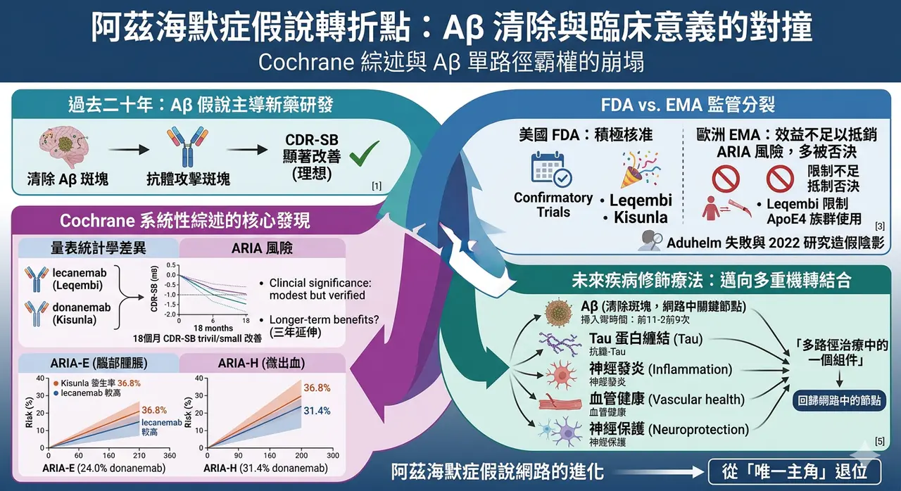
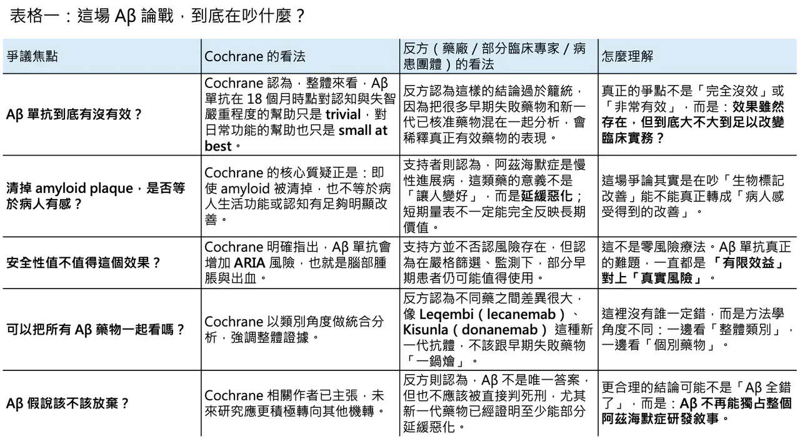
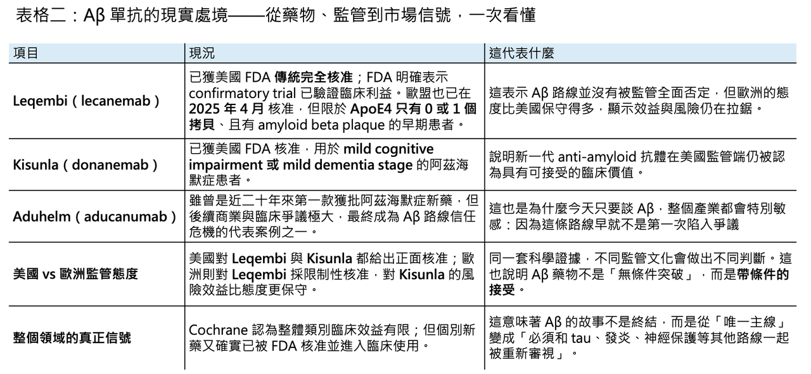

# 阿茲海默症20年來的假說開始崩盤？

【阿茲海默症的 Aβ 信仰，真的開始崩了嗎？】

📌 4 月 16 日，一篇來自 Cochrane 的系統性綜述，再次把阿茲海默症領域最核心、也最具爭議的主軸，推回風暴中心。這份綜述的訊息極其刺耳：對輕度認知障礙（MCI）或輕度失智的阿茲海默症患者而言，amyloid-beta targeting monoclonal antibodies 在 18 個月時點對認知功能與失智嚴重程度的改善只是 trivial，對日常功能的幫助也僅是 small at best；相對地，卻會增加 amyloid-related imaging abnormalities（ARIA），也就是腦部腫脹與微小出血的風險。更直接地說，就算這些藥真的把腦中的 amyloid 清掉了，患者未必能換到足夠有感的臨床利益。

這不是一篇邊角料式的評論，而是一份系統性綜述。作者群納入了 17 項隨機對照試驗、共 20,342 名受試者，評估的不是單一藥物，而是整個 anti-amyloid antibody 類別，涵蓋 aducanumab、bapineuzumab、crenezumab、donanemab、gantenerumab、lecanemab、ponezumab、remternetug、solanezumab 等多個世代的 Aβ 單株抗體。也正因為它不是在談某一個藥，而是在談整個類別，所以這份報告一出，衝擊的不只是幾檔藥的銷售，而是整個阿茲海默症藥物研發二十多年來最重要的理論支柱。Cochrane 甚至在結論中直接寫出：未來疾病修飾療法的研究，應更積極轉向其他作用機轉。

真正讓這場爭論瞬間升溫的，不只是 Cochrane 的語氣夠重，而是它碰到的是一條已經不只是學術假說，而是產業事實的路線。Aβ 假說自 1991 年被提出後，幾乎形塑了整個阿茲海默症新藥研發的方向；直到今天，它仍是已核准疾病修飾療法背後最核心的生物學邏輯之一。換句話說，這不是一場純學院內部的機制辯論，而是一場牽動監管、資本、支付、臨床與病人期待的全面對撞。

## 01｜為什麼這份報告像一份「宣判書」？

🧠 因為它挑戰的，正是過去二十多年來整個領域最核心的信念：清除 amyloid plaque，是否真的能改變阿茲海默症的病程？ Cochrane 的答案很接近「不夠」。它並不是否認所有藥物都沒有任何統計學差異，而是指出，從整體證據來看，這些差異在 18 個月的觀察時點，還不足以構成大多數患者能真切感受到的臨床改變。這裡的關鍵詞不是 “no effect”，而是 “no clinically meaningful effect”。也就是說，問題不在於量表上有沒有變化，而在於這種變化，是否足以改變病人和家屬的真實生活。

這個結論之所以刺耳，是因為 anti-amyloid 單抗並不是沒有代價。Cochrane 明白指出，這類藥物會提高 ARIA 的風險，包括腦水腫與微出血。從藥理學上看，這並不令人意外：當你快速、大量地移除腦內 amyloid，血管與腦組織就可能付出代價。問題在於，如果藥物帶來的是 MRI 上看得見、患者卻不一定換得到足夠實質利益的風險，那整個風險效益比就會被重新檢視。這也是為什麼這篇綜述一出，許多人會把它解讀成對 Aβ 假說的一記重錘。

## 02｜但這不是故事的全部：為什麼藥廠、臨床醫師與病患團體立刻反擊？

⚖️ 因為 Cochrane 的做法，碰到了一個 anti-amyloid 領域最敏感的爭點：能不能把不同世代、不同強度、不同失敗原因的藥，全部打包成一個「類別結論」？ Alzheimer’s Research UK 很快就指出，這份綜述雖然納入了 lecanemab 與 donanemab，但相當大一部分證據其實來自較早期、後來已被放棄的失敗藥物。換句話說，反方的核心意見不是說 Cochrane 造假，而是說它把「舊世代低效或失敗的 anti-amyloid 藥」和「已經在第三期試驗中打出統計學顯著結果、並完成監管核准的新藥」混在一起分析，最後得到一個對整個類別都過於悲觀的印象。

這個反擊之所以站得住腳，是因為 lecanemab 和 donanemab 的確不是空手而來。Leqembi（lecanemab）在 Clarity AD 試驗中，18 個月時於 CDR-SB 的調整後差值為 -0.45，相當於 27% 的臨床惡化減緩；FDA 也因此在 2023 年將它從加速核准轉為傳統完全核准，並明言 confirmatory trial 已驗證臨床利益。Kisunla（donanemab）則在 TRAILBLAZER-ALZ 2 中，於 76 週在 iADRS 與 CDR-SB 都達到統計顯著差異，FDA 於 2024 年核准用於 MCI 或輕度失智階段的阿茲海默症。也就是說，若把問題換成「這兩款新世代藥物是否完全沒有效果」，答案其實不是。

但另一邊也不能假裝安全性不是問題。以 donanemab 為例，在 JAMA 發表的 TRAILBLAZER-ALZ 2 中，任何 ARIA 的發生率為 36.8% vs 14.9%，其中 ARIA-E 為 24.0% vs 2.1%，ARIA-H 為 31.4% vs 13.6%。這正是 anti-amyloid 支持者最難迴避的現實：你可以主張這些藥不是沒效，但你很難再說它們是「乾淨而輕鬆」的治療。也因此，今天真正的爭論其實不是「有沒有效」這麼二分，而是：這種效果，到底值不值得用這樣的風險與醫療資源去換？

更複雜的是，「臨床意義」本身就不是一個全世界已有共識答案的詞。Alzheimer’s Research UK 直接指出，目前其實並沒有 universally agreed definition 來界定什麼才叫 clinically meaningful；而對家屬來說，哪怕只是多爭取幾個月相對穩定、能保持自主性的時間，都可能非常重要。也就是說，Cochrane 抓到的是一個很硬的實證醫學問題，但反方抓到的，則是一個同樣真實的臨床與照護問題。這兩種語言，不一定會自然對齊。

## 03｜其實，Aβ 路線的信任危機，早就不是今天才開始

🧩 如果今天的爭議只來自 Cochrane，那這場風暴不會這麼大。真正的背景是：Aβ 這條路線在過去幾年，已經歷經了太多折返、太多創傷，也太多讓外界難以忘記的事件。

最具代表性的，當然還是 Aduhelm（aducanumab）。這款藥在 2021 年獲 FDA 加速核准時，就因臨床證據爭議而掀起巨大風暴；當年 FDA 諮詢委員會對其效益採取近乎一面倒的反對態度，之後更引發多名委員辭職。到了 2024 年 1 月，Biogen 宣布停止 Aduhelm 的開發與商業化，並終止 ENVISION confirmatory study，將資源轉往 Leqembi 與其他 tau 相關資產。公司雖強調此決定「不是基於安全性或有效性疑慮」，但在產業敘事上，Aduhelm 幾乎已成為 Aβ 路線最深的一道裂痕。

另一層更深的陰影，則來自基礎研究信任本身。2022 年開始，2006 年一篇聚焦 Aβ56 的知名研究，因影像操弄與數據可靠性問題遭到嚴重質疑，之後更走向撤稿程序。這起事件無疑重傷了外界對 amyloid 領域部分基礎文獻的信心，但它也沒有徹底摧毀整個 Aβ 假說。包括 Alzheimer’s Society 在內的多方都強調，Aβ56 只是 amyloid 生物學裡很小的一塊，並不等於整個 amyloid 與 Alzheimer’s disease 的關聯都被推翻。這也是今天這場論戰最容易被簡化、卻最不能被簡化的地方：Aβ 研究有過度延伸、也有誤判與醜聞，但這不代表所有 amyloid biology 都是錯的。

## 04｜真正的分水嶺，其實寫在監管端：FDA 與歐洲看的是同一份資料，卻做出不同判斷

🏛️ 如果 anti-amyloid 的證據真的那麼清楚，今天全球監管不會出現這麼分裂的畫面。

美國 FDA 的立場相對積極。它先在 2023 年給了 Leqembi（lecanemab）傳統完全核准，並明確表示 confirmatory trial 已驗證臨床利益；接著又在 2024 年核准 Kisunla（donanemab）。從 FDA 的語氣來看，它接受的核心邏輯是：對早期阿茲海默症患者而言，這類藥物雖不是逆轉疾病，但已足以被視為首批真正 touching the underlying disease process 的療法。

但歐洲的態度明顯更保守。Leqembi 在 2024 年 7 月先被 CHMP 否決，理由正是「延緩退化的幅度不足以抵銷嚴重腦水腫風險」；直到 re-examination 後，EMA 才於 2024 年 11 月改為支持在限制族群中使用，也就是僅限 ApoE4 只有 0 或 1 個拷貝、且有 amyloid beta plaque 的早期患者，歐盟執委會並於 2025 年 4 月正式核准。相較之下，Kisunla（donanemab）到了 2025 年 3 月仍遭 EMA 拒絕，理由同樣是效益不足以抵銷嚴重腦腫脹風險。這說明了一件很現實的事：同一份科學證據，在不同監管文化與風險容忍度下，可能得到完全不同的政策答案。

這也讓今天的爭議更像是一場「效益到底要大到什麼程度，才算足以改變臨床實務」的戰爭，而不只是單純的機制之爭。FDA 願意為 modest but verified benefit 開一扇門；歐洲則更強調風險效益比，且把安全族群切得更窄。對藥廠來說，這意味著 anti-amyloid 已不再是只要把 plaque 清乾淨就夠，而是必須同時回答：哪些患者最可能受益、哪些患者風險最高、何時介入才最合理。

## 05｜所以，Aβ 假說該被放棄嗎？

🔍 我會說，Aβ 作為阿茲海默症唯一主線的時代，確實已經結束；但 Aβ 作為疾病網路中的一個關鍵節點，還沒有被判死刑。

這正是今天這場爭論最應該留下來的結論。Cochrane 把過去產業不願正視的問題，直接攤在陽光下：把 amyloid 清掉，不等於自動換來足夠大的臨床利益；而 anti-amyloid drugs 帶來的風險、監測負擔與成本，也不能再被「終於有藥了」這種情緒掩蓋。這是一記必要的重錘。

但若因此直接宣告「Aβ 假說已死」，也同樣過頭。因為今天至少已經有 lecanemab 與 donanemab 這兩款藥，在嚴格篩選的早期患者中證明了疾病進程可以被拉慢；支持者也提出，18 個月可能仍太短，較長期的延伸追蹤或真實世界資料，或許更能看出這類 disease-modifying therapy 的累積效果。Eisai 在 2024 年公布的延伸資料就主張，lecanemab 連續三年治療後，CDR-SB 的分離幅度持續擴大；Alzheimer’s Research UK 也明言，較長期證據可能顯示 modest but sustained benefits，而這些新資料並未完整反映在 Cochrane 的分析裡。這些主張未必已經蓋棺定論，但至少說明，anti-amyloid 的故事還沒講完。

更重要的是，整個領域其實早就已經往「Aβ 不是全部答案」的方向移動。Alzheimer’s Society 早在討論 Aβ*56 爭議時就說得很清楚：現在大家愈來愈相信，真正驅動阿茲海默症的，不只是 amyloid，還包括 tau、inflammation、blood vessel health 等多重機制。也就是說，未來最有可能成功的，不會是一顆單純把 amyloid 清掉的 magic bullet，而更可能是更早期介入、做更準的病人分型，甚至把 anti-amyloid 與 anti-tau、抗發炎或神經保護策略結合。這不代表 Aβ 白做了，而是代表它必須從「唯一主角」退位成「多路徑治療中的一個組件」。

阿茲海默症研發從來就不是一條直線。今天 Cochrane 的這份報告，不是最終判決，而是一次強迫全產業重新誠實面對證據的時刻。它逼著支持者承認：清 plaque 不是萬靈丹；也逼著反對者承認：至少有些新一代 anti-amyloid drugs，確實已經把「完全無法改變病程」這個舊認知往前推了一步。真正崩塌的，也許不是 Aβ 本身，而是那種信仰式、單一路徑式的 Aβ 霸權。接下來十年，阿茲海默症領域最需要的，恐怕不再是「要不要相信 Aβ」，而是怎麼把 Aβ 放回它真正該在的位置上。

------------

參考資料：

[0]:公開資料＆各公司官網

[1]:

Are medicines (anti-amyloid monoclonal antibodies) that reduce the build-up of abnormal proteins in the brain an effective treatment for people with mild cognitive impairment or mild dementia due to Alzheimer’s disease, and do they cause unwanted effects?

https://www.cochrane.org/evidence/CD016297_are-medicines-anti-amyloid-monoclonal-antibodies-reduce-build-abnormal-proteins-brain-effective

www.cochrane.org

"Are medicines (anti-amyloid monoclonal antibodies) that reduce the build-up of abnormal proteins in the brain an effective treatment for people with mild cognitive impairment or mild dementia due to Alzheimer’s disease, and do they cause unwanted effects? | Cochrane"

[2]:

Explaining the amyloid research study controversy | Alzheimer's Society

Allegations have been made about a research study investigating amyloid protein build up in the brains of people living with Alzheimer’s disease. Here we explore and explain the controversy.

www.alzheimers.org.uk

"Explaining the amyloid research study controversy | Alzheimer's Society"

[3]:

Leaders in the dementia field react to a report with ‘major limitations’ labelling Alzheimer’s drugs as ineffective - Alzheimer's Research UK

A new report suggests that anti-amyloid drugs are ineffective at slowing dementia symptoms. Read more to find out what the research shows.

www.alzheimersresearchuk.org

"Leaders in the dementia field react to a report with ‘major limitations’ labelling Alzheimer’s drugs as ineffective - Alzheimer's Research UK"

[4]:

New Clinical Data Demonstrates Three Years of Continuous Treatment with Dual-Acting LEQEMBI® (lecanemab-irmb) Continues to Significantly Benefit Early Alzheimer’s Disease Patients Presented at AAIC 2024 | News ReleaseNews Release：2024 | Eisai Co., Ltd.

Eisai's news release New Clinical Data Demonstrates Three Years of Continuous Treatment with Dual-Acting LEQEMBI® (lecanemab-irmb) Continues to Significantly Benefit Early Alzheimer’s Disease Patients Presented at AAIC 2024 is posted.

www.eisai.com

"New Clinical Data Demonstrates Three Years of Continuous Treatment with Dual-Acting LEQEMBI® (lecanemab-irmb) Continues to Significantly Benefit Early Alzheimer’s Disease Patients Presented at AAIC 2024 | News ReleaseNews Release：2024 | Eisai Co., Ltd."

[5]:

Trial of Donanemab in Early Symptomatic Alzheimer Disease

This randomized clinical trial examines the efficacy and adverse effects of donanemab, a monoclonal antibody designed to clear brain amyloid plaque, among patients with early symptomatic Alzheimer disease.

jamanetwork.com

"Donanemab in Early Symptomatic Alzheimer Disease: The TRAILBLAZER-ALZ 2 Randomized Clinical Trial | Trials | JAMA | JAMA Network"

本文僅供產業研究與知識分享，不構成投資、醫療、募資或個股建議。
