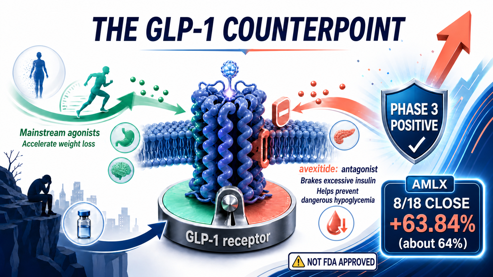
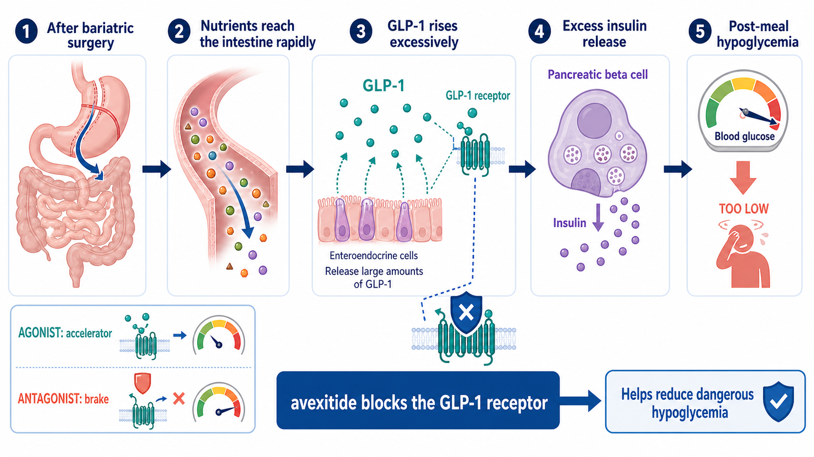
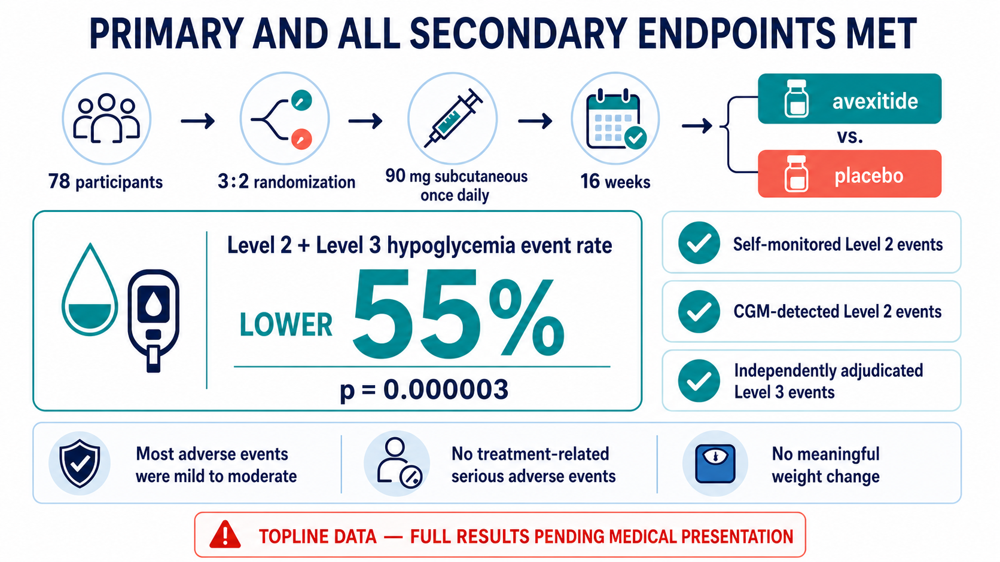
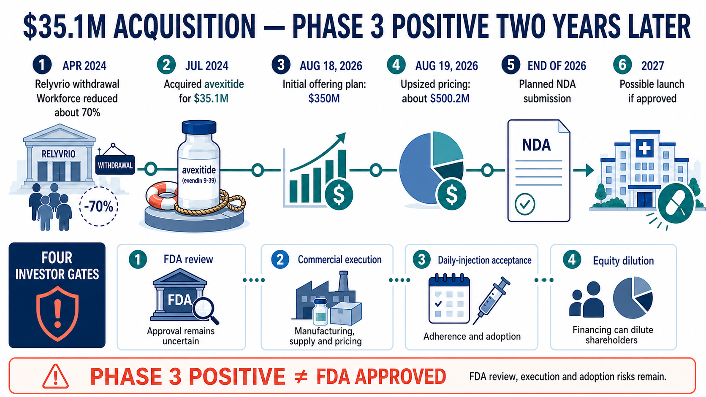

# Avexitide Reduced the Composite Rate of Level 2/3 Hypoglycemia Events by 55%—and Repriced Amylyx Overnight

Bariatric surgery can produce durable weight loss, yet some patients later face a disturbing paradox: eating a meal can send their blood glucose low enough to cause confusion, loss of consciousness or a seizure.

Amylyx Pharmaceuticals is trying to treat that condition with avexitide, a drug that moves in the opposite direction from the GLP-1 medicines now reshaping obesity care. Rather than activating the GLP-1 receptor, avexitide blocks it. In the Phase 3 LUCIDITY trial, the combined rate of Level 2 and Level 3 hypoglycemic events was 55% lower with avexitide than with placebo. Amylyx shares rose about 64% on the day the topline result was announced.

The result is important, but the boundaries are equally important. Avexitide is not approved by the U.S. Food and Drug Administration. Amylyx has released topline data, not a full peer-reviewed dataset. Absolute event rates, confidence intervals, long-term safety, manufacturing, regulatory review and commercial uptake still need to be established.

## 01 | Why Can a Successful Bariatric Procedure Make a Meal Dangerous?

Understanding the disease explains why this drug moves against the direction of the mainstream GLP-1 market.

Bariatric surgery can help people with severe obesity improve weight and metabolic disease. A subset of patients, however, develops post-bariatric hypoglycemia, or PBH, months or years after surgery.

After a meal, nutrients can reach the small intestine unusually quickly. The gut releases a large amount of glucagon-like peptide-1, or GLP-1. Under normal conditions, GLP-1 signals the pancreas to release insulin and helps bring post-meal glucose back down. In PBH, the response is excessive. Insulin acts like a brake pushed too hard, and glucose falls rapidly.

Milder episodes can cause palpitations, sweating, tremor, dizziness and weakness. In severe episodes, the brain does not receive enough glucose. A patient may become confused, lose cognitive function, lose consciousness or have a seizure. The unpredictable nature of these events can make people afraid to drive alone, care for children or even eat without another person nearby.

The best-known medicines in the GLP-1 class—including semaglutide and tirzepatide—use GLP-1 signaling to reduce appetite and improve glycemic control. Avexitide is a GLP-1 receptor antagonist. Its objective is to temporarily block excessive GLP-1 signaling, reduce inappropriate insulin secretion and prevent post-meal glucose from collapsing.

The same biological pathway can support opposite therapeutic strategies in different diseases. One program steps on the signal; the other releases it. Avexitide is therefore a useful counterpoint to the conventional GLP-1 investment narrative.

## 02 | Why Did a 78-Patient Phase 3 Trial Move the Market So Much?

LUCIDITY was a multicenter, randomized, double-blind, placebo-controlled Phase 3 trial conducted at 21 U.S. centers. It enrolled 78 adults who had developed PBH after Roux-en-Y gastric bypass surgery.

Participants were randomized three to two to receive a once-daily 90 mg subcutaneous injection of avexitide or placebo for 16 weeks. The primary endpoint was the combined rate of Level 2 and Level 3 hypoglycemic events.

Level 2 hypoglycemia generally refers to glucose below 54 mg/dL, a threshold that requires prompt action. Level 3 is defined by severity rather than one glucose value: the patient is impaired enough to need help from another person. For someone living with PBH, preventing one such event can mean avoiding a fall, a traffic accident, an emergency-department visit or loss of consciousness.

Amylyx reported that avexitide reduced the combined event rate by 55% versus placebo, with a p value of 0.000003. The company also said that every secondary endpoint was met, including Level 2 events documented through self-monitored blood glucose, Level 2 events detected by continuous glucose monitoring and independently adjudicated Level 3 events.

Most adverse events were described as mild to moderate. Amylyx reported no serious adverse events related to avexitide treatment. The most common events were diarrhea, injection-site erythema and bruising. Neither arm showed a change in body weight over the 16-week treatment period.

That last point matters because blocking GLP-1 could intuitively raise concern about weight regain. The short trial did not show a weight difference, but sixteen weeks does not answer the long-term question. An open-label extension is ongoing, and the complete dataset is expected to be presented at a medical meeting.

This is a strong topline result. It is not yet a complete paper.

The release did not provide each arm's absolute event rate, the distribution of treatment effects or confidence intervals. It therefore cannot show whether a small subgroup captured most of the benefit or whether another subgroup did not respond. The p value is compelling, but clinical interpretation still requires the full data.

## 03 | The More Dramatic Turnaround Belongs to Amylyx Itself

Viewed in isolation, avexitide is a rare endocrine-disease asset with a positive Phase 3 trial. Viewed from 2024, it looks like a distressed-asset decision made when Amylyx had very few comfortable options.

Amylyx entered the amyotrophic lateral sclerosis market with Relyvrio. In March 2024, however, the global Phase 3 PHOENIX trial failed to meet its prespecified primary and secondary endpoints. In April, the company announced that it had begun the process of voluntarily removing the U.S. and Canadian marketing authorizations. New patients could no longer start treatment, and Amylyx restructured, reducing its workforce by about 70%.

This was not an ordinary pipeline setback. The company's commercial revenue source disappeared.

Three months later, Amylyx acquired avexitide. Company disclosures and U.S. securities filings describe $35.1 million in cash consideration, plus specified cure costs and assumed liabilities. The acquired assets included patents, regulatory materials, contracts and certain drug materials. Amylyx also assumed obligations tied to future sales.

The transaction resembles a distressed purchase not because the asset was necessarily cheap, but because both sides were under pressure. Seller Eiger BioPharmaceuticals was in bankruptcy proceedings, while Amylyx had just suffered its own commercial collapse. A Phase 3-ready asset with several completed Phase 2 studies and FDA Breakthrough Therapy designation changed hands when neither company had room for leisurely capital allocation.

In retrospect, paying $35.1 million for an asset that later produced a positive Phase 3 result looks dramatic.

It would still be wrong to say that Amylyx bought a commercial medicine for $35.1 million. The company subsequently funded Phase 3 development, manufacturing, regulatory work and launch preparation. If review is delayed, the label is narrow, payer access is weak or uptake disappoints, the acquisition price will have been only a small part of the total investment.

## 04 | Beyond the 64% Share-Price Move, Amylyx Immediately Raised Capital

On the day the data were announced, Amylyx closed at $35.11, up 63.84% from $21.43 in the prior session. Trading volume rose from roughly 1.25 million shares to approximately 23.95 million.

The company did not simply celebrate the revaluation. It went directly to the capital market.

On August 18, Amylyx initially announced a proposed $350 million public offering of common stock. When the offering was priced on August 19, the company increased the size to 14.09 million shares at $35.50 per share, for expected gross proceeds of approximately $500.2 million before underwriting discounts, expenses and any exercise of the underwriters' option.

Both “$350 million” and “$500 million” therefore appeared in official company materials, but they describe different points in the financing process. The former was the initial proposed size; the latter was the expected gross amount after pricing the next day.

Amylyx expects to use the proceeds for avexitide prelaunch activities and manufacturing capacity, research and development, working capital and general corporate purposes. For shareholders, the financing means two things at once: Amylyx has more capital to turn a positive Phase 3 result into a regulatory filing and launch, and issuing new shares creates dilution.

Biotechnology companies commonly finance after a major data catalyst. The relevant question is whether this $500.2 million creates approval, supply and an effective commercial launch—not merely a longer cash runway.

## 05 | Three Gates Still Separate the Trial From a Launch

Amylyx plans to submit a New Drug Application to the FDA by the end of 2026. If approved, the company expects a commercial launch in 2027.

The operative words are **plans** and **if approved**.

1. **Data completeness.** The FDA aligned with Amylyx on the primary endpoint, and avexitide has Breakthrough Therapy and Orphan Drug designations. Those mechanisms can improve the efficiency of communication; they do not guarantee approval. Regulators will still examine absolute event counts, missing data, consistency across measurement methods, longer-term safety, manufacturing and quality.
2. **The label.** LUCIDITY enrolled patients with PBH after Roux-en-Y gastric bypass. Real-world PBH also occurs after sleeve gastrectomy and other procedures. The breadth of the initial label will directly shape the treatable population.
3. **Commercial execution.** No therapy is currently FDA approved for PBH, and many patients may remain undiagnosed. That creates market opportunity and education cost. Physicians must identify the condition, patients must accept daily injections and payers must decide that preventing hypoglycemic events warrants reimbursement.

Amylyx estimates that about 160,000 people in the United States have symptomatic PBH. This is a company estimate, not a confirmed pool of treated patients. Prevalence, diagnosis, price, reimbursement and persistence will jointly determine the real revenue opportunity.

## 06 | Once-Weekly Imapextide Validated a Concept, but MBX Is Not Funding Phase 2b

Avexitide's advantage is development lead: it has already produced a positive Phase 3 result. Its practical weakness is once-daily subcutaneous administration.

Amylyx is developing a potential successor, AMX0318. It is also a GLP-1 receptor antagonist, but the design objective is extended dosing. The program remains in preclinical work intended to support a future clinical application, which the company targets for 2027. That is lifecycle planning, not clinical efficacy evidence.

MBX Biosciences designed imapextide, formerly MBX 1416, for once-weekly injection. In May 2026, the company disclosed preliminary proof-of-concept results from a small, open-label Phase 2 study. Across dose levels, mean post-meal glucose nadir increased and mean peak insulin decreased.

In the same announcement, however, MBX explicitly said it would not commit further investment toward a Phase 2b trial of imapextide in PBH as it prioritized other programs. Imapextide therefore should not be presented as an active later-stage challenger. A more precise interpretation is that it provided early evidence for a less-frequent dosing concept but did not become a continuing development program.

The two datasets should not be compared as equals. Avexitide's evidence comes from a randomized, double-blind, placebo-controlled, 78-patient Phase 3 trial using actual hypoglycemic events as the endpoint. Imapextide's evidence comes from a small, open-label Phase 2 exploration focused mainly on metabolic measures during a mixed-meal test. Once-weekly dosing supplied a convenience hypothesis; it did not establish better adherence or an active competitive program. Amylyx's commercial question is whether its development lead can build physician familiarity, patient experience and payer access while overcoming the adoption burden of daily injections.

## 07 | Investors Now Need to Model More Than Probability of Success

The positive Phase 3 result substantially reduced avexitide's clinical risk. It did not make the valuation model simple.

At least five items now matter:

1. Absolute event rates and consistency of effect in the complete Phase 3 dataset.
2. The FDA's response to the filing package and proposed label.
3. Manufacturing capacity, acceptance of daily injections and payer coverage.
4. Diagnostic education and first-year uptake if the drug is approved in 2027.
5. Whether dilution from the $500.2 million financing produces a higher risk-adjusted asset value rather than simply a higher fixed-cost base.

This analysis does not use peak-sales forecasts that are unsupported by the company or another reliable source. PBH is a market without an approved therapy, which means both the opportunity and the uncertainty are large. Before price, label and diagnosis rates are known, a highly precise revenue estimate usually packages assumptions as an answer.

## Conclusion | The Real Turnaround Will Not Be Measured by One Trading Day

Amylyx captures both the harshness and the possibility of biotechnology.

An approved medicine can fail its confirmatory trial. A company can lose its product, revenue and most of its workforce within weeks. The same company can acquire an overlooked asset from a bankrupt seller and, two years later, regain the market's attention.

Avexitide's Phase 3 result deserves recognition. A 55% reduction in the combined event rate, a very small p value, success across every secondary endpoint and a currently manageable safety profile give it a credible opportunity to become the first approved treatment for PBH.

But a 64% one-day share-price move only reprices the probability of success. A durable turnaround requires an accepted NDA, a successful review, reliable manufacturing, patients willing to inject every day and payers willing to cover the medicine.

In 2024, Amylyx retrieved a reverse-direction GLP-1 asset from the edge of a corporate cliff.

In 2026, it showed that the asset may work.

The next step is proving that it can become a business.

## Primary Sources

1. [Amylyx | Positive topline results from Phase 3 LUCIDITY](https://investors.amylyx.com/news-releases/news-release-details/amylyx-pharmaceuticals-announces-positive-topline-results-0)
2. [Amylyx | Acquisition of the Phase 3-ready avexitide asset](https://investors.amylyx.com/news-releases/news-release-details/amylyx-pharmaceuticals-announces-acquisition-phase-3-ready-glp-1)
3. [Amylyx | Formal intention to remove RELYVRIO and corporate restructuring](https://investors.amylyx.com/news-releases/news-release-details/amylyx-pharmaceuticals-announces-formal-intention-remove)
4. [Amylyx | Historical stock-price lookup](https://investors.amylyx.com/stock-information/historical-price-lookup)
5. [Amylyx | Pricing of the upsized approximately $500.2 million offering](https://investors.amylyx.com/news-releases/news-release-details/amylyx-pharmaceuticals-announces-pricing-upsized-500-million)
6. [MBX Biosciences | Imapextide Phase 2 update](https://investors.mbxbio.com/news-releases/news-release-details/mbx-biosciences-provides-obesity-portfolio-update-including)

Fact-check cutoff: August 30, 2026.

> Disclaimer: This article is intended for biotechnology industry and investment education. It does not constitute medical, treatment or investment advice. Avexitide is not FDA approved, and the complete Phase 3 dataset has not yet been presented at a medical meeting.
