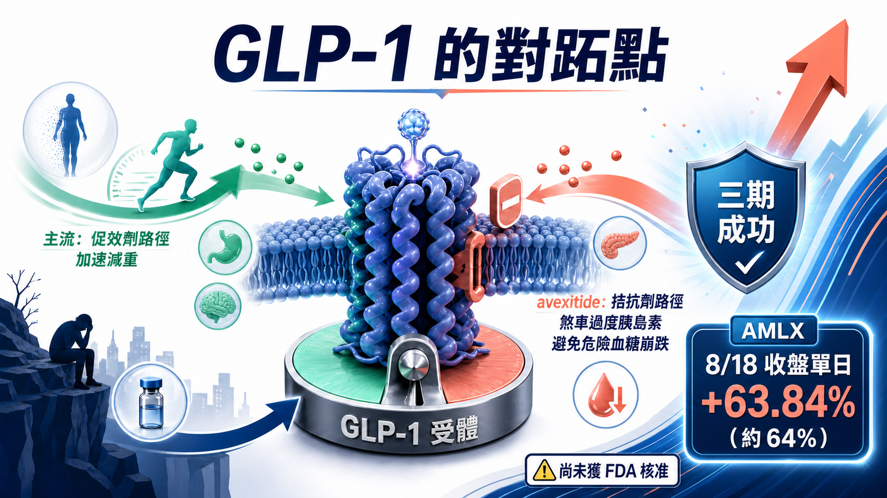
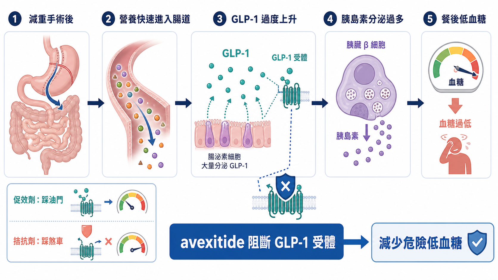
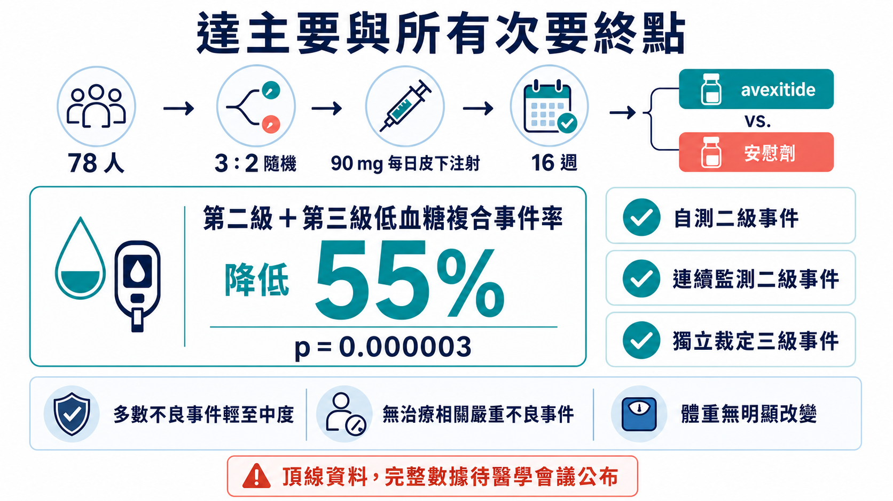
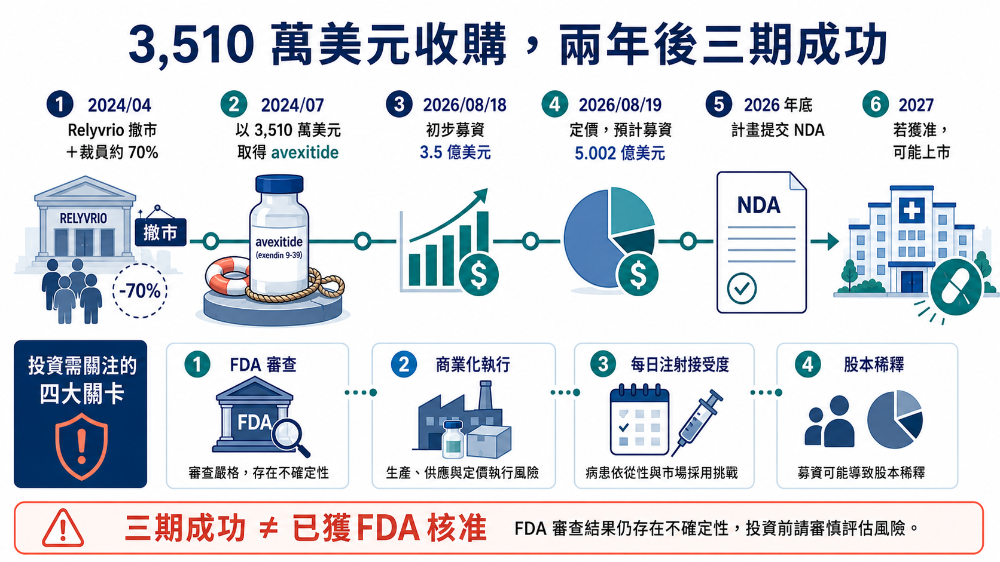

# 減重手術後，吃飯竟可能昏倒？一款新藥讓 Amylyx 暴漲 64%！

減重手術能讓體重下降，部分患者吃完飯後卻可能因血糖急降而昏倒。Amylyx 的 avexitide 反向阻斷 GLP-1 訊號；三期試驗中，第二級與第三級低血糖事件的合併發生率較安慰劑降低 55%，消息公布當天股價上漲約 64%。但這仍是頂線資料，藥物尚未獲 FDA 核准，完整數據、長期安全性與商業化仍待驗證。

## 01｜為什麼有人減重手術成功，吃完飯卻可能昏倒？

先理解疾病，才知道這顆藥為何走反方向。

減重手術能幫助許多重度肥胖患者改善體重與代謝疾病，但有一部分人在手術數月或數年後，會出現「減重手術後低血糖」（post-bariatric hypoglycemia，PBH）。

患者吃完飯後，營養更快進入小腸，腸道釋放大量類升糖素胜肽-1（glucagon-like peptide-1，GLP-1）。GLP-1 原本會提醒胰臟分泌胰島素，協助餐後血糖回落；問題是 PBH 患者的反應太強，胰島素像煞車踩過頭，血糖快速墜落。

輕一點，可能是心悸、冒汗、顫抖、頭暈；嚴重時，大腦得不到足夠葡萄糖，會出現混亂、認知受損、失去意識，甚至癲癇。這些事件難以預測，患者可能不敢獨自開車、不敢照顧孩子，也不敢在沒有他人的情況下吃飯。

市場最熟悉的 semaglutide、tirzepatide 等藥物，是利用 GLP-1 訊號降低食慾、改善血糖；avexitide 則是一種 GLP-1 受體拮抗劑，目標是暫時擋住過度的 GLP-1 訊號，減少不合時宜的胰島素大量分泌，讓餐後血糖不要一路跌穿地板。

一邊踩油門，一邊鬆油門。

同一條生物路徑，在不同疾病裡，可以成為完全相反的治療方向。這就是標題裡所說的 GLP-1「對跖點」。

## 02｜78 人的三期，為什麼能讓市場如此興奮？

LUCIDITY 是一項多中心、隨機、雙盲、安慰劑對照三期試驗，在美國 21 個中心納入 78 名接受過 Roux-en-Y 胃繞道手術、後來出現 PBH 的成年人。

受試者以 3：2 隨機分組，每天皮下注射一次 90 毫克 avexitide 或安慰劑，雙盲治療 16 週。主要終點是第二級與第三級低血糖事件的合併發生率。

第二級低血糖一般指血糖低於每分升 54 毫克，是需要立即處理的重要警訊；第三級則不以單一血糖數字定義，而是嚴重到患者需要他人協助。對 PBH 患者來說，少一次這類事件，可能就是少一次昏厥、跌倒、車禍或急診風險。

Amylyx 公布的頂線結果顯示，avexitide 組的合併事件率較安慰劑低 55%，p=0.000003。公司同時表示，所有次要終點也都達標，包括自行量血糖所記錄的第二級事件、連續血糖監測所記錄的第二級事件，以及經獨立判定的第三級事件。

安全性方面，大多數不良事件為輕度至中度，沒有與 avexitide 治療相關的嚴重不良事件；最常見的是腹瀉、注射部位紅斑與瘀青。16 週內，治療組與安慰劑組都沒有觀察到體重變化。

這最後一點很值得注意。阻斷 GLP-1，直覺上可能讓人擔心體重反彈；至少在這項 16 週試驗裡，公司沒有看到明顯體重差異。但 16 週不等於長期，開放標籤延伸研究仍在進行，完整數據也要等醫學會議發表。

所以這是一份非常強的頂線結果，還不是完整論文。

我們目前不知道兩組各自的絕對事件率、效果分布、信賴區間，也還不能判斷少數患者是否特別受益或沒有反應。p 值很漂亮，臨床判讀仍要等完整資料。

## 03｜真正反轉的，是 Amylyx 自己的命運

如果只看 avexitide，這是一款三期成功的罕病內分泌藥；把時間拉回 2024 年，它更像一筆絕境中的資產配置。

Amylyx 曾靠 Relyvrio 進入 ALS 市場。可是 2024 年 3 月，全球三期 PHOENIX 試驗沒有達到預先設定的主要與次要終點。4 月，公司宣布啟動撤銷美國與加拿大上市許可的程序，新患者不再取得藥物；同時進行重整，員工人數減少約 70%。

那不是普通的管線失敗，而是公司收入來源被拔掉。

三個月後，Amylyx 買下 avexitide。依公司與美國證券文件，交易現金價為 3,510 萬美元，另加確定的補正成本與承接負債；資產包括專利、監管資料、合約與部分藥物材料。Amylyx 也承接未來銷售相關的權利金義務。

這筆交易之所以像「抄底」，不是因為價格一定便宜，而是賣方 Eiger 正在破產程序裡，買方 Amylyx 也剛經歷自己的商業崩塌。兩家都沒有從容揮霍的空間，卻把一個已完成多項二期試驗、獲美國食品藥物管理局（FDA）突破性治療認定、準備進入三期的資產，送進了新主人手裡。

現在回頭看，3,510 萬美元買到一個三期成功資產，帳面上極具戲劇性。

但這不能直接寫成「花 3,510 萬美元買到一款上市藥」。Amylyx 後續負擔了三期試驗、製造、監管與商業化成本；如果審查受阻、標籤過窄、支付不順或上市放量不及預期，早期買價只是總投資的一小部分。

## 04｜64% 的股價之外，公司立刻做了另一件事

數據公布當天，Amylyx 股價收在 35.11 美元，較前一日 21.43 美元上漲 63.84%，成交量也由約 125 萬股放大至約 2,395 萬股。

公司沒有只享受掌聲，而是立刻進場募資。

8 月 18 日，Amylyx 初步宣布擬公開發行 3.5 億美元普通股；8 月 19 日正式定價時，規模上調為 1,409 萬股、每股 35.50 美元，預計總募資約 5.002 億美元，尚未計入承銷商額外認購選擇權，也還沒扣除費用。

因此，「募資 3.5 億」和「募資 5 億」都曾出現在官方文件裡，描述的卻不是同一個時點。前者是初步方案，後者是次日定價後的最終預計總額。

這筆錢預計用於 avexitide 上市前準備與增加製造產能、研發、營運資金及一般公司用途。對股東來說，它同時代表兩件事：公司有資本把三期成功往上市推，也代表新股發行帶來稀釋。

生技公司在好消息後趁高募資並不罕見。真正要看的，是這 5 億美元能否換來核准、產能與有效的商業啟動，而不是只讓現金消耗期延長。

## 05｜距離上市，還有三道門

Amylyx 計畫在 2026 年底前，向 FDA 提交新藥申請（New Drug Application，NDA）；若獲准，公司預期 2027 年展開商業上市。

請注意這兩個動詞：計畫、若獲准。

1. **資料完整性。** FDA 已與公司就主要終點達成共識，avexitide 也有突破性治療與孤兒藥認定，這些都能提高溝通效率，卻不保證核准。監管機構仍會審查絕對事件數、遺漏資料、不同量測方式的一致性、長期安全性、製造與品質。
2. **標籤。** LUCIDITY 只納入 Roux-en-Y 胃繞道手術後的 PBH 患者；現實世界還包括袖狀胃切除等其他手術族群。最初核准範圍會多寬，將直接影響可治療人數。
3. **商業化。** PBH 目前沒有 FDA 核准療法，未被診斷的患者可能不少，這既是市場機會，也是教育成本。醫師要辨認疾病、患者要接受每天注射、支付方要相信減少低血糖事件值得給付，缺一不可。

Amylyx 估計，美國約有 16 萬名症狀性 PBH 患者。這是公司估算，不是已確認會接受治療的市場。患者人數、診斷率、價格、給付與持續用藥率，會共同決定真實營收。

## 06｜每週一針曾驗證概念，卻沒有形成持續競爭

Avexitide 的優勢，是三期已經成功，開發進度明顯領先；弱點則是每天皮下注射一次。

Amylyx 自己已在準備下一棒 AMX0318。它同樣是 GLP-1 受體拮抗劑，但目標是長效給藥，目前仍在進行支持臨床試驗申請的前期研究，公司目標 2027 年提出試驗申請。這是生命週期布局，離證明療效還很遠。

MBX Biosciences 的 imapextide（MBX 1416）曾以每週一次注射取得初步概念驗證。2026 年 5 月公布的小型、開放標籤二期資料顯示，在不同劑量下，餐後血糖最低點平均提高，胰島素峰值平均下降。

但 MBX 在同一份公告中也明確表示，基於資源與資本配置，公司不會再投入 imapextide 的 PBH 二期後段試驗。因此，imapextide 不能再被視為正在積極追趕的後來者；較精確的定位是：它曾驗證低頻給藥概念，卻沒有形成持續開發競爭。

兩份資料也不能硬比。Avexitide 是 78 人、隨機雙盲、安慰劑對照三期，終點是實際低血糖事件；imapextide 的二期是小型、開放標籤探索，主要看混合餐試驗中的代謝指標。每週給藥曾提供一個便利性假設，卻不能被寫成已證實的依從性優勢或仍在推進的競品。Amylyx 真正要回答的，是能否用開發進度建立醫師、患者與支付基礎，同時克服每日注射的採用門檻。

## 07｜投資人現在要算的，不只是成功機率

三期成功後，avexitide 的臨床風險大幅下降，估值模型卻沒有因此變簡單。

接下來至少要追五件事：

1. 完整三期數據中的絕對事件率與效果一致性。
2. FDA 對申請資料與標籤範圍的回應。
3. 製造產能、每日注射接受度與保險給付。
4. 2027 年若獲准後的診斷教育與首年放量。
5. 5.002 億美元募資後的股本稀釋，是否換來更高的資產淨現值，而不是更高的固定成本。

至於未經公司或可靠來源支持的分析師峰值銷售預測，這篇不採用。PBH 是沒有核准療法的市場，潛力與不確定性都很大；在價格、標籤與診斷率尚未出爐前，把峰值寫得太精確，通常只是把假設包裝成答案。

## 結語｜真正的翻身，不在 64% 那一天

Amylyx 的故事很像生技產業最殘酷也最迷人的一面。

一款已上市藥物可以在確認性試驗後失敗，一家公司可以在幾週內失去產品、收入與大部分團隊；同一家公司也可能從另一家破產企業手中，買回一顆被低估的資產，兩年後重新取得市場信任。

Avexitide 的三期結果值得肯定。55% 的事件降低、極低的 p 值、所有次要終點達標，以及目前看來可管理的安全性，讓它有機會成為 PBH 的第一款核准療法。

但股價一天上漲 64%，只是市場把成功機率重新標價；真正的翻身，要等 NDA 被接受、審查通過、藥物順利製造、患者願意每天注射、支付方願意買單。

2024 年，Amylyx 從懸崖邊撿回一顆 GLP-1 的「反向藥」。

2026 年，它證明這顆藥可能有效。

下一步，才是證明它能成為一門生意。

## 主要資料來源

1. [Amylyx｜LUCIDITY 三期頂線結果](https://investors.amylyx.com/news-releases/news-release-details/amylyx-pharmaceuticals-announces-positive-topline-results-0)
2. [Amylyx｜avexitide 資產收購](https://investors.amylyx.com/news-releases/news-release-details/amylyx-pharmaceuticals-announces-acquisition-phase-3-ready-glp-1)
3. [Amylyx｜Relyvrio 撤市與重整](https://investors.amylyx.com/news-releases/news-release-details/amylyx-pharmaceuticals-announces-formal-intention-remove)
4. [Amylyx｜歷史股價](https://investors.amylyx.com/stock-information/historical-price-lookup)
5. [Amylyx｜5.002 億美元定價募資](https://investors.amylyx.com/news-releases/news-release-details/amylyx-pharmaceuticals-announces-pricing-upsized-500-million)
6. [MBX Biosciences｜imapextide 二期更新](https://investors.mbxbio.com/news-releases/news-release-details/mbx-biosciences-provides-obesity-portfolio-update-including)

事實查核截止日：2026 年 8 月 30 日。

> ＊本文為醫藥產業與投資教育，不構成醫療、用藥或投資建議。Avexitide 尚未獲 FDA 核准；完整三期數據仍待醫學會議揭露。
