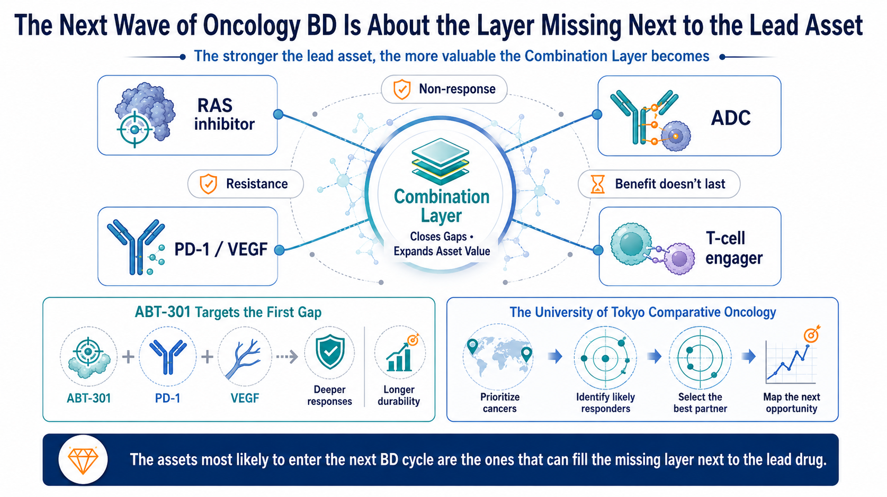
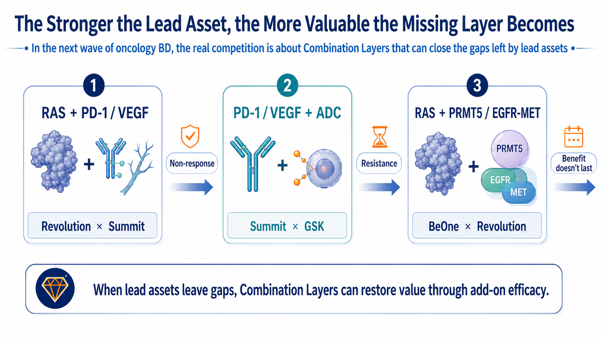
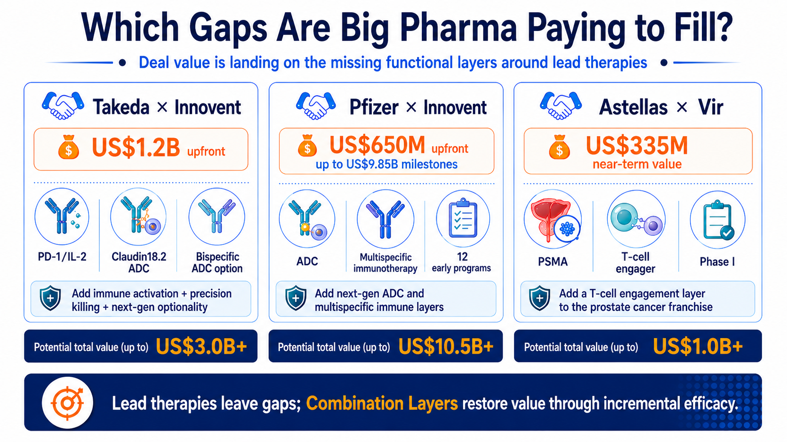
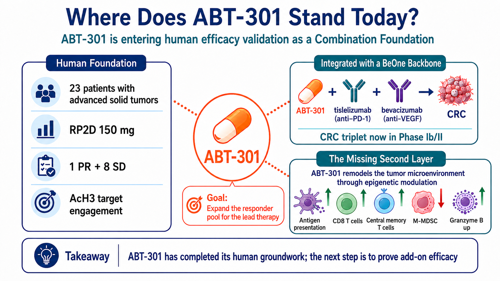
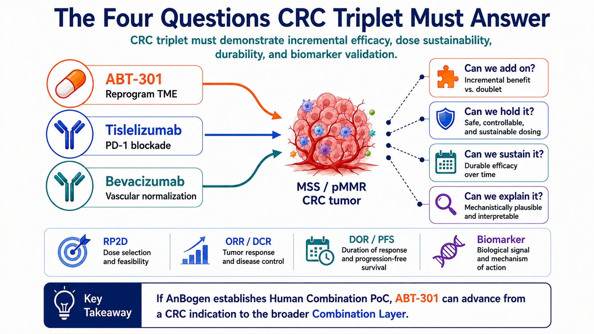
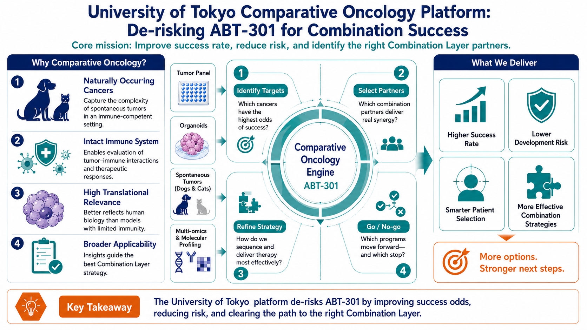
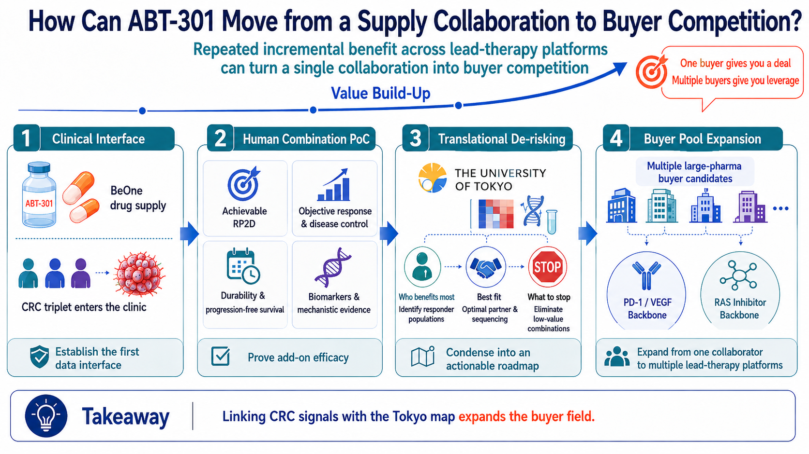

# The Stronger the Backbone, the More Valuable the Missing Layer: Can Anbogen's ABT-301 Enter the Next Wave of Oncology BD?

From Revolution x BeOne and PD-1/VEGF to ADCs: Big Pharma is paying for incremental efficacy, and the next re-rating of Ambogen (7784) will hinge on positive readout of the CRC triplet of ABT-301, positioning as a combination foundation and opening the door to strategic partnering

By Drugnews | Data cut: August 24, 2026

> Drugnews Insight | Big Pharma is paying for incremental efficacy around established therapies. Anbogen (7784) has completed a 23-patient Phase 1 study of ABT-301, with 1 PR and 8 SD, and is now advancing a BeOne-supported global Phase 1/2 triplet trial of ABT-301 + tislelizumab + bevacizumab in pMMR CRC (NCT07244705). The key is simple: better efficacy, sustainable dosing, durable benefit, and identifiable responders. If all four hold, ABT-301 could open the door to Big Pharma partnerships and a valuation re-rating.

In August 2026, Revolution Medicines, which now holds one of the industry's most advanced RAS portfolios, agreed to have BeOne Medicines fund and execute a global registrational Phase 3 trial for one of its candidates. BeOne also secured development or commercialization rights to four RAS(ON) inhibitors in selected Asian markets, while the two companies opened the door to combinations with a PRMT5 inhibitor and an EGFRxMETxMET trispecific antibody.

Why did the deal get attention? Start with Revolution's position. By the end of July 2026, its market capitalization was approaching $40 billion. Daraxonrasib had already delivered a positive Phase 3 readout in pancreatic cancer, and the FDA had accepted the NDA for review. As of the end of June, the company held roughly $3.9 billion in cash, cash equivalents and marketable securities, and had already begun building a U.S. commercial infrastructure. Revolution had capital, late-stage assets and multiple strategic options, yet still chose to hand a global registrational trial to BeOne. That says something important: at the late-development stage, the bottleneck can shift from molecule quality and funding to the organizational capacity required to run multiple global trials in parallel.

Figure 1 | The next wave of oncology BD: the stronger the backbone, the more valuable the Combination Layer

Global partnerships are increasingly aimed at the gaps left by established backbone therapies - primary non-response, resistance and limited durability. Assets that can deliver measurable incremental benefit are moving onto Big Pharma's collaboration shortlist.

What BeOne brings to the table is a global development system that has already been tested repeatedly at scale. Its 2025 interim report cited more than 3,700 employees across global R&D and clinical operations, trials running on six continents, and relationships with regulators and investigators in more than 45 countries. Zanubrutinib had enrolled roughly 7,100 patients, while tislelizumab had been studied in about 14,000 participants across 70 trials in 35 countries. For Revolution, those numbers translate into immediately deployable capabilities in patient enrollment, data operations and multi-region regulatory execution.

Revolution has high-value molecules; BeOne has its own oncology pipeline. What they are exchanging is global clinical execution, regional market access and entry points for combination development. Once a backbone therapy reaches late-stage development, a different scarcity emerges: how to treat more patients, extend the duration of benefit and enter tumor types that the backbone cannot reach on its own.

The same pattern is visible elsewhere. Revolution and Summit are pairing three RAS(ON) inhibitors with the PD-1/VEGF bispecific ivonescimab. GSK has added the B7-H3 ADC risvutatug rezetecan alongside ivonescimab. Each partnership is aimed at a clinical break point - primary non-response, insufficient depth of response, limited durability or acquired resistance.

These deals are best used as a buyer's yardstick: what type of incremental benefit is Big Pharma willing to pay for? That is why Anbogen's ABT-301 deserves to be placed in the same buyer framework now—not because Anbogen is comparable to Revolution, but because its CRC triplet is testing the same kind of value buyers increasingly seek. If the trial can demonstrate clinically meaningful benefit in difficult-to-treat pMMR/non-MSI-H advanced colorectal cancer, ABT-301 could move beyond an early-stage HDAC asset and toward a combination foundation that a larger oncology company could plug into an existing franchise.

.

> Anbogen's re-rating does not require guessing the buyer. The market should first focus on three questions: Can ABT-301 deliver incremental efficacy? Can the dose be maintained over time? Can the responder population be identified clearly?

## 1 | The Stronger the Backbone, the More Valuable the Incremental Layer

Once a backbone therapy enters a major indication, the buyer has already invested in global trials, manufacturing, regulatory infrastructure, physician education and commercial channels. Adding an external asset that improves outcomes can leverage that installed base, making the capital efficiency of incremental innovation potentially much higher than building an entirely new standalone franchise.

Revolution and Summit offer an intuitive example. RAS(ON) inhibitors suppress a core oncogenic driver, while ivonescimab targets both PD-1 and VEGF in an effort to address immune escape, abnormal vasculature and the tumor microenvironment. GSK then adds a B7-H3 ADC, layering targeted cytotoxicity onto the same therapeutic backbone.

BeOne and Revolution are taking the same logic into the RAS ecosystem through PRMT5, EGFR and MET biology. Clinical outcomes from these combinations still need to be proven, but the buyer need is already clear: a valuable Combination Layer should accomplish at least one of three jobs.

If Revolution only needed outsourced trial execution, it could simply hire a CRO. Instead, this transaction exchanges regional rights, global development responsibilities and combination access. BeOne is putting an internal system that can shorten the path to a registrational milestone on the table; in return, it gains rights to four RAS assets in selected Asian markets and a path for BGB-58067 and BG-T187 to enter Revolution's combination network. The fact that clinical-development capability itself is embedded in the deal structure is one of the most relevant takeaways for other biotech companies.

Turn non-responders into responders.

Make existing responses last longer.

Open a backbone therapy to a tumor type it could not reach before.

For investors, these three jobs are often more closely tied to asset value than mechanistic novelty alone. The larger the patient base of the backbone, the more quickly a reproducible incremental benefit can translate into additional patients, longer treatment duration and label expansion.

Figure 2 | The stronger the backbone, the more valuable the gap around it

Partnerships built around RAS + PD-1/VEGF, PD-1/VEGF + ADC, and RAS + PRMT5/EGFR-MET show that buyers are actively assembling therapeutic layers that address non-response, resistance and limited durability.

## 2 | What Big Pharma Pays For: A Defined Gap and an Executable Next Step

Recent transactions with disclosed economics show how Big Pharma is beginning to price these incremental layers.

Takeda's global oncology collaboration with Innovent included a $1.2 billion upfront payment and covered IBI363, a PD-1/IL-2alpha-biased bispecific fusion protein; IBI343, a Claudin18.2 ADC; and an option on the early-stage dual-target ADC IBI3001. Together, the three assets add immune activation, precision cytotoxicity and a next-generation combination option.

In 2026, Pfizer and Innovent expanded the model across 12 early and discovery-stage oncology programs, with Pfizer paying $650 million upfront and up to $9.85 billion in potential development, regulatory and commercial milestones. Pfizer had already built a major ADC franchise through Seagen; this collaboration adds new targets, new payload concepts and multispecific immune-engaging designs around that installed platform.

Astellas and Vir moved even earlier with VIR-5500. The PSMA-targeted dual-masked T-cell engager was still in Phase 1 when Vir became eligible for $335 million in upfront and near-term payments, plus up to $1.37 billion in additional milestones. Astellas has an established prostate-cancer franchise, and VIR-5500 can plug directly into that franchise as a T-cell engagement layer - giving the buyer a reason to take risk earlier in development.

The three transactions point to the same buyer standard: clinical stage is only one variable. An early asset can still command meaningful economics if it addresses a clearly defined treatment gap, is supported by enough human or translational evidence, and comes with a clear next-trial plan - including the patient population, backbone therapy and development responsibilities.

Ultimately, Big Pharma is paying for an executable next step: which gap the asset fills, whether it can fill that gap in patients, and what the buyer gains by plugging it into an existing franchise. The more complete those answers are, the less discovery work the buyer has to absorb - and the closer the asset moves toward transaction readiness.

Figure 3 | Which gaps are Big Pharma paying to fill?

Recent transactions by Takeda, Pfizer and Astellas add immune activation, ADCs, multispecific immune engagement and T-cell engagement to existing oncology franchises. The economics reflect clear product complementarity and an executable development path.

## 3 | ABT-301 Through the Buyer's Lens: What Has Been De-Risked, and What Still Needs to Be Proven

Anbogen's lead asset, ABT-301 (imofinostat), is an oral HDAC inhibitor that primarily targets HDAC1/2/3. HDAC drugs have established commercial precedent in hematologic malignancies, but single-agent development in solid tumors has historically been limited by modest efficacy and tolerability. Anbogen's strategy is therefore combination-led: use epigenetic and tumor-microenvironment modulation to help immunotherapy reach tumors that have remained poorly responsive.

ABT-301 has completed a first-in-human Phase 1 study in 23 patients with advanced solid tumors. The study established 150 mg as the potential recommended Phase 2 dose (RP2D), reported one partial response and eight cases of stable disease, and showed an increase in acetylated histone H3, supporting target engagement in humans. Some cases of stable disease lasted 16 to 53 weeks, while the partial response lasted 24 weeks.

Those data accomplish several basic de-risking tasks for an early asset: the drug has been dosed in humans, dose and PK/PD behavior have begun to take shape, and the target can be engaged. But this was still a small, uncontrolled, multi-tumor Phase 1 study and cannot establish efficacy in colorectal cancer. Treatment-related thrombocytopenia, nausea and vomiting, together with dose-limiting toxicities seen at higher dose levels, also make dose intensity a critical issue for the ongoing triplet.

The one partial response and eight cases of stable disease should not be treated as a response rate, but the duration data do provide evidence of biological activity: the partial response lasted 24 weeks, and some stable-disease cases lasted 16 to 53 weeks. The AcH3 increase also links clinical exposure to HDAC inhibition. Taken together, whether disease stabilized, how long it remained stable and whether the target was engaged means Anbogen no longer has to prove the drug is usable from scratch; development capital can now be focused on combination dose optimization and indication selection.

Anbogen is now advancing a global Phase 1/2 trial of ABT-301 + tislelizumab + bevacizumab in patients with locally advanced or metastatic pMMR/non-MSI-H colorectal cancer, with planned enrollment of 66 patients across the full study, including 36 patients in the Phase 2 preliminary efficacy portion.. This population has historically shown limited sensitivity to immune-checkpoint inhibition, making the clinical gap well defined.

Each component addresses a different part of the problem. Tislelizumab releases the PD-1 immune brake; bevacizumab targets VEGF-driven abnormal vasculature and immune exclusion; ABT-301 is intended to increase antigen presentation, enhance CD8 T-cell activity and reduce immunosuppressive myeloid cells. The central question is whether adding this third layer creates a measurable incremental benefit.

CAPability-01 provides an external human benchmark. In that randomized Phase 2 study, a different HDAC inhibitor, chidamide, was combined with sintilimab and bevacizumab in MSS/pMMR metastatic colorectal cancer. The triplet delivered a 44% ORR and 7.3-month median PFS, versus 13% and 1.5 months with the doublet. The study also reported two treatment-related deaths, reinforcing that efficacy and toxicity must be evaluated together.

CAPability-01 provides an external human benchmark. The randomized Phase 2 study enrolled 48 patients: 23 received chidamide + sintilimab, and 25 received chidamide + sintilimab + bevacizumab. The prespecified primary endpoint was met, with an 18-week PFS rate of 43.8% (21/48) across the full study. The triplet versus doublet results were 64.0% versus 21.7% for 18-week PFS rate, 44.0% versus 13.0% for ORR, and 7.3 versus 1.5 months for median PFS; median DOR across the study was 12.0 months. Safety is equally important: the Nature Medicine report attributed two treatment-related deaths, one to hepatic failure and one to pneumonitis, underscoring that the commercial value of a combination is discounted when toxicity compromises sustained treatment.

CAPability-01 supports the class-level hypothesis that HDACi + PD-1 + VEGF can help unlock immune-cold colorectal tumors. ABT-301 still needs to validate its own asset profile across three dimensions: incremental efficacy, durability and a workable safety window. That gap between class validation and asset validation is the source of Anbogen's next potential re-rating.

Figure 4 | Where does ABT-301 stand today?

ABT-301 has established a Phase 1 foundation in human dose, PK/PD and target engagement and has moved into a CRC triplet. The next step is to prove durable add-on efficacy.

## 4 | How the CRC Triplet Could Reframe ABT-301's Valuation

As of August 20, 2026, ClinicalTrials.gov lists NCT07244705 as Recruiting, with planned enrollment of 66 patients, an estimated Primary Completion in April 2028 and Study Completion in July 2028. Under the company trial design, Phase 1 includes 30 patients for triplet dose escalation and RP2D exploration, while Phase 2 includes 36 patients across two active dose levels for preliminary efficacy assessment. Registry dates may be updated over time.

Before full data disclosure, investors and analysts can follow three public readout nodes over the next two years: Node 1 — Phase 1 enrollment, dose selection and RP2D; Node 2 — confirmed ORR/DCR and early PFS; Node 3 — DOR/PFS maturation and biomarker readouts.

Because this is an early, open-label study, ORR alone can be misleading. The market will need to triangulate four data sets:

"Add-on" means response depth, disease control and early PFS should look better than a reasonable historical expectation;

"Tolerable" means the RP2D, dose reductions, interruptions and overall dose intensity must support long-term triplet treatment;

"Durable" means DOR and PFS need to rule out transient tumor shrinkage.

"Explainable" means tumor tissue, peripheral blood or other biomarkers should identify a reproducible, enrollable responder population.

The asset identity changes only if all four pieces connect. Acceptable safety without incremental efficacy leaves ABT-301 as an HDAC asset that can be combined. A response signal without durability or biomarkers may support collaboration discussions, but bargaining power remains limited. If efficacy, tolerability, durability and patient selection all line up, Anbogen will have its first Human Combination PoC.

CRC triplet readout path: three scenarios for investors to track

| Data scenario | How the market is likely to read it | Asset position |
| --- | --- | --- |
| Bull case | Nodes 1–3 validate sequentially. / Incremental efficacy, DOR/PFS, manageable safety and an identifiable responder population all line up; a buyer can design the next trial directly from the package. | Partner-ready |
| Base case | Node 1 validates; Node 2 shows activity; Node 3 remains incomplete. / A response signal emerges, but durability or biomarkers remain incomplete; partnership options exist, but bargaining power is limited. | Option value preserved |
| Bear case | Nodes 1–2 do not validate. / No clear incremental benefit, or toxicity prevents adequate dose intensity; dose, population or backbone needs to be redesigned. | Development thesis reset |

What the market will price after each readout is residual risk. The more nodes are cleared, the less dose-finding, patient-segmentation and biomarker work a buyer must redo—and the more likely a relationship can move from research collaboration toward co-development or licensing.

The value of the PoC is therefore not a single ORR number. It is whether a buyer can see which additional patients become treatable, what dose is sustainable, how long the benefit lasts and how the next trial should be designed.

Figure 5 | The four questions the CRC triplet must answer

"Adds value, can be sustained, lasts and can be explained" map to incremental efficacy, maintainable dosing, durability and patient selection. Only when all four data sets connect does the trial become combination evidence that can support BD evaluation.

## 5 | The University of Tokyo Collaboration: Lowering the Cost of the Next Clinical Miss

The CRC trial asks whether ABT-301 can fill one clinical gap. To broaden the buyer universe, the asset must answer a second question: can the same biology be reproduced in another tumor type, another patient segment or another treatment backbone?

According to the collaboration materials provided by the company, Anbogen and the Laboratory of Veterinary Surgery at the University of Tokyo's Graduate School of Agricultural and Life Sciences plan to use canine and feline tumor cell lines, organoids, in vivo models and naturally occurring cancers in companion animals to evaluate ABT-301 as monotherapy and in combinations with different drugs, and to identify molecular backgrounds that may predict response.

Naturally occurring tumors in dogs and cats retain intact immune systems, tumor heterogeneity and disease evolution, adding translational information that conventional cell lines and mouse models may not fully capture. The commercial value of the platform lies in selection and elimination: which tumor type deserves human testing, which patients are most likely to benefit, which partner produces the largest incremental effect and which directions should be stopped before an expensive clinical trial begins.

The University of Tokyo team's published work spans canine malignant melanoma, urothelial carcinoma, bladder-cancer organoids, as well as canine CAR-T, immune-checkpoint and combination-immunotherapy research. These tumor types do not necessarily need to become new Anbogen indications. Their more useful role may be to test whether ABT-301's TME-modulating biology persists in an intact immune environment and to turn a broad mechanistic thesis into testable hypotheses for patient selection and combination design.

Investors should not read this collaboration as a plan to launch multiple new pipelines at once. The ideal output is a narrowing translational map that breaks the CRC human signal into responder biology, biomarkers, the best backbone and Go/No-go decisions, while creating a clear priority order for a second validation setting.

That map has direct implications for capital efficiency. If Anbogen can compress ten plausible directions into one high-probability coordinate, the next clinical dollar can be concentrated, and a prospective buyer can more easily estimate the time, cost and probability of success after taking over the program.

> For a small biotech, a translational platform should eliminate nine low-probability paths before adding ten new pipeline arrows.

Figure 6 | University of Tokyo Comparative Oncology: a translational de-risking engine for AnBogen’s ABT-301

By combining naturally occurring tumors with an intact immune environment, the platform is designed to screen for the right Cancer, Biomarker, Partner and Go/No-go decision - with the goal of improving the hit rate of the next human trial.

## 6 | Partner-ready Means the Buyer Knows What to Do Next

The BD value of an early-stage asset is often determined by how far the buyer still is from its next major decision point. If the buyer must re-establish dose, rebuild patient segmentation, guess the right combination backbone and create a biomarker strategy from scratch, the transaction carries a large exploration discount. The more complete the data package, the more room there is for economics to move higher.

ABT-301's path from clinical proof to partnership—and then to higher strategic valuation—can be viewed in three layers.

Layer 1 | Human Combination PoC — opens partnership potential. If the CRC triplet establishes a maintainable RP2D, clear incremental efficacy and maturing DOR/PFS, large oncology companies can begin evaluating substantive partnership opportunities.

Layer 2 | Translational Map — supports valuation uplift. If the University of Tokyo work and clinical biomarker program clarify who benefits, why they benefit and which class of backbone is most rational, they can reduce exploratory work and execution risk in the next trial.

Layer 3 | Cross-backbone Replication — broadens the buyer pool. If incremental benefit is reproduced with a second backbone or in a second high-priority indication, ABT-301 can move from a regimen-specific asset toward a Combination Layer that can plug into multiple oncology franchises.

Anbogen has disclosed preclinical data showing that ABT-301 can increase chemotherapy sensitivity in KRAS-mutant pancreatic cancer through the HDAC3-NRF2 axis. Those data support pancreatic cancer as a research direction, but there is currently no public evidence of a direct ABT-301 + RAS(ON) inhibitor combination. RAS can therefore serve as a future experimental entry point, but it should not yet be priced into a transaction thesis. The two agents need to be tested directly for response depth, durability and delayed resistance before the combination can justify clinical development.

If all three layers are completed, a prospective partner would receive an executable asset package: a human working dose, manageable safety, an identifiable responder population, the best backbone, biomarkers, the next indication and a blueprint for the next trial. That package reduces the buyer's cost of taking over development and could broaden the buyer universe beyond a single PD-1 partner to multiple oncology companies seeking TME modulation.

> A signal in one regimen usually creates only a small number of negotiating counterparts. Replication across backbones is what can turn a single partnership discussion into buyer competition.

Figure 7 | How ABT-301 could move from a clinical interface to buyer competition

The value-creation path runs from Clinical Interface to Human Combination PoC to Translational De-risking and ultimately Buyer Pool Expansion. Replicability across backbones will determine bargaining power.

## Conclusion | Anbogen Is Now on a Verified Re-rating Path

Anbogen is still in the data-generation phase. This is not yet the point to guess which Big Pharma company might buy the asset, nor should the tislelizumab supply arrangement be treated as an endorsement from BeOne. Investors can instead track three milestones to determine whether the asset is truly moving up the value curve.成

First, can the CRC triplet deliver a Human Combination PoC that is both interpretable and sustainable?

Second, can the University of Tokyo collaboration and clinical biomarker program identify reproducible responder biology and the best partner?

Third, can a second backbone generate incremental benefit again, showing that ABT-301's value extends beyond a single regimen?

Phase 1 has established a human foundation for ABT-301, and CAPability-01 provides a class-level benchmark. If the CRC triplet establishes a Human Combination PoC, the door to substantive Big Pharma partnering could open. A University of Tokyo translational map that narrows the responder population, biomarkers and best partner—followed by replication with a second backbone—would further reduce the buyer's development burden and support a higher strategic valuation.

The starting point for Anbogen's next re-rating is the first interpretable human incremental-efficacy signal from the CRC triplet; a drug-supply agreement by itself is not enough. A backbone drug typically has one rights holder. A second layer that can expand the responder pool across multiple backbones has the potential to turn a one-on-one partnership discussion into buyer competition.

## References

• [Revolution Medicines | Q2 2026 financial results and daraxonrasib regulatory progress](https://ir.revmed.com/news-releases/news-release-details/revolution-medicines-reports-second-quarter-2026-financial/)

• [BeOne Medicines | 2025 interim report: global R&D and clinical-operations infrastructure](https://hkexir.beonemedicines.com/filings-financials/financial-reports)

• [PharmaCube / Shenlan View | Why a $40 billion biotech chose BeOne](https://www.pharmcube.com/newsLibrary/detail?id=64606a10cbd6fad153f9505ed7f5f446)

• [BeOne Medicines x Revolution Medicines | Clinical Development and Regional Commercialization Collaboration](https://sseir.beonemedicines.com/en/news/beone-medicines-and-revolution-medicines-announce-clinical-development-and-regional-commercialization-collaboration/0a35a8d0-de94-4e43-a54c-c08af0e2e7ad)

• [Revolution Medicines x Summit Therapeutics | RAS(ON) inhibitors + ivonescimab combination](https://ir.revmed.com/news-releases/news-release-details/revolution-medicines-and-summit-therapeutics-enter-clinical/)

• [GSK x Summit Therapeutics | Ivonescimab + B7-H3 ADC combination](https://www.businesswire.com/news/home/20260112976441/en/Summit-Therapeutics-Announces-Clinical-Trial-Collaboration-with-GSK-to-Evaluate-Ivonescimab-in-Combination-with-GSKs-B7-H3-Antibody-Drug-Conjugate-ADC)

• [Takeda x Innovent | Global oncology collaboration](https://www.takeda.com/newsroom/newsreleases/2025/closing-partnership-innovent/)

• [Pfizer x Innovent | Global strategic oncology collaboration](https://www.pfizer.com/news/press-release/press-release-detail/pfizer-and-innovent-biologics-enter-global-strategic)

• [Astellas x Vir Biotechnology | VIR-5500 global collaboration](https://newsroom.astellas.com/2026-02-24-astellas-and-vir-biotechnology-announce-global-strategic-collaboration-to-advance-psma-targeting-pro-xten-r-dual-masked-t-cell-engager-vir-5500-for-the-treatment-of-prostate-cancer)

• [ABT-301 First-in-Human Phase 1](https://ascopubs.org/doi/10.1200/JCO.2023.41.16_suppl.e15137)

• [ABT-301 + Tislelizumab + Bevacizumab Phase 1/2 | NCT07244705](https://clinicaltrials.gov/study/NCT07244705)

• [CAPability-01 | HDAC + PD-1 + VEGF in MSS/pMMR mCRC](https://www.nature.com/articles/s41591-024-02813-1)

• [Laboratory of Veterinary Surgery, The University of Tokyo | Research output](https://www.vm.a.u-tokyo.ac.jp/geka/Results.html)

• [NCI Comparative Oncology Program](https://dctd.cancer.gov/research/research-areas/comparative-oncology)

• [Anbogen Biotech x The University of Tokyo | Collaborative Research Announcement](https://money.udn.com/money/story/5612/9710272)

> Disclaimer | This article is a Drugnews analysis based on public information and company-provided collaboration materials and does not constitute medical or investment advice. BeOne's publicly disclosed relationship with Anbogen is limited to clinical supply of tislelizumab and should not be interpreted as a licensing, investment or acquisition arrangement. The ABT-301 CRC triplet remains in Phase 1/2 validation. CAPability-01 used a different HDAC inhibitor and its results cannot be directly extrapolated to ABT-301. There is currently no public evidence of a direct ABT-301 + RAS(ON) inhibitor combination.
