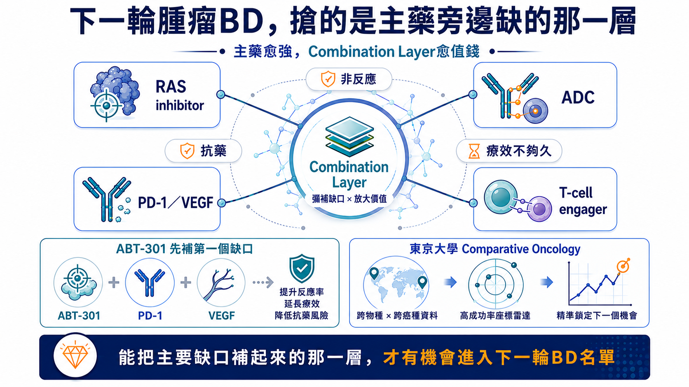
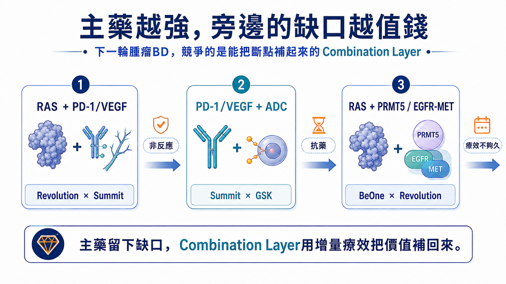
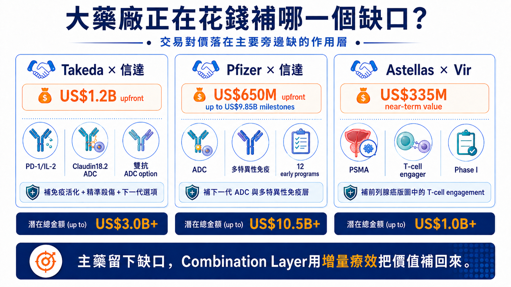
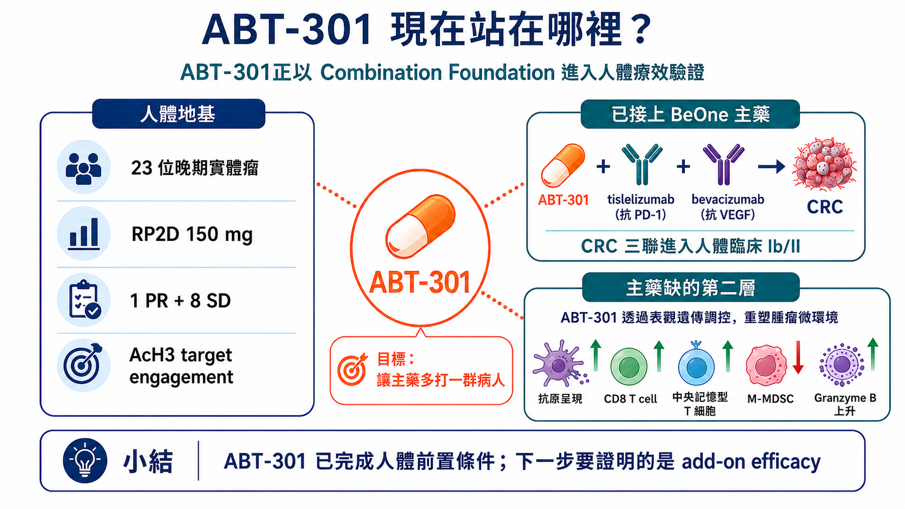
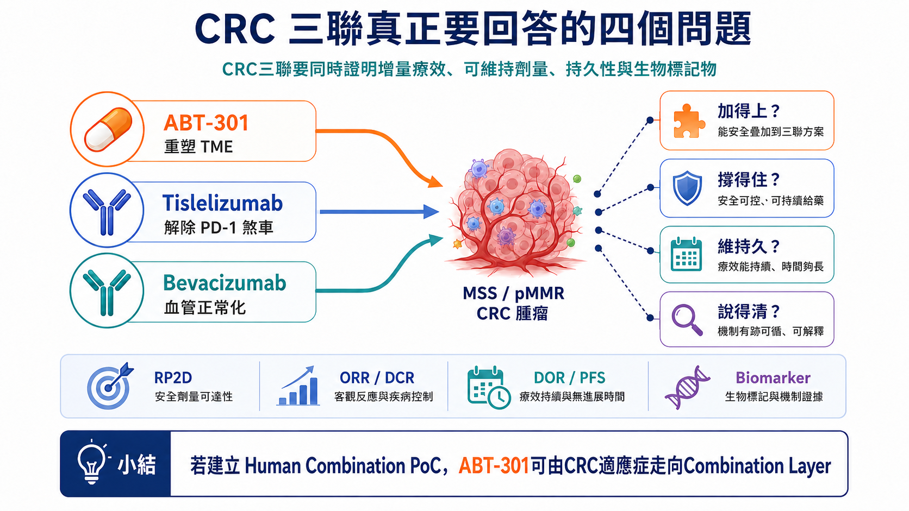
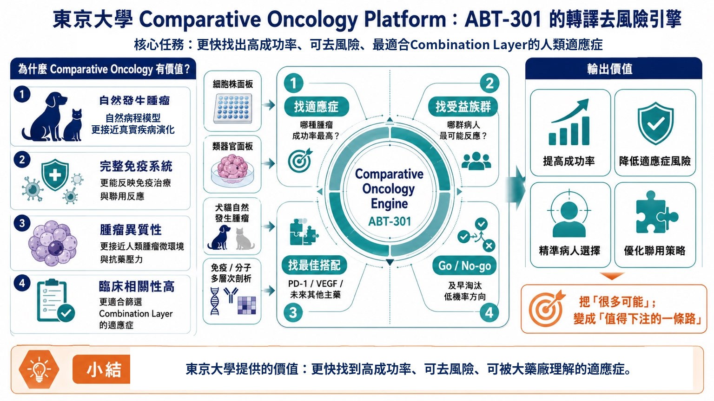
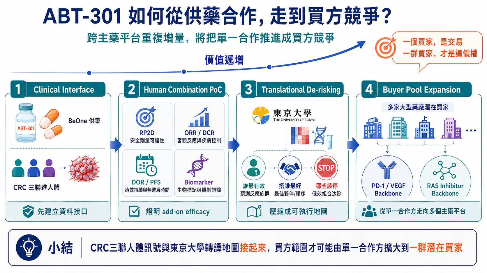

# 主藥越強，旁邊缺的那一層越值錢：安邦ABT-301能否進入下一輪腫瘤BD名單？

從Revolution × BeOne、PD-1／VEGF到ADC：大藥廠正為「增量療效」付錢，安邦下一次估值轉折將由CRC三聯人體療效決定ABT-301聯合用藥基石，打開大型藥廠合作

撰文｜藥時事 Drugnews　　資料基準日｜2026年8月24日

> 藥時事觀點Drugnews Insight | 大藥廠正為補強主藥「增量療效」付錢。安邦（7784）ABT-301一期23人已見1人腫瘤縮小、8人病情穩定，目前已與BeOne展開供藥合作，推進ABT-301＋tislelizumab＋bevacizumab全球I/II期pMMR大腸直腸癌三聯試驗（NCT07244705）。下一步就看：療效是否更好、能否持續用、效  果是否持久、哪些人最受益；四關成立，就有機會打開大藥廠合作與估值重估。

2026年8月，手握後期RAS資產的Revolution Medicines，將其中一款候選藥的全球註冊性Phase III交由BeOne Medicines出資並執行。BeOne另取得四款RAS(ON)抑制劑在部分亞洲市場的開發或商業化權益，雙方也把PRMT5抑制劑、EGFR×MET×MET三特異性抗體接進RAS聯合治療。

這筆合作受到關注，先看Revolution的份量。2026年7月底，公司市值逼近400億美元；daraxonrasib的胰臟癌Phase III已公布陽性結果，FDA也受理上市申請。公司在6月底持有約39億美元現金、現金等價物與有價證券，並已為美國上市建立商業化基礎。它有資金、有後期產品，也有多個合作選項，仍將一項全球註冊性試驗交給BeOne。後期開發的瓶頸開始由分子與現金，轉向同時推動多個全球試驗的組織容量。

圖1｜下一輪腫瘤BD的核心：主藥越強，Combination Layer越值錢

全球合作正集中處理主藥留下的非反應、抗藥與療效持久性缺口；能提供可量化增量的第二層，開始進入大藥廠合作清單。

BeOne能拿來交換的，是一套已跑過多次全球開發的內部系統。2025年半年報顯示，其全球研發與臨床營運團隊超過3,700人，在六大洲開展試驗，並與45個以上國家的監管機關及研究者合作；zanubrutinib累計入組約7,100人，tislelizumab則在35個國家進行70項試驗、累計約1.4萬名受試者。對Revolution來說，這些數字代表可以立即使用的患者入組、資料管理與跨區申報能力。

Revolution有熱門分子，BeOne也有自己的腫瘤管線。交易桌上交換的是全球臨床執行、區域市場與管線聯用入口。當一顆主藥進入後期，下一個稀缺能力開始浮現：如何讓它多打一群病人、撐得更久，或進入原本碰不到的癌種。

同一條脈絡出現在其他合作。Revolution與Summit把三款RAS(ON)抑制劑接上PD-1／VEGF雙抗ivonescimab；GSK再把B7-H3 ADC risvutatug rezetecan放到ivonescimab旁邊。每筆合作都對準臨床留下的斷點：初始非反應、反應不夠深、療效不夠久，以及後續抗藥。

這些合作更適合當成一把買方尺：大藥廠願意為哪一類增量付錢？這也正是安邦（7784）ABT-301值得提前放進同一個買方框架的原因。把這把尺放到ABT-301，投資命題落在一個清楚分岔口——安邦的CRC三聯試驗能在pMMR/non-MSI-H這群難治型末期大腸直腸癌病人證明臨床獲益，安邦就有機會跨進Combination Layer的估值框架，走向可被大型藥廠接進既有腫瘤franchise的聯合用藥基石。

> 安邦的重估不必先猜買家。市場先看三件事：ABT-301能否帶來增量療效、劑量能否長期維持、受益患者能否被清楚辨識。

## 一、主藥越強，旁邊的增量越容易被放大

一款主藥進入大型適應症後，買方已經投入全球試驗、製造、法規、醫師教育與商業化通路。此時加入一個能改善治療結果的外部資產，新增價值可以沿用既有基礎設施，資本效率通常高於重新建立一條獨立產品線。

Revolution與Summit提供一個直觀案例。RAS(ON)抑制劑壓制腫瘤的核心驅動訊號，ivonescimab同時作用於PD-1與VEGF，試圖補上免疫逃脫、異常血管與腫瘤微環境。GSK接著加入B7-H3 ADC，讓同一套骨幹再多一層定向細胞毒殺傷。

BeOne與Revolution則把PRMT5、EGFR與MET等機轉接進RAS生態。這些組合的臨床結果仍待驗證，買方需求已經相當具體：一顆好的Combination Layer，至少要完成三項任務之一。

若只需要試驗執行，Revolution可以繼續採用CRO。這筆合作以區域權益、全球開發責任與聯用入口交換。BeOne把能縮短資產抵達註冊節點的內部系統放上談判桌，對價則是四款RAS資產在部分亞洲市場的權益，以及BGB-58067、BG-T187進入Revolution聯合治療網絡的機會。臨床能力本身被寫進交易結構，才是這筆合作對其他Biotech最值得參照的地方。

讓原本不反應的病人開始反應。

讓已經反應的病人維持更久。

讓一顆主藥進入原本打不開的癌種。

對投資人而言，這三項任務比機轉的新穎度更接近資產價格。主藥的患者基礎愈大，第二層只要帶來可重複的增量，新增患者、延長治療時間與擴張適應症便能直接轉成商業價值。

圖2｜主藥越強，旁邊的缺口越值錢

RAS＋PD-1／VEGF、PD-1／VEGF＋ADC、RAS＋PRMT5／EGFR-MET等合作，顯示買方正在配置能補足非反應、抗藥與療效持久性的作用層。

## 二、大藥廠付錢買的是清楚缺口，以及可以立刻執行的下一步

近期幾筆有明確對價的交易，進一步說明大藥廠如何替第二層定價。

Takeda與信達生物的全球腫瘤合作包含12億美元首付款，涵蓋PD-1／IL-2α-bias雙特異性融合蛋白IBI363、Claudin18.2 ADC IBI343，以及早期雙標的ADC IBI3001選擇權。三項資產分別補進免疫活化、精準殺傷與下一代聯合治療選項。

Pfizer在2026年與信達一次納入12項早期與新源頭腫瘤計畫，支付6.5億美元首付款，後續潛在開發、法規與商業里程碑最高98.5億美元。Pfizer已藉Seagen建立大型ADC版圖，這筆合作替既有平台增加新靶點、新payload與多特異性免疫設計。

Astellas與Vir的VIR-5500合作更早。這款PSMA標靶dual-masked T-cell engager仍在Phase I，Vir即可取得3.35億美元前期與近期付款，另有最高13.7億美元里程碑。Astellas長期經營前列腺癌，VIR-5500可以直接補進既有franchise的T-cell engagement層，買方因此願意在早期承擔風險。

三筆交易傳達同一個買方標準：臨床階段只是其中一項決定因素。資產若對準明確治療斷點，已有足夠人體或轉譯證據支持，且下一場試驗的患者、骨幹與開發責任清楚，早期項目同樣能取得高額對價。

大藥廠最後會替一套可執行的下一步付錢：補哪個缺口、人體裡補不補得起來、接進既有管線後多得到什麼。答案愈完整，買方還要承擔的探索成本愈低，資產也愈接近可交易狀態。

圖3｜大藥廠正在花錢補哪一個缺口？

Takeda、Pfizer與Astellas近期合作將免疫活化、ADC、多特異性與T-cell engagement接進既有腫瘤版圖；交易對價反映清楚的產品互補與可執行開發路徑。

## 三、把ABT-301放進買方模型：已完成的風險，和尚未完成的證明

安邦生技的核心資產ABT-301（imofinostat）是一款口服HDAC抑制劑，以HDAC1／2／3為主要作用標的。HDAC類別在血液腫瘤已有商業化經驗，實體瘤單藥開發則長期面臨療效有限與耐受性的挑戰。安邦因此把ABT-301放進聯合治療，利用表觀遺傳與腫瘤微環境調節，協助免疫治療進入原本反應不佳的腫瘤。

ABT-301已完成23位晚期實體瘤患者的first-in-human Phase I。試驗確立150 mg為潛在的二期推薦劑量（RP2D），整體出現1位PR與8位SD，並觀察到acetylated histone 3上升，支持人體target engagement；部分疾病穩定維持16至53週，PR維持24週。

這組資料完成早期資產的幾項基本工作：藥物已進入人體，劑量與PK／PD有初步輪廓，標的也能被打到。試驗仍是跨癌種、無對照的小型Phase I，無法推論大腸直腸癌療效。血小板低下、噁心與嘔吐等治療相關不良事件，以及高劑量組曾出現的DLT，也讓後續三聯的dose intensity成為關鍵。

Phase I中的1位PR與8位SD不能被當成有效率，但持續時間提供了資產仍有生物活性的線索：PR維持24週，部分SD維持16至53週。AcH3上升則把臨床暴露與HDAC抑制接起來。病人是否穩定、穩定多久、標的是否被打到，三類資料讓安邦不必從零開始證明藥物可用，後續資金可以集中在組合劑量與適應症選擇。

安邦目前推進ABT-301＋tislelizumab＋bevacizumab的全球Phase I/II，對象為pMMR／non-MSI-H局部晚期或轉移性大腸直腸癌，規劃收案66人，其中Phase II療效評估部分為36人。這群病人對免疫檢查點抑制劑的反應長期有限，臨床缺口明確。

三顆藥各自處理不同問題。Tislelizumab解除PD-1免疫煞車；bevacizumab抑制VEGF相關異常血管與免疫排斥；ABT-301嘗試提高抗原呈現、增加CD8 T細胞活性並降低免疫抑制性髓系細胞。試驗的核心，是第三層加入後能否產生可辨識的增量。

CAPability-01提供一個外部人體參照。該隨機Phase II使用另一款HDAC抑制劑chidamide搭配sintilimab與bevacizumab，共納入48人（chidamide+sintilimab雙聯23人、chidamide+sintilimab+bevacizumab三聯25人），主要終點18週PFS率為43.8%（21/48），達到預設主要終點；三聯對雙聯的18週PFS率為64.0% vs 21.7%，ORR為44.0% vs 13.0%，中位PFS為7.3 vs 1.5個月，全體中位DOR為12.0個月。安全性同樣重要。CAPability-01原文報告兩例治療相關死亡，分別為hepatic failure與pneumonitis，也提醒市場，組合療法的商業價值會被安全性折現。

CAPability-01支持HDACi＋PD-1＋VEGF打開冷腫瘤的類別假說，ABT-301仍要以自己的「增量療效」、「維持久」與「安全性窗口」完成資產驗證。這段差距，就是安邦下一次估值轉折的來源。

圖4｜ABT-301目前站在哪裡？

ABT-301已完成Phase I的人體劑量、PK／PD與target engagement地基，並進入CRC三聯；下一關是證明可維持的add-on efficacy。

## 四、CRC三聯會把安邦帶向哪一種估值？

投資人看這場Phase I/II，依照ClinicalTrials.gov臨床試驗NCT07244705公開資料時間來看，目前為Recruiting，預計總收案66人；Primary Completion預計2028/04，Study Completion預計2028/07。依公司試驗設計，Phase I為三聯劑量爬坡與RP2D探索試驗共30人，Phase II則為三聯兩個有效劑量初步療效評估試驗共36人；日期後續仍可能更新。

完整資料揭露前，未來兩年內的公開讀出判斷可以拆成三個節點：(節點1) 看近期Phase I的收案、劑量與RP2D；(節點2) 看confirmed ORR／DCR與早期PFS；(節點3) 再看DOR／PFS與biomarker。

這是早期、開放式試驗，單看ORR容易失真，市場最後會用四組資料交叉判讀:

加得上，看response depth、疾病控制與早期PFS是否高於合理歷史預期；

撐得住，看RP2D、減量、中斷與dose intensity能否支持長期三聯；

維持久，看DOR與PFS能否排除短暫縮瘤；

說得清，則要用腫瘤組織、周邊血液或其他biomarker辨識可重現、可收案的受益患者。

四題接起來，資產身份才會改變。安全性可接受但缺乏療效增量，ABT-301仍停留在可聯用的HDAC資產；出現反應訊號但缺少持久性與biomarker，合作討論可能存在，議價能力仍弱；療效、耐受性、持久性與患者選擇同時成立，安邦才會取得第一個Human Combination PoC。

CRC三聯資料出現後，市場可能走向三種估值情境

| 資料情境 | 市場如何解讀 | 資產位置 |
| --- | --- | --- |
| 多方 | 3個節點連續成立，增量療效、DOR／PFS、可管理安全性與受益族群同時成立；買方可直接設計下一場試驗。 | Partner-ready |
| 中性 | 節點1成立，節點2出現反應訊號，節點3仍不完整，出現反應訊號，持久性或biomarker仍不完整；合作選項存在，議價能力有限。 | 保留選擇權 |
| 空方 | 節點1-2未成立，無法辨識增量，或毒性使dose intensity不足；需調整劑量、族群或聯用骨幹。 | 開發假說重整 |

資料讀出後，市場看的是剩餘風險。三個節點愈完整，買方需要自行補做的劑量、患者分層與biomarker工作愈少，合作也愈可能從共同研究往共同開發或授權升級。

因此，這個PoC的價值不在單一ORR，而在於讓買方知道：多打開哪群病人、需要多少劑量、效果能維持多久，以及下一場試驗怎麼設計。

圖5｜CRC三聯要回答的四個問題

「加得上、撐得住、維持久、說得清」分別對應增量療效、可維持劑量、持久性與患者選擇；四組資料接起來，才構成可供BD評估的人體組合證據。

## 五、東京大學合作的價值，在於降低下一場試驗的失敗成本

CRC試驗回答ABT-301能否補上一個臨床缺口。資產若要擴大買方範圍，還需要回答第二個問題：相同生物學能不能在另一個癌種、另一群患者或另一個治療骨幹中重現？

依公司提供的合作研究資料，安邦與東京大學農學生命科學研究科獸醫外科學實驗室將運用犬貓腫瘤細胞株、類器官、體內模型與自然罹癌伴侶動物，評估ABT-301單藥與不同藥物聯用，並尋找可預測反應的分子背景。

自然發生的犬貓腫瘤具備完整免疫系統、腫瘤異質性與疾病演化，能補充細胞株和小鼠模型較難呈現的轉譯資訊。平台的商業價值來自篩選與淘汰：哪一個癌種值得進人體、哪一群病人最可能受益、哪一種partner能產生最大增量、哪些方向應在昂貴臨床啟動前停止。

東京大學團隊的公開研究涵蓋犬惡性黑色素瘤、泌尿上皮癌、膀胱癌類器官，以及犬CAR-T、免疫checkpoint與複合免疫療法。這些癌種未必會直接變成安邦的新適應症；它們更適合拿來測試ABT-301在完整免疫環境中的作用是否跨模型存在，並將HDAC可調節TME壓縮成可檢驗的病人選擇與聯用假說。

投資人不宜把這項合作解讀成一口氣增加多條pipeline。最理想的交付是一張縮小範圍的轉譯地圖，將CRC人體訊號拆成responder biology、biomarker、最佳骨幹與Go／No-go，並替第二個驗證場景提供清楚優先順序。

這張地圖直接影響資本效率。安邦若能把十個可能方向縮成一個高機率座標，下一筆臨床資金會更集中，潛在買方也更容易估算接手後的時間、成本與成功機率。

> 對小型Biotech而言，轉譯平台應優先刪掉九條低機率路徑；多畫十條管線只會分散有限資本。

圖6｜東京大學Comparative Oncology：安邦ABT-301的轉譯去風險引擎

平台利用自然腫瘤與完整免疫環境篩選Cancer、Biomarker、Partner與Go／No-go，目標是提高下一場人體試驗的命中率。

## 六、Partner-ready的定義：買方拿到資料後，知道下一場試驗怎麼做

一顆早期資產的BD價格，常由買方距離下一個關鍵決策點還有多遠所決定。買方若仍要重新找劑量、重做患者分層、猜聯用骨幹並建立biomarker，交易會承擔大量探索折價。資料包愈完整，對價愈有機會往上移動。

ABT-301走向Partner-ready，需要三層證據連在一起。

第一層｜Human Combination PoC。打開合作可能。CRC三聯若交出可維持的RP2D、明確增量與DOR／PFS，大型藥廠即可開始評估實質合作。

第二層｜Translational Map。提高valuation。東京大學與臨床biomarker若能回答誰受益、為何受益、和哪一類主藥搭配最合理，就能降低下一場試驗的探索成本。

第三層｜Cross-backbone Replication：擴大買方池。若第二個backbone或高優先適應症重現增量，ABT-301就能由單一regimen資產走向多個腫瘤franchise。

安邦已公開ABT-301透過HDAC3–NRF2路徑提高KRAS突變型胰臟癌對化療敏感性的臨床前資料。這項結果支持胰臟癌研究方向，目前沒有ABT-301與RAS(ON)抑制劑直接聯用的公開證據。RAS可以成為後續實驗入口，現階段不宜提前納入交易估值。把兩顆藥直接放進模型，觀察response depth、持久性與抗藥延後，才能決定是否值得進入臨床。

當三層證據完成，潛在合作方取得的會是一套可執行資產包：人體工作劑量、可管理安全性、受益患者、最佳骨幹、biomarker、下一個癌種與後續試驗設計。這套答案能降低接手成本，也能把買方範圍由單一PD-1合作方擴大到多個需要TME調節的腫瘤公司。

> 一個regimen的訊號通常只帶來少數談判對手；跨backbone重複，才有機會把單一合作談判推進成買方競爭。

圖7｜ABT-301如何從臨床接口，走到買方競爭？

價值遞增路徑由Clinical Interface、Human Combination PoC、Translational De-risking走向Buyer Pool Expansion；跨backbone可複製性將決定議價權。

## 結語｜安邦值得追蹤的，是一條可以被驗證的估值路徑

安邦目前仍處於資料生成期。這個階段不適合先猜哪一家大藥廠會買，也不適合把tislelizumab供藥安排視為BeOne背書。投資人可以沿著三個里程碑判斷資產是否升級。

第一，CRC三聯能否交出可解釋、可維持的Human Combination PoC。

第二，東京大學與臨床biomarker能否找出可重複的responder biology與最佳partner。

第三，第二個backbone能否再次產生增量，證明ABT-301的價值可以跨越單一regimen。

Phase I已替ABT-301建立人體地基，CAPability-01提供類別參照，CRC三聯負責證明安邦自己的增量，若CRC Human Combination PoC成立，合作可能就被打開；東京大學平台再把患者、biomarker與最佳partner收斂，第二個backbone再驗證可複製性，則會進一步降低買方接手成本並推升valuation。。

安邦下一次重估的起點，是CRC三聯第一組可解釋的人體增量資料；供藥協議本身不夠。一顆主藥通常只有一個權利人，能替多個主藥擴大受益人群的第二層，才有機會把單一合作談判變成買方競爭。

## 主要參考資料

• [Revolution Medicines｜2026年第二季財務與daraxonrasib監管進度](https://ir.revmed.com/news-releases/news-release-details/revolution-medicines-reports-second-quarter-2026-financial/)

• [BeOne Medicines｜2025年中期報告：全球研發與臨床營運體系](https://hkexir.beonemedicines.com/filings-financials/financial-reports)

• [醫藥魔方／深藍觀｜400億美元市值Biotech，為什麼選擇百濟？](https://www.pharmcube.com/newsLibrary/detail?id=64606a10cbd6fad153f9505ed7f5f446)

• [BeOne Medicines × Revolution Medicines｜Clinical Development and Regional Commercialization Collaboration](https://sseir.beonemedicines.com/en/news/beone-medicines-and-revolution-medicines-announce-clinical-development-and-regional-commercialization-collaboration/0a35a8d0-de94-4e43-a54c-c08af0e2e7ad)

• [Revolution Medicines × Summit Therapeutics｜RAS(ON) inhibitors與ivonescimab聯用](https://ir.revmed.com/news-releases/news-release-details/revolution-medicines-and-summit-therapeutics-enter-clinical/)

• [GSK × Summit Therapeutics｜Ivonescimab與B7-H3 ADC聯用](https://www.businesswire.com/news/home/20260112976441/en/Summit-Therapeutics-Announces-Clinical-Trial-Collaboration-with-GSK-to-Evaluate-Ivonescimab-in-Combination-with-GSKs-B7-H3-Antibody-Drug-Conjugate-ADC)

• [Takeda × Innovent｜全球腫瘤合作](https://www.takeda.com/newsroom/newsreleases/2025/closing-partnership-innovent/)

• [Pfizer × Innovent｜全球策略腫瘤合作](https://www.pfizer.com/news/press-release/press-release-detail/pfizer-and-innovent-biologics-enter-global-strategic)

• [Astellas × Vir Biotechnology｜VIR-5500全球合作](https://newsroom.astellas.com/2026-02-24-astellas-and-vir-biotechnology-announce-global-strategic-collaboration-to-advance-psma-targeting-pro-xten-r-dual-masked-t-cell-engager-vir-5500-for-the-treatment-of-prostate-cancer)

• [ABT-301 First-in-Human Phase I](https://ascopubs.org/doi/10.1200/JCO.2023.41.16_suppl.e15137)

• [ABT-301＋Tislelizumab＋Bevacizumab Phase I/II｜NCT07244705](https://clinicaltrials.gov/study/NCT07244705)

• [CAPability-01｜HDAC＋PD-1＋VEGF於MSS／pMMR mCRC](https://www.nature.com/articles/s41591-024-02813-1)

• [東京大學獸醫外科學實驗室｜研究成果](https://www.vm.a.u-tokyo.ac.jp/geka/Results.html)

• [NCI Comparative Oncology Program](https://dctd.cancer.gov/research/research-areas/comparative-oncology)

• [安邦生技 × 東京大學 Collaborative Research Announcement](https://money.udn.com/money/story/5612/9710272)

> 免責聲明｜本文為藥時事 Drugnews依公開資料及公司提供之合作研究資料進行的新藥研發、臨床與產業分析，不構成醫療或投資建議。BeOne與安邦目前公開關係為tislelizumab臨床供藥，不代表存在授權、投資或收購安排。ABT-301 CRC三聯仍在Phase I/II驗證；CAPability-01使用不同HDAC抑制劑，結果不能直接套用。ABT-301與RAS(ON)抑制劑目前沒有公開直接聯用證據。
