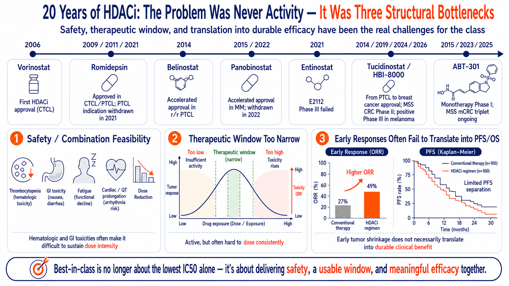
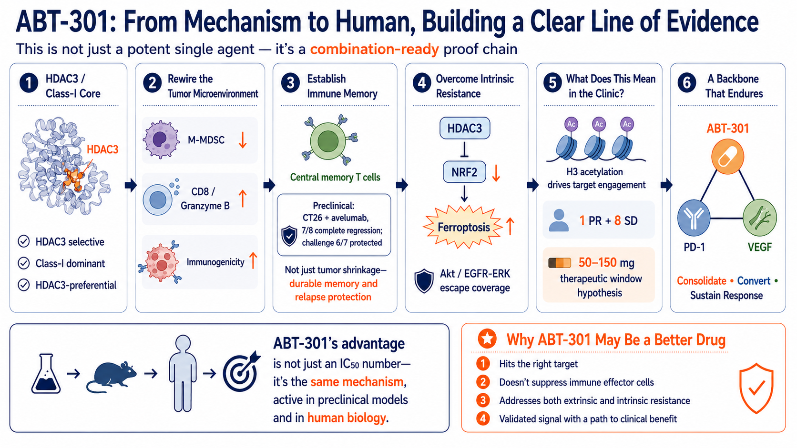
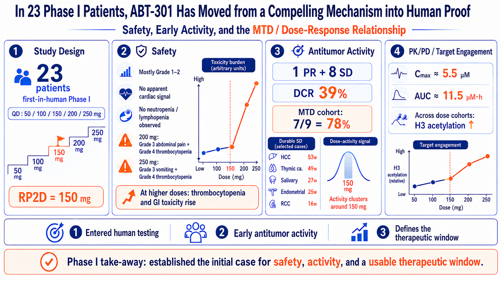

# After 20 Years, Have HDAC Inhibitors Finally Found Their Role? Why ABT-301 Could Become a Next-Generation Combination Backbone

> From two decades of clinical setbacks and Chidamide’s two solid-tumor validations to Anbogen’s bid to unlock pMMR colorectal cancer through a differentiated therapeutic window, immune remodeling, and the HDAC3–NRF2 axis

*Data cutoff: August 5, 2026*

> **11.7 months and 44% have brought HDAC inhibitors back to the solid-tumor stage after two decades. Anbogen’s 66-patient colorectal cancer triplet trial could open a path for ABT-301 to become a next-generation combination backbone.**

Two numbers — 11.7 months and 44% — have reset the conversation around HDAC inhibitors in solid tumors. In July 2026, HUYABIO reported topline Phase III results for HBI-8000 (Chidamide/tucidinostat) plus nivolumab in advanced melanoma. Across 404 patients in 15 countries, median progression-free survival (PFS) reached 11.7 months versus 7.4 months in the control arm, meeting the primary endpoint. The full hazard ratio, safety profile, overall survival (OS), and subgroup analyses have yet to be reported.

CAPability-01 had already provided another important proof point. In MSS/pMMR colorectal cancer, the Chidamide, sintilimab, and bevacizumab triplet delivered a 44% objective response rate (ORR) and a median PFS of 7.3 months. Together, the two studies have put HDAC inhibition back on the map in solid tumors.

That does not mean ABT-301 is de-risked. The story now comes down to three questions: Has Chidamide reduced the class risk for HDAC inhibitors? Can ABT-301 translate a differentiated therapeutic window into a next-generation combination backbone in its 66-patient pMMR colorectal cancer triplet study? And, if it can, can that biology travel across cold tumors and partner therapies?

## 1. The HDACi Problem Was Never Lack of Activity — It Was Lack of Durability and Combinability

HDAC inhibitors can reactivate gene programs silenced by cancer while influencing the cell cycle, protein stability, angiogenesis, and immune signaling. Since vorinostat became the first FDA-approved HDAC inhibitor in 2006, romidepsin, belinostat, and panobinostat have validated the class in hematologic malignancies. What the field has struggled to do is carry that success into solid tumors.

Over the past two decades, the class has repeatedly run into three walls. First, bone-marrow suppression, fatigue, nausea, diarrhea, thrombocytopenia, and cardiac risk can drive dose reductions or discontinuation. Second, with earlier broad-spectrum agents, the active exposure often sits uncomfortably close to the toxicity ceiling, making combinations hard to sustain. Third, early tumor shrinkage has not reliably translated into durable disease control or survival benefit.

Two Phase II studies of vorinostat plus pembrolizumab capture the problem. In randomized NSCLC, ORR rose from 28% to 44%, but PFS did not improve (4.3 vs. 4.5 months), and 49% of patients required a vorinostat dose reduction. In a separate metastatic squamous-cell carcinoma study, the combination produced a 26% ORR and a 9.7-month median DOR, yet 66% of patients required dose reduction or interruption because of vorinostat toxicity and 39% permanently discontinued treatment.

Solid tumors also bring additional barriers: abnormal vasculature, hypoxia, fibrotic stroma, tumor heterogeneity, T-cell exclusion, and myeloid suppression. Opening chromatin does not automatically get immune cells into the tumor, and a higher response rate does not necessarily mean the response will last.

The missing piece, then, is not another mechanism diagram. It is an HDAC inhibitor that can convert multi-layered biology into durable clinical benefit at a tolerable exposure — and remain on board long enough to work with other backbone therapies.

*Figure 1 | Three barriers have constrained HDAC inhibitors in solid tumors for two decades: safety and combinability, a narrow therapeutic window, and the failure of early responses to consistently translate into PFS and OS.*

## 2. Chidamide Has Reopened the Class — and Raised the Bar

For clarity, Chidamide is the same active molecule as tucidinostat; HUYABIO uses the HBI-8000 code in its ex-Greater China clinical program. The drug primarily inhibits HDAC1, HDAC2, HDAC3, and HDAC10. It was developed by Chipscreen Biosciences, which licensed rights outside Greater China to HUYABIO in 2006.

Its importance in solid tumors rests on two complementary proof points: CAPability-01 asked whether HDAC inhibition could help turn an immunologically cold tumor more responsive, while HBI-8000-303 asked whether that concept could hold up in a global confirmatory trial.

First proof point: opening an immunotherapy-resistant MSS colorectal cancer population

CAPability-01 enrolled patients with MSS/pMMR colorectal cancer after at least two prior lines of therapy. Among 25 patients treated with Chidamide, sintilimab, and bevacizumab, ORR was 44% and median PFS was 7.3 months. In the 23-patient Chidamide plus sintilimab arm, ORR was 13% and median PFS was 1.5 months.

The read-through is important: MSS colorectal cancer may require three barriers to be addressed at once. Bevacizumab helps normalize abnormal vasculature, Chidamide remodels the epigenetic and immune microenvironment, and PD-1 blockade releases the immune brake. Tumor RNA analyses showing greater CD8 T-cell infiltration in the triplet arm provide biological support for that treatment logic.

The caveats are just as important. The triplet arm included only 25 patients, so the 44% ORR still needs validation in larger, multi-regional studies. Proteinuria, thrombocytopenia, neutropenia, anemia, diarrhea, and treatment-related deaths also make clear that efficacy came with meaningful hematologic and combination-treatment burden.

Second proof point: a 4.3-month PFS gain in global Phase III melanoma

HBI-8000-303 then took the concept into a global randomized Phase III study of 404 patients with advanced melanoma. Median PFS was 11.7 months with HBI-8000 plus nivolumab versus 7.4 months in the control arm — a 4.3-month absolute gain — and the study met its primary endpoint.

That matters because the HDACi-plus-PD-1 thesis has now moved from small proof-of-concept studies into a global confirmatory setting. With approvals in China and Japan and exposure in more than 90,000 patients, Chidamide is one of the most clinically mature benchmarks in the class. Still, topline data are not the final word: the full hazard ratio, safety dataset, OS, and subgroup analyses remain pending.

Chidamide’s biggest contribution is class-level de-risking. It shows that HDAC inhibition can add clinical value in solid tumors and, in doing so, raises the bar for the next generation. The benchmark now goes well beyond ORR: sustained dose intensity, dose-reduction and discontinuation rates, DOR, the shape of the PFS tail, and human immune biomarkers all matter. Those unanswered questions are where ABT-301 has room to differentiate.

*Figure 2 | Chidamide has delivered two solid-tumor proof points: CAPability-01 achieved a 44% ORR in MSS metastatic colorectal cancer, while HBI-8000 plus nivolumab met the primary PFS endpoint in global Phase III melanoma. Hematologic toxicity and combination burden remain key points of comparison.*

## 3. ABT-301’s Differentiation: The Thesis Is the Therapeutic Window, Not ‘16× Potency’

De-risking the class does not de-risk the asset. For ABT-301 to emerge as a best-in-class contender, its in vitro potency has to translate into three clinically meaningful advantages: a wider therapeutic window, a more combination-friendly immune profile, and an additional route to address tumor resistance.

1. Therapeutic window: potency only matters if it translates

ABT-301 is an oral HDAC1/2/3 inhibitor with a class I focus, particularly on HDAC3. In Anbogen’s assay, its HDAC3 IC50 was 6.6 nM — about one-sixteenth that of Chidamide. That is not, by itself, evidence of a better drug. The clinically relevant question is whether ABT-301 can achieve sufficient target engagement at a lower, tolerable exposure and still preserve dose intensity once PD-1 and anti-VEGF therapy are added.

2. Immune remodeling: suppress the suppressors, preserve the effectors

Preclinical data suggest that ABT-301 can reduce monocytic myeloid-derived suppressor cells while increasing CD8 T cells and granzyme B. In the CT26 cold-tumor model, ABT-301 plus avelumab drove complete tumor regression in 7 of 8 animals; after rechallenge, 6 of 7 remained tumor-free, supporting a T-cell-memory hypothesis. For a combination backbone, that is the more important question: can an early response become durable control?

3. Resistance biology: extend the role beyond the tumor microenvironment

ABT-301 also targets a second biological axis: HDAC3–NRF2–ferroptosis. In KRAS-mutant pancreatic cancer with elevated NRF2 activity, NRF2 activates defenses such as NQO1, SLC7A11, and GPX4 that help tumor cells withstand oxidative stress from gemcitabine. Anbogen’s preclinical data suggest ABT-301 may suppress downstream NRF2 signaling, increase iron-dependent lipid peroxidation, and enhance tumor control with gemcitabine.

Taken together, these three mechanisms create a differentiated development thesis — but they remain hypotheses until proven in patients. A best-in-class claim will not be earned by a 6.6 nM IC50, a single animal model, or a compelling mechanism graphic. It will be earned if human combination studies show tolerability, reproducible efficacy, and durable benefit.

*Figure 3 | ABT-301’s differentiation thesis links HDAC3 targeting, immune-microenvironment remodeling, and resistance biology to human exposure and, ultimately, combination-treatment validation.*

> **ABT-301’s differentiation is not a single 6.6 nM figure. It is whether the therapeutic window, immune remodeling, and resistance-reversal mechanisms can translate into clinically verifiable benefit in humans.**

## 4. Phase I: 23 Patients Put the Mechanism Into Humans — Enough to Advance, Not Enough to Call the Outcome

ABT-301’s first-in-human Phase I study enrolled 23 patients with advanced solid tumors and tested once-daily monotherapy doses from 50 to 250 mg. The maximum tolerated dose (MTD) was 150 mg. Most adverse events were Grade 1–2; Grade 3 abdominal pain and Grade 4 thrombocytopenia emerged at 200 mg, while Grade 3 vomiting and Grade 4 thrombocytopenia occurred at 250 mg. In other words, platelet and gastrointestinal toxicity became more limiting at the top end of the dose range. The study did not highlight the cardiac abnormalities, neutropenia, or lymphopenia often associated with the class, although the sample remains small.

On efficacy, 1 of 23 patients achieved a partial response and 8 had stable disease, for an overall disease control rate of approximately 39%. The partial response occurred in sweat-gland ductal carcinoma and lasted 24 weeks. Five other patients maintained disease control for at least 16 weeks, including hepatocellular carcinoma for 53 weeks and thymic carcinoma for 49 weeks. At 150 mg, 1 of 9 patients achieved a partial response and 6 had stable disease, for a DCR of approximately 78%. Increased histone H3 acetylation was observed across dose cohorts.

What does Phase I establish? Three things. First, ABT-301 achieved measurable target engagement in humans. Second, it produced early — and in some cases durable — antitumor signals across multiple tumor types. Third, it identified a dose range that can now be optimized in combination studies for finding recommended phase 2 dose (RP2D). What it does not establish is comparative efficacy: a 23-patient, single-arm, mixed-tumor Phase I cannot prove superiority over another HDAC inhibitor. Its value is that it earns ABT-301 the right to move into the next test.

*Figure 4 | Phase I established the human foundation for ABT-301 — safety, preliminary activity, target engagement, and a workable dose range — but not yet comparative proof.*

## 5. The Triplet Is the Inflection Point: Four Gates Matter More Than One ORR Number

Anbogen is working with BeOne Medicine on a global Phase Ib/II triplet study of ABT-301, tislelizumab, and bevacizumab. The study plans to enroll approximately 66 patients in Taiwan and Australia with pMMR/non-MSI-H advanced colorectal cancer after at least two prior lines of therapy. It is testing once-daily and every-12-hour ABT-301 schedules, with the near-term goal of defining a recommended Phase II dose that can be maintained over time before moving into efficacy and durability readouts.

Each drug has a distinct job. Bevacizumab helps normalize tumor vasculature and improve immune-cell access. ABT-301 is intended to remodel the epigenetic and immune microenvironment, reduce suppressive myeloid cells, and increase T-cell activity. Tislelizumab releases the PD-1 brake. The design builds directly on the biological logic of CAPability-01; the key question, however, is not whether another triplet can be assembled, but whether ABT-301 can make the combination more sustainable.

Gate 1 is combinability: Grade ≥3 thrombocytopenia and GI toxicity, dose reductions, interruptions, permanent discontinuations, and the relative dose intensity patients can actually maintain. Gate 2 is reproducible efficacy: confirmed partial responses, depth of tumor shrinkage, DCR, consistency across sites, and activity in heavily pretreated patients and those with liver metastases. CAPability-01’s 44% ORR is a useful external reference, but differences in patient mix, line of therapy, and baseline risk make a simple cross-trial comparison inappropriate.

Gate 3 is durability: DOR, the proportion of responses still ongoing at 6 and 12 months, and whether the PFS curve develops a meaningful tail. Gate 4 is human mechanistic validation. If biopsies or peripheral blood show lower suppressive myeloid cells, higher CD8 T-cell infiltration and granzyme B, expansion of memory T-cell populations, and a relationship between histone acetylation and clinical benefit, ABT-301 could move from being the ‘third drug’ in a triplet to a reusable combination backbone across tumor types and partner therapies.

A headline ORR will not be enough to validate the backbone thesis. The real bar is four things happening together: patients can stay on treatment, efficacy is reproducible, responses last, and the mechanism can be measured in humans. The study is ongoing, and actual enrollment and initial clinical data have not yet been disclosed.

*Figure 5 | The pMMR colorectal cancer triplet creates four sequential value inflection points: combinability, reproducible efficacy, durability, and human mechanistic validation — the evidence needed to determine whether ABT-301 can become a true combination backbone.*

> **The triplet does not pass on response rate alone. Combinability, reproducible efficacy, durability, and human mechanistic validation must all be demonstrated.**

## 6. ABT-301’s Market Expansion Path: Set the Valuation Floor, Add Cross-Tumor Optionality, Earn the Platform Premium

Anbogen chose MSS/pMMR colorectal cancer as ABT-301’s first human triplet battleground because the clinical hurdle is high — and therefore highly informative. Success here would provide one of the clearest tests of whether ABT-301 can function as a backbone across partner therapies and then expand into other hard-to-treat tumors.

Layer 1: MSS colorectal cancer sets the valuation floor

Roughly 95% of metastatic colorectal cancers are pMMR/non-MSI-H and generally respond poorly to PD-1 monotherapy. If the ABT-301 triplet establishes credible human proof of concept, it could open a late-line colorectal cancer opportunity estimated at roughly US$9.0–9.5 billion and show that PD-1, PD-L1, and PD-1/VEGF bispecific therapies can be extended into an immunologically resistant population. This is the closest-in and most tangible layer of ABT-301’s valuation today.

Layer 2: pancreatic and brain tumors add cross-tumor optionality

Pancreatic cancer sits at the intersection of KRAS-driven biology, dense stroma, MDSC-mediated suppression, chemotherapy resistance, and strong HDAC3 dependence. Revolution Medicines’ daraxonrasib recently delivered significant OS and PFS improvements versus standard chemotherapy in the Phase III RASolute 302 study, potentially reshaping future treatment guidelines. If ABT-301 can weaken tumor defenses through the HDAC3–NRF2–ferroptosis axis, it may complement pan-RAS inhibitors and become part of a next-generation RAS-targeted combination strategy in a pancreatic cancer market projected to reach approximately US$12.05 billion.

Brain tumors represent a higher-risk, higher-upside option. Anbogen’s preclinical data show an approximately 40% brain-to-blood concentration ratio for ABT-301 — about four times the BBB-penetration benchmark cited for traditional HDAC inhibitors — together with inhibitory activity across multiple glioblastoma models. The associated brain-tumor treatment market is estimated at roughly US$8 billion. But total drug concentration in an animal brain is not the same as free-drug exposure or target engagement in the human CNS. Until human CNS pharmacokinetics and intracranial biomarkers are available, this opportunity should remain outside the core valuation.

Layer 3: repeatable success across cold tumors and modalities creates the platform premium

Platform value is not created by listing more indications; it is created by repeatability. If ABT-301 can generate benefit with different PD-1, PD-L1, PD-1/VEGF bispecific antibodies, T-cell engagers, cancer vaccines, or CAR-T therapies — and do so across multiple cold tumors — the asset could evolve from a single drug into a true Combination Backbone. The broader treatment need in ICI-refractory and cold tumors is estimated at roughly US$96 billion, providing the strategic backdrop for that platform opportunity.

Those market figures are context, not ABT-301’s directly addressable market and not a revenue forecast. The asset still has to de-risk each clinical milestone with data before the next layer of value can be underwritten.

The value-unlocking sequence is therefore straightforward: establish human proof of concept in MSS colorectal cancer; show that the biology travels into pancreatic cancer or another tumor type; then demonstrate repeatability with a second partner therapy. Each step increases the potential upside, but unproven optionality should be discounted accordingly.

*Figure 6 | ABT-301’s value-unlocking path: MSS colorectal cancer sets the valuation floor; pancreatic and brain tumors add cross-tumor optionality; and repeatable success with multiple partner therapies is what ultimately supports a platform premium. Market figures are shown for demand context only.*

## Conclusion: Chidamide Has De-Risked the Class. ABT-301 Still Has to De-Risk the Asset

Twenty years ago, HDAC inhibitors competed on potency and maximum tolerated dose. Today, the winning profile looks very different: a workable therapeutic window, long-term usability, preservation of immune effector cells, and the ability to pair cleanly with the right partner therapy.

Chidamide has already done something important for the field. CAPability-01 established the triplet concept in pMMR colorectal cancer, while the global Phase III HBI-8000 program moved HDAC inhibition plus PD-1 blockade into a confirmatory setting. That de-risks the class — but it does not de-risk ABT-301.

For ABT-301, three questions now matter most. Can it maintain dose intensity in the triplet? Can it generate reproducible, durable responses in pMMR colorectal cancer? And can human biomarkers line up with clinical benefit in a way that validates the mechanism? If the answer to all three is yes, ABT-301 could move from a promising sensitizer to a true combination backbone. A second tumor type and a second partner therapy would then be the evidence needed to turn the asset story into a platform story.

> **Chidamide has validated the class; ABT-301 must prove asset-level differentiation with human triplet data, then validate the platform with a second tumor type and a second partner therapy.**

## References

1. [HUYABIO International Delivers Significant Landmark Phase 3 Results in Advanced Melanoma](https://huyabio.com/huyabio-international-delivers-significant-landmark-phase-3-results-in-advanced-melanoma/)

2. [Combined anti-PD-1, histone deacetylase inhibitor and anti-VEGF treatment in MSS/pMMR colorectal cancer (Nature Medicine, CAPability-01)](https://www.nature.com/articles/s41591-024-02813-1)

3. [Phase I first-in-human trial of ABT-301, an oral pan-HDAC inhibitor in patients with advanced solid tumors (JCO 2023 abstract e15137)](https://ascopubs.org/doi/abs/10.1200/JCO.2023.41.16_suppl.e15137)

4. [Imofinostat - NCI Drug Dictionary](https://www.cancer.gov/publications/dictionaries/cancer-drug/def/imofinostat)

5. [Anbogen Therapeutics - ABT-301 clinical and AACR updates](https://anbogen.com/en/news/cCCcD7dA6dcf)

6. [ClinicalTrials.gov: ABT-301 + Tislelizumab + Bevacizumab in pMMR/non-MSI-H colorectal cancer](https://clinicaltrials.gov/study/NCT07244705)

7. [Chipscreen Biosciences - Chidamide/Tucidinostat development history](https://www.chipscreen.com/en/news/company-news/1178.html)

8. [Phase II randomized trial of first-line pembrolizumab and vorinostat in metastatic NSCLC: final results](https://ascopubs.org/doi/10.1200/JCO.2023.41.16_suppl.9125)

9. [Efficacy of pembrolizumab and vorinostat combination in patients with recurrent and/or metastatic squamous cell carcinomas: a phase 2 basket trial](https://www.nature.com/articles/s43018-025-01004-2)

10. [Anbogen Therapeutics Pre-TPEx Investor Presentation (2026)](https://mopsov.twse.com.tw/nas/STR/778420260429E001.pdf)

11. [Credence Research: Global Checkpoint Inhibitor Refractory Cancer Drugs Market](https://www.credenceresearch.com/report/checkpoint-inhibitor-refractory-cancer-market)

12. [Pancreatic Cancer Market Size and Forecase 2026-2035 (Research Nester)](https://www.researchnester.com/reports/pancreatic-cancer-market/5299)

13. [Brain Cancer Market Trends for 2026 (Towards Healthcare)](https://www.towardshealthcare.com/insights/brain-cancer-market-sizing)

14. [Daraxonrasib Demonstrates Unprecedented Overall Survival Benefit in Pivotal Phase 3 RASolute 302 Clinical Trial in Patients with Metastatic Pancreatic Cancer](https://ir.revmed.com/news-releases/news-release-details/daraxonrasib-demonstrates-unprecedented-overall-survival-benefit/)

### Disclaimer

This article analyzes drug mechanisms, clinical development, and industry trends. The safety and efficacy of the ABT-301 triplet in humans remain under evaluation in the ongoing Phase I/II study. Preclinical findings should not be interpreted as evidence of human efficacy, and market-size estimates are not equivalent to directly addressable market or revenue forecasts. Nothing in this article constitutes investment advice. This article does not constitute medical advice.
