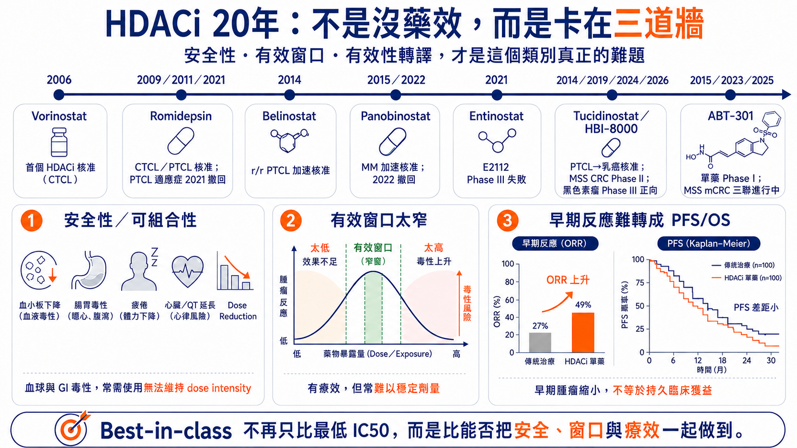
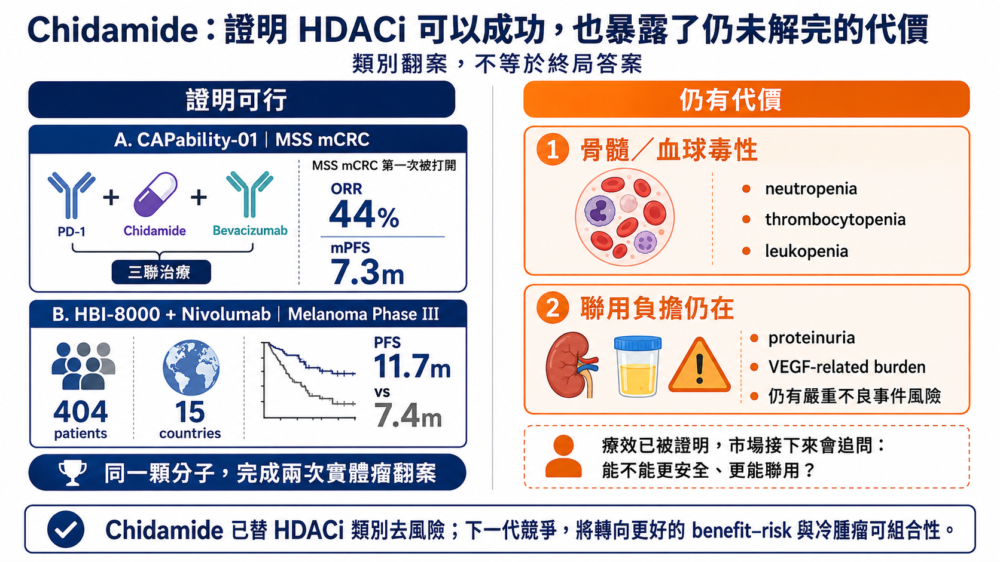
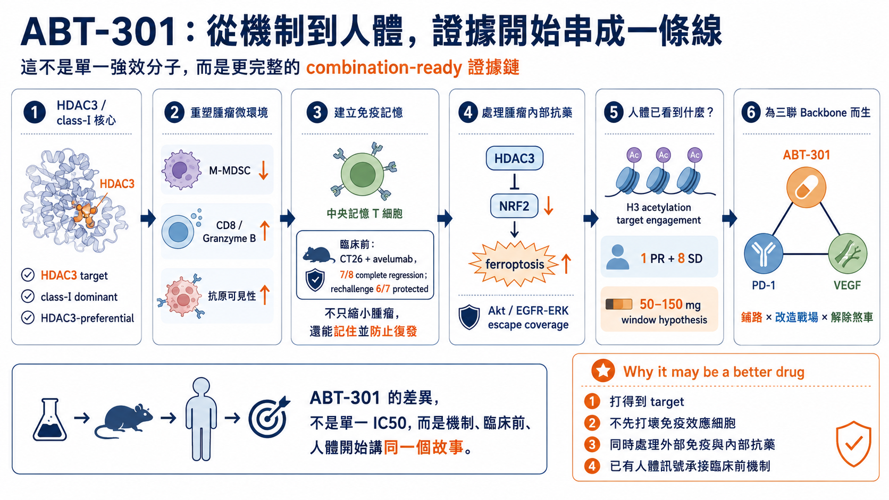
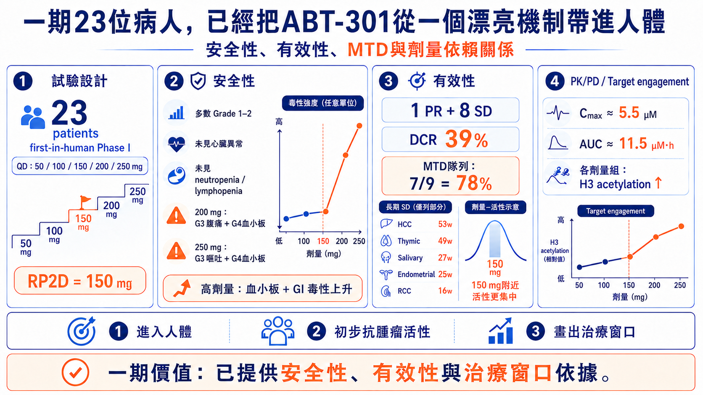
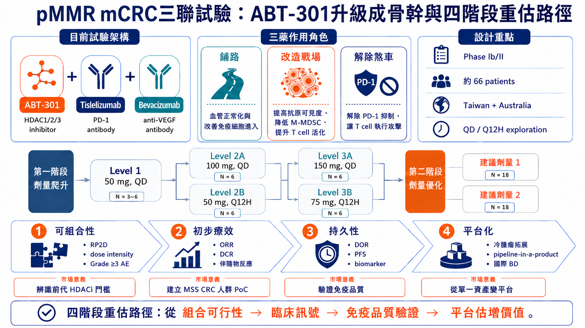
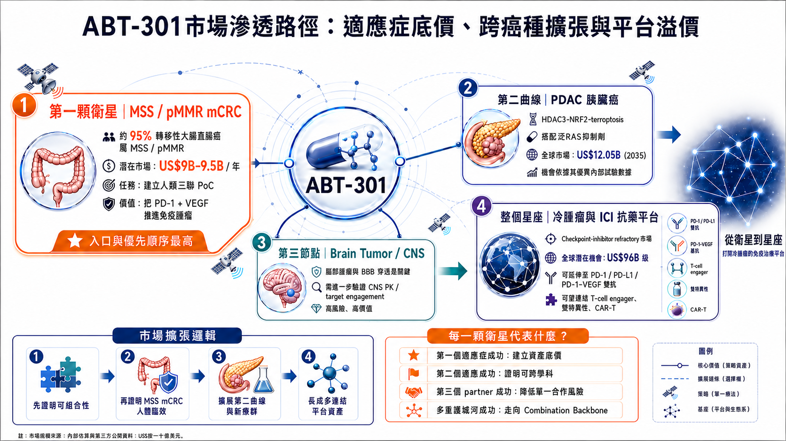

# 20年後，HDAC抑制劑終於找到真正的位置？ABT-301能否成為下一代聯合治療骨幹

> 從二十年臨床卡關 、Chidamide（西達本胺）兩項實體瘤驗證，到安邦如何以治療窗口、免疫重塑與HDAC3–NRF2路徑，挑戰pMMR大腸癌

*資料基準日｜2026年8月5日*

> **11.7個月、44%，讓沉寂20年的HDAC抑制劑重回到實體瘤舞台。安邦ABT-301的66人的大腸癌三聯試驗打開下一代HDAC抑制劑成為聯合治療骨幹的可能**

11.7個月與44%，是HDAC抑制劑二十年實體瘤開發的兩個新座標。2026年7月，HUYABIO公布HBI-8000（即Chidamide／西達本胺）加Nivolumab治療晚期黑色素瘤的全球第三期初步結果：404位病人、15個國家，聯合組中位無惡化存活期為11.7個月，對照組7.4個月，主要終點達標；完整風險比、安全性、整體存活期與次族群資料仍待發表。

更早之前，CAPability-01以Chidamide、Sintilimab與Bevacizumab治療MSS／pMMR大腸直腸癌，三聯組客觀緩解率達44%，中位無惡化存活期7.3個月。這兩項研究把HDAC抑制劑重新帶回實體瘤開發的核心舞台。

但「類別重新成立」不等於「ABT-301已經成功」。真正需要拆開的是三層問題：Chidamide是否已替HDAC抑制劑降低類別風險；ABT-301能否用更好的治療窗口，用66位病人的pMMR晚期大腸癌三聯試驗證明成為下一代聯合治療骨幹，打開冷腫瘤與多種藥物聯合的天花板。

## 一、HDAC抑制劑真正卡住的，不是藥效，而是可持續性

HDAC抑制劑能重新打開被癌細胞關閉的基因程式，並同時影響細胞週期、蛋白質穩定、血管生成與免疫反應。自2006年vorinostat獲美國FDA核准後，romidepsin、belinostat與panobinostat也陸續在血液腫瘤證明此類標靶可成藥；問題在於，血液腫瘤的成功始終沒有順利複製到實體瘤。

二十年來主要撞上三道牆。第一，骨髓抑制、疲倦、噁心、腹瀉、血小板下降與心臟風險，常迫使病人降劑量或停藥；第二，早期廣效型藥物的有效劑量過度靠近毒性劑量，一旦加入另一顆主藥，整套方案便難以長期維持；第三，早期縮瘤未必能轉化為更長的疾病控制與存活。

Vorinostat與pembrolizumab的兩項臨床二期研究都指出：HDACi雖可能提高免疫反應，卻未必能轉化為持久獲益。隨機非小細胞肺癌試驗中，聯合組ORR由28%升至44%，但PFS未改善（4.3個月對4.5個月），且49%病人需降低vorinostat劑量。 另一項轉移性鱗狀細胞癌試驗雖取得26%整體ORR與9.7個月中位DOR，但66%因vorinostat毒性減量或中斷、39%永久停藥。

實體瘤還多了異常血管、缺氧、纖維化基質、腫瘤異質性、T細胞被排斥在腫瘤外，以及髓系抑制細胞等障礙。打開染色質，不代表免疫細胞就能進入腫瘤；提高反應率，也不代表反應能持久。

因此，HDAC抑制劑真正缺的從來不是更多機制，而是一款能在可承受暴露下，把多重藥理作用轉成持續臨床利益、並可與其他主藥長期聯用的產品。

*圖1｜HDAC抑制劑二十年真正卡住的三道牆：安全性與可組合性、治療窗口太窄，以及早期反應無法穩定轉化為無惡化存活與整體存活。*

## 二、Chidamide完成類別去風險，但也留下升級空間

Chidamide（西達本胺）其國際非專利名為Tucidinostat，HUYABIO在海外臨床使用HBI-8000代號。四個名稱指向同一活性成分，不應被理解為不同藥物。Chidamide主要抑制HDAC1、2、3與10，由微芯生物開發，大中華區以外權利於2006年授權HUYABIO。

它改變實體瘤敘事，來自兩項互補證據：CAPability-01回答「能否打開冷腫瘤」，HBI-8000-303則回答「能否走到全球確認性試驗」。

第一次驗證：在MSS大腸癌打開免疫治療缺口

CAPability-01納入接受過至少兩線治療的MSS／pMMR（微衛星穩定／錯配修復功能正常）大腸直腸癌病人。Chidamide、Sintilimab與Bevacizumab三聯組25位病人的客觀緩解率為44%、中位無惡化存活期7.3個月；Chidamide加Sintilimab雙聯組23位病人則為13%與1.5個月。

這項結果支持一個關鍵判斷：MSS大腸癌可能必須同時處理三道障礙——Bevacizumab改善異常血管，Chidamide重整表觀遺傳與免疫微環境，PD-1抗體再解除免疫煞車。腫瘤RNA顯示三聯組有較多CD8 T細胞浸潤，也讓這套分工不只停留在臨床數字。

限制同樣清楚：三聯組只有25人，反應率仍待更大、跨地區研究重現；蛋白尿、血小板與中性球下降、貧血、腹瀉及治療相關死亡，也提醒市場，療效改善仍伴隨骨髓與聯用負擔。

第二次驗證：全球黑色素瘤第三期延長4.3個月無惡化存活

HBI-8000-303把訊號推進到404位晚期黑色素瘤病人的全球隨機第三期。HBI-8000加Nivolumab的中位無惡化存活期為11.7個月，對照組7.4個月，絕對延長4.3個月，主要終點達標。

這代表HDAC抑制劑加PD-1抗體的增益，已從小型概念驗證走到全球確認性研究。加上中國、日本核准與逾9萬人使用經驗，Chidamide已成為此類藥物在實體瘤開發中最成熟的臨床標杆之一；但公司尚未公布完整風險比、安全性、整體存活期與次族群結果，現階段仍不宜把初步結果解讀成終局答案。

Chidamide完成的是「類別去風險」：它證明HDAC抑制劑可以在實體瘤產生臨床增益，也把下一代競爭標準拉高。後續不能只比較客觀緩解率，而要比較可維持劑量、降劑量與停藥率、緩解持續時間、無惡化存活曲線是否形成長尾，以及人體免疫生物標記。這些尚未完全解答的問題，才是ABT-301的切入點。

*圖2｜Chidamide（西達本胺）完成兩項實體瘤驗證：CAPability-01在MSS轉移性大腸直腸癌取得44%客觀緩解率；HBI-8000加nivolumab則在黑色素瘤全球第三期達成主要無惡化存活終點，但骨髓毒性與聯用負擔仍需持續比較。*

## 三、ABT-301的差異化：不是「強16倍」，而是臨床窗口

類別已被去風險，不代表單一資產也已被去風險。ABT-301要成立，必須把體外抑制強度轉成三項臨床可驗證的差異：較寬的治療窗口、較好的免疫聯用條件，以及對腫瘤抗藥機制的額外作用。

1. 治療窗口：低抑制濃度只是起點

ABT-301是一款以第一型HDAC、尤其HDAC3為主的口服HDAC1/2/3抑制劑，對HDAC3的半數抑制濃度為6.6 nM，約為Chidamide的1／16。這個數字本身不能證明藥更好；真正價值在於，能否以較低且可耐受的暴露達到足夠標靶作用，並在加入PD-1與抗VEGF藥物後，仍維持劑量強度。

2. 免疫重塑：降低抑制，同時保留攻擊部隊

ABT-301臨床前資料顯示，單核細胞樣髓源性抑制細胞下降，CD8 T細胞與顆粒酶B增加。CT26冷腫瘤模型中，ABT-301與avelumab聯用使8隻動物中7隻完全退縮；重新植入腫瘤後，7隻中6隻仍無腫瘤，支持形成T細胞記憶的假說。這比單次縮瘤更重要，因為聯合治療骨幹最終必須把早期反應轉成持久控制。

3. 抗藥逆轉：從腫瘤外部走進癌細胞內部

另一條路徑是HDAC3–NRF2–鐵死亡。在KRAS突變、NRF2活性較高的胰臟癌中，NRF2會啟動NQO1、SLC7A11與GPX4等防禦，抵抗gemcitabine造成的氧化壓力。安邦資料顯示，ABT-301可能降低NRF2下游訊號，增加鐵與脂質過氧化，進而提升gemcitabine的腫瘤控制。

這三條路徑構成一張完整的差異化地圖，卻仍只是可驗證假說。ABT-301能否成為同類最佳，不能由6.6 nM、單一動物模型或機制圖決定，而要由人體聯合試驗同時證明耐受性、可重現療效與反應持久性。

*圖3｜ABT-301的差異化證據鏈：由HDAC3標靶、免疫微環境與抗藥路徑，逐步連到人體暴露與聯合治療驗證。*

> **ABT-301的差異不在單一6.6 nM，而在能否把治療窗口、免疫重塑與抗藥逆轉，轉成人體可驗證的臨床利益。**

## 四、23位一期病人：人體證據足以推進，但不足以定調

ABT-301首度人體第一期共納入23位晚期實體腫瘤病人，測試50至250 mg每日一次的單藥劑量。最高耐受劑量（MTD, Maximum Tolerated Dose）定為150 mg，多數不良事件為1至2級；200 mg出現3級腹痛與4級血小板減少，250 mg出現3級嘔吐與4級血小板減少，顯示高劑量區間的主要限制仍是血小板與腸胃毒性。試驗未突出顯示同類藥物常見的明顯心臟異常、嗜中性白血球或淋巴球下降，但樣本數仍小。

療效方面，23位病人中有1位部分緩解、8位疾病穩定，整體疾病控制率約39%。部分緩解出現在汗腺導管癌病人，維持24週；另有5位病人的疾病控制至少16週，最長為肝細胞癌53週與胸腺癌49週。在150 mg治療的9位病人中，1位部分緩解、6位疾病穩定，疾病控制率約78%；各劑量組也都觀察到組蛋白H3乙醯化增加。

這批資料支持三項結論：第一，藥物已在人體達到可量測的標靶作用；第二，跨癌種出現初步且部分持久的抗腫瘤訊號；第三，已找到可供聯合試驗探索二期推薦劑量（RP2D, Recommended Phase 2 Dose）的劑量區間。但單臂、23人、混合癌種的第一期試驗，不能證明療效，也不能直接與其他HDAC抑制劑比較。它的真正價值，是讓ABT-301有資格進入下一場考試。

*圖4｜ABT-301第一期人體訊號：已建立安全性、初步活性與治療窗口的推進依據，但尚未形成比較性證據。*

## 五、三聯試驗是決勝點：不只看反應率，還要過四道關

安邦正與BeOne Medicine合作，推進ABT-301、tislelizumab與bevacizumab的全球臨床Ib／II期三聯試驗，預計在台灣與澳洲收案約66位接受過至少兩線治療的pMMR／non-MSI-H晚期大腸直腸癌病人。試驗比較ABT-301每日一次與每12小時一次的給藥方式，先找出可長期維持的建議第二期劑量，再評估初步療效與持久性。

三顆藥的分工清楚：bevacizumab改善異常血管，讓免疫細胞更容易進入腫瘤；ABT-301重塑表觀遺傳與免疫微環境，降低抑制性髓系細胞並提高T細胞活性；tislelizumab解除PD-1免疫煞車。這套設計直接承接CAPability-01，但更重要的不是複製三聯形式，而是證明ABT-301能否提供更好的可持續性。

第一關是可組合性：3級以上血小板與腸胃毒性、降劑量、中斷、永久停藥率，以及實際維持的劑量強度。第二關是療效能否跨中心重現：確認後的部分緩解、縮瘤深度、疾病控制率，並特別觀察肝轉移與多線治療病人。CAPability-01的44%可作外部標杆，但兩項試驗的族群、線別與基線風險不同，不能直接橫向比高低。

第三關是反應能否持久：緩解持續時間、6個月與12個月持續反應率，以及無惡化存活曲線是否形成長尾。第四關是人體是否複製臨床前機制：若腫瘤切片或周邊血液同時顯示抑制性髓系細胞下降、CD8 T細胞浸潤與顆粒酶B上升、記憶T細胞增加，且組蛋白乙醯化與療效相關，ABT-301才可能由三聯中的「第三顆藥」升級為可跨癌種、跨搭配藥物使用的聯合治療骨幹。

因此，一個漂亮的反應率並不足以讓骨幹論成立。真正的及格線是四項條件同時出現：病人能持續用藥、療效可重現、反應夠持久、機制能在人體量化。目前試驗正在進行，實際收案與初步數據仍待公布。

*圖5｜pMMR大腸直腸癌三聯試驗的四階段評估：先證明可組合性，再看療效、持久性與人體機制，決定ABT-301能否升級為聯合治療骨幹。*

> **三聯試驗的及格線不是單一反應率，而是可組合性、可重現療效、持久性與人體機制同時成立。**

## 六、ABT-301市場滲透路徑：適應症底價、跨癌種擴張與平台溢價

安邦把MSS／pMMR大腸癌放在第一個人體三聯戰場，臨床門檻高，卻最能驗證ABT-301能否成為跨主藥使用的骨幹，進一步透過多種難治型腫瘤的跨癌腫擴張，逐步形成。

第一層：MSS大腸直腸癌建立資產底價

約95%的後期轉移性大腸直腸癌屬於pMMR／non-MSI-H，通常對PD-1單藥反應有限。若ABT-301三聯療法建立可信的人體PoC，便可先切入約90至95億美元級的晚期大腸直腸癌市場，並證明它能把PD-1、PD-L1及PD-1／VEGF雙抗帶進原本難以治療的免疫黑區。這將構成ABT-301最接近現階段的資產底價。

第二層：胰臟癌與腦腫瘤提供跨癌種擴張

胰臟癌同時具有KRAS驅動、緻密基質、MDSC壓制與高度化療抗藥，並高度依賴HDAC3。近期Revolution Medicines的Daraxonrasib已在臨床三期RASolute 302試驗中，對比標準化療組，顯著改善整體存活與無惡化存活，可能改變未來胰臟癌的治療指引。ABT-301若能透過HDAC3–NRF2–ferroptosis路徑削弱腫瘤防禦，便可能與泛RAS抑制劑形成互補，成為下一代泛RAS標靶治療的聯合骨幹，滲透未來120.5億美元級的全球胰臟癌治療市場。

腦腫瘤則屬高風險選擇權。公司臨床前資料顯示，ABT-301在動物的腦部／血液濃度比約40%，相對傳統HDACi的血腦障壁穿透力提升400%，並在多個膠質母細胞瘤模型觀察到抑制活性，背後對應約80億美元級的腦腫瘤治療機會。但動物腦部總濃度不等於人體腦內游離藥物暴露，也不能證明腦內標靶作用。在人體中樞藥物動力學與腦內生物標記出現前，不宜先計入主要估值。

第三層：冷腫瘤與其他模態藥物聯用成功，形成平台溢價

真正的平台價值，來自ABT-301能否與不同PD-1、PD-L1、PD-1／VEGF雙抗、T-cell engager、癌症疫苗或CAR-T聯用，並在多種冷腫瘤中重複產生效果。全球ICI抗藥與冷腫瘤治療需求約達960億美元級。當ABT-301能跨癌種、跨partner與跨modality驗證可複製性，它才會從單一資產升級為Combination Backbone，進一步產生平台溢價。

*圖中所預估適應症的全球治療市場的缺口屬於背景需求，ABT-301仍須提出更多具備降低風險的臨床數據，逐步撬開每個去風險的臨床節點，形成多層次堆疊的平台溢價。*

換句話說，ABT-301的價值解鎖順序應是：先以MSS大腸癌證明人體概念，再由胰臟癌或其他癌種驗證機制外推，最後用第二個搭配藥物證明可複製性。越往後，潛在價值越大，但折現率也越高。

*圖6｜ABT-301的價值解鎖路徑：MSS大腸癌建立資產底價，胰臟癌與腦腫瘤提供跨癌種選擇權，多種搭配藥物重現後才形成平台溢價；圖中市場數字僅作需求估算。*

## 結語：Chidamide證明類別，ABT-301必須證明資產

二十年前，HDAC抑制劑競爭的是抑制強度與最大耐受劑量；今天真正決定勝負的，是治療窗口、長期可用性、免疫效應細胞能否保留，以及能否與正確主藥形成穩定組合。

Chidamide已替這個類別完成重要去風險：CAPability-01在pMMR大腸癌建立三聯概念，HBI-8000全球第三期又把HDAC抑制劑加PD-1的增益推進到確認性研究。但類別成功不會自動轉化為ABT-301成功。

ABT-301下一步只看三件事：能否在三聯中維持劑量強度、能否在pMMR大腸癌產生可重現且持久的反應、能否讓人體生物標記與臨床利益指向同一條機制。三項同時成立，它才有資格從有潛力的增敏藥，走向真正的聯合治療骨幹；第二個癌種與第二個搭配藥物再成功，平台故事才算成立。

> **Chidamide證明類別可行；ABT-301必須以三聯人體數據證明資產差異，再由第二個癌種與第二個搭配藥物證明平台。**

## 參考資料

1. [HUYABIO International Delivers Significant Landmark Phase 3 Results in Advanced Melanoma](https://huyabio.com/huyabio-international-delivers-significant-landmark-phase-3-results-in-advanced-melanoma/)

2. [Combined anti-PD-1, histone deacetylase inhibitor and anti-VEGF treatment in MSS/pMMR colorectal cancer (Nature Medicine, CAPability-01)](https://www.nature.com/articles/s41591-024-02813-1)

3. [Phase I first-in-human trial of ABT-301, an oral pan-HDAC inhibitor in patients with advanced solid tumors (JCO 2023 abstract e15137)](https://ascopubs.org/doi/abs/10.1200/JCO.2023.41.16_suppl.e15137)

4. [Imofinostat - NCI Drug Dictionary](https://www.cancer.gov/publications/dictionaries/cancer-drug/def/imofinostat)

5. [Anbogen Therapeutics - ABT-301 clinical and AACR updates](https://anbogen.com/en/news/cCCcD7dA6dcf)

6. [ClinicalTrials.gov: ABT-301 + Tislelizumab + Bevacizumab in pMMR/non-MSI-H colorectal cancer](https://clinicaltrials.gov/study/NCT07244705)

7. [Chipscreen Biosciences - Chidamide/Tucidinostat development history](https://www.chipscreen.com/en/news/company-news/1178.html)

8. [Phase II randomized trial of first-line pembrolizumab and vorinostat in metastatic NSCLC: final results](https://ascopubs.org/doi/10.1200/JCO.2023.41.16_suppl.9125)

9. [Efficacy of pembrolizumab and vorinostat combination in patients with recurrent and/or metastatic squamous cell carcinomas: a phase 2 basket trial](https://www.nature.com/articles/s43018-025-01004-2)

10. [安邦興櫃前法說會簡報 (2026)](https://mopsov.twse.com.tw/nas/STR/778420260429E001.pdf)

11. [Credence Research: Global Checkpoint Inhibitor Refractory Cancer Drugs Market](https://www.credenceresearch.com/report/checkpoint-inhibitor-refractory-cancer-market)

12. [Pancreatic Cancer Market Size and Forecase 2026-2035 (Research Nester)](https://www.researchnester.com/reports/pancreatic-cancer-market/5299)

13. [Brain Cancer Market Trends for 2026 (Towards Healthcare)](https://www.towardshealthcare.com/insights/brain-cancer-market-sizing)

14. [Daraxonrasib Demonstrates Unprecedented Overall Survival Benefit in Pivotal Phase 3 RASolute 302 Clinical Trial in Patients with Metastatic Pancreatic Cancer](https://ir.revmed.com/news-releases/news-release-details/daraxonrasib-demonstrates-unprecedented-overall-survival-benefit/)

### 免責聲明

本文為藥物機制、臨床研發與產業趨勢分析。ABT-301三聯療法的人體安全性與療效，仍待進行中的第一期／第二期試驗驗證；文中臨床前結果不應直接視為人體療效，市場規模亦不等於可及市場或營收預測，本文不構成投資建議。
