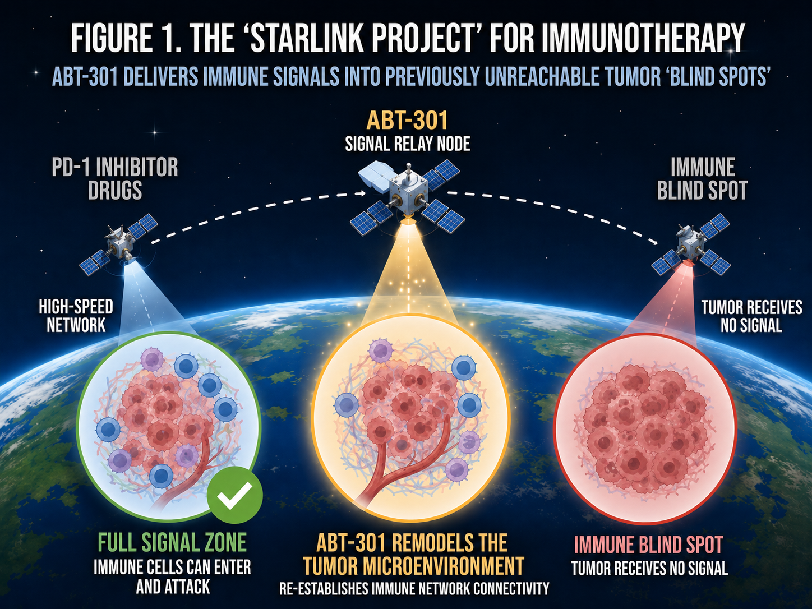
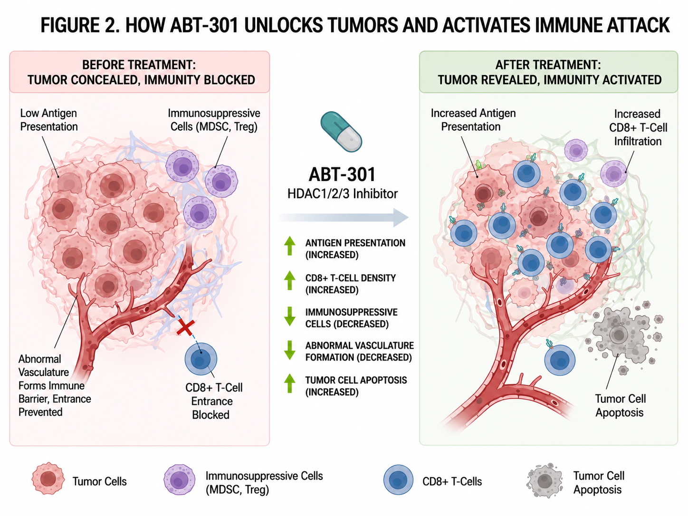
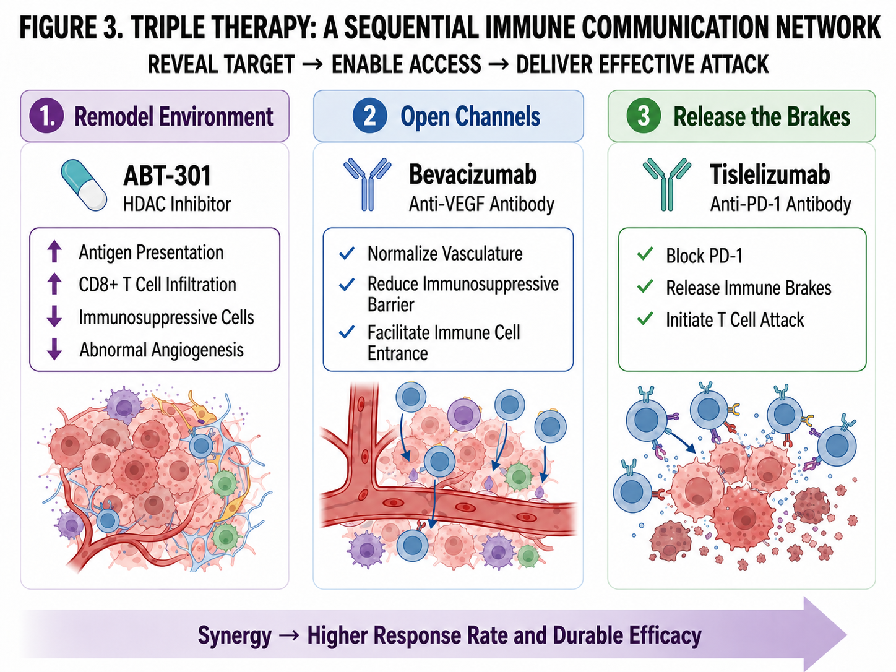
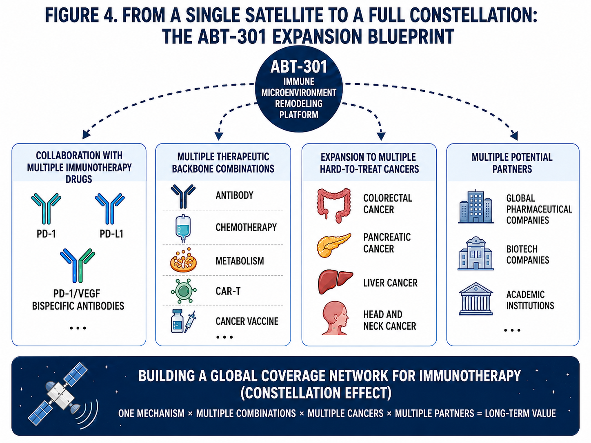
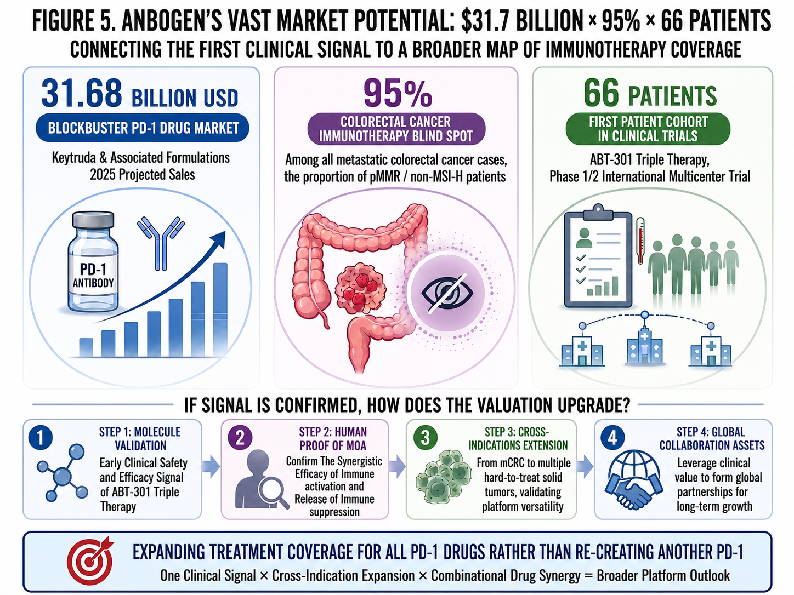

# AnBogen Therapeutics: Building a “Starlink” for Cancer Immunotherapy

> Can a small molecule from Taiwan extend the $30 billion PD-1 ecosystem into the 95% of metastatic colorectal cancer patients still beyond immunotherapy’s reach?

| $30B+ | ~95% | 66 Patients |
| --- | --- | --- |
| PD-1 Blockbuster Ecosystem | of mCRC is pMMR / non-MSI-H | Planned Phase 1/2 Enrollment |

As SpaceX stepped into the public-market spotlight this year, Starlink stood out as the asset generating its most important source of commercial cash flow. Terrestrial broadband already reaches much of the globe, but large pockets remain underserved. Starlink uses a constellation of low-Earth-orbit satellites to bring connectivity to remote regions, ships at sea, disaster zones, and increasingly, aircraft. [1]

Cancer immunotherapy has its own coverage gap.

PD-1 therapies have transformed cancer care, but they do not work across the board. Some tumors are visible to the immune system and readily infiltrated by T cells. Others suppress antigen presentation, exclude immune cells, and build a deeply immunosuppressive microenvironment. The drugs exist. The signal simply cannot get through.

ABT-301, AnBogen Therapeutics’ lead asset, was designed to address that disconnect.

The oral small molecule is intended to remodel the tumor microenvironment and broaden the reach of existing immunotherapies. If its mechanism translates in the clinic, ABT-301 could become a reusable combination partner across multiple drugs and tumor types—a “Starlink” for cancer immunotherapy.

> Starlink extends the reach of broadband. ABT-301 is trying to extend the reach of immunotherapy.

*Figure 1 | A “Starlink” for cancer immunotherapy: ABT-301 is designed to carry immune signaling into tumors that remain beyond the reach of current treatment.*

## 01 | PD-1 Is a Blockbuster Success—But Much of the Market Still Has No Signal

Merck’s Keytruda generated $31.68 billion in global sales in 2025—more than NT$1 trillion from a single product. [2]

AnBogen has selected tislelizumab—marketed as TEVIMBRA/百澤安 by BeOne Medicines—as the PD-1 backbone for its current study. The drug generated $737 million in global sales in 2025, up 19% year over year, and has secured approvals in multiple markets. [3] That gives ABT-301 a real-world combination setting inside an established global immuno-oncology ecosystem. If the study shows repeatable sensitization and tumor-microenvironment remodeling, AnBogen will have a path into a treatment infrastructure that is already operating at scale.

The commercial opportunity, however, extends well beyond tislelizumab. Most major oncology companies already own PD-1 or PD-L1 assets, and many are advancing PD-1/VEGF bispecifics or next-generation immune combinations. What remains scarce is a sensitizing agent that can open cold tumors and expand the addressable patient pool for drugs already on the market. If ABT-301 demonstrates a reproducible human effect, its partnering potential could extend across multiple PD-1/PD-L1 products and combination strategies.

The boundaries of the current relationship are clear. BeOne is supplying study drug so the combination can be tested in patients; the arrangement does not yet include licensing or commercialization. Drug supply is the fuel that gets the first satellite off the ground. A transaction that changes AnBogen’s valuation will require human data strong enough to support a real negotiation.

The real opportunity lies with patients current PD-1 therapies still fail to reach.

About 95% of metastatic colorectal cancers are pMMR/non-MSI-H, a biology that generally responds poorly to immune-checkpoint inhibitor monotherapy. Using GlobalData estimates for second-line-or-later patients across the United States, China, Japan, and the five largest European markets, the annual patient pool is roughly 370,000. Applying reference treatment-pricing assumptions implies a potential market of about $9 billion. [4]

Why are these tumors so difficult? pMMR/non-MSI-H cancers typically carry a lower mutational burden and produce fewer immune-visible antigens. They are also surrounded by abnormal vasculature and suppressive myeloid cells. T cells struggle to recognize the target—and often cannot enter the tumor even when they do. Simply increasing the PD-1 dose will not solve that problem. The immune-excluding microenvironment has to be changed first.

The $9 billion figure is an upper-bound market scenario, not a revenue forecast. Patient selection, line of therapy, competing regimens, pricing, treatment duration, clinical success, and commercial rights will all narrow the opportunity. Even after those discounts, the market remains fundamentally different from a small orphan indication: it is a large, long-standing population that PD-1 therapy has largely left outside its coverage area.

Chemotherapy and targeted agents remain the main treatment backbone for these patients, with fewer options and diminishing benefit in later lines. Immunotherapy has repeatedly struggled here, which is precisely why combinations capable of changing the tumor microenvironment are drawing attention. AnBogen is entering one of the hardest markets first. That raises clinical risk—but success would carry far more weight across other cold tumors.

Nearly every major oncology company already has a PD-1 asset or is betting on the next generation of PD-1/VEGF combinations. What they lack is a partner that can unlock new tumor types for those franchises. If ABT-301 can do that, it will naturally move onto the partnering radar of multiple companies. That is where its capital-markets upside begins.

## 02 | How ABT-301 Could Reconnect a Cold Tumor?

ABT-301, also known as imofinostat, is an oral HDAC1/2/3 inhibitor. AnBogen describes it as an epigenetic tumor-microenvironment reprogrammer—a role intended to distinguish it from conventional HDAC inhibitors. [4]

Epigenetics can be thought of as the set of switches that determines which genes are read and which remain silent. Cancer cells can manipulate those switches without changing their DNA sequence, reducing antigen presentation, escaping immune recognition, and creating conditions that prevent T cells from entering or surviving. In preclinical studies, ABT-301 in combo with PD-1 blockade increased antigen presentation, enhanced CD8+ cytotoxic T-cell infiltration and activity, reduced monocytic myeloid-derived suppressor cells, and influenced apoptosis, angiogenesis, and tumor metabolism. Together, these effects point toward one goal: converting a tumor that is invisible, inaccessible, and unresponsive into one that immunotherapy can engage. ABT-301 was built from the outset as a combination asset. If it can expand the reach of multiple approved drugs, investors will view it less as a single molecule and more as a platform node. Starlink brings connectivity to places the terrestrial network cannot reach. ABT-301 is trying to make existing cancer therapies work where they currently cannot.

Two data points in AnBogen’s research package stand out. ABT-301 showed an HDAC3 IC50 of 6.6 nM versus 106.9 nM for the comparator chidamide—roughly a 16-fold difference. In an anti-PD-1 combination model, 2 of 7 animals in the ABT-301 arm achieved complete responses, versus 0 of 8 in the chidamide arm. [6] The first result speaks to molecular potency. The second suggests the possibility of deeper antitumor activity in vivo.

A complete response in a mouse is not the same as an objective response in a patient. These findings do not prove clinical efficacy; they provide a biologically credible reason to test the combination. The next questions are whether tumors shrink in patients, whether the benefit lasts, and whether human samples show the expected immune-microenvironment changes.

Safety is the other gate. AnBogen’s first-in-human monotherapy study enrolled 23 participants, and company materials reported no clear signal of neutropenia or cardiac toxicity—issues often watched closely with the HDAC class. [4] That provides a rationale for moving into triple therapy, but monotherapy safety does not guarantee that three drugs can be combined safely. Bevacizumab and PD-1 antibodies carry their own adverse-event profiles, and the therapeutic window will have to be established again in the 66-patient study.

HDAC inhibitors have been used clinically for years, including approved indications in hematologic malignancies. Results in solid tumors have been inconsistent, while marrow suppression, fatigue, and other systemic toxicities have constrained prolonged combination use. AnBogen is therefore focusing ABT-301 on HDAC1/2/3 and microenvironment remodeling, with the goal of preserving the sensitizing effect of an oral small molecule while identifying a dose that can coexist with PD-1 and anti-VEGF therapy over time. That is the most practical product test for the triple regimen.

*Figure 2 | ABT-301 is designed to reprogram the tumor microenvironment—making the tumor visible again and reactivating an immune response.*

## 03 | Triple Therapy: Reprogram the Environment, Open the Vasculature, Release the Brakes

AnBogen is advancing a triple regimen of ABT-301, bevacizumab, and tislelizumab.

ABT-301 is intended to reprogram the epigenetic and immune microenvironment. Bevacizumab inhibits VEGF, addressing abnormal vasculature and VEGF-driven immune suppression. Tislelizumab blocks PD-1 and releases the brakes on T-cell activity.

> First, make the tumor visible again.
> Then, create a path for immune cells to enter.
> Finally, remove the restraints on T-cell attack.

AnBogen has launched an international multicenter Phase 1/2 study in Taiwan and Australia, with planned enrollment of 66 patients with locally advanced or metastatic pMMR/non-MSI-H colorectal cancer. The trial is evaluating safety, tolerability, a recommended Phase 2 dose, and preliminary efficacy. The first patient was treated in Australia in November 2025, and BeOne is supplying tislelizumab under a clinical drug-supply arrangement. [4] The study now has to answer four questions: Can a workable dose be established? Are tumor responses reproducible? Do they last? And do patient samples show the expected changes in the immune microenvironment?

The early portion of the study will escalate dose levels to determine whether the three agents can be administered together before moving into expansion. Investigators will look beyond tumor shrinkage to depth of response, duration of response, and progression-free survival, while monitoring hematologic toxicity, infection, bleeding, hypertension, proteinuria, and immune-related adverse events. Mechanistic synergy could produce deeper activity; overlapping toxicity could erase that value just as quickly.

Objective response rate will likely grab the first headline, but durability will determine the program’s longer-term value. A tumor that shrinks briefly and then progresses will not support a compelling combination strategy. If duration of response and progression-free survival improve in parallel—and treatment discontinuations are not driven by toxicity—the regimen will have a stronger case for advancing into a larger randomized trial. AnBogen’s future data package needs to tell all three stories together.

A 66-patient study is not a pivotal trial, but it is large enough to reveal the first meaningful clinical profile of ABT-301. If responses appear across patients and centers, and paired biopsies show increased antigen presentation and CD8+ T-cell infiltration, AnBogen will have more than a mechanistic narrative—it will have a clinically weighted dataset that global partners can begin to diligence.

Patient mix will matter. Prior therapies, baseline tumor burden, and the proportion of patients with liver metastases can materially affect response rates. A topline ORR alone will not be enough; baseline characteristics, duration of response, and reasons for discontinuation must be read together. In an early-stage study, one or two additional responders or progressors can move the percentage sharply, which makes consistency across centers and over time especially important.

*Figure 3 | A sequential network of the ABT-301 triple therapy: reprogram the microenvironment, improve immune access, and release the immune brake.*

## 04 | The Same Path Has Already Produced a Human Signal

ABT-301’s triple-combination strategy is not starting without clinical precedent.

The randomized Phase 2 CAPability-01 study, published in Nature Medicine in 2024, combined another HDAC inhibitor—chidamide—with the PD-1 antibody sintilimab and bevacizumab in chemotherapy-refractory MSS/pMMR metastatic colorectal cancer. The study placed a regimen similar to AnBogen’s directly into patients and paired the clinical readout with tumor-immune profiling. [5] The results support the therapeutic concept, but they cannot be used as a proxy for ABT-301’s probability of success.

The numbers were notable. The triplet achieved an 18-week progression-free survival rate of 64.0% versus 21.7% for the doublet, an objective response rate of 44.0% versus 13.0%, and median progression-free survival of 7.3 months versus 1.5 months. [5] Tumor analyses also showed greater CD8+ T-cell infiltration and a more activated immune microenvironment. This is the closest human evidence to AnBogen’s current design and moves the “reprogram first, amplify PD-1 second” thesis beyond animal models.

The safety trade-off also matters. Common adverse events included proteinuria, thrombocytopenia, leukopenia, neutropenia, anemia, and diarrhea, and the study reported two treatment-related deaths. That leaves room for ABT-301 to differentiate. If AnBogen can preserve a meaningful efficacy signal while delivering a cleaner safety profile, convenient oral dosing, or a more precise biomarker strategy, the asset could still stand out to potential partners.

CAPability-01 used chidamide; AnBogen’s study uses ABT-301. The trials are independent and have not been compared head to head. CAPability-01 validates the pathway—not AnBogen’s product. ABT-301 must answer the same efficacy and safety questions with its own 66 patients.

When early data emerge, one key question will be whether responses cluster in a narrow subset of patients. If activity is confined to a particular biomarker group or to patients with lower disease burden, the next study may need a tighter enrollment strategy. If responses are more broadly distributed, the platform case becomes stronger. This is why tumor-sample analysis matters: it can show not only whether the drug works, but who is most likely to benefit—and prevent later trials from enrolling patients who are unlikely to respond.

AnBogen now has to show that ABT-301 can preserve the mechanistic synergy of the triplet while establishing a safety window suitable for sustained combination therapy. If it succeeds, ABT-301 could move from “another HDAC inhibitor” to a new sensitizing backbone for cancer immunotherapy.

## 05 | The First Market Is $9 Billion. The Real Upside Is the “Constellation Effect”

Starlink becomes more valuable as more satellites are added and more use cases come online. ABT-301 faces the same valuation divide.

The first coverage area is the estimated $9 billion second-line-or-later pMMR/non-MSI-H metastatic colorectal cancer market.

The second layer is whether ABT-301 can work with multiple PD-1 or PD-L1 antibodies rather than remaining tied to a single product.

The third is whether the asset can move beyond immune sensitization into reversal of chemotherapy resistance. AnBogen has reported preclinical data in KRAS-mutant pancreatic cancer suggesting that ABT-301 may improve chemotherapy sensitivity through the HDAC3–NRF2 axis. [6]

The fourth is expansion into brain, liver, head-and-neck, and other solid “cold” tumors that respond poorly to immunotherapy—potentially opening access to a checkpoint-inhibitor-refractory cancer market estimated at approximately $95.5 billion. [7]

If the same mechanism can be reproduced across drugs, treatment backbones, and tumor types, ABT-301 could become a tumor-microenvironment reprogramming platform: one mechanism × multiple drugs × multiple cancers × multiple partners. At that point, the valuation framework shifts from “one drug, one indication” to a treatment-coverage network that can keep adding nodes.

“Platform” is one of the most overused words in biotech. The market ultimately asks one question: Can the same mechanism be repeated? One tumor type and one PD-1 partner would make ABT-301 a valuable combination asset. A second PD-1, a second cancer, or a chemotherapy-resistance setting would begin to turn that single satellite into a constellation.

For large pharmaceutical companies, that possibility addresses a very practical problem. Many already own PD-1, PD-L1, or PD-1/VEGF assets, and their portfolios are becoming increasingly difficult to distinguish. The next step is finding partners that can expand the patient population. A small molecule that works across multiple immune therapies could bring several companies to the table and give AnBogen greater partnering leverage.

From a licensing perspective, the first successful indication would establish ABT-301’s floor value. A second tumor type would let a buyer spread development costs across a broader commercial opportunity. Reproducibility with another PD-1 would reduce dependence on any single partner. Each additional human dataset could therefore change not just the pipeline diagram, but the structure of potential regional deals, co-development arrangements, and global licensing discussions.

*Figure 4 | From one satellite to a full constellation: ABT-301’s expansion blueprint across drugs, tumor types, and partners.*

## 06 | The Second Starlink Node: ABT-500 Connects Diagnosis, Patient Selection, and Therapy

Beyond ABT-301, the second platform worth watching is AnBogen’s ABT-500 theranostics franchise.

The ABT-500 series uses the LHRH receptor as a precision-guidance entry point. ABT-502 is designed for imaging and patient selection; ABT-501 carries the cytotoxic payload DM1; and ABT-505 extends the same targeting concept to boron delivery and boron neutron capture therapy, or BNCT. [8]

The clinical logic is sequential. Patients would first undergo ABT-502 fluorine-18 PET imaging to determine whether their tumors express enough LHRH receptor. Those who qualify could then receive ABT-501, which uses an LHRH peptide to direct DM1 toward receptor-high tumors. [8]

For ABT-502, the key questions are PET–IHC concordance, the SUV cutoff, tumor-to-background ratio, and whether the imaging signal predicts subsequent treatment benefit. ABT-501 must establish biodistribution, toxicology, and a therapeutic window; delivering DM1 to the tumor is not enough if normal-tissue exposure remains high. Animal data in triple-negative breast cancer, ovarian cancer, and pancreatic cancer provide a starting point. Human dose and response will determine whether the approach is truly differentiated. [8]

Company materials suggest that approximately 50% of patients with triple-negative breast cancer may overexpress the LHRH receptor. [8] Receptor expression is only the first gate. The imaging signal must be strong enough, normal-tissue exposure must be controlled, and the payload must be released in the right place. If ABT-502 can identify the right patients up front, it may improve the hit rate for ABT-501.

ABT-505 attaches a boron payload to the same targeting approach and extends the platform toward BNCT. That turns a single peptide-drug conjugate into a modular architecture that can swap imaging and therapeutic payloads. The upside is substantial, but so is the engineering burden: PET, PDC, and BNCT are three distinct development systems, and a failure at any link would leave the theranostic concept stranded on a slide.

ABT-505 remains earlier stage. In company-reported HCC1806 cell-line data, boron uptake was approximately 20 times higher than with BPA. [8] That is an intriguing cellular-uptake signal, but it answers only whether boron can be delivered into cells. Before BNCT can become a product, AnBogen still needs to establish in vivo distribution, tumor-to-normal tissue ratios, irradiation conditions, and normal-tissue safety.

If the model works, imaging would screen out patients whose tumors lack sufficient receptor expression before treatment begins. That could reduce trial size and improve response rates. Commercially, however, the diagnostic and therapeutic workflows must also connect inside the hospital, including isotope supply, image-interpretation standards, and payload manufacturing. ABT-500’s ultimate value will depend as much on the care-delivery system as on the drug science.

For now, these assets should be viewed as long-dated options. The market is unlikely to reclassify AnBogen from a single-HDAC company to a multi-node precision-oncology platform until a second program produces reproducible human clinical data.

## 07 | Four Signal Upgrades Will Determine AnBogen’s Next Valuation Step

AnBogen remains a clinical-stage biotechnology company with no approved product. Its valuation will therefore move primarily with changes in the probability of clinical success, not current operating cash flow.

The first upgrade is confirmation that the triple regimen has a manageable safety profile and a viable recommended Phase 2 dose.

The second is evidence of objective responses that are both reproducible and durable—not a small number of isolated responders.

The third is human validation of the mechanism: increased antigen presentation, greater CD8+ infiltration, reduced immune suppression, and a biomarker that can identify patients most likely to benefit.

The fourth is reproduction of the same mechanism in a second tumor type or treatment combination—or a licensing or co-development agreement with a global pharmaceutical company.

> Candidate molecule
> → Human data supporting the mechanism
> → A platform that can extend across tumor types
> → A strategic asset global pharma is willing to transact on

These four upgrades would move the clinical program forward—and change how the capital markets classify the entire company.

Not every press release will carry the same weight. First-patient dosing, completion of dose escalation, reproducible objective responses, biomarker discovery, and a license containing upfront cash and milestones each remove a different layer of risk. Markets may react to news, but durable valuation changes require new evidence. Every new datapoint must connect back to the same treatment thesis before it becomes a genuine new node in the constellation.

Capital requirements cannot be ignored. International multicenter studies, a second indication, and the imaging and payload programs within ABT-500 will all require continued investment. Until a major licensing transaction occurs, cash runway, financing timing, and dilution will influence how much of the asset value ultimately accrues to existing shareholders. Drug success and shareholder return are separated by the cost and structure of financing—a central reality of early-stage biotech investing.

Deal terms matter just as much as the partner’s name. A drug-supply relationship may show that two companies are willing to work together, but it does not establish the value of the asset. Upfront payments, development and sales milestones, royalty rates, and geographic rights are the inputs that determine future economics. Licensing ABT-301 after early data could share development costs but limit leverage; carrying the program further could support a higher price, while requiring AnBogen to absorb more expense and more clinical risk.

*Figure 5 | AnBogen’s capital-markets trajectory: from the first signal in 66 patients to a cross-tumor platform and a globally partnerable asset.*

## Conclusion | The First Clinical Signal Will Decide Whether AnBogen Is One Satellite—or a Constellation

AnBogen’s next task is straightforward: bring existing immunotherapies into patient populations they still do not reach. Keytruda has already become a $30 billion-class blockbuster, and the commercial infrastructure for PD-1 is firmly established. AnBogen is betting on the patients still left outside that network.

The first checkpoint is ABT-301. The program must show that a small molecule from Taiwan can carry a commercially proven class of immunotherapies into tumors that have remained beyond reach.

The first destination is the pMMR/non-MSI-H population, which represents roughly 95% of metastatic colorectal cancer. The first major test is the 66-patient Phase 1/2 study. The first quantifiable commercial opportunity is the company’s estimated $9 billion market scenario.

If the first human signal is credible, AnBogen will have opened a new treatment-coverage map—one that can expand across drugs, tumor types, and partners.

The company must first make sure the first satellite sends back a clear signal before talking about the rest of the constellation. If the 66-patient study can connect safety, efficacy, and human mechanism in one coherent dataset, ABT-301 may move from an early-stage Taiwan asset into the combination strategy of global oncology companies. Only then will the $30 billion PD-1 ecosystem, the 95% treatment blind spot, and the $9 billion market opportunity begin to form a single investable story.

> Whether the first satellite can return a stable signal
> will determine whether AnBogen remains an early candidate-drug company
> or grows into a constellation that expands the reach of cancer immunotherapy.

> **AnBogen Therapeutics: Building a Starlink for Cancer Immunotherapy**
> The first satellite is in orbit. The valuation story begins when the signal comes back.

## References

1. [Starlink | Technology](https://starlink.com/technology)

2. [Merck | 2025 Form 10-K](https://www.merck.com/wp-content/uploads/sites/124/2026/02/MRK-12.31.2025-10K-FINAL.pdf)

3. [BeOne Medicines | 2025 Full-Year Results](https://www.sec.gov/Archives/edgar/data/1651308/000162828026011941/exhibit991-q42025earningsr.htm)

4. [AnBogen Therapeutics | ABT-301 Triple Therapy Phase 1/2 Study](https://anbogen.com/en/news/cCCcD7dA6dcf)

5. [Nature Medicine / PubMed | Triple Therapy in MSS/pMMR Metastatic Colorectal Cancer](https://pubmed.ncbi.nlm.nih.gov/38438735/)

6. [AnBogen Therapeutics | 2026 AACR ABT-301 Research](https://anbogen.com/en/news/E6B4eB8309E6)

7. [Credence Research | Global Checkpoint Inhibitor-Refractory Cancer Drugs Market](https://www.credenceresearch.com/report/checkpoint-inhibitor-refractory-cancer-market)

8. [AnBogen Therapeutics | Innovation Pipeline: ABT-500 Series, ABT-501, ABT-502, and ABT-505](https://mopsov.twse.com.tw/nas/STR/778420260429E001.pdf)

### Disclaimer

This article is based on public information available as of July 24, 2026, together with the research materials provided. It is intended solely for industry analysis and does not constitute investment advice. Preclinical and early-stage clinical findings do not guarantee human efficacy, regulatory approval, or commercial success.
