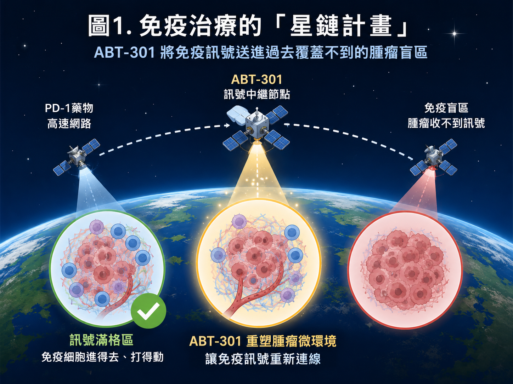
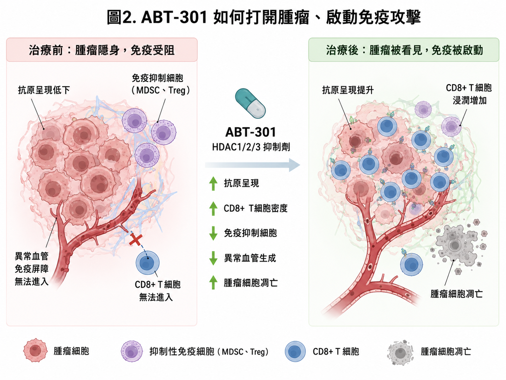
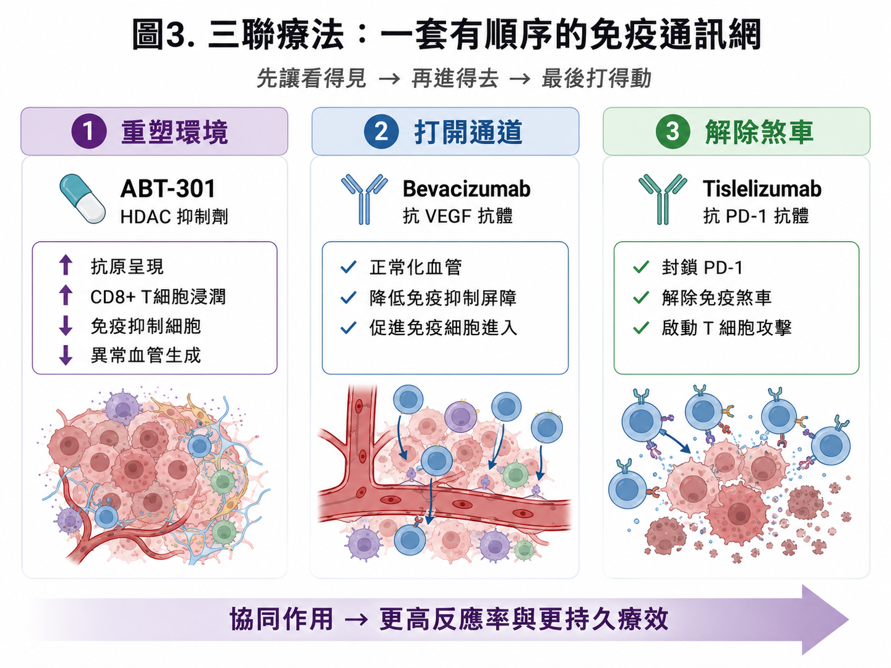
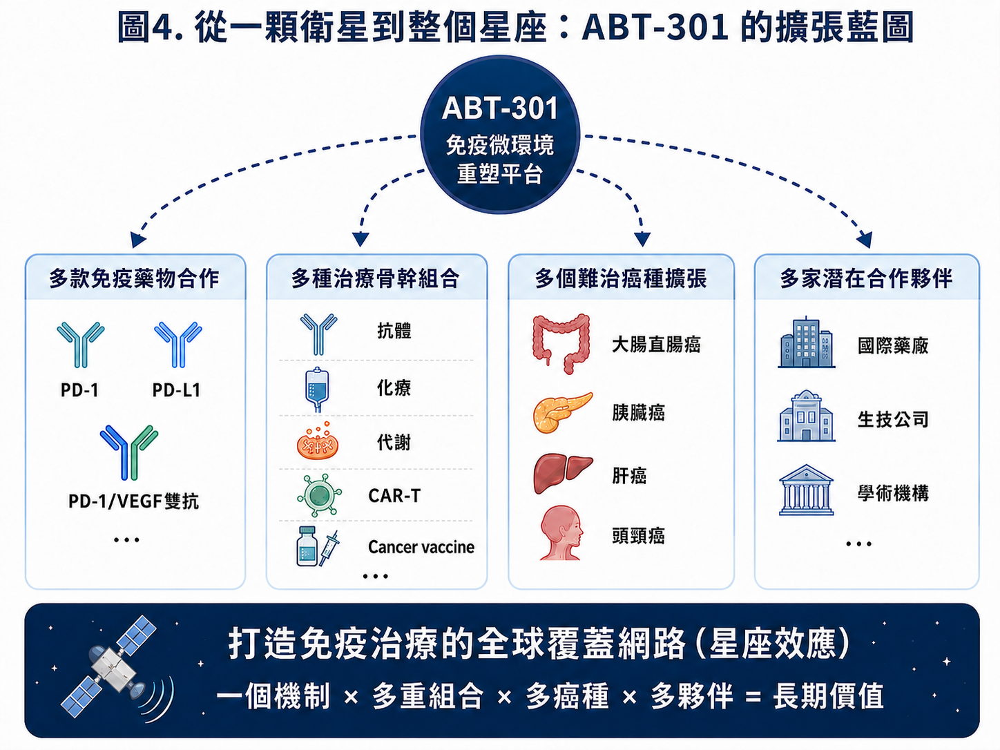
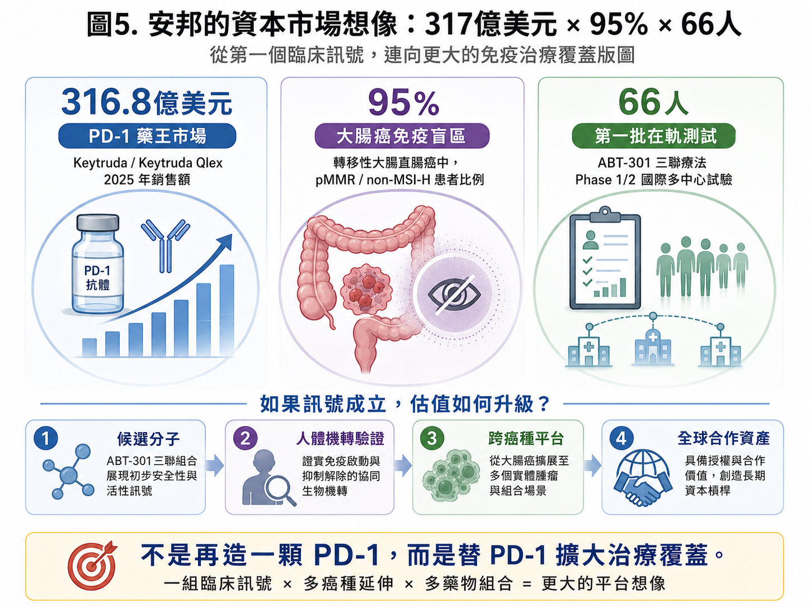

# 安邦生技：免疫治療的「星鏈計畫」

> 一顆台灣小分子，能否把300億美元級PD-1生態，連進95%的大腸癌免疫盲區？

| 300億美元級 | 約95% | 66名 |
| --- | --- | --- |
| PD-1藥王生態 | mCRC為pMMR／non-MSI-H | Phase 1/2預計收案 |

馬斯克旗下的SpaceX今年上市首秀，然而多數虧損的資產中，星鏈Starlink帶來了其目前最重要的商業現金流。即便當今的網路基站已經遍佈全球大部分的角落，但是依然留有大片面積是無法被覆蓋的。星鏈就是透過低軌衛星把訊號送偏遠地區、海上船舶到災區通訊。[1]如今美國多數的航空公司都透過星鏈的服務，提供人們在飛機上的網路服務，將網際網路的世界無時無刻地傳遞覆蓋全球。

而在癌症免疫治療也存在類似的「通訊覆蓋缺口」。

眾所週知的PD-1藥物已經改寫全球腫瘤治療，但它並不是對所有腫瘤都有效。部分腫瘤能被免疫系統辨認，T細胞也能順利進入；另一些腫瘤卻會降低抗原呈現、排斥免疫細胞，甚至在腫瘤內建立強烈的免疫抑制環境。藥物已經存在，訊號卻送不進去。

安邦生技的核心藥物ABT-301，試圖處理的正是這個問題。

透過重塑腫瘤微環境、擴大既有免疫療法治療範圍的小分子藥物。若這顆藥物與機制能在人體臨床中成功，安邦的價值將成為與不同藥物連用於多種癌種的「免疫治療星鏈」。

> Starlink擴張的是網路覆蓋；ABT-301挑戰擴張的，是免疫治療覆蓋。

*圖1｜免疫治療的「星鏈計畫」：ABT-301嘗試把免疫訊號送進治療盲區*

## 01｜PD-1已經很成功，但仍有大片市場沒有訊號

PD-1默沙東Keytruda在2025年全球銷售額達316.8億美元，單品一年便創造超過新台幣兆元營收。[2]

安邦這次選用的PD-1，是BeOne Medicines（原百濟神州）旗下的tislelizumab（TEVIMBRA／百澤安）。這款藥2025年全球銷售額達7.37億美元，年增19%，並已在多個市場取得藥證[3]，ABT-301因此直接進入一個真實的連用環境。後續若能看到增敏與腫瘤微環境重塑訊號，安邦就有機會接上這套已在全球運轉的免疫治療體系。

對安邦而言，ABT-301的商業想像不只停在tislelizumab。全球腫瘤藥廠多數已布局PD-1、PD-L1，或正在推進PD-1／VEGF雙抗與下一代免疫組合，真正稀缺的是能替既有產品打開冷腫瘤與新患者市場的增敏分子。若ABT-301的人體資料證明其微環境重塑能力可重複，未來合作想像可延伸至更多PD-1／PD-L1產品與不同免疫組合。

目前的合作邊界很清楚：BeOne提供臨床試驗用藥，雙方先把組合送進人體測試；合作尚未延伸到授權或商業化。供藥是讓衛星升空的燃料，真正能改變公司估值的交易，要等ABT-301拿出足以談判的人體數據。

真正的缺口，在PD-1尚未有效覆蓋的患者。

轉移性大腸直腸癌中，約95%的患者屬於pMMR／non-MSI-H類型，通常難以從現有免疫檢查點抑制劑獲得明顯效益。根據GlobalData估算美國、中國、日本與歐洲五大市場的病患數，每年約有37萬名二線以上患者，推算出潛在市場約90億美元。[4]

為什麼這95%的患者特別難治？pMMR／non-MSI-H腫瘤通常突變負荷較低，可被免疫系統辨認的抗原訊號不夠，腫瘤周圍又布滿異常血管與髓系抑制細胞。T細胞看不清楚目標，也很難走進腫瘤裡面。因此，單純把PD-1劑量加大沒有用，必須先改造那個排斥免疫反應的腫瘤環境。

90億美元只是潛在市場，患者分層、治療線別、競爭藥物、定價與臨床成功率，都會把這個數字一層一層往下折。即使如此，這仍是一塊長年被PD-1留在覆蓋區外的大市場。ABT-301若能走進去，商業量級與少數患者的孤兒適應症完全不同。

這群患者目前仍以化療與標靶治療為主要骨幹，進入後線之後，藥物選擇與療效空間會逐漸縮小。免疫治療過去在這裡多次碰壁，反而讓能夠改變腫瘤微環境的組合更受關注。ABT-301選擇從這個最難打開的市場切入，臨床風險較高；一旦成功，對其他冷腫瘤也會產生更強的說服力。

大藥廠手上幾乎都有PD-1，或正在押注下一代PD-1／VEGF。真正稀缺的是能替現有產品打開新病種的搭檔。ABT-301若能做到，自然會進入各家公司爭取合作的名單。這正是它最有資本市場想像力的位置。

## 02｜ABT-301如何讓腫瘤重新「連線」？

ABT-301，又名imofinostat，是一款口服HDAC1／2／3抑制劑。安邦將它定位為「表觀遺傳腫瘤微環境重塑劑」，希望與傳統HDAC抑制劑拉開差異。[4]

表觀遺傳可以理解為控制基因是否被讀取的一組開關。癌細胞即使沒有改變DNA序列，也能透過這些開關降低抗原呈現、躲避免疫辨識，並創造不利於T細胞進入與存活的環境。依已公布的臨床前資料，ABT-301聯合PD-1抗體提升抗原呈現、增加CD8⁺毒殺型T細胞的浸潤與活性、降低單核性髓源抑制細胞，並影響癌細胞凋亡、血管新生與腫瘤代謝。把這些作用放在一起看，方向很清楚：先讓「看不見、進不去、打不動」的腫瘤，變成免疫療法有機會發揮的狀態。ABT-301從一開始就把舞台放在組合治療。它若能替多款上市藥物打開患者覆蓋，市場自然會用平台來看待。Starlink把訊號送進原本連不上的地方；ABT-301想做的，是讓各類腫瘤治療藥物重新產生作用。

安邦公布的研究資料裡，有兩組數字值得特別看。ABT-301對HDAC3的IC50為6.6 nM，對照分子chidamide則為106.9 nM，相差約16倍；在與anti-PD-1聯用的動物模型中，ABT-301組有2／7出現完全反應，chidamide組則是0／8。[6] 前一組數字看的是分子活性，後一組看的是動物腫瘤有沒有出現更深的反應。

不過，老鼠身上的完全反應不能直接寫成人體的客觀反應率。這些資料能做的是替三聯療法提供一個合理起點：ABT-301確實碰得到它想碰的標的，也在動物裡看到與PD-1合用的可能性。接下來還是要看患者的腫瘤會不會縮小、能維持多久，以及人體檢體裡是否真的出現免疫微環境改變。

安全性則是另一道門。安邦先前完成的ABT-301單藥一期共有23名受試者，公司資料顯示，沒有觀察到嗜中性白血球低下或心臟毒性異常等其他HDAC抑制劑常被關注的問題。[4]這讓ABT-301有機會繼續往三聯療法走，但單藥安全不代表三顆藥放在一起也一定安全。bevacizumab與PD-1抗體各自都有不良反應，治療窗口必須在66名患者裡重新找。

HDAC抑制劑已有多年的臨床使用經驗，過去也有產品獲准用於血液腫瘤；實體腫瘤的成果卻不穩定，骨髓抑制、疲倦與其他全身性副作用也限制了長期合併治療。安邦因此把ABT-301的重點放在HDAC1／2／3與腫瘤微環境，希望用口服小分子保留增敏效果，同時找出可長期與PD-1、抗VEGF藥物共存的劑量。這會是三聯試驗最實際的產品考驗。

*圖2｜ABT-301透過腫瘤微環境重塑，嘗試讓腫瘤重新被看見、讓免疫重新被啟動*

## 03｜三聯療法：重塑環境、打開通道、解除煞車

安邦目前推進的是ABT-301、bevacizumab與tislelizumab三聯療法。

ABT-301負責重塑表觀遺傳與腫瘤免疫微環境；bevacizumab透過抑制VEGF，處理異常血管與相關免疫抑制屏障；tislelizumab則封鎖PD-1，解除T細胞的免疫煞車。

> 先讓腫瘤重新被辨認，
> 再讓免疫細胞進入，
> 最後解除T細胞的攻擊限制。

安邦已啟動Phase 1/2國際多中心試驗，預計在台灣與澳洲收納66名pMMR／non-MSI-H局部晚期或轉移性大腸直腸癌患者，評估安全性、耐受性、建議第二期劑量與初步療效。資料顯示，首位患者已於2025年11月在澳洲接受治療，tislelizumab由BeOne依臨床藥物供應合作提供。[4]接下來的66名患者將回答四件事：安全劑量能否確立、腫瘤反應能否重複、療效能否持續，以及人體樣本是否出現預期的免疫微環境變化。

這項試驗前段會先做劑量爬升，確認三顆藥能不能一起使用，再進入後續擴增。臨床除了看腫瘤是否縮小，還要追蹤反應深度、反應持續時間與無惡化存活期；同時盯住血液毒性、感染、出血、高血壓、蛋白尿，以及免疫相關不良事件。三種機轉如果能合作，可能帶來更深療效；如果毒性也一起疊上來，臨床價值就會被吃掉。

早期數據公布時，ORR通常最先搶走目光，真正決定後續價值的卻是反應能維持多久。腫瘤短暫縮小後很快惡化，組合療法很難說服大藥廠；DOR與PFS若能同步拉長，而且停藥原因沒有被毒性主導，才有條件走進更大規模的隨機試驗。安邦未來的數據包，至少要把這三條線一起交代清楚。

66人的規模還不到大型樞紐試驗，卻足以讓市場第一次看見ABT-301在人類身上的輪廓。倘若不同患者、不同中心都能看到反應，而且治療前後檢體出現抗原呈現上升、CD8⁺T細胞浸潤增加，安邦拿去和國際藥廠談的，將是一份開始有臨床重量的資料，機轉故事也因此有了人體證據。

試驗收進的是局部晚期或轉移性患者，先前接受過哪些治療、腫瘤負荷多高、肝轉移比例多少，都會影響最後的反應率。讀取頂線數據時，一個ORR百分比遠遠不夠，基線特徵、反應持續時間與停藥原因都得放在一起看。早期試驗樣本不大，只要多一兩名患者有反應或惡化，比例就可能大幅變動，持續且跨中心重複的訊號因此更重要。

*圖3｜三聯療法的順序式邏輯：重塑環境、打開通道、解除煞車*

## 04｜同一條路，已在人類臨床看見過訊號

ABT-301三聯策略已有外部臨床資料可供參照。

2024年刊登於《Nature Medicine》的CAPability-01隨機第二期試驗，使用另一款HDAC抑制劑chidamide，搭配PD-1抗體sintilimab與bevacizumab，治療化療難治的MSS／pMMR晚期大腸直腸癌。這項研究把與安邦相近的「HDAC調節＋PD-1＋抗VEGF」組合真正放進人體，也同步分析腫瘤免疫微環境。[5] 結果支持這條治療路徑值得追蹤，但不能直接換算成ABT-301的成功率。

如果把數據拆開來看，CAPability-01三聯組的18週無惡化存活率為64.0%，雙聯組只有21.7%；客觀反應率為44.0%對13.0%；中位無惡化存活期則是7.3個月對1.5個月。[5]腫瘤分析也看到較高的CD8⁺T細胞浸潤與較活化的免疫微環境。這是目前最接近安邦三聯設計的人體證據，也把「先重塑環境，再放大PD-1作用」從動物實驗推進到人體訊號。

療效亮眼，代價也不能省略。這項研究常見的不良事件包括蛋白尿、血小板與白血球下降、嗜中性白血球低下、貧血與腹瀉，並報告兩例治療相關死亡。安邦可以從其他地方建立差異。若ABT-301能維持療效訊號，同時交出較乾淨的安全性、更便利的口服使用方式或更清楚的患者標記，同樣可能成為大藥廠願意接手的差異。

CAPability-01使用chidamide，安邦試驗使用ABT-301，兩項研究各自獨立，也沒有做頭對頭比較。這份資料能支持治療路徑，無法替安邦預先宣布成功。ABT-301仍要用自己的66名患者，回答同樣的療效與安全問題。

若未來安邦公布早期數據，最值得注意的是反應有沒有集中在少數特殊患者。倘若所有反應都來自某一種生物標記或較輕的腫瘤負荷，下一階段試驗就要重新調整選人方式；倘若反應分布較廣，平台延伸的空間才會變大。這也是腫瘤檢體分析的重要性：它可以告訴公司藥物對誰有效，也能避免下一輪試驗繼續把不會反應的患者全部收進來。

安邦接下來要用ABT-301證明，它能在保留機轉協同的同時，建立更適合長期組合治療的安全窗口。若能做到，這顆分子便有機會從另一款HDAC抑制劑，升級為免疫治療的增敏新底座。

## 05｜第一個市場是90億美元，真正的上限在「星座效應」

Starlink的價值隨著衛星數量增加而放大，覆蓋範圍與服務場景也持續擴張。ABT-301同樣面臨這條估值分水嶺。

第一個覆蓋區，是約90億美元的pMMR／non-MSI-H後線轉移性大腸直腸癌市場。

第二層，看它能否搭配不同PD-1／PD-L1抗體，擺脫單一藥物的限制。

第三層，是能否從免疫增敏，延伸到化療抗藥逆轉。安邦已公布ABT-301在KRAS突變胰臟癌中，透過HDAC3–NRF2路徑提升化療敏感性的臨床前研究。[6]

第四層，則是能否向腦癌、肝癌、頭頸癌及其他免疫治療反應有限的實體冷腫瘤延伸，潛在滲透約955億美金的冷腫瘤市場。[7]

如果ABT-301同一機制能跨藥物、跨治療骨幹、跨癌種重現，安邦將變成腫瘤微環境重塑平台。一個機制 × 多款藥物 × 多個癌種 × 多家合作夥伴。資本市場可能給予的價值，也會從「一顆藥乘上一個適應症」，轉向一張能持續增加節點的治療覆蓋網路。

平台兩個字，在生技公司簡報裡早已被用到發白。市場其實只問一件事：同一套機轉能不能重複。ABT-301先在一個癌種、搭配一款PD-1站穩，還只能算一項有價值的組合藥；等到它換PD-1、換癌種，甚至接上化療抗藥逆轉，星鏈才真正從一顆衛星長成星座。

對大型藥廠來說，這正好打中一個現實難題。很多公司手上已經有PD-1、PD-L1或PD-1／VEGF雙抗，但產品彼此愈來愈相似，下一步都在尋找可以擴大患者範圍的組合夥伴。一顆能跨多款免疫藥使用的小分子，將吸引多家公司走上談判桌，安邦的授權選擇也會因此增加。

從授權角度看，第一個成功適應症會先決定ABT-301的底價。第二個癌種若能延續相同機轉，買方就能把開發成本分攤到更多市場；另一款PD-1也能重現時，藥物對單一合作夥伴的依賴會下降。因此安邦未來每增加一組人體資料，管線頁面會多一個箭頭，區域權利、共同開發與全球授權的談判方式也可能跟著改變。

*圖4｜從一顆衛星到整個星座：ABT-301的跨藥物、跨癌種、跨夥伴擴張藍圖*

## 06｜第二組星鏈節點：ABT-500把診斷、分層與治療連成閉環

除ABT-301外，安邦目前最值得追蹤的第二條資產主軸是ABT-500診療一體化系列：

ABT-500系列以LHRH受體為精準導引入口，先透過ABT-502進行影像定位與患者篩選，再由ABT-501攜帶DM1執行治療，並由ABT-505延伸至含硼載荷與BNCT應用。[8]

ABT-500系列走的是診療一體化。病人先接受ABT-502氟-18 PET顯影，確認腫瘤有沒有足夠的LHRH受體；篩選合適後，再由ABT-501以LHRH胜肽導引DM1載荷，把細胞毒性藥物送到受體高表現的腫瘤。[8]

ABT-502這一關，重點會落在PET與IHC的一致性、SUV cutoff、腫瘤對背景比，以及影像訊號能不能預測後續療效。ABT-501則要回答體內分布、毒理與治療窗；把DM1送到腫瘤還不夠，正常組織暴露也得壓低。三陰性乳癌、卵巢癌與胰臟癌的動物資料提供起點，真正分出高下的仍是人體劑量與反應。[8]

公司資料指出，約50%的三陰性乳癌患者可能有LHRH受體過度表現。[8]受體只是第一道門，影像訊號還要足夠清楚、正常組織暴露也要能控制，載荷也必須在正確位置釋放。ABT-502若能先把適合的患者找出來，才有機會提高ABT-501後續治療的命中率。

ABT-505則把同一套導航方式接上含硼載荷，往硼中子捕獲治療延伸。安邦也因此把一顆PDC延伸成可以替換影像與治療載荷的設計架構。想像力很大，開發難度也同樣大：PET、PDC與BNCT是三套不同工程，任何一段接不起來，診療一體化就只會停在簡報上。

ABT-505目前還在更早期的位置。公司資料顯示，在HCC1806細胞株中，硼吸收通量約為BPA的20倍。[8]這個數字很吸睛，回答的仍是細胞能否把硼帶進去。BNCT走進臨床前，還要跨過體內分布、腫瘤對正常組織比、照射條件與正常組織毒性。這幾道關卡都成立，含硼載荷才有產品意義。

這套模式若能成立，影像會先替治療做一次篩選，減少把藥物用在受體表現不足的患者身上。對臨床試驗而言，收案人數可能因此縮小，反應率也有機會提高；對商業化而言，診斷與治療必須在醫院端順利銜接，還要處理放射性同位素供應、影像判讀標準與載荷製造。ABT-500的價值最後會同時取決於藥物科學與整套醫療流程。

現階段，這些資產比較像長期選擇權。等到第二條管線也走出人體臨床訊號，市場才會開始把安邦從單一HDAC公司，改看成多節點精準腫瘤公司。

## 07｜四次訊號升級，決定安邦的下一段估值

安邦目前仍是尚無核准產品的臨床階段生技公司。市場會跟著臨床成功機率調整定價，當期現金流暫時不列為主要指標。

第一次升級，是三聯療法確認可管理的安全性與建議第二期劑量。

第二次升級，要看到可重複、可持續的客觀反應，排除少數患者偶然反應的可能。

第三次，是人體樣本驗證抗原呈現、CD8⁺浸潤或免疫抑制解除等機轉，並找到可用於選人的生物標記。

第四次，是同一機制在第二癌種或另一治療組合中重現，或取得跨國藥廠的授權與共同開發合作。

> 候選分子
> → 人體數據支持的機制
> → 可跨癌種的平台
> → 全球藥廠願意交易的戰略資產

這四次升級會推進臨床里程碑，也會改變資本市場對整家公司的分類。

對投資人來說，往後每一則公告的含金量其實不一樣。第一位患者入組、完成劑量爬升、出現可重複的客觀反應、找到生物標記，以及簽下有upfront與里程碑的授權，每一步降低的風險都不同。市場每天都有新聞，估值卻只認新證據。每一個新證據都要接回同一套治療邏輯，星鏈的節點才算真的增加。

另一個不能忽略的是錢。國際多中心試驗、第二癌種與ABT-500的影像及載荷開發都要持續投入。在大型授權交易出現以前，現金跑道、募資時間與股本稀釋都會影響股東最後拿到多少價值。藥物成功與股價報酬之間，還隔著募資成本與資金結構，這也是早期生技投資最現實的一面。

交易條款也要看細。合作對象和供藥關係只說明雙方已坐上談判桌，還算不出資產價值。簽約金、開發里程碑、銷售里程碑、權利金比例與地區權益，才是估算公司未來收益的材料。ABT-301若在早期數據後就授權，可以分攤開發成本，但議價空間較小；公司若自行推進到更成熟階段，潛在價格較高，也要承擔更多試驗支出與失敗風險。

*圖5｜安邦的資本市場想像：從66名患者的第一組訊號，走向跨癌種平台與全球合作資產*

## 結語｜第一組臨床訊號，決定安邦是一顆衛星，或是一個星座

安邦接下來要做的事，其實很清楚：讓現有免疫療法走進尚未覆蓋的患者市場。Keytruda已經做成300億美元級藥王，PD-1的商業軌道也早已鋪好；安邦押注的是那些至今仍被留在門外的患者。

這條路的第一個檢查點落在ABT-301。它要證明一顆台灣小分子，能把已有巨大商業規模的免疫療法送進過去難以抵達的腫瘤。

第一站，是約占轉移性大腸直腸癌95%的pMMR／non-MSI-H治療盲區；第一場驗證，是66名患者的Phase 1/2試驗；第一個可量化市場，則是公司引用資料估算的90億美元。

若第一組人體訊號成立，安邦將打開一張新的治療覆蓋圖，並沿著不同藥物、不同癌種與不同合作夥伴繼續擴張。

所以安邦接下來要先讓第一顆衛星回傳夠清楚的訊號，再談更多衛星。66名患者如果能把安全性、療效與人體機轉同時接起來，ABT-301才有資格從台灣早期新藥，走進全球藥廠的組合策略裡。到那個時候，300億美元、95%與90億美元，才會開始成為同一個故事。

> 第一顆衛星能否穩定回傳訊號，
> 將決定安邦最終停在早期候選藥物，
> 或長成一個能替全球免疫治療擴大覆蓋的星座。

> **安邦生技：免疫治療的星鏈計畫**
> 第一顆衛星已升空，真正的估值，等訊號回傳。

## 參考資料

1. [Starlink｜Technology](https://starlink.com/technology)

2. [Merck｜2025 Form 10-K](https://www.merck.com/wp-content/uploads/sites/124/2026/02/MRK-12.31.2025-10K-FINAL.pdf)

3. [BeOne Medicines｜2025 Full-Year Results](https://www.sec.gov/Archives/edgar/data/1651308/000162828026011941/exhibit991-q42025earningsr.htm)

4. [安邦生技｜ABT-301三聯療法Phase 1/2試驗](https://anbogen.com/en/news/cCCcD7dA6dcf)

5. [Nature Medicine／PubMed｜MSS／pMMR大腸直腸癌三聯療法研究](https://pubmed.ncbi.nlm.nih.gov/38438735/)

6. [安邦生技｜2026 AACR ABT-301 Research](https://anbogen.com/en/news/E6B4eB8309E6)

7. [Credence Research: Global Checkpoint Inhibitor Refractory Cancer Drugs Market](https://www.credenceresearch.com/report/checkpoint-inhibitor-refractory-cancer-market)

8. [安邦生技｜創新研發：ABT-500系列、ABT-501、ABT-502與ABT-505](https://mopsov.twse.com.tw/nas/STR/778420260429E001.pdf)

### 免責聲明

本文依截至2026年7月24日公開資訊與所提供研究資料整理，僅供產業分析，不構成投資建議；臨床前與早期臨床結果不代表最終人體療效、藥證核准或商業化成果。
