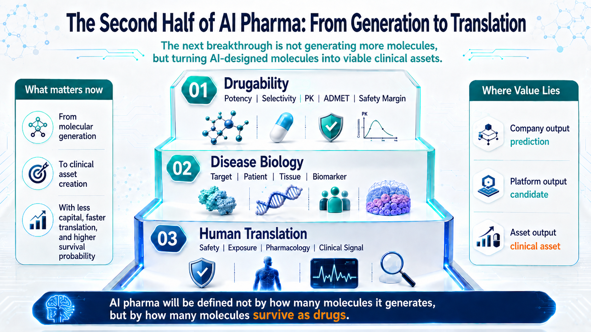
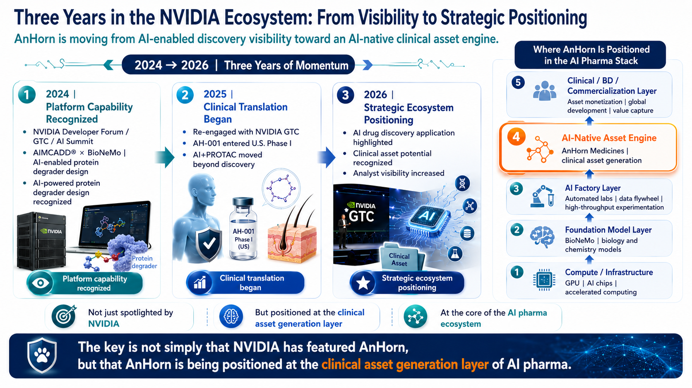
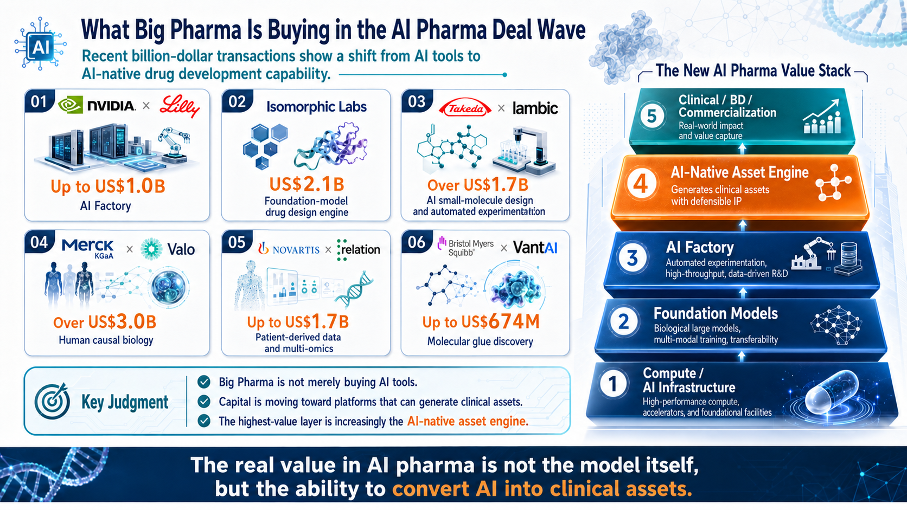
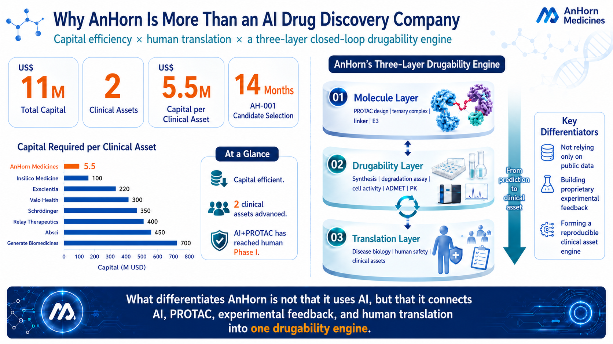
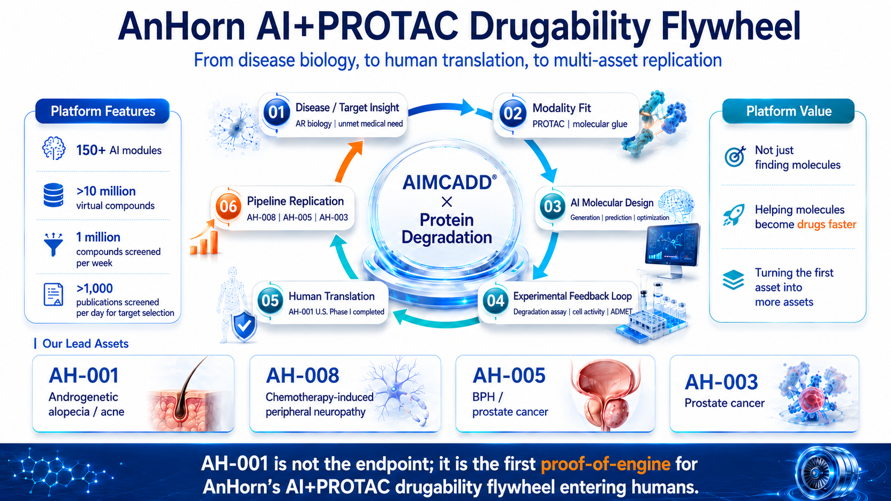
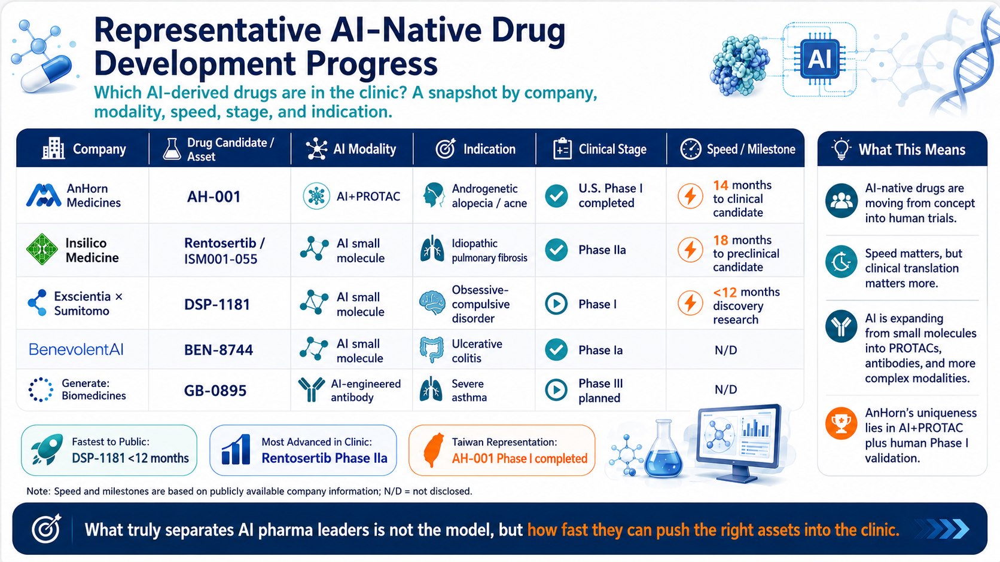

# The Next Phase of AI Drug Development: Making Molecules Survive as Drugs

> Why NVIDIA’s repeated recognition of AnHorn points to a Taiwan-born AI+PROTAC clinical-asset engine

The first wave of AI-enabled drug discovery rewarded molecular generation. The next wave will reward something much harder: whether those molecules can become drugs.

Across the industry, the AI drug-development landscape is being rebuilt. Over the past two years, NVIDIA and major pharmaceutical companies have started building AI Factory infrastructure, while AI-native platforms such as Isomorphic, Iambic, Valo, Relation, and VantAI have raised capital or signed billion-dollar-scale partnerships. The market is no longer paying simply for the claim that AI can generate molecules.

The real question is now more demanding: can AI make drug R&D faster, more predictive, and more clinically productive - moving better molecules into human studies faster, helping them survive development, and ultimately supporting commercialization?

This is the next phase of AI drug development. The first phase was about models, compute, and molecular generation. The next phase is about druggability, translation into human studies, and the creation of clinical assets. A molecule on a screen is not a medicine.

Against this backdrop, AnHorn’s repeated presence in NVIDIA’s ecosystem is more than a visibility story. It is a strategic positioning signal. AnHorn is not operating at the compute layer, the broad foundation-model layer, or as a simple AI screening tool. It is trying to operate closer to the AI-native clinical asset engine layer, where AI must be converted into drug candidates that can enter the clinic.

AIMCADD®, AI+PROTAC, AH-001’s U.S. Phase I completion, and follow-on pipeline replication all point to the same thesis: AnHorn is building a capital-efficient engine designed to turn AI-designed molecules into viable, clinically actionable drug assets.

*Figure 1 | The next phase of AI drug development: from molecular generation to drug survival, human translation, and clinical asset creation*

## 1. AI Drug Development Is Asking a Harder Question: Can Molecules Survive?

For years, the most compelling story in AI drug discovery was the model: who could generate molecules, predict protein structures, or produce the most convincing docking results. That narrative created excitement, but it was only the starting point.

In drug development, a molecule on a screen is not yet a medicine. To become a real asset, an AI-designed molecule has to clear a series of filters: druggability, validated disease biology, and translation into human studies. It must show potency, selectivity, exposure, pharmacology, safety margin, and ultimately a meaningful clinical signal.

That is the real shift. AI drug development is moving from a generation race to a survival race: who can use less capital and less time to move the right molecules into human studies, and who can raise the odds that those molecules become clinical assets.

*Figure 2 | Three consecutive years in the NVIDIA ecosystem: from platform visibility to AI-native clinical asset positioning*

## 2. Three Years in the NVIDIA Ecosystem: Less About Exposure, More About Positioning

AnHorn’s repeated presence in the NVIDIA ecosystem should not be treated as simple exposure. One appearance may be a showcase. Repeated appearances across NVIDIA Developer Forum, GTC, AI Summit, and GTC Taipei point to a more meaningful positioning signal.

The key is not simply that AnHorn uses NVIDIA technologies. The more important point is that AnHorn offers a tangible life-sciences use case for AI infrastructure: from AIMCADD® and BioNeMo-enabled design, to protein degrader discovery, to AH-001 entering and completing U.S. Phase I.

Within the AI drug-development stack, AnHorn is not competing at the compute layer or the general-purpose foundation-model layer. Its more relevant position is the AI-native clinical asset engine layer - the layer closest to biotech value creation, where AI must become clinical-stage, licensable, and ultimately transaction-ready drug assets.

*Figure 3 | The AI drug-development deal wave: Big Pharma is buying platforms, data, and clinical asset generation capability*

## 3. The AI Deal Wave: Big Pharma Is Buying Drug-Making Capability, Not AI Tools

Recent AI drug-development transactions point in the same strategic direction. NVIDIA x Lilly represents the AI Factory layer. Isomorphic Labs represents a foundation-model drug design engine. Takeda x Iambic reflects small-molecule design integrated with automated experimentation. Valo and Relation highlight disease biology and patient-derived data. VantAI reflects AI’s move into molecular glue and protein degradation design.

These deals are not simply another AI funding cycle. They are redefining the value hierarchy in AI-enabled drug development. The closer a company gets to clinical assets, business development, commercialization, and validated human translation, the closer it gets to real value capture.

That is why AnHorn should not be evaluated as a generic AI tool company. The relevant questions are whether it can generate differentiated molecules, move them into human studies, and turn a first asset into a broader clinical pipeline.

*Figure 4 | AnHorn’s capital efficiency and three-layer closed-loop engine: US$11M, two clinical assets, and US$5.5M per clinical asset*

## 4. Capital Efficiency and Clinical Speed: Why AnHorn Is More Than an AI Drug Discovery Company

AI drug companies should not be judged only by model scale or financing size. For investors and pharmaceutical partners, the more practical question is capital-to-clinic efficiency: how much capital it takes to create clinical assets, how quickly those assets enter human studies, and whether the platform can repeatedly generate the next asset.

According to company materials, AnHorn has advanced two clinical assets with approximately US$11M in total capital, implying roughly US$5.5M per clinical asset. AH-001 was selected as a clinical candidate in approximately 14 months and has completed U.S. Phase I.

These numbers are not proof of efficacy. They do, however, highlight an important signal: AnHorn has moved AI+PROTAC from platform design and candidate selection into human Phase I with the capital profile of a small biotech. That is a major distinction from a conventional AI screening tool.

*Figure 5 | AnHorn’s AI+PROTAC druggability flywheel: from disease biology to human translation and multi-asset replication*

## 5. AnHorn’s AI+PROTAC Druggability Flywheel: AH-001 Is Not the Endpoint; It Is the First Proof of Engine

If AH-001 is viewed only as an androgenetic alopecia asset, the AnHorn story becomes too narrow. Its broader significance is that AH-001 is the first human safety validation point for AnHorn’s AI+PROTAC druggability flywheel.

That flywheel links six steps: disease and target insight, modality fit, AI molecular design, experimental feedback, human translation, and pipeline replication. At the center is not a single algorithm, but a continuous learning system built around AIMCADD® x Protein Degradation.

AIMCADD® is not simply a molecule-finding tool. Its strategic value lies in connecting disease biology, PROTAC design, ternary-complex logic, linkers, E3 ligase selection, degradation assays, cell activity, ADMET, and human translation. Once the first clinical asset begins to generate feedback, the platform may be able to replicate the process across assets such as AH-008, AH-005, and AH-003.

*Figure 6 | Representative AI-native drug development progress: company, asset, modality, speed, clinical stage, and indication*

## 6. Global AI-Native Drug Progress: The Real Gap Opens When Assets Reach the Clinic Faster

AI-native drug development is moving from proof-of-concept claims into human clinical development. Insilico’s rentosertib has reported positive Phase IIa results. Exscientia x Sumitomo’s DSP-1181 remains an early example of an AI-designed small molecule that moved rapidly into Phase I. BenevolentAI and Generate:Biomedicines show that AI is expanding beyond small molecules into antibodies and more complex modalities.

AnHorn is not the most clinically advanced company in this global comparison. Its relevance is more specific: the combination of AI+PROTAC and human Phase I validation remains rare. AI is no longer only accelerating small-molecule discovery; it is moving into protein degradation, antibodies, and more complex drug modalities.

For AI drug-development leaders, the central question is no longer whether they can build powerful models. It is whether they can push the right assets into the clinic and keep improving the probability of clinical survival.

## 7. What AnHorn Still Needs to Prove: The Ability to Make Drugs Survive

The next decade of AI-enabled drug development will not reward companies simply for speaking the language of AI. It will reward companies that can make molecules survive by selecting the right disease biology, choosing the right modality, improving druggability, building AI-wet lab feedback loops, and moving candidates into human studies.

AnHorn has not yet delivered the final proof. AH-001 has completed Phase I, but that is a first human safety and translation milestone, not therapeutic proof of concept. AH-008, AH-005, and AH-003 still require further preclinical, IND-enabling, clinical, and business development validation.

Even so, AnHorn has reached a position rarely seen in Taiwan biotech: it is not just a single-asset drug developer, not merely an AI tool provider, and not simply a company running models on public data. It is attempting to connect AI, PROTAC, disease biology, experimental feedback, and human translation into an emerging druggability flywheel.

## Conclusion: In the Next Phase of AI Drug Development, Who Can Make Molecules Survive?

The first phase of AI drug development was a race to generate molecules. The next phase is a race to make those molecules survive. The first phase was about models; the next phase is about druggability, clinical translation, and clinical assets.

AnHorn’s importance is not defined by a single GTC spotlight. The stronger thesis is that AI+PROTAC may give Taiwan biotech a way to participate in AI-native drug development at the clinical asset generation layer.

If AH-001 later delivers a meaningful Phase II efficacy signal, if AH-008, AH-005, and AH-003 demonstrate platform replication, and if AIMCADD® can keep feeding AI prediction, experimental validation, and human translation data into the next generation of assets, AnHorn could become more than another AI drug discovery company. It could become a Taiwan-based example of AI-native clinical asset generation.

## Disclosure and Publication Note

This article is intended solely for industry trend analysis and company-positioning discussion. It does not constitute investment advice. Data related to AnHorn’s capital efficiency, AIMCADD®, pipeline progress, and scientific publications are based on publicly available materials and company disclosures. Global AI drug-development and transaction information is compiled from company announcements, press releases, and other publicly available sources. Before publication, the latest public disclosures, clinical trial registries, and company-approved disclosure scope should be reconfirmed.

## Selected References

- [1. NVIDIA × Lilly | AI Factory / AI co-innovation lab](https://nvidianews.nvidia.com/news/nvidia-and-lilly-announce-co-innovation-lab-to-reinvent-drug-discovery-in-the-age-of-ai)
- [2. NVIDIA BioNeMo | AI drug discovery foundation model / toolkit](https://www.nvidia.com/en-us/clara/bionemo/)
- [3. AnHorn Medicines | NVIDIA AI Summit / AI protein degrader R&D results](https://www.anhornmed.com/zh-hant/news/nvidia-ai-summit-tw/)
- [4. AnHorn Medicines | GTC 2026 video exposure / AH-001 international potential](https://www.genetinfo.com/investment/featured/item/95827.html)
- [5. Isomorphic Labs | US$2.1B financing](https://www.reuters.com/legal/litigation/google-backed-isomorphic-raises-21-billion-scale-ai-driven-drug-discovery-2026-05-12/)
- [6. Takeda × Iambic | AI drug discovery collaboration](https://www.iambic.ai/post/iambic-announces-collaboration-with-takeda)
- [7. Merck KGaA × Valo Health | AI-enabled human causal biology collaboration](https://www.valohealth.com/press/valo-health-announces-collaboration-with-merck-kgaa-darmstadt-germany-to-discover-and-develop-novel-treatments-for-parkinsons-disease-and-related-disorders)
- [8. Novartis × Relation | AI / patient-derived data collaboration](https://www.globenewswire.com/news-release/2025/12/09/3202076/0/en/relation-announces-strategic-collaboration-with-novartis-to-advance-therapeutics-for-atopic-diseases.html)
- [9. BMS × VantAI | Molecular glue AI discovery collaboration](https://www.businesswire.com/news/home/20240213117969/en/VantAI-Enters-Collaboration-With-Bristol-Myers-Squibb-to-Accelerate-Molecular-Glue-Drug-Discovery-Through-Artificial-Intelligence)
- [10. Alnylam × Inceptive | AI RNA drug discovery collaboration](https://investors.alnylam.com/press-release?id=29941)
- [11. AnHorn Medicines | AH-001 completed U.S. Phase I](https://www.anhornmed.com/news/ai-design-ah001-protein-degrader-phase1-complete/)
- [12. AnHorn Medicines | AH-001 FDA IND clearance](https://www.anhornmed.com/zh-hant/news/ind-clearance-ah-001/)
- [13. AnHorn Medicines | AIMCADD® technology platform](https://www.anhornmed.com/our-technology/)
- [14. BioDriven Taipei | AnHorn AIMCADD® / protein degrader platform](https://www.biodriven.taipei/en/roadshow_content.aspx?id=b6a0126d-2535-4bd3-add1-10a4480c24e0)
- [15. AnHorn Medicines | AI-driven PROTAC design / ACS Omega publication](https://www.anhornmed.com/news/ai-protac-drug-design-acs/)
- [16. Pfizer × Arvinas | Representative PROTAC collaboration](https://www.pfizer.com/news/press-release/press-release-detail/arvinas-announces-research-collaboration-and-license)
- [17. Arvinas × Pfizer | ARV-471 global collaboration](https://ir.arvinas.com/news-releases/news-release-details/arvinas-and-pfizer-announce-global-collaboration-develop-and)
- [18. Insilico Medicine | Rentosertib / ISM001-055 Phase IIa publication](https://insilico.com/news/tnrecuxsc1-insilico-announces-nature-medicine-publi)
- [19. Nature Medicine | Rentosertib Phase IIa paper](https://www.nature.com/articles/s41591-025-03743-2)
- [20. Sumitomo Pharma × Exscientia | DSP-1181 Phase I initiation](https://www.sumitomo-pharma.com/news/20200130.html)
- [21. BenevolentAI | BEN-8744 Phase Ia safety and PK data](https://www.benevolent.com/news-and-media/press-releases-and-in-media/benevolentai-announces-positive-topline-safety-and-pharmacokinetic-data-phase-ia-clinical-study-ben-8744-healthy-volunteers/)
- [22. Generate:Biomedicines | GB-0895 severe asthma Phase III plan](https://generatebiomedicines.com/media-center/generatebiomedicines-to-initiate-global-phase-3-studies-of-gb-0895-a-long-acting-anti-tslp-antibody-for-severe-asthma-engineered-with-ai)
