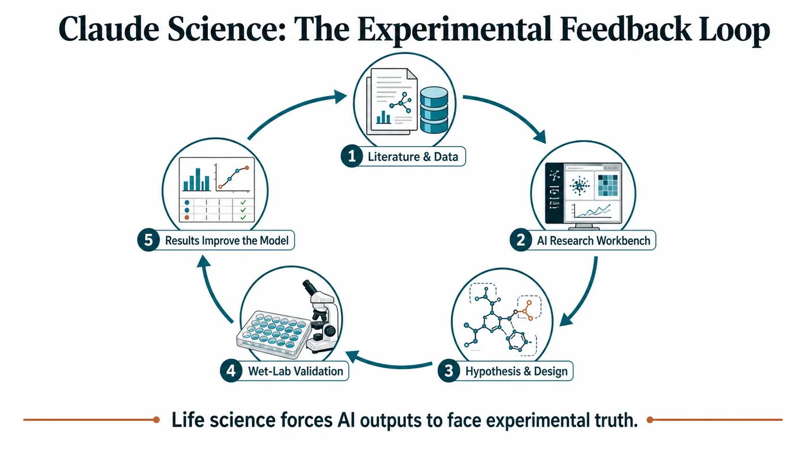
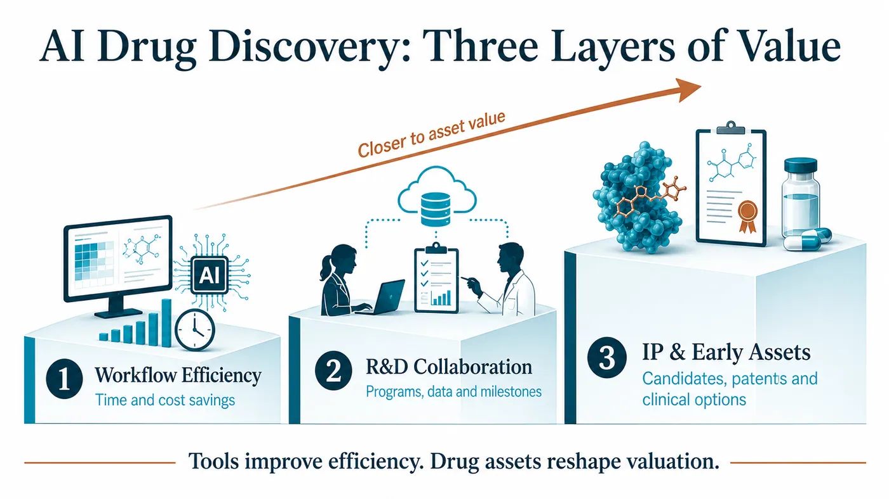
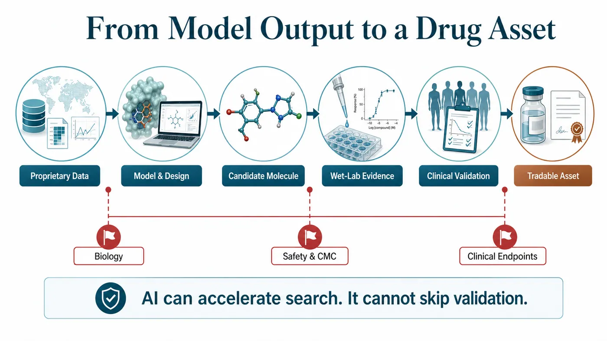
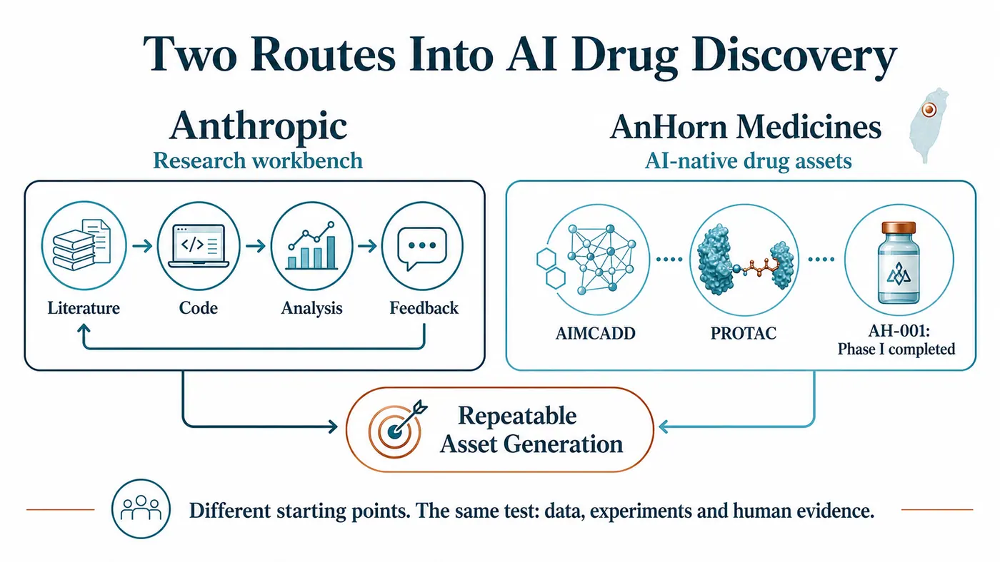

# Foundation Models Enter Drug Discovery: Anthropic Launches Claude Science as AI Companies Move Into the Real R&D Arena

On June 30, Anthropic pushed Claude into a field where polished demos rarely survive contact with reality: drug development.

Software can go through ten revisions in a day. A presentation can be rebuilt around three different narratives overnight. A drug cannot. It must pass through target selection, disease biology, molecular design, wet-lab experiments, toxicology, CMC, human trials, regulatory review and commercialization. Every gate pulls an ambitious AI narrative back toward evidence.

That is why the real industry significance of Claude Science is not simply another product launch. Anthropic has placed a scientific workbench, life-science workflows and its own drug discovery initiative on the same table.

Our assessment is that foundation-model companies are beginning to use life sciences as the hardest possible product feedback environment. They previously sold models, APIs and enterprise assistants. They are now moving into scientific workflows and, in some cases, participating directly in drug discovery. The claim they want to prove is changing from “Can the model answer a question?” to “Can the model create value inside real experiments and clinical assets?”

That shift could move AI drug discovery into its next phase.

## 01 | Claude Science: The Workbench Is Only the Entry Point; the Feedback Loop Is the Core

Anthropic describes Claude Science as an AI workbench for scientific research, designed to help researchers work across literature, data, code, analysis and the broader research process. In life sciences, tools like this can first find a place in several familiar use cases: reading papers, organizing experimental data, writing analytical code, planning studies and supporting early work on clinical or regulatory documents.

Those functions are useful, but they do not yet reach the deepest source of value in pharmaceutical R&D.

What made the market pay attention was Anthropic's simultaneous move into its own drug discovery program. Public reporting indicates that the initiative will focus on diseases that have long been under-resourced because their commercial return is limited. The positioning is notable. Anthropic is not immediately presenting itself as a fully integrated pharmaceutical company. Its first move is to put AI inside real scientific work.

Drug discovery does not behave like ordinary enterprise software, where clicks, retention and conversion can quickly reveal whether a product works.

In drug development, a model's answer must be tested experimentally. The experimental result then has to flow back into the model. An improved model must proceed into another design cycle, another assay panel and another candidate. This feedback is slow, expensive, difficult and full of failure. That is precisely why it is such a valuable real-world training environment for foundation-model companies.

Life sciences will force AI to tell the truth.

## 02 | Why Foundation-Model Companies Are Converging on Drug Development

The commercialization pressure on foundation-model companies is rising.

Office productivity, customer service, software development and content production can generate revenue quickly and demonstrate broad model capability. But competition in basic model access will intensify, and enterprise buyers will increasingly demand a more concrete return on investment.

Drug development offers a different possibility.

If AI can help research teams identify targets faster, design molecules more accurately, eliminate weak candidates earlier and organize clinical and regulatory data more effectively, its value extends beyond labor savings. It could change development timelines, capital efficiency and the speed at which pipelines are generated.

This helps explain why NVIDIA and Eli Lilly announced an AI co-innovation lab that brings together an AI factory, BioNeMo and experimental workflows for drug discovery; why Iambic is working with Takeda to connect structural prediction, generative design and automated experimentation to small-molecule development; and why AI biotechs such as Insilico continue to demonstrate through clinical data that an AI-designed candidate must still pass through human trials.

As foundation-model companies enter the field, drug discovery gains a new type of participant.

AI biotechs have generally begun with targets, molecules, datasets and pipelines. Foundation-model companies arrive with models, compute, enterprise customers, developer ecosystems and capital-market attention. They may not become conventional pharmaceutical companies, but they are likely to position themselves in three places:

First, as platforms for scientific workflows.

Second, as AI R&D partners for pharmaceutical companies and research institutions.

Third, as front-end discovery engines capable of generating intellectual property, candidates or early-stage assets.

These positions have fundamentally different valuation implications. The first sells efficiency. The second sells collaboration. The third begins to touch the economics of assets.

## 03 | The Real Test for AI Drug Discovery: Moving From Tool Revenue to Asset Revenue

AI drug discovery is often told as an elegant story: smarter models, faster development, lower costs and higher success rates.

Pharmaceutical development is rarely that orderly.

A model may improve search efficiency, but it cannot replace disease biology. AI can generate candidate molecules, but it cannot guarantee an adequate therapeutic window, exposure, tissue distribution, toxicology profile, long-term safety or successful clinical endpoints. Literature review and data analysis may accelerate, but efficacy signals in patients still emerge slowly.

That is why an AI drug discovery company cannot be judged simply by asking which model it uses.

### The Three Questions We Care About More

First, how deep is the data? Everyone can read public literature and databases. What remains scarce is experimental data, negative results, clinical samples, patient stratification and the detailed information generated throughout drug development.

Second, does the feedback loop actually run? Models, wet-lab experiments, automation, medicinal chemistry, ADMET, CMC and clinical strategy must be connected. A single isolated capability is unlikely to create a durable moat.

Third, can the system ultimately produce a tradable asset? Tools can reduce costs, but pipelines reshape valuation. Drug candidates, patents, collaboration milestones, licensing economics and clinical data are the language capital markets ultimately recognize.

This is the broader industry signal embedded in Claude Science. Foundation-model companies are leaving a world measured mainly by interactions and enterprise seats and entering an industry that will audit their models through experimental outcomes, clinical milestones and failure rates.

## 04 | The Taiwan Read-Through: AnHorn Medicines Offers a Clear Reference Point

For Taiwan, this issue cannot be viewed only through compute or software services.

The Taiwanese company closest to the core arena of AI drug discovery is AnHorn Medicines.

AnHorn's relevance is that it places AI, PROTACs, experimental validation and clinical asset generation along one development path. The company says its AIMCADD platform is used to design protein-degradation drugs, and AH-001, an AI-designed protein degrader, has completed a U.S. Phase I trial. That moves the company beyond a tools-only model. It has advanced AI design into human safety evaluation, with the next question being whether the process can repeatedly generate additional assets.

AnHorn occupies a different position from Anthropic, but both sit on the same industry map.

Anthropic represents a foundation-model company entering life sciences through a scientific workbench and accumulating feedback through real workflows and partnerships. AnHorn represents a Taiwanese company attempting to grow drug candidates and clinical assets directly from AI-native drug discovery.

One route brings model companies closer to drug R&D. The other turns AI into the R&D engine of a drug company. Both will ultimately be tested by the same question: can data, models, experiments and human results be connected into a system that repeatedly creates assets?

For Taiwan biotech to gain international recognition in AI drug discovery, the key will not be whether a company says it uses AI. The market will want to see where candidates came from, how experiments validated them, how human data read out, how the next pipeline can be replicated and why an international pharmaceutical company would choose to collaborate.

## 05 | Risk: Stronger Models Do Not Make Drug Development Simple

AI drug discovery is attracting intense attention, and its progress is easily described too quickly.

The pharmaceutical industry's most impartial feature is that every claim eventually has to return to patients.

Anthropic's own drug discovery initiative remains at a very early stage. Public information is not yet sufficient to determine whether it will generate a concrete candidate, clinical pipeline or licensable asset. Whether Claude Science can become deeply embedded in pharmaceutical companies and research institutions will depend on its ability to work with data permissions, experimental processes, regulatory requirements and established professional practices.

The experience of AI biotechs over the past several years offers the same warning: an impressive model is only the beginning. The expensive examinations come later, including wet-lab work, toxicology, IND clearance, clinical design, patient recruitment, statistical endpoints, CMC, regulatory interaction and commercialization.

Models can accelerate search, but they cannot bypass validation.

Compute can shorten iteration cycles, but it cannot replace safety.

Automation can improve efficiency, but it cannot guarantee patient benefit.

The most useful way to assess this wave of foundation-model companies entering drug discovery is therefore to locate them in the value chain. Which layer do they actually occupy?

Are they scientific assistants?

Are they R&D workflow platforms?

Are they partners to pharmaceutical companies?

Or are they becoming discovery engines that can gradually produce IP and early assets?

Each layer may create value, but each requires a different valuation framework.

## Conclusion | Life Sciences Will Give AI Its Hardest Reality Test

AI has already changed search, writing, software, customer service, design and enterprise workflows.

Drug development belongs to a different world. It is slow, expensive and demanding, and it uses patient outcomes to audit every technical promise.

Anthropic's launch of Claude Science and its move into drug discovery point to a clear direction: foundation-model companies are treating life sciences as a major next arena. They want to move from tool providers to participants in scientific workflows and then further into intellectual property, candidates and asset value.

The path is difficult. That difficulty is exactly why it matters.

The next phase of AI drug discovery will not be decided only by who has the largest model, the most parameters or the most polished presentation.

The real dividing line will emerge somewhere quieter and less forgiving: who can connect models to experiments, experiments to humans, and human data back into a better drug candidate?

When that happens, AI's role will extend beyond assisting with text and code.

It will begin to influence the speed at which new medicines are born.

## References

1. Anthropic | Claude Science, an AI workbench for scientists: https://www.anthropic.com/news/claude-science-ai-workbench
2. The Verge | Anthropic is getting into drug development: https://www.theverge.com/ai-artificial-intelligence/961311/anthropic-claude-science-ai-drug-development
3. NVIDIA | NVIDIA and Lilly Announce Co-Innovation AI Lab to Reinvent Drug Discovery in the Age of AI: https://nvidianews.nvidia.com/news/nvidia-and-lilly-announce-co-innovation-lab-to-reinvent-drug-discovery-in-the-age-of-ai
4. Iambic | Iambic Announces Collaboration with Takeda: https://www.iambic.ai/post/iambic-announces-collaboration-with-takeda
5. AnHorn Medicines | AIMCADD technology platform: https://www.anhornmed.com/our-technology/
6. AnHorn Medicines | AI-Designed Drug AH-001 Complete U.S. Phase I Trial: https://www.anhornmed.com/news/ai-design-ah001-protein-degrader-phase1-complete/

## Disclaimer

This article is industry research and market commentary. It does not constitute investment advice, a recommendation to buy or sell securities, medical advice or an endorsement of any company. Biotechnology, pharmaceutical and AI-related investments involve risks including clinical trials, regulatory review, licensing negotiations, commercialization, technological change and capital-market volatility. Readers should conduct their own analysis and bear responsibility for their decisions.
