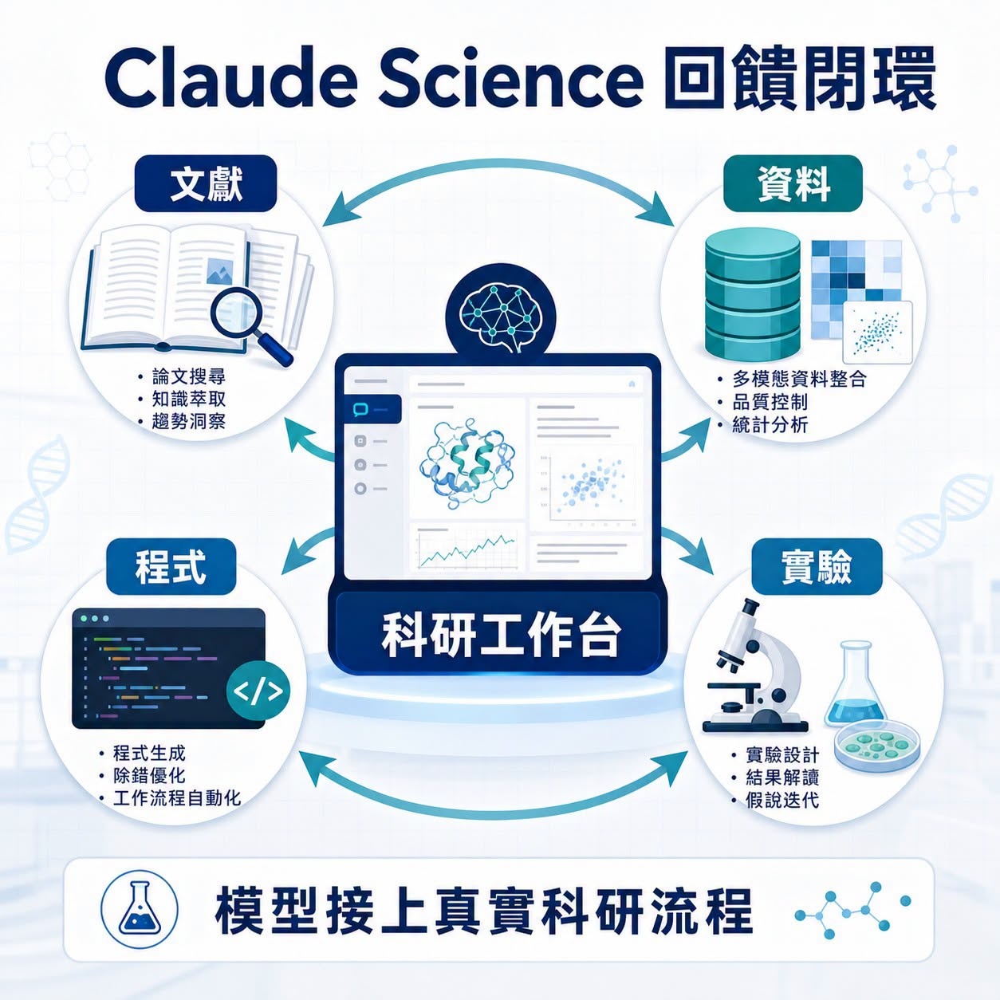
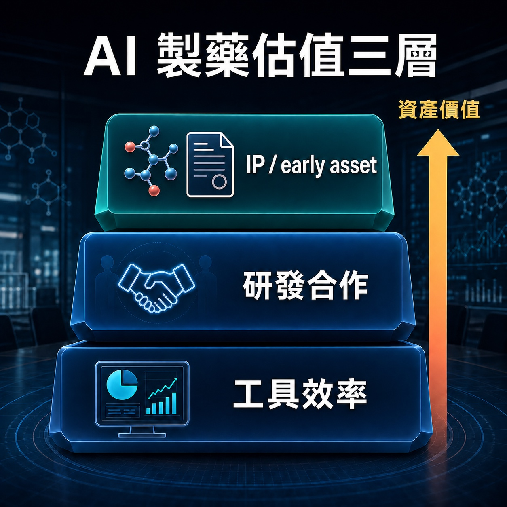
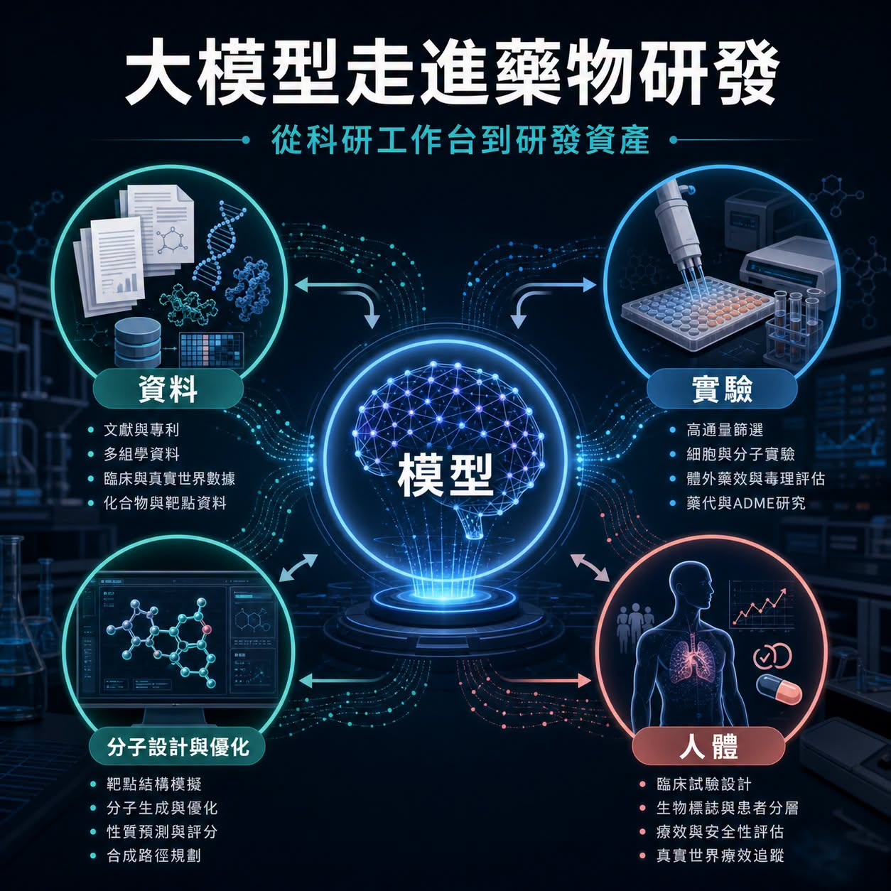
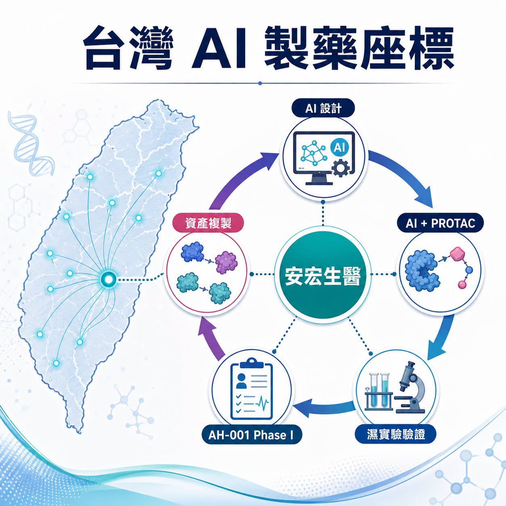

# 大模型公司走進 AI 製藥：Anthropic 推出 Claude Science，模型公司開始把藥物研發當成真實戰場

6 月 30 日，Anthropic 把 Claude 推進一個很少能靠漂亮 demo 蒙混過關的領域：新藥研發。

程式可以一天改十版，簡報可以一晚換三種故事。藥不行。藥物要走過靶點、生物學、分子設計、濕實驗、毒理、CMC、人體試驗、法規審查與商業化。每一道門都會把宏大的 AI 敘事拖回現實。

所以 Claude Science 的出現，真正牽動產業神經的，是 Anthropic 把科研工作台、生命科學工作流與自家藥物發現放到同一張桌上。

我們團隊的判斷是：大模型公司正在把生命科學當成最硬的產品回饋場。過去它們賣模型、賣 API、賣企業助理；現在開始進入科研工作流，甚至親自參與藥物發現。模型公司想證明的，已經從「能不能回答問題」，推進到「能不能在真實實驗與臨床資產裡創造價值」。

這會讓 AI 製藥進入下一個階段。

## 01｜Claude Science：工作台只是入口，回饋閉環才是核心

Anthropic 官方把 Claude Science 定位成面向科學研究的 AI 工作台，目標是協助研究者處理文獻、資料、程式、分析與研究流程。對生命科學公司來說，這類工具很容易先落在幾個場景：讀 paper、整理實驗資料、寫分析程式、做研究計畫、協助臨床或法規文件的前期工作。

這些功能本身有價值，但還沒有碰到製藥最深的價值出口。

真正讓市場停下來看的，是 Anthropic 同步啟動自家藥物發現計畫。公開報導提到，這個計畫會聚焦商業回報較有限、長期缺乏資源的疾病領域。這個方向很有意思：它沒有急著把自己包裝成下一家完整製藥公司，第一步先把 AI 放進真實科研現場。

藥物發現不像一般企業軟體，只要客戶點擊、留存、轉換率上升，就能快速知道產品有沒有用。

在新藥研發裡，模型給出的答案必須被實驗驗證。實驗結果再回到模型。模型改進後，還要進入下一輪設計、下一批 assay、下一個候選物。這種慢、貴、難、充滿失敗的回饋，正是大模型公司最需要的真實訓練場。

生命科學會逼 AI 說實話。

## 02｜大模型公司為什麼集體看上藥物研發

大模型公司的商業化壓力正在變大。

辦公、客服、程式開發、內容生產，這些場景可以快速收費，也能證明模型的通用能力。可是越往後走，單純模型調用的競爭會越來越激烈，企業客戶也會追問更具體的 ROI。

新藥研發提供了另一種想像。

如果 AI 能讓研究團隊更快找到靶點、更準設計分子、更早排除失敗候選物、更有效整理臨床與法規資料，價值就會超出人力節省。它可能改變研發週期、資本效率與管線生成速度。

這也是為什麼 NVIDIA 與 Eli Lilly 會宣布 AI co-innovation lab，為藥物發現建立 AI Factory、BioNeMo 與實驗工作流；Iambic 會與武田合作，把結構預測、生成式設計與自動化實驗接到小分子開發；Insilico 這類 AI Biotech 則用臨床資料持續證明，AI 設計的候選藥物最終仍要穿過人體試驗。

大模型公司進場後，賽道會多一種玩家。

AI Biotech 過去多半從靶點、分子、資料與管線出發；大模型公司則握有模型、算力、企業客戶、開發者生態與資本市場注意力。它們未必會直接變成傳統藥廠，但很可能把自己放在三個位置：

第一，科研工作流平台。

第二，藥企與研究機構的 AI 研發合作夥伴。

第三，能產生 IP、候選物或 early asset 的前段研發引擎。

這三個位置，對估值意義完全不同。第一層賣效率，第二層賣合作，第三層開始碰到資產。

## 03｜AI 製藥真正的考試：從工具收入走向資產收入

AI 製藥最容易被講成一個很漂亮的故事：模型更聰明，研發更快，成本更低，成功率更高。

但製藥產業很少這麼順。

模型可以提高搜尋效率，卻不能替代疾病生物學。AI 可以生成候選分子，卻不能保證安全窗、暴露量、組織分布、毒理、長期安全性與臨床終點都能過關。文獻整理與資料分析可以變快，但病人身上的療效訊號仍然慢慢讀出。

所以判斷 AI 製藥公司，不能停在「用了什麼模型」。

### 我們更在意三件事

第一，資料是否有深度。公開文獻與資料庫人人都能讀，真正稀缺的是實驗資料、負結果、臨床樣本、病人分層與藥物開發過程中的細節資料。

第二，回饋閉環是否跑得起來。模型、濕實驗、自動化平台、藥物化學、ADMET、CMC 與臨床策略要接在一起，單點能力很難形成長期護城河。

第三，最後能不能產生可交易的資產。工具可以省錢，管線才會重塑估值。候選藥物、專利、合作里程碑、授權條件與臨床資料，才是資本市場最終會認帳的語言。

這也是 Claude Science 這件事的產業訊號：大模型公司終於要離開只看互動次數與企業座席數的世界，走進一個會用實驗結果、臨床節點與失敗率來檢查模型的產業。

## 04｜台灣可以怎麼看：安宏生醫給了一個很清楚的座標

放回台灣，這題不能只從算力或軟體服務看。

台灣最貼近 AI 製藥核心戰場的公司座標，是安宏生醫 AnHorn Medicines。

安宏的價值在於，它把 AI、PROTAC、實驗驗證與臨床資產生成放在同一條路上。公司公開資料提到，其 AIMCADD 平台用於蛋白降解藥物設計，AH-001 這個 AI-designed protein degrader 已完成美國 Phase I。這代表它已經超出單純工具路線，把 AI 設計推進到人體安全性驗證，再看後續能不能複製出更多資產。

這和 Anthropic 的位置不同，卻落在同一張產業地圖上。

Anthropic 代表的是大模型公司從科研工作台切入生命科學，靠真實工作流與合作場景累積回饋；安宏代表的是台灣公司嘗試從 AI-native drug discovery 直接長出候選藥物與臨床資產。

一邊是模型公司往藥物研發靠近，一邊是新藥公司把 AI 變成研發引擎。兩條路最後都會被同一件事檢查：能不能把資料、模型、實驗與人體結果接成一個能反覆產生資產的系統。

台灣生技若要在 AI 製藥裡被國際市場看見，關鍵不會只在「有沒有用 AI」。市場會更想看見：候選藥物怎麼來、實驗怎麼驗、人體資料怎麼讀、下一條管線怎麼複製，以及國際藥廠為什麼願意合作。

## 05｜風險：藥物研發不會因為模型變強就變簡單

AI 製藥現在很熱，也很容易被講得太快。

但製藥產業最公平的地方，是最後一定要回到病人身上。

Anthropic 啟動自家藥物發現計畫，現在還處在非常早期的位置。公開資訊還沒有足以判斷它是否會產生具體候選藥物、臨床管線或授權資產。Claude Science 能不能在藥企與研究機構裡形成長期黏著，也要看它能否接入資料權限、實驗流程、法規需求與專業工作習慣。

AI Biotech 過去幾年的經驗也提醒市場：漂亮模型只是一開始。真正昂貴的考試在後面，包含濕實驗、毒理、IND、臨床設計、病人招募、統計終點、CMC、法規溝通與商業化。

模型可以加速搜尋，但不能跳過驗證。

算力可以縮短試錯時間，但不能替代安全性。

自動化可以提高效率，但不能保證病人獲益。

所以這一輪大模型公司進入 AI 製藥，最好的看法是回到價值鏈位置：它們到底站在哪一層？

是科研助理？

是研發流程平台？

是藥企合作夥伴？

還是能逐步產生 IP 與 early asset 的研發引擎？

每一層都可能有價值，但估值方式完全不同。

## 結語｜生命科學會讓 AI 接受最硬的現實測試

AI 改變過很多東西：搜尋、寫作、程式、客服、設計、企業流程。

但藥物研發是另一種世界。它慢、貴、嚴格，還會用病人的結果檢查每一句技術承諾。

Anthropic 推出 Claude Science、啟動自家藥物發現計畫，讓我們看到一個很清楚的方向：大模型公司正在把生命科學當作下一個主戰場。它們想從工具供應商，走向科研流程的參與者，再往更深處碰 IP、候選物與資產價值。

這條路很難，也正因為難，才值得看。

AI 製藥下一階段的勝負，不會只看誰的模型最大、參數最多、簡報最漂亮。

真正的分水嶺會在更安靜、更殘酷的地方出現：誰能讓模型接上實驗，讓實驗接上人體，讓人體資料回流成下一個更好的候選藥物。

那一天到來時，AI 的角色就會超出文字與程式輔助。

它會開始參與新藥誕生的速度。

## 參考資料

1. Anthropic｜Claude Science, an AI workbench for scientists: https://www.anthropic.com/news/claude-science-ai-workbench
2. The Verge｜Anthropic is getting into drug development: https://www.theverge.com/ai-artificial-intelligence/961311/anthropic-claude-science-ai-drug-development
3. NVIDIA｜NVIDIA and Lilly Announce Co-Innovation AI Lab to Reinvent Drug Discovery in the Age of AI: https://nvidianews.nvidia.com/news/nvidia-and-lilly-announce-co-innovation-lab-to-reinvent-drug-discovery-in-the-age-of-ai
4. Iambic｜Iambic Announces Collaboration with Takeda: https://www.iambic.ai/post/iambic-announces-collaboration-with-takeda
5. AnHorn Medicines｜AIMCADD technology platform: https://www.anhornmed.com/our-technology/
6. AnHorn Medicines｜AI-Designed Drug AH-001 Complete U.S. Phase I Trial: https://www.anhornmed.com/news/ai-design-ah001-protein-degrader-phase1-complete/

## 免責聲明

本文為產業研究與市場觀察，不構成任何投資建議、買賣建議、醫療建議或個股推薦。生技醫藥與 AI 相關投資涉及臨床試驗、法規審查、授權談判、商業化、技術迭代與資本市場波動等風險，投資人應自行判斷並自負盈虧。
