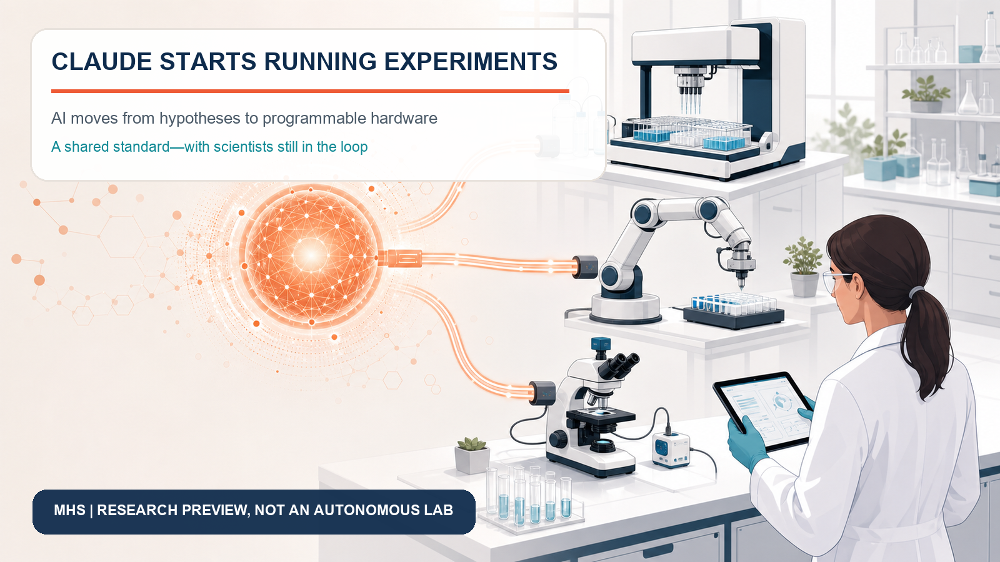
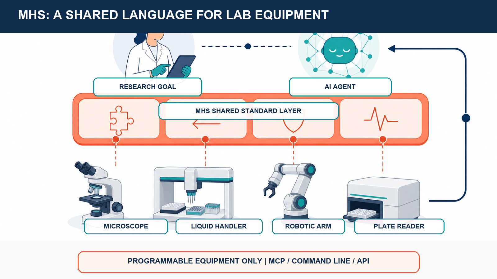
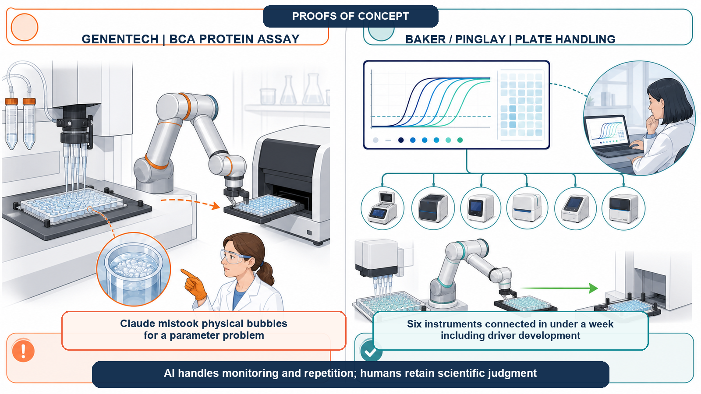
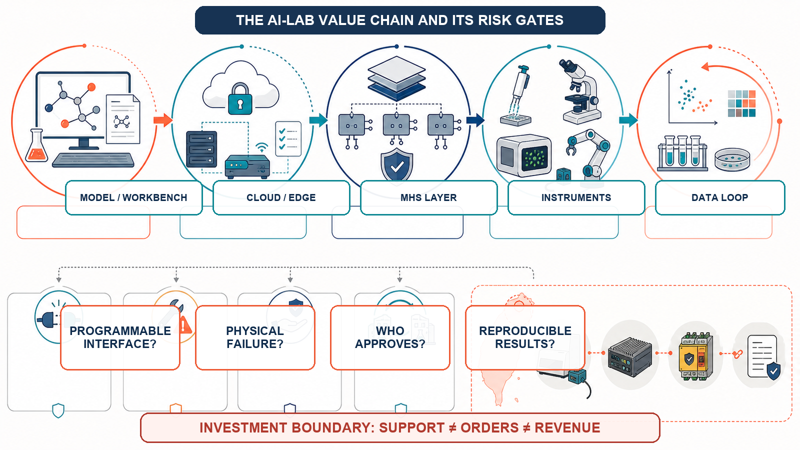

# Claude Starts Running Experiments: AI Enters the Physical Lab

At 2 a.m., a laser in a quantum computer loses lock. At 4 a.m., a graduate student must return to the lab to change a plate in a PCR instrument. AI could already read papers, propose hypotheses and write analysis code. Faced with a droplet, a pipette or a real instrument, however, it stopped at the screen.

On August 27, 2026, Anthropic moved that boundary forward. The company released a research preview of the Model Hardware Standard (MHS), a shared interface through which AI agents can read and operate microscopes, liquid-handling workstations, robotic arms, plate readers and laser-control systems. An agent can observe instrument state, sequence procedures, adjust parameters and, in some cases, recover from failure.

This does not mean Claude has taken over the laboratory, or that scientists are about to disappear. MHS is available only to an initial group of scientific and advanced-manufacturing partners, and most published examples are proofs of concept. Complex experiments, physical judgment and safety accountability remain human responsibilities.

The important shift is that AI for Science is no longer only a contest over who can produce more answers. It is becoming a contest over who can send an answer into physical equipment, collect new data and begin the next experimental cycle.

## 1 | Scientific AI has never lacked ideas

Generative AI can propose thousands of protein designs, but somebody still has to make and test them. A model may predict which molecule could work, yet it cannot by itself aspirate a reagent, control temperature, read a reaction and adapt after failure. Digital candidates are becoming cheaper; physical validation is becoming the new bottleneck.

Zihao Song, a doctoral researcher in the Baker and Pinglay laboratories at the University of Washington, offered a vivid example in Anthropic's case study. Designing a protein on a computer can cost as little as about $0.01, while testing one candidate at the bench can cost about $100 and require a week of labor. Once a project faces thousands of candidates, the budget and time disappear not only into deciding what to try, but into verifying it.

Academic workflows change constantly. Expensive, rigid automation may repeat one procedure ten thousand times but remain ill suited to a group that changes experiments dozens of times a year. Instruments also speak incompatible vendor languages. Connecting a liquid handler, robot and microscope can require custom software for each pair; Anthropic says such integration often takes weeks or months.

MHS addresses that long-neglected last mile.

## 2 | MHS is a common socket for laboratory equipment

MHS is not a new machine and is not limited to one brand of robot. It is a shared language between agents and instruments. A standardized driver converts actions such as reading a temperature, setting a temperature or moving to a position into simple read-and-write commands. A reference file describes the instrument's capabilities, adjustable values, load limits and safety boundaries in a form an AI system can interpret.

Once connected, an agent can orchestrate equipment through the Model Context Protocol (MCP), a command line or an application programming interface. Researchers describe a high-level objective in natural language; the agent decomposes the workflow, checks instrument state, waits for one step to finish and asks the next machine to take over.

Anthropic says the standard is model-agnostic. Other agent frameworks could use the same protocols. MHS remains early, and Anthropic plans to build safety evaluations and operating practices with partners before moving toward open source.

If it works, MHS could become a standard layer connecting models, instruments and laboratories: not a system that chooses the science, but one that lets AI reliably discover, understand and control programmable hardware.

## 3 | Genentech: Claude can tune parameters, but it does not understand a bubble

The proof of concept closest to drug development came from Genentech. The team chose the BCA protein assay and coordinated a liquid handler, robotic arm and plate reader. Claude served as the central coordinator through MHS and searched for suitable pipetting speeds for water and viscous bovine serum albumin solution.

It ran trials, read results, compared them with expert baselines and adjusted the next round. For that setup, it identified approximately 140 microliters per second for water and 10 microliters per second for the viscous protein solution; Genentech automation specialists considered the values reasonable.

The failure was more instructive. When bubbles caused a detection error, Claude treated the event as a parameter problem and repeatedly retried the same well, creating more foam. A researcher had to explain that this was a physical problem: move to a clean well and reduce mixing.

Claude retained the guidance in later runs, and the team converted it into a reusable liquid-handling skill. But reading large amounts of chemistry and physics does not give a language model the embodied intuition of a laboratory worker. Genentech therefore described the work as a promising proof of concept, not a fully autonomous laboratory. Scientists still set biological goals, interpret critical results and handle unknown failures.

## 4 | Baker, Pinglay and Janelia: reducing night shifts and integration work

In the Baker and Pinglay laboratories, Song connected six instruments in less than a week, including the time needed to write drivers. A remote dashboard let an agent monitor qPCR amplification curves and stop a run at the appropriate point. It also coordinated a robot and liquid handler during plate transfers.

Repeated tests produced no collision between the two machines. Song could monitor the procedure from his office rather than return to the bench every hour or two. This remained a demonstration: complex workflows need substantial optimization, and long-running agents add compute cost. The immediate value is reducing instrument watching, waiting and delayed detection of spoiled samples.

One early MHS project began at HHMI's Janelia Research Campus, where neuroscience rigs combine lasers, lenses, focusers, sensors and software from multiple vendors. Researchers exposed equipment state through MHS so Claude could align beams, adjust optical systems and check results with sensors. One microscope setup reportedly compressed about half a day of manual configuration into one step.

MHS does not remove physical trade-offs in imaging. Scan speed, coverage and signal quality still compete. A standards layer can reduce integration friction; it cannot repeal physics.

## 5 | QuEra's 99.3% result is impressive—and narrow

Quantum-computing company QuEra used MHS for laser-lock recovery. Its previous specialist-built script succeeded about 58% of the time and took roughly 150 seconds per attempt. After Claude interacted with instruments and iterated, it produced a standalone script that recovered the correct lock in 695 of 700 blind tests, or 99.3%. The hardest perturbations took about 10–14 seconds; simpler cases took roughly 0.9–5.4 seconds.

That result shows what AI may accomplish in a closed problem with a clear objective, readable state and adjustable controls. It does not establish that Claude understands the physical world. It still could not diagnose physical hardware failures, and it sometimes stopped for human approval when an action appeared risky.

Safety cuts both ways. An overconfident agent may damage costly equipment, waste scarce samples or endanger people. An overly cautious one can defeat the purpose of unattended experiments. Adoption will depend on clear permissions, device-level limits, human approval points and accountability.

## 6 | The platform contest spans models, workbenches and hardware standards

MHS makes more sense alongside Anthropic's other science initiatives. In June 2026, the company introduced the Claude Science beta, combining literature, databases, code environments, charts, compute and auditable records in one workbench. It included more than 60 scientific skills and connectors across genomics, single-cell analysis, proteomics, structural biology and cheminformatics.

On August 27, Anthropic also announced 10,000 team seats for scientists for one year. Verified principal investigators at academic or nonprofit institutions can add free standard seats; premium seats with five times the usage cost $15 a month. Researchers can separately apply for up to $50,000 in AI for Science credits per project.

Together, the strategy has three layers: subsidized model access for research teams; Claude Science for digital research workflows; and MHS for programmable physical equipment. Experimental data can return to the model, creating a hypothesis–design–execution–measurement–revision loop. Anthropic may be competing less to own each discovery than to own the interface through which scientific work, device data and experimental records pass.

## 7 | Who benefits, and which businesses may be rewritten?

Instrument and robotics companies that support the standard could benefit first. Anthropic's early partner or testing list includes Danaher, QIAGEN, Tecan, MBF Bioscience, Automata, Doosan Robotics and Universal Robots; AWS plans support through Strands Robots. Easier discovery and control may put compatible equipment into more workflows and shift service from reactive repair toward live diagnostics.

Cloud, data and model-tool providers form a second layer. Long experiments consume inference, storage, audit and access-control resources. Providers that can connect sensitive local data, cloud compute and device control securely may earn recurring revenue.

Pressure may fall on firms that rely only on one-off custom connectors. Standard drivers could commoditize low-value translation work. Integrators that understand experimental validation, regulation and safety may instead move up the value chain into system qualification, risk controls and multi-site deployment.

Investors should not translate ecosystem participation directly into revenue. MHS is not yet open source and remains a research preview. Partners range from exploration and testing to driver development and planned support. Supporting a standard is not the same as receiving a large order, much less proving market leadership.

## 8 | Taiwan's opportunity: turn legacy instruments into auditable data nodes

Taiwan combines precision manufacturing, robotics, semiconductors, servers, medicine and biotechnology. Its most useful opportunity may not be another chatbot, but three practical layers.

First, reliable drivers for existing equipment. Many hospitals, universities and factories still use instruments without modern APIs. Sensing, edge control, device digitization and safety isolation could make installed equipment accessible.

Second, auditable experimental data chains. Life science depends on batch records, calibration, reagents, permissions and sample provenance. Every instruction needs an approver and version; every result must be reproducible before it can support drug development or regulation.

Third, shared human–machine safety systems. Device limits, emergency stops, anomaly detection, approval gates and accountability logs may create more value than selling another robotic arm.

The meaningful metrics are how many devices are connected, how much integration time falls, whether downtime and sample loss decline, and whether revenue is recurring rather than one-off.

## 9 | Do not declare scientists replaced

MHS has four clear limits. It works only with equipment that has a programmable interface; language models have weak spatial and physical reasoning; safety practices are still under construction; and all published outcomes come from a small number of partners and tightly bounded tasks. Protein assays, plate transfers, microscope setup and laser locking do not validate complex cell culture, unknown biological reactions or clinical development.

A more accurate statement is that Claude is beginning to acquire hands for programmable hardware. Scientists still decide where to go, what may be done, whether results are trustworthy and who is accountable when something fails.

## Conclusion | The next AI-for-Science contest is about closing the loop

AI for Science used to resemble an exam: the system that read more papers, predicted more accurately and generated more candidates appeared to lead. MHS moves the contest into the physical world.

When an agent can operate equipment, it can help obtain the next dataset for training and validation. A hypothesis becomes a physical action, and an experimental result becomes the starting point for another decision. Anthropic has not proved that Claude is a scientist. It has placed the model, a scientific workbench and a hardware standard on the same platform map.

Today, scientists still cannot hand over the keys. MHS is a research preview, proofs of concept must scale, and physical failure and safety accountability remain unresolved. A mature autonomous laboratory will not be AI working alone behind a closed door. It will combine model speed, instrument precision and expert judgment while leaving an auditable trail among all three.

AI for Science has changed because Claude has begun to touch the real world—and the real world will use every bubble, shutdown and irreproducible result to teach AI what science actually requires.

## Primary Sources

1. [Anthropic | Previewing the Model Hardware Standard](https://www.anthropic.com/news/model-hardware-standard-research-preview)
2. [Anthropic | Expanding our support for scientists](https://www.anthropic.com/news/expanding-support-for-scientists)
3. [Anthropic | Claude Science, an AI workbench for scientists, is now available](https://www.anthropic.com/news/claude-science-ai-workbench)

This article is an analysis of technology and the biotechnology industry. It is not medical or investment advice. MHS and Claude Science remain a research preview and a beta product, respectively. The cases, performance figures and cost estimates described above come from Anthropic and its partners and require broader, independent, cross-device and long-term validation.
