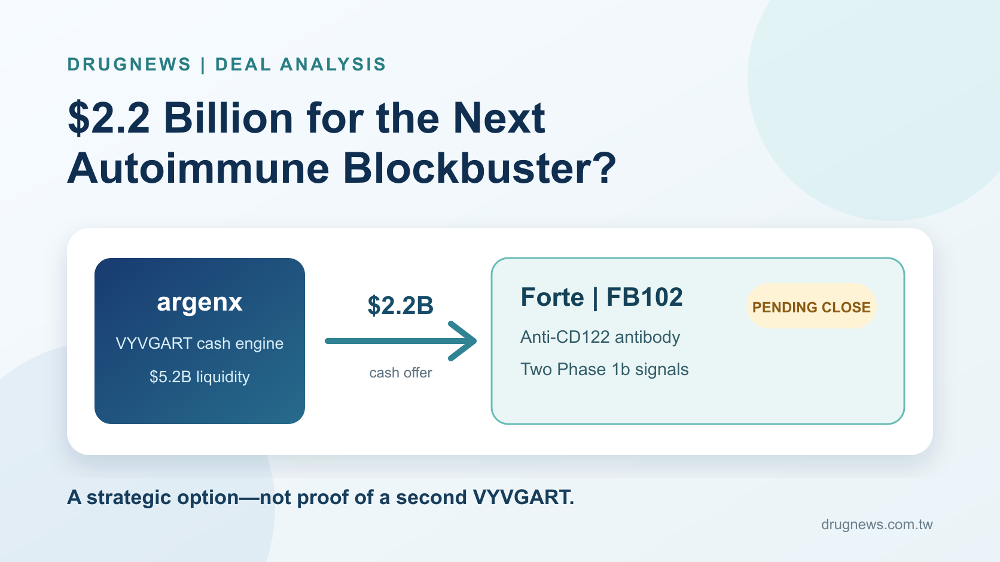
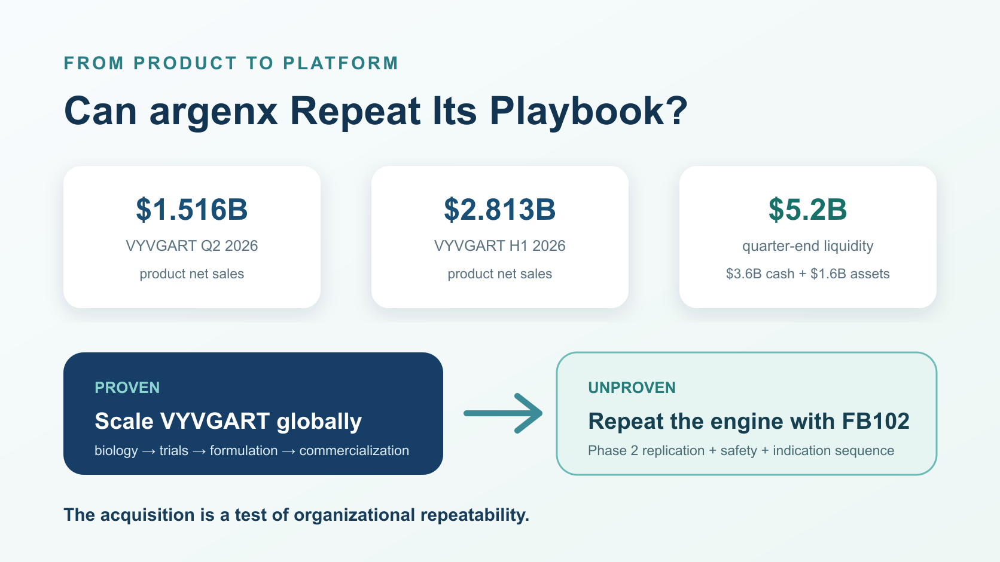
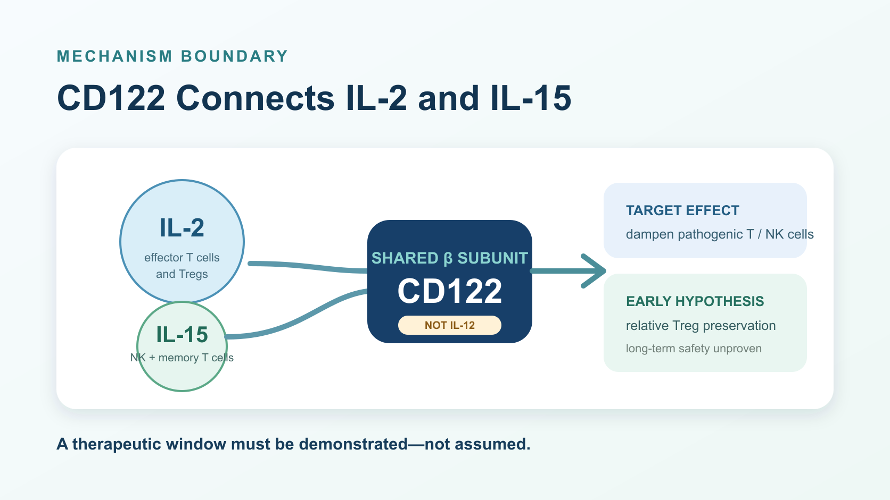
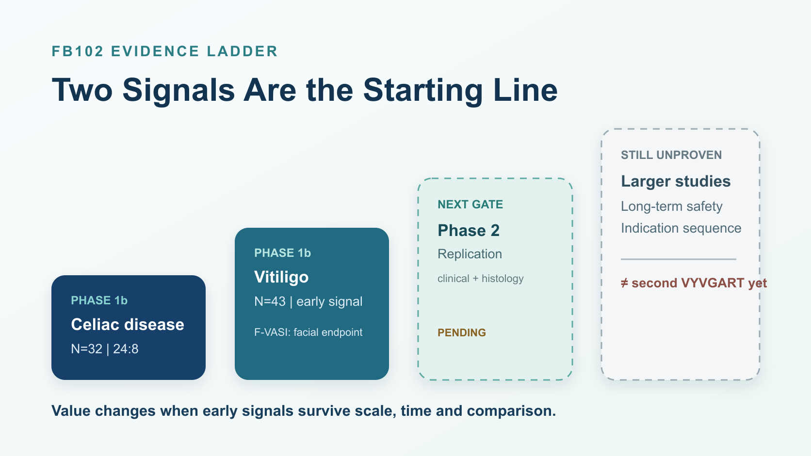

# $2.2 Billion for the Next Autoimmune Blockbuster?

argenx built its rise on VYVGART, a blockbuster that reduces pathogenic immunoglobulin G antibodies and is used across diseases such as generalized myasthenia gravis. Now the company is preparing to spend approximately $2.2 billion in cash to acquire Forte Biosciences.

The buyer and seller have changed seats.

VYVGART made that reversal possible. The product generated $1.516 billion in net sales in the second quarter of 2026 and $2.813 billion in the first half. At the end of June, argenx held $3.6 billion in cash and cash equivalents plus $1.6 billion in current financial assets, for total liquidity of about $5.2 billion.

But this transaction is more than a newly wealthy biotech going shopping. Forte has no commercial product, and its lead asset, FB102, remains in early clinical development. Even so, argenx is willing to commit an amount equal to roughly 42% of its quarter-end liquidity to buy the program before the decisive trials have read out.

What, exactly, does $2.2 billion purchase: an anti-CD122 antibody, two Phase 1b signals, or the belief that argenx has distilled VYVGART's success into a repeatable corporate capability?

Three distinctions matter. argenx has already shown that it can turn a novel mechanism into a global medicine. FB102 has produced early proof-of-concept signals in vitiligo and celiac disease. What remains unproven is whether those signals can survive Phase 2 and become another product with credible multi-indication potential.

The first blockbuster proves that a company can win. The second shows whether it understands why it won.

*Figure 1. The acquisition has been announced but has not closed. The price buys an early clinical option, not proof of a second VYVGART.*

## 01 | The Deal Has Not Closed, but the Price Already Includes Ambition

On July 27, 2026, argenx announced a definitive merger agreement to acquire Forte for $77 per share in cash, representing approximately $2.2 billion in total equity value.

The tense is important. As of the July 31 research cutoff, the companies had announced an acquisition and were working toward closing; Forte had not yet become part of argenx. The tender still required a majority of outstanding shares and the completion of customary conditions, including the U.S. antitrust waiting period. Both companies said they expected the transaction to close in the third quarter of 2026. It is funded with cash on hand and is not subject to a financing condition.

The official premium was approximately 86% relative to Forte's volume-weighted average share price since it released its Phase 1b vitiligo data on July 9. That is not the same as an 86% premium to the previous day's closing price, and the distinction matters when investors assess how much of the clinical story was already reflected in the market.

The valuation says argenx does not intend to wait for every uncertainty to disappear. Once a successful Phase 2, a clear indication sequence, a subcutaneous formulation strategy and a commercial path are visible, the scientific risk would be lower—but the asset would no longer be priced as an early-stage option. argenx is paying early to secure both control and development leadership.

The relationship also did not begin with the merger agreement. In April, Forte raised approximately $150 million in a public offering, and argenx participated as a strategic investor. The public filings do not disclose how much argenx itself purchased, so the entire financing cannot be attributed to the company.

These may sound like technical qualifications. They are what separate reading a transaction from filling its gaps with a story.

## 02 | VYVGART Gave argenx an Expensive Admission Ticket

VYVGART is the cheque book behind the acquisition.

Efgartigimod, VYVGART's active ingredient, blocks the neonatal Fc receptor, or FcRn, and accelerates the breakdown of IgG. Because abnormal IgG antibodies drive multiple autoimmune diseases, one mechanism can potentially support development across several indications instead of remaining confined to one disease.

The commercial achievement is not simply that the first indication sold well. argenx developed a repeatable method around the molecule: identify patient groups with strong biological rationale, sequence indications, develop formulations, execute global trials and commercialization, and unlock the same asset layer by layer. Under its Vision 2030 plan, the company aims to treat 50,000 patients globally, secure ten labeled indications and advance five candidates into registrational development by 2030.

That operating model is what makes Forte strategically attractive. argenx is not trying to copy the molecular design of VYVGART. It is trying to reproduce the development logic: identify a shared disease pathway, establish a signal in one setting, then expand one drug across multiple indications.

*Figure 2. VYVGART has already proved that argenx can scale one mechanism. FB102 asks whether that success reflects a repeatable platform capability.*

That is also the transaction's hardest test. If FB102 ultimately produces only modest benefit in a narrow indication, $2.2 billion will look expensive. If it repeatedly creates clinically meaningful differences across diseases driven by pathogenic T cells and natural killer cells, the asset could become a second growth engine. The acquisition price is therefore a wager on organizational repeatability as much as it is a wager on one antibody.

## 03 | Get the Biology Right: FB102 Targets the IL-2/IL-15 Axis

FB102 is Forte's anti-CD122 monoclonal antibody candidate. CD122 is the beta subunit shared by the interleukin-2 and interleukin-15 receptors. It is not part of the IL-12 receptor. Getting that detail wrong sends the rest of the immunology in the wrong direction.

IL-15 supports the survival and activation of natural killer cells and subsets of memory T cells. IL-2 participates in signaling for both effector T cells and regulatory T cells, or Tregs. That creates the central challenge of targeting CD122: suppress enough pathogenic T-cell and NK-cell activity to produce clinical benefit without excessively impairing the Treg populations that help maintain immune balance.

Forte's design thesis is that FB102 can find that therapeutic window. In company-reported in vitro experiments, the antibody inhibited proliferation or activation of human T cells and NK cells after IL-2 or IL-15 stimulation. Under its IL-2 experimental conditions, Treg proliferation was relatively preserved.

The qualification is essential. Relative Treg preservation is supported mainly by in vitro work, nonhuman-primate studies and early human evidence. It is not yet selective activity proven in large clinical trials. The data do not justify claims that FB102 attacks only harmful immune cells, spares normal immunity, or is certain to be safer than JAK inhibitors.

*Figure 3. Dampening pathogenic T-cell and NK-cell signaling is the goal. Relative Treg preservation remains an early hypothesis, not a settled clinical advantage.*

Early pharmacodynamic evidence tells us that the idea deserves testing. Only larger and longer randomized trials can tell us whether the proposed therapeutic window exists in patients.

## 04 | Are Two Phase 1b Signals Worth $2.2 Billion?

Before argenx moved to acquire Forte, FB102 had produced early human signals in celiac disease and vitiligo.

Celiac disease is an immune-mediated disorder triggered by gluten. Strict gluten avoidance remains the foundation of treatment, yet cross-contamination is difficult to eliminate in daily life, and diet alone does not fully control symptoms and intestinal injury for every patient.

FB102's Phase 1b celiac study was a small randomized, double-blind, placebo-controlled trial with 32 participants: 24 received FB102 and eight received placebo. Participants received four doses at 10 mg/kg and then underwent a 16-day gluten challenge.

Forte reported a mean change in the composite VCIEL histology measure of -1.849 from baseline in the placebo group versus 0.079 in the FB102 group, with p=0.0099. CD3-positive intraepithelial lymphocyte density increased by 13.3 in the placebo group and declined by 1.5 with FB102, with p=0.0035.

The value of this result is that a controlled gluten challenge produced directionally consistent histology and immune-cell signals, which are more informative than a symptom questionnaire alone. Its limits are equally clear. The study enrolled only 32 people, and the challenge lasted 16 days. It cannot establish that patients would remain protected during long-term, real-world exposure to gluten. All 32 completed the day-32 biopsy, and treatment-emergent adverse events were mostly grade 1, but a small Phase 1b trial cannot exclude uncommon or long-term safety risks.

The vitiligo evidence came from an early Phase 1b analysis of 43 people: 32 received FB102 and 11 received placebo. The more conservative efficacy-evaluable comparison included 32 and 10 patients, respectively.

At week 24, centrally read mean improvement in the facial Vitiligo Area Scoring Index, or F-VASI, was 29.6% with FB102 and 7.9% with placebo. The placebo-adjusted difference was 21.7 percentage points, with p=0.020. F-VASI is a facial measure, not evidence of the same response across the entire body, and the result cannot be used for a direct cross-trial ranking against other medicines.

In the subgroup with baseline F-VASI of at least 0.75, 17 FB102-treated patients and only four placebo patients were evaluable. Mean improvement at week 24 was 43.2% versus 0.5%. The magnitude is interesting, but a four-person placebo group makes the analysis exploratory rather than confirmatory.

These two studies explain why argenx was willing to act. They do not prove that it has already found the next VYVGART. The next valuation-changing evidence is whether the celiac Phase 2 reproduces both biological and clinical benefit, whether vitiligo holds up in a larger study, whether alopecia areata or another indication points in the same direction, and whether longer follow-up preserves an acceptable immune-safety window.

At the research cutoff, the celiac Phase 2 had not reported results. Forte said it expected a readout in the second half of 2026, while ClinicalTrials.gov listed an estimated primary completion date in February 2027. The two timelines are not identical. The company expectation can be reported as an expectation; it should not be presented as a guaranteed data date.

*Figure 4. Celiac and vitiligo Phase 1b studies are the beginning. Replication, scale and durability still separate FB102 from a second blockbuster.*

## 05 | A Large Story Still Has Three Gates to Clear

For an early-stage candidate, $2.2 billion is a substantial price. It capitalizes three outcomes that have not yet occurred.

First, the Phase 1b signals must replicate. Small early studies are vulnerable to baseline imbalances, analysis-population choices and the influence of individual participants. The vitiligo subgroup, in particular, compared 17 treated patients with four placebo patients. A smaller effect in the next trial would not necessarily mean the drug has no activity, but it would materially change the commercial value investors should assign to the program.

Second, the CD122 safety window must persist over time. T cells and NK cells do not operate only in autoimmune disease; they also contribute to infection defense and immune surveillance. The absence of severe events in a short early study does not establish that large, longer studies will avoid immunosuppression, infection or uncommon complications. FB102's value depends on maintaining useful selectivity at an effective dose.

Third, argenx must sequence the indications well. Celiac disease has clear unmet need, but endpoints, dietary background and reimbursement are complex. Vitiligo affects a large population but already has competition from topical JAK therapies. Alopecia areata is also becoming crowded. Which disease moves first, which endpoint is used, and whether a subcutaneous formulation is developed will determine development time and capital efficiency.

VYVGART's record understandably encourages confidence in argenx. Corporate capability is not a permanent pass. It may improve the odds of selecting the right molecule and indication, but it cannot answer Phase 2 and Phase 3 in advance.

## 06 | Taiwan Has Real Connections, but Not a Ready-Made “Concept Stock” Basket

Taiwanese readers can locate the transaction through two genuine industry links.

The first is VYVGART's existing commercialization network. Zai Lab, listed on Nasdaq as ZLAB and in Hong Kong as 9688, holds rights to efgartigimod in Greater China. Synmosa Biopharma, listed in Taiwan as 4114, obtained 15-year Taiwan commercialization rights from Zai Lab Taiwan for six therapies, including VYVGART.

Synmosa's connection to argenx therefore sits in VYVGART's Taiwan commercialization ecosystem. It is not a party to the Forte acquisition and is not a disclosed Taiwan partner for FB102. The available primary sources also do not support using this article to claim that VYVGART has already been approved or launched in Taiwan.

The second link is Taiwan's own drug development in vitiligo. Elixiron Immunotherapeutics, listed as 7871, is developing EI-001, or indemakitug, an anti-interferon-gamma antibody for vitiligo. TWi Biotechnology, listed as 6610, is developing the topical JAK inhibitor AC-1101 across immune dermatology indications including vitiligo and alopecia areata.

Neither company has a disclosed relationship with FB102. Their relevance is comparative: Taiwan-based developers are approaching immune-driven pigment and hair disorders through different targets, modalities and development risks.

Conversely, Taiwanese antibody manufacturers and contract development companies should not be labeled acquisition beneficiaries merely because FB102 is an antibody. No primary evidence links companies such as EirGenix, Mycenax or United BioPharma to this program. Capability adjacency is not a supply agreement.

## Conclusion | VYVGART Proved argenx Can Scale; FB102 Must Prove It Can Repeat

The most interesting part of this transaction is not that argenx finally has enough cash to buy a company, nor that one FB102 p-value looks attractive. The deal exposes the next challenge for a successful biotech.

VYVGART proved that argenx could identify a valuable immune mechanism, execute global clinical development and formulation strategy, commercialize it, and turn one molecule into a multibillion-dollar product.

FB102 asks a different question: can that method leave FcRn, move to CD122, and work again?

The $2.2 billion price buys admission to the examination room, not a diploma. The real dividing lines will be Phase 2 replication in celiac disease, stability of the vitiligo signal in larger trials, and a CD122 safety window that holds over longer exposure.

The first blockbuster gave argenx the resources to become an acquirer. A second will determine whether it is a company with one extraordinary product or an immunology platform capable of repeatedly producing medicines.

## References

1. [argenx, “argenx to Acquire Forte Biosciences, Inc., Adding First-in-Class anti-CD122 Antibody, FB102, to its Immunology Pipeline,” July 27, 2026](https://argenx.com/news/2026/press-release-3333257.html)
2. [Forte Biosciences, Form 8-K and merger agreement, July 27, 2026](https://www.sec.gov/Archives/edgar/data/1419041/000119312526316766/d31466d8k.htm)
3. [argenx, first-half 2026 financial results and second-quarter business update](https://argenx.com/news/2026/press-release-3331862.html)
4. [Forte Biosciences, FB102 Phase 1b celiac disease results](https://www.fortebiorx.com/investor-relations/news/news-details/2025/Forte-Biosciences-Announces-Positive-Data-in-FB102-Celiac-Disease-Phase-1B-Study/default.aspx)
5. [Forte Biosciences, FB102 Phase 1b vitiligo results](https://www.fortebiorx.com/investor-relations/news/news-details/2026/FB102-Achieves-Statistically-Significant-Improvement-in-Vitiligo-at-Week-24-After-Completion-of-12-Week-Treatment-Period/default.aspx)
6. [ClinicalTrials.gov, celiac disease Phase 2, NCT06982963](https://clinicaltrials.gov/study/NCT06982963)
7. [ClinicalTrials.gov, vitiligo Phase 1, NCT06905873](https://clinicaltrials.gov/study/NCT06905873)
8. [argenx and Zai Lab, Greater China collaboration for efgartigimod](https://argenx.com/news/2021/argenx-and-zai-lab-announce-strategic-collaboration-efgartigimod-greater-china)

Research cutoff: July 31, 2026 (UTC+8). A live pre-publication check on August 9 found no newer argenx newsroom announcement of transaction closing or celiac Phase 2 results.

This article is for biotechnology and industry analysis only. It does not constitute medical diagnosis or treatment advice, investment advice, fundraising advice, or a recommendation to buy or sell securities. Drug development, regulatory review, transaction closing and commercialization remain uncertain; decisions should rely on current official information and qualified professional advice.
