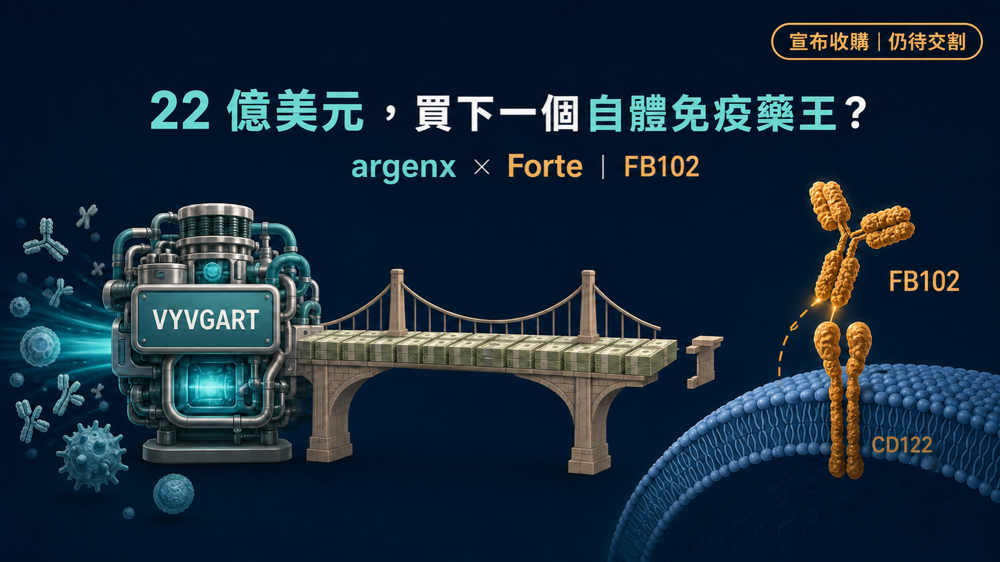
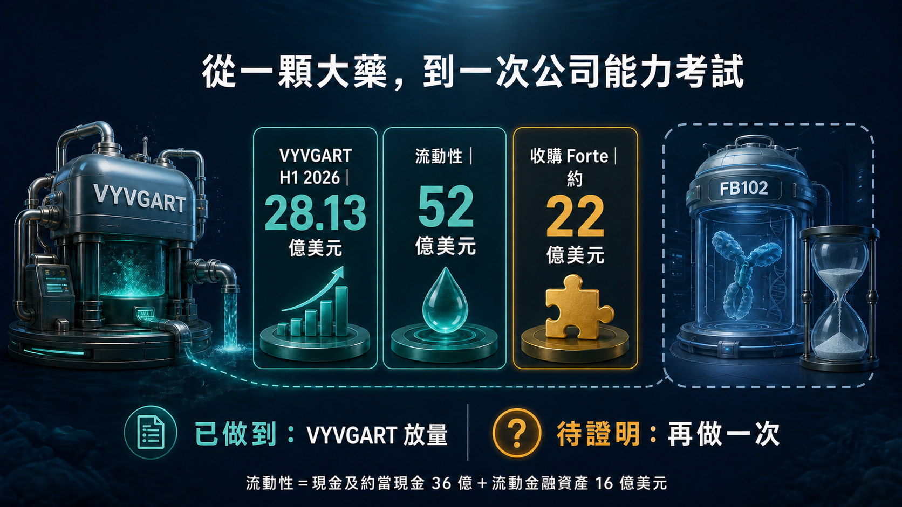
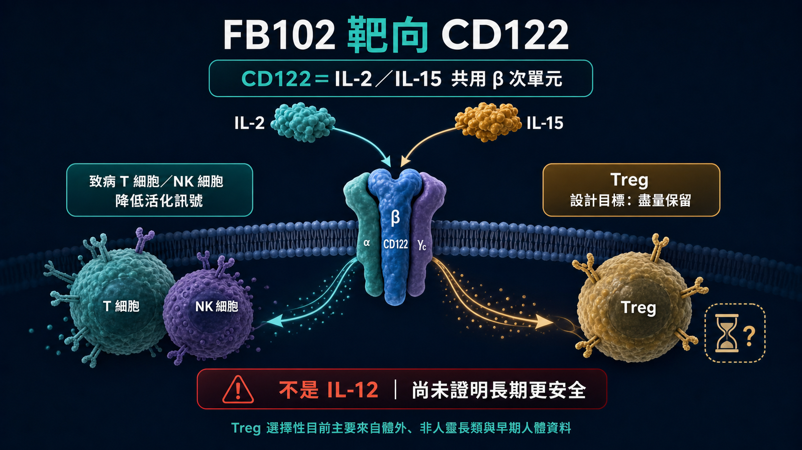
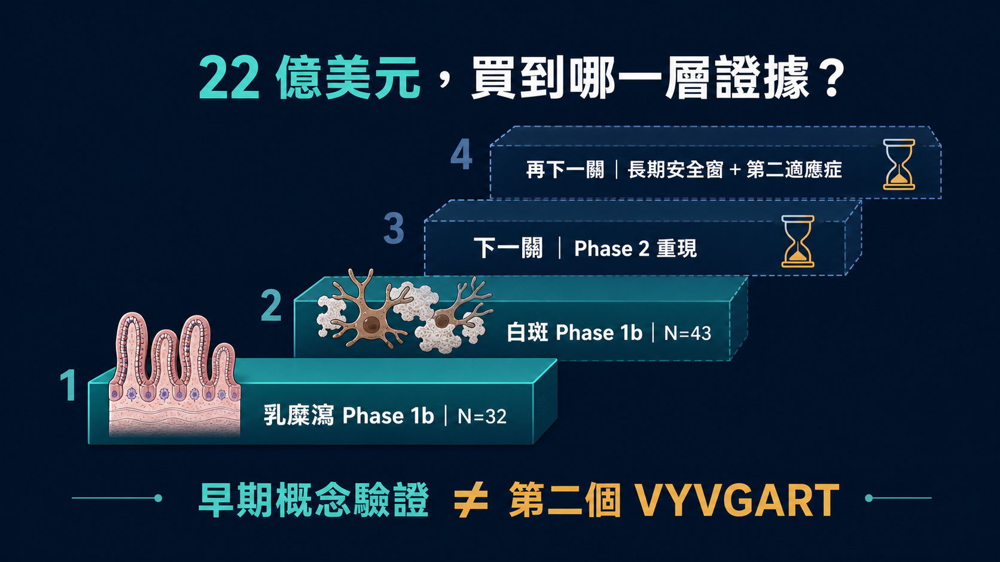

# 22 億美元，買下一個自體免疫藥王？

靠 VYVGART（可降低致病性 IgG 抗體、用於重症肌無力等自體免疫疾病的暢銷藥）崛起的 argenx，現在拿出約 22 億美元現金，準備收購 Forte Biosciences。

買方與賣方的座位，換了。

這個轉身的底氣，來自 VYVGART。2026 年第二季，VYVGART 產品淨銷售達 15.16 億美元；上半年累計 28.13 億美元。到 6 月底，argenx 持有 36 億美元現金與約當現金，加上 16 億美元流動金融資產，合計流動性約 52 億美元。

但這筆交易最值得看的，並不是「一家有錢的新藥公司開始買東西」這麼簡單。

Forte 沒有上市產品，核心資產 FB102 還停在早期臨床。argenx 卻願意用相當於自身期末流動性約四成的價格，提前買走它的未來。

所以，22 億美元買的究竟是什麼？

是一支抗 CD122 抗體（CD122 是會影響 T 細胞與自然殺手細胞的免疫受體元件）？兩組一期訊號？還是 argenx 相信，自己已經把 VYVGART 從一顆藥的成功，提煉成一套可以再做一次的公司能力？

先把答案說在前面：

1️⃣ 已經證明的，是 argenx 能把一個新機制做成全球大藥。

2️⃣ 目前買到的，是 FB102 在白斑與乳糜瀉出現的早期概念驗證訊號。

3️⃣ 還沒證明的，是這些訊號能否在第二期重現，並長成另一個「一藥多適應症」平台。

第一顆大藥，證明一家公司會贏。

第二顆，才證明它知道自己為什麼贏。

*圖 1｜交易已宣布、仍待交割；22 億美元買到的是 FB102 的早期選擇權，不是第二個 VYVGART 的完成證明。*

## 01｜交易還沒完成，價格已先把期待買滿

2026 年 7 月 27 日，argenx 宣布與 Forte 簽署確定性合併協議，擬以每股 77 美元現金收購 Forte，總股權價值約 22 億美元。

這裡有一個很重要的時態：截至 7 月 31 日，雙方是「宣布收購、等待交割」，不是 Forte 已經被收入囊中。

交易仍須取得過半流通股應賣，並完成美國反壟斷審查等一般條件；雙方預期在 2026 年第三季完成。argenx 會以手頭現金支付，交易沒有融資條件。

公司採用的官方溢價口徑，是相較 Forte 自 7 月 9 日公布白斑 Phase 1b 數據以來的成交量加權平均價，高出約 86%。

這個價格顯示，argenx 沒打算等所有答案都出來才下注。

等第二期成功、適應症排序明朗、皮下注射劑型與商業模型都成形後，風險會變小，但價格也不會還在原地。argenx 選擇在證據仍薄、想像空間仍大的時候進場，等於同時買下控制權與開發主導權。

交易也不是完全沒有鋪墊。Forte 在 4 月進行約 1.5 億美元公開募資，argenx 是其中一名策略投資人。不過，一級文件沒有披露 argenx 個別認購多少，不能把整筆募資額直接算在 argenx 頭上。

這些差別看似小，卻決定我們是在讀交易，還是在替交易補故事。

*圖 2｜VYVGART 已證明 argenx 能把單一機制做成全球大藥；FB102 要驗證的是這套能力能否再複製一次。*

## 02｜VYVGART 給了 argenx 一張昂貴的入場券

argenx 敢提 22 億美元現金，真正的支票簿是 VYVGART。

VYVGART 的成分 efgartigimod 透過阻斷新生兒 Fc 受體（FcRn），加速體內 IgG 降解。許多自體免疫疾病由異常 IgG 抗體驅動，這讓一個機制有機會跨進多個適應症，而不是只服務一種疾病。

它的商業價值也不只來自「第一個適應症賣得好」。更關鍵的是，argenx 已經建立一套重複開發的方法：先找到具強生物學理由的患者族群，再安排適應症順序、劑型、全球臨床與商業化路徑，把同一顆藥的價值一層一層打開。

公司提出的 Vision 2030，要在 2030 年以前讓全球 5 萬名患者接受治療、累積 10 個核准標示適應症，並推動 5 個候選藥進入註冊性開發。

這才是 Forte 對 argenx 的吸引力。

FB102 被選中的理由，並不限於白斑或乳糜瀉。argenx 看上的，是 CD122 背後可能橫跨多種疾病的免疫軸。

argenx 想複製的其實是一套開發方法：找出共同病理，先在一個疾病建立訊號，再把一支藥展開成多個適應症。它當然不會複製 VYVGART 的分子。

這也是這筆交易最硬的一道考題。

如果 FB102 最後只在一個小適應症出現有限效果，22 億美元會顯得非常昂貴；若它能在多種由 T 細胞、NK 細胞驅動的疾病中反覆做出臨床差異，這支早期資產才有機會長成第二台成長引擎。

*圖 3｜CD122 是 IL-2／IL-15 受體共用的 β 次單元；Treg 相對保留仍是早期設計假說，長期安全窗尚未證明。*

## 03｜先改正一個關鍵：FB102 切的是 IL-2／IL-15

FB102 是 Forte 開發的抗 CD122 單株抗體候選藥。

CD122 是 IL-2 與 IL-15 受體共用的 β 次單元，不是 IL-12 受體。這個機制若寫錯，後面的免疫學推論也會跟著偏掉。

IL-15 對 NK 細胞以及部分記憶 T 細胞的存活與活化很重要；IL-2 則同時牽涉效應 T 細胞與調節型 T 細胞（Treg）。直接碰 CD122 的難處在於：既要降低致病 T／NK 細胞的訊號，又不能把維持免疫平衡的 Treg 一起過度壓掉。

Forte 對 FB102 的設計主張，就是尋找這個治療窗。

公司的體外資料顯示，FB102 可在 IL-2 或 IL-15 刺激下抑制人類 T 細胞與 NK 細胞的增殖或活化；在其 IL-2 刺激的實驗裡，Treg 增殖相對被保留。

但這裡不能跳太快。

「盡量保留 Treg」目前主要來自體外、非人靈長類與早期人體資料，還不是大型臨床已證明的選擇性，更不能直接寫成「只打壞細胞、不傷正常免疫」或「一定比 JAK 抑制劑安全」。

早期藥效學告訴我們這個想法值得測；只有更大、更久的隨機試驗，才能告訴我們這個治療窗是否真的存在。

## 04｜兩個一期訊號，值不值得 22 億美元？

argenx 決定出手前，FB102 已經在乳糜瀉與白斑各交出一組早期人體資料。

先看乳糜瀉。

乳糜瀉是一種由麩質觸發的免疫疾病。目前治療核心仍是嚴格無麩質飲食，但實際生活裡很難完全避免交叉污染，也不是每位患者都能靠飲食把症狀與腸黏膜損傷控制好。

FB102 的 Phase 1b 是小型、隨機、雙盲、安慰劑對照研究，共 32 人；其中 24 人接受 FB102、8 人接受安慰劑。受試者接受 4 劑 10 mg/kg 治療，接著進行 16 天麩質挑戰。

Forte 報告，在 VCIEL 複合組織學指標上，安慰劑組相較基線平均變化為 -1.849，FB102 組為 0.079，p=0.0099；CD3+ 上皮內淋巴球密度則是安慰劑增加 13.3，FB102 下降 1.5，p=0.0035。

這組數據的價值，在於人工麩質挑戰下同時看見組織學方向與免疫細胞訊號，證據比單一症狀問卷更紮實一些。

它的限制也很清楚：總樣本只有 32 人、挑戰期 16 天，不能直接外推成患者長期自由飲食後仍能受到保護。研究裡 32 人都完成第 32 天活檢，治療期間不良事件多為第 1 級；但小型一期也不足以排除低頻或長期安全風險。

再看白斑。

Forte 7 月公布的是 43 人早期 Phase 1b 分析，32 人接受 FB102、11 人接受安慰劑。較保守的 efficacy-evaluable 口徑為 32 對 10 人。

第 24 週、中央判讀的臉部白斑面積與嚴重度指數（F-VASI）平均改善，FB102 組為 29.6%，安慰劑組為 7.9%，安慰劑校正差 21.7 個百分點，p=0.020。

這是「臉部」指標，不是全身皮膚改善，也不能拿去與其他藥物的不同試驗直接比輸贏。

在基線 F-VASI 至少 0.75 的子群裡，FB102 17 人、安慰劑只有 4 人；第 24 週平均改善為 43.2% 對 0.5%。數字亮眼，但安慰劑只有 4 人，應被視為探索性訊號，不是放大後就能當作確證療效的答案。

這兩組早期研究，足以解釋為什麼 argenx 願意進場；還不足以證明 argenx 已經找到下一個 VYVGART。

真正會改變評價的，是下一層證據：乳糜瀉 Phase 2 能否重現組織學與臨床訊號、白斑能否在更大樣本維持效果、斑禿等下一個適應症是否出現相同方向，以及更長追蹤是否仍保有可接受的安全窗。

截至 7 月 31 日，乳糜瀉 Phase 2 尚未公布結果。公司仍稱預期 2026 年下半年讀出，但 ClinicalTrials.gov 列出的預估主要完成時間是 2027 年 2 月。兩個時程存在落差，所以現在能寫的是「公司預期」，不是確定的揭盲日期。

*圖 4｜乳糜瀉與白斑 Phase 1b 是起點；Phase 2 重現、更大樣本與長期安全，才是第二個商業支柱的真正門檻。*

## 05｜故事夠大，三道風險仍得過關

22 億美元對一支早期候選藥來說，價格不低。

它把三件還沒發生的事，先寫進交易價裡。

第一，Phase 1b 的訊號要能重現。

早期小樣本容易受基線差異、分析族群與單一受試者影響。尤其白斑的探索子群只有 17 對 4 人，下一階段若效果縮水，不一定代表藥物完全無效，卻會明顯改變可接受的商業估值。

第二，CD122 的安全窗要能拉長。

T 細胞與 NK 細胞不是只在疾病裡工作，也負責感染與免疫監控。短期沒有第 3 級以上事件，不等於長期大樣本沒有免疫抑制、感染或其他低頻風險。FB102 的成敗，會取決於它能否在有效劑量下維持足夠選擇性。

第三，argenx 要選對適應症順序。

乳糜瀉有清楚的未滿足需求，但臨床終點、飲食背景與支付路徑都不簡單；白斑患者多，卻已有外用 JAK 等治療競爭；斑禿的開發也正快速擁擠。哪個疾病先做、用什麼終點、是否發展皮下劑型，都會影響時間與資本效率。

VYVGART 的成功，讓市場容易相信 argenx 已經有答案。

但公司能力不是一張永久通行證。它能提高選對分子與適應症的機率，不能替 Phase 2 和 Phase 3 給出結果。

## 06｜台灣不是沒有角色，但不能亂湊「概念股」

台灣讀者可以從兩條真實產業鏈看這件事。

第一條是 argenx 既有產品的商業化鏈。

再鼎醫藥（NASDAQ：ZLAB；港股：9688）持有 efgartigimod 大中華區權利。健喬（4114）則已從再鼎台灣取得包含 VYVGART 在內六項療法、為期 15 年的台灣代理與商業化權利。

所以健喬與 argenx 的連結，是 VYVGART 台灣商業化生態；不是 Forte 收購案參與方，也不是 FB102 的台灣夥伴。現有一級資料也不足以讓本文直接宣稱 VYVGART 已在台灣核准或上市。

第二條是白斑同適應症的新藥研發。

安立璽榮‑KY（7871）的 EI‑001／Indemakitug 是 anti‑IFN‑γ 白斑單株抗體；安成生技（6610）的 AC‑1101 則是外用 JAK 抑制劑，已布局白斑與圓禿等免疫皮膚疾病。

這兩家公司與 FB102 沒有合作關係。它們的價值，是提供台灣市場自己的研發座標：同樣處理免疫驅動的色素或毛髮疾病，卻選擇不同靶點、不同劑型與不同開發風險。

反過來說，台康、永昕、中裕等公司雖有抗體製造或 CDMO 能力，目前沒有一級證據顯示參與 FB102。只因為它是一支抗體，就推論台灣所有抗體公司會受惠，並不負責任。

## 結語｜VYVGART 證明會做大；FB102 要證明能再做一次

這筆交易最有意思的地方，不是 argenx 終於有錢買公司，也不是 FB102 某一個 p 值特別漂亮。

它把一家成功新藥公司的下一個難題，攤在市場面前。

VYVGART 已經證明 argenx 能找出一條有價值的免疫機制，完成全球臨床、劑型與商業化，把一顆藥推成數十億美元產品。

FB102 則要回答另一題：這套方法能不能離開 FcRn，轉到 CD122，再做一次？

22 億美元買到的，是一張進入考場的門票，不是畢業證書。

下一個真正的分水嶺，不會是另一句「pipeline in a product」，而是乳糜瀉 Phase 2 能否重現、白斑更大試驗能否站穩，以及 CD122 的安全窗能否撐過更長時間。

第一顆大藥讓 argenx 有了主動出價的底氣。

第二顆大藥，才會決定它究竟是一家擁有超級單品的公司，還是一台能反覆產生新藥的免疫學平台。

## 參考資料

1. argenx，2026/07/27 收購 Forte 公告
https://argenx.com/news/2026/press-release-3333257.html

2. Forte Biosciences，2026/07/27 Form 8-K 與合併協議
https://www.sec.gov/Archives/edgar/data/1419041/000119312526316766/d31466d8k.htm

3. argenx，2026 年上半年財務與第二季營運更新
https://argenx.com/news/2026/press-release-3331862.html

4. Forte Biosciences，FB102 乳糜瀉 Phase 1b 結果
https://www.fortebiorx.com/investor-relations/news/news-details/2025/Forte-Biosciences-Announces-Positive-Data-in-FB102-Celiac-Disease-Phase-1B-Study/default.aspx

5. Forte Biosciences，FB102 白斑 Phase 1b 結果
https://www.fortebiorx.com/investor-relations/news/news-details/2026/FB102-Achieves-Statistically-Significant-Improvement-in-Vitiligo-at-Week-24-After-Completion-of-12-Week-Treatment-Period/default.aspx

6. ClinicalTrials.gov，乳糜瀉 Phase 2（NCT06982963）
https://clinicaltrials.gov/study/NCT06982963

7. ClinicalTrials.gov，白斑 Phase 1（NCT06905873）
https://clinicaltrials.gov/study/NCT06905873

8. argenx／再鼎醫藥大中華區合作公告
https://argenx.com/news/2021/argenx-and-zai-lab-announce-strategic-collaboration-efgartigimod-greater-china

9. 健喬 2026 年第一季法人說明會、安立璽榮與安成生技官方管線資料。

#argenx #Forte #FB102 #VYVGART #CD122 #自體免疫 #白斑 #乳糜瀉 #健喬 #安立璽榮 #安成生技 #藥時事

免責聲明：本文為生技醫藥與產業趨勢整理，不構成醫療診斷、治療建議或投資建議。藥物研發、監管審查、交易交割與商業化均具有不確定性，實際判斷應以官方最新資料與專業意見為準。
