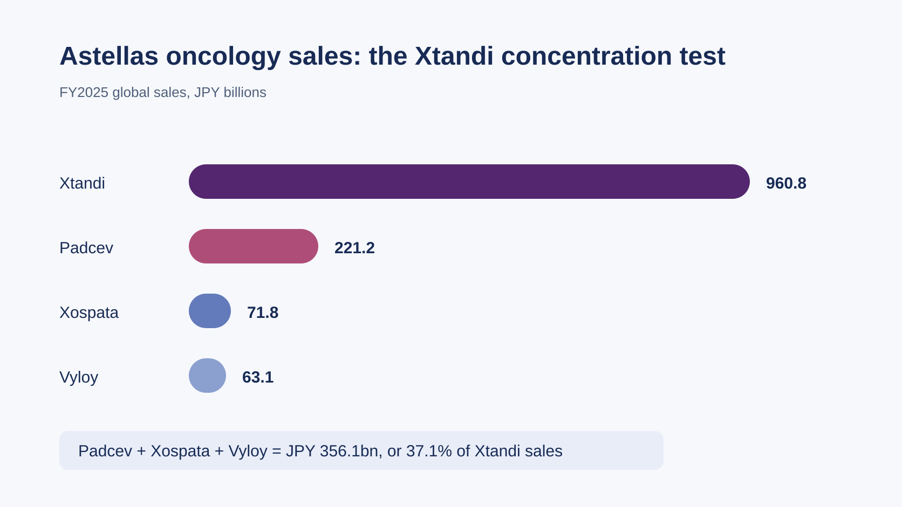
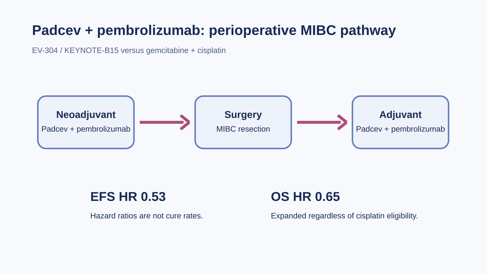
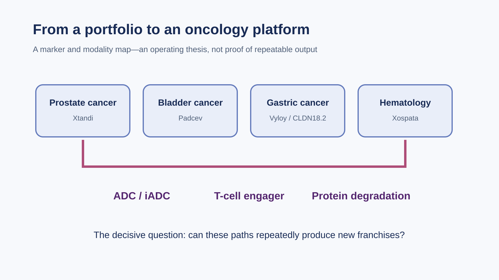
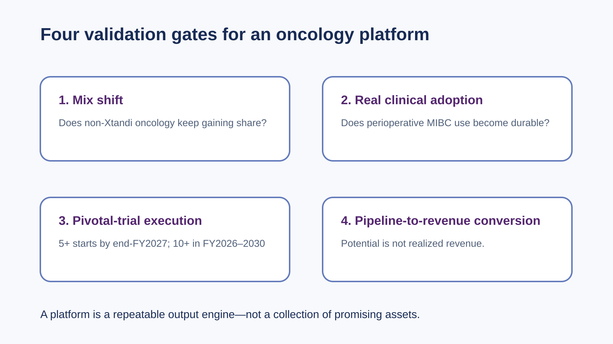

# What Comes After Xtandi? Four Tests for Astellas’ Emerging Oncology Platform

On July 10, 2026, the US Food and Drug Administration expanded the use of Padcev (enfortumab vedotin-ejfv) plus Keytruda (pembrolizumab) once again. The combination can now be used before and after surgery for muscle-invasive bladder cancer (MIBC), regardless of whether a patient is eligible for cisplatin.

For Astellas, this is more than another indication on a label. It speaks to a larger question: as patent and market-exclusivity pressure builds around Xtandi, has Astellas moved from an oncology business supported by one exceptionally large product to a platform capable of producing successive growth engines?

The answer is not a simple yes or no.

Padcev, Vyloy and Xospata show that Astellas is no longer a one-product oncology story. Yet the composition of sales, underlying economic rights, clinical adoption and the delivery of the next pipeline wave all point to the same conclusion: a platform is taking shape, but its repeatability is still being tested.

> In this article, FY2025 refers to Astellas’ fiscal year ended March 31, 2026, not calendar year 2025. All product figures use the company’s FY2025 supplementary financial reporting conventions.

## Layer one: four products are on the market, but the portfolio remains concentrated

Astellas reported the following FY2025 global sales for its four major oncology products:

- Xtandi: JPY 960.8 billion
- Padcev: JPY 221.2 billion
- Xospata: JPY 71.8 billion
- Vyloy: JPY 63.1 billion

Padcev, Xospata and Vyloy generated JPY 356.1 billion in aggregate, equal to 37.1% of Xtandi sales. That calculation is useful as a measure of product concentration, but it is not a company-reported “oncology segment revenue” figure.

These numbers establish two points at once.

First, Astellas has moved beyond the stage in which no second pillar existed. Padcev continues to expand across urothelial and bladder cancer. Vyloy has opened a precision-treatment market around CLDN18.2. Xospata provides a stable contribution in adults with relapsed or refractory FLT3-mutated acute myeloid leukemia (AML).

Second, Xtandi remains large enough to shape the entire company. The three non-Xtandi products combined still represent less than 40% of Xtandi sales. A multi-product portfolio is therefore not the same as a completed revenue replacement. The key issue is no longer how many new product names Astellas can list. It is whether the non-Xtandi portfolio can scale quickly enough—and with sufficient earnings quality—to absorb the gap that follows Xtandi.

## Layer two: product sales are not the same as the economics Astellas retains

Adding four product sales figures is not sufficient to evaluate Astellas’ oncology transition.

Astellas’ FY2025 supplementary materials explicitly present Padcev on an in-market-sales basis and state that the Americas figure is based on sales booked by Pfizer. The market size of Padcev is therefore not identical to the revenue, profit share or cash economics ultimately retained by Astellas. Padcev is a strategically important asset, but it is also a partnered product; total end-market sales should not be described as Astellas’ wholly retained economics.

Xtandi requires a similar distinction. In its script for the 2026 JPM Healthcare Conference, Astellas management said that its US Xtandi co-promotion arrangement requires a payment to Pfizer of almost half of sales. Management also argued that most of the company’s Strategic Brands carry more favorable ownership and gross-margin characteristics than Xtandi. This is management’s description of product economics; it does not allow outside investors to derive product-level net profit from end-market sales alone.

A credible assessment of the transition therefore requires two scorecards:

1. how much each product sells in the market; and
2. how much ownership, revenue and cash flow Astellas ultimately retains.

Looking only at the first may overstate the immediate profit contribution of partnered assets. Looking only at the second may understate the strategic value of Padcev and other products that establish clinical position and commercial scale.

## Layer three: Padcev has entered a curative-intent setting; adoption is the next test

Padcev is the asset with the greatest near-term potential to reduce portfolio concentration.

The July 10, 2026 US approval was based on the phase 3 EV-304/KEYNOTE-B15 trial. Padcev plus Keytruda was given before surgery as neoadjuvant treatment and after surgery as adjuvant treatment. Compared with gemcitabine plus cisplatin, the regimen produced a hazard ratio of 0.53 for event-free survival (EFS) and 0.65 for overall survival (OS). Two-year EFS was 79.4% versus 66.2%, while the pathologic complete response rate was 55.8% versus 32.5%.

Those hazard ratios describe relative risk. They are not cure rates and should not be converted into a presumed absolute benefit for every patient.

Safety also belongs in the analysis. According to the company announcement, grade 3 or higher treatment-emergent adverse events occurred in 75.7% of patients in the Padcev-plus-Keytruda arm and 67.2% in the comparator arm. That does not mean the combination should not be used. It does mean that broad adoption will depend on more than an efficacy curve: hospitals must be able to manage toxicity, patients must be able to complete the pre- and postoperative course, and multidisciplinary teams must coordinate surgery, immunotherapy and an antibody-drug conjugate.

The new approval should also be distinguished from the November 2025 decision. The earlier perioperative approval applied only to adults with MIBC who were ineligible for cisplatin. The July 2026 label expanded the eligible population regardless of cisplatin eligibility.

However, availability and broad utilization are different milestones. Because the expanded label is new, official sources do not yet answer questions such as treatment-center penetration, payer coverage, real-world completion of the full regimen or discontinuation rates. These are not established achievements; they are the next adoption metrics to monitor.

Padcev has advanced clinically. Its additional commercial value must now be earned through real-world adoption.

## Layer four: Vyloy has first-mover advantage, but CLDN18.2 will not remain a one-player field

Vyloy (zolbetuximab-clzb) is Astellas’ second major growth curve to watch.

Its US label has precise boundaries. Vyloy must be combined with fluoropyrimidine- and platinum-containing chemotherapy for the first-line treatment of adults with locally advanced unresectable or metastatic gastric or gastroesophageal junction (GEJ) adenocarcinoma that is CLDN18.2-positive and HER2-negative, as determined by an FDA-approved test. It is not a treatment for every gastric cancer patient, nor is it broadly approved as monotherapy.

In SPOTLIGHT, median progression-free survival was 10.6 months with the Vyloy regimen and 8.7 months in the control group, for a hazard ratio of 0.751. Median overall survival was 18.2 months versus 15.5 months, for a hazard ratio of 0.750. GLOW also met its primary progression-free and overall-survival endpoints. These trials established the clinical foundation for CLDN18.2 as a treatment biomarker. Commercial execution still depends on testing access, patient identification and physician acceptance of the chemotherapy combinations.

Vyloy generated JPY 63.1 billion in FY2025 sales, an increase of JPY 50.9 billion, or 415.6%, from the prior year. The growth rate is substantial but also reflects a small base. The better tests of whether Vyloy becomes a durable pillar will be absolute sales, geographic expansion and progress with new combinations, rather than the percentage growth rate alone.

Astellas is building around CLDN18.2 with multiple modalities. ASP2138 is the company’s investigational CLDN18.2/CD3 bispecific antibody. In 2025, Astellas also licensed the CLDN18.2 antibody-drug conjugate XNW27011, later designated ASP546C, from Evopoint. The agreement included a $130 million upfront payment, up to $70 million in near-term payments, and as much as $1.34 billion in development and commercial milestones plus royalties. Milestones are contingent maximums, not money already paid. The licensed territory also explicitly excludes mainland China, Hong Kong, Macau and Taiwan.

First-mover status does not confer a permanent monopoly. AstraZeneca’s CLDN18.2 ADC AZD0901 is being studied in a phase 3 trial in second-line or later gastric and GEJ cancer. Innovent’s CLDN18.2 ADC IBI343, or arcotatug tavatecan, met the primary endpoint in a phase 3 trial in previously treated gastric and GEJ cancer, and a new drug application was accepted in China in June 2026.

These programs operate in different treatment lines and markets from Vyloy’s US first-line chemotherapy-combination label. They should not be described as direct, like-for-like head-to-head competitors. They do show that CLDN18.2 competition is expanding across modalities, treatment lines and geographies. Astellas’ moat will ultimately depend on diagnostic access, treatment sequencing, combination strategies and follow-on assets—not only on being first.

## Layer five: Xospata provides a base, but it should not be overstated as a broad AML platform

Xospata (gilteritinib) gives Astellas a stable commercial position in hematologic oncology. Its US approval covers adults with relapsed or refractory AML carrying a FLT3 mutation, as detected by an approved test. The indication should not be expanded in writing to all AML patients or presented as a general first-line standard.

Xospata generated JPY 71.8 billion in FY2025 sales, up 5.7%. Its role is closer to that of a durable base than a rapidly expanding second curve capable of replacing Xtandi by itself. For the platform thesis, Xospata demonstrates that Astellas can commercialize a precision hematology product outside solid tumors. Its longer-term contribution will depend on indication development and the assets that follow it.

The Taiwan supply-chain discussion also needs to remain within the evidence. ScinoPharm Taiwan (1789) lists enzalutamide as a commercial active pharmaceutical ingredient manufactured in Taiwan and filed in the United States. This can be monitored as one data point in the generic-API supply chain around Xtandi’s loss of exclusivity.

Public information does not establish that ScinoPharm supplies Astellas or the originator Xtandi product, and it does not support a role in Padcev, Vyloy or Xospata. We therefore do not force a “Taiwan Astellas concept stock” narrative. When a Taiwan-listed company has no verifiable direct role, the responsible conclusion is that no direct mapping has been established.

## Layer six: Astellas has prepared capital for life after Xtandi, but targets are not results

Astellas has identified overcoming Xtandi’s loss of exclusivity as an enterprise-level task and has said the impact will accelerate from 2027. Patent terms, regulatory exclusivities and litigation arrangements vary across markets, so this article does not impose a single worldwide patent-expiry date.

CSP2026 covers FY2026 through FY2030. Its objectives include:

- doubling Strategic Brand sales from the FY2025 base;
- initiating more than ten phase 3 or pivotal studies during the plan, including more than five by the end of FY2027;
- advancing the pipeline with a toolkit that includes ADCs and immune-stimulating ADCs, T-cell engagers, targeted protein degradation, small molecules, cell therapies and gene or mRNA approaches; and
- building approximately JPY 1 trillion in pipeline revenue potential for the mid-2030s.

These are management targets and potential values, not realized revenue. They do not show that every modality has already been clinically validated.

There is also a capital-allocation trade. Astellas says it completed approximately JPY 65 billion of cost optimization in FY2024 and FY2025 and is targeting roughly JPY 200 billion of recurring cost optimization from FY2026 through FY2030, with resources reinvested in the pipeline and growth. This is more than a cost-cutting story. The real test is whether the released capital improves R&D productivity, accelerates pivotal development and produces assets with better ownership economics.

## Four gates: when can the platform be considered proven?

The most precise conclusion today is that Astellas has the outline of a multi-product, multi-tumor and multi-modality oncology platform, but it has not yet fully demonstrated that it can repeatedly generate the next growth pillar.

Four gates can be used to track that transition.

### 1. Product mix and retained economics

Do absolute sales and the share of non-Xtandi products continue to rise? After partnerships and co-promotion arrangements, can the revenue, ownership and gross profit retained by Astellas absorb the loss-of-exclusivity gap more convincingly than headline in-market sales alone?

### 2. Clinical adoption of Padcev

Does the perioperative approval translate into treatment-center penetration, payer coverage, regimen completion and manageable safety? Approval is established; adoption remains to be demonstrated.

### 3. Vyloy and the next pivotal assets

Can CLDN18.2 testing, sequencing and combinations create a defensible position? Can ASP2138, ASP546C and other pivotal programs move through proof of concept, phase 3 development, approval and commercialization on schedule while competitors accelerate?

### 4. Capital efficiency and platform regeneration

Can JPY 200 billion of targeted cost optimization, more than ten pivotal starts and approximately JPY 1 trillion of mid-2030s pipeline potential be converted from a planning slide into approvals, revenue and cash flow? A platform becomes durable only when cash generated by one product can repeatedly create the next.

## Conclusion: Astellas is no longer “only Xtandi,” but it is too early to declare victory

Padcev has carried an ADC from advanced urothelial cancer into treatment before and after bladder-cancer surgery. Vyloy has created a first-line precision-treatment entry point around CLDN18.2. Xospata provides a stable base in hematologic oncology. Together, these achievements are enough to retire the old idea that Astellas has only Xtandi.

A mature oncology platform, however, needs more than several marketed products. It must repeatedly discover or acquire assets, validate them clinically, obtain approval, commercialize globally and reinvest the proceeds. Astellas is in the middle of that transition: the portfolio exists, and the strategy and capital are in place. The next scorecard is whether it can produce more diversified and higher-quality economics, real adoption of Padcev, a defensible CLDN18.2 position and timely delivery from the next pipeline wave.

The central question is therefore not whether Japan has produced another oncology giant. It is whether Astellas can turn a series of individual successes into a repeatable organizational capability.

---

## Primary sources

1. [Astellas FY2025 Financial Results Presentation](https://www.astellas.com/content/dam/astellas-com/global/en/confidential-documents/financial-results/4q2025_pre_en.pdf)
2. [Astellas FY2025 Supplementary Materials](https://www.astellas.com/content/dam/astellas-com/global/en/confidential-documents/financial-results/4q2025_sup_en.pdf)
3. [Astellas/Pfizer: US approval of perioperative Padcev plus Keytruda in MIBC, July 13, 2026](https://newsroom.astellas.com/2026-07-13-us-fda-approves-padcev-plus-keytruda-as-neoadjuvant-and-adjuvant-treatment-for-muscle-invasive-bladder-cancer-regardless-of-cisplatin-eligibility)
4. [FDA: 2025 perioperative approval of Padcev plus Keytruda in MIBC](https://www.fda.gov/drugs/resources-information-approved-drugs/fda-approves-pembrolizumab-enfortumab-vedotin-ejfv-muscle-invasive-bladder-cancer)
5. [FDA: Vyloy approval and SPOTLIGHT/GLOW summary](https://www.fda.gov/drugs/resources-information-approved-drugs/fda-approves-zolbetuximab-clzb-chemotherapy-gastric-or-gastroesophageal-junction-adenocarcinoma)
6. [Astellas/Evopoint: XNW27011 licensing announcement](https://newsroom.astellas.com/2025-05-30-CLDN18-2-XNW27011)
7. [ClinicalTrials.gov: phase 3 AZD0901 study in second-line or later gastric/GEJ cancer, NCT06346392](https://clinicaltrials.gov/study/NCT06346392)
8. [Innovent: phase 3 primary endpoint and China NDA acceptance for IBI343, June 4, 2026](https://en.innoventbio.com/InvestorsAndMedia/PressReleaseDetail?key=601)
9. [FDA: Xospata approval](https://www.fda.gov/drugs/fda-approves-gilteritinib-relapsed-or-refractory-acute-myeloid-leukemia-aml-flt3-mutation)
10. [Astellas CSP2026 Presentation](https://www.astellas.com/content/dam/astellas-com/global/en/confidential-documents/Investors-Meeting/astellas_csp2026_presentation_20260526_en.pdf)
11. [Astellas 2026 JPM Healthcare Conference Script](https://www.astellas.com/content/dam/astellas-com/global/en/confidential-documents/Investors-Meeting/44th_Annual_JPM_Healthcare_Conference_meeting_script_Astellas.pdf)
12. [ScinoPharm Taiwan: commercial API portfolio](https://www.scinopharm.com/tw/products-detail/commercialAPI/)

> This article is an analysis of public information for industry-research purposes. It is not medical advice, individual treatment advice or investment advice. Patient eligibility, benefits and risks should be determined from the applicable regulatory label and by qualified healthcare professionals.
