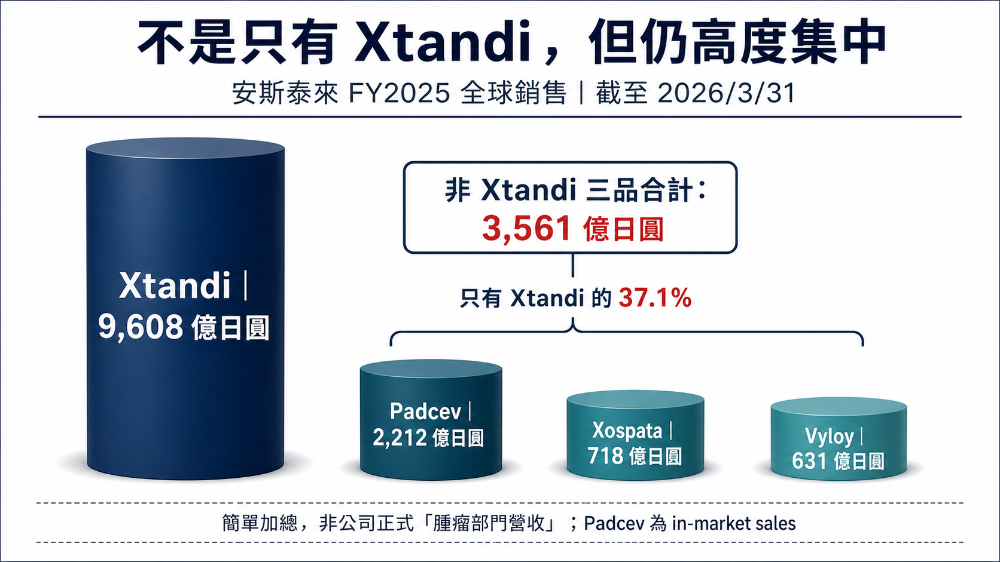
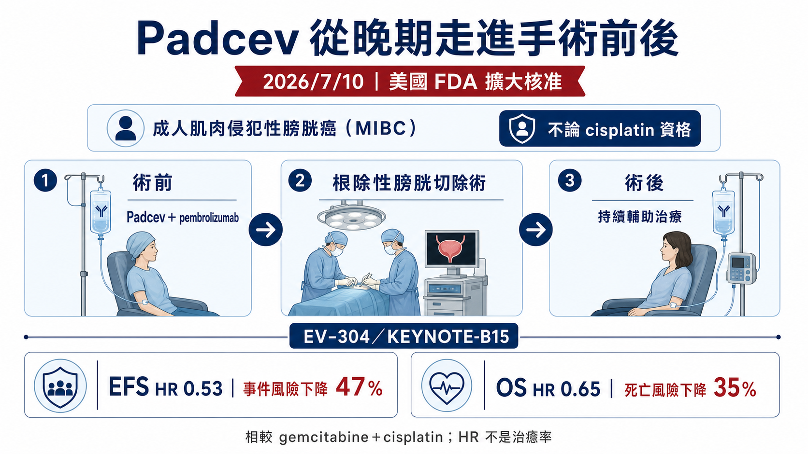
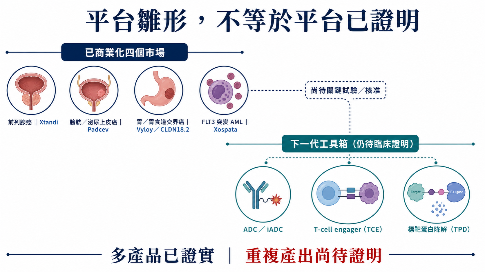
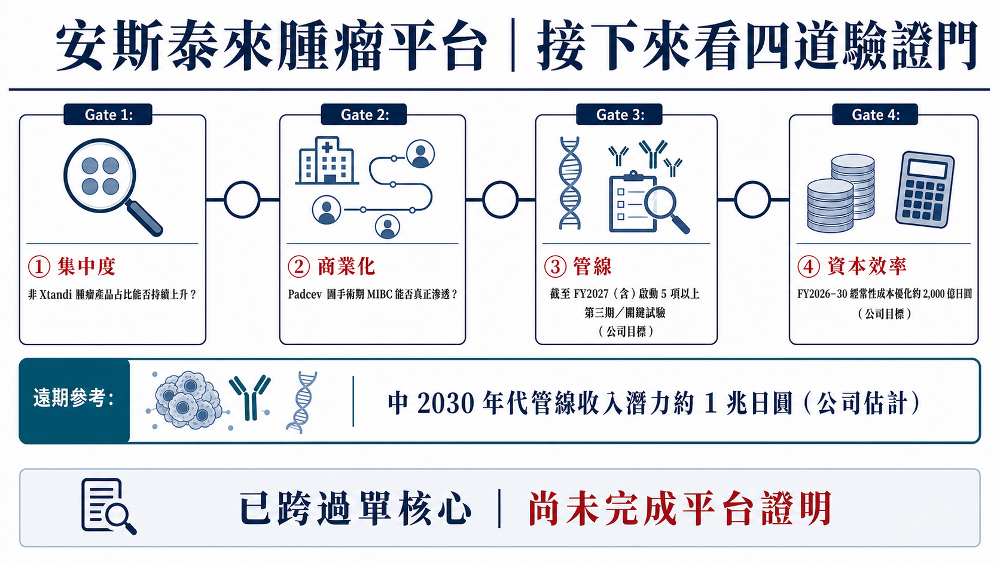

# Xtandi 之後，安斯泰來靠誰？從單一明星藥到腫瘤平台的四道驗證門

2026 年 7 月 10 日，美國 FDA 再度擴大 Padcev（enfortumab vedotin-ejfv）聯合 Keytruda（pembrolizumab）的使用範圍：這次進入的是肌層浸潤性膀胱癌（MIBC）手術前後的圍手術期治療，而且不再受患者是否適合 cisplatin 限制。

對安斯泰來而言，這不只是一張新適應症標籤。它真正回答的是更大的問題：當 Xtandi 的專利與市場獨占壓力逐步逼近，安斯泰來是否已經從「一款超級產品撐起腫瘤業務」，跨進能持續產生下一款產品的腫瘤平台？

答案不是簡單的「是」或「否」。

Padcev、Vyloy 與 Xospata 已證明安斯泰來不再只有 Xtandi；但從產品組合、權益結構、臨床採納到下一批管線的兌現速度來看，平台雛形已經出現，平台能力仍在驗證途中。

> 本文所稱 FY2025，是安斯泰來截至 2026 年 3 月 31 日的會計年度，不等於曆年 2025。所有產品數字均按公司 FY2025 補充財務資料口徑整理。

## 第一層：四款產品已成形，但營收重心仍高度集中

安斯泰來 FY2025 的四款主要腫瘤產品全球銷售分別為：

- Xtandi：9,608 億日圓
- Padcev：2,212 億日圓
- Xospata：718 億日圓
- Vyloy：631 億日圓

Padcev、Xospata 與 Vyloy 三款非 Xtandi 產品簡單合計為 3,561 億日圓，相當於 Xtandi 的 37.1%。這個計算可以用來觀察產品集中度，但不能被包裝成安斯泰來正式披露的「腫瘤部門營收」。

這組數字同時說明兩件事。

第一，安斯泰來已經跨過「第二支柱不存在」的階段。Padcev 在泌尿上皮癌與膀胱癌持續擴張，Vyloy 打開 CLDN18.2 精準治療市場，Xospata 則在帶 FLT3 突變的復發或難治性急性骨髓性白血病（AML）維持穩定貢獻。

第二，Xtandi 依然大到足以左右整家公司。三個非 Xtandi 產品加總仍不到 Xtandi 的四成，因此「已有多產品組合」不等於「已完成營收替代」。接下來真正要看的，不是新品名單有多長，而是非 Xtandi 產品能否以更快速度放量，並在獲利品質上接住 Xtandi 之後的缺口。

## 第二層：產品銷售不等於安斯泰來可以完整留下的經濟利益

判斷安斯泰來的腫瘤轉型，不能只把四個產品的銷售額加總。

公司 FY2025 補充資料明確註記，Padcev 採用 in-market sales 口徑，美洲數字依 Pfizer 入帳資料計算。這代表 Padcev 的市場規模與安斯泰來最終可保留的收入、分潤及利潤並不是同一件事。它是一項重要資產，但也是合作產品，不能把全部終端銷售直接視為安斯泰來的全額經濟利益。

Xtandi 也有相似的判讀問題。安斯泰來管理層在 2026 年摩根大通醫療健康大會簡報講稿中表示，美國 Xtandi 共同推廣安排需要向 Pfizer 支付接近一半的銷售額；管理層同時強調，多數策略品牌的權益結構與毛利條件優於 Xtandi。這是公司對產品經濟性的說明，不等於外部投資人可以僅憑終端銷售額推算各產品淨利。

因此，安斯泰來轉型是否成功，至少要同時看兩張表：

1. 產品在市場端賣了多少；
2. 公司實際保留多少權益、收入與現金流。

若只看第一張表，容易高估合作產品對利潤的即時貢獻；若只看第二張表，又會低估 Padcev 等產品建立臨床地位與商業規模的戰略價值。

## 第三層：Padcev 已跨進治癒意圖場景，下一關是臨床採納

Padcev 是目前最有機會加快產品組合去集中化的資產。

2026 年 7 月 10 日的美國核准，建立在第三期 EV-304／KEYNOTE-B15 研究上。Padcev 聯合 Keytruda 用於術前新輔助治療與術後輔助治療，相較 gemcitabine 加 cisplatin，在事件無惡化存活期（EFS）呈現 HR 0.53，整體存活期（OS）呈現 HR 0.65。兩年 EFS 率為 79.4% 對 66.2%，病理完全緩解率為 55.8% 對 32.5%。

這些 HR 描述的是相對風險，不是治癒率，也不能直接換算成每位患者的絕對獲益。

安全性同樣不能被省略。公司公告顯示，試驗中 Grade 3 以上治療期間不良事件發生率為 75.7%，對照組為 67.2%。這不代表組合不可用，但提醒市場：從核准走向廣泛採納，不能只看療效曲線，也要看醫院能否管理毒性、患者完成術前與術後療程的比例，以及多專科團隊如何安排手術、免疫治療與 ADC 的順序。

這次核准也要和 2025 年 11 月的版本分開理解。前一次圍手術期核准只適用於不適合 cisplatin 的成人 MIBC 患者；2026 年 7 月的新核准則把適用範圍擴展至不論 cisplatin 資格的患者。

但「可使用」與「被廣泛使用」仍是兩個階段。新標籤剛落地，官方資料尚不能回答治療中心滲透率、支付方覆蓋、實際完成療程比例與真實世界停藥率。這些不是目前已證實的成果，而是下一輪應追蹤的採納指標。

換句話說，Padcev 的臨床價值已經再向前一步，商業價值仍需要靠真實採納來兌現。

## 第四層：Vyloy 先拿到門票，但 CLDN18.2 不會永遠只有一位玩家

Vyloy（zolbetuximab-clzb）是安斯泰來第二條最值得追蹤的成長曲線。

美國 FDA 核准的邊界非常清楚：Vyloy 必須搭配 fluoropyrimidine 與 platinum 化療，用於經 FDA 核准檢測確認 CLDN18.2 陽性、HER2 陰性的局部晚期不可切除或轉移性胃癌／胃食道接合部（GEJ）腺癌成人第一線治療。它不是「所有胃癌都能用」，也不是單藥廣泛適用。

在 SPOTLIGHT 研究中，Vyloy 組中位無惡化存活期為 10.6 個月，對照組為 8.7 個月，HR 0.751；中位整體存活期為 18.2 個月對 15.5 個月，HR 0.750。GLOW 研究也達成無惡化存活期與整體存活期主要終點。這些結果建立了 CLDN18.2 作為治療標誌物的臨床基礎，但商業化還取決於檢測覆蓋、患者篩選與醫師對化療組合的採用。

Vyloy FY2025 銷售為 631 億日圓，較前一年增加 509 億日圓、增幅 415.6%。這是高速成長，但也帶有低基期效應；判斷它是否成為真正支柱，應持續看絕對銷售額、地區擴張及新組合，而不是只看百分比。

安斯泰來正用不同模態補強 CLDN18.2 版圖。ASP2138 是公司正在推進的 CLDN18.2／CD3 雙特異性抗體；2025 年又從信諾維引進 CLDN18.2 ADC XNW27011（後續代號 ASP546C）。該交易包含 1.30 億美元 upfront、最高 7,000 萬美元近期款，以及最高 13.4 億美元開發與商業里程碑加權利金。里程碑是條件式上限，不是已付款交易總額；而且安斯泰來取得的權利明確排除中國大陸、香港、澳門與台灣。

先發優勢也不等於永久壟斷。AstraZeneca 的 CLDN18.2 ADC AZD0901 已有第二線以上胃癌／GEJ 癌第三期研究；信達生物的 CLDN18.2 ADC IBI343（arcotatug tavatecan）則在已治療胃癌／GEJ 癌第三期研究達成主要終點，並於 2026 年 6 月在中國獲受理新藥上市申請。

這些資產與 Vyloy 的美國第一線化療合併標籤處在不同治療線別與市場，不能直接視為同條件頭對頭競爭；但它們說明 CLDN18.2 的競爭正在從單抗擴展到 ADC，並跨越治療線別與地區。安斯泰來能否守住優勢，最終要看檢測入口、治療排序、聯合方案與下一代資產，而不只是「第一個上市」。

## 第五層：Xospata 提供底座，卻不能被誤寫成更廣泛的 AML 平台

Xospata（gilteritinib）讓安斯泰來在血液腫瘤保有一個穩定商業化支點。其美國核准適用於經核准檢測確認帶 FLT3 突變的成人復發或難治性 AML，不應延伸成所有 AML，更不能寫成初治 AML 的普遍標準。

Xospata FY2025 銷售為 718 億日圓，年增 5.7%。它的角色比較像穩定底座，而不是足以單獨填補 Xtandi 缺口的爆發型第二曲線。對平台判斷而言，Xospata 的價值在於證明安斯泰來能在實體瘤之外經營精準血液腫瘤產品，但後續仍要觀察適應症拓展與新資產接續。

台灣供應鏈的敘事也必須留在證據邊界內。台灣神隆（1789）在量產原料藥清單中將 enzalutamide 列為美國申報、台灣生產的商業化原料藥，這可以作為 Xtandi 學名藥 API 與專利懸崖供應鏈的觀察座標。

但公開資料不能證明台灣神隆是安斯泰來或 Xtandi 原廠供應商，也不能外推成其參與 Padcev、Vyloy 或 Xospata。這篇文章因此不硬湊「安斯泰來概念股」；台灣公司若沒有可驗證的直接角色，就應誠實標示沒有直接映射。

## 第六層：公司已為 Xtandi 之後準備資本，但目標不是成果

安斯泰來在官方文件中已把克服 Xtandi 喪失獨占權（LOE）列為企業級任務，並表示相關影響將從 2027 年起加速。由於不同地區的專利、法規獨占與訴訟安排不同，本文不硬寫一個全球通用的單一到期日。

CSP2026 將 FY2026 至 FY2030 設為五年執行期，目標包括：

- 策略品牌銷售相較 FY2025 成長至兩倍；
- 期間啟動 10 項以上第三期或關鍵試驗，其中截至 FY2027（含）啟動 5 項以上；
- 以 ADC／iADC、T-cell engager、標靶蛋白降解、小分子、細胞及基因／mRNA 等工具推進管線；
- 建立到 2030 年代中期約 1 兆日圓的管線收入潛力。

這些都是公司目標與潛力值，不是已實現營收，更不能等同於所有模態均已被臨床驗證。

資源端也有一個值得追蹤的交換。安斯泰來表示 FY2024 至 FY2025 已完成約 650 億日圓成本優化，並在 FY2026 至 FY2030 追求約 2,000 億日圓的經常性成本優化，釋出的資源將再投資於管線與成長。這不只是「省錢」故事；真正的考題是，節省下來的資本能否提高研發成功率、加快關鍵試驗並轉成更高品質的產品權益。

## 四道驗證門：什麼時候才可以說平台真的成立？

現階段最精準的說法，是安斯泰來已經形成多產品、多癌種、多模態的腫瘤平台雛形，但還沒有完全證明可重複產出下一個成長支柱。

後續可以用四道門檢驗：

### 1. 產品組合與經濟利益

非 Xtandi 產品的絕對銷售額與占比是否持續提升？公司最終保留的收入、權利與毛利，能否比只看 in-market sales 更扎實地接住 LOE 缺口？

### 2. Padcev 的臨床採納

圍手術期核准能否轉化為治療中心滲透、支付覆蓋、療程完成與可管理的安全性？批准本身已完成，採納仍待證明。

### 3. Vyloy 與下一批關鍵資產

CLDN18.2 的檢測、治療排序和聯合方案能否形成護城河？ASP2138、ASP546C 及其他關鍵項目能否在競爭者加速時按期跨過概念驗證、第三期、核准與商業化？

### 4. 資本效率與平台再生能力

2,000 億日圓成本優化、10 項以上關鍵試驗與約 1 兆日圓中期管線潛力，能否從目標表變成核准、收入與現金流？只有當第一代產品賺到的錢，能穩定長出下一代產品，平台才算真正成立。

## 結論：安斯泰來已不是「只有 Xtandi」，但還不能提前封王

Padcev 把 ADC 從晚期泌尿上皮癌帶進膀胱癌手術前後；Vyloy 建立 CLDN18.2 第一線精準治療入口；Xospata 提供血液腫瘤的穩定底座。這些成果足以推翻「安斯泰來只有 Xtandi」的舊印象。

但一家成熟的腫瘤平台，不只要有多款產品，還要能重複做到發現或引進、臨床驗證、核准、全球商業化與再投資。安斯泰來目前已走到中段：產品組合存在，策略與資本也到位；接下來要交的成績單，是更分散且更高品質的經濟利益、Padcev 的真實採納、CLDN18.2 的競爭防守，以及下一批資產能否按時撞線。

真正的問題因此不是「日本是不是又出了一家腫瘤巨頭」，而是安斯泰來能否把一次次單點成功，變成可以重複的公司能力。

---

## 一級來源

1. [Astellas FY2025 Financial Results Presentation](https://www.astellas.com/content/dam/astellas-com/global/en/confidential-documents/financial-results/4q2025_pre_en.pdf)
2. [Astellas FY2025 Supplementary Materials](https://www.astellas.com/content/dam/astellas-com/global/en/confidential-documents/financial-results/4q2025_sup_en.pdf)
3. [Astellas／Pfizer：Padcev＋Keytruda 圍手術期 MIBC 核准公告，2026-07-13](https://newsroom.astellas.com/2026-07-13-us-fda-approves-padcev-plus-keytruda-as-neoadjuvant-and-adjuvant-treatment-for-muscle-invasive-bladder-cancer-regardless-of-cisplatin-eligibility)
4. [FDA：2025 年 Padcev＋Keytruda 圍手術期 MIBC 核准](https://www.fda.gov/drugs/resources-information-approved-drugs/fda-approves-pembrolizumab-enfortumab-vedotin-ejfv-muscle-invasive-bladder-cancer)
5. [FDA：Vyloy 核准與 SPOTLIGHT／GLOW 摘要](https://www.fda.gov/drugs/resources-information-approved-drugs/fda-approves-zolbetuximab-clzb-chemotherapy-gastric-or-gastroesophageal-junction-adenocarcinoma)
6. [Astellas／Evopoint：XNW27011 授權公告](https://newsroom.astellas.com/2025-05-30-CLDN18-2-XNW27011)
7. [ClinicalTrials.gov：AZD0901 第二線以上胃癌／GEJ 癌第三期研究 NCT06346392](https://clinicaltrials.gov/study/NCT06346392)
8. [Innovent：IBI343 第三期達成主要終點與中國 NDA 獲受理，2026-06-04](https://en.innoventbio.com/InvestorsAndMedia/PressReleaseDetail?key=601)
9. [FDA：Xospata 核准](https://www.fda.gov/drugs/fda-approves-gilteritinib-relapsed-or-refractory-acute-myeloid-leukemia-aml-flt3-mutation)
10. [Astellas：CSP2026 Presentation](https://www.astellas.com/content/dam/astellas-com/global/en/confidential-documents/Investors-Meeting/astellas_csp2026_presentation_20260526_en.pdf)
11. [Astellas：2026 JPM Healthcare Conference Script](https://www.astellas.com/content/dam/astellas-com/global/en/confidential-documents/Investors-Meeting/44th_Annual_JPM_Healthcare_Conference_meeting_script_Astellas.pdf)
12. [台灣神隆：量產原料藥清單](https://www.scinopharm.com/tw/products-detail/commercialAPI/)

> 本文僅為公開資訊整理與產業研究，不構成醫療建議、個別診療建議或投資建議。藥品適用對象、療效與風險應以各地主管機關核准標籤及醫療專業人員判斷為準。
