# 氣喘新藥正在換檔：從吸入三合一到上游免疫靶點

氣喘治療正在從症狀控制走向免疫分型，產品競爭也從吸入裝置延伸到上游發炎路徑。

## 氣喘市場不只是吸入器競爭

傳統氣喘治療多圍繞吸入型藥物，包括支氣管擴張、類固醇與複方三合一產品。這些產品改善了大量患者的症狀控制，但對部分重度或特定發炎型氣喘，單靠吸入治療仍然不夠。

近年氣喘新藥的重點開始往免疫上游移動，像 IL-4、IL-5、IL-13、TSLP 等路徑，都讓市場從一個大適應症，拆成更精準的生物標記與病人分群。

- 吸入三合一解決的是症狀與便利性。
- 上游免疫靶點解決的是疾病驅動機制。
- 生物標記會影響定價、給付與用藥順序。

## 真正的競爭在病人分層

氣喘新藥不是誰能治療所有人，而是誰能在明確族群中提供最好的風險效益比。嗜酸性白血球、FeNO、過敏體質、急性惡化史，都可能影響醫師選擇哪一種藥。

這代表產品定位不能只寫療效，而要能清楚回答：哪一群病人最適合？用在第幾線？能否減少急性惡化與口服類固醇使用？

- 病人分層會決定市場大小。
- 急性惡化下降是商業化的重要證據。
- 給付端會要求比症狀改善更硬的臨床價值。

## Drugnews 的判斷

呼吸道疾病正在從大眾用藥市場，走向更精準的免疫醫學市場。氣喘新藥的價值不只在療效，而在能否建立清楚的分型、用藥順序與長期疾病控制證據。

- 未來氣喘競爭會越來越像免疫疾病競爭。
- 上游靶點能否改變治療路徑，是估值重點。

## 小結

這篇文章的重點不是把單一新聞看成短線題材，而是回到 Drugnews 一直強調的分析方法：從臨床證據、商業定位、競爭格局與監管風險四個面向，判斷一個生技醫藥事件是否真的會改變公司價值。

本文僅供產業研究與知識分享，不構成投資、醫療、募資或個股建議。
