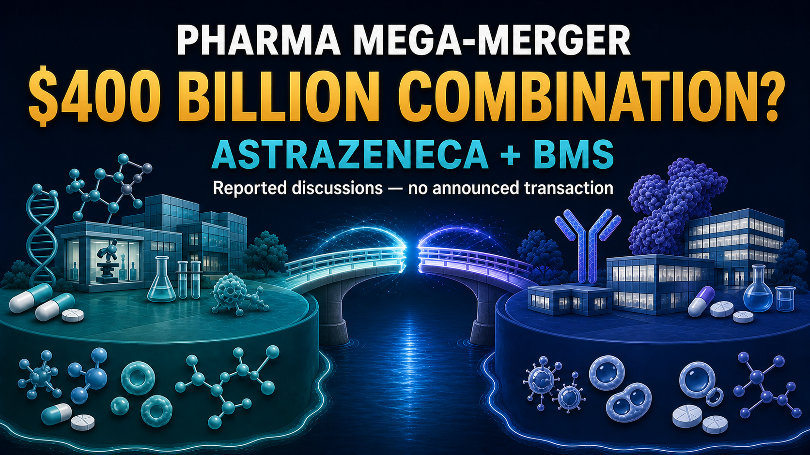
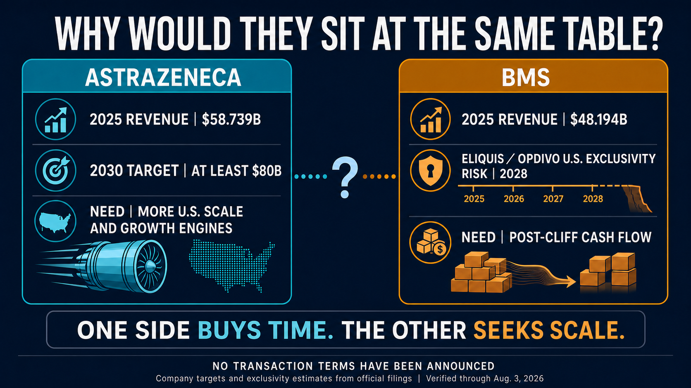
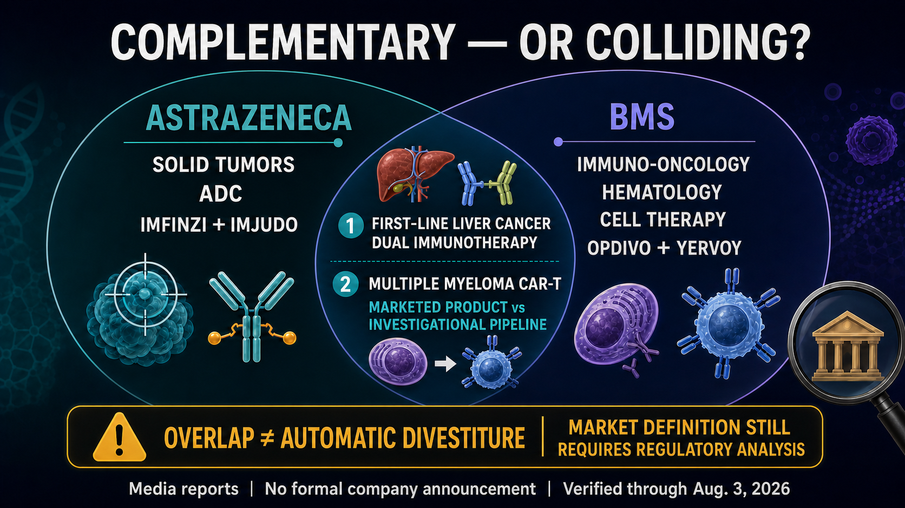
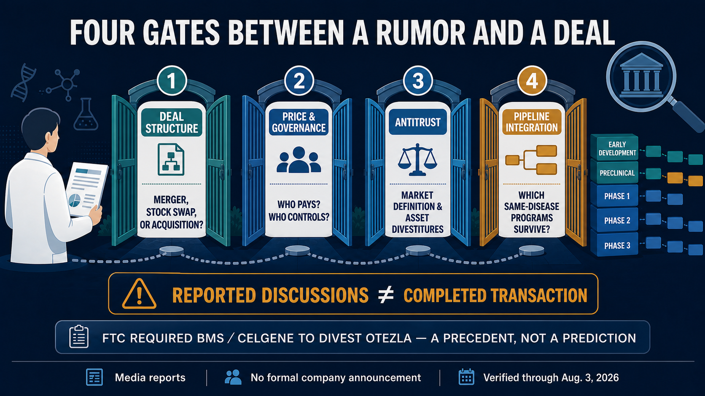

# A $400 Billion Pharma Merger? AstraZeneca and Bristol Myers Squibb Are Reportedly Talking

The global pharmaceutical industry may be considering a combination on a scale it has never seen before.

The Financial Times, citing people familiar with the matter, reported that AstraZeneca and Bristol Myers Squibb (BMS) had discussed a possible combination in recent months.

At the share prices prevailing when the report emerged, the two companies had a combined market value approaching $400 billion.

If the discussions ever turn into a transaction, this would not simply be a case of two large drugmakers becoming one even larger company.

Tagrisso, Imfinzi, Enhertu, Opdivo, Yervoy, Eliquis, Reblozyl, Breyanzi and Abecma are only the beginning of a product list spanning lung cancer, breast cancer, liver cancer, hematologic malignancies, anticoagulation and CAR-T therapy. All of those assets could end up on the same balance sheet.

Adding their publicly reported 2025 revenue produces a combined annual total of more than $100 billion. AstraZeneca's depth in precision medicines for solid tumors and antibody-drug conjugates, paired with BMS's immuno-oncology, hematology, cell therapy and U.S. commercial infrastructure, could create a platform covering nearly every major therapeutic modality in oncology.

That is why the report immediately attracted so much attention.

But a potential combination would be much more complicated than a straightforward union of two strong companies.

AstraZeneca is pursuing a goal of at least $80 billion in revenue by 2030. BMS is racing to establish its next growth engines before Eliquis and Opdivo reach major exclusivity inflection points. If the two companies are sitting at the same table, what they may really be trying to buy is not scale, but time.

And in pharmaceutical mergers, time is often the hardest asset to buy.

*Figure 1 | The nearly $400 billion figure refers to the companies' combined market value around the time of the report. It is not an offer price or a completed transaction value.*

## 01 | Why now?

Start with AstraZeneca.

The company is not in crisis. On the contrary, it is in the middle of a powerful growth phase. Total revenue reached $58.739 billion in 2025, and assets including Tagrisso, Imfinzi, Calquence, Lynparza and the Daiichi Sankyo-partnered Enhertu have made it one of the most important drugmakers in global solid-tumor oncology.

The pressure comes from the destination AstraZeneca has set for itself.

The company wants to generate at least $80 billion in annual revenue by 2030. That means it must add more than $20 billion over the next several years, and existing products cannot be expected to do all of the work through organic expansion alone.

AstraZeneca has announced plans to invest $50 billion in U.S. research and manufacturing through 2030. In February 2026, its ordinary shares also began trading directly on the New York Stock Exchange while the company retained its London and Stockholm listings. Those actions do not mean that AstraZeneca is moving its headquarters to the United States. They do, however, make the strategic direction clear: the U.S. market, capital base and policy environment are becoming increasingly important to the company's next phase.

BMS could fill much of that gap.

It brings an established U.S. commercial network, substantial cash flow, and deep capabilities in hematology and cell therapy. Building those assets from scratch would take AstraZeneca years. In theory, integrating BMS could provide products, teams, hospital relationships and commercial channels in a single transaction.

Now look at BMS.

It is not a company standing at the edge of a cliff waiting to be rescued.

In the second quarter of 2026, BMS reported revenue of $12.973 billion, up 6% year over year, and raised its full-year revenue guidance to $49 billion to $50 billion. Eliquis generated $4.481 billion in the quarter, Opdivo generated $2.485 billion, and the subcutaneous formulation Opdivo Qvantig contributed another $261 million.

That strength is also the problem.

Together, those three products represented about 55.7% of quarterly revenue. BMS's biggest medicines remain highly productive, but the company is still heavily dependent on a small number of large franchises.

In its annual report, BMS estimated that minimum U.S. market exclusivity for both Eliquis and Opdivo extends through 2028. That does not mean both products will fall to zero on the same day in 2028, and patent timelines will not be identical in every country. But the strategic timetable is unmistakable: growth products such as Reblozyl, Breyanzi, Camzyos and Opdualag must take over before erosion of the old pillars becomes material.

One company needs faster growth. The other needs its next sufficiently large growth curve.

That is why the rumor is not difficult to understand.

## 02 | How extraordinary would the combined oncology map be?

Viewed strictly as a product portfolio, AstraZeneca and BMS make for a compelling combination.

AstraZeneca's core strengths are precision therapy for solid tumors, ADCs, lung cancer and increasingly complex combination regimens. Tagrisso, Imfinzi, Enhertu and Datroway already reach deeply into lung, breast and gastrointestinal cancers.

BMS has a different foundation. Opdivo, Yervoy and Opdualag form an immuno-oncology backbone. Reblozyl, Pomalyst and other products provide depth in hematology. Breyanzi and Abecma have also taken the company into commercial CAR-T therapy.

A combined company could simultaneously hold major positions in:

- precision medicines for large solid-tumor markets such as lung and breast cancer;
- antibody-drug conjugates;
- PD-1/PD-L1 and CTLA-4 dual immunotherapy;
- hematologic malignancies;
- CD19 and BCMA CAR-T therapies; and
- rare diseases and cardiovascular, renal and metabolic medicine.

The value would not come only from owning a longer list of products. If BMS's U.S. commercial organization and AstraZeneca's solid-tumor development capabilities could truly be integrated, targeted therapies, ADCs, immunotherapies and cell therapies in the same tumor type could share clinical-development infrastructure, physician networks and global market resources.

This portfolio would also be more than a collection of medicines sold to the same physicians. For a large drugmaker, each cancer type increasingly resembles a full operating chain. Biomarkers identify patient groups; clinicians choose among targeted therapy, ADCs, immunotherapy and cell therapy; then the company must address resistance and later-line treatment after the first option fails. The more modalities a company controls, the greater its chance of remaining involved throughout the patient's treatment journey.

AstraZeneca is already expanding across EGFR, HER2, TROP2, CLDN18.2 and other solid-tumor biomarkers. BMS has mature immunotherapy combinations, hematology franchises and CAR-T products. If integration worked, the new company would not have to bet on a single technology. It could design multiple trials and combinations within the same cancer type. That vision of a tumor-specific platform is what makes a combination approaching $400 billion genuinely consequential.

For a major pharmaceutical company, the attraction is not simply having more products. It is the ability to deploy assets across an entire patient journey.

Yet the more complete the map becomes, the more likely the borders are to collide.

*Figure 2 | One company needs faster growth and greater U.S. scale. The other must build its next major revenue curve before core-product exclusivity turns.*

## 03 | The overlaps in liver cancer and CAR-T are already visible

The clearest overlap is dual immunotherapy in liver cancer.

AstraZeneca has Imfinzi plus Imjudo. BMS has Opdivo plus Yervoy. Both pair a PD-L1 or PD-1 agent with a CTLA-4 antibody, and both have entered first-line treatment for unresectable or metastatic hepatocellular carcinoma.

Today, those regimens compete for physicians, patients, budgets and clinical mindshare. If they eventually sit inside the same company, management would have to answer difficult questions. Should both regimens continue to receive full commercial support? How should pricing differ across countries? Which follow-on trials deserve capital and operating resources?

The second overlap is CAR-T therapy for multiple myeloma.

BMS already markets the BCMA-directed CAR-T Abecma. AstraZeneca acquired the investigational BCMA/CD19 dual-targeting asset GC012F, now AZD0120, through its acquisition of Gracell. One is a marketed product and the other is a dual-target clinical-stage program, so it would be misleading to treat them as identical assets.

But they would still compete for attention around BCMA, multiple myeloma, manufacturing capacity, treatment centers and clinical-trial resources.

This is the part of pharmaceutical consolidation that presentation decks tend to beautify.

The deck says "synergy." In practice, integration can mean two medicines in the same tumor type competing for patients, two development plans competing for budget, and externally licensed assets competing with internally discovered programs for priority.

Eventually, some programs remain at the center. Others are delayed, sold or discontinued.

If this transaction ever happens, the most important question will not be how many pipeline assets the new company owns. It will be whether management is willing to state clearly which programs are strategic and which ones become the price of consolidation.

## 04 | Where are the talks now? The reporting is real, but there is no transaction

The tense of this story matters.

As of August 3, 2026, the public record supports one conclusion: the Financial Times, citing unnamed people familiar with the matter, reported that the companies had explored a possible combination in recent months. Reuters subsequently reported the development as well.

Neither company has formally announced a merger. There is no published price, exchange ratio, transaction structure or signed agreement. AstraZeneca declined to comment to the media, while BMS did not immediately respond. Public SEC filings also do not contain a formal transaction that could accurately be described as a $400 billion acquisition.

The $400 billion figure is therefore not a bid and not a purchase price.

It is the approximate combined market capitalization of the two companies around the time of the report. If a future transaction were structured as an all-stock merger, the real economics would lie in the exchange ratio, control and shareholder dilution. If one party acquired the other, the analysis would need to examine the premium, financing and debt.

In other words, a pharmaceutical merger of historic scale may have been discussed, but no formal document has yet converted possibility into fact.

That boundary does not weaken the story. It makes every subsequent signal more important.

*Figure 3 | The portfolios are complementary, but they also create overlaps that would need to be managed in areas such as dual immunotherapy for liver cancer and CAR-T for multiple myeloma.*

## 05 | Even an agreed deal would still face antitrust scrutiny

Regulators would not evaluate a transaction of this size by looking only at current product sales.

They would also examine late-stage pipelines, future competition and whether the transaction could eliminate assets that might otherwise have competed with one another.

When BMS acquired Celgene in 2019, the U.S. Federal Trade Commission required the divestiture of Otezla because of potential competition with BMS's then-investigational TYK2 asset. Amgen ultimately acquired Otezla for $13.4 billion, creating one of the most prominent divestiture precedents in modern pharmaceutical M&A.

That precedent does not mean an AstraZeneca-BMS combination would necessarily be blocked, and it cannot predict which specific asset might have to be sold.

It does mean that dual immunotherapy in liver cancer, hematology, CAR-T, and combinations involving immunotherapy and ADCs across multiple solid tumors would likely receive detailed review.

Antitrust is only one layer. The integration itself may be even harder to quantify.

Who would be chief executive? Where would research leadership sit? How would U.K. and U.S. listings and governance be organized? How much dilution would AstraZeneca shareholders accept? What premium would BMS shareholders demand before giving up control, particularly before the patent-cliff pressure fully materializes?

A spreadsheet can add two market capitalizations in seconds.

Preventing two enormous organizations from slowing each other down is the genuinely expensive part.

## 06 | Taiwan has a real role, but this is not a license to manufacture concept stocks

When news like this breaks, the most common reaction in Taiwan's equity market is to pull every company associated with ADCs, antibodies or CDMO services into the narrative.

There is currently insufficient primary-source evidence to establish that any Taiwan-listed company holds direct rights, a confirmed order or a defined economic benefit tied to these reported discussions.

Taiwan's verifiable role is in clinical trials.

Trials associated with BMS's iza-bren list National Taiwan University Hospital, Taipei Veterans General Hospital, Taichung Veterans General Hospital, National Cheng Kung University Hospital, E-Da Hospital and Taipei Medical University Hospital among Taiwan sites. AstraZeneca's AZD0901 trial also lists a Taipei study location. Historical registration for AstraZeneca's HIMALAYA liver-cancer study likewise shows Taiwan participation.

Taiwan is therefore not merely watching global oncology development from the outside. Its hospitals, investigators and patients are directly involved in multinational trials, enrollment and data generation.

If the companies were eventually to combine, the most practical questions for Taiwan would not be which stock rises first. The questions would be whether existing trials continue, whether externally licensed assets are reprioritized, and whether clinical-development and supply-chain decisions become more concentrated.

For Taiwan biotechnology companies that work with multinational pharmaceutical partners, a larger partner does not automatically mean more resources. Sometimes it only means that a local company's program becomes smaller inside a much larger global pipeline.

*Figure 4 | Media reporting is not a completed transaction. Formal terms, governance, regulatory review and asset prioritization all remain unresolved.*

## Conclusion | $400 billion can buy scale. Can it buy time?

There is a coherent industrial logic behind a possible AstraZeneca-BMS combination.

One company is pursuing an $80 billion revenue target for 2030 and wants to accelerate U.S. expansion and portfolio growth. The other has substantial cash flow and an established commercial network, but must complete its product transition before exclusivity on its largest medicines turns.

If completed, the combination could redraw the global oncology landscape and become one of the largest pharmaceutical mergers ever attempted.

But a more complete portfolio also creates harder overlaps. A larger company can make integration slower and decision-making more difficult. Acquiring BMS could give AstraZeneca many capabilities at once. Preserving those capabilities after the acquisition would be a separate challenge.

The next information worth waiting for is not another adjective from an unnamed source. It is four concrete answers in a formal announcement: how the transaction would be structured, who would control the combined company, which assets would be divested, and which pipeline programs would receive priority.

$400 billion can buy one of the most comprehensive drug portfolios in the world.

Whether it can buy the next decade of growth remains unanswered.

## References

1. [Financial Times | AstraZeneca holds talks with Bristol Myers Squibb over $400bn tie-up](https://www.ft.com/content/e9027253-e13c-460a-a4b1-f9047e5a6ca7)
2. [Reuters | AstraZeneca shares fall on Bristol Myers Squibb merger talks](https://www.reuters.com/business/healthcare-pharmaceuticals/astrazeneca-shares-fall-bristol-myers-squibb-merger-talks-2026-08-03/)
3. [AstraZeneca | 2025 Form 20-F](https://www.sec.gov/Archives/edgar/data/901832/000110465926019130/azn-20251231x20f.htm)
4. [AstraZeneca | $80 billion revenue ambition for 2030](https://news.cision.com/astrazeneca/r/astrazeneca-to-deliver--80bn-revenue-by-2030%2Cc3984754)
5. [Bristol Myers Squibb | 2025 Form 10-K](https://www.sec.gov/Archives/edgar/data/14272/000001427226000004/bmy-20251231.htm)
6. [Bristol Myers Squibb | Second-quarter 2026 financial results](https://bristolmyers2016ir.q4web.com/iframes/press-releases/press-release-details/2026/Bristol-Myers-Squibb-Reports-Second-Quarter-Financial-Results-for-2026/default.aspx)
7. [Federal Trade Commission | Final order in the BMS-Celgene transaction](https://www.ftc.gov/news-events/news/press-releases/2020/01/ftc-approves-final-order-requiring-bristol-myers-squibb-company-celgene-corporation-divest-psoriasis)
8. [ClinicalTrials.gov | NCT07100080](https://clinicaltrials.gov/study/NCT07100080)
9. [ClinicalTrials.gov | NCT07431281](https://clinicaltrials.gov/study/NCT07431281)
10. [ClinicalTrials.gov | NCT03298451](https://clinicaltrials.gov/study/NCT03298451)

Sources verified through August 3, 2026.

## Disclaimer

This article is provided for biotechnology, pharmaceutical-industry and market analysis. It does not constitute medical diagnosis, treatment advice or investment advice. Media reports, corporate strategy, transaction negotiations, regulatory review, drug development and commercialization can change. Readers should rely on the latest public information from companies, regulators and primary-source documents when making decisions.
