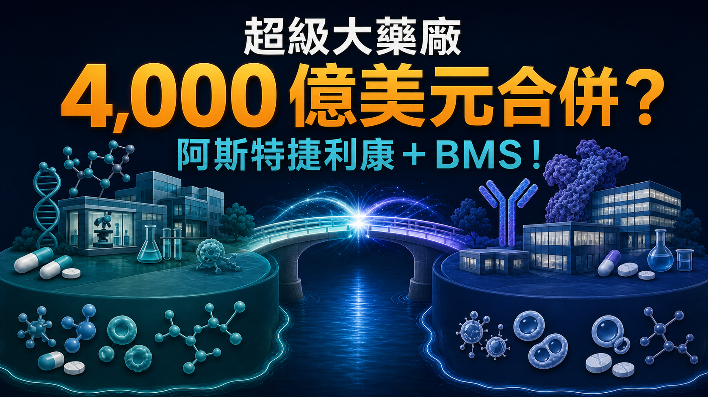
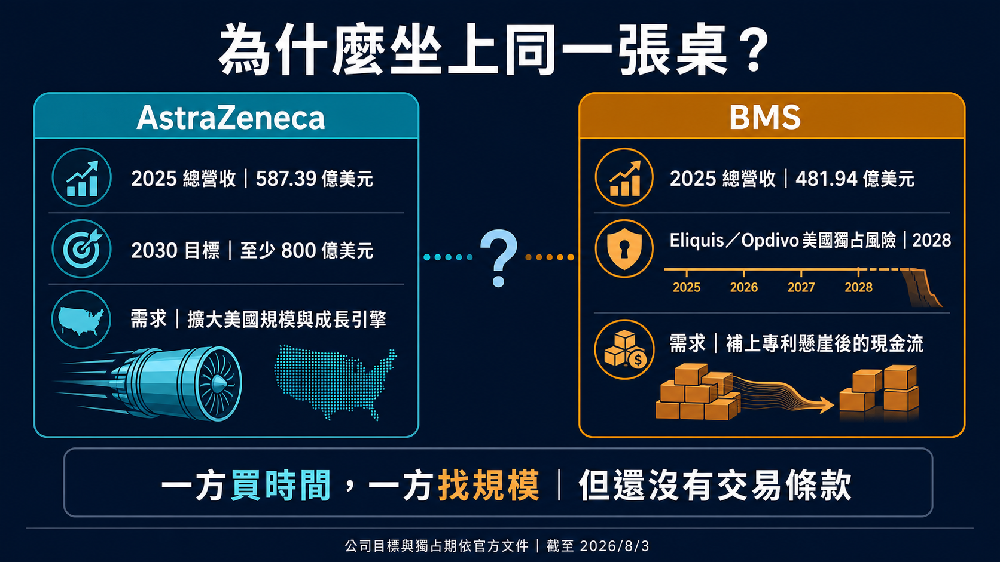
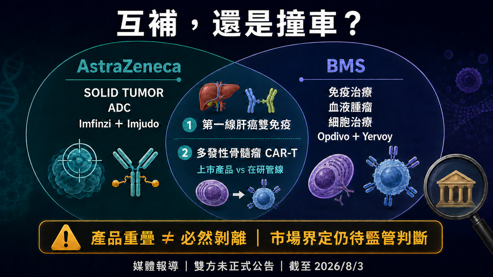
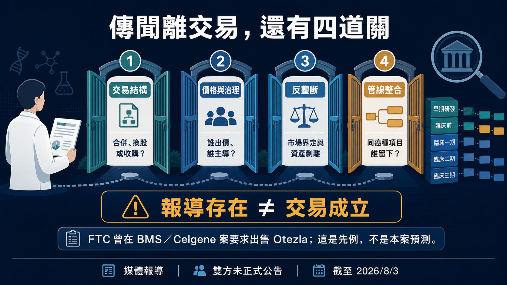

# 超級大藥廠 4,000 億美元合併？阿斯特捷利康＋BMS！

全球製藥業，可能正在醞釀一場史上最大級的合併。

Financial Times 引述知情人士報導，AstraZeneca（阿斯特捷利康）與 Bristol Myers Squibb（BMS，百時美施貴寶）近幾個月曾討論結合的可能性。

以報導當時的股價計算，兩家公司合計市值接近 4,000 億美元。

如果真的走到合併，這不只是兩家大藥廠變成一家更大的藥廠。

Tagrisso、Imfinzi、Enhertu、Opdivo、Yervoy、Eliquis、Reblozyl、Breyanzi、Abecma……一整排橫跨肺癌、乳癌、肝癌、血液腫瘤、抗凝血與 CAR-T 的產品，可能被放進同一張資產負債表。

以 2025 年公開財報粗略相加，兩家公司年度營收超過 1,000 億美元。阿斯特捷利康在實體瘤精準治療與 ADC 的深度，若接上 BMS 的免疫治療、血液腫瘤、細胞治療與美國商業網絡，幾乎可以拼出一個覆蓋腫瘤治療主要模態的超級平台。

這就是消息一出，市場立刻炸鍋的原因。

但這場可能的合併，並不是單純的強強聯手。

阿斯特捷利康想追的是 2030 年 800 億美元營收目標；BMS 要趕的是 Eliquis 與 Opdivo 走向獨占期轉折前的產品接棒。兩家公司坐上同一張桌，真正想買的可能都不是規模，而是時間。

而藥廠合併最難買到的，偏偏也是時間。

*圖 1｜接近 4,000 億美元的是報導當時兩家公司的合計市值量級，不是出價或成交價。*

## 01｜為什麼可能是現在？

先看阿斯特捷利康。

這家公司不是遇到危機，反而正處在一段很強的成長期。2025 年總營收達 587.39 億美元，Tagrisso、Imfinzi、Calquence、Lynparza，加上與 Daiichi Sankyo 合作的 Enhertu 等資產，已經讓它成為全球實體瘤最有存在感的大藥廠之一。

真正的壓力，是它替自己訂下了一個很高的終點。

阿斯特捷利康希望 2030 年營收至少達 800 億美元。也就是說，未來幾年還得再長出超過 200 億美元，而且不能只靠既有產品自然放量。

公司已宣布至 2030 年在美國投資 500 億美元，布局研發與製造；2026 年 2 月也讓普通股直接在紐約證交所交易，同時保留倫敦與斯德哥爾摩上市。這些動作不等於「把總部搬去美國」，卻清楚顯示：美國市場、資本與政策環境，在阿斯特捷利康下一階段的權重愈來愈高。

BMS 剛好能補上這塊。

它擁有成熟的美國商業網絡、大體量現金流、血液腫瘤與細胞治療能力。阿斯特捷利康若從零建立，需要時間；透過整合 BMS，理論上可以一次買到產品、團隊、醫院關係與商業通路。

再看 BMS。

它也不是一家公司走到懸崖邊，只能等人救援。

2026 年第二季，BMS 營收 129.73 億美元、年增 6%，還把全年營收指引上調至 490 億至 500 億美元。Eliquis 單季賣出 44.81 億美元，Opdivo 24.85 億美元，皮下注射版本 Opdivo Qvantig 也有 2.61 億美元。

問題就在這裡。

這三項合計約占單季營收 55.7%。BMS 的大藥仍然很會賺，公司對少數大藥的依賴也仍然很深。

BMS 在年報裡估計，Eliquis 與 Opdivo 在美國的最低市場獨占期都到 2028 年。這不代表兩款藥會在 2028 年同一天歸零，更不代表全球市場使用同一個專利日期；但對 BMS 而言，時間表已經很清楚：Reblozyl、Breyanzi、Camzyos、Opdualag 等成長產品，必須在舊支柱受到侵蝕前接起來。

所以一方缺的是更快的增長，一方缺的是下一條夠大的曲線。

這場傳聞會出現，並不難理解。

## 02｜合併後，會是一張多誇張的腫瘤地圖？

如果只看產品拼圖，阿斯特捷利康與 BMS 確實非常有想像力。

阿斯特捷利康的核心能力，在實體瘤精準治療、ADC、肺癌與多種聯合療法。它手上的 Tagrisso、Imfinzi、Enhertu、Datroway，已經深入肺癌、乳癌與消化道腫瘤。

BMS 的底盤則不同。Opdivo、Yervoy、Opdualag 建立的是免疫治療骨架；Reblozyl、Pomalyst 等產品累積了血液腫瘤深度；Breyanzi 與 Abecma 則讓它已經跨進商業化 CAR-T。

兩家公司若真的放在一起，可以同時握住：

肺癌與乳癌等大型實體瘤的精準標靶；

ADC；

PD-1／PD-L1 與 CTLA-4 雙免疫；

血液腫瘤；

CD19 與 BCMA CAR-T；

罕病與心腎代謝。

更重要的是，這不是只有藥物名稱變多。BMS 的美國商業化網絡與阿斯特捷利康的實體瘤開發能力若能真正整合，理論上可以讓同一個癌種裡的標靶、ADC、免疫治療與細胞治療，共享臨床開發、醫師網絡與全球市場資源。

這張地圖的價值，也不只是把藥賣給同一批醫師。對大藥廠來說，一個癌種愈來愈像一整條經營鏈：先用生物標記分出患者，再決定標靶、ADC、免疫治療或細胞治療；第一線失敗後，還要接住耐藥與後線治療。誰手上的模態夠多，誰就比較有機會在不同治療階段持續留在患者旅程裡。

阿斯特捷利康已經在 EGFR、HER2、TROP2、CLDN18.2 等實體瘤標誌物上擴張；BMS 則握有成熟免疫組合、血液腫瘤產品與 CAR-T。若整合順利，新公司不必只押一種技術的成敗，還能在同一癌種裡安排多種試驗與聯合療法。這種「癌種平台」想像，才是接近 4,000 億美元規模真正讓人屏息的地方。

對大型藥廠來說，這種組合最誘人的地方，不是「產品多」，而是可以圍繞患者整段治療旅程配置資產。

但越完整的地圖，也越容易在邊界上撞車。

*圖 2｜一方需要更快的成長與美國規模，另一方需要在核心產品獨占期轉折前補上下一條大曲線。*

## 03｜肝癌與 CAR-T，已經看得到正面重疊

第一個最明顯的重疊，是肝癌雙免疫。

阿斯特捷利康有 Imfinzi 加 Imjudo，BMS 有 Opdivo 加 Yervoy。兩組都是 PD-L1／PD-1 加 CTLA-4 的雙免疫策略，也都已經進入不可切除或轉移性肝細胞癌第一線治療。

它們原本在同一個市場競爭醫師、患者、預算與臨床心智。若有一天被放進同一家公司，管理層就得回答：兩套療法都繼續推嗎？不同國家如何定價？後續試驗與商業資源如何分配？

第二個重疊，是多發性骨髓瘤 CAR-T。

BMS 已有上市的 BCMA CAR-T Abecma；阿斯特捷利康收購 Gracell 後，取得 BCMA／CD19 雙靶向在研資產 GC012F（AZD0120）。一邊是上市產品，一邊是雙靶點臨床管線，成熟度不同，也不能粗暴畫成同一支產品。

但它們確實會在 BCMA、多發性骨髓瘤、製造產能、治療中心與臨床試驗資源上碰到彼此。

這也是大型藥廠合併最容易被簡報美化的地方。

簡報會寫「協同效應」；真正的整合，卻可能是同一癌種有兩支藥搶病人、兩個開發方案搶預算、外部授權資產與內部管線搶順位。

最後一定有人留下，也一定有人被延後、出售或停止。

所以這筆交易若真發生，最重要的問題不是新公司有多少管線，而是它敢不敢說清楚：誰是核心，誰成為代價。

## 04｜現在走到哪一步？報導是真的，交易還沒成立

看到這裡，要把新聞的時態說清楚。

截至 2026 年 8 月 3 日，公開資訊支持的是：Financial Times 引述匿名知情人士，報導兩家公司近月曾探討結合。Reuters 隨後也報導這項消息。

但兩家公司沒有正式宣布合併，也沒有公布價格、換股比例、交易架構或簽署協議。阿斯特捷利康對媒體拒絕評論，BMS 沒有立即回覆；SEC 公開文件中，也沒有一筆可以稱作「4,000 億美元收購案」的正式交易。

因此，4,000 億美元不是出價，也不是成交價。

它是兩家公司在報導當時的合計市值量級。若未來採換股合併，真正的代價會藏在換股比例、控制權與股東稀釋裡；若由其中一方收購另一方，才需要進一步看溢價、融資與債務。

換句話說，史上最大級藥廠合併「有可能」正在被討論，但還沒有一份正式文件，能把可能改寫成已經。

這個界線不會削弱故事，反而讓接下來的每個訊號更值得看。

*圖 3｜產品拼圖既有互補，也在肝癌雙免疫與多發性骨髓瘤 CAR-T 等領域出現需要管理的重疊。*

## 05｜就算談成，還要過反壟斷這一關

這種規模的交易，監管機關不可能只看兩家公司今天各賣多少藥。

它還會看後期管線、未來競爭，以及一樁交易會不會讓原本可能互相挑戰的資產，提前消失在同一家公司內。

2019 年 BMS 收購 Celgene 時，美國 FTC 就因 Otezla 與 BMS 當時的在研 TYK2 資產可能形成競爭，要求剝離 Otezla。Amgen 最後以 134 億美元接手，成為當時極具代表性的藥廠合併剝離案例。

這個先例不能直接推論阿斯特捷利康與 BMS 一定被擋，也不能預測哪支藥一定會被賣。

但肝癌雙免疫、血液腫瘤、CAR-T，以及多個實體瘤裡的免疫與 ADC 組合，很可能逐項被檢視。

反壟斷之外，還有更難量化的整合。

誰當執行長？研發總部在哪裡？英國與美國的上市、治理怎麼安排？阿斯特捷利康股東願意承擔多少稀釋？BMS 股東又要多少溢價，才願意在專利懸崖真正發生以前交出控制權？

市值相加，一個試算表就能完成。

讓兩個龐大組織不拖慢彼此，才是真正昂貴的部分。

## 06｜台灣有真實角色，但不是亂貼概念股

這種消息一出，台股最常見的反應，是把「做 ADC」「會做抗體」「有 CDMO」的公司全部拉進來。

目前沒有足夠的一級資料，能證明哪一家台灣上市公司直接擁有這樁傳聞的權利、確定訂單或合併受益。

真正可驗證的台灣角色，在臨床試驗。

BMS 的 iza-bren 相關試驗列有台大、北榮、中榮、成大、義大與北醫等台灣中心；阿斯特捷利康的 AZD0901 試驗也列有台北研究地點。阿斯特捷利康的 HIMALAYA 肝癌研究，歷史登錄同樣能看到台灣中心。

這代表台灣不是站在全球腫瘤開發外面看新聞，而是真正參與跨國試驗、患者收案與資料產生。

如果兩家公司未來合併，對台灣最實際的觀察不是「哪一檔先漲」，而是：既有試驗會不會延續、外部授權資產會不會重新排序，以及臨床開發與供應鏈決策會不會更集中。

對與大型藥廠合作的台灣生技公司來說，合作方變大不一定代表資源變多。有時候，它只代表自己的專案，在對方更大的管線裡變得更小。

*圖 4｜媒體報導存在不等於交易成立；正式條款、治理安排、監管審查與資產排序都還沒有答案。*

## 結語｜4,000 億美元，買得到規模，買得到時間嗎？

阿斯特捷利康與 BMS 的組合，確實有產業邏輯。

一方要追 2030 年 800 億美元營收目標，想縮短美國化與產品擴張的時間；另一方握著龐大現金流與成熟商業網絡，卻必須趕在核心大藥獨占期轉折前完成接棒。

如果成真，它可能改寫全球腫瘤版圖，也可能成為史上最大規模的藥廠合併之一。

但產品越完整，重疊也越難處理；公司越龐大，整合越容易拖慢決策。買下 BMS，可以替阿斯特捷利康一次補上很多能力；買下之後能不能保留這些能力，則是另一回事。

接下來真正值得等的，不是更多「知情人士」形容詞，而是正式公告裡的四個答案：交易怎麼做、誰掌權、哪些資產要賣，以及合併後哪些管線會被放在最前面。

4,000 億美元能買到一張全球最完整的藥物地圖。

它能不能買到下一個十年的成長，現在還沒有答案。

## 參考資料

1. [Financial Times｜AstraZeneca holds talks with Bristol Myers Squibb over $400bn tie-up](https://www.ft.com/content/e9027253-e13c-460a-a4b1-f9047e5a6ca7)
2. [Reuters｜AstraZeneca shares fall on Bristol Myers Squibb merger talks](https://www.reuters.com/business/healthcare-pharmaceuticals/astrazeneca-shares-fall-bristol-myers-squibb-merger-talks-2026-08-03/)
3. [AstraZeneca｜2025 Form 20-F](https://www.sec.gov/Archives/edgar/data/901832/000110465926019130/azn-20251231x20f.htm)
4. [AstraZeneca｜2030 年 800 億美元營收目標](https://news.cision.com/astrazeneca/r/astrazeneca-to-deliver--80bn-revenue-by-2030%2Cc3984754)
5. [Bristol Myers Squibb｜2025 Form 10-K](https://www.sec.gov/Archives/edgar/data/14272/000001427226000004/bmy-20251231.htm)
6. [Bristol Myers Squibb｜2026 年第二季財報](https://bristolmyers2016ir.q4web.com/iframes/press-releases/press-release-details/2026/Bristol-Myers-Squibb-Reports-Second-Quarter-Financial-Results-for-2026/default.aspx)
7. [FTC｜BMS／Celgene 最終命令](https://www.ftc.gov/news-events/news/press-releases/2020/01/ftc-approves-final-order-requiring-bristol-myers-squibb-company-celgene-corporation-divest-psoriasis)
8. [ClinicalTrials.gov｜NCT07100080](https://clinicaltrials.gov/study/NCT07100080)
9. [ClinicalTrials.gov｜NCT07431281](https://clinicaltrials.gov/study/NCT07431281)
10. [ClinicalTrials.gov｜NCT03298451](https://clinicaltrials.gov/study/NCT03298451)

查證截止：2026-08-03。

## 免責聲明

本文為生技醫藥與產業趨勢整理，不構成醫療診斷、治療建議或投資建議。媒體報導、公司策略、交易談判、監管審查、藥物研發與商業化皆可能改變，實際判斷應以公司、監管機關與一級文件的最新公開資訊為準。
