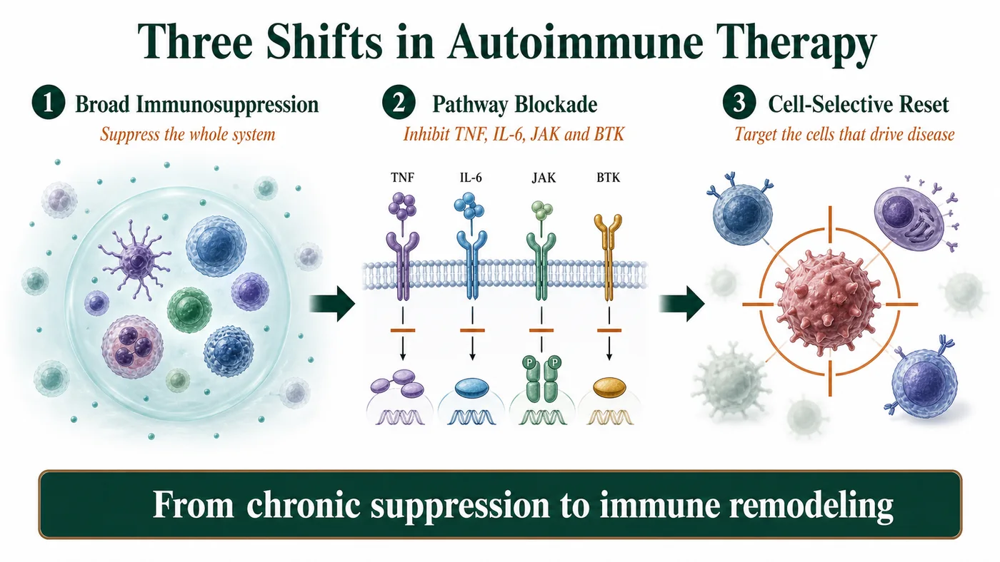
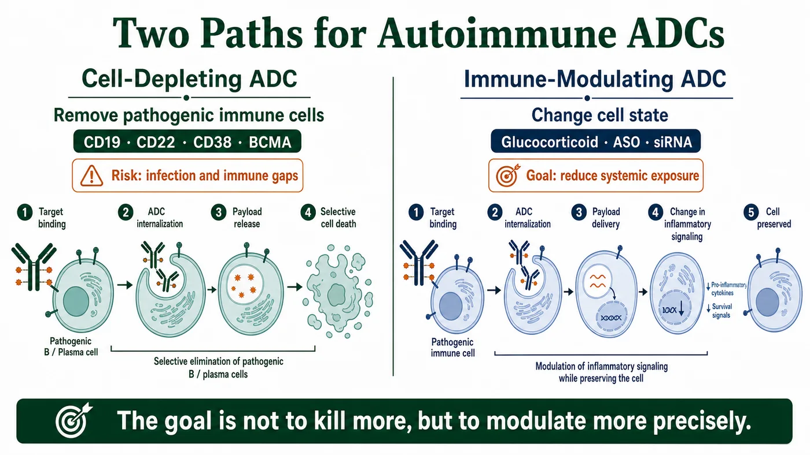
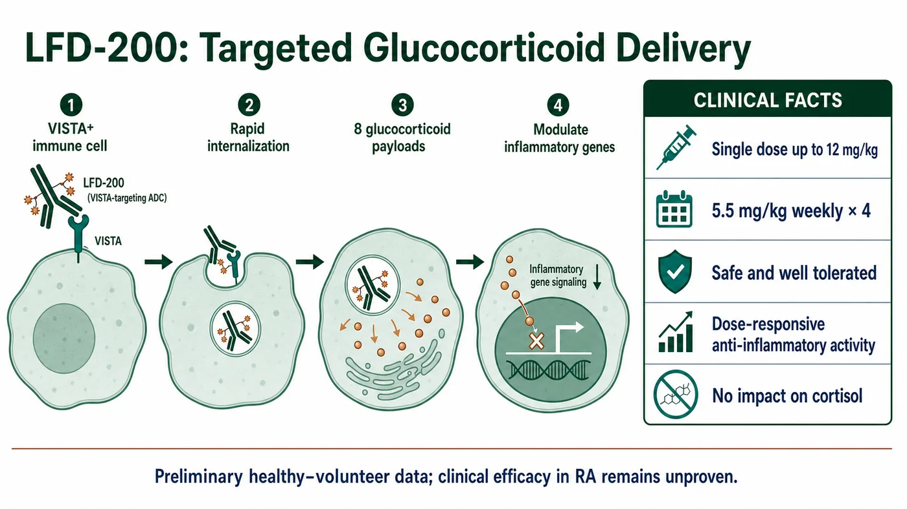
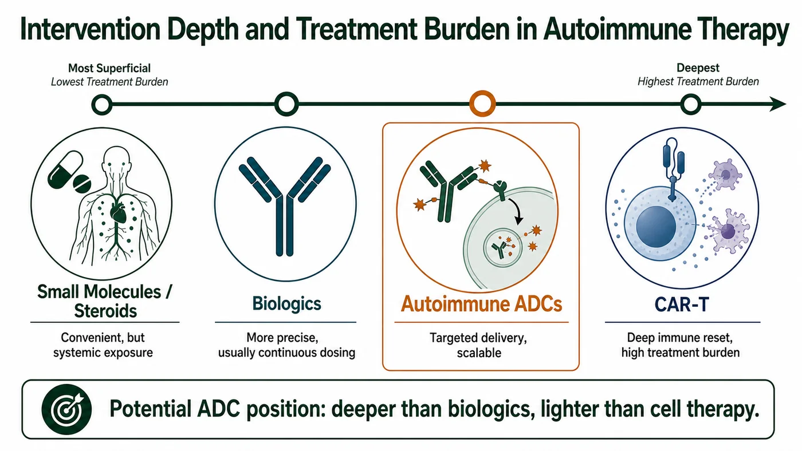

# When ADCs Enter Autoimmune Disease: Precision Immune Modulation, Not More Killing

Over the past several years, antibody-drug conjugates, or ADCs, have become almost synonymous with oncology drugs.

Mention an ADC and most people think of HER2, TROP2 or Nectin-4. They think of linkers, payloads, bystander effects and the engineering required to deliver a cytotoxic drug more precisely into a tumor cell.

Yet if the platform is stripped back to its core, an ADC is not an oncology-only technology.

Its fundamental capability is antibody-mediated targeted delivery. Once the platform is understood as a delivery system, its boundaries no longer have to stop at oncology.

Autoimmune disease is emerging as the next important testing ground for ADC technology.

But an ADC that enters autoimmune medicine cannot simply import oncology's “precision chemotherapy” logic.

An oncology ADC is designed to kill malignant cells more thoroughly. An autoimmune ADC must answer a different question: can a potent immunomodulatory effect be delivered more precisely to the immune cells and inflamed tissues that actually require intervention?

This is not a simple spillover from oncology.

It is a redefinition of what the ADC platform can be:

from selective killing to selective immune modulation.

## 01 | Autoimmune Treatment Is Moving From Suppressing Inflammation to Reshaping Immunity

Autoimmune ADCs cannot be understood by looking at ADC technology alone.

The more important context is that autoimmune treatment itself has entered a new stage.

Historically, autoimmune diseases were managed primarily with broad immunosuppression. Glucocorticoids, methotrexate and cyclophosphamide can be effective, but long-term use creates substantial costs, including infection, metabolic abnormalities, osteoporosis and endocrine disruption.

Treatment later entered an era of pathway blockade. TNF inhibitors, IL-6 inhibitors, IL-17 inhibitors, JAK inhibitors, BTK inhibitors and FcRn inhibitors made intervention more precise and allowed many patients to avoid chronic dependence on high-dose steroids.

Most of these therapies, however, still work by turning down inflammatory signaling. They can control disease without necessarily resetting it.

The leading edge of the field now involves cell-selective intervention and, in some cases, immune remodeling.

Interest in CD19 CAR-T, B-cell depletion, plasma-cell targeting, T-cell engagers and CD38 antibodies is rising for the same underlying reason:

Can treatment do more than suppress inflammation and instead address the immune cells that actually drive the disease?

Recent research also suggests that conventional protein-based B-cell-depleting therapies often require continued dosing and rarely produce true drug-free remission. A more durable immune reset may require deeper depletion of B cells residing in tissue.

This is the setting in which the ADC opportunity has appeared.

It is not an isolated new dosage form. It is part of a broader shift in autoimmune medicine from chronic inflammatory suppression toward cell-selective immune remodeling.

## 02 | Two Paths for Autoimmune ADCs: Deplete the Cell or Modulate It

Autoimmune ADCs are not yet a mature therapeutic category, but the technology is already separating into distinct development paths.

The first is the cell-depleting ADC.

This route most closely resembles an oncology ADC. The antibody recognizes an antigen on a defined immune-cell population, the conjugate is internalized and the released payload eliminates the targeted cell.

In principle, this approach could fit autoimmune diseases in which a clearly identifiable pathogenic cell population drives the mechanism. Examples include B cells and plasma cells in autoantibody-mediated disease, as well as some chronic inflammatory states dominated by activated T cells or myeloid cells.

Potential targets include CD19, CD22, CD38, BCMA, SLAMF7, CD74 and CD163.

The problem is equally clear: immune cells in autoimmune disease are not cancer cells.

B cells, plasma cells, T cells and macrophages can contribute to pathology while also carrying essential responsibilities in normal immune defense.

The deeper the depletion, the greater the potential for infection, weaker vaccine responses, impaired immune memory and a prolonged immune deficit.

The central question for a cell-depleting autoimmune ADC is therefore not whether it can kill.

It is whether the therapy can eliminate the cells that drive disease without weakening the normal immune system at the same time.

The second path is the immune-modulating ADC.

This approach may be even more consequential.

Rather than treating cell elimination as the primary objective, an immune-modulating ADC uses targeted delivery to carry a glucocorticoid, an immunomodulatory small molecule, an antisense oligonucleotide, a small interfering RNA or another non-cytotoxic payload into selected immune cells or inflamed tissue.

The underlying logic is compelling:

Many autoimmune diseases do not require a cell to be deleted. They require its state to be changed.

Glucocorticoids offer the clearest example. They can be highly effective in autoimmune and inflammatory disease, but prolonged systemic exposure can cause a broad range of adverse effects.

If an antibody can deliver a steroid payload preferentially into the immune cells most relevant to disease, it may preserve anti-inflammatory activity while reducing systemic toxicity.

The most imaginative use of an autoimmune ADC may therefore not be more precise cell killing.

It may be the more precise use of powerful immune-modulating drugs.

## 03 | LFD-200 Is the First Important Clinical Signal

The autoimmune ADC field remains early, and few programs with public clinical data are visible today.

The program most worth watching is LFD-200 from Lifordi Immunotherapeutics.

LFD-200 is a subcutaneously administered glucocorticoid ADC.

Its antibody targets VISTA, or V-domain immunoglobulin suppressor of T-cell activation, on immune cells and carries eight glucocorticoid payloads.

The design objective is unusually clear:

The antibody is not intended to contribute an additional biological function. Its job is to carry the glucocorticoid payload into VISTA-positive immune cells.

That is the core idea of an autoimmune ADC.

Instead of exposing the entire body to a steroid, the system attempts to place the drug inside the cells that should be modulated.

In preliminary phase 1 data from healthy participants presented at EULAR 2026, single LFD-200 doses up to 12 mg/kg and four weekly doses of 5.5 mg/kg were reported as safe and well tolerated.

The study also showed dose-related anti-inflammatory activity without an effect on cortisol levels.

Cortisol is one of the sensitive indicators used to assess systemic glucocorticoid toxicity.

These data do not establish that LFD-200 is effective in patients with rheumatoid arthritis.

They establish something earlier but still important:

An ADC can deliver an immunomodulatory payload to immune cells, produce a pharmacodynamic signal in humans and avoid an immediate signal of the cortisol suppression associated with systemic steroids.

This is proof of mechanism.

It is also the first step from an attractive autoimmune ADC concept toward a clinically testable development thesis.

## 04 | The Strategic Position: Between Biologics and Cell Therapy

Autoimmune medicine already has biologics, JAK inhibitors, BTK inhibitors, FcRn inhibitors, CAR-T therapies and T-cell engagers. What position could an ADC occupy?

The answer may be the space between conventional biologics and cell therapy.

Compared with CAR-T, an ADC is lighter operationally, easier to standardize and more compatible with manufacturing at scale.

CAR-T can achieve deep depletion and may create durable drug-free remission. Its costs are high, however, and manufacturing is complex. Treatment may require inpatient management and can involve cytokine release syndrome, immune effector cell-associated neurotoxicity syndrome, infection and prolonged B-cell depletion.

Compared with a T-cell engager, an ADC does not have to force T-cell activation and does not depend on the patient's T-cell state. Its theoretical cytokine release syndrome risk may therefore be lower.

The risk does not disappear. It shifts to the payload, linker, target-expression profile and release kinetics.

Compared with a conventional monoclonal antibody, an ADC may deliver a stronger effect and may localize a drug that would be unsuitable for systemic exposure. The price is a narrower safety window and greater CMC complexity.

Compared with a small molecule or systemic steroid, an ADC may reduce systemic exposure, but cost, dosing convenience and long-term safety remain to be demonstrated.

The best position for an autoimmune ADC may therefore not be to replace every existing treatment.

It may provide a scalable targeted immune intervention in the middle ground where a conventional biologic is not deep enough and cell therapy is too heavy.

That is the platform's most credible commercial position.

## 05 | Autoimmune ADC Development Requires a New Rulebook

The development logic for an oncology ADC is comparatively direct.

Identify an antigen that is highly expressed on the tumor, expressed less in normal tissue and capable of internalization. Attach a potent cytotoxic payload and create an efficacy-toxicity window.

Autoimmune disease has no equally clean population of “bad cells.”

The same B-cell, T-cell or myeloid-cell population may contain cells that drive disease and cells that maintain normal immune function.

Target too broadly and the therapy becomes another form of systemic immunosuppression.

Target too narrowly and it may fail to cover the biological heterogeneity of the disease.

The true difficulty lies in delivery and release.

An immune-modulating ADC does not succeed merely because it enters a cell. It must release the right amount of payload in the right cell, at the right location and at the right time.

Release too little and the treatment may be ineffective.

Release too much and it may cause systemic immunosuppression.

Payload selection must also be redesigned for chronic disease.

The potent cytotoxic payloads commonly used in oncology ADCs may be poorly suited to rheumatoid arthritis, systemic lupus erythematosus, inflammatory bowel disease or atopic dermatitis.

Autoimmune ADCs are more likely to require glucocorticoids, immunomodulatory small molecules, antisense oligonucleotides, siRNAs or other functional payloads with lower systemic toxicity.

The objective is not to kill harder.

It is to modulate more precisely.

## The Next Boundary for ADCs May Be Precision Immune Modulation

The success of ADCs in oncology has taught the industry to understand the platform as precision chemotherapy.

That definition must change if ADCs move into autoimmune disease.

The value of an autoimmune ADC is not in transferring a cytotoxic oncology payload from tumor cells to immune cells.

It is in using the localization capability of an antibody to deliver powerful immunomodulatory drugs, whose systemic adverse effects would otherwise limit their use, into the cells or tissue environments where modulation is needed.

If the defining phrase for an oncology ADC is selective killing, the defining phrase for an autoimmune ADC may be selective modulation.

Whether the category succeeds will not be decided by the letters ADC. It will be decided by whether the technology can demonstrate three things:

Deliver a powerful immune drug to the correct cells.

Reduce unnecessary systemic exposure.

Establish sufficiently clear safety and efficacy for long-term treatment of chronic disease.

If those conditions are met, the boundary of the ADC platform will no longer be oncology.

It could become a new therapeutic form within the next generation of autoimmune treatment, positioned between small molecules, biologics and cell therapies.

In retrospect, the importance of bringing ADCs into autoimmune disease may not be that the industry added one more indication.

It may be that the move forced us to understand the platform differently:

An ADC is not only a weapon for delivering a toxin to a cancer cell.

It can also be a navigation system for moving the immune system back toward balance.

## References

1. [Original Drugnews article on Dcard](https://www.dcard.tw/@drugnews/post/261839370)
2. [Lifordi Immunotherapeutics: LFD-200 technology](https://www.lifordi.com/technology/lfd-200/)
3. [Lifordi: preliminary phase 1 LFD-200 data presented at EULAR 2026](https://www.biospace.com/press-releases/lifordi-immunotherapeutics-presents-phase-1-clinical-data-for-lfd-200-a-subcutaneous-glucocorticoid-antibody-drug-conjugate-at-eular-2026)
4. [ClinicalTrials.gov: NCT07207954](https://clinicaltrials.gov/study/NCT07207954)
5. [Yaseen et al.: review of antibody-drug conjugates in autoimmune disease, PMID 40186891](https://pubmed.ncbi.nlm.nih.gov/40186891/)
6. [Zhou et al.: review of ADC applications beyond oncology, PMID 40843358](https://pubmed.ncbi.nlm.nih.gov/40843358/)
7. [CD19 CAR-T in autoimmune disease, Nature Medicine 2026](https://www.nature.com/articles/s41591-025-04185-6)
8. [CD19 CAR-T case series in autoimmune disease, PMID 38381673](https://pubmed.ncbi.nlm.nih.gov/38381673/)

---

This article synthesizes public clinical and industry information and does not constitute medical advice, a treatment recommendation, fundraising advice or investment advice. Public human data for LFD-200 remain primarily from an early study in healthy participants and cannot establish efficacy in rheumatoid arthritis or any other autoimmune disease.
