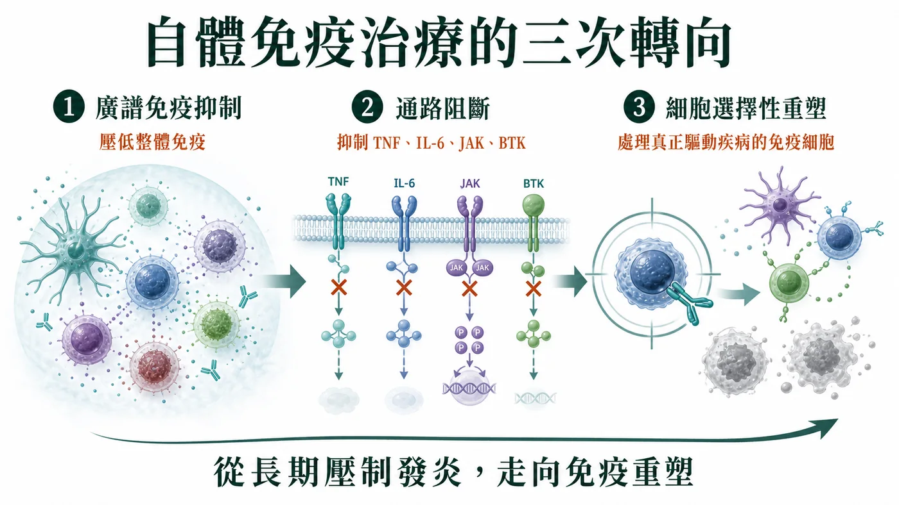
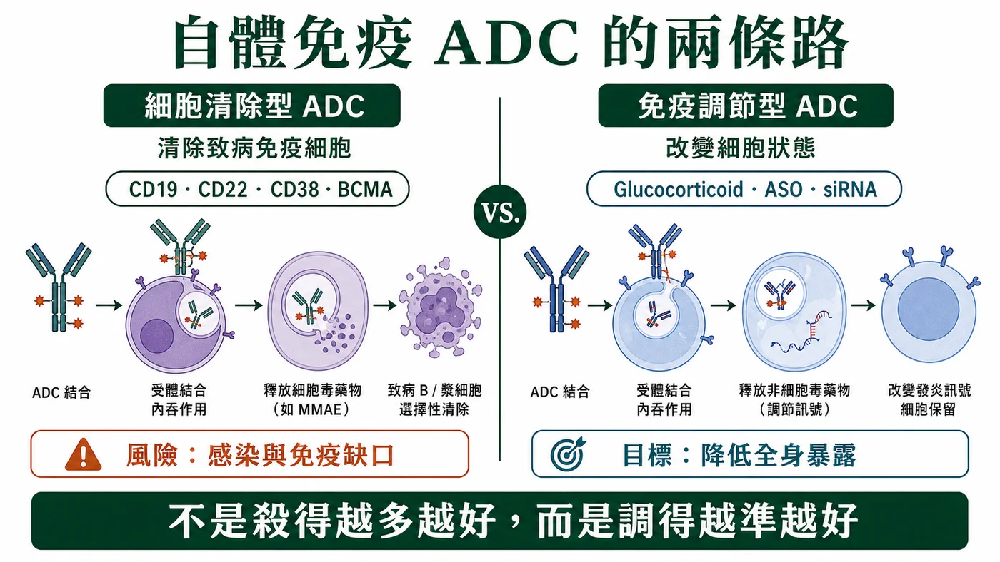
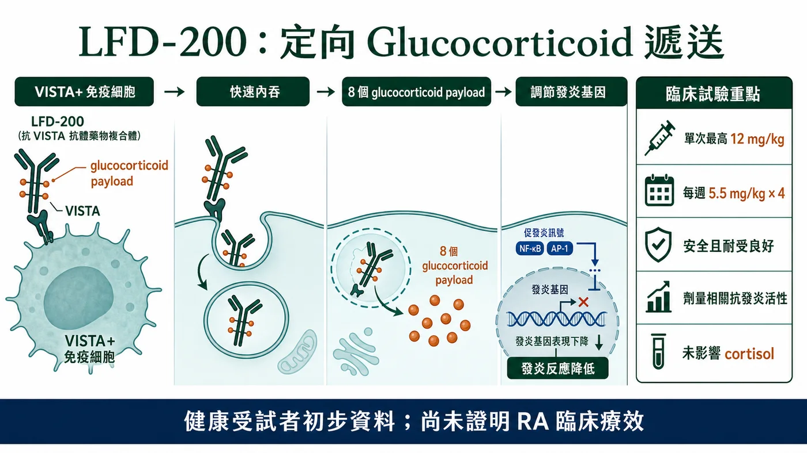
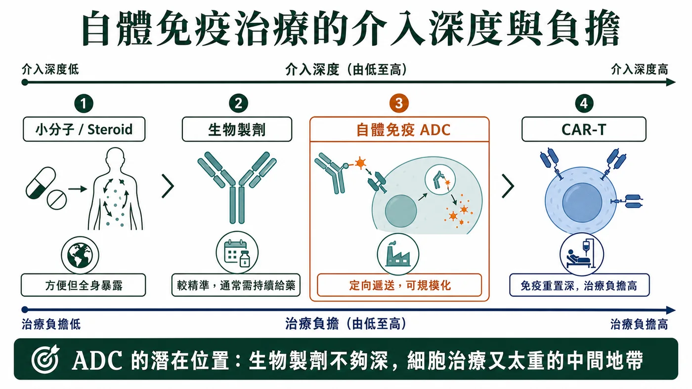

# 當 ADC 走進自體免疫：不是殺得更狠，而是調得更準

過去幾年，ADC（antibody-drug conjugate，抗體藥物複合體）幾乎被等同於腫瘤藥。

一談 ADC，大家想到的是 HER2、TROP2、Nectin-4。想到的是 linker（連接子）、payload（藥物載荷）、bystander effect（旁觀者效應），以及如何把細胞毒藥物更精準地送進腫瘤細胞。

但如果把 ADC 拆回本質，它其實不是「腫瘤專用技術」。

ADC 的真正核心，是抗體介導的定向遞送。既然是定向遞送，它的邊界就不必停在 oncology，也就是腫瘤領域。

自體免疫疾病，正在成為 ADC 技術下一個值得觀察的試驗場。

只是，ADC 一旦進入自體免疫，就不能再照搬腫瘤裡「精準化療」的邏輯。

腫瘤 ADC 追求的是把癌細胞殺得更乾淨；自體免疫 ADC 要回答的問題，則是能否把強效免疫調節作用，更精準地送到真正需要被干預的免疫細胞與發炎組織。

這不是腫瘤 ADC 的簡單外溢。

這是 ADC 技術本質的一次重新定義：

從選擇性殺傷，走向選擇性免疫調節。

## 01｜自體免疫治療，正在從壓制發炎走向重塑免疫

要理解自體免疫 ADC，不能只從 ADC 談起。

更重要的是，自體免疫治療本身已經走到新階段。

過去，自體免疫疾病主要靠廣譜免疫抑制。Glucocorticoids（糖皮質素）、methotrexate（甲氨蝶呤）、cyclophosphamide（環磷醯胺）這些藥有效，但長期使用會帶來感染、代謝異常、骨質疏鬆、內分泌失衡等問題。

後來，治療進入通路阻斷時代。TNF inhibitor（TNF 抑制劑）、IL-6 inhibitor（IL-6 抑制劑）、IL-17 inhibitor（IL-17 抑制劑）、JAK inhibitor（JAK 抑制劑）、BTK inhibitor（BTK 抑制劑）、FcRn inhibitor（FcRn 抑制劑）等藥物，讓治療更精準，也讓許多患者不必長期依賴高劑量 steroid（類固醇）。

但這些藥物多數仍是在「壓低發炎訊號」。它們可以控制疾病，卻未必能重置疾病。

現在最前沿的方向，是細胞選擇性干預，甚至免疫重塑。

CD19 CAR-T、B 細胞耗竭、漿細胞靶向、T cell engager（T 細胞接合器）、CD38 antibody（CD38 抗體）之所以在自體免疫領域升溫，背後都是同一個問題：

能不能不只是壓低發炎，而是更深層處理那些真正驅動疾病的免疫細胞？

相關研究也指出，傳統蛋白類 B 細胞耗竭療法通常需要持續給藥，較少帶來真正無藥緩解；若要達到更持久的免疫重置，可能需要更深層清除組織中的 B 細胞。

ADC 的機會，正是在這個背景下出現。

它不是孤立的新劑型，而是自體免疫治療從長期壓制發炎，走向細胞選擇性重塑的一部分。

## 02｜自體免疫 ADC 有兩條路：清除細胞，或調節細胞

自體免疫 ADC 目前還不是成熟賽道，但技術路線已經開始分化。

第一條路，是「細胞清除型 ADC」。

這條路比較接近腫瘤 ADC。抗體辨識特定免疫細胞表面抗原，ADC 被內吞後釋放 payload，進而清除目標細胞。

理論上，這適合那些疾病機制中有明確致病細胞族群的自體免疫疾病，例如自身抗體驅動疾病中的 B 細胞與漿細胞，或某些由活化 T 細胞、髓系細胞主導的慢性發炎狀態。

潛在靶點包括 CD19、CD22、CD38、BCMA、SLAMF7、CD74、CD163 等。

但這條路的問題也很清楚：自體免疫疾病中的免疫細胞不是癌細胞。

B 細胞、漿細胞、T 細胞、巨噬細胞既可能參與疾病，也承擔正常免疫防禦。

清除越深，越可能帶來感染、疫苗反應下降、免疫記憶受損與長期免疫缺口。

所以細胞清除型 ADC 在自體免疫中的核心問題，不是「能不能殺」。

而是能不能只清除真正驅動疾病的細胞，而不是把正常免疫系統一起削弱。

第二條路，是「免疫調節型 ADC」。

這條路更值得注意。

它不以清除細胞為主要目標，而是把 glucocorticoid（糖皮質素）、免疫調節小分子、ASO（antisense oligonucleotide，反義寡核苷酸）、siRNA（small interfering RNA，小干擾 RNA）或其他非細胞毒 payload，定向送到特定免疫細胞或發炎組織中。

這條路的邏輯很漂亮：

自體免疫疾病很多時候不需要把細胞刪掉，而是需要調整細胞狀態。

Glucocorticoid 就是最典型的例子。它在自體免疫與發炎疾病中非常有效，但全身長期暴露會帶來一連串副作用。

如果可以用抗體把 steroid payload 送進更相關的免疫細胞，也許就能保留抗發炎效果，同時降低全身副作用。

所以，自體免疫 ADC 最有想像力的方向，可能不是更精準地殺細胞。

而是更精準地使用強效免疫調節藥物。

## 03｜LFD-200：自體免疫 ADC 的第一個重要訊號

目前自體免疫 ADC 還很早期，公開可見的臨床項目不多。

其中最值得看的是 Lifordi Immunotherapeutics 的 LFD-200。

LFD-200 是一款皮下注射的 glucocorticoid ADC，也就是糖皮質素 ADC。

抗體靶向免疫細胞表面蛋白 VISTA（V-domain immunoglobulin suppressor of T cell activation），並連接 8 個 glucocorticoid payload。

它的設計重點很明確：

抗體本身不追求額外生物功能，而是負責把 glucocorticoid payload 送進 VISTA 陽性的免疫細胞。

這正是自體免疫 ADC 的核心精神。

不是把 steroid 丟到全身，而是讓它進到更該被調節的細胞。

在 EULAR 2026 公布的健康受試者 Phase 1 初步資料中，LFD-200 單次劑量最高 12 mg/kg，以及每週 5.5 mg/kg 連續 4 次給藥均安全且耐受性良好。

研究也顯示，LFD-200 具有劑量相關抗發炎活性，且未影響 cortisol，也就是皮質醇水平。

Cortisol 是評估全身 glucocorticoid 毒性的敏感指標之一。

這組資料還不能證明 LFD-200 在類風濕性關節炎患者中有效。

但它先證明了一件很重要的事：

ADC 可以把免疫調節 payload 送到免疫細胞，並在人體中看到藥效訊號，同時沒有立刻出現典型全身 steroid 抑制 cortisol 的問題。

這是 proof of mechanism，也就是機制驗證。

也是自體免疫 ADC 從概念進入臨床邏輯的第一步。

## 04｜自體免疫 ADC 的位置：介於生物製劑與細胞治療之間

如果自體免疫領域已經有 biologics（生物製劑）、JAK inhibitor、BTK inhibitor、FcRn inhibitor、CAR-T、TCE，ADC 憑什麼有位置？

答案可能是：它介於傳統生物製劑與細胞治療之間。

相較於 CAR-T，ADC 更輕、更容易標準化，也更可能規模化。

CAR-T 的優勢是深度清除，有機會帶來長期無藥緩解；缺點是成本高、製造複雜、需要住院管理，還有 CRS（細胞激素釋放症候群）、ICANS（免疫效應細胞相關神經毒性症候群）、感染與長期 B 細胞耗竭風險。

相較於 T cell engager，ADC 不需要強行啟動 T 細胞，也不依賴患者 T 細胞狀態，因此理論上 CRS 風險可能較低。

但它把風險轉移到 payload、linker、靶點表達與釋放動力學上。

相較於傳統 monoclonal antibody，也就是單株抗體，ADC 可能更強效，也能把原本不適合全身暴露的藥物局部送達，但安全窗口與 CMC 複雜度會更高。

相較於小分子或 steroid，ADC 可能降低全身暴露，但成本、給藥便利性與長期安全性仍需要被證明。

所以自體免疫 ADC 的最佳位置，不一定是取代所有現有療法。

它更可能是在傳統生物製劑不夠深、細胞治療又太重的中間地帶，提供一種可規模化的定向免疫干預方案。

這是它最合理的商業定位。

## 05｜自體免疫 ADC 不是換適應症，而是換一套開發規則

ADC 在腫瘤領域的開發邏輯相對直接。

找一個腫瘤高表達、正常組織低表達、能內吞的抗原，接上強細胞毒 payload，打開療效與毒性窗口。

但自體免疫疾病沒有那麼清楚的「壞細胞」。

同一群 B 細胞、T 細胞、髓系細胞，可能一部分在致病，一部分在維持正常免疫。

靶點太廣，就會變成另一種系統性免疫抑制；

靶點太窄，又可能覆蓋不了疾病異質性。

真正的難點，在於遞送與釋放。

免疫調節型 ADC 不是只要「送進去」就好，而是要在正確細胞、正確位置、正確時間，釋放正確劑量的 payload。

釋放太少，可能無效。

釋放太多，可能造成全身免疫抑制。

Payload 的選擇也必須重新設計。

腫瘤 ADC 常用的強細胞毒 payload，未必適合 rheumatoid arthritis（類風濕性關節炎）、systemic lupus erythematosus（全身性紅斑性狼瘡）、inflammatory bowel disease（發炎性腸道疾病）、atopic dermatitis（異位性皮膚炎）這些慢性疾病。

自體免疫 ADC 更可能需要 glucocorticoid payload、免疫調節小分子、ASO、siRNA，或其他低系統毒性的功能性 payload。

它追求的不是殺得更狠。

而是調得更準。

## ADC 的下一個邊界，可能不是更強殺傷，而是更準免疫調節

ADC 在腫瘤領域的成功，讓產業習慣把它理解成精準化療。

但如果 ADC 進入自體免疫疾病，這個定義需要改寫。

自體免疫 ADC 真正有價值的地方，不是把細胞毒 payload 從腫瘤細胞轉移到免疫細胞。

而是利用抗體的定位能力，把強效但副作用大的免疫調節藥物，送到更應該被調節的細胞或組織環境中。

如果 oncology ADC 的關鍵字是選擇性殺傷，那 autoimmune ADC 的關鍵字更可能是選擇性調節。

最後決定這條路能不能成立的，不是 ADC 這三個字，而是它能不能證明三件事：

把強效免疫藥物送到正確細胞。

減少不必要的全身暴露。

在慢性病長期治療中建立足夠清楚的安全性與療效證據。

如果答案成立，ADC 的邊界就不再只是 oncology。

它可能成為下一代自體免疫治療中，介於小分子、生物製劑與細胞治療之間的一種新技術形態。

也許未來回頭看，ADC 進入自體免疫的真正意義，不是多開了一個適應症。

而是讓我們重新理解 ADC：

它不只是把毒藥送到癌細胞的武器。

它也可以是把免疫系統調回正軌的導航系統。

## 參考資料

1. [Drugnews Dcard 原文](https://www.dcard.tw/@drugnews/post/261839370)
2. [Lifordi Immunotherapeutics：LFD-200 技術介紹](https://www.lifordi.com/technology/lfd-200/)
3. [Lifordi：EULAR 2026 Phase 1 初步資料新聞稿](https://www.biospace.com/press-releases/lifordi-immunotherapeutics-presents-phase-1-clinical-data-for-lfd-200-a-subcutaneous-glucocorticoid-antibody-drug-conjugate-at-eular-2026)
4. [ClinicalTrials.gov：NCT07207954](https://clinicaltrials.gov/study/NCT07207954)
5. [Yaseen et al.：自體免疫疾病抗體藥物複合體綜述，PMID 40186891](https://pubmed.ncbi.nlm.nih.gov/40186891/)
6. [Zhou et al.：ADC 在非腫瘤疾病的應用綜述，PMID 40843358](https://pubmed.ncbi.nlm.nih.gov/40843358/)
7. [CD19 CAR-T 自體免疫疾病研究，Nature Medicine 2026](https://www.nature.com/articles/s41591-025-04185-6)
8. [CD19 CAR-T 治療自體免疫疾病病例系列，PMID 38381673](https://pubmed.ncbi.nlm.nih.gov/38381673/)

---

本文僅為公開臨床與產業資料整理，不構成醫療診斷、治療建議、募資或投資建議。LFD-200 的公開人體資料目前主要來自健康受試者早期試驗，不能據此推定其在類風濕性關節炎或其他自體免疫疾病中的療效。
