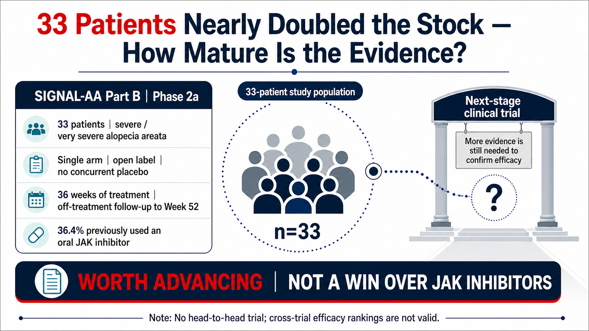
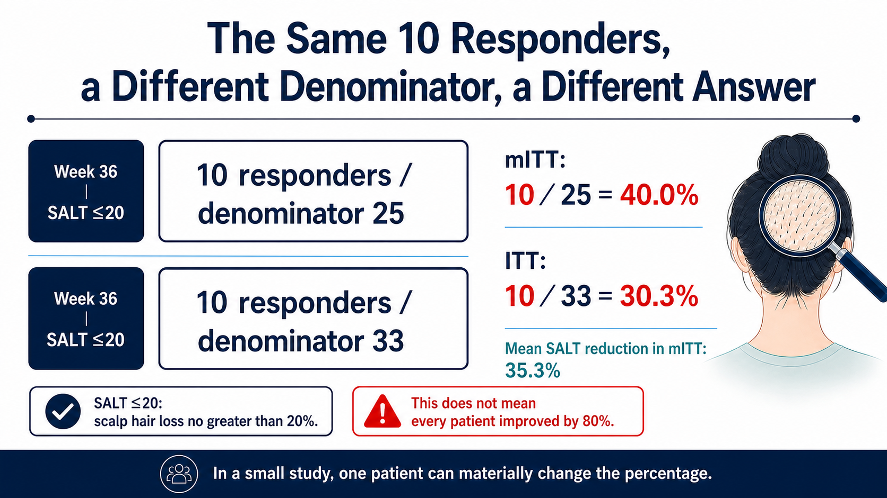
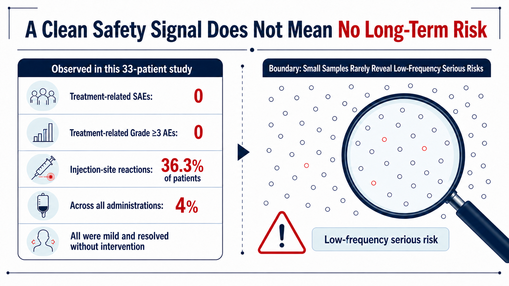
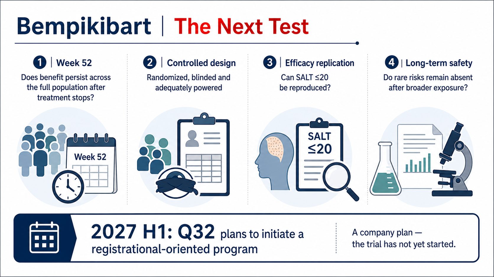

# Bempikibart in Alopecia Areata: A 33-Patient Signal Is Not Yet a Win Over JAK Inhibitors

A Phase 2 trial with just 33 patients and no placebo group nearly doubled the market value of a small biotechnology company in a single day.

On July 13, 2026, Q32 Bio reported topline results from Part B of SIGNAL-AA, evaluating bempikibart in severe alopecia areata. QTTB shares closed 90.72% higher that day. The next day, the company priced an offering at $18.25 per share, targeting approximately $200 million in gross proceeds to fund further clinical development.

Hair regrew, the stock surged and the company raised capital. It is tempting to turn that sequence into a simple headline: a non-JAK therapy has finally beaten JAK inhibitors.

That is not what the data establish. They establish that bempikibart has earned a more demanding test.

Drugnews' central judgment is straightforward:

Q32's near-doubling reflects how strongly the market wants a non-JAK treatment for alopecia areata. But bempikibart currently rests on a 33-patient, single-arm, open-label Phase 2a dataset. That evidence can move the program into a stricter controlled trial; it cannot show that the drug has already outperformed JAK inhibitors.

The distinction matters because the next competitive round will ask more than whether hair grew back. It will ask whether efficacy replicates in a larger population, whether responses persist after treatment stops and whether the safety profile is sufficiently differentiated to change the clinical position already established by JAK inhibitors.

*Figure 1 | Thirty-three patients were enough to change market expectations, not enough to establish mature comparative evidence.*

## 01 | First, understand what SALT measures

Alopecia areata is an autoimmune disease in which the immune system attacks hair follicles. Its burden extends well beyond appearance. Disease can range from coin-sized patches to near-total loss of scalp hair, eyebrows, eyelashes or body hair, leaving patients with long-term uncertainty, social pressure and substantial psychological burden.

Clinical trials commonly use the Severity of Alopecia Tool, or SALT, to measure the proportion of scalp affected by hair loss. SALT 0 means no scalp hair loss; SALT 100 means complete scalp hair loss. SIGNAL-AA Part B enrolled patients with severe or very severe disease, defined by baseline SALT scores of 50 to 100.

Accordingly, SALT less than or equal to 20 means that no more than 20% of the scalp lacks hair at the assessment, or roughly 80% or more scalp coverage. It does not mean a 20% improvement, and it does not mean that every patient regrew 80% of their hair.

Part B enrolled 33 patients, 36.4% of whom had previously received an oral JAK inhibitor. Everyone knew they were receiving bempikibart, and there was no concurrent placebo arm. The subcutaneous regimen began with four weekly 200 mg doses, followed by 200 mg every two weeks through 36 weeks, after which patients entered an off-treatment follow-up through Week 52.

The prespecified primary analysis assessed mean percentage change from baseline in SALT at Week 36 in the modified intent-to-treat, or mITT, population. The proportion achieving SALT less than or equal to 20 was another prespecified efficacy analysis.

Those design details define what the numbers can answer and what they cannot.

## 02 | Forty percent is striking, but the denominator was 25

Three Week 36 figures matter most:

1. In the prespecified 25-patient mITT population, mean SALT fell 35.3% from baseline.
2. Ten of 25 mITT patients, or 40.0%, achieved SALT less than or equal to 20.
3. Counting all 33 enrolled patients in the ITT population, 10 of 33, or 30.3%, achieved the same threshold.

How can the same 10 responders produce 40.0% in one analysis and 30.3% in another?

The mITT set excluded some participants who did not meet the rules for the primary analysis. That population was prespecified, but investors who remember only that “40% of patients regrew 80% of their hair” lose sight of the eight enrolled patients included in ITT but not in the mITT denominator.

In a small trial, each patient materially changes the percentage. If one fewer patient had responded in the mITT set, 10/25 would become 9/25, or 36.0%. In the ITT set, 10/33 would become 9/33, or 27.3%. That is why an early Phase 2 signal cannot be read from a headline percentage alone: the numerator, denominator, missing-data rules and analysis population all belong in the same sentence.

*Figure 2 | The same 10 responders produce 40.0% in mITT and 30.3% in ITT because the denominators differ.*

More importantly, Part B was single-arm and open-label. Without a concurrent placebo, the study cannot exclude natural fluctuation, assessment bias, patient selection or other background effects. Without a head-to-head comparison against an approved JAK inhibitor, results from different trials cannot be arranged as if they were a comparative league table.

The correct conclusion is that bempikibart showed an activity signal worth testing further. Whether it can outperform JAK inhibitors remains unanswered.

## 03 | Why a non-JAK mechanism excited the market

Bempikibart is a fully human monoclonal antibody against IL-7 receptor alpha. IL-7Rα participates in both IL-7 and TSLP signaling, pathways involved in T-cell survival, differentiation and multiple immune-inflammatory responses. Q32 is attempting to modulate adaptive immunity upstream at IL-7Rα; JAK inhibitors act intracellularly across several cytokine signals. The mechanisms are distinct.

That mechanism is attractive, but “more targeted” does not automatically mean “safer.” Safety differentiation must be established through enough patients, enough follow-up, controlled trials and, eventually, postmarketing experience.

The initial Part B safety readout was relatively clean. Q32 reported no treatment-related serious adverse events and no treatment-related Grade 3 or higher adverse events. Injection-site reactions were most common, affecting 36.3% of patients; across all administered doses, their incidence was 4%. All were mild and resolved without intervention.

Those observations are encouraging, but the safety database contains only 33 patients. If an important adverse event truly occurs at 1%, a 33-patient trial will often see none. Even a 3% event may not appear in a sample this small. “Not observed in this trial” is not the same statement as “the risk does not exist.” Larger exposure and longer follow-up sit between those two claims.

*Figure 3 | A clean early safety signal is useful, but a small study is poorly equipped to detect uncommon, clinically important risks.*

JAK inhibitors already have approved products, much larger exposure and more developed risk-management experience. AbbVie's upadacitinib offers a useful evidence-maturity benchmark. As of April 28, 2026, AbbVie had submitted a US FDA application for severe alopecia areata based on two randomized, double-blind, placebo-controlled Phase 3 studies totaling 1,399 patients. At that time the indication remained under review and should not be described as approved.

The two evidence packages are fundamentally different. Directly comparing a 30.3% or 40.0% response rate from a 33-patient single-arm study with a historical figure from 1,399 Phase 3 patients would convert trial-design differences into an illusion of drug-effect differences.

## 04 | “Hair keeps growing after treatment stops” remains a question

Another claim at risk of being overstated is durability.

Q32's language was appropriately restrained. The company described “early durability signals” during off-treatment follow-up, with several patients maintaining or deepening their responses and one patient reaching SALT 0, meaning no scalp hair loss. Follow-up continues through Week 52, and full data are expected to be presented later at a medical meeting.

One SALT 0 patient makes a compelling story, but one case cannot establish population-level durability. To answer whether benefit persists after withdrawal, readers need to know how many responders entered the off-treatment period, how long they had been off therapy, how many maintained response, how many relapsed, whether outcomes differed by baseline state, and whether patients received rescue therapy or entered an extension study.

Q32's own risk disclosure states that additional data may not support its current durability expectations. That is not boilerplate to skip. It identifies the exact question the study has not yet answered.

Part A extension data add another wrinkle by suggesting that maintenance treatment may be important. That points toward a different product proposition: if long-term injections are needed, convenience, pricing, adherence and reimbursement will look very different from a one-time or short-course therapy.

The most accurate statement today is that early individual cases suggest response may be maintained or deepen off treatment, but durable benefit across the population has not been demonstrated.

## 05 | After the stock nearly doubled, the real test begins

QTTB gained 90.72% on the day of the announcement and priced a $200 million public offering the next day. The market expressed expectation through price, and the company converted that expectation into clinical runway.

Share price measures expectations, not therapeutic effect. A small biotech stock also reflects starting valuation, short interest, float, financing needs and future optionality. The magnitude of this move tells us how low the market's prior probability of success may have been. Drug efficacy still has to be answered by randomized controlled evidence.

The financing also has two sides. Approximately $200 million in gross proceeds can support further bempikibart development, which is financially positive for the program. For existing shareholders, new shares and pre-funded warrants also mean dilution. Good data can allow a company to finance itself; they do not guarantee that every dollar raised becomes an approved product.

Q32 plans to advance bempikibart into a registration-directed program in the first half of 2027. The operative word is plans. At the verification cutoff, no Phase 3 trial had been announced as initiated, and no regulator had approved the product.

The next study needs to close at least four gaps:

1. Randomization, blinding and placebo or active control to reduce single-arm bias.
2. A larger sample with prespecified statistical testing of SALT less than or equal to 20 and other patient-relevant endpoints.
3. Sufficient on-treatment and off-treatment follow-up to separate continued dosing from true post-treatment durability.
4. A broader safety database, particularly for infection, immune-related risks and tolerability of long-term subcutaneous administration.

*Figure 4 | The next test is not another headline: it is Week 52 durability, randomized control, reproducible efficacy and long-term safety.*

## 06 | The next competitive round in alopecia areata

Interest in a non-JAK approach does not mean the market will simply replace one dominant mechanism with another.

Nektar's rezpegaldesleukin takes a regulatory T-cell approach and is currently in Phase 2b for alopecia areata, not Phase 3. Other developers are probing additional T-cell costimulatory and cytokine nodes. Together, these programs show an industry trying to find a better balance among efficacy, long-term safety, recurrence and treatment burden.

A new mechanism is only an entry ticket. Whether it becomes a clinical option depends on which patient-relevant problem it actually improves over existing therapies.

One response percentage cannot support a claim that a drug will “replace JAK.” For patients, differentiation might mean less infection-risk tradeoff, fewer relapses after withdrawal or freedom from daily tablets. Clinicians need a predictable onset, manageable injection reactions and a clear switching strategy after failure. Payers need annual treatment cost, duration and evidence of persistence after stopping. If bempikibart offers similar efficacy but requires long-term injections at a higher price, it may fit only selected patients. Conversely, even without overwhelming average efficacy, consistent benefit in people who cannot use JAK inhibitors or accept their risks could create a genuine clinical position.

Future studies should therefore prespecify JAK-experienced subgroups, time to relapse, patient-reported outcomes and maintenance-treatment requirements, not merely count how many patients reach SALT less than or equal to 20. Those data will determine whether bempikibart remains a new-mechanism story or becomes a treatment physicians can place in sequence.

## 07 | Industry coordinates for Taiwan investors

The most direct listed exposure is US-listed Q32 Bio (Nasdaq: QTTB). As of July 19, 2026, no primary public source showed a Taiwan-listed company directly participating in bempikibart development, manufacturing, clinical execution or commercialization rights. AbbVie (NYSE: ABBV) and Nektar (Nasdaq: NKTR) are useful coordinates for different mechanisms and evidence maturity, not a single basket of supposed beneficiaries.

## 08 | Conclusion: separate “worth validating” from “already proven”

Bempikibart's Week 36 data have clear value. In a 33-patient early study, 10 patients reaching SALT less than or equal to 20, a 35.3% mean SALT reduction in the primary analysis, and no observed treatment-related serious or Grade 3 or higher adverse events are enough to justify advancing the program.

Its most important value today is that it supports a larger test. A claim that it has beaten JAK inhibitors still requires controlled evidence.

Four items now deserve attention: complete Week 52 off-treatment data, whether the registration-directed trial actually begins, whether SALT less than or equal to 20 replicates after randomization, and whether safety remains favorable as exposure grows.

Thirty-three patients nearly doubled the stock. Changing the treatment standard will require the next exam.

## References

The following are primary sources or official trial records. Verification cutoff: July 19, 2026.

1. Q32 Bio, SIGNAL-AA Part B Week 36 topline results: https://ir.q32bio.com/news-releases/news-release-details/q32-bio-announces-positive-36-week-topline-results-part-b-signal
2. ClinicalTrials.gov, SIGNAL-AA (NCT06018428): https://clinicaltrials.gov/study/NCT06018428
3. Q32 Bio, pricing of the $200 million public offering: https://ir.q32bio.com/news-releases/news-release-details/q32-bio-announces-pricing-200-million-public-offering-common/
4. Q32 Bio SEC filing: https://ir.q32bio.com/node/10981/html
5. AbbVie, FDA submission for upadacitinib in severe alopecia areata: https://news.abbvie.com/2026-04-28-AbbVie-Submits-Application-to-FDA-for-Upadacitinib-RINVOQ-R-for-Adults-and-Adolescents-with-Severe-Alopecia-Areata
6. Nektar, 52-week REZOLVE-AA results and development stage: https://ir.nektar.com/news-releases/news-release-details/52-week-topline-results-16-week-blinded-treatment-extension
7. Nasdaq, QTTB historical prices: https://www.nasdaq.com/market-activity/stocks/qttb/historical

## Disclaimer

This article provides biotechnology, pharmaceutical and industry analysis and does not constitute medical or investment advice. Bempikibart is investigational and has not been approved for marketing. Clinical-trial results do not predict an individual patient's outcome; treatment decisions should be made by qualified healthcare professionals using approved labeling and the patient's circumstances.
