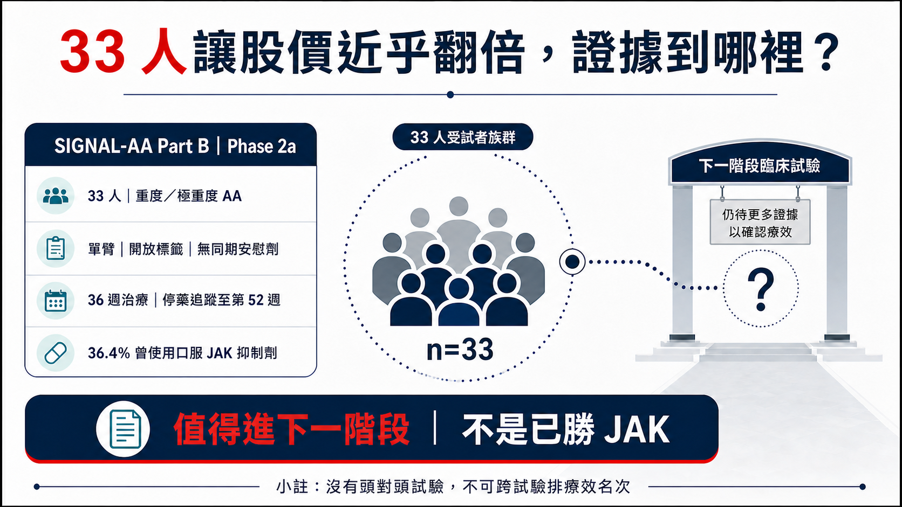
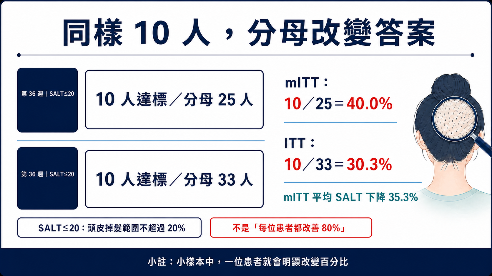
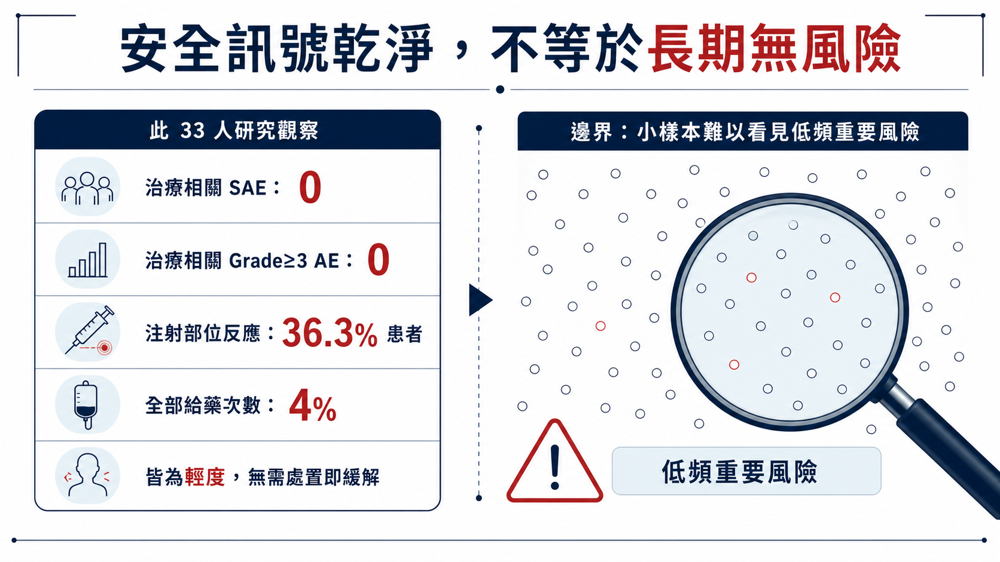
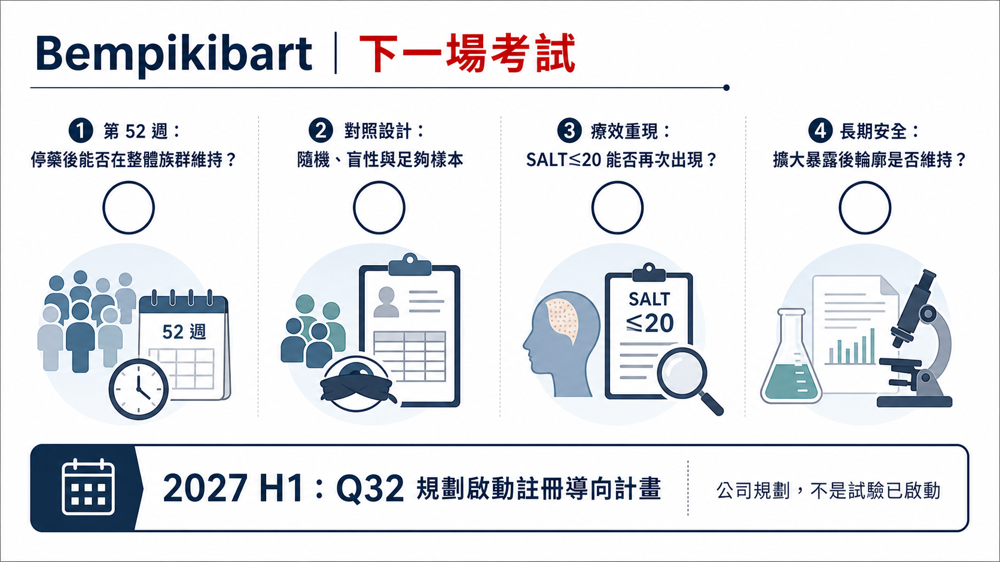

# 鬼剃頭新藥，先別封神

一個只有 33 人、沒有安慰劑對照的二期試驗，讓一家小型生技公司的股價一天近乎翻倍（+90.72%）。

2026 年 7 月 13 日，Q32 Bio 公布 bempikibart 治療重度斑禿的 SIGNAL-AA Part B 頂線結果。當天 QTTB 收盤上漲 90.72%。隔天，公司就以每股 18.25 美元定價增資，預計募得約 2 億美元毛額，資金將支應 bempikibart 後續臨床開發。

頭髮長回來、股價漲上去、錢也募到了。這個故事很容易被寫成：「非 JAK 新藥終於打敗 JAK 抑制劑。」

資料真正說的是：這只是一張進入下一階段的門票。

藥時事的主判斷是：

Q32 股價近乎翻倍，反映市場有多渴望非 JAK 的斑禿治療。Bempikibart 目前只有 33 人、單臂、開放標籤的 Phase 2a 資料；這張門票能把它送進更嚴格的對照試驗，還無法證明它已勝過 JAK。

這個區別很重要。因為斑禿的下一場競爭，不會只問「有沒有長頭髮」，而會問三件更難的事：療效能不能在大樣本重現？停藥後能不能維持？安全性是否真的足以換掉已經建立臨床位置的 JAK 抑制劑？

*圖1｜33 人讓股價近乎翻倍，但證據成熟度仍只支持進入下一階段。*

## 01｜先看清楚：SALT 代表什麼？

斑禿是免疫系統攻擊毛囊造成的疾病，影響遠超過美容。它可能表現為硬幣大小的禿髮，也可能進展到幾乎整個頭皮、眉毛、睫毛甚至全身毛髮脫落。嚴重患者同時承受外觀改變、長期不確定性、社交壓力與心理負擔。

臨床試驗常用 SALT（Severity of Alopecia Tool）評估頭皮掉髮範圍。SALT 0 代表頭皮沒有掉髮；SALT 100 代表頭皮完全掉髮。SIGNAL-AA Part B 納入的是基線 SALT 50–100 的重度或極重度患者。

因此，新聞裡常見的「SALT≤20」，正確意思是試驗評估時頭皮掉髮範圍不超過 20%，也就是至少約 80% 頭皮有毛髮覆蓋。請勿把它誤讀成「改善 20%」，也不能說每位患者都恢復八成頭髮。

Q32 在這個 Part B 一共收了 33 人；其中 36.4% 曾接受口服 JAK 抑制劑。所有人都知道自己接受 bempikibart，研究也沒有同期安慰劑組。給藥方式是皮下注射：先每週 200 mg、共四劑，再每兩週 200 mg，總治療期 36 週，之後停藥追蹤至第 52 週。

試驗預先設定的主要分析，是 mITT 族群在第 36 週相較基線的 SALT 平均百分比變化；SALT≤20 比例屬於其他預設療效分析。

這些設計細節，決定了數字能回答什麼、不能回答什麼。

## 02｜40% 很醒目，但分母只有 25

Q32 公布的第 36 週結果有三個最重要的數字：

- 在預設的 mITT 族群 25 人中，SALT 相較基線平均下降 35.3%；
- mITT 族群有 40.0%，也就是 10/25，達到 SALT≤20；
- 把全部 33 名入組患者都算進 ITT，達到 SALT≤20 的比例是 30.3%，也就是 10/33。

為什麼同樣是 10 個人，比例會從 40% 變成 30.3%？

因為 mITT 排除了部分未符合主要分析規則的受試者。這是預先設定的分析集；投資人若只記得「四成患者長回八成頭髮」，就會忽略八名被納入 ITT、卻沒有進入 mITT 分母的患者。

在小型研究裡，每一個人都會明顯改變比例。10/25 少一位應答者，就會從 40% 掉到 36%；而 10/33 若少一位，則會降到 27.3%。這也是為什麼二期早期訊號不能只看漂亮百分比，還要把分子、分母與缺失資料處理方式一起攤開。

*圖2｜同樣 10 名患者達標，分母從 25 人改成 33 人，答案就從 40.0% 變成 30.3%。*

更關鍵的是，Part B 是單臂、開放標籤。沒有同期安慰劑，就無法排除自然波動、評估偏差、患者選擇或其他背景因素對結果的影響；沒有和既有 JAK 抑制劑頭對頭，也不能把不同試驗的 SALT 數字排成排行榜。

所以，這批資料支持 bempikibart 出現值得進一步驗證的活性訊號；療效能否超越 JAK，現階段仍沒有答案。

## 03｜非 JAK 為什麼讓市場這麼興奮？

Bempikibart 是全人源 IL-7Rα 單株抗體。IL-7Rα 同時參與 IL-7 與 TSLP 訊號，這兩條路徑和 T 細胞存活、分化，以及多種免疫發炎反應有關。Q32 選擇從 IL-7Rα 上游調節適應性免疫；JAK 抑制劑則在細胞內抑制多條細胞激素訊號，兩者路徑不同。

這個機制有吸引力，但「比較精準」無法自動換算成「比較安全」。安全性仍要靠足夠人數、足夠時間、對照試驗與上市後資料建立。

目前 Part B 的安全訊號相對乾淨：公司表示沒有治療相關的嚴重不良事件，也沒有治療相關的 Grade 3 以上不良事件。最常見的是注射部位反應，發生在 36.3% 的患者；若以所有給藥次數計算，發生率是 4%。所有注射部位反應都屬輕度，且不需處置便緩解。

這是好消息，但樣本只有 33 人。若某個重要不良事件的真實發生率是 1%，33 人試驗很可能完全看不到；即使真實發生率是 3%，也可能因樣本小而沒有出現。「本試驗未觀察到」和「沒有這種風險」之間，隔著更大樣本與更長追蹤；醫藥內容不能跨過這道證據缺口。

*圖3｜安全訊號乾淨是好消息；小樣本仍難以看見低頻但重要的長期風險。*

JAK 抑制劑已有核准產品、更多患者暴露與較長期的風險管理經驗。以 AbbVie 的 upadacitinib 為例，截至 2026 年 4 月 28 日，公司已向美國 FDA 申請擴增重度斑禿適應症，資料來自兩個隨機、雙盲、安慰劑對照的第三期研究，總計 1,399 人；但當時該斑禿適應症仍在審查，不能寫成已核准。

兩套證據的成熟度根本不同。拿 33 人單臂研究的 30.3% 或 40%，直接和 1,399 人第三期的歷史數字比高低，會把試驗設計差異假裝成藥效差異。

## 04｜「停藥後還在長」目前只是一個問號

這次最容易被誇大的另一句，是 bempikibart 可能具有「持久性」。

Q32 的原文很克制：停藥追蹤期間出現「早期持久性訊號」，多名患者維持或加深反應，其中一人達到 SALT 0，也就是頭皮完全沒有掉髮。完整的停藥追蹤仍在進行，預計到第 52 週，完整資料之後才會在醫學會議公布。

一位患者的 SALT 0 很有故事性，單一個案卻無法證明整體持久性。要回答停藥後能否維持，至少要知道：有多少應答者進入停藥期、停藥多久、多少人維持、多少人復發、不同起始狀態是否有差異，以及是否有救援治療或進入延伸研究。

Q32 自己也在風險揭露中明說，額外資料可能不支持公司目前對持久性的期待。這句法律文字不該被當成例行公事略過，因為它正好點出試驗尚未回答的核心。

更有意思的是，Part A 延伸資料提示「維持治療可能很重要」。這指向另一個產品命題：若未來需要長期注射，便利性、定價、依從性與支付條件，都會和一次性或短期療程的想像不同。

因此目前最準確的說法是：看到了停藥後維持或加深反應的早期個案訊號，但尚未證明整體族群有持久效益。

## 05｜股價近乎翻倍以後，真正的考試才開始

QTTB 在資料公布當天上漲 90.72%，隔天就完成 2 億美元公開發行定價。市場用價格表達期待，公司也把期待換成了臨床跑道。

股價反映市場期待，無法代替療效判讀。小型生技股價會同時受原先估值、空頭部位、流通股數、融資需求與未來選擇權影響。這次反應可以告訴我們「市場原本把成功機率估得多低」；藥效仍要交給隨機對照試驗回答。

這筆增資同樣要兩面看。對公司而言，約 2 億美元毛額能支應 bempikibart 後續試驗，是正面財務事件；對既有股東而言，新股與預付認股權證也代表稀釋。好資料讓公司有能力募資，並不等於每一美元資金都會轉成核准產品。

Q32 表示，計畫在 2027 年上半年把 bempikibart 推進註冊導向（registration-directed）計畫。關鍵字是「計畫」。截至查證日，公司尚未宣布第三期已啟動，也沒有監管機關核准這個產品。

下一個研究至少要補上四個缺口：

1. 隨機、盲性與安慰劑或有效對照，確認效益能排除單臂研究偏差；
2. 更大的樣本與預先設定的統計檢定，確認 SALT≤20 與其他患者重要終點；
3. 足夠長的治療與停藥追蹤，拆清「持續給藥」和「停藥持久」；
4. 更完整的安全性暴露，特別是感染、免疫相關風險與長期皮下注射耐受性。

*圖4｜下一場考試要補上第 52 週持久性、隨機對照、療效重現與長期安全。*

## 06｜斑禿治療的下一輪競爭

非 JAK 路線之所以值得關注，並不代表市場會從單一機制換成另一個單一機制。

Nektar 的 rezpegaldesleukin 走調節型 T 細胞路線，目前斑禿開發期別是 Phase 2b，尚未進入第三期。其他公司也在探索不同的 T 細胞共刺激或細胞激素節點。這些計畫共同反映：產業想在療效、長期安全、復發與給藥負擔之間，找到比現在更好的平衡。

「新機制」只是進場券。最後能否成為臨床選項，要看它和既有治療相比，究竟改善了哪一個患者真正感受得到的問題。

要談「替代 JAK」，單一百分比遠遠不夠。對患者而言，可能是少做一次感染風險權衡、停藥後少一次復發，或不必每天服藥；對醫師而言，則要有可預測的起效時間、能管理的注射反應，以及清楚的失敗後轉換策略；對支付方而言，還要看一年療程成本、需要治療多久、停藥後是否維持。若 bempikibart 只有類似療效，卻需要長期皮下注射且價格更高，它仍可能只適合特定族群。反過來說，即使平均療效沒有壓倒性優勢，只要在某些不適合 JAK、或無法接受其風險的患者中建立穩定效益，也可能找到真正的臨床位置。

所以後續研究不只要問「多少人 SALT≤20」，還應預先定義 JAK 經驗族群、復發時間、患者回報結果與維持治療需求。這些資料才會決定它是新機制新聞，還是一個能被醫師真正放進治療順序的產品。

## 07｜台灣讀者的產業座標

目前最直接的市場標的是美股 Q32 Bio（Nasdaq: QTTB）。查證截至 2026 年 7 月 19 日，台灣上市櫃公司尚無一級公開資料可證明直接參與 bempikibart 的共同開發、製造、臨床或商業化權利。AbbVie（NYSE: ABBV）與 Nektar（Nasdaq: NKTR）則是不同證據成熟度與機制路線的產業座標，不能混成同一串「受惠股」。

## 08｜結論：先把「值得驗證」和「已經證明」分開

Bempikibart 的 36 週資料有明確價值。對一個 33 人的早期研究來說，10 名患者達到 SALT≤20、主要分析看到 35.3% 的平均 SALT 降幅，而且沒有觀察到治療相關嚴重或 Grade 3 以上不良事件，足以讓這個計畫繼續往前。

它目前最重要的價值，是支持一場更大的試驗；「勝過 JAK」仍待未來對照資料證明。

接下來請盯住四件事：完整第 52 週停藥資料、註冊導向試驗是否真的啟動、隨機對照後的 SALT≤20 是否重現，以及安全性樣本擴大後能否維持。

33 人讓股價近乎翻倍，很精彩；能不能讓治療標準改變，要等下一場考試。

## 參考資料

以下均為一級來源或官方試驗登錄。查證截止：2026-07-19。

1. Q32 Bio，SIGNAL-AA Part B 36 週頂線結果：https://ir.q32bio.com/news-releases/news-release-details/q32-bio-announces-positive-36-week-topline-results-part-b-signal
2. ClinicalTrials.gov，SIGNAL-AA（NCT06018428）：https://clinicaltrials.gov/study/NCT06018428
3. Q32 Bio，2 億美元公開發行定價：https://ir.q32bio.com/news-releases/news-release-details/q32-bio-announces-pricing-200-million-public-offering-common/
4. Q32 Bio SEC filing：https://ir.q32bio.com/node/10981/html
5. AbbVie，upadacitinib 斑禿適應症 FDA 申請：https://news.abbvie.com/2026-04-28-AbbVie-Submits-Application-to-FDA-for-Upadacitinib-RINVOQ-R-for-Adults-and-Adolescents-with-Severe-Alopecia-Areata
6. Nektar，REZOLVE-AA 52 週資料與開發期別：https://ir.nektar.com/news-releases/news-release-details/52-week-topline-results-16-week-blinded-treatment-extension
7. Nasdaq，QTTB 歷史價格：https://www.nasdaq.com/market-activity/stocks/qttb/historical

## 免責聲明

本文為生技醫藥與產業趨勢整理，不構成醫療診斷、治療建議或投資建議。Bempikibart 尚未獲准上市；臨床試驗結果不代表個別患者療效，實際治療應由醫療專業人員依核准標籤與個別狀況判斷。
