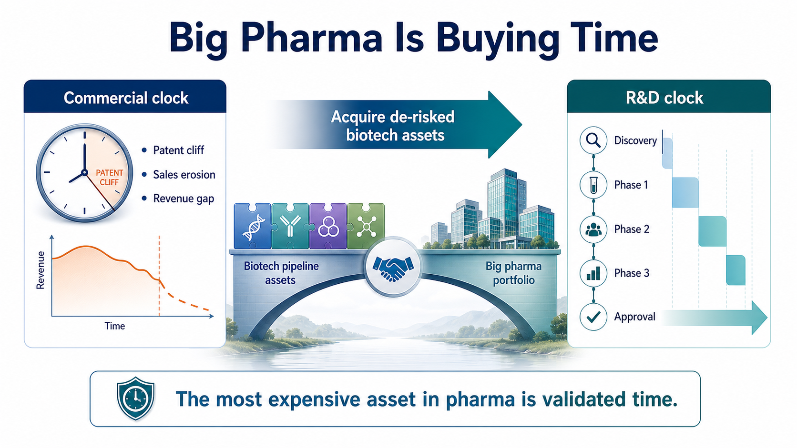
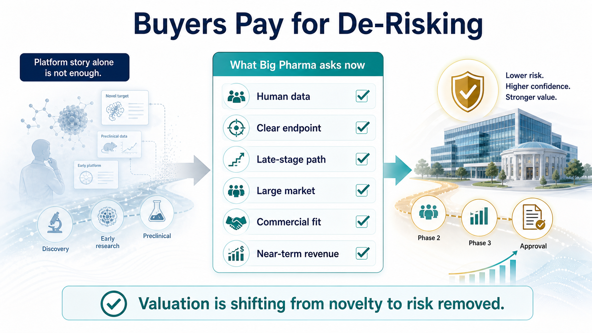
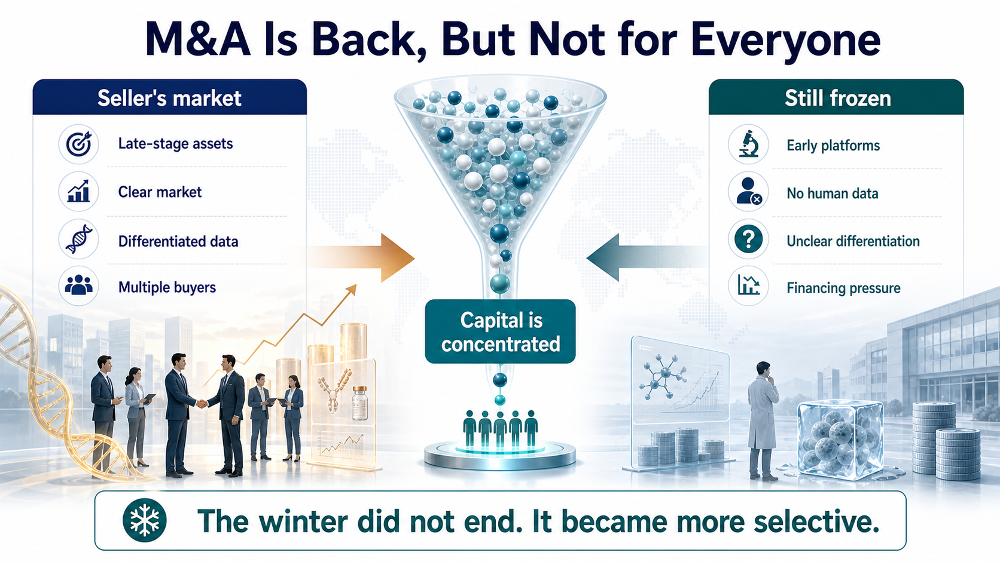
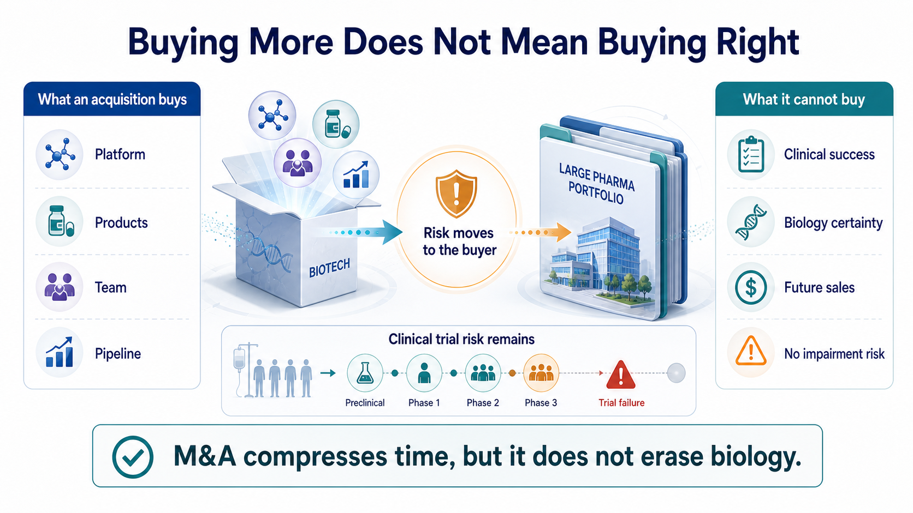

# Big Pharma's $134 Billion M&A Rush: What Is It Really Buying?

Only half of 2026 has passed, and the global pharmaceutical industry's acquisition pace already feels unusually fast.

On June 22, AbbVie announced a roughly $10.9 billion acquisition of Apogee Therapeutics, gaining a long-acting IL-13 immunology pipeline led by zumilokibart for diseases such as atopic dermatitis and asthma. It was AbbVie's largest acquisition in more than five years, and the market read it as an attempt to prepare early for the post-Humira era and even the next stage after Skyrizi and Rinvoq.

Two weeks earlier, GSK agreed to acquire Nuvalent for $10.6 billion, bringing in two lung-cancer targeted therapies, zidesamtinib and neladalkib, that were already under FDA review. This was not an early platform bet. GSK was buying two oncology assets close to the market.

Eli Lilly has not been standing still either. In June, it acquired 4E Therapeutics, a non-opioid pain-drug company, adding to its chronic-pain pipeline. The transaction continued Lilly's broader acquisition and licensing push in pain.

These are not isolated events.

According to industry data cited in the original public post, the first six months of 2026 have already produced 33 biotech acquisitions valued at more than $1 billion, with a combined value of roughly $134 billion. For comparison, all of 2025 had 26 such deals, totaling about $112 billion. In other words, before 2026 is even over, large drugmakers have already spent more on major biotech acquisitions than they did during the entire previous year.

On the surface, it can look as if biotech's good days are back.

But the more important question is not why Big Pharma suddenly has money.

It is this:

Why is Big Pharma suddenly less willing to wait?

## 01 | Big Pharma Is Not Buying Companies. It Is Buying Time.

A drugmaker's fate is often controlled by two clocks.

The first is the commercial clock.

Blockbuster launches, sales ramp-up, patent expiry, generic entry, biosimilar competition and revenue erosion all follow timelines that can be modeled reasonably well. Once exclusivity ends, the original product's sales can fall quickly.

The second is the R&D clock.

This clock is much harder to control. Moving from target discovery to candidate selection, Phase 1, Phase 2, Phase 3 and approval can take more than a decade.

Beautiful early data do not guarantee Phase 2 success. Phase 2 efficacy does not guarantee a clean Phase 3. Even a successful clinical trial can still encounter regulatory, manufacturing or commercial hurdles. Patent cliffs arrive on schedule. New drugs almost never graduate on schedule.

That is Big Pharma's anxiety.

Large drugmakers have cash, global clinical teams, regulatory capability, medical affairs organizations and commercial infrastructure. But none of those resources can instantly mature a program that has only just entered clinical development. If internal R&D cannot fill an approaching revenue gap, the most direct solution is to buy a biotech company that has already traveled the first half of the road.

GSK's Nuvalent deal is a textbook example. Nuvalent did not bring only a laboratory concept. It brought two non-small cell lung cancer targeted therapies already under FDA review. GSK also made clear that the transaction was expected to create near- and medium-term sales opportunities and contribute to revenue beginning in 2027.

AbbVie's Apogee deal follows the same logic. AbbVie does not lack immunology experience. It has the history of Humira, the current growth engines of Skyrizi and Rinvoq, and a deep understanding that immunology is a long-duration market with high patient stickiness and established payment pathways. AbbVie did not buy Apogee because it does not understand immunology. It bought Apogee to purchase time for the next immunology pipeline cycle.

In this M&A wave, the most expensive product is not the company name.

It is time that has already been partially validated by clinical work.

## 02 | Buyers Are No Longer Paying for Stories. They Are Paying for De-Risking.

During the previous biotech boom, a company with a fashionable technology platform could command a large valuation. Cell therapy, gene therapy, mRNA, AI drug discovery, protein degradation and molecular glues could all attract capital if the story felt new enough.

The 2026 buyer looks much more realistic.

Big Pharma is no longer asking only what a technology might do someday. It is asking a tighter set of questions:

How far is this drug from approval?

Does it have human data?

Are the clinical endpoints clear?

Is the addressable market large enough?

Can it plug into our existing commercial system?

Can it generate revenue within a reasonable time frame?

That is why the largest transactions this year have concentrated in oncology, immunology, metabolism and neuroscience. These fields are crowded, but the patient populations, payment pathways and commercial models are relatively legible. For a large drugmaker, a near-registration lung cancer asset is much easier to underwrite than an unproven platform without human validation.

Lilly's serial acquisition behavior points to the same logic. GLP-1 has given Lilly enormous cash flow and market-cap re-rating, but Lilly has not placed its entire future on metabolism. It is buying seeds in pain, oncology, neuroscience and immunology. 4E Therapeutics' non-opioid chronic-pain approach may never become the next Zepbound. But pain is a large market, and non-opioid therapies address a clear unmet need.

The message to biotech is direct:

Interesting science still matters. But interesting science alone is no longer enough.

The assets that can command high acquisition prices are those with partial clinical validation, shorter paths to the market, and a credible ability to reduce the buyer's risk.

The valuation standard for innovative drugs is shifting from "how novel is the technology?" to "how much risk has already been removed?"

## 03 | An M&A Recovery Does Not Mean All Biotech Is Back.

Seeing $134 billion of deal value in half a year makes it easy to conclude that biotech has entered a broad recovery.

The reality is less even.

On one side, Big Pharma is writing $10 billion checks. On the other side, many biotech companies are still laying off staff, cutting pipelines, seeking financing or selling assets. Capital has not returned equally. It has become more concentrated around a small number of late-stage assets and higher-certainty programs.

Good assets are getting more expensive.

Ordinary assets are getting harder to sell.

This is not the whole industry warming up together. It is a more extreme separation.

For companies with late-stage clinical programs, clear markets and differentiated data, this may be a seller's market. When several large drugmakers are looking for growth assets at the same time, the price of the best assets naturally rises.

But for companies with early platforms, limited human data or unclear clinical differentiation, buyers have more choice. They can wait. They can negotiate harder. They can simply skip the asset.

So the $134 billion figure does not mean the capital winter is over.

A better way to say it is that winter has changed shape. Capital still exists, but the door to capital has become narrower. Only innovations that save the buyer time, reduce risk and fit into a commercial system are likely to receive premium pricing.

## 04 | Buying More Does Not Mean Buying Right.

M&A can shorten the R&D timeline. It cannot eliminate biology risk.

Pfizer is the best reminder.

In 2023, Pfizer acquired ADC leader Seagen for $43 billion, hoping to rebuild its oncology business and gain a mature ADC platform. In June 2026, Pfizer reported Phase 3 results for sigvotatug vedotin, one of the Seagen-related ADC programs watched closely by the market. The study did not significantly improve overall survival versus docetaxel in previously treated non-squamous non-small cell lung cancer, and it failed to meet its primary endpoint.

A $43 billion acquisition can buy a technology platform, marketed products, an R&D team and a pipeline.

It cannot buy a guarantee of clinical success.

This is the part of an acquisition boom that is easiest to forget:

Big Pharma does not destroy risk. It moves risk from the biotech company's hands onto its own balance sheet.

The higher the deal price, the higher the future sales requirement. If a core program fails, the buyer does not just absorb an R&D setback. It can face goodwill impairment, strategy resets and shareholder criticism. Today's celebrated transaction can become tomorrow's impairment candidate.

And yet Big Pharma will keep buying.

Because buying wrong is painful, but buying nothing may be more dangerous. Patents expire. Revenue gaps appear. Capital markets do not wait forever for internal R&D to deliver. M&A is not the safest choice. It is often simply the fastest remaining choice.

## Conclusion | Big Pharma Is Not Suddenly Richer. It Is Less Able to Wait.

The $134 billion first-half M&A wave looks like a renewed vote of confidence in innovative drugs.

More precisely, it is Big Pharma paying a premium for anxiety.

Patent cliffs are approaching.

Internal R&D may not be ready to take over on schedule.

The number of late-stage high-quality assets is limited.

Biotech companies with clinical data and shorter paths to revenue naturally become more expensive.

This acquisition wave does not prove that large drugmakers have deeper pockets than before. It proves that time has become more valuable. Big Pharma is not buying hope. It is buying hope that has already been partially proven. It is not buying stories. It is buying the decade of R&D time that someone else has already burned.

The future biotech split will become sharper. Companies with clear data, defined regulatory paths and assets that fit into commercial infrastructure will attract high prices. Companies with only concepts, weak human evidence or no differentiation will still face a cold market.

So this M&A boom is not spring for everyone.

It is a screening process.

The market is telling innovative-drug companies something blunt:

What is truly valuable is not how new you are, but how much time you save the buyer and how much risk you remove.

References:

1. AbbVie / Apogee transaction public coverage  
https://www.marketwatch.com/story/abbvie-would-gain-an-experimental-eczema-drug-by-buying-biotech-report-caf24728

2. GSK / Nuvalent transaction public coverage  
https://www.barrons.com/articles/nuvalent-stock-gsk-deal-89443e68

3. Eli Lilly / 4E Therapeutics transaction public coverage  
https://www.barrons.com/articles/eli-lilly-stock-painkillers-acquisition-8da0dbbe

4. First-half 2026 pharma / biotech M&A figures are summarized from the original public social post's cited industry data.

5. Pfizer sigvotatug vedotin Phase 3 public coverage  
https://www.reuters.com/business/healthcare-pharmaceuticals/pfizers-experimental-lung-cancer-drug-fails-late-stage-study-2026-06-30/

This article is for industry research and knowledge sharing only. It does not constitute investment advice, medical advice, fundraising advice, or a recommendation on any individual security.
