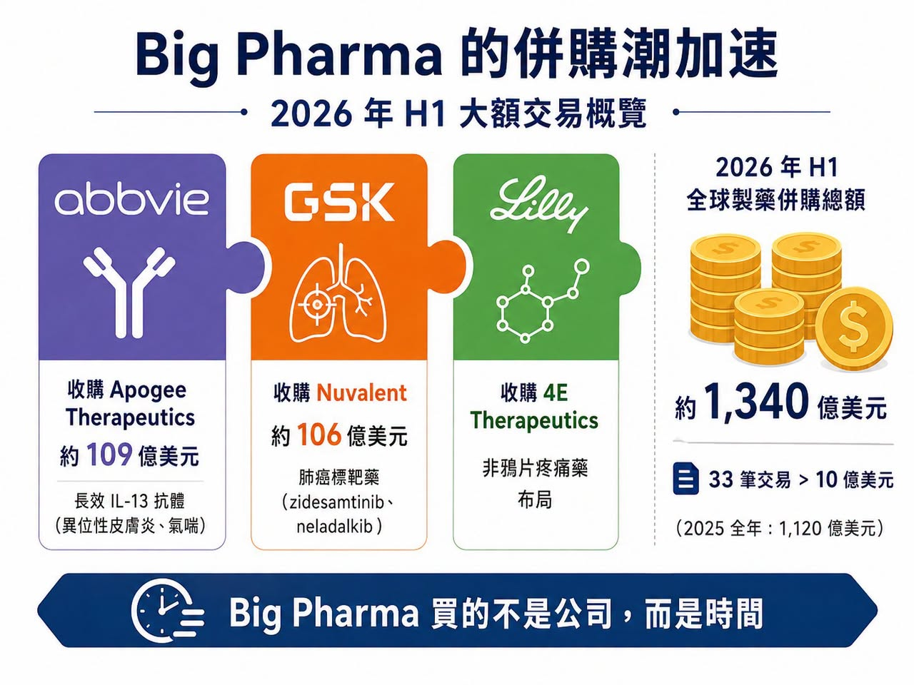
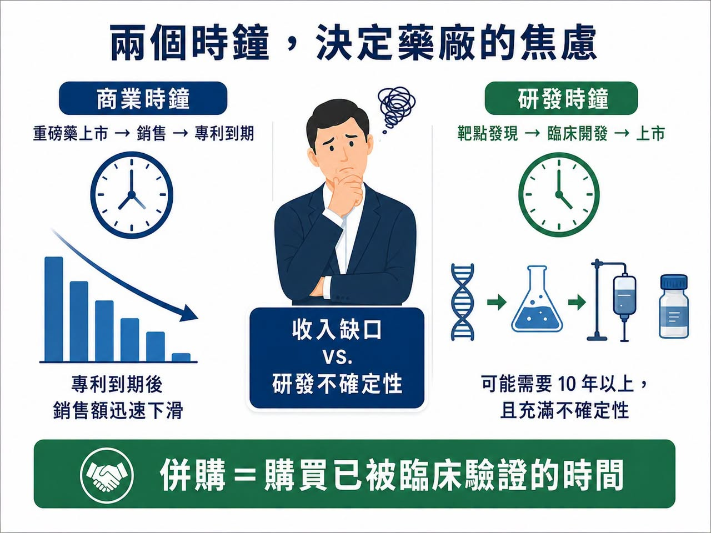
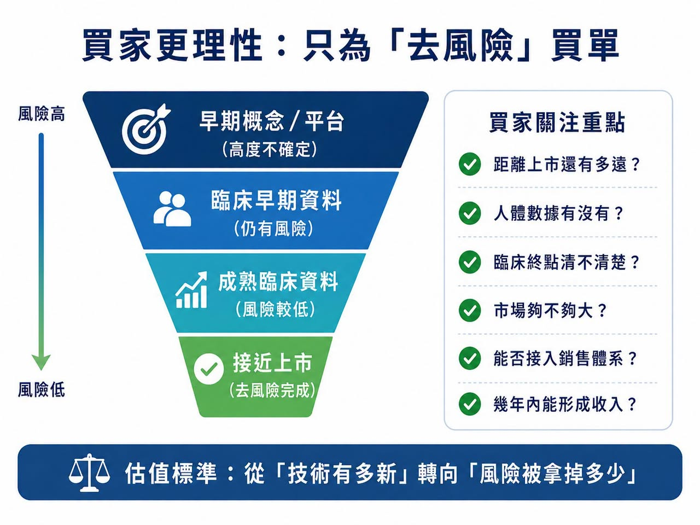
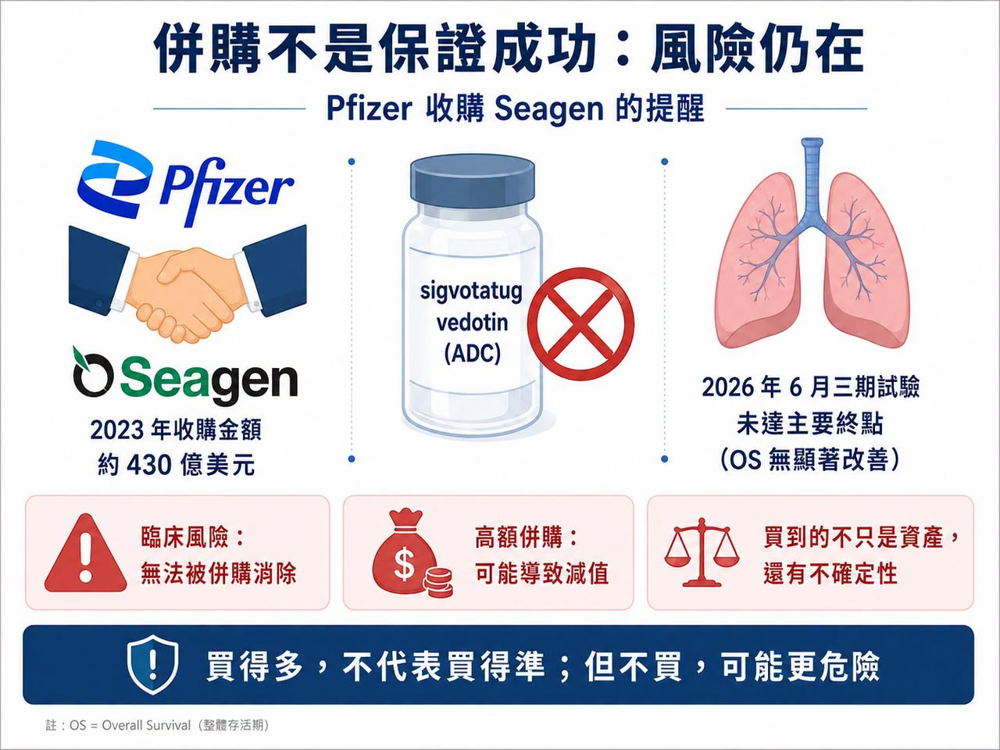

# 半年併購 1,340 億美元：Big Pharma 到底在搶什麼？

2026 年才過一半，全球製藥業的併購節奏已經快到讓人有點恍神。

6 月 22 日，AbbVie 宣布以約 109 億美元收購 Apogee Therapeutics，拿下以異位性皮膚炎、氣喘等免疫疾病為主的長效 IL-13 管線，核心資產是 zumilokibart。這是 AbbVie 五年多來最大的一筆收購，也被市場視為它為後 Humira 時代、甚至後 Skyrizi／Rinvoq 時代提前鋪路。

兩週前，GSK 才以 106 億美元收購 Nuvalent，把兩款進入 FDA 上市審查的肺癌標靶藥 zidesamtinib 和 neladalkib 收進囊中。這不是早期平台賭局，而是 GSK 直接買下兩個接近上市的肺癌資產。

Eli Lilly 也沒有停手。它在 6 月收購非鴉片疼痛藥公司 4E Therapeutics，補強非鴉片慢性疼痛藥物布局。這是 Lilly 延續疼痛領域併購與授權布局的一環。

這些不是孤立事件。

根據產業統計，2026 年前六個月，全球已有 33 筆估值超過 10 億美元的 Biotech 收購案，總金額約 1,340 億美元。相比之下，2025 年全年是 26 筆、1,120 億美元。換句話說，今年才過一半，大型藥廠已經花掉去年全年還更多的併購金額。表面上，Biotech 的好日子好像回來了。但這波併購潮真正值得問的，不是 Big Pharma 為什麼突然有錢。

而是：它們為什麼突然不願意等了？

## 01｜Big Pharma 買的不是公司，是時間

藥廠的命運，常常被兩個時鐘控制。

第一個是商業時鐘。

重磅藥上市、銷售爬坡、專利到期，這些時間點大致可以推估。一旦專利保護結束，學名藥或生物相似藥進場，原廠藥銷售額往往會迅速下滑。

第二個是研發時鐘。

這個時鐘最難控制。從靶點發現、候選藥物、臨床一期、二期、三期到上市，可能要十年以上。

早期數據漂亮，不代表二期成功。二期有效，不代表三期過關。臨床過關，也可能卡在監管、製造或商業化。專利懸崖會準時到來，但新藥從來不會準時畢業，這就是 Big Pharma 的焦慮。

它們有錢、有全球臨床團隊、有法規能力、有醫學事務與銷售網路，但這些資源不能讓一個剛進臨床的管線突然成熟。若自家研發趕不上收入斷層，最直接的方法就是買下一家已經替它走完前半段路的 Biotech。

GSK 收購 Nuvalent，就是典型例子。Nuvalent 帶來的不是一個實驗室概念，而是兩款已進入 FDA 審查的非小細胞肺癌標靶藥。GSK 也明確表示，這筆交易將帶來短中期銷售增長機會，並有望自 2027 年起貢獻收入與改善後續獲利。

AbbVie 收購 Apogee 也是同樣邏輯。AbbVie 並不缺免疫藥。它有 Humira（adalimumab，阿達木單抗）的歷史，有 Skyrizi（risankizumab，瑞莎奇珠單抗）和 Rinvoq（upadacitinib，烏帕替尼）的當下，也知道免疫疾病是長期用藥、患者黏著度高、支付體系成熟的核心市場。它買 Apogee，不是因為自己不懂免疫，而是要替下一輪免疫管線買時間。

這一輪併購潮裡，最昂貴的商品不是公司名稱。

是已經被臨床驗證過的時間。

## 02｜買家不再為故事買單，只為「去風險」買單

上一輪 Biotech 繁榮時期，只要公司有熱門技術平台，就能獲得很高估值。細胞治療、基因治療、mRNA、AI 製藥、蛋白質降解、分子膠，只要故事夠新，就有機會拿到大筆資金。但 2026 年的買家明顯更現實。Big Pharma 現在問的不是「這個技術未來可以做什麼」，而是：

這款藥距離上市還有多遠？

人體數據有沒有？

臨床終點清不清楚？

適應症市場夠不夠大？

能不能接進我現有的銷售體系？

幾年內能不能形成收入？

所以，今年大額交易集中在腫瘤、免疫、代謝、神經科學這些成熟市場。這些領域競爭激烈，但患者族群、支付路徑、商業模式相對清楚。對大型藥廠來說，買一款接近註冊階段的肺癌藥，遠比買一個尚未人體驗證的平台，更容易計算回報。

Lilly 的連續收購，也說明同一件事。GLP-1 為 Lilly 帶來巨大現金流與市值重估，但 Lilly 沒有把未來全部押在代謝。它正在疼痛、腫瘤、神經科學與免疫疾病裡買種子。4E Therapeutics 的非鴉片慢性疼痛路線，未必會成為下一個 Zepbound，但疼痛市場龐大，且非鴉片療法有清楚未滿足需求。

這輪併購潮給 Biotech 的訊號很直接：科學有趣仍然重要，但只有科學有趣，已經不夠。

真正能被高價買走的，是被臨床資料部分驗證、上市路徑更短、能替買方降低風險的資產。

創新藥估值標準，正在從「技術有多新」，轉向「風險已經被拿掉多少」。

## 03｜併購回暖，不等於所有 Biotech 都春天來了

看到半年 1,340 億美元交易額，很容易以為 Biotech 全面復甦。

但現實沒有那麼平均。

一邊是 Big Pharma 開出百億美元支票，另一邊仍有大量 Biotech 在裁員、砍管線、找融資、賣資產。錢沒有平均回來，而是更集中流向少數後期資產與高確定性項目。

好資產越來越貴。

普通資產越來越難賣。

這不是全行業一起回暖，而是分化更劇烈。

對手上有後期臨床、清楚市場、差異化資料的公司來說，現在可能是賣方市場。幾家大藥廠同時尋找增長資產，價格自然被抬高。但對只有早期平台、缺乏人體數據、或臨床結果差異不明顯的公司來說，買方反而更有選擇權。它們可以慢慢看、壓價，甚至直接跳過。

所以，1,340 億美元不是資本寒冬結束，更準確地說，是寒冬改變了形狀，資金仍然存在，但通往資金的門變窄了。只有真正能替買方節省時間、降低風險、接上商業化體系的創新，才有機會拿到高價。

## 04｜買得多，不代表買得準

併購可以縮短研發時間，但不能消滅生物學風險。

Pfizer 就是最好的提醒。

2023 年，Pfizer 以 430 億美元收購 ADC 龍頭 Seagen，希望重建腫瘤業務、取得成熟 ADC 平台。但 2026 年 6 月，Pfizer 公布 sigvotatug vedotin 三期結果。這是 Seagen 交易後市場高度關注的 ADC 之一。結果顯示，sigvotatug vedotin 在既往治療過的非鱗狀非小細胞肺癌患者中，未能相較 docetaxel（多西他賽）顯著改善整體存活期，試驗未達主要終點。

430 億美元可以買下技術平台、上市產品、研發團隊和管線組合，但買不到臨床成功保證，這也是併購熱潮最容易被忽略的一面：

Big Pharma 不是把風險消滅了，只是把風險從 Biotech 手裡搬到自己資產負債表上。

交易價格越高，未來產品銷售額要求越高。如果核心項目失敗，買方不只承受研發損失，也可能面臨商譽減值、策略調整、股東質疑。今天的明星交易，幾年後也可能變成減值名單上的名字。

但即便如此，Big Pharma 還是會繼續買。

因為買錯很痛，但什麼都不買，可能更危險。專利會到期，收入缺口會出現，資本市場也不會永遠等自家研發慢慢交卷。併購不是最安全的選擇。只是它常常是剩下選項裡最快的一個。

## 結語｜Big Pharma 不是突然更有錢，而是越來越等不起
半年 1,340 億美元，看起來像資本重新相信創新藥，但更準確地說，是 Big Pharma 正在為焦慮支付溢價。

專利懸崖越來越近。

自家研發不一定能準時接棒。

後期資產數量有限。

有臨床資料、能縮短上市時間的 Biotech，自然變得更貴。

這輪併購潮真正證明的，不是大型藥廠口袋有多深，而是時間變得多麼昂貴。Big Pharma 買的不是希望。是已經被部分證明的希望。買的不是故事。是別人替它燒掉的十年研發時間。

未來 Biotech 的分化會更明顯。能拿出清楚資料、明確路徑、可接入商業化體系的公司，會被高價爭搶。只剩概念、缺乏人體資料、或沒有差異化的公司，仍然會很冷。

所以，這波 M&A 熱潮不是所有人的春天。

它更像是一場篩選。市場正在用最直接的方式告訴創新藥公司：

真正值錢的，不是你有多新，而是你替買方省下了多少時間、拿掉了多少風險。

參考資料：

[0]: 各公司官網與公開資料

[1]: AbbVie / Apogee 交易公開報導  
https://www.marketwatch.com/story/abbvie-would-gain-an-experimental-eczema-drug-by-buying-biotech-report-caf24728

[2]: GSK / Nuvalent 交易公開報導  
https://www.barrons.com/articles/nuvalent-stock-gsk-deal-89443e68

[3]: Eli Lilly / 4E Therapeutics 交易公開報導  
https://www.barrons.com/articles/eli-lilly-stock-painkillers-acquisition-8da0dbbe

[4]: 2026 年上半年製藥 / Biotech M&A 統計，依原始社群公開稿引用之產業統計資料整理。

[5]: Pfizer sigvotatug vedotin 三期試驗未達主要終點相關公開報導  
https://www.reuters.com/business/healthcare-pharmaceuticals/pfizers-experimental-lung-cancer-drug-fails-late-stage-study-2026-06-30/

---

本文僅供產業研究與知識分享，不構成投資、醫療、募資或個股建議。
