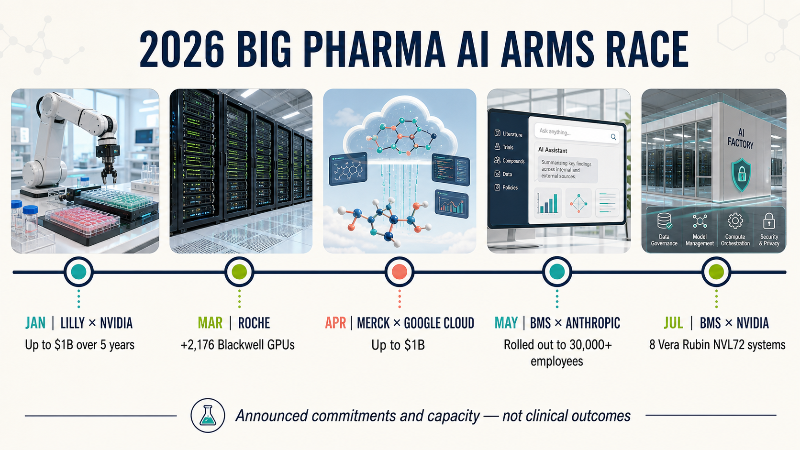
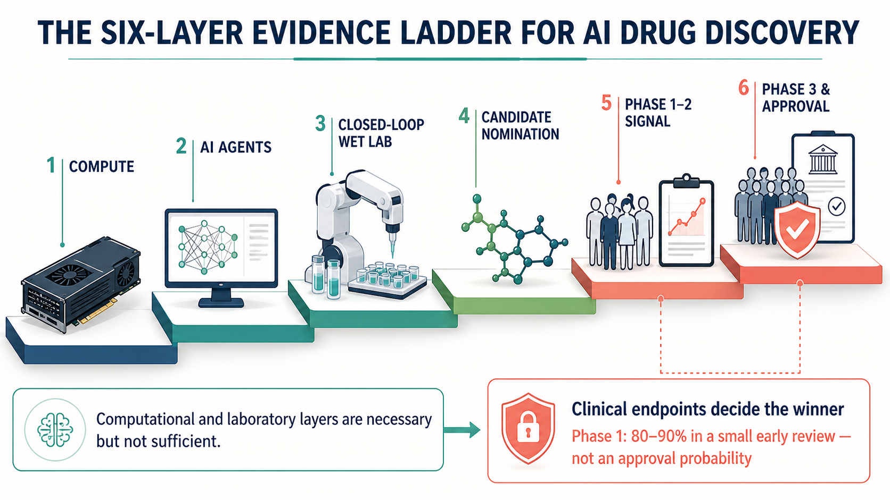
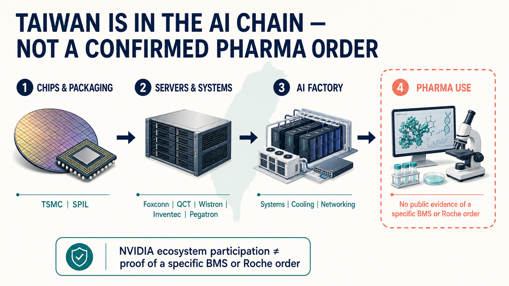

# NVIDIA Enters Pharma: BMS Readies 576 GPUs as Lilly Commits Up to $1 Billion

Bristol Myers Squibb is preparing to deploy eight NVIDIA DGX Vera Rubin NVL72 systems. Based on NVIDIA's published specifications, the installation implies a total of 576 Rubin GPUs.

Eli Lilly has gone even further. The company and NVIDIA are establishing a joint AI laboratory with a planned five-year commitment of up to $1 billion.

What Big Pharma fears now is falling behind the learning curve.

Compute, models, laboratory robotics, clinical documentation and decades of accumulated failure data are being connected into a single research-and-development chain. This contest has moved far beyond buying a few chatbots to help employees write reports.

As BMS, Lilly, Roche, Merck, Novo Nordisk and Sanofi all increase their commitments, the central question in AI-enabled drug development has changed. Running a model faster is only the beginning. The eventual winners will be the companies that make the next experiment faster and more informative, then carry a candidate through the unforgiving test of human clinical trials.

## 01 | BMS is building three layers at once

BMS's 2026 moves provide a particularly useful example.

In May, the company announced that it would roll out Anthropic's Claude Enterprise across its global operations for more than 30,000 employees. The scope spans research, clinical development, manufacturing, quality, commercial operations and enterprise knowledge. BMS wants the platform to help organize development documents, connect internal knowledge and allow AI agents to participate in selected workflows.

In July, BMS announced the construction of an NVIDIA DGX SuperPOD. NVIDIA subsequently disclosed that the system would comprise eight DGX Vera Rubin NVL72 systems. Each carries 72 Rubin GPUs, which yields the 576-GPU figure.

BMS described the installation as the most powerful single-company-owned NVIDIA infrastructure in the life-sciences industry. That claim has a narrow comparison set and comes from the two companies involved, so it should not be treated as an independent ranking. The scale of the investment nevertheless sends a clear signal: pharmaceutical companies increasingly want core compute capacity under their own control.

The reason is data.

Published success stories are available to everyone. Large pharmaceutical companies possess something far scarcer: unpublished failed experiments, compound-toxicity records, patient-stratification data, manufacturing deviations and clinical-operating histories accumulated over decades. These datasets involve intellectual property and patient privacy. If they can be used to train models inside a controlled environment, the competitive moat can extend beyond algorithms to the data itself.

BMS has said that AI now participates in the design of all its small-molecule programs and most of its large-molecule programs. That demonstrates depth of use, not drug success. A long clinical road still separates designing a molecule from proving that it is safe and effective in humans.

One week later, Schrödinger introduced an early-access version of Bunsen, an AI co-scientist that can plan, execute and interpret computational molecular-discovery workflows. The important boundary is that Schrödinger's announcement did not name BMS as a Bunsen customer. Joining the two announcements into a supposed "BMS-Bunsen" relationship would go beyond the available evidence.

## 02 | Big Pharma is buying an entire R&D factory

BMS is not acting alone. The 2026 AI infrastructure ledger is already crowded.

### January | Lilly and NVIDIA

The companies announced a joint five-year commitment of up to $1 billion to establish an AI co-innovation laboratory in the San Francisco Bay Area. The plan is to connect a computational "dry lab" with a robotic "wet lab," allowing AI to propose designs, machines to run experiments and the results to flow back into the model in a near-continuous cycle.

### March | Roche

Roche announced the addition of 2,176 NVIDIA Blackwell GPUs. Together with cloud resources, its hybrid architecture exceeds 3,500 GPUs. The intended uses span drug discovery, pathology, diagnostics, manufacturing digital twins and digital health.

### April | Merck & Co. and Google Cloud

Merck announced a multiyear collaboration of up to $1 billion to deploy Gemini Enterprise across research, manufacturing, commercial operations and corporate functions. This is the U.S. company Merck & Co., known as MSD outside the United States and Canada, not Germany's Merck KGaA.

### April | Novo Nordisk and OpenAI

Their strategic collaboration reaches from candidate discovery to manufacturing, supply chain and commercial operations, with global integration planned to progress through the end of 2026.

### An earlier foundation | Sanofi and Owkin

Sanofi moved earlier. In 2021, it made a $180 million equity investment in Owkin and established a separate three-year collaboration worth $90 million. The program uses federated learning to analyze multimodal data distributed across hospitals in search of cancer biomarkers and treatment-response patterns.

Viewed together, these investments show that Big Pharma is not buying one uniform form of AI.

Some companies are building compute first. Others are deploying enterprise-wide agents, while still others are connecting models directly to laboratory operations. Hardware expenditure is only the admission price. Whether proprietary data, scientific judgment, experimental execution and regulatory records can be connected into a closed learning loop will determine whether the spending becomes an R&D asset or merely an expensive server room.

## 03 | AI can move faster, but the drug still has to work in people

The most easily misread statistic in AI drug discovery is the claim that Phase 1 success rates reach 80% to 90%.

That range comes from a 2024 early review of programs developed by AI-native companies. The sample remained small, companies used different definitions of what counted as "AI-discovered," and public disclosure may have favored successful programs. More importantly, Phase 1 is primarily designed to evaluate safety and dosing. It cannot by itself establish whether a drug meaningfully treats a disease.

For Phase 2, the review observed a success rate of roughly 40%, much closer to historical norms. In other words, AI may be improving the selection of molecules that look more drug-like, but it has not yet proved that it understands complex human disease better.

Two of the most closely watched programs illustrate the evidence boundary.

Insilico Medicine's rentosertib is a pulmonary-fibrosis candidate whose target identification and molecular design used generative AI. In 2025, *Nature Medicine* published its randomized Phase 2a study. Seventy-one participants were treated for 12 weeks, and the highest-dose group produced an encouraging signal on a secondary forced-vital-capacity endpoint. Yet the study was small and short, 16 participants discontinued early, and the paper itself called for larger and longer trials.

MindRank's MDR-001 is an oral small-molecule GLP-1 candidate. In February 2026, the company announced that the first participant had been dosed in a Chinese Phase 3 study expected to enroll about 750 people. That places the program among the most clinically advanced AI-assisted drug candidates, but starting Phase 3 is not the same as succeeding in Phase 3. The company's Phase 2 summary also still requires support from complete data.

The right conclusion is therefore narrower. 2026 may be a year in which AI-designed or AI-assisted drugs face increasingly demanding clinical stress tests. It is not yet the year in which AI has been clinically proven as a superior drug-development system.

## 04 | Taiwan has a role, but a supply-chain list is not a purchase order

Taiwan's most direct connection to this wave of pharmaceutical investment lies in AI infrastructure.

NVIDIA's published Vera Rubin ecosystem includes Taiwanese companies across chips, packaging, systems and volume manufacturing. TSMC, SPIL under ASE Technology Holding, Foxconn, Quanta's QCT, Wistron, Inventec and Pegatron are among the companies identified in those layers. NVIDIA has also said that the relevant platforms have 150 ecosystem partners in Taiwan.

There is still no public evidence showing which Taiwanese supplier, if any, will fill a specific part of the BMS or Roche deployments. Appearing in NVIDIA's ecosystem indicates the ability to participate in the broader market. It does not establish that a company has won a particular pharmaceutical order, and it cannot be translated directly into revenue.

For Taiwan's biotech industry, the second lesson is even sharper.

Pharmaceutical companies are willing to spend heavily because they possess decades of high-quality, traceable data, including failures. When formats are inconsistent, experiments cannot be reproduced and clinical fields do not connect, even the strongest model can do little more than organize noise. The AI era will amplify the value of data assets, but it will amplify data debt as well.

## Conclusion | The final judge is still the patient's clinical outcome

GPU counts are easy to compare, and $1 billion makes an irresistible headline. Drug development, however, has never been won by a leaderboard.

Three questions now deserve sustained attention. Can a pharmaceutical company turn one experiment into a better next decision? Can AI-designed candidates preserve an advantage through Phase 2 and Phase 3? Can the capital being committed ultimately produce more useful medicines?

BMS and Lilly have placed large bets on the table. The final judge remains the same: clinical outcomes in patients.

## References

1. [Bristol Myers Squibb: building an NVIDIA Vera Rubin AI factory](https://news.bms.com/news/corporate-financial/2026/Bristol-Myers-Squibb-to-Build-the-Most-Powerful-AI-Factory-in-Life-Sciences-with-NVIDIA/default.aspx)
2. [NVIDIA: BMS to deploy eight DGX Vera Rubin NVL72 systems](https://blogs.nvidia.com/blog/bristol-myers-squibb-building-life-science-industrys-most-advanced-ai-factory-on-nvidia-vera-rubin/)
3. [NVIDIA: DGX Vera Rubin NVL72 specifications](https://www.nvidia.com/en-us/data-center/dgx-vera-rubin-nvl72/)
4. [Bristol Myers Squibb: Claude Enterprise rollout to more than 30,000 employees](https://news.bms.com/news/corporate-financial/2026/Bristol-Myers-Squibb-Announces-Strategic-Agreement-with-Anthropic-to-Position-Claude-Enterprise-as-the-Shared-Intelligence-Platform-Across-Its-Global-Operations/default.aspx)
5. [Schrödinger: Bunsen early access for molecular discovery](https://ir.schrodinger.com/press-releases/news-details/2026/Schrdinger-Introduces-Bunsen-an-AI-Co-Scientist-for-Molecular-Discovery/default.aspx)
6. [Eli Lilly: five-year NVIDIA co-innovation laboratory commitment of up to $1 billion](https://investor.lilly.com/news-releases/news-release-details/nvidia-and-lilly-announce-co-innovation-ai-lab-reinvent-drug)
7. [Roche: addition of 2,176 Blackwell GPUs](https://www.roche.com/media/releases/med-cor-2026-03-16)
8. [Merck & Co.: multiyear Google Cloud collaboration of up to $1 billion](https://www.merck.com/news/merck-and-google-cloud-partner-to-accelerate-agentic-ai-enterprise-transformation/)
9. [Novo Nordisk: strategic collaboration with OpenAI](https://www.novonordisk.com/content/nncorp/global/en/news-and-media/news-and-ir-materials/news-details.html?id=916532)
10. [Sanofi: equity investment in Owkin and a three-year research collaboration](https://www.sanofi.com/en/media-room/press-releases/2021/2021-11-18-06-30-00-2336966)
11. [Nature Medicine: randomized Phase 2a study of rentosertib](https://www.nature.com/articles/s41591-025-03743-2)
12. [ClinicalTrials.gov: rentosertib study NCT05938920](https://clinicaltrials.gov/study/NCT05938920)
13. [MindRank: first participant dosed in the Chinese Phase 3 study of MDR-001](https://www.mindrank.ai/en/news/detail/155)
14. [Drug Discovery Today: 2024 review of clinical success rates for AI-discovered drugs](https://pubmed.ncbi.nlm.nih.gov/38692505/)
15. [NVIDIA: Vera Rubin production and Taiwan supply-chain partners](https://nvidianews.nvidia.com/news/vera-rubin-full-production-agentic-ai-factory)
16. [NVIDIA: Taiwan's AI infrastructure ecosystem](https://blogs.nvidia.com/blog/taiwan-ecosystem-ai-infrastructure/)

Verification cutoff: August 11, 2026.

## Disclaimer

This article provides biotech-industry information and analysis based on public sources. It is not medical advice, diagnostic guidance, treatment advice or investment advice. Many company investment figures discussed here are multiyear ceilings or plans rather than amounts already spent. Infrastructure scale, early clinical signals and supply-chain ecosystem participation do not establish drug success, approval probability or a specific supplier order.
