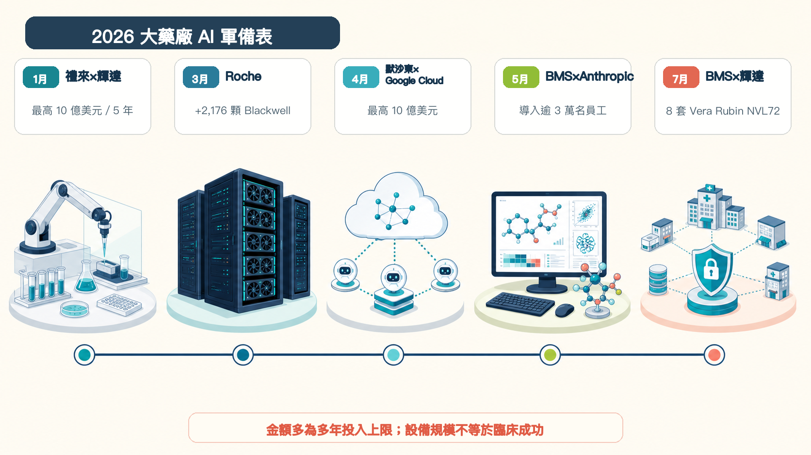
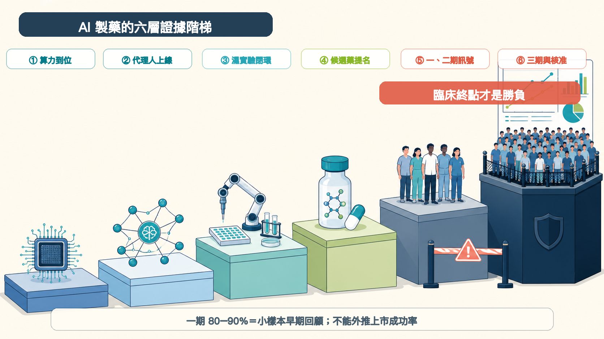
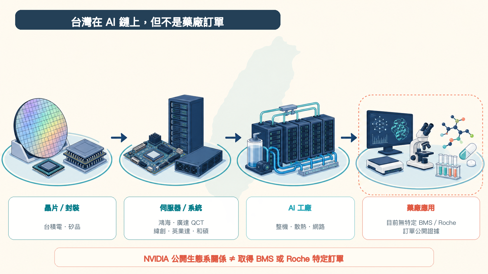

# 輝達殺進製藥業！BMS 搶 576 顆 GPU，禮來砸 10 億美元

BMS 準備部署 8 套 NVIDIA DGX Vera Rubin NVL72。按 NVIDIA 公布的規格推算，裡面合計有 576 顆 Rubin GPU。

禮來更直接：與 NVIDIA 共建 AI 實驗室，五年投入上限 10 億美元。

大藥廠現在怕的，是學習曲線落後。

算力、模型、實驗機器人、臨床文件與數十年累積的失敗資料，正被接成同一條研發鏈。這場競爭早已超過「買幾個聊天機器人、替員工寫報告」的層次。

當 BMS、禮來、Roche、默沙東、諾和諾德、Sanofi 同時加碼，AI 製藥的勝負也換了題目：模型能不能跑得快，只是起點；誰能讓下一次實驗更快、更準，最後把候選藥送過人體試驗，才有資格談贏家。

## 01｜BMS 一口氣補齊三層

BMS 今年的動作很有代表性。

5 月，公司宣布把 Anthropic 的 Claude Enterprise 導入全球營運，服務超過 3 萬名員工，範圍橫跨研究、臨床開發、製造、品質、商務與企業知識。BMS 希望它能協助整理開發文件、串接內部知識，甚至讓 AI 代理人參與部分工作流程。

7 月，BMS 再宣布建置 NVIDIA DGX SuperPOD。NVIDIA 隨後披露，系統由 8 套 DGX Vera Rubin NVL72 組成；每套搭載 72 顆 Rubin GPU，換算就是 576 顆。

BMS 把它稱為生命科學界最強大的單一公司自有 NVIDIA 基礎設施。這句話有很窄的比較範圍，也出自合作雙方，不能當成獨立排行榜。但投資規模釋放的訊號很清楚：藥廠開始把核心算力留在自己手上。

原因就在資料。

論文裡的成功案例人人都看得到。大藥廠手上那些沒有公開的失敗實驗、化合物毒性、病人分層、製程偏差與臨床操作紀錄，反而更稀缺。這些資料牽涉智慧財產與病人隱私，若能留在受控環境中訓練模型，護城河就會從演算法延伸到資料本身。

BMS 表示，AI 已參與公司所有小分子計畫，以及多數大分子計畫的設計。這證明的是「使用深度」，還不是「藥物成功」。從設計一個分子，到在人體裡證明安全、有效，中間仍隔著漫長的臨床路。

一週後，Schrödinger 也推出分子研發代理人 Bunsen 的早期使用版本，可自行規劃、執行並解讀計算流程。值得注意的是，官方公告沒有把 BMS 列為 Bunsen 客戶。把兩件事硬接成「BMS×Bunsen」，目前證據不足。

## 02｜大藥廠買的是一整座研發工廠

BMS 並不孤單。2026 年的軍備表，已經排得很長：

### 1 月｜禮來×NVIDIA

雙方宣布五年共同投入最高 10 億美元，在舊金山灣區建立 AI 共同創新實驗室。規劃把運算端的「乾實驗室」與機器人「濕實驗室」接起來，讓 AI 提出設計、機器執行實驗、結果再回饋模型，朝 24 小時循環運作前進。

### 3 月｜Roche

新增 2,176 顆 NVIDIA Blackwell GPU；加上雲端資源，整體混合架構超過 3,500 顆。用途涵蓋藥物研發、病理、診斷、製造數位分身與數位醫療。

### 4 月｜美國默沙東×Google Cloud

多年合作投入上限 10 億美元，導入 Gemini Enterprise，覆蓋研發、製造、商務與公司營運。這裡指的是 Merck & Co.，不是德國 Merck KGaA。

### 4 月｜諾和諾德×OpenAI

從候選藥發現一路延伸到製造、供應鏈與商務，並預計在 2026 年底前逐步完成全球整合。

### 較早布局｜Sanofi×Owkin

Sanofi 早在 2021 年就投資 Owkin 1.8 億美元，另設三年 9,000 萬美元合作，利用聯邦學習分析分散在醫院的多模態資料，尋找癌症標記與治療反應。

把這些交易放在一起，會發現大藥廠要的不是同一種 AI。

有人先補算力，有人先鋪全公司的代理人，也有人把模型直接接進實驗室。硬體支出只是門票。能不能把專有資料、科學家判斷、實驗執行與法規紀錄連成閉環，才會決定這筆錢是研發資產，還是昂貴的機房。

## 03｜AI 跑得快，藥還是得過人體這一關

AI 製藥最容易被誤讀的數字，是「一期成功率 80%到90%」。

這個區間來自 2024 年一篇針對 AI 原生公司的早期回顧。樣本數仍小，各家公司對「AI 發現」的定義不同，公開資料也可能偏向成功項目。更重要的是，一期主要看安全性與劑量，不能直接回答藥物有沒有治療效果。

到了二期，該回顧觀察到的成功率約 40%，已接近歷史水準。換句話說，AI 可能更會挑出「像藥的分子」，卻尚未證明它更懂複雜的人體疾病。

目前最受矚目的兩個案例，也把證據邊界畫得很清楚。

Insilico Medicine 的 rentosertib，是用生成式 AI 找到標靶並設計的肺纖維化候選藥。2025 年《Nature Medicine》刊登其 IIa 期隨機對照研究：共 71 人、治療 12 週，最高劑量組的肺活量次要終點出現鼓舞訊號。然而樣本小、追蹤短，16 人提前退出；論文本身也要求更大、更長的研究。

中國 MindRank 的口服小分子 GLP-1 藥物 MDR-001，已於 2026 年 2 月完成中國三期首位受試者給藥，預計約 750 人參與。它確實站上目前 AI 輔助藥物最前面的臨床位置，但三期啟動不等於三期成功，公司公布的二期摘要也仍需要完整資料支持。

所以，2026 年可以是 AI 藥物接受臨床壓力測試的一年，還不能叫作「AI 已被臨床證明的一年」。

## 04｜台灣有位置，但別把供應鏈名單當訂單

這波大藥廠投資，台灣最直接的交集在 AI 基礎設施。

NVIDIA 公布的 Vera Rubin 生態系裡，台積電、日月光集團旗下矽品、鴻海、廣達旗下 QCT、緯創、英業達、和碩等台灣業者，都出現在晶片、封裝、系統與整機量產環節。NVIDIA 更表示，相關平台在台灣有 150 家生態系夥伴。

但目前沒有公開資料能證明，BMS 或 Roche 的這批設備由哪一家台廠承接。出現在 NVIDIA 供應鏈，代表有能力參與整體市場；它不等於拿到特定藥廠訂單，更不能直接換算營收。

對台灣生技業來說，另一個提醒更尖銳。

藥廠願意花大錢的原因，是手裡有數十年高品質、可追溯、包含失敗結果的資料。若資料格式混亂、實驗無法重現、臨床欄位彼此不通，再強的模型也只能整理雜訊。AI 時代會放大資料資產，也會放大資料債。

## 寫在最後

GPU 數量很好比，10 億美元也很好寫進標題。可惜新藥研發從來不靠排行榜決勝。

接下來值得盯的，有三件事：大藥廠能否把一次實驗變成下一次決策；AI 設計的候選藥能否在二、三期維持優勢；投入的資本最後能不能換成更多好藥。

BMS 和禮來已經把籌碼推上桌。最後的裁判，依舊是病人的臨床結果。

## 參考資料

1. [Bristol Myers Squibb：建置 NVIDIA Vera Rubin AI factory](https://news.bms.com/news/corporate-financial/2026/Bristol-Myers-Squibb-to-Build-the-Most-Powerful-AI-Factory-in-Life-Sciences-with-NVIDIA/default.aspx)
2. [NVIDIA：BMS 將部署 8 套 DGX Vera Rubin NVL72](https://blogs.nvidia.com/blog/bristol-myers-squibb-building-life-science-industrys-most-advanced-ai-factory-on-nvidia-vera-rubin/)
3. [NVIDIA：DGX Vera Rubin NVL72 規格](https://www.nvidia.com/en-us/data-center/dgx-vera-rubin-nvl72/)
4. [Bristol Myers Squibb：Claude Enterprise 導入逾 3 萬名員工](https://news.bms.com/news/corporate-financial/2026/Bristol-Myers-Squibb-Announces-Strategic-Agreement-with-Anthropic-to-Position-Claude-Enterprise-as-the-Shared-Intelligence-Platform-Across-Its-Global-Operations/default.aspx)
5. [Schrödinger：Bunsen 分子研發代理人開放早期使用](https://ir.schrodinger.com/press-releases/news-details/2026/Schrdinger-Introduces-Bunsen-an-AI-Co-Scientist-for-Molecular-Discovery/default.aspx)
6. [Eli Lilly：與 NVIDIA 建立五年最高 10 億美元共同創新實驗室](https://investor.lilly.com/news-releases/news-release-details/nvidia-and-lilly-announce-co-innovation-ai-lab-reinvent-drug)
7. [Roche：新增 2,176 顆 Blackwell GPU](https://www.roche.com/media/releases/med-cor-2026-03-16)
8. [Merck & Co.：與 Google Cloud 建立多年最高 10 億美元合作](https://www.merck.com/news/merck-and-google-cloud-partner-to-accelerate-agentic-ai-enterprise-transformation/)
9. [Novo Nordisk：與 OpenAI 建立策略合作](https://www.novonordisk.com/content/nncorp/global/en/news-and-media/news-and-ir-materials/news-details.html?id=916532)
10. [Sanofi：投資 Owkin 並建立三年研究合作](https://www.sanofi.com/en/media-room/press-releases/2021/2021-11-18-06-30-00-2336966)
11. [Nature Medicine：rentosertib IIa 期隨機對照研究](https://www.nature.com/articles/s41591-025-03743-2)
12. [ClinicalTrials.gov：rentosertib NCT05938920](https://clinicaltrials.gov/study/NCT05938920)
13. [MindRank：MDR-001 中國三期首位受試者給藥](https://www.mindrank.ai/en/news/detail/155)
14. [Drug Discovery Today：AI-discovered drugs 臨床成功率回顧](https://pubmed.ncbi.nlm.nih.gov/38692505/)
15. [NVIDIA：Vera Rubin 量產與台灣供應鏈夥伴](https://nvidianews.nvidia.com/news/vera-rubin-full-production-agentic-ai-factory)
16. [NVIDIA：台灣 AI 基礎設施生態系](https://blogs.nvidia.com/blog/taiwan-ecosystem-ai-infrastructure/)

查證截止日：2026 年 8 月 11 日。

## 免責聲明

本文為生技醫藥產業與公開資料整理，不構成醫療診斷、治療建議或投資建議。文中公司投資金額多為多年投入上限或規劃，不代表已支付金額；基礎設施規模、早期臨床訊號與供應鏈生態系關係，均不等同於新藥成功、核准機率或特定訂單。
